## 主要是拷打基础方向，重点拷打了网络IO、Linux 操作系统、网络协议、mysql、算法。

# epoll的工作原理

先用 epoll_create 创建一个 epoll 对象 epfd，再通过 epoll_ctl 将需要监视的 socket 添加到epfd中，最后调用 epoll_wait 等待数据，当epoll_wait返回后，就可以遍历它返回的事件列表，然后根据事件类型做出相应的处理。

```c
int s = socket(AF_INET, SOCK_STREAM, 0);
bind(s, ...);
listen(s, ...);

int epfd = epoll_create(...);
epoll_ctl(epfd, ...); //将所有需要监听的socket添加到epfd中

while(1) {
    int n = epoll_wait(...);
    for(接收到数据的socket){
        //处理
    }
}
```

# epoll、select、poll的区别？

select 实现多路复用的方式是，将已连接的 Socket 都放到一个**文件描述符集合**，然后调用 select 函数将文件描述符集合**拷贝**到内核里，让内核来检查是否有网络事件产生，检查的方式很粗暴，就是通过**遍历**文件描述符集合的方式，当检查到有事件产生后，将此 Socket 标记为可读或可写， 接着再把整个文件描述符集合**拷贝**回用户态里，然后用户态还需要再通过**遍历**的方法找到可读或可写的 Socket，然后再对其处理。

所以，对于 select 这种方式，需要进行 **2 次「遍历」文件描述符集合**，一次是在内核态里，一个次是在用户态里 ，而且还会发生 **2 次「拷贝」文件描述符集合**，先从用户空间传入内核空间，由内核修改后，再传出到用户空间中。

select 使用固定长度的 BitsMap，表示文件描述符集合，而且所支持的文件描述符的个数是有限制的，在 Linux 系统中，由内核中的 FD_SETSIZE 限制， 默认最大值为 1024，只能监听 0~1023 的文件描述符。

poll 不再用 BitsMap 来存储所关注的文件描述符，取而代之用动态数组，以链表形式来组织，突破了 select 的文件描述符个数限制，当然还会受到系统文件描述符限制。

但是 poll 和 select 并没有太大的本质区别，**都是使用「线性结构」存储进程关注的 Socket 集合，因此都需要遍历文件描述符集合来找到可读或可写的 Socket，时间复杂度为 O(n)，而且也需要在用户态与内核态之间拷贝文件描述符集合**，这种方式随着并发数上来，性能的损耗会呈指数级增长。

epoll 通过两个方面，很好解决了 select/poll 的问题。

- *第一点*，epoll 在内核里使用**红黑树来跟踪进程所有待检测的文件描述字**，把需要监控的 socket 通过 epoll_ctl() 函数加入内核中的红黑树里，红黑树是个高效的数据结构，增删改一般时间复杂度是 O(logn)。而 select/poll 内核里没有类似 epoll 红黑树这种保存所有待检测的 socket 的数据结构，所以 select/poll 每次操作时都传入整个 socket 集合给内核，而 epoll 因为在内核维护了红黑树，可以保存所有待检测的 socket ，所以只需要传入一个待检测的 socket，减少了内核和用户空间大量的数据拷贝和内存分配。
- *第二点*， epoll 使用**事件驱动**的机制，内核里**维护了一个链表来记录就绪事件**，当某个 socket 有事件发生时，通过**回调函数**内核会将其加入到这个就绪事件列表中，当用户调用 epoll_wait() 函数时，只会返回有事件发生的文件描述符的个数，不需要像 select/poll 那样轮询扫描整个 socket 集合，大大提高了检测的效率。

可以看到 epoll 相关的接口作用：

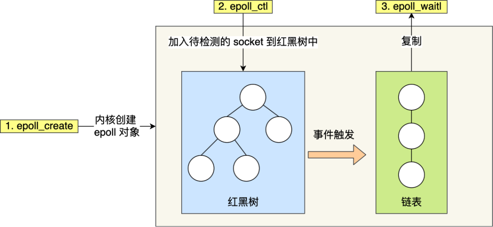

img

epoll 的方式即使监听的 Socket 数量越多的时候，效率不会大幅度降低，能够同时监听的 Socket 的数目也非常的多了，上限就为系统定义的进程打开的最大文件描述符个数。因而，**epoll 被称为解决 C10K 问题的利器**。

# select线性表要从用户态复制到内核态，具体怎么复制的？

用户态准备一个文件描述符集合，通常是使用fd_set数据结构来表示，该集合包含要监视的文件描述符。调用select系统调用时，将该文件描述符集合作为参数传递给select函数。

内核态的select函数接收到用户态传递的文件描述符集合后，会在内核中创建一个与用户态相对应的数据结构 fdset，然后将用户空间的ufdset拷贝到内核空间fdset。

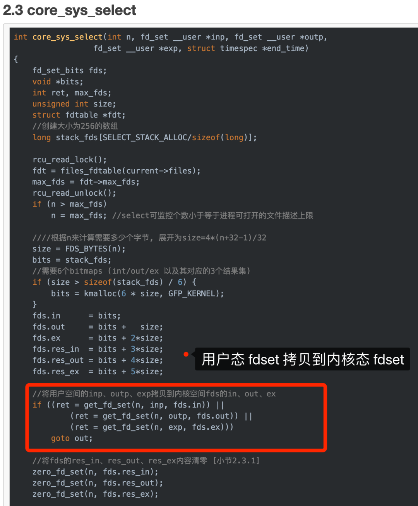

# 进程、线程、协程的概念

- 进程（Process）：进程是操作系统中的一个执行实例，它拥有独立的内存空间和资源。每个进程都是独立运行的，拥有自己的地址空间、文件句柄、环境变量等。进程间通信需要通过特定的机制，如管道、消息队列、共享内存等。
- 线程（Thread）：线程是进程的一部分，是在同一进程内并发执行的执行单元。不同线程共享同一进程的内存空间和资源，包括全局变量、堆、文件描述符等。线程可以更轻量级地创建、切换和销毁，相对于进程而言，线程间的切换开销较小。线程之间可以通过共享内存等机制进行通信。
- 协程（Coroutine）：协程是一种用户级的轻量级线程。协程由用户控制，而不是由操作系统内核控制。在协程中，执行流可以在不同协程之间进行切换，切换由程序员手动控制，而不需要内核介入。协程可以在一个线程内实现并发，但无法利用多核心处理器。协程通常用于实现高效的异步编程和协作任务

# 系统创建进程的时候，会给进程分配哪些资源？

会分配虚拟内存空间、文件描述符、信号资源。

# 线程的资源怎么回收？

linux 线程退出有多种方式，如return，pthread_exit,pthread_cancel等；线程分为可结合的（joinable）和 分离的（detached）两种。

- 如果没有在创建线程时设置线程的属性为PTHREAD_CREATE_DETACHED，则线程默认是可结合的。可结合的线程在线程退出后不会立即释放资源，必须要调用pthread_join来显式的结束线程。
- 分离的线程在线程退出时系统会自动回收资源。

# 怎么看进程当中有哪些线程？

使用ps命令：通过在终端中运行ps -eLf命令，可以列出所有进程及其对应的线程信息。每个线程都会显示线程ID（TID）、进程ID（PID）、线程优先级（PRI）、CPU占用率（%CPU）、内存占用（%MEM）等信息。

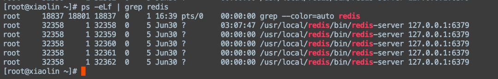


# 怎么查看网络的状态？

可以通过 netstat 命令。

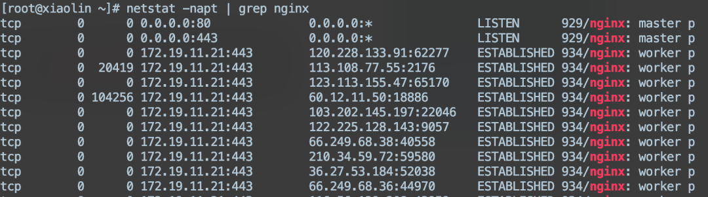


# 如果只想看close_wait状态的连接，怎么看？

```bash
netstat -napt  | grep close_wait
```

# HTTP协议状态码 500 501 502 503 504分别代表什么？可以举出具体场景嘛？

状态码500：

- 服务器内部错误（Internal Server Error）：表示服务器在处理请求时遇到了意外的错误，无法完成请求。
- 场景：当服务器上的应用程序发生未处理的异常或错误时，可能会返回500状态码。例如，如果网站的后端代码出现了错误，导致无法正确处理请求，服务器可能会返回500状态码。

状态码501：

- 未实现（Not Implemented）：表示服务器不支持客户端请求的功能或方法。
- 场景：当客户端发送了一个服务器不支持的请求方法或功能时，服务器可以返回501状态码。例如，如果客户端发送了一个不被服务器支持的HTTP方法，如PROPFIND，服务器可能会返回501状态码。

状态码502：

- 错误网关（Bad Gateway）：表示服务器作为网关或代理，从上游服务器接收到的响应无效。
- 场景：当服务器作为网关或代理时，如果服务器从上游服务器接收到的响应无效，可能会返回502状态码。例如，当反向代理服务器无法访问后端服务器或后端服务器返回了无效的响应时，可能会返回502状态码。

状态码503 ：

- 服务不可用（Service Unavailable）：表示服务器暂时无法处理请求，通常是由于服务器过载或维护。
- 场景：当服务器暂时无法处理请求时，可能会返回503状态码。例如，当网站正在进行维护或升级时，服务器可以返回503状态码来告知客户端服务不可用。

状态码504 ：

- 网关超时（Gateway Timeout）：表示服务器作为网关或代理，在等待上游服务器的响应时超时。
- 场景：当服务器作为网关或代理时，在等待上游服务器的响应时超时，可能会返回504状态码。例如，如果反向代理服务器在规定的超时时间内无法从后端服务器获取响应，可能会返回504状态码。

# 说一说四次挥手的整个过程？

TCP 四次挥手的过程如下：

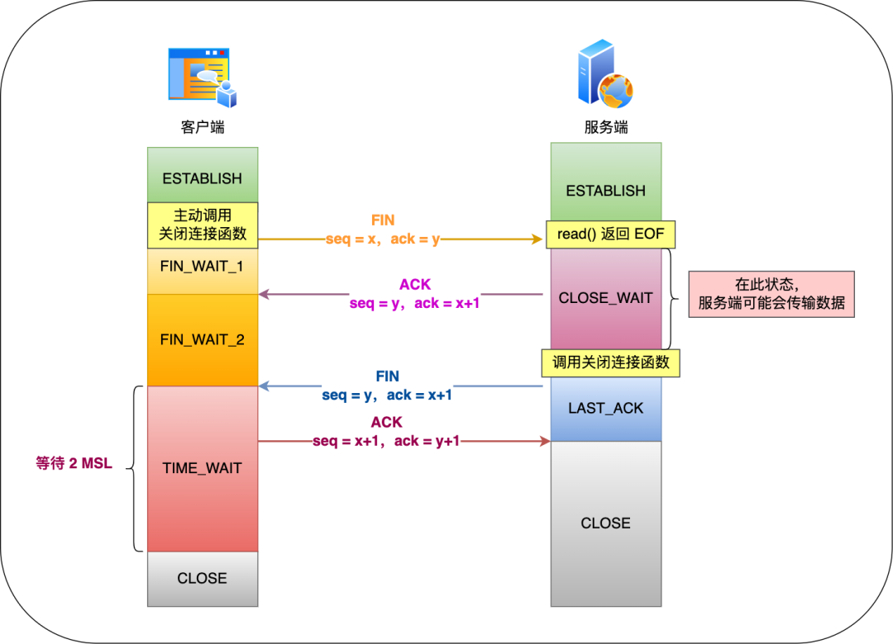

具体过程：

- 客户端主动调用关闭连接的函数，于是就会发送 FIN 报文，这个 FIN 报文代表客户端不会再发送数据了，进入 FIN_WAIT_1 状态；
- 服务端收到了 FIN 报文，然后马上回复一个 ACK 确认报文，此时服务端进入 CLOSE_WAIT 状态。在收到 FIN 报文的时候，TCP 协议栈会为 FIN 包插入一个文件结束符 EOF 到接收缓冲区中，服务端应用程序可以通过 read 调用来感知这个 FIN 包，这个 EOF 会被**放在已排队等候的其他已接收的数据之后**，所以必须要得继续 read 接收缓冲区已接收的数据；
- 接着，当服务端在 read 数据的时候，最后自然就会读到 EOF，接着 **read() 就会返回 0，这时服务端应用程序如果有数据要发送的话，就发完数据后才调用关闭连接的函数，如果服务端应用程序没有数据要发送的话，可以直接调用关闭连接的函数**，这时服务端就会发一个 FIN 包，这个 FIN 报文代表服务端不会再发送数据了，之后处于 LAST_ACK 状态；
- 客户端接收到服务端的 FIN 包，并发送 ACK 确认包给服务端，此时客户端将进入 TIME_WAIT 状态；
- 服务端收到 ACK 确认包后，就进入了最后的 CLOSE 状态；
- 客户端经过 2MSL 时间之后，也进入 CLOSE 状态；

你可以看到，每个方向都需要**一个 FIN 和一个 ACK**，因此通常被称为**四次挥手**。

# Time_wait 为什么2MSL ？

主要是两个原因：

- 防止历史连接中的数据，被后面相同四元组的连接错误的接收；
- 保证「被动关闭连接」的一方，能被正确的关闭；

*原因一：防止历史连接中的数据，被后面相同四元组的连接错误的接收*

假设 TIME-WAIT 没有等待时间或时间过短，被延迟的数据包抵达后会发生什么呢？

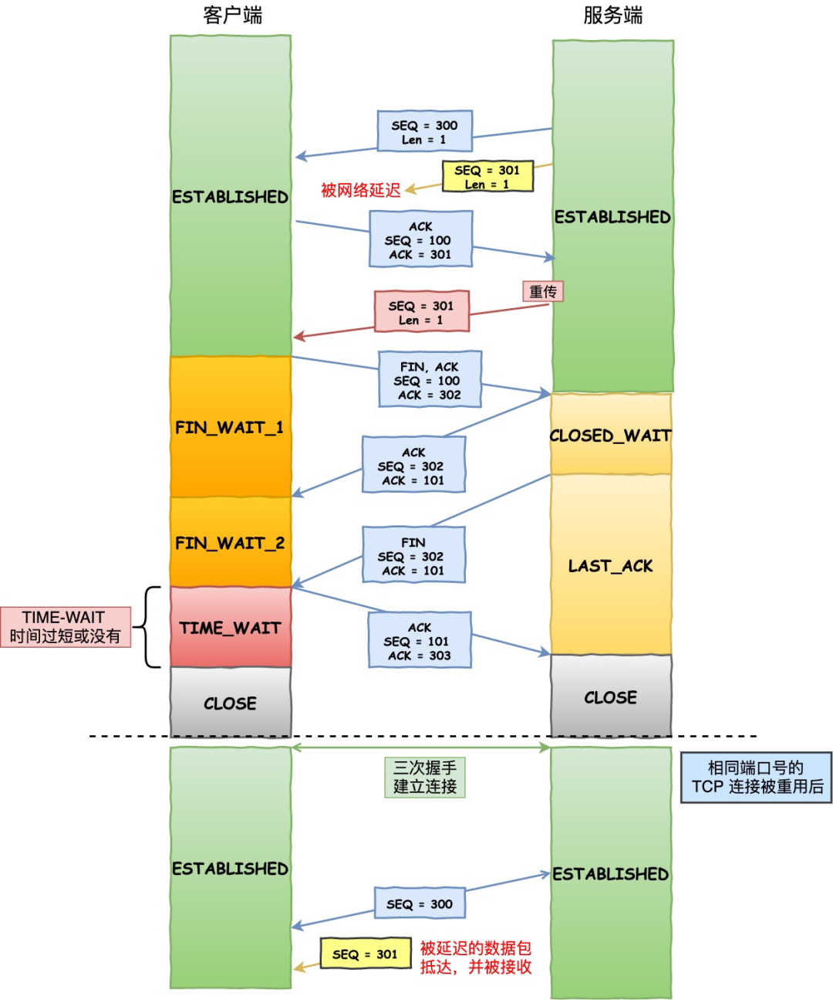

TIME-WAIT 时间过短，收到旧连接的数据报文

如上图：

- 服务端在关闭连接之前发送的 SEQ = 301 报文，被网络延迟了。
- 接着，服务端以相同的四元组重新打开了新连接，前面被延迟的 SEQ = 301 这时抵达了客户端，而且该数据报文的序列号刚好在客户端接收窗口内，因此客户端会正常接收这个数据报文，但是这个数据报文是上一个连接残留下来的，这样就产生数据错乱等严重的问题。

为了防止历史连接中的数据，被后面相同四元组的连接错误的接收，因此 TCP 设计了 TIME_WAIT 状态，状态会持续 2MSL 时长，这个时间**足以让两个方向上的数据包都被丢弃，使得原来连接的数据包在网络中都自然消失，再出现的数据包一定都是新建立连接所产生的。**

*原因二：保证「被动关闭连接」的一方，能被正确的关闭*

在 RFC 793 指出 TIME-WAIT 另一个重要的作用是：

*TIME**-WAIT -* *represents* *waiting for enough* *time* *to pass to be sure the* *remote* *TCP received the acknowledgment of its* *connection* *termination* *request**.*

也就是说，TIME-WAIT 作用是**等待足够的时间以确保最后的 ACK 能让被动关闭方接收，从而帮助其正常关闭。**

如果客户端（主动关闭方）最后一次 ACK 报文（第四次挥手）在网络中丢失了，那么按照 TCP 可靠性原则，服务端（被动关闭方）会重发 FIN 报文。

假设客户端没有 TIME_WAIT 状态，而是在发完最后一次回 ACK 报文就直接进入 CLOSE 状态，如果该 ACK 报文丢失了，服务端则重传的 FIN 报文，而这时客户端已经进入到关闭状态了，在收到服务端重传的 FIN 报文后，就会回 RST 报文。

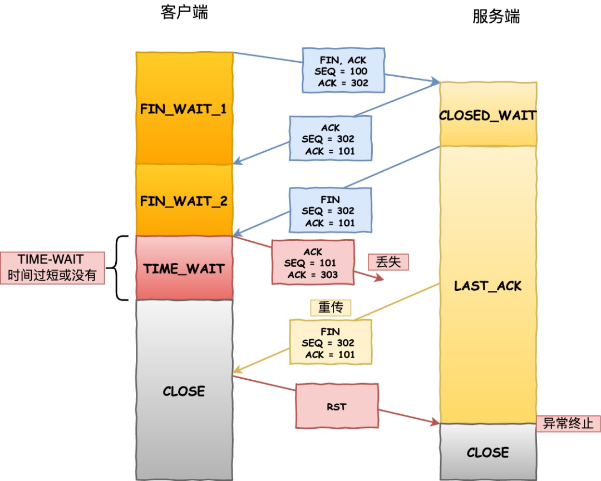

TIME-WAIT 时间过短，没有确保连接正常关闭

服务端收到这个 RST 并将其解释为一个错误（Connection reset by peer），这对于一个可靠的协议来说不是一个优雅的终止方式。

为了防止这种情况出现，客户端必须等待足够长的时间，确保服务端能够收到 ACK，如果服务端没有收到 ACK，那么就会触发 TCP 重传机制，服务端会重新发送一个 FIN，这样一去一来刚好两个 MSL 的时间。

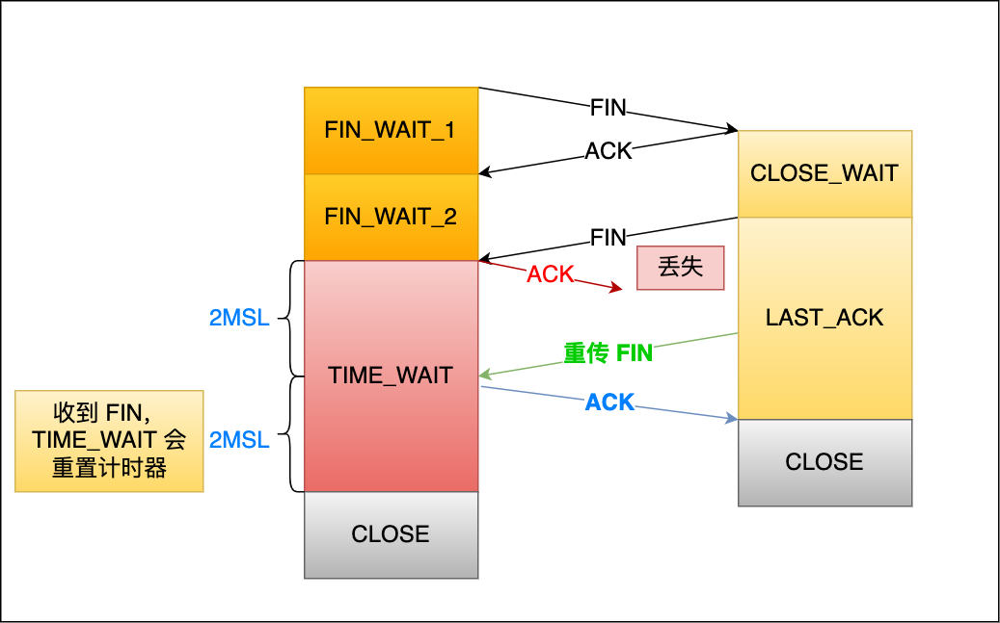

TIME-WAIT 时间正常，确保了连接正常关闭

客户端在收到服务端重传的 FIN 报文时，TIME_WAIT 状态的等待时间，会重置回 2MSL。

# 当存在大量close_wait的连接时怎么处理？

CLOSE_WAIT 状态是「被动关闭方」才会有的状态，而且如果「被动关闭方」没有调用 close 函数关闭连接，那么就无法发出 FIN 报文，从而无法使得 CLOSE_WAIT 状态的连接转变为 LAST_ACK 状态。

所以，**当服务端出现大量 CLOSE_WAIT 状态的连接的时候，说明服务端的程序没有调用 close 函数关闭连接**。

那什么情况会导致服务端的程序没有调用 close 函数关闭连接？这时候通常需要排查代码。

我们先来分析一个普通的 TCP 服务端的流程：

1. 创建服务端 socket，bind 绑定端口、listen 监听端口
2. 将服务端 socket 注册到 epoll
3. epoll_wait 等待连接到来，连接到来时，调用 accpet 获取已连接的 socket
4. 将已连接的 socket 注册到 epoll
5. epoll_wait 等待事件发生
6. 对方连接关闭时，我方调用 close

可能导致服务端没有调用 close 函数的原因，如下。

**第一个原因**：第 2 步没有做，没有将服务端 socket 注册到 epoll，这样有新连接到来时，服务端没办法感知这个事件，也就无法获取到已连接的 socket，那服务端自然就没机会对 socket 调用 close 函数了。

不过这种原因发生的概率比较小，这种属于明显的代码逻辑 bug，在前期 read view 阶段就能发现的了。

**第二个原因**：第 3 步没有做，有新连接到来时没有调用 accpet 获取该连接的 socket，导致当有大量的客户端主动断开了连接，而服务端没机会对这些 socket 调用 close 函数，从而导致服务端出现大量 CLOSE_WAIT 状态的连接。

发生这种情况可能是因为服务端在执行 accpet 函数之前，代码卡在某一个逻辑或者提前抛出了异常。

**第三个原因**：第 4 步没有做，通过 accpet 获取已连接的 socket 后，没有将其注册到 epoll，导致后续收到 FIN 报文的时候，服务端没办法感知这个事件，那服务端就没机会调用 close 函数了。

**第四个原因**：第 6 步没有做，当发现客户端关闭连接后，服务端没有执行 close 函数，可能是因为代码漏处理，或者是在执行 close 函数之前，代码卡在某一个逻辑，比如发生死锁等等。

可以发现，当服务端出现大量 CLOSE_WAIT 状态的连接的时候，通常都是代码的问题，这时候我们需要针对具体的代码一步一步的进行排查和定位，主要分析的方向就是服务端为什么没有调用 close。

# 什么是聚簇索引和非聚簇索引？

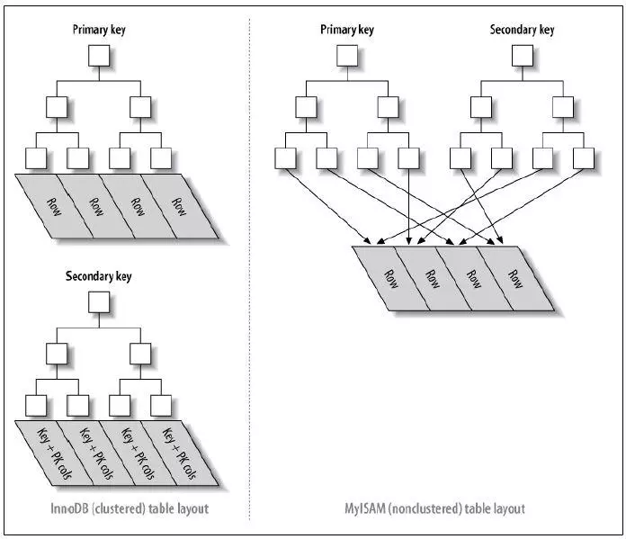

- 对于**聚簇索引表**来说（左图），表数据是和主键一起存储的，主键索引的叶结点存储行数据(包含了主键值)，二级索引的叶结点存储行的主键值。使用的是B+树作为索引的存储结构，非叶子节点都是索引关键字，但非叶子节点中的关键字中不存储对应记录的具体内容或内容地址。叶子节点上的数据是主键与具体记录(数据内容)。
- 对于**非聚簇索引表**来说（右图），表数据和索引是分成两部分存储的，主键索引和二级索引存储上没有任何区别。使用的是B+树作为索引的存储结构，所有的节点都是索引，叶子节点存储的是索引+索引对应的记录的数据。

# InooDB 为什么要使用聚簇索引？

使用聚簇索引的一些好处：

- 数据行的物理存储顺序：使用聚集索引可以将数据行按照索引键的顺序存储在磁盘上，这样相邻的数据行在物理上也是相邻的。这种物理存储顺序可以提高基于范围查询的性能，因为相关的数据行在物理上是连续的，减少了磁盘I/O的次数。
- 覆盖索引查询：由于聚集索引包含了实际的数据行，当查询只需要使用聚集索引的键列时，可以避免访问数据行，提高查询性能。这种情况下也称为覆盖索引查询。

# 什么是 InooDB里面的联合索引？

通过将多个字段组合成一个索引，该索引就被称为联合索引。

比如，将商品表中的 product_no 和 name 字段组合成联合索引(product_no, name)，创建联合索引的方式如下：

```plain
CREATE INDEX index_product_no_name ON product(product_no, name);
```

联合索引(product_no, name) 的 B+Tree 示意图如下（图中叶子节点之间实际上是双向链表）。

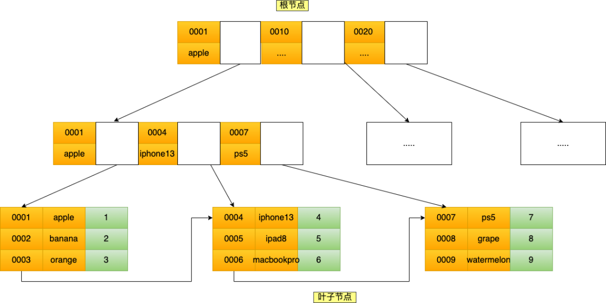

联合索引

可以看到，联合索引的非叶子节点用两个字段的值作为 B+Tree 的 key 值。当在联合索引查询数据时，先按 product_no 字段比较，在 product_no 相同的情况下再按 name 字段比较。

也就是说，联合索引查询的 B+Tree 是先按 product_no 进行排序，然后再 product_no 相同的情况再按 name 字段排序。

因此，使用联合索引时，存在**最左匹配原则**，也就是按照最左优先的方式进行索引的匹配。在使用联合索引进行查询的时候，如果不遵循「最左匹配原则」，联合索引会失效，这样就无法利用到索引快速查询的特性了。

比如，如果创建了一个 (a, b, c) 联合索引，如果查询条件是以下这几种，就可以匹配上联合索引：

- where a=1；
- where a=1 and b=2 and c=3；
- where a=1 and b=2；

需要注意的是，因为有查询优化器，所以 a 字段在 where 子句的顺序并不重要。

但是，如果查询条件是以下这几种，因为不符合最左匹配原则，所以就无法匹配上联合索引，联合索引就会失效:

- where b=2；
- where c=3；
- where b=2 and c=3；

上面这些查询条件之所以会失效，是因为(a, b, c) 联合索引，是先按 a 排序，在 a 相同的情况再按 b 排序，在 b 相同的情况再按 c 排序。所以，**b 和 c 是全局无序，局部相对有序的**，这样在没有遵循最左匹配原则的情况下，是无法利用到索引的。

我这里举联合索引（a，b）的例子，该联合索引的 B+ Tree 如下（图中叶子节点之间实际上是双向链表）。

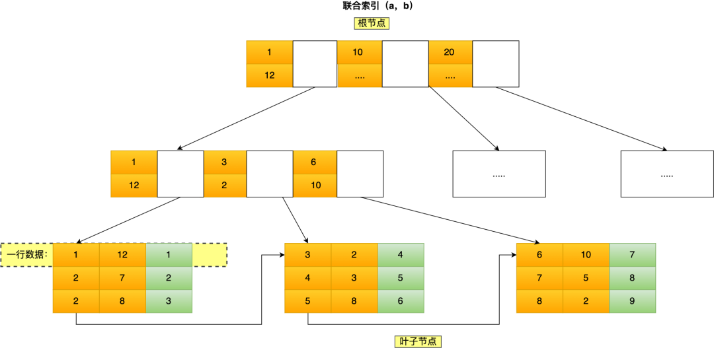

img

可以看到，a 是全局有序的（1, 2, 2, 3, 4, 5, 6, 7 ,8），而 b 是全局是无序的（12，7，8，2，3，8，10，5，2）。因此，直接执行where b = 2这种查询条件没有办法利用联合索引的，**利用索引的前提是索引里的 key 是有序的**。

只有在 a 相同的情况才，b 才是有序的，比如 a 等于 2 的时候，b 的值为（7，8），这时就是有序的，这个有序状态是局部的，因此，执行where a = 2 and b = 7是 a 和 b 字段能用到联合索引的，也就是联合索引生效了。

# 给出一个表A 有a1~a5 个列，联合索引（a2,a1）select a5 from A where a2=1 and a1=2 请问用到联合索引了嘛？它的具体过程呢？

查询符合最左匹配原则，可以a1 和 a2 都可以使用联合索引。

具体的查询过程，在二级索引 b+树找到符合条件 a2 和 a1 的记录，然后获取这些记录的 id 值，拿 id 值去主键索引查询 a5 列的值，这里涉及了回表的查询。

# 算法：滑动窗口

链接：[小林Coding](https://xiaolincoding.com/network/3_tcp/tcp_feature.html#滑动窗口)