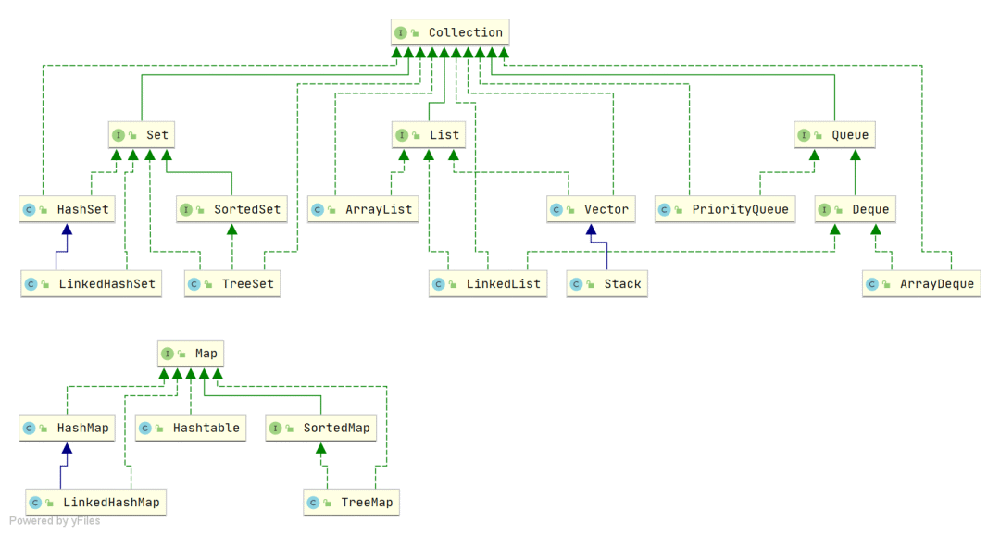

### 1、Long 的长度和范围，为什么要减 1 ？

先来复习一下 Java 中的 8 种基本数据类型：

- 6 种数字类型：

- - 4 种整数型：byte、short、int、long
  - 2 种浮点型：float、double

- 1 种字符类型：char
- 1 种布尔型：boolean。

这 8 种基本数据类型的默认值以及所占空间的大小如下：

| 基本类型 | 位数 | 字节 | 默认值  | 取值范围                                                     |
| -------- | ---- | ---- | ------- | ------------------------------------------------------------ |
| byte     | 8    | 1    | 0       | -128 ~ 127                                                   |
| short    | 16   | 2    | 0       | -32768（-2^15） ~ 32767（2^15 - 1）                          |
| int      | 32   | 4    | 0       | -2147483648 ~ 2147483647                                     |
| long     | 64   | 8    | 0L      | -9223372036854775808（-2^63） ~ 9223372036854775807（2^63 -1） |
| char     | 16   | 2    | 'u0000' | 0 ~ 65535（2^16 - 1）                                        |
| float    | 32   | 4    | 0f      | 1.4E-45 ~ 3.4028235E38                                       |
| double   | 64   | 8    | 0d      | 4.9E-324 ~ 1.7976931348623157E308                            |
| boolean  | 1    |      | false   | true、false                                                  |

可以看到，像 byte、short、int、long能表示的最大正数都减 1 了。这是为什么呢？这是因为在二进制补码表示法中，最高位是用来表示符号的（0 表示正数，1 表示负数），其余位表示数值部分。所以，如果我们要表示最大的正数，我们需要把除了最高位之外的所有位都设为 1。如果我们再加 1，就会导致溢出，变成一个负数。

对于 boolean，官方文档未明确定义，它依赖于 JVM 厂商的具体实现。逻辑上理解是占用 1 位，但是实际中会考虑计算机高效存储因素。

另外，Java 的每种基本类型所占存储空间的大小不会像其他大多数语言那样随机器硬件架构的变化而变化。这种所占存储空间大小的不变性是 Java 程序比用其他大多数语言编写的程序更具可移植性的原因之一（《Java 编程思想》2.2 节有提到）。

### 2、JAVA 异常的层次结构

Java 异常类层次结构图概览：


Java 异常类层次结构图

在 Java 中，所有的异常都有一个共同的祖先 java.lang 包中的 Throwable 类。Throwable 类有两个重要的子类:

- **Exception** :程序本身可以处理的异常，可以通过 catch 来进行捕获。Exception 又可以分为 Checked Exception (受检查异常，必须处理) 和 Unchecked Exception (不受检查异常，可以不处理)。
- **Error**：Error 属于程序无法处理的错误 ，我们没办法通过 catch 来进行捕获不建议通过catch捕获 。例如 Java 虚拟机运行错误（Virtual MachineError）、虚拟机内存不够错误(OutOfMemoryError)、类定义错误（NoClassDefFoundError）等 。这些异常发生时，Java 虚拟机（JVM）一般会选择线程终止。

### 3、JAVA 的集合类有了解么？

Java 集合， 也叫作容器，主要是由两大接口派生而来：一个是 Collection接口，主要用于存放单一元素；另一个是 Map 接口，主要用于存放键值对。对于Collection 接口，下面又有三个主要的子接口：List、Set 和 Queue。

Java 集合框架如下图所示：



Java 集合框架概览

注：图中只列举了主要的继承派生关系，并没有列举所有关系。比方省略了AbstractList, NavigableSet等抽象类以及其他的一些辅助类，如想深入了解，可自行查看源码。

- List(对付顺序的好帮手): 存储的元素是有序的、可重复的。
- Set(注重独一无二的性质): 存储的元素不可重复的。
- Queue(实现排队功能的叫号机): 按特定的排队规则来确定先后顺序，存储的元素是有序的、可重复的。
- Map(用 key 来搜索的专家): 使用键值对（key-value）存储，类似于数学上的函数 y=f(x)，"x" 代表 key，"y" 代表 value，key 是无序的、不可重复的，value 是无序的、可重复的，每个键最多映射到一个值。

### 4、ArrayList 和 LinkedList 区别

- **是否保证线程安全：** ArrayList 和 LinkedList 都是不同步的，也就是不保证线程安全；
- **底层数据结构：** ArrayList 底层使用的是 **Object** **数组**；LinkedList 底层使用的是 **双向链表** 数据结构（JDK1.6 之前为循环链表，JDK1.7 取消了循环。注意双向链表和双向循环链表的区别，下面有介绍到！）
- **插入和删除是否受元素位置的影响：**

- - ArrayList 采用数组存储，所以插入和删除元素的时间复杂度受元素位置的影响。比如：执行add(E e)方法的时候， ArrayList 会默认在将指定的元素追加到此列表的末尾，这种情况时间复杂度就是 O(1)。但是如果要在指定位置 i 插入和删除元素的话（add(int index, E element)），时间复杂度就为 O(n)。因为在进行上述操作的时候集合中第 i 和第 i 个元素之后的(n-i)个元素都要执行向后位/向前移一位的操作。
  - LinkedList 采用链表存储，所以在头尾插入或者删除元素不受元素位置的影响（add(E e)、addFirst(E e)、addLast(E e)、removeFirst()、 removeLast()），时间复杂度为 O(1)，如果是要在指定位置 i 插入和删除元素的话（add(int index, E element)，remove(Object o),remove(int index)）， 时间复杂度为 O(n) ，因为需要先移动到指定位置再插入和删除。

- **是否支持快速随机访问：** LinkedList 不支持高效的随机元素访问，而 ArrayList（实现了 RandomAccess 接口） 支持。快速随机访问就是通过元素的序号快速获取元素对象(对应于get(int index)方法)。
- **内存空间占用：** ArrayList 的空间浪费主要体现在在 list 列表的结尾会预留一定的容量空间，而 LinkedList 的空间花费则体现在它的每一个元素都需要消耗比 ArrayList 更多的空间（因为要存放直接后继和直接前驱以及数据）。

我们在项目中一般是不会使用到 LinkedList 的，需要用到 LinkedList 的场景几乎都可以使用 ArrayList 来代替，并且，性能通常会更好！就连 LinkedList 的作者约书亚 · 布洛克（Josh Bloch）自己都说从来不会使用 LinkedList 。


另外，不要下意识地认为 LinkedList 作为链表就最适合元素增删的场景。我在上面也说了，LinkedList 仅仅在头尾插入或者删除元素的时候时间复杂度近似 O(1)，其他情况增删元素的平均时间复杂度都是 O(n) 。

补充内容: 双向链表和双向循环链表

**双向链表：** 包含两个指针，一个 prev 指向前一个节点，一个 next 指向后一个节点。


双向链表

**双向循环链表：** 最后一个节点的 next 指向 head，而 head 的 prev 指向最后一个节点，构成一个环。


双向循环链表

补充内容:RandomAccess 接口

```plain
public interface RandomAccess {
}
```

查看源码我们发现实际上 RandomAccess 接口中什么都没有定义。所以，在我看来 RandomAccess 接口不过是一个标识罢了。标识什么？标识实现这个接口的类具有随机访问功能。

在 binarySearch（) 方法中，它要判断传入的 list 是否 RandomAccess 的实例，如果是，调用indexedBinarySearch()方法，如果不是，那么调用iteratorBinarySearch()方法

```plain
public static <T>
    int binarySearch(List<? extends Comparable<? super T>> list, T key) {
        if (list instanceof RandomAccess || list.size()<BINARYSEARCH_THRESHOLD)
            return Collections.indexedBinarySearch(list, key);
        else
            return Collections.iteratorBinarySearch(list, key);
    }
```

ArrayList 实现了 RandomAccess 接口， 而 LinkedList 没有实现。为什么呢？我觉得还是和底层数据结构有关！ArrayList 底层是数组，而 LinkedList 底层是链表。数组天然支持随机访问，时间复杂度为 O(1)，所以称为快速随机访问。链表需要遍历到特定位置才能访问特定位置的元素，时间复杂度为 O(n)，所以不支持快速随机访问。ArrayList 实现了 RandomAccess 接口，就表明了他具有快速随机访问功能。RandomAccess 接口只是标识，并不是说 ArrayList 实现 RandomAccess 接口才具有快速随机访问功能的！

### 5、HashMap 有了解么，它的底层实现，为什么线程不安全？

HashMap 主要用来存放键值对，它基于哈希表的 Map 接口实现，是常用的 Java 集合之一，是非线程安全的。

HashMap 可以存储 null 的 key 和 value，但 null 作为键只能有一个，null 作为值可以有多个

JDK1.8 之前 HashMap 由 数组+链表 组成的，数组是 HashMap 的主体，链表则是主要为了解决哈希冲突而存在的（“拉链法”解决冲突）。JDK1.8 以后的 HashMap 在解决哈希冲突时有了较大的变化，当链表长度大于等于阈值（默认为 8）（将链表转换成红黑树前会判断，如果当前数组的长度小于 64，那么会选择先进行数组扩容，而不是转换为红黑树）时，将链表转化为红黑树，以减少搜索时间。

HashMap 默认的初始化大小为 16。之后每次扩充，容量变为原来的 2 倍。并且， HashMap 总是使用 2 的幂作为哈希表的大小。

JDK1.7 及之前版本，在多线程环境下，HashMap 扩容时会造成死循环和数据丢失的问题。

数据丢失这个在 JDK1.7 和 JDK 1.8 中都存在，这里以 JDK 1.8 为例进行介绍。

JDK 1.8 后，在 HashMap 中，多个键值对可能会被分配到同一个桶（bucket），并以链表或红黑树的形式存储。多个线程对 HashMap 的 put 操作会导致线程不安全，具体来说会有数据覆盖的风险。

举个例子：

- 两个线程 1,2 同时进行 put 操作，并且发生了哈希冲突（hash 函数计算出的插入下标是相同的）。
- 不同的线程可能在不同的时间片获得 CPU 执行的机会，当前线程 1 执行完哈希冲突判断后，由于时间片耗尽挂起。线程 2 先完成了插入操作。
- 随后，线程 1 获得时间片，由于之前已经进行过 hash 碰撞的判断，所有此时会直接进行插入，这就导致线程 2 插入的数据被线程 1 覆盖了。

```plain
public V put(K key, V value) {
    return putVal(hash(key), key, value, false, true);
}

final V putVal(int hash, K key, V value, boolean onlyIfAbsent,
                   boolean evict) {
    // ...
    // 判断是否出现 hash 碰撞
    // (n - 1) & hash 确定元素存放在哪个桶中，桶为空，新生成结点放入桶中(此时，这个结点是放在数组中)
    if ((p = tab[i = (n - 1) & hash]) == null)
        tab[i] = newNode(hash, key, value, null);
    // 桶中已经存在元素（处理hash冲突）
    else {
    // ...
}
```

还有一种情况是这两个线程同时 put 操作导致 size 的值不正确，进而导致数据覆盖的问题：

1. 线程 1 执行 if(++size > threshold) 判断时，假设获得 size 的值为 10，由于时间片耗尽挂起。
2. 线程 2 也执行 if(++size > threshold) 判断，获得 size 的值也为 10，并将元素插入到该桶位中，并将 size 的值更新为 11。
3. 随后，线程 1 获得时间片，它也将元素放入桶位中，并将 size 的值更新为 11。
4. 线程 1、2 都执行了一次 put 操作，但是 size 的值只增加了 1，也就导致实际上只有一个元素被添加到了 HashMap 中。

```plain
public V put(K key, V value) {
    return putVal(hash(key), key, value, false, true);
}

final V putVal(int hash, K key, V value, boolean onlyIfAbsent,
                   boolean evict) {
    // ...
    // 实际大小大于阈值则扩容
    if (++size > threshold)
        resize();
    // 插入后回调
    afterNodeInsertion(evict);
    return null;
}
```

### 6、CoucurHashMap 和 HashTable

ConcurrentHashMap 和 Hashtable 的区别主要体现在实现线程安全的方式上不同。

- **底层数据结构：** JDK1.7 的 ConcurrentHashMap 底层采用 **分段的数组+链表** 实现，JDK1.8 采用的数据结构跟 HashMap1.8 的结构一样，数组+链表/红黑二叉树。Hashtable 和 JDK1.8 之前的 HashMap 的底层数据结构类似都是采用 **数组+链表** 的形式，数组是 HashMap 的主体，链表则是主要为了解决哈希冲突而存在的；
- **实现线程安全的方式（重要）：**

- - 在 JDK1.7 的时候，ConcurrentHashMap 对整个桶数组进行了分割分段(Segment，分段锁)，每一把锁只锁容器其中一部分数据（下面有示意图），多线程访问容器里不同数据段的数据，就不会存在锁竞争，提高并发访问率。
  - 到了 JDK1.8 的时候，ConcurrentHashMap 已经摒弃了 Segment 的概念，而是直接用 Node 数组+链表+红黑树的数据结构来实现，并发控制使用 synchronized 和 CAS 来操作。（JDK1.6 以后 synchronized 锁做了很多优化） 整个看起来就像是优化过且线程安全的 HashMap，虽然在 JDK1.8 中还能看到 Segment 的数据结构，但是已经简化了属性，只是为了兼容旧版本；
  - **Hashtable****(同一把锁)** :使用 synchronized 来保证线程安全，效率非常低下。当一个线程访问同步方法时，其他线程也访问同步方法，可能会进入阻塞或轮询状态，如使用 put 添加元素，另一个线程不能使用 put 添加元素，也不能使用 get，竞争会越来越激烈效率越低。

下面，我们再来看看两者底层数据结构的对比图。

**Hashtable** :


Hashtable 的内部结构

https://www.cnblogs.com/chengxiao/p/6842045.html>

**JDK1.7 的 ConcurrentHashMap**：


Java7 ConcurrentHashMap 存储结构

ConcurrentHashMap 是由 Segment 数组结构和 HashEntry 数组结构组成。

Segment 数组中的每个元素包含一个 HashEntry 数组，每个 HashEntry 数组属于链表结构。

**JDK1.8 的 ConcurrentHashMap**：


Java8 ConcurrentHashMap 存储结构

JDK1.8 的 ConcurrentHashMap 不再是 **Segment 数组 + HashEntry 数组 + 链表**，而是 **Node 数组 + 链表 / 红黑树**。不过，Node 只能用于链表的情况，红黑树的情况需要使用 TreeNode。当冲突链表达到一定长度时，链表会转换成红黑树。

TreeNode是存储红黑树节点，被TreeBin包装。TreeBin通过root属性维护红黑树的根结点，因为红黑树在旋转的时候，根结点可能会被它原来的子节点替换掉，在这个时间点，如果有其他线程要写这棵红黑树就会发生线程不安全问题，所以在 ConcurrentHashMap 中TreeBin通过waiter属性维护当前使用这棵红黑树的线程，来防止其他线程的进入。

```plain
static final class TreeBin<K,V> extends Node<K,V> {
        TreeNode<K,V> root;
        volatile TreeNode<K,V> first;
        volatile Thread waiter;
        volatile int lockState;
        // values for lockState
        static final int WRITER = 1; // set while holding write lock
        static final int WAITER = 2; // set when waiting for write lock
        static final int READER = 4; // increment value for setting read lock
...
}
```

### 7、线程池有了解么，讲一下。

顾名思义，线程池就是管理一系列线程的资源池，其提供了一种限制和管理线程资源的方式。每个线程池还维护一些基本统计信息，例如已完成任务的数量。

这里借用《Java 并发编程的艺术》书中的部分内容来总结一下使用线程池的好处：

- **降低资源消耗**。通过重复利用已创建的线程降低线程创建和销毁造成的消耗。
- **提高响应速度**。当任务到达时，任务可以不需要等到线程创建就能立即执行。
- **提高线程的可管理性**。线程是稀缺资源，如果无限制的创建，不仅会消耗系统资源，还会降低系统的稳定性，使用线程池可以进行统一的分配，调优和监控。

**线程池一般用于执行多个不相关联的耗时任务，没有多线程的情况下，任务顺序执行，使用了线程池的话可让多个不相关联的任务同时执行**

### 8、线程池配置无界队列了之后，拒绝策略怎么搞，什么时候用到无界对列？

线程池配置无界队列了之后，拒绝策略其实就失去了意义，因为无论有多少任务提交到线程池，都会被放入队列中等待执行，不会触发拒绝策略。不过，这样可能堆积大量的请求，从而导致 OOM。因此，一般不推荐使用误解队列。

假设不是无界队列的话，如果当前同时运行的线程数量达到最大线程数量并且队列也已经被放满了任务时，ThreadPoolTaskExecutor 定义一些拒绝策略:

- ThreadPoolExecutor.AbortPolicy：抛出 RejectedExecutionException来拒绝新任务的处理。
- ThreadPoolExecutor.CallerRunsPolicy：调用执行自己的线程运行任务，也就是直接在调用execute方法的线程中运行(run)被拒绝的任务，如果执行程序已关闭，则会丢弃该任务。因此这种策略会降低对于新任务提交速度，影响程序的整体性能。如果您的应用程序可以承受此延迟并且你要求任何一个任务请求都要被执行的话，你可以选择这个策略。
- ThreadPoolExecutor.DiscardPolicy：不处理新任务，直接丢弃掉。
- ThreadPoolExecutor.DiscardOldestPolicy：此策略将丢弃最早的未处理的任务请求。

举个例子：

Spring 通过 ThreadPoolTaskExecutor 或者我们直接通过 ThreadPoolExecutor 的构造函数创建线程池的时候，当我们不指定 RejectedExecutionHandler 饱和策略的话来配置线程池的时候默认使用的是 ThreadPoolExecutor.AbortPolicy。在默认情况下，ThreadPoolExecutor 将抛出 RejectedExecutionException 来拒绝新来的任务 ，这代表你将丢失对这个任务的处理。对于可伸缩的应用程序，建议使用 ThreadPoolExecutor.CallerRunsPolicy。当最大池被填满时，此策略为我们提供可伸缩队列（这个直接查看 ThreadPoolExecutor 的构造函数源码就可以看出，比较简单的原因，这里就不贴代码了）。

### 9、MVCC 讲一下

**MVCC** 是多版本并发控制方法，即对一份数据会存储多个版本，通过事务的可见性来保证事务能看到自己应该看到的版本。通常会有一个全局的版本分配器来为每一行数据设置版本号，版本号是唯一的。

MVCC 在 MySQL 中实现所依赖的手段主要是: **隐藏字段、read view、****undo** **log**。

- undo log : undo log 用于记录某行数据的多个版本的数据。
- read view 和 隐藏字段 : 用来判断当前版本数据的可见性。

### 10、事务特性、隔离级别

关系型数据库（例如：MySQL、SQL Server、Oracle 等）事务都有 **ACID** 特性：


ACID

1. **原子性**（Atomicity）：事务是最小的执行单位，不允许分割。事务的原子性确保动作要么全部完成，要么完全不起作用；
2. **一致性**（Consistency）：执行事务前后，数据保持一致，例如转账业务中，无论事务是否成功，转账者和收款人的总额应该是不变的；
3. **隔离性**（Isolation）：并发访问数据库时，一个用户的事务不被其他事务所干扰，各并发事务之间数据库是独立的；
4. **持久性**（Durability）：一个事务被提交之后。它对数据库中数据的改变是持久的，即使数据库发生故障也不应该对其有任何影响。

SQL 标准定义了四个隔离级别：

- **READ-UNCOMMITTED(读取未提交)** ：最低的隔离级别，允许读取尚未提交的数据变更，可能会导致脏读、幻读或不可重复读。
- **READ-COMMITTED(读取已提交)** ：允许读取并发事务已经提交的数据，可以阻止脏读，但是幻读或不可重复读仍有可能发生。
- **REPEATABLE-READ(可重复读)** ：对同一字段的多次读取结果都是一致的，除非数据是被本身事务自己所修改，可以阻止脏读和不可重复读，但幻读仍有可能发生。
- **SERIALIZABLE(可串行化)** ：最高的隔离级别，完全服从 ACID 的隔离级别。所有的事务依次逐个执行，这样事务之间就完全不可能产生干扰，也就是说，该级别可以防止脏读、不可重复读以及幻读。

| 隔离级别         | 脏读 | 不可重复读 | 幻读 |
| ---------------- | ---- | ---------- | ---- |
| READ-UNCOMMITTED | √    | √          | √    |
| READ-COMMITTED   | ×    | √          | √    |
| REPEATABLE-READ  | ×    | ×          | √    |
| SERIALIZABLE     | ×    | ×          | ×    |

MySQL 的隔离级别基于锁和 MVCC 机制共同实现的。

SERIALIZABLE 隔离级别是通过锁来实现的，READ-COMMITTED 和 REPEATABLE-READ 隔离级别是基于 MVCC 实现的。不过， SERIALIZABLE 之外的其他隔离级别可能也需要用到锁机制，就比如 REPEATABLE-READ 在当前读情况下需要使用加锁读来保证不会出现幻读。

MySQL InnoDB 存储引擎的默认支持的隔离级别是 **REPEATABLE-READ（可重读）**。我们可以通过SELECT @@tx_isolation;命令来查看，MySQL 8.0 该命令改为SELECT @@transaction_isolation;

```sql
mysql> SELECT @@tx_isolation;
+-----------------+
| @@tx_isolation  |
+-----------------+
| REPEATABLE-READ |
+-----------------+
```

### 11、Redis 有了解过么?zset 的底层数据结构？

Redis 是一个基于 C 语言开发的开源数据库（BSD 许可），与传统数据库不同的是 Redis 的数据是存在内存中的（内存数据库），读写速度非常快，被广泛应用于缓存方向。并且，Redis 存储的是 KV 键值对数据。

为了满足不同的业务场景，Redis 内置了多种数据类型实现（比如 String、Hash、Sorted Set、Bitmap、HyperLogLog、GEO）。并且，Redis 还支持事务、持久化、Lua 脚本、多种开箱即用的集群方案（Redis Sentinel、Redis Cluster）。

Redis 没有外部依赖，Linux 和 OS X 是 Redis 开发和测试最多的两个操作系统，官方推荐生产环境使用 Linux 部署 Redis。

Redis 内部做了非常多的性能优化，比较重要的有下面 3 点：

1. Redis 基于内存，内存的访问速度是磁盘的上千倍；
2. Redis 基于 Reactor 模式设计开发了一套高效的事件处理模型，主要是单线程事件循环和 IO 多路复用（Redis 线程模式后面会详细介绍到）；
3. Redis 内置了多种优化过后的数据结构实现，性能非常高。

**Redis 除了做缓存，还能做什么？**

- **分布式锁**：通过 Redis 来做分布式锁是一种比较常见的方式。通常情况下，我们都是基于 Redisson 来实现分布式锁。关于 Redis 实现分布式锁的详细介绍，可以看我写的这篇文章：**分布式锁详解****[5]** 。
- **限流**：一般是通过 Redis + Lua 脚本的方式来实现限流。相关阅读：[《我司用了 6 年的 Redis 分布式限流器，可以说是非常厉害了！》](https://mp.weixin.qq.com/s?__biz=MzAxNTM4NzAyNg==&mid=2247484077&idx=1&sn=c873e011a3c921737c1b0bf24ddc6c68&scene=21#wechat_redirect)。
- **消息队列**：Redis 自带的 list 数据结构可以作为一个简单的队列使用。Redis 5.0 中增加的 stream 类型的数据结构更加适合用来做消息队列。它比较类似于 Kafka，有主题和消费组的概念，支持消息持久化以及 ACK 机制。
- **延时队列**：Redisson 内置了延时队列（基于 sorted set 实现的）。
- **分布式** **Session** ：利用 string 或者 hash 保存 Session 数据，所有的服务器都可以访问。
- **复杂业务场景**：通过 Redis 以及 Redis 扩展（比如 Redisson）提供的数据结构，我们可以很方便地完成很多复杂的业务场景比如通过 bitmap 统计活跃用户、通过 sorted set 维护排行榜。
- ......

Redis 共有 5 种基本数据结构：String（字符串）、List（列表）、Set（集合）、Hash（散列）、Zset（有序集合）。

这 5 种数据结构是直接提供给用户使用的，是数据的保存形式，其底层实现主要依赖这 8 种数据结构：简单动态字符串（SDS）、LinkedList（双向链表）、Dict（哈希表/字典）、SkipList（跳跃表）、Intset（整数集合）、ZipList（压缩列表）、QuickList（快速列表）。

Redis 基本数据结构的底层数据结构实现如下：

| String | List                         | Hash          | Set          | Zset              |
| ------ | ---------------------------- | ------------- | ------------ | ----------------- |
| SDS    | LinkedList/ZipList/QuickList | Dict、ZipList | Dict、Intset | ZipList、SkipList |

Redis 3.2 之前，List 底层实现是 LinkedList 或者 ZipList。Redis 3.2 之后，引入了 LinkedList 和 ZipList 的结合 QuickList，List 的底层实现变为 QuickList。从 Redis 7.0 开始， ZipList 被 ListPack 取代。