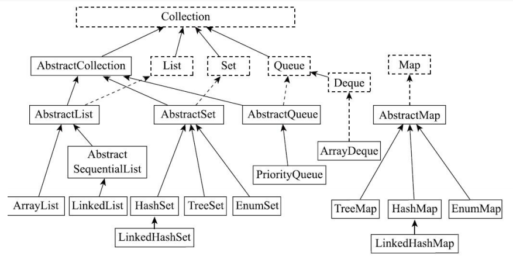
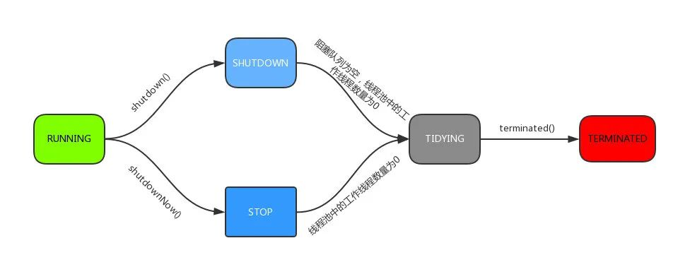
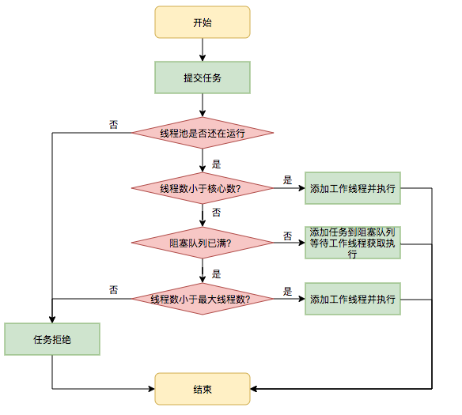
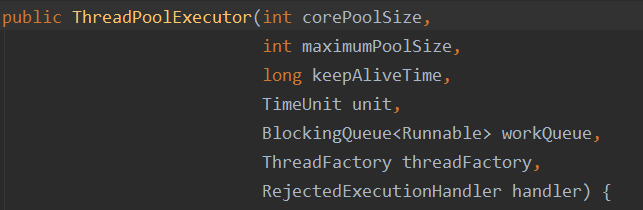
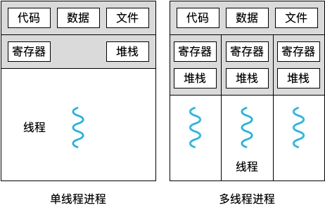
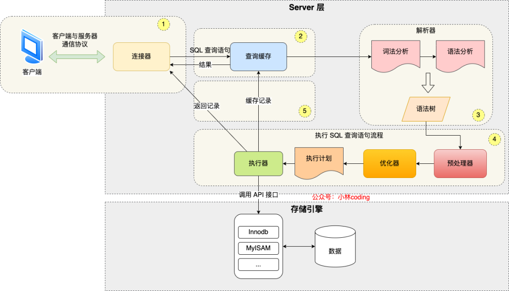
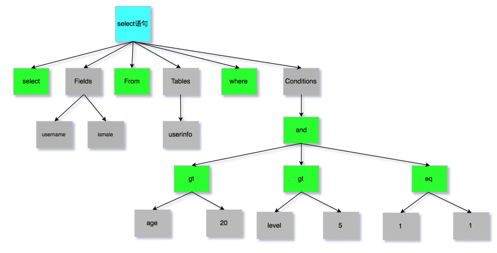
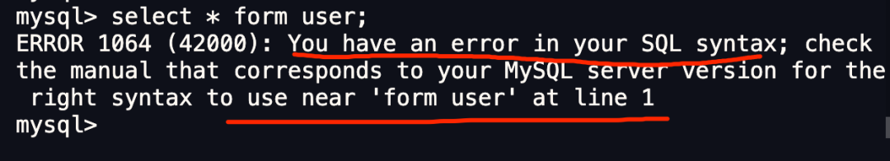
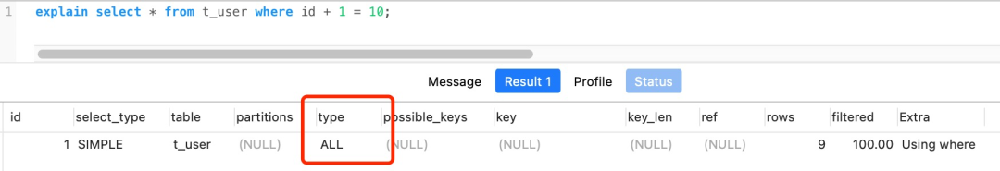
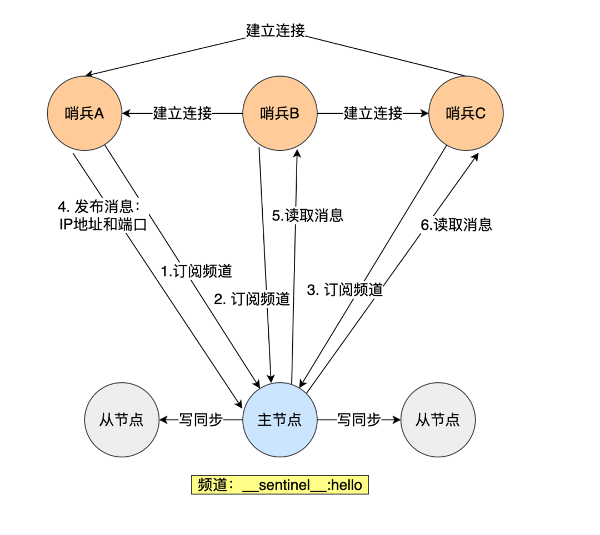

### java集合类有哪些？

图片

List是有序的Collection，使用此接口能够精确的控制每个元素的插入位置，用户能根据索引访问List中元素。常用的实现List的类有LinkedList，ArrayList，Vector，Stack。

- ArrayList是容量可变的非线程安全列表，其底层使用数组实现。当几何扩容时，会创建更大的数组，并把原数组复制到新数组。ArrayList支持对元素的快速随机访问，但插入与删除速度很慢。
- LinkedList本质是一个双向链表，与ArrayList相比，，其插入和删除速度更快，但随机访问速度更慢。

Set不允许存在重复的元素，与List不同，set中的元素是无序的。常用的实现有HashSet，LinkedHashSet和TreeSet。

- HashSet通过HashMap实现，HashMap的Key即HashSet存储的元素，所有Key都是用相同的Value，一个名为PRESENT的Object类型常量。使用Key保证元素唯一性，但不保证有序性。由于HashSet是HashMap实现的，因此线程不安全。
- LinkedHashSet继承自HashSet，通过LinkedHashMap实现，使用双向链表维护元素插入顺序。
- TreeSet通过TreeMap实现的，添加元素到集合时按照比较规则将其插入合适的位置，保证插入后的集合仍然有序。

Map 是一个键值对集合，存储键、值和之间的映射。Key 无序，唯一；value 不要求有序，允许重复。Map 没有继承于 Collection 接口，从 Map 集合中检索元素时，只要给出键对象，就会返回对应的值对象。主要实现有TreeMap、HashMap、HashTable、LinkedHashMap、ConcurrentHashMap

- HashMap：JDK1.8 之前 HashMap 由数组+链表组成的，数组是 HashMap 的主体，链表则是主要为了解决哈希冲突而存在的（“拉链法”解决冲突），JDK1.8 以后在解决哈希冲突时有了较大的变化，当链表长度大于阈值（默认为 8）时，将链表转化为红黑树，以减少搜索时间
- LinkedHashMap：LinkedHashMap 继承自 HashMap，所以它的底层仍然是基于拉链式散列结构即由数组和链表或红黑树组成。另外，LinkedHashMap 在上面结构的基础上，增加了一条双向链表，使得上面的结构可以保持键值对的插入顺序。同时通过对链表进行相应的操作，实现了访问顺序相关逻辑。
- HashTable：数组+链表组成的，数组是 HashMap 的主体，链表则是主要为了解决哈希冲突而存在的
- TreeMap：红黑树（自平衡的排序二叉树）
- ConcurrentHashMap：Node数组+链表+红黑树实现，线程安全的（jdk1.8以前Segment锁，1.8以后CAS锁）

### hashmap原理介绍一下？

存储对象时，我们将K/V传给put方法时，它调用hashCode计算hash从而得到bucket位置，进一步存储，HashMap会根据当前bucket的占用情况自动调整容量(超过Load Facotr则resize为原来的2倍)。

获取对象时，我们将K传给get，它调用hashCode计算hash从而得到bucket位置，并进一步调用equals()方法确定键值对。如果发生碰撞的时候，Hashmap通过链表将产生碰撞冲突的元素组织起来，在Java 8中，如果一个bucket中碰撞冲突的元素超过某个限制(默认是8)，则使用红黑树来替换链表，从而提高速度。

### hashmap为什么是线程不安全的？

- JDK1.7 中，由于多线程对HashMap进行扩容，调用了HashMap#transfer()，具体原因：某个线程执行过程中，被挂起，其他线程已经完成数据迁移，等CPU资源释放后被挂起的线程重新执行之前的逻辑，数据已经被改变，造成死循环、数据丢失。
- JDK1.8 中，由于多线程对HashMap进行put操作，调用了HashMap#putVal()，具体原因：假设两个线程A、B都在进行put操作，并且hash函数计算出的插入下标是相同的，当线程A执行完第六行代码后由于时间片耗尽导致被挂起，而线程B得到时间片后在该下标处插入了元素，完成了正常的插入，然后线程A获得时间片，由于之前已经进行了hash碰撞的判断，所有此时不会再进行判断，而是直接进行插入，这就导致了线程B插入的数据被线程A覆盖了，从而线程不安全。

改善：

- 数据丢失、死循环已经在在JDK1.8中已经得到了很好的解决，如果你去阅读1.8的源码会发现找不到HashMap#transfer()，因为JDK1.8直接在HashMap#resize()中完成了数据迁移。

### 线程的几种状态？

图片

线程池的五个状态如下

- RUNNING: 接收新的任务，并能继续处理 workQueue 中的任务
- SHUTDOWN: 不再接收新的任务，不过能继续处理 workQueue 中的任务
- STOP: 不再接收新的任务，也不再处理 workQueue 中的任务，并且会中断正在处理任务的线程
- TIDYING: 所有的任务都完结了，并且线程数量（workCount）为 0 时即为此状态，进入此状态后会调用 terminated() 这个钩子方法进入 TERMINATED 状态
- TERMINATED: 调用 terminated() 方法后即为此状态

### 线程池的原理？

线程池是为了减少频繁的创建线程和销毁线程带来的性能损耗。

线程池分为核心线程池，线程池的最大容量，还有等待任务的队列，提交一个任务，如果核心线程没有满，就创建一个线程，如果满了，就是会加入等待队列，如果等待队列满了，就会增加线程，如果达到最大线程数量，如果都达到最大线程数量，就会按照一些丢弃的策略进行处理。

图片

线程池的构造函数有7个参数：

图片

- **corePoolSize**：线程池核心线程数量。默认情况下，线程池中线程的数量如果 <= corePoolSize，那么即使这些线程处于空闲状态，那也不会被销毁。
- **maximumPoolSize**：线程池中最多可容纳的线程数量。当一个新任务交给线程池，如果此时线程池中有空闲的线程，就会直接执行，如果没有空闲的线程且当前线程池的线程数量小于corePoolSize，就会创建新的线程来执行任务，否则就会将该任务加入到阻塞队列中，如果阻塞队列满了，就会创建一个新线程，从阻塞队列头部取出一个任务来执行，并将新任务加入到阻塞队列末尾。如果当前线程池中线程的数量等于maximumPoolSize，就不会创建新线程，就会去执行拒绝策略。
- **keepAliveTime**：当线程池中线程的数量大于corePoolSize，并且某个线程的空闲时间超过了keepAliveTime，那么这个线程就会被销毁。
- **unit**：就是keepAliveTime时间的单位。
- **workQueue**：工作队列。当没有空闲的线程执行新任务时，该任务就会被放入工作队列中，等待执行。
- **threadFactory**：线程工厂。可以用来给线程取名字等等
- **handler**：拒绝策略。当一个新任务交给线程池，如果此时线程池中有空闲的线程，就会直接执行，如果没有空闲的线程，就会将该任务加入到阻塞队列中，如果阻塞队列满了，就会创建一个新线程，从阻塞队列头部取出一个任务来执行，并将新任务加入到阻塞队列末尾。如果当前线程池中线程的数量等于maximumPoolSize，就不会创建新线程，就会去执行拒绝策略。

### Java的线程池中有哪几种拒绝策略？能自定义拒绝策略吗？

当线程池的任务队列满了之后，线程池会执行指定的拒绝策略来应对，常用的四种拒绝策略包括：CallerRunsPolicy、AbortPolicy、DiscardPolicy、DiscardOldestPolicy，此外，还可以通过实现RejectedExecutionHandler接口来自定义拒绝策略。

四种预置的拒绝策略：

- CallerRunsPolicy，使用线程池的调用者所在的线程去执行被拒绝的任务，除非线程池被停止或者线程池的任务队列已有空缺。
- AbortPolicy，直接抛出一个任务被线程池拒绝的异常。
- DiscardPolicy，不做任何处理，静默拒绝提交的任务。
- DiscardOldestPolicy，抛弃最老的任务，然后执行该任务。
- 自定义拒绝策略，通过实现接口可以自定义任务拒绝策略。

### 你知道几种线程池？

- ScheduledThreadPool：可以设置定期的执行任务，它支持定时或周期性执行任务，比如每隔 10 秒钟执行一次任务，我通过这个实现类设置定期执行任务的策略。
- FixedThreadPool：它的核心线程数和最大线程数是一样的，所以可以把它看作是固定线程数的线程池，它的特点是线程池中的线程数除了初始阶段需要从 0 开始增加外，之后的线程数量就是固定的，就算任务数超过线程数，线程池也不会再创建更多的线程来处理任务，而是会把超出线程处理能力的任务放到任务队列中进行等待。而且就算任务队列满了，到了本该继续增加线程数的时候，由于它的最大线程数和核心线程数是一样的，所以也无法再增加新的线程了。
- CachedThreadPool：可以称作可缓存线程池，它的特点在于线程数是几乎可以无限增加的（实际最大可以达到 Integer.MAX_VALUE，为 2^31-1，这个数非常大，所以基本不可能达到），而当线程闲置时还可以对线程进行回收。也就是说该线程池的线程数量不是固定不变的，当然它也有一个用于存储提交任务的队列，但这个队列是 SynchronousQueue，队列的容量为0，实际不存储任何任务，它只负责对任务进行中转和传递，所以效率比较高。
- SingleThreadExecutor：它会使用唯一的线程去执行任务，原理和 FixedThreadPool 是一样的，只不过这里线程只有一个，如果线程在执行任务的过程中发生异常，线程池也会重新创建一个线程来执行后续的任务。这种线程池由于只有一个线程，所以非常适合用于所有任务都需要按被提交的顺序依次执行的场景，而前几种线程池不一定能够保障任务的执行顺序等于被提交的顺序，因为它们是多线程并行执行的。
- SingleThreadScheduledExecutor：它实际和 ScheduledThreadPool 线程池非常相似，它只是 ScheduledThreadPool 的一个特例，内部只有一个线程。

### 进程与线程有什么区别？

img

- **本质区别**：进程是操作系统资源分配的基本单位，而线程是任务调度和执行的基本单位
- **在开销方面**：每个进程都有独立的代码和数据空间（程序上下文），程序之间的切换会有较大的开销；线程可以看做轻量级的进程，同一类线程共享代码和数据空间，每个线程都有自己独立的运行栈和程序计数器（PC），线程之间切换的开销小
- **所处环境**：在操作系统中能同时运行多个进程（程序）；而在同一个进程（程序）中有多个线程同时执行（通过CPU调度，在每个时间片中只有一个线程执行）
- **内存分配方面**：系统在运行的时候会为每个进程分配不同的内存空间；而对线程而言，除了CPU外，系统不会为线程分配内存（线程所使用的资源来自其所属进程的资源），线程组之间只能共享资源
- **包含关系**：没有线程的进程可以看做是单线程的，如果一个进程内有多个线程，则执行过程不是一条线的，而是多条线（线程）共同完成的；线程是进程的一部分，所以线程也被称为轻权进程或者轻量级进程

举个例子：进程=火车，线程=车厢

- 线程在进程下行进（单纯的车厢无法运行）
- 一个进程可以包含多个线程（一辆火车可以有多个车厢）
- 不同进程间数据很难共享（一辆火车上的乘客很难换到另外一辆火车，比如站点换乘）
- 同一进程下不同线程间数据很易共享（A车厢换到B车厢很容易）
- 进程要比线程消耗更多的计算机资源（采用多列火车相比多个车厢更耗资源）
- 进程间不会相互影响，一个线程挂掉将导致整个进程挂掉（一列火车不会影响到另外一列火车，但是如果一列火车上中间的一节车厢着火了，将影响到所有车厢）

### mysql索引你知道哪些？

- 按「数据结构」分类：B+tree索引、Hash索引、Full-text索引。
- 按「物理存储」分类：聚簇索引（主键索引）、二级索引（辅助索引）。
- 按「字段特性」分类：主键索引、唯一索引、普通索引、前缀索引。
- 按「字段个数」分类：单列索引、联合索引。

### mysql执行流程

查询语句执行流程

- 连接器：建立连接，管理连接、校验用户身份；

- 查询缓存：查询语句如果命中查询缓存则直接返回，否则继续往下执行。MySQL 8.0 已删除该模块；

- 解析 SQL，通过解析器对 SQL 查询语句进行词法分析、语法分析，然后构建语法树，方便后续模块读取表名、字段、语句类型；

- 执行 SQL：执行 SQL 共有三个阶段：

- - 预处理阶段：检查表或字段是否存在；将 `select *` 中的 `*` 符号扩展为表上的所有列。
  - 优化阶段：基于查询成本的考虑， 选择查询成本最小的执行计划；
  - 执行阶段：根据执行计划执行 SQL 查询语句，从存储引擎读取记录，返回给客户端；

### 词法解析器说说

解析器会做如下两件事情。

第一件事情，**词法分析**。MySQL 会根据你输入的字符串识别出关键字出来，例如，SQL语句 select username from userinfo，在分析之后，会得到4个Token，其中有2个Keyword，分别为select和from：

| 关键字 | 非关键字 | 关键字 | 非关键字 |
| :----- | :------- | :----- | :------- |
| select | username | from   | userinfo |

第二件事情，**语法分析**。根据词法分析的结果，语法解析器会根据语法规则，判断你输入的这个 SQL 语句是否满足 MySQL 语法，如果没问题就会构建出 SQL 语法树，这样方便后面模块获取 SQL 类型、表名、字段名、 where 条件等等。

img

如果我们输入的 SQL 语句语法不对，就会在解析器这个阶段报错。比如，我下面这条查询语句，把 from 写成了 form，这时 MySQL 解析器就会给报错。

### 什么是索引？

当然是选择在书的目录去找，找到后再翻到对应的页。书中的**目录**，就是充当**索引**的角色，方便我们快速查找书中的内容，所以索引是以空间换时间的设计思想。

那换到数据库中，索引的定义就是帮助存储引擎快速获取数据的一种数据结构，形象的说就是**索引是数据的目录**。

### 什么是覆盖索引？

覆盖索引是指 SQL 中 query 的所有字段，在索引 B+Tree 的叶子节点上都能找得到的那些索引，从二级索引中查询得到记录，而不需要通过聚簇索引查询获得，可以避免回表的操作。

假设我们只需要查询商品的名称、价格，有什么方式可以避免回表呢？

我们可以建立一个联合索引，即「商品ID、名称、价格」作为一个联合索引。如果索引中存在这些数据，查询将不会再次检索主键索引，从而避免回表。

所以，使用覆盖索引的好处就是，不需要查询出包含整行记录的所有信息，也就减少了大量的 I/O 操作。

### 什么时候加索引，什么时候不加索引？

索引最大的好处是提高查询速度，但是索引也是有缺点的，比如：

- 需要占用物理空间，数量越大，占用空间越大；
- 创建索引和维护索引要耗费时间，这种时间随着数据量的增加而增大；
- 会降低表的增删改的效率，因为每次增删改索引，B+ 树为了维护索引有序性，都需要进行动态维护。

所以，索引不是万能钥匙，它也是根据场景来使用的。

> 什么时候适用索引？

- 字段有唯一性限制的，比如商品编码；
- 经常用于 `WHERE` 查询条件的字段，这样能够提高整个表的查询速度，如果查询条件不是一个字段，可以建立联合索引。
- 经常用于 `GROUP BY` 和 `ORDER BY` 的字段，这样在查询的时候就不需要再去做一次排序了，因为我们都已经知道了建立索引之后在 B+Tree 中的记录都是排序好的。

> 什么时候不需要创建索引？

- `WHERE` 条件，`GROUP BY`，`ORDER BY` 里用不到的字段，索引的价值是快速定位，如果起不到定位的字段通常是不需要创建索引的，因为索引是会占用物理空间的。
- 字段中存在大量重复数据，不需要创建索引，比如性别字段，只有男女，如果数据库表中，男女的记录分布均匀，那么无论搜索哪个值都可能得到一半的数据。在这些情况下，还不如不要索引，因为 MySQL 还有一个查询优化器，查询优化器发现某个值出现在表的数据行中的百分比很高的时候，它一般会忽略索引，进行全表扫描。
- 表数据太少的时候，不需要创建索引；
- 经常更新的字段不用创建索引，比如不要对电商项目的用户余额建立索引，因为索引字段频繁修改，由于要维护 B+Tree的有序性，那么就需要频繁的重建索引，这个过程是会影响数据库性能的。

### 如何查看你的sql执行状况？

可以通过 explain 执行计划来查看 sql 的执行状况。

如下图，就是一个没有使用索引，并且是一个全表扫描的查询语句。

img

对于执行计划，参数有：

- possible_keys 字段表示可能用到的索引；
- key 字段表示实际用的索引，如果这一项为 NULL，说明没有使用索引；
- key_len 表示索引的长度；
- rows 表示扫描的数据行数。
- type 表示数据扫描类型，我们需要重点看这个。

type 字段就是描述了找到所需数据时使用的扫描方式是什么，常见扫描类型的**执行效率从低到高的顺序为**：

- All（全表扫描）；
- index（全索引扫描）；
- range（索引范围扫描）；
- ref（非唯一索引扫描）；
- eq_ref（唯一索引扫描）；
- const（结果只有一条的主键或唯一索引扫描）。

在这些情况里，all 是最坏的情况，因为采用了全表扫描的方式。index 和 all 差不多，只不过 index 对索引表进行全扫描，这样做的好处是不再需要对数据进行排序，但是开销依然很大。所以，要尽量避免全表扫描和全索引扫描。

range 表示采用了索引范围扫描，一般在 where 子句中使用 < 、>、in、between 等关键词，只检索给定范围的行，属于范围查找。**从这一级别开始，索引的作用会越来越明显，因此我们需要尽量让 SQL 查询可以使用到 range 这一级别及以上的 type 访问方式**。

ref 类型表示采用了非唯一索引，或者是唯一索引的非唯一性前缀，返回数据返回可能是多条。因为虽然使用了索引，但该索引列的值并不唯一，有重复。这样即使使用索引快速查找到了第一条数据，仍然不能停止，要进行目标值附近的小范围扫描。但它的好处是它并不需要扫全表，因为索引是有序的，即便有重复值，也是在一个非常小的范围内扫描。

eq_ref 类型是使用主键或唯一索引时产生的访问方式，通常使用在多表联查中。比如，对两张表进行联查，关联条件是两张表的 user_id 相等，且 user_id 是唯一索引，那么使用 EXPLAIN 进行执行计划查看的时候，type 就会显示 eq_ref。

const 类型表示使用了主键或者唯一索引与常量值进行比较，比如 select name from product where id=1。

需要说明的是 const 类型和 eq_ref 都使用了主键或唯一索引，不过这两个类型有所区别，**const 是与常量进行比较，查询效率会更快，而 eq_ref 通常用于多表联查中**。

除了关注 type，我们也要关注 extra 显示的结果。

这里说几个重要的参考指标：

- Using filesort ：当查询语句中包含 group by 操作，而且无法利用索引完成排序操作的时候， 这时不得不选择相应的排序算法进行，甚至可能会通过文件排序，效率是很低的，所以要避免这种问题的出现。
- Using temporary：使了用临时表保存中间结果，MySQL 在对查询结果排序时使用临时表，常见于排序 order by 和分组查询 group by。效率低，要避免这种问题的出现。
- Using index：所需数据只需在索引即可全部获得，不须要再到表中取数据，也就是使用了覆盖索引，避免了回表操作，效率不错。

### redis了解过吗？

了解过的，Redis 是一种基于内存的数据库，对数据的读写操作都是在内存中完成，因此**读写速度非常快**，常用于**缓存，消息队列、分布式锁等场景**。

Redis 提供了多种数据类型来支持不同的业务场景，比如 String(字符串)、Hash(哈希)、 List (列表)、Set(集合)、Zset(有序集合)、Bitmaps（位图）、HyperLogLog（基数统计）、GEO（地理信息）、Stream（流），并且对数据类型的操作都是**原子性**的，因为执行命令由单线程负责的，不存在并发竞争的问题。

除此之外，Redis 还支持**事务 、持久化、Lua 脚本、多种集群方案（主从复制模式、哨兵模式、切片机群模式）、发布/订阅模式，内存淘汰机制、过期删除机制**等等。

### redis订阅发布的原理？

Redis 发布订阅(pub/sub)是一种消息通信模式：发送者(pub)发送消息，订阅者(sub)接收消息。

Redis 的 SUBSCRIBE 命令可以让客户端订阅任意数量的频道， 每当有新信息发送到被订阅的频道时， 信息就会被发送给所有订阅指定频道的客户端。

作为例子， 下图展示了频道 channel1 ， 以及订阅这个频道的三个客户端 —— client2 、 client5 和 client1 之间的关系：

img

当有新消息通过 PUBLISH 命令发送给频道 channel1 时， 这个消息就会被发送给订阅它的三个客户端：

img

redis 哨兵集群内部就有用订阅/发布的机制，**哨兵节点之间是通过 Redis 的发布者/订阅者机制来相互发现的**。

在主从集群中，主节点上有一个名为`__sentinel__:hello`的频道，不同哨兵就是通过它来相互发现，实现互相通信的。

在下图中，哨兵 A 把自己的 IP 地址和端口的信息发布到`__sentinel__:hello` 频道上，哨兵 B 和 C 订阅了该频道。那么此时，哨兵 B 和 C 就可以从这个频道直接获取哨兵 A 的 IP 地址和端口号。然后，哨兵 B、C 可以和哨兵 A 建立网络连接。

img

通过这个方式，哨兵 B 和 C 也可以建立网络连接，这样一来，哨兵集群就形成了。