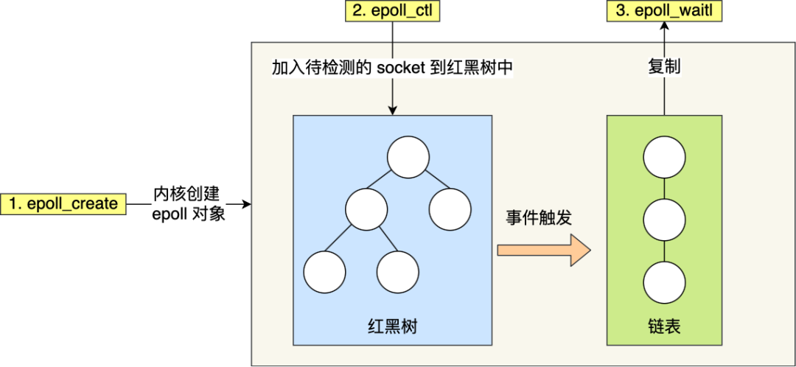
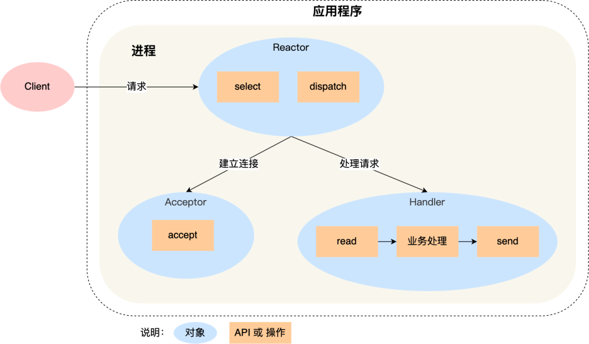
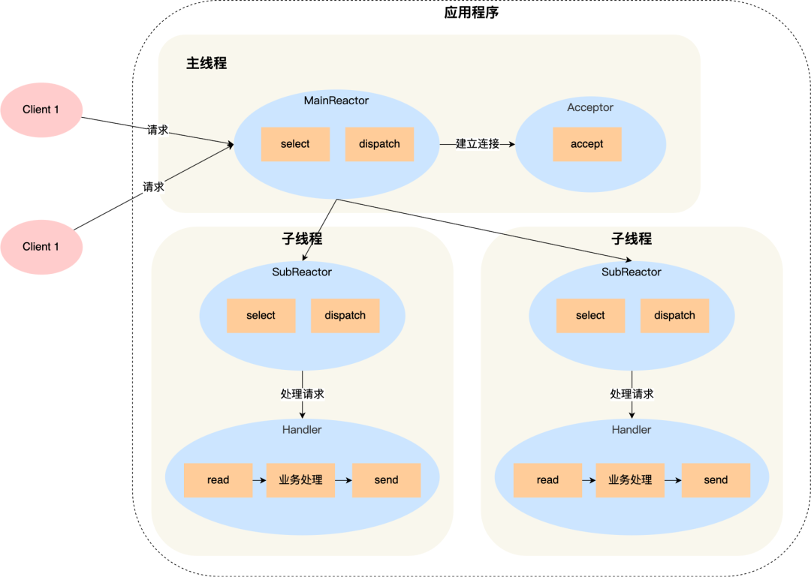
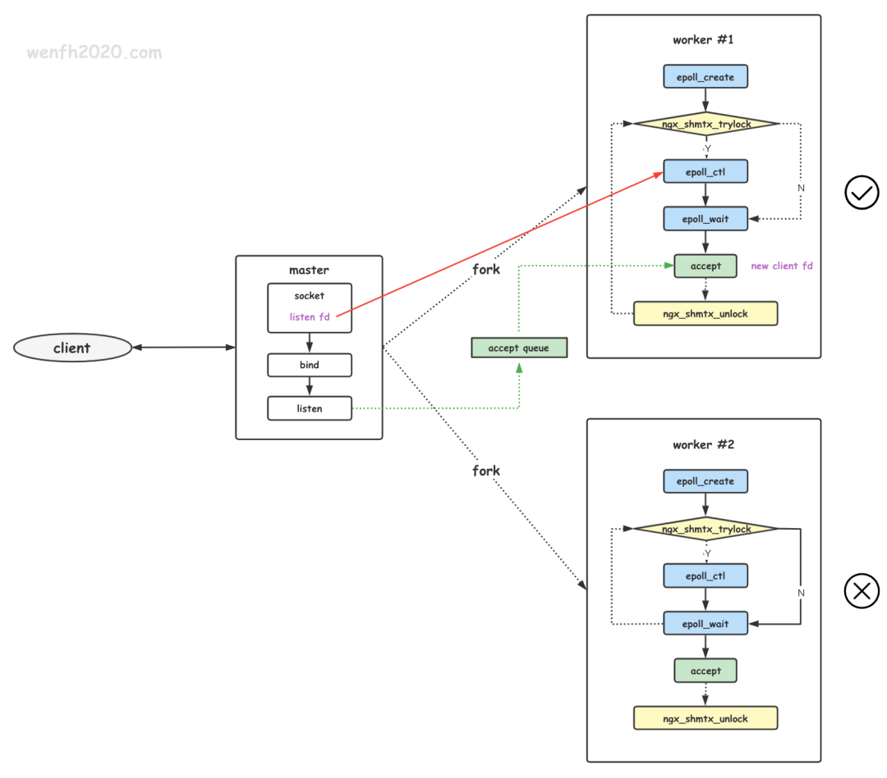
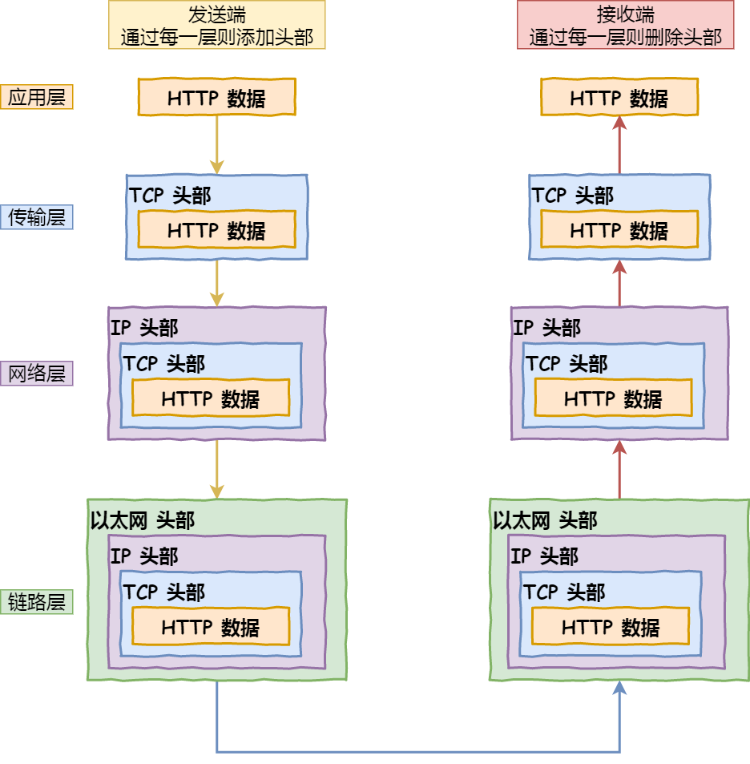
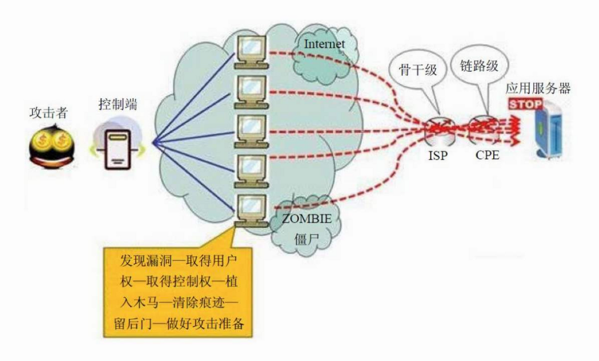
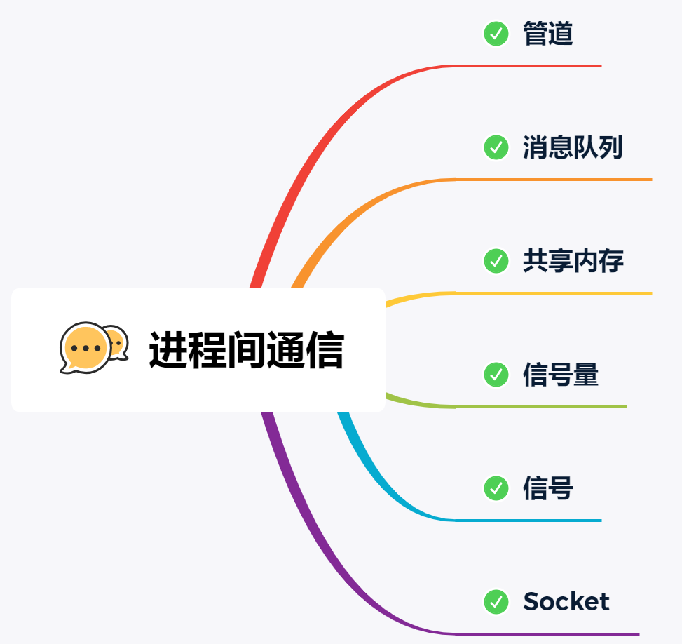
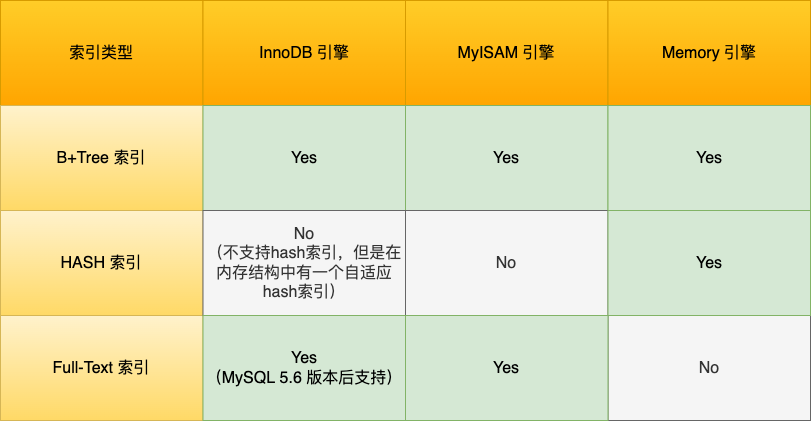
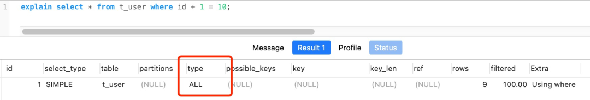

## 主要重点考察了网络i/o、网络协议、linux系统、mysql

# 服务器处理并发请求有哪几种方式？

- 单线程web服务器方式：web服务器一次处理一个请求，结束后读取并处理下一个请求，性能比较低，一次只能处理一个请求。
- 多进程/多线程web服务器：web服务器生成多个进程或线程并行处理多个用户请求，进程或线程可以按需或事先生成。有的web服务器应用程序为每个用户请求生成一个单独的进程或线程来进行响应，不过，一旦并发请求数量达到成千上万时，多个同时运行的进程或线程将会消耗大量的系统资源。（即每个进程只能响应一个请求，并且一个进程对应一个线程）
- I/O多路复用web服务器：web服务器可以I/O多路复用，达到只用一个线程就能监听和处理多个客户端的 i/o 事件。
- 多路复用多线程web服务器：将多进程和多路复用的功能结合起来形成的web服务器架构，其避免了让一个进程服务于过多的用户请求，并能充分利用多CPU主机所提供的计算能力。（这种架构可以理解为有多个进程，并且一个进程又生成多个线程，每个线程处理一个请求）

# 说一下select，poll，epoll的区别？

select 和 poll 内部都是使用「线性结构」来存储进程关注的 Socket 集合。

在使用的时候，首先需要把关注的 Socket 集合通过 select/poll 系统调用从用户态拷贝到内核态，然后由内核检测事件，当有网络事件产生时，内核需要遍历进程关注 Socket 集合，找到对应的 Socket，并设置其状态为可读/可写，然后把整个 Socket 集合从内核态拷贝到用户态，用户态还要继续遍历整个 Socket 集合找到可读/可写的 Socket，然后对其处理。

很明显发现，select 和 poll 的缺陷在于，当客户端越多，也就是 Socket 集合越大，Socket 集合的遍历和拷贝会带来很大的开销，因此也很难应对 C10K。

epoll 是解决 C10K 问题的利器，通过两个方面解决了 select/poll 的问题。



img

- epoll 在内核里使用「红黑树」来关注进程所有待检测的 Socket，红黑树是个高效的数据结构，增删改一般时间复杂度是 O(logn)，通过对这棵黑红树的管理，不需要像 select/poll 在每次操作时都传入整个 Socket 集合，减少了内核和用户空间大量的数据拷贝和内存分配。
- epoll 使用事件驱动的机制，内核里维护了一个「链表」来记录就绪事件，只将有事件发生的 Socket 集合传递给应用程序，不需要像 select/poll 那样轮询扫描整个集合（包含有和无事件的 Socket ），大大提高了检测的效率。

# Java 有一种现代的处理方式，属于异步I/O，是什么？

AIO（Asynchronous I/O）是一种异步I/O模型，它在进行I/O操作时不会阻塞应用程序的执行。AIO的主要目的是通过充分利用操作系统的异步I/O特性来提高系统的并发性能和响应性。

在传统的阻塞式I/O模型中，应用程序在发起一个I/O操作后需要等待操作完成，这期间无法进行其他任务。而在AIO模型中，应用程序可以继续执行其他任务，而无需等待I/O操作完成。

AIO的实现通常基于操作系统提供的异步I/O机制，例如Windows下的IOCP（I/O Completion Ports）或Linux下的epoll，这些机制通过事件驱动的方式来处理I/O操作。

在Java中，AIO是在Java 1.7中引入的，也称为NIO.2。Java AIO提供了一组非阻塞的异步I/O API，包括了异步通道（AsynchronousChannel）、异步文件通道（AsynchronousFileChannel）、异步套接字通道（AsynchronousSocketChannel）等。

以下是AIO的一般工作流程：

1. 打开异步通道：应用程序通过打开异步通道来准备进行异步I/O操作。
2. 注册兴趣事件：应用程序通过选择器（Selector）将异步通道注册到感兴趣的事件上，比如读就绪、写就绪等。
3. 发起异步操作：应用程序发起异步I/O操作，例如异步读取文件、异步写入网络等。在发起操作时，需要提供一个回调处理器（CompletionHandler），用于在操作完成后处理结果。
4. 继续执行其他任务：在等待I/O操作完成的过程中，应用程序可以继续执行其他任务，而不会被阻塞。
5. 处理异步操作结果：当I/O操作完成时，底层系统会通知应用程序，并调用注册的回调处理器来处理操作结果。

AIO模型的优点是能够充分利用系统资源和并发能力，提供更高的吞吐量和响应性能。它特别适用于处理大量并发连接、高负载的网络服务等场景。

然而，AIO也有一些限制和注意事项。首先，AIO的实现在不同的操作系统上存在差异，需要根据具体平台进行适配。其次，在某些情况下，AIO并不一定比传统的阻塞式I/O或非阻塞式I/O更高效，应根据具体需求进行选择和评估。

总之，AIO是一种异步I/O模型，通过充分利用操作系统的异步I/O机制来提高系统的并发性能和响应性。在Java中，AIO通过一组非阻塞的异步I/O API提供支持，可以实现高性能的异步I/O编程。

# redis，nginx，netty 是依赖什么做的这么高性能？

主要是依赖Reactor 模式实现了高性能网络模式，这个是在i/o多路复用接口基础上实现的了网络模型。Reactor 翻译过来的意思是「反应堆」，这里的反应指的是「对事件反应」，也就是来了一个事件，Reactor 就有相对应的反应/响应。

Reactor 模式主要由 Reactor 和处理资源池这两个核心部分组成，它俩负责的事情如下：

- Reactor 负责监听和分发事件，事件类型包含连接事件、读写事件；
- 处理资源池负责处理事件，如 read -> 业务逻辑 -> send；

Reactor 模式是灵活多变的，可以应对不同的业务场景，灵活在于：

- Reactor 的数量可以只有一个，也可以有多个；
- 处理资源池可以是单个进程 / 线程，也可以是多个进程 /线程；

Redis 6.0 之前使用的 Reactor 模型就是单 Reactor 单进程模式。单 Reactor 单进程的方案因为全部工作都在同一个进程内完成，所以实现起来比较简单，不需要考虑进程间通信，也不用担心多进程竞争。



img

但是，这种方案存在 2 个缺点：

- 第一个缺点，因为只有一个进程，**无法充分利用 多核 CPU 的性能**；
- 第二个缺点，Handler 对象在业务处理时，整个进程是无法处理其他连接的事件的，**如果业务处理耗时比较长，那么就造成响应的延迟**；

所以，单 Reactor 单进程的方案**不适用计算机密集型的场景，只适用于业务处理非常快速的场景**。

Redis 是由 C 语言实现的，在 Redis 6.0 版本之前采用的正是「单 Reactor 单进程」的方案，因为 Redis 业务处理主要是在内存中完成，操作的速度是很快的，性能瓶颈不在 CPU 上，所以 Redis 对于命令的处理是单进程的方案。

Netty 是采用了多 Reactor 多线程方案，如下图：



img

多 Reactor 多线程的方案优势：

- 主线程和子线程分工明确，主线程只负责接收新连接，子线程负责完成后续的业务处理。
- 主线程和子线程的交互很简单，主线程只需要把新连接传给子线程，子线程无须返回数据，直接就可以在子线程将处理结果发送给客户端。

Netty 是多 Reactor 多进程方案，不过方案与标准的多 Reactor 多进程有些差异。



具体差异表现在主进程中仅仅用来初始化 socket，并没有创建 mainReactor 来 accept 连接，而是由子进程的 Reactor 来 accept 连接，通过锁来控制一次只有一个子进程进行 accept（防止出现惊群现象），子进程 accept 新连接后就放到自己的 Reactor 进行处理，不会再分配给其他子进程。

# https是如何防范中间人的攻击？

主要通过加密和身份校验机制来防范中间人攻击的。


- 加密：https 握手期间会通过非对称加密的方式来协商出对称加密密钥。
- 身份校验：服务器会向证书颁发机构申请数字证书，证书中包含了服务器的公钥和其他相关信息。当客户端与服务器建立连接时，服务器会将证书发送给客户端。客户端会验证证书的合法性，包括检查证书的有效期、颁发机构的信任等。如果验证通过，客户端会使用证书中的公钥来加密通信数据，并将加密后的数据发送给服务器，然后由服务端用私钥解密。

中间人攻击的关键在于攻击者冒充服务器与客户端建立连接，并同时与服务器建立连接。但由于攻击者无法获得服务器的私钥，因此无法正确解密客户端发送的加密数据。同时，客户端会在建立连接时验证服务器的证书，如果证书验证失败或存在问题，客户端会发出警告或中止连接。

# 描述一下打开百度首页后发生的网络过程



- 对 URL 进行解析，解析出域名、方法、资源等，然后生成 http 请求报文。
- 对域名进行 dns 解析，首先会看浏览器和操作系统是否有 dns 解析的缓存，如果没有的话，就会通过dns 解析，dns 解析过程：

- - 发起DNS查询：当用户在浏览器中输入一个域名（如www.baidu.com）后，操作系统会首先检查本地的DNS缓存，如果有对应的IP地址，则直接返回结果。如果缓存中没有对应的IP地址，操作系统会向本地DNS服务器发送一个DNS查询请求。
  - 本地DNS服务器查询：本地DNS服务器收到DNS查询请求后，会先检查自己的缓存，如果有对应的IP地址，则直接返回结果给操作系统。如果本地DNS服务器没有缓存对应的IP地址，它会向根DNS服务器发送一个迭代查询请求。
  - 根DNS服务器查询：根DNS服务器是顶级DNS服务器，它存储了全球顶级域名服务器的信息。当根DNS服务器收到迭代查询请求后，它会根据请求的顶级域名（如.com）返回对应的顶级域名服务器的IP地址给本地DNS服务器。
  - 顶级域名服务器查询：本地DNS服务器收到根DNS服务器返回的顶级域名服务器的IP地址后，会向顶级域名服务器发送查询请求。顶级域名服务器根据请求的域名（如baidu.com）返回该域名对应的权威域名服务器的IP地址。
  - 权威域名服务器查询：本地DNS服务器收到顶级域名服务器返回的权威域名服务器的IP地址后，会向权威域名服务器发送查询请求。权威域名服务器是负责管理该域名下所有主机记录的服务器，它会根据请求的域名返回对应的主机记录的IP地址。
  - 返回结果：本地DNS服务器收到权威域名服务器返回的主机记录的IP地址后，会将结果返回给操作系统。操作系统将IP地址返回给浏览器，浏览器根据IP地址建立与服务器的TCP连接，并发起HTTP请求。

- 建立TCP连接：浏览器使用HTTP协议通过TCP/IP建立与百度服务器的连接。它会向百度服务器发送一个SYN（同步）包，然后等待百度服务器的确认响应。
- 三次握手：百度服务器收到浏览器发送的SYN包后，会发送一个SYN+ACK（同步确认）包给浏览器，表示接受连接请求。浏览器收到百度服务器的响应后，会发送一个ACK（确认）包给服务器，完成三次握手，建立可靠的连接。
- 发送HTTP请求：浏览器向百度服务器发送一个HTTP请求，请求百度首页的HTML文档。请求中包含了请求方法、请求头和其他相关信息。
- 服务器处理请求：百度服务器接收到浏览器发送的HTTP请求后，会根据请求的内容进行处理。它可能会读取数据库、执行相关的业务逻辑，并生成响应数据。
- 发送HTTP响应：百度服务器将生成的响应数据封装成HTTP响应报文，并发送回浏览器。响应报文中包含了响应状态码、响应头和响应体等信息。
- 接收响应和渲染页面：浏览器接收到百度服务器发送的HTTP响应后，会解析响应报文，提取出HTML文档和其他相关资源。浏览器会根据HTML文档的结构和CSS样式，渲染出页面的可视化效果。
- 关闭TCP连接：当浏览器完成页面渲染后，会关闭与百度服务器的TCP连接。它会发送一个FIN（结束）包给服务器，表示关闭连接请求。百度服务器收到请求后，会发送一个ACK包给浏览器，表示接受关闭连接请求。最终，浏览器和服务器都关闭了TCP连接。

# 什么是ddos攻击？怎么防范？

分布式拒绝服务（DDoS）攻击是通过大规模互联网流量淹没目标服务器或其周边基础设施，以破坏目标服务器、服务或网络正常流量的恶意行为。

DDoS 攻击是通过连接互联网的计算机网络进行的。这些网络由计算机和其他设备（例如 IoT 设备）组成，它们感染了恶意软件，从而被攻击者远程控制。这些个体设备称为机器人（或僵尸），一组机器人则称为僵尸网络。



一旦建立了僵尸网络，攻击者就可通过向每个机器人发送远程指令来发动攻击。当僵尸网络将受害者的服务器或网络作为目标时，每个机器人会将请求发送到目标的 IP 地址，这可能导致服务器或网络不堪重负，从而造成对正常流量的拒绝服务。由于每个机器人都是合法的互联网设备，因而可能很难区分攻击流量与正常流量。

常见的DDoS攻击包括以下几类：

- **网络层攻击**：比较典型的攻击类型是UDP反射攻击，例如：NTP Flood攻击，这类攻击主要利用大流量拥塞被攻击者的网络带宽，导致被攻击者的业务无法正常响应客户访问。
- **传输层攻击**：比较典型的攻击类型包括SYN Flood攻击、连接数攻击等，这类攻击通过占用服务器的连接池资源从而达到拒绝服务的目的。
- **会话层攻击**：比较典型的攻击类型是SSL连接攻击，这类攻击占用服务器的SSL会话资源从而达到拒绝服务的目的。
- **应用层攻击**：比较典型的攻击类型包括DNS flood攻击、HTTP flood攻击、游戏假人攻击等，这类攻击占用服务器的应用处理资源极大的消耗服务器处理性能从而达到拒绝服务的目的。

为了防范DDoS攻击，可以采取以下措施：

- 增强网络基础设施：提升网络带宽、增加服务器的处理能力和承载能力，通过增强基础设施的能力来抵御攻击。
- 使用防火墙和入侵检测系统：配置防火墙规则，限制不必要的网络流量，阻止来自可疑IP地址的流量。入侵检测系统可以帮助及时发现并响应DDoS攻击。
- 流量清洗和负载均衡：使用专业的DDoS防护服务提供商，通过流量清洗技术过滤掉恶意流量，将合法流量转发给目标服务器。负载均衡可以将流量均匀地分发到多台服务器上，减轻单一服务器的压力。
- 配置访问控制策略：限制特定IP地址或IP段的访问，设置访问频率限制，防止过多请求集中在单个IP上。

# 进程中通信的方式有哪些？



5.2 进程间有哪些通信方式？| 小林coding

Linux 内核提供了不少进程间通信的方式，其中最简单的方式就是管道，管道分为「匿名管道」和「命名管道」。

**匿名管道**顾名思义，它没有名字标识，匿名管道是特殊文件只存在于内存，没有存在于文件系统中，shell 命令中的「|」竖线就是匿名管道，通信的数据是**无格式的流并且大小受限**，通信的方式是**单向**的，数据只能在一个方向上流动，如果要双向通信，需要创建两个管道，再来**匿名管道是只能用于存在父子关系的进程间通信**，匿名管道的生命周期随着进程创建而建立，随着进程终止而消失。

**命名管道**突破了匿名管道只能在亲缘关系进程间的通信限制，因为使用命名管道的前提，需要在文件系统创建一个类型为 p 的设备文件，那么毫无关系的进程就可以通过这个设备文件进行通信。另外，不管是匿名管道还是命名管道，进程写入的数据都是**缓存在内核**中，另一个进程读取数据时候自然也是从内核中获取，同时通信数据都遵循**先进先出**原则，不支持 lseek 之类的文件定位操作。

**消息队列**克服了管道通信的数据是无格式的字节流的问题，消息队列实际上是保存在内核的「消息链表」，消息队列的消息体是可以用户自定义的数据类型，发送数据时，会被分成一个一个独立的消息体，当然接收数据时，也要与发送方发送的消息体的数据类型保持一致，这样才能保证读取的数据是正确的。消息队列通信的速度不是最及时的，毕竟**每次数据的写入和读取都需要经过用户态与内核态之间的拷贝过程。**

**共享内存**可以解决消息队列通信中用户态与内核态之间数据拷贝过程带来的开销，**它直接分配一个共享空间，每个进程都可以直接访问**，就像访问进程自己的空间一样快捷方便，不需要陷入内核态或者系统调用，大大提高了通信的速度，享有**最快**的进程间通信方式之名。但是便捷高效的共享内存通信，**带来新的问题，多进程竞争同个共享资源会造成数据的错乱。**

那么，就需要**信号量**来保护共享资源，以确保任何时刻只能有一个进程访问共享资源，这种方式就是互斥访问。**信号量不仅可以实现访问的互斥性，还可以实现进程间的同步**，信号量其实是一个计数器，表示的是资源个数，其值可以通过两个原子操作来控制，分别是 **P 操作和 V 操作**。

与信号量名字很相似的叫**信号**，它俩名字虽然相似，但功能一点儿都不一样。信号是**异步通信机制**，信号可以在应用进程和内核之间直接交互，内核也可以利用信号来通知用户空间的进程发生了哪些系统事件，信号事件的来源主要有硬件来源（如键盘 Cltr+C ）和软件来源（如 kill 命令），一旦有信号发生，**进程有三种方式响应信号 1. 执行默认操作、2. 捕捉信号、3. 忽略信号**。有两个信号是应用进程无法捕捉和忽略的，即 SIGKILL 和 SIGSTOP，这是为了方便我们能在任何时候结束或停止某个进程。

前面说到的通信机制，都是工作于同一台主机，如果**要与不同主机的进程间通信，那么就需要 Socket 通信了**。Socket 实际上不仅用于不同的主机进程间通信，还可以用于本地主机进程间通信，可根据创建 Socket 的类型不同，分为三种常见的通信方式，一个是基于 TCP 协议的通信方式，一个是基于 UDP 协议的通信方式，一个是本地进程间通信方式。

# 怎么查看哪个端口被哪个进程占用？

可以通过 lsof 或者 netstate 命令查看，比如查看 80 端口。

lsof ：

```bash
[root@xiaolin ~]# lsof -i :80
COMMAND     PID  USER   FD   TYPE   DEVICE SIZE/OFF NODE NAME
nginx       929  root    6u  IPv4    15249      0t0  TCP *:http (LISTEN)
nginx       929  root    7u  IPv6    15250      0t0  TCP *:http (LISTEN)
nginx       934 nginx    6u  IPv4    15249      0t0  TCP *:http (LISTEN)
nginx       934 nginx    7u  IPv6    15250      0t0  TCP *:http (LISTEN)
AliYunDun 16507  root   10u  IPv4 40212783      0t0  TCP xiaolin:41830->100.100.30.26:http (ESTABLISHED)
```

netstate：

```bash
[root@xiaolin ~]# netstat -napt | grep 80
tcp        0      0 0.0.0.0:80       0.0.0.0:*       LISTEN      929/nginx: master p
```

# 用shell命令替换一个文件中的字符串

可以使用sed命令。以下是一个示例：

```bash
sed -i 's/旧字符串/新字符串/g' 文件名
```

在上面的命令中，-i选项表示直接在原始文件中进行修改，而不是输出到标准输出。s/旧字符串/新字符串/g是替换操作的模式，其中旧字符串是要替换的字符串，新字符串是替换后的新字符串。g表示全局替换，即一行中出现多次的旧字符串都会被替换。

请注意，这将直接修改原始文件，如果需要备份原始文件，可以在-i选项后面指定一个备份文件的扩展名，例如-i.bak，这将在替换前备份原始文件。

例如，假设要将文件example.txt中的字符串Hello替换为Hi，可以运行以下命令：

```bash
sed -i 's/Hello/Hi/g' example.txt
```

# linux中有一个日志文件，日志文件中记录了访问请求的信息，第一列是访问的日期，第二列是请求的ip，第三列是请求的耗时，写一条shell命令来查到请求耗时最高的10条记录

要查找请求耗时最高的10条记录，可以使用以下Shell命令：

```bash
sort -k3 -nr 日志文件 | head -n 10
```

在上面的命令中，sort -k3 -nr用于按第三列（请求耗时）进行倒序排序。-k3表示按第三列排序，-n表示按数字排序，-r表示倒序排序。然后，使用head -n 10来获取排序后的前10行，即耗时最高的10条记录。

将命令中的“日志文件”替换为实际的日志文件路径，即可查找到请求耗时最高的10条记录。

# 假如cpu跑到100%，你的解决思路是什么？

思路如下：

- 先通过 top 命令，定位到占用 cpu 高的进程
- 然后通过  ps -T -p<> <进程ID> 命令找到进程中占用比较高的线程
- 然后通过 jstack 命令去查看该线程的堆栈信息
- 根据输出的堆栈信息，去项目中定位代码，看是否发生了死循环而导致cpu跑到100%

# mysql有哪几种存储引擎，它们的区别是什么？



img

- InnoDB：是MySQL的默认存储引擎，支持事务、行级锁定和外键约束等特性。它采用了聚集索引的方式来组织数据，具有较好的并发性能和数据完整性，适用于大多数应用场景。
- MyISAM：是MySQL早期的存储引擎，不支持事务和行级锁定，但具有较高的插入和查询速度。它采用了表级锁定的方式，适合于读密集型应用，如数据仓库、日志等。
- Memory：也称为Heap存储引擎，将数据存储在内存中，读写速度非常快，但数据在服务器关闭时会丢失。适用于临时表、缓存等需要快速读写的场景。

# mysql的隔离级别分为哪几种类型？

- **读未提交**，指一个事务还没提交时，它做的变更就能被其他事务看到；
- **读提交**，指一个事务提交之后，它做的变更才能被其他事务看到；
- **可重复读**，指一个事务执行过程中看到的数据，一直跟这个事务启动时看到的数据是一致的，**MySQL InnoDB 引擎的默认隔离级别**；
- **串行化**；会对记录加上读写锁，在多个事务对这条记录进行读写操作时，如果发生了读写冲突的时候，后访问的事务必须等前一个事务执行完成，才能继续执行；

接下来，举个具体的例子来说明这四种隔离级别，有一张账户余额表，里面有一条账户余额为 100 万的记录。然后有两个并发的事务，事务 A 只负责查询余额，事务 B 则会将我的余额改成 200 万，下面是按照时间顺序执行两个事务的行为：


图片

在不同隔离级别下，事务 A 执行过程中查询到的余额可能会不同：

- 在「读未提交」隔离级别下，事务 B 修改余额后，虽然没有提交事务，但是此时的余额已经可以被事务 A 看见了，于是事务 A 中余额 V1 查询的值是 200 万，余额 V2、V3 自然也是 200 万了；
- 在「读提交」隔离级别下，事务 B 修改余额后，因为没有提交事务，所以事务 A 中余额 V1 的值还是 100 万，等事务 B 提交完后，最新的余额数据才能被事务 A 看见，因此额 V2、V3 都是 200 万；
- 在「可重复读」隔离级别下，事务 A 只能看见启动事务时的数据，所以余额 V1、余额 V2 的值都是 100 万，当事务 A 提交事务后，就能看见最新的余额数据了，所以余额 V3 的值是 200 万；
- 在「串行化」隔离级别下，事务 B 在执行将余额 100 万修改为 200 万时，由于此前事务 A 执行了读操作，这样就发生了读写冲突，于是就会被锁住，直到事务 A 提交后，事务 B 才可以继续执行，所以从 A 的角度看，余额 V1、V2 的值是 100 万，余额 V3 的值是 200万。

这四种隔离级别具体是如何实现的呢？

- 对于「读未提交」隔离级别的事务来说，因为可以读到未提交事务修改的数据，所以直接读取最新的数据就好了；
- 对于「串行化」隔离级别的事务来说，通过加读写锁的方式来避免并行访问；
- 对于「读提交」和「可重复读」隔离级别的事务来说，它们是通过 Read View来实现的，它们的区别在于创建 Read View 的时机不同，**「读提交」隔离级别是在「每个语句执行前」都会重新生成一个 Read View，而「可重复读」隔离级别是「启动事务时」生成一个 Read View，然后整个事务期间都在用这个 Read View**。

# 慢查询是如何调试解决的？

- 确认慢查询：首先，通过MySQL的慢查询日志或性能监控工具，确认哪些SQL查询较慢，需要进行调优。
- 分析执行计划：通过使用EXPLAIN关键字，可以获取SQL查询的执行计划。执行计划可以告诉您MySQL是如何执行查询的，包括使用的索引、连接方式等。分析执行计划可帮助您理解查询的性能瓶颈所在。
- 优化查询语句：根据执行计划的分析结果，考虑对查询语句进行优化。例如，添加合适的索引、调整查询条件、避免全表扫描等。优化查询语句可以提高查询性能。
- 优化数据库结构：有时，慢查询的性能问题可能与数据库结构有关。考虑对表结构进行优化，例如拆分大表、规范化设计等。合理的数据库结构可以提高查询性能。
- 缓存和查询缓存：对于一些频繁查询的结果，可以考虑使用缓存机制，避免重复的查询操作。

# mysql的explain有什么作用

explain 是查看 sql 的执行计划，主要用来分析 sql 语句的执行过程，比如有没有走索引，有没有外部排序，有没有索引覆盖等等。

如下图，就是一个没有使用索引，并且是一个全表扫描的查询语句。



img

对于执行计划，参数有：

- possible_keys 字段表示可能用到的索引；
- key 字段表示实际用的索引，如果这一项为 NULL，说明没有使用索引；
- key_len 表示索引的长度；
- rows 表示扫描的数据行数。
- type 表示数据扫描类型，我们需要重点看这个。

type 字段就是描述了找到所需数据时使用的扫描方式是什么，常见扫描类型的**执行效率从低到高的顺序为**：

- All（全表扫描）；
- index（全索引扫描）；
- range（索引范围扫描）；
- ref（非唯一索引扫描）；
- eq_ref（唯一索引扫描）；
- const（结果只有一条的主键或唯一索引扫描）。

在这些情况里，all 是最坏的情况，因为采用了全表扫描的方式。index 和 all 差不多，只不过 index 对索引表进行全扫描，这样做的好处是不再需要对数据进行排序，但是开销依然很大。所以，要尽量避免全表扫描和全索引扫描。

range 表示采用了索引范围扫描，一般在 where 子句中使用 < 、>、in、between 等关键词，只检索给定范围的行，属于范围查找。**从这一级别开始，索引的作用会越来越明显，因此我们需要尽量让 SQL 查询可以使用到** **range** **这一级别及以上的 type 访问方式**。

ref 类型表示采用了非唯一索引，或者是唯一索引的非唯一性前缀，返回数据返回可能是多条。因为虽然使用了索引，但该索引列的值并不唯一，有重复。这样即使使用索引快速查找到了第一条数据，仍然不能停止，要进行目标值附近的小范围扫描。但它的好处是它并不需要扫全表，因为索引是有序的，即便有重复值，也是在一个非常小的范围内扫描。

eq_ref 类型是使用主键或唯一索引时产生的访问方式，通常使用在多表联查中。比如，对两张表进行联查，关联条件是两张表的 user_id 相等，且 user_id 是唯一索引，那么使用 EXPLAIN 进行执行计划查看的时候，type 就会显示 eq_ref。

const 类型表示使用了主键或者唯一索引与常量值进行比较，比如 select name from product where id=1。

需要说明的是 const 类型和 eq_ref 都使用了主键或唯一索引，不过这两个类型有所区别，**const 是与常量进行比较，查询效率会更快，而 eq_ref 通常用于多表联查中**。

extra 显示的结果，这里说几个重要的参考指标：

- Using filesort ：当查询语句中包含 group by 操作，而且无法利用索引完成排序操作的时候， 这时不得不选择相应的排序算法进行，甚至可能会通过文件排序，效率是很低的，所以要避免这种问题的出现。
- Using temporary：使了用临时表保存中间结果，MySQL 在对查询结果排序时使用临时表，常见于排序 order by 和分组查询 group by。效率低，要避免这种问题的出现。
- Using index：所需数据只需在索引即可全部获得，不须要再到表中取数据，也就是使用了覆盖索引，避免了回表操作，效率不错。

# Java中有哪些常用的锁，在什么场景下使用？

- synchronized：是Java内置的关键字，用于实现互斥锁。在多线程环境下，通过对代码块或方法添加synchronized关键字，可以确保同一时刻只有一个线程执行该代码块或方法。适用于对共享资源的访问进行同步控制的场景。
- ReentrantLock：是Java.util.concurrent包提供的可重入锁实现。与synchronized相比，ReentrantLock提供了更灵活的锁定方式，例如可以手动控制锁的获取和释放、支持公平锁等。适用于需要更高级别控制的场景。
- ReadWriteLock：是Java.util.concurrent包提供的读写锁接口。读写锁允许多个线程同时读共享资源，但在写操作时需要独占锁。适用于读多写少的场景，可以提高并发性能。
- StampedLock：是Java.util.concurrent包提供的乐观读写锁。与ReadWriteLock相比，StampedLock提供了更高的并发性能，但使用方式较为复杂。适用于读多写少、读操作频繁的场景。
- AtomicInteger：是Java.util.concurrent.atomic包提供的原子整数类。通过使用AtomicInteger类，可以实现在多线程环境下对整数值的原子操作，避免线程安全问题。适用于对整数值进行原子操作的场景。

# 什么是反射？有哪些使用场景？

Java 反射机制是在运行状态中，对于任意一个类，都能够知道这个类中的所有属性和方法，对于任意一个对象，都能够调用它的任意一个方法和属性；这种动态获取的信息以及动态调用对象的方法的功能称为 Java 语言的反射机制。

应用场景：

- 逆向代码，例如反编译
- 与注解相结合的框架，如 Retrofit
- 单纯的反射机制应用框架，例如 EventBus（事件总线）
- 动态生成类框架 例如Gson

# 给定a、b两个文件，各存放50亿个url，每个url各占64字节，内存限制是4G，让你找出a、b文件共同的url

方法：分治+hashmap

- 遍历文件a，**对每个url求取hash(url)%1000**，然后根据所取得的值将url分别存储到1000个小文件（记为a0,a1,…,a999）中。这样每个小文件的大约为300M。
- 遍历文件b，采取和a相同的方式将url分别存储到1000小文件（记为b0,b1,…,b999）。这样处理后，所有可能相同的url都在对应的小文件（a0-b0， a1-b1,…,a999-b999）中，不对应的小文件不可能有相同的url。然后我们只要求出1000对小文件中相同的url即可。
- 求每对小文件中相同的url时，可以把其中一个小文件的url存储到hash_set中。然后遍历另一个小文件的每个url，看其是否在刚才构建的hash_set中，如果是，那么就是共同的url，存到文件里面就可以了。

# 算法题：一个长度为n的数组找出最大的m个数