## 从常见的数据结构->Java 集合>MySQL B+树->Redis 数据结构，重基础！

# LRU是什么？如何实现？

LRU 是一种缓存淘汰算法，当缓存空间已满时，优先淘汰最长时间未被访问的数据。

实现的方式是哈希表+双向链表结合。

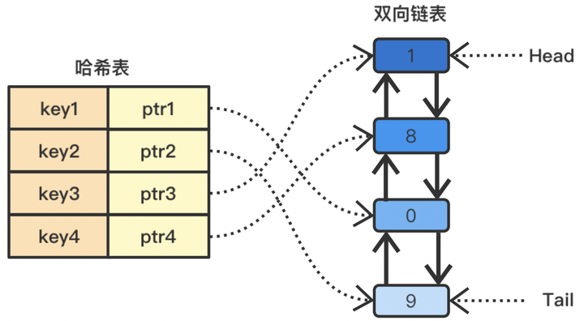

<center>LRU</center>

具体实现步骤如下：

- 使用哈希表存储数据的键值对，键为缓存的键，值为对应的节点。
- 使用双向链表存储数据节点，链表头部为最近访问的节点，链表尾部为最久未访问的节点。
- 当数据被访问时，如果数据存在于缓存中，则将对应节点移动到链表头部；如果数据不存在于缓存中，则将数据添加到缓存中，同时创建一个新节点并插入到链表头部。
- 当缓存空间已满时，需要淘汰最久未访问的节点，即链表尾部的节点。

上面这种思想方式，LRU 算法可以在 O(1) 的时间复杂度内实现数据的插入、查找和删除操作。每次访问数据时，都会将对应的节点移动到链表头部，保证链表头部的节点是最近访问的数据，而链表尾部的节点是最久未访问的数据。当缓存空间不足时，淘汰链表尾部的节点即可。

# 平衡二叉树结构是怎么样的？

平衡二叉树是在二叉搜索树的基础上，平衡二叉树还需要满足如下条件:

- 左右两个子树的高度差（平衡因子）的绝对值不超过1
- 左右两个子树都是一棵平衡二叉树

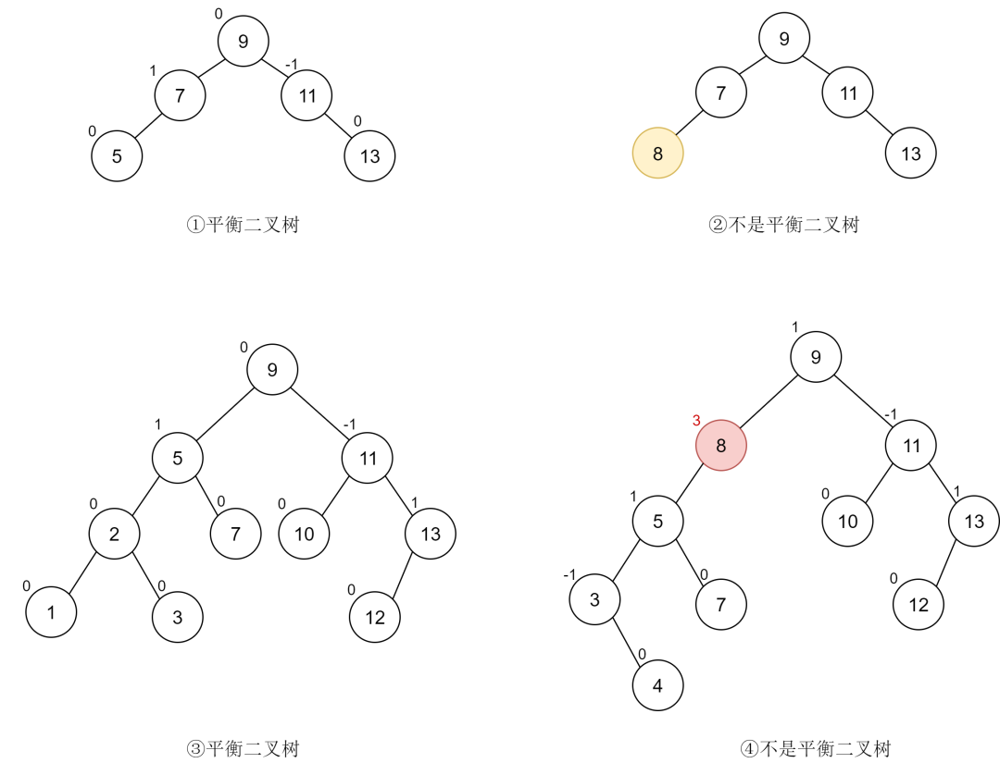

<center>img</center>

分析：

- 图一是一个平衡二叉树，它满足平衡二叉树的定义。
- 图二不是平衡二叉树，其原因并不是不满足平衡因子的条件，而是因为它不满足二叉搜索树的构成条件，这提醒我们平衡二叉树首先要是一棵二叉搜索树。
- 图三满足平衡二叉树的构成条件。
- 图 4 中的节点 (8) 平衡因子为 3，不满足平衡二叉树的要求。

# 堆是什么？

堆是一颗完全二叉树，这样实现的堆也被称为**二叉堆**。堆中节点的值都大于等于（或小于等于）其子节点的值，堆中如果节点的值都大于等于其子节点的值，我们把它称为**大顶堆**，如果都小于等于其子节点的值，我们将其称为**小顶堆**。

下图中，1，2 是大顶堆，3 是小顶堆， 4 不是堆（不是完全二叉树）

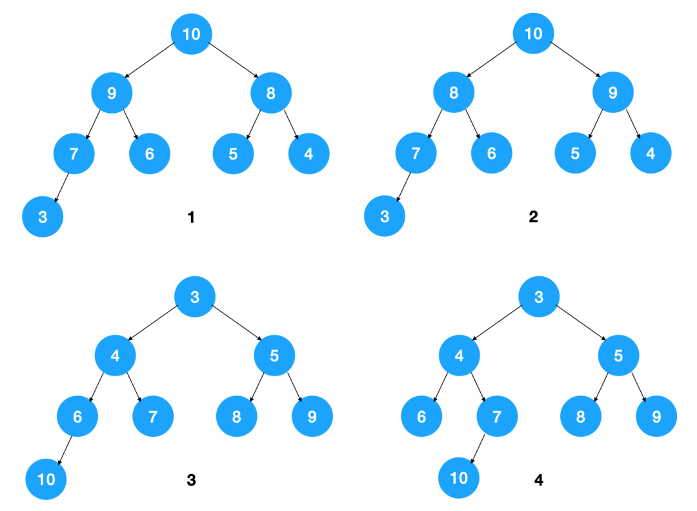


 

# 栈和队列，举个使用场景

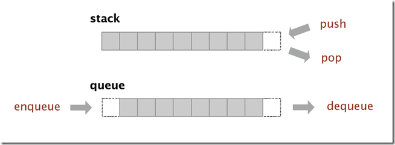

<center>What is Stack and Queue</center>

- 栈是一种后进先出（LIFO）的数据结构，函数的调用和返回往往使用栈来管理函数调用的顺序。
- 队列是一种先进先出（FIFO）的数据结构，类似于排队等待的队伍，先到的人会先被服务。队列常用于需要先进先出的场景，例如：在网络通信或磁盘读写等场景中，使用队列来管理数据的接收和发送顺序，以平衡生产者和消费者之间的速度差异。

# HashMap是怎么实现的？

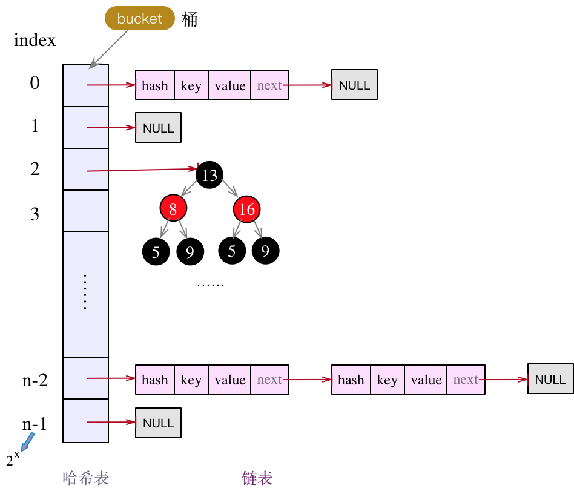

<center>img</center>

存储对象时，我们将K/V传给put方法时，它调用hashCode计算hash从而得到bucket位置，进一步存储，HashMap会根据当前bucket的占用情况自动调整容量(超过Load Facotr则resize为原来的2倍)。

获取对象时，我们将K传给get，它调用hashCode计算hash从而得到bucket位置，并进一步调用equals()方法确定键值对。如果发生碰撞的时候，Hashmap通过链表将产生碰撞冲突的元素组织起来，在Java 8中，如果一个bucket中碰撞冲突的元素超过某个限制(默认是8)，则使用红黑树来替换链表，从而提高速度。

# HashMap扩容过程中链表如何迁移到新的位置？

扩容分为2步：

- **第1步**是对哈希表长度的扩展（2倍）
- **第2步**是将旧哈希表中的数据放到新的哈希表中。

因为我们使用的是2次幂的扩展(指长度扩为原来2倍)，所以，元素的位置要么是在原位置，要么是在原位置再移动2次幂的位置。

如我们从16扩展为32时，具体的变化如下所示：

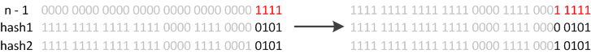

<center>rehash</center>

因此元素在重新计算hash之后，因为n变为2倍，那么n-1的mask范围在高位多1bit(红色)，因此新的index就会发生这样的变化：

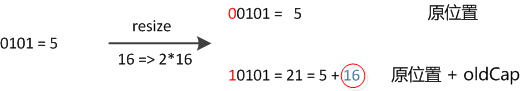

<center>resize</center>

因此，我们在扩充HashMap的时候，不需要重新计算hash，只需要看看原来的hash值新增的那个bit是1还是0就好了，是0的话索引没变，是1的话索引变成“原索引+oldCap”。可以看看下图为16扩充为32的resize示意图：

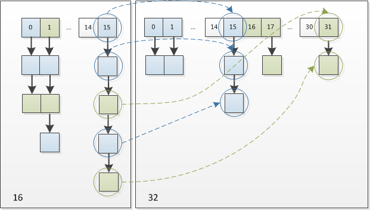

<center>resize16-32</center>

这个设计确实非常的巧妙，既省去了重新计算hash值的时间，而且同时，由于新增的1bit是0还是1可以认为是随机的，因此resize的过程，均匀的把之前的冲突的节点分散到新的bucket了。

# HashMap为什么线程不安全？

两个线程执行put()操作时，可能导致数据覆盖。

假设A、B两个线程同时执行put()操作，且两个key都指向同一个buekct，那么此时两个结点，都会做头插法。当线程A和线程B都获取到了bucket的头结点后，若此时线程A的时间片用完，线程B将其新数据完成了头插法操作，此时轮到线程A操作，但这时线程A所据有的旧头结点已经过时了（并未包含线程B刚插入的新结点），线程A再做头插法操作，就会抹掉B刚刚新增的结点，导致数据丢失。

# ConcurrentHashMap如何保证线程安全的？

在JDK7版本及以前，ConcurrentHashMap类使用了分段锁的技术（segment + Lock），但在jdk8之后，也做了较大改动，使用回了synchronized修饰符。

JDK1.8中的ConcurrentHashMap不再使用Segment分段锁，而是以table数组的头结点作为synchronized的锁。

ConcurrentHashMap保证线程安全主要有三个地方。

- 使用volatile保证当Node中的值变化时对于其他线程是可见的
- 使用table数组的头结点作为synchronized的锁来保证写操作的安全
- 头结点为null时，使用CAS操作来保证数据能正确的写入。

# MySQL为什么InnoDB是默认引擎？

InnoDB引擎在事务支持、并发性能、崩溃恢复等方面具有优势，因此被MySQL选择为默认的存储引擎。

- 事务支持：InnoDB引擎提供了对事务的支持，可以进行ACID（原子性、一致性、隔离性、持久性）属性的操作。Myisam存储引擎是不支持事务的。
- 并发性能：InnoDB引擎采用了行级锁定的机制，可以提供更好的并发性能，Myisam存储引擎只支持表锁，锁的粒度比较大。
- 崩溃恢复：InnoDB引引擎通过 redolog 日志实现了崩溃恢复，可以在数据库发生异常情况（如断电）时，通过日志文件进行恢复，保证数据的持久性和一致性。Myisam是不支持崩溃恢复的。

# MySQL为什么使用B+树？

MySQL 是会将数据持久化在硬盘，而存储功能是由 MySQL 存储引擎实现的，所以讨论 MySQL 使用哪种数据结构作为索引，实际上是在讨论存储引使用哪种数据结构作为索引，InnoDB 是 MySQL 默认的存储引擎，它就是采用了 B+ 树作为索引的数据结构。

要设计一个 MySQL 的索引数据结构，不仅仅考虑数据结构增删改的时间复杂度，更重要的是要考虑磁盘 I/0 的操作次数。因为索引和记录都是存放在硬盘，硬盘是一个非常慢的存储设备，我们在查询数据的时候，最好能在尽可能少的磁盘 I/0 的操作次数内完成。

二分查找树虽然是一个天然的二分结构，能很好的利用二分查找快速定位数据，但是它存在一种极端的情况，每当插入的元素都是树内最大的元素，就会导致二分查找树退化成一个链表，此时查询复杂度就会从 O(logn)降低为 O(n)。

为了解决二分查找树退化成链表的问题，就出现了自平衡二叉树，保证了查询操作的时间复杂度就会一直维持在 O(logn) 。但是它本质上还是一个二叉树，每个节点只能有 2 个子节点，随着元素的增多，树的高度会越来越高。

而树的高度决定于磁盘 I/O 操作的次数，因为树是存储在磁盘中的，访问每个节点，都对应一次磁盘 I/O 操作，也就是说树的高度就等于每次查询数据时磁盘 IO 操作的次数，所以树的高度越高，就会影响查询性能。

B 树和 B+ 都是通过多叉树的方式，会将树的高度变矮，所以这两个数据结构非常适合检索存于磁盘中的数据。

但是 MySQL 默认的存储引擎 InnoDB 采用的是 B+ 作为索引的数据结构。原因有：

- B+ 树的非叶子节点不存放实际的记录数据，仅存放索引，因此数据量相同的情况下，相比存储即存索引又存记录的 B 树，B+树的非叶子节点可以存放更多的索引，因此 B+ 树可以比 B 树更「矮胖」，查询底层节点的磁盘 I/O次数会更少。
- B+ 树有大量的冗余节点（所有非叶子节点都是冗余索引），这些冗余索引让 B+ 树在插入、删除的效率都更高，比如删除根节点的时候，不会像 B 树那样会发生复杂的树的变化；
- B+ 树叶子节点之间用链表连接了起来，有利于范围查询，而 B 树要实现范围查询，因此只能通过树的遍历来完成范围查询，这会涉及多个节点的磁盘 I/O 操作，范围查询效率不如 B+ 树。

# B+树的叶子节点链表是单向还是双向？

双向的，为了实现倒序遍历或者排序。

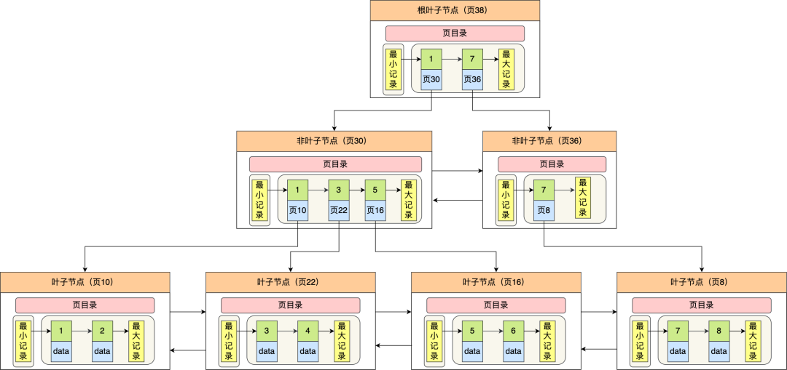

<center>图片</center>

Innodb 使用的 B+ 树有一些特别的点，比如：

- B+ 树的叶子节点之间是用「双向链表」进行连接，这样的好处是既能向右遍历，也能向左遍历。
- B+ 树点节点内容是数据页，数据页里存放了用户的记录以及各种信息，每个数据页默认大小是 16 KB。

Innodb 根据索引类型不同，分为聚集和二级索引。他们区别在于，聚集索引的叶子节点存放的是实际数据，所有完整的用户记录都存放在聚集索引的叶子节点，而二级索引的叶子节点存放的是主键值，而不是实际数据。

因为表的数据都是存放在聚集索引的叶子节点里，所以 InnoDB 存储引擎一定会为表创建一个聚集索引，且由于数据在物理上只会保存一份，所以聚簇索引只能有一个，而二级索引可以创建多个。

# MVCC是什么？作用是什么？

MVCC 是多版本并发控制，MVCC保证了事务之间的隔离性，事务只能看到已经提交的数据版本，从而保证了数据的一致性，并且避免了事务读写并发的问题，因为 select 快照读是不会加锁的。

可重复读隔离级别是开启事务，执行第一个 select 查询的时候，会创建 Read View，然后整个事务期间都在用这个 Read View。读提交隔离级别是在每次select 查询时，都会生成一个新的 Read View。

在创建 Read View 后，我们可以将记录中的 trx_id 划分这三种情况：

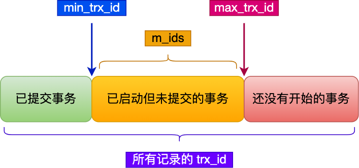

<center>img</center>

一个事务去访问记录的时候，除了自己的更新记录总是可见之外，还有这几种情况：

- 如果记录的 trx_id 值小于 Read View 中的 min_trx_id 值，表示这个版本的记录是在创建 Read View **前**已经提交的事务生成的，所以该版本的记录对当前事务**可见**。
- 如果记录的 trx_id 值大于等于 Read View 中的 max_trx_id 值，表示这个版本的记录是在创建 Read View **后**才启动的事务生成的，所以该版本的记录对当前事务**不可见**。
- 如果记录的 trx_id 值在 Read View 的 min_trx_id 和 max_trx_id之间，需要判断 trx_id 是否在 m_ids 列表中：

- - 如果记录的 trx_id **在** m_ids 列表中，表示生成该版本记录的活跃事务依然活跃着（还没提交事务），所以该版本的记录对当前事务**不可见**。
  - 如果记录的 trx_id **不在** m_ids列表中，表示生成该版本记录的活跃事务已经被提交，所以该版本的记录对当前事务**可见**。

# 更新是如何保证一致的？

更新属于当前读，会加X型的行级锁，是通过锁来保证一致性的。

比如，事务 A 执行对一条 id = 1 的记录进行了更新，其他事务如果想更新或者删除这条记录的话，会发生阻塞，只有当事务 a 提交了事务才会释放锁。

# 如何回滚一条记录？undo log具体怎么回滚？

事务执行过程中，执行 rollback 语句就能回滚事务了。

每当 InnoDB 引擎对一条记录进行操作（修改、删除、新增）时，要把回滚时需要的信息都记录到 undo log 里，比如：

- 在**插入**一条记录时，要把这条记录的主键值记下来，这样之后回滚时只需要把这个主键值对应的记录**删掉**就好了；
- 在**删除**一条记录时，要把这条记录中的内容都记下来，这样之后回滚时再把由这些内容组成的记录**插入**到表中就好了；
- 在**更新**一条记录时，要把被更新的列的旧值记下来，这样之后回滚时再把这些列**更新为旧值**就好了。

在发生回滚时，就读取 undo log 里的数据，然后做原先相反操作。比如当 delete 一条记录时，undo log 中会把记录中的内容都记下来，然后执行回滚操作的时候，就读取 undo log 里的数据，然后进行 insert 操作。

# 如何查询慢sql产生的原因？

可以通过慢查询日志来定位慢 sql 语句。

# 索引失效的情况有哪些？

6 种会发生索引失效的情况：

- 当我们使用左或者左右模糊匹配的时候，也就是 like %xx 或者 like %xx%这两种方式都会造成索引失效；
- 当我们在查询条件中对索引列使用函数，就会导致索引失效。
- 当我们在查询条件中对索引列进行表达式计算，也是无法走索引的。
- MySQL 在遇到字符串和数字比较的时候，会自动把字符串转为数字，然后再进行比较。如果字符串是索引列，而条件语句中的输入参数是数字的话，那么索引列会发生隐式类型转换，由于隐式类型转换是通过 CAST 函数实现的，等同于对索引列使用了函数，所以就会导致索引失效。
- 联合索引要能正确使用需要遵循最左匹配原则，也就是按照最左优先的方式进行索引的匹配，否则就会导致索引失效。
- 在 WHERE 子句中，如果在 OR 前的条件列是索引列，而在 OR 后的条件列不是索引列，那么索引会失效。

# redis数据类型有哪些？

Redis 提供了丰富的数据类型，常见的有五种数据类型：**String****（字符串），Hash（哈希），List（列表），****Set****（集合）、Zset（有序集合）**。

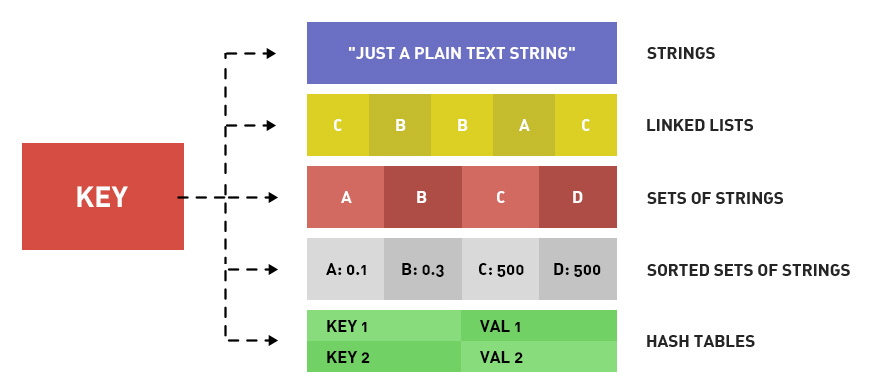

<center>img</center>

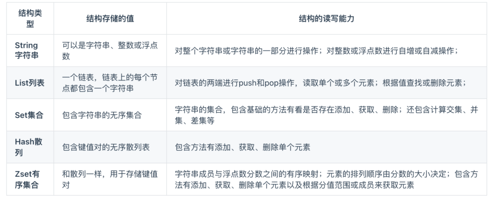

<center>img</center>

随着 Redis 版本的更新，后面又支持了四种数据类型：**BitMap（2.2 版新增）、HyperLogLog（2.8 版新增）、GEO（3.2 版新增）、****Stream****（5.0 版新增）**。Redis 五种数据类型的应用场景：

- String 类型的应用场景：缓存对象、常规计数、分布式锁、共享 session 信息等。
- List 类型的应用场景：消息队列（但是有两个问题：1. 生产者需要自行实现全局唯一 ID；2. 不能以消费组形式消费数据）等。
- Hash 类型：缓存对象、购物车等。
- Set 类型：聚合计算（并集、交集、差集）场景，比如点赞、共同关注、抽奖活动等。
- Zset 类型：排序场景，比如排行榜、电话和姓名排序等。

Redis 后续版本又支持四种数据类型，它们的应用场景如下：

- BitMap（2.2 版新增）：二值状态统计的场景，比如签到、判断用户登陆状态、连续签到用户总数等；
- HyperLogLog（2.8 版新增）：海量数据基数统计的场景，比如百万级网页 UV 计数等；
- GEO（3.2 版新增）：存储地理位置信息的场景，比如滴滴叫车；
- Stream（5.0 版新增）：消息队列，相比于基于 List 类型实现的消息队列，有这两个特有的特性：自动生成全局唯一消息ID，支持以消费组形式消费数据。

# ZSet是怎么实现的？

Zset 类型的底层数据结构是由**压缩列表或跳表**实现的：

- 如果有序集合的元素个数小于 128 个，并且每个元素的值小于 64 字节时，Redis 会使用**压缩列表**作为 Zset 类型的底层数据结构；
- 如果有序集合的元素不满足上面的条件，Redis 会使用**跳表**作为 Zset 类型的底层数据结构，并且还会使用哈希表。

**在 Redis 7.0 中，压缩列表数据结构已经废弃了，交由 listpack 数据结构来实现了。**

# 为什么数据量小的时候用压缩列表？

因为压缩列表一种内存紧凑的数据结构，可以节约内存。

压缩列表是 Redis 为了节约内存而开发的，它是**由连续内存块组成的顺序型数据结构**，有点类似于数组。


<center>img</center>

压缩列表在表头有三个字段：

- ***zlbytes\***，记录整个压缩列表占用对内存字节数；
- ***zltail\***，记录压缩列表「尾部」节点距离起始地址由多少字节，也就是列表尾的偏移量；
- ***zllen\***，记录压缩列表包含的节点数量；
- ***zlend\***，标记压缩列表的结束点，固定值 0xFF（十进制255）。

在压缩列表中，如果我们要查找定位第一个元素和最后一个元素，可以通过表头三个字段（zllen）的长度直接定位，复杂度是 O(1)。而**查找其他元素时，就没有这么高效了，只能逐个查找，此时的复杂度就是 O(N) 了，因此压缩列表不适合保存过多的元素**。

另外，压缩列表节点（entry）的构成如下：

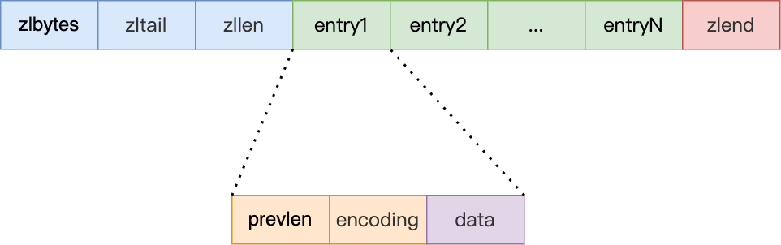

<center>img</center>

压缩列表节点包含三部分内容：

- ***prevlen\***，记录了「前一个节点」的长度，目的是为了实现从后向前遍历；
- ***encoding\***，记录了当前节点实际数据的「类型和长度」，类型主要有两种：字符串和整数。
- ***data\***，记录了当前节点的实际数据，类型和长度都由 encoding 决定；

当我们往压缩列表中插入数据时，压缩列表就会根据数据类型是字符串还是整数，以及数据的大小，会使用不同空间大小的 prevlen 和 encoding 这两个元素里保存的信息，**这种根据数据大小和类型进行不同的空间大小分配的设计思想，正是 Redis 为了节省内存而采用的**。

# 压缩列表和跳表的区别？

- 存储方式区别：压缩列表是一种紧凑的线性连续存储结构，通过将多个元素依次存储在一块连续的内存中，节省了内存空间。而跳跃表则是一种基于链表的数据结构，通过多层次的索引结构（跳跃层）来加速查找。
- 时间复杂度区别：在读取或修改操作方面，压缩列表的时间复杂度为O(n)，其中n是元素数量。因为压缩列表需要线性扫描来定位元素。而跳跃表的读取或修改操作的时间复杂度为O(log n)，通过跳跃层和链表的结构，可以快速定位到目标元素。
- 内存占用区别：压缩列表具有较小的内存占用，对于较小的有序集合，可以更节省内存空间。而跳跃表则需要更多的内存空间来存储索引结构，因此在空间占用方面相对较大。

# redis主从复制的过程？

第一次同步的过程如下：

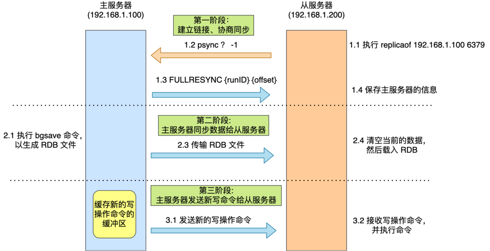

<center>图片</center>

- 第一阶段是建立链接、协商同步；
- 第二阶段是主服务器同步数据给从服务器；
- 第三阶段是主服务器发送新写操作命令给从服务器

主从服务器在完成第一次同步后，就会基于长连接进行命令传播。

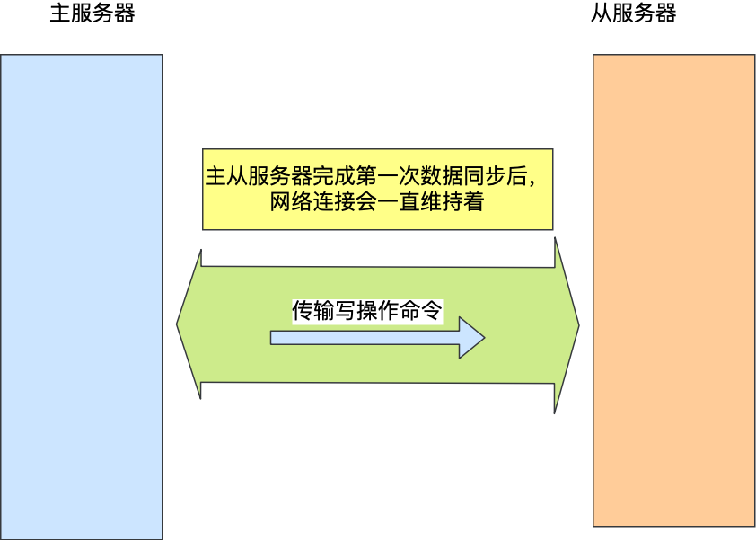

<center>图片</center>

后续主服务器可以通过这个连接继续将写操作命令传播给从服务器，然后从服务器执行该命令，使得与主服务器的数据库状态相同。

# 通过什么复制？

全量复制阶段是复制 rdb 文件。

# 增量复制命令存在哪里？

存放在 repl_backlog_buffer  缓冲区，在主服务器进行命令传播时，不仅会将写命令发送给从服务器，还会将写命令写入到 repl_backlog_buffer 缓冲区里，因此 这个缓冲区里会保存着最近传播的写命令。

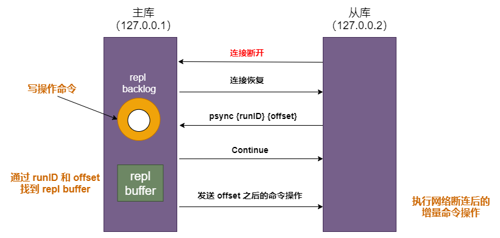

# RDB、AOF优缺点有哪些？

- RDB 是一个紧凑的二进制文件，相对较小，可以节省磁盘空间。。AOF文件是一个文本文件，记录了每个写操作，因此相对于RDB文件来说，AOF文件更大，因此RDB 在恢复大数据集时的速度比AOF 的恢复速度要快。
- Rob 的缺陷在于数据丢失的风险更大，如果Redis在最后一次快照之后发生故障，可能会丢失一部分数据。而 AOF以日志的方式记录每个写操作，数据的安全性会更高。

# Linux中ps命令展示那些信息？都有哪些选项？

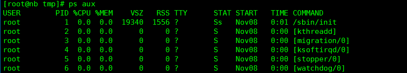

ps命令展示内容：

- PID：进程ID。
- PPID：父进程ID。
- USER：进程所属用户。
- %CPU：CPU占用率。
- %MEM：内存占用率。
- VSZ：虚拟内存大小。
- RSS：物理内存大小。
- TTY：终端设备。
- STAT：进程状态。
- START：进程启动时间。
- TIME：进程累计CPU占用时间。
- COMMAND：进程命令或可执行文件。

ps命令选项：

- -a：显示所有进程，包括其他用户的进程。
- -u：显示用户相关的进程信息。
- -x：显示没有控制终端的进程。
- -e：显示所有进程，等同于-a选项。
- -f：显示详细的进程信息，包括进程的父进程、运行状态等。
- -l：显示长格式的进程信息，包括进程的PID、PPID、CPU占用率等。
- -r：显示正在运行的进程。
- -o：自定义输出格式。

# tcp命令展示哪些信息？每一项都展示什么样的数据？

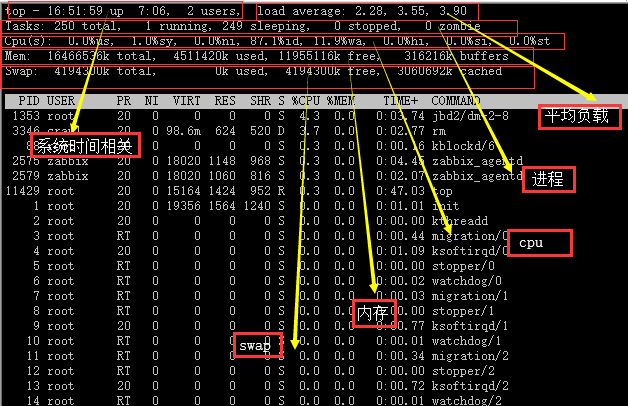

主要会展示：

- Load average（平均负载）：显示系统在最近1分钟、5分钟和15分钟内的平均负载情况。
- Tasks（任务）：显示当前运行、睡眠、停止和僵尸状态的进程数量。
- CPU usage（CPU使用情况）：显示CPU的总体使用率以及每个CPU核心的使用率。
- Memory usage（内存使用情况）：显示物理内存的总量、已使用量、空闲量、缓冲区和缓存区的使用量。
- Swap usage（交换空间使用情况）：显示交换空间的总量、已使用量和剩余量。
- 进程列表：显示当前运行的进程列表，包括进程的PID、用户、CPU占用率、内存占用率、进程状态、启动时间和进程命令。

# 手撕算法：寻找第K大元素

LeetCode链接：https://leetcode.cn/problems/kth-largest-element-in-an-array

```java
class Solution {
    public int findKthLargest(int[] nums, int k) {
        PriorityQueue<Integer> pq = new PriorityQueue<>();
        for (int e : nums) {
            pq.offer(e);
            if (pq.size() > k) {
                pq.poll();
            }
        }
        return pq.peek();
    }
}
```