## 2. 说说计算机存储结构

计算机存储结构通常包括这几个层次：

- **主存储器（Main Memory）**：也称为内存（RAM，Random Access Memory），主要用于存储当前正在执行的程序和数据。它是计算机中最快速但容量有限的存储设备。数据可以随机读取和写入，但在断电后数据会丢失。
- **辅助存储器（Secondary Storage）**：辅助存储器用于持久性存储数据和程序，如硬盘驱动器（HDD）和固态驱动器（SSD）。与主存储器相比，它们容量更大，但速度较慢。数据在断电后仍然保持。
- **缓存存储器（Cache Memory）**：缓存存储器是位于主存储器和中央处理器（CPU）之间的高速缓存，用于提高数据访问速度。它存储最常用的数据和指令，以减少对主存储器的访问次数。
- **寄存器（Registers）**：寄存器是位于CPU内部的最快速的存储设备。它们用于存储CPU当前执行的指令和操作数，以及中间计算结果。寄存器的数量有限，通常以位数来衡量（如32位或64位寄存器）。
- **光盘和磁盘**：光盘（如CD和DVD）和磁盘（如软盘）是可移动的辅助存储设备，用于存储大量数据，如音频、视频和文件。它们的访问速度比主存储器和缓存慢，但容量较大。
- **网络存储**：网络存储包括各种云存储和网络附加存储设备，允许用户通过互联网访问和存储数据。这种存储方式越来越常见，允许数据在多个设备之间共享和同步。
- **外部设备**：外部设备如USB闪存驱动器、外部硬盘和网络附加存储设备可以连接到计算机，用于数据备份、传输和存储。

## 3. 内存和硬盘读写数据速度区别

- **内存是计算机系统中最快速的存储设备之一**。数据可以在**纳秒（ns）级别**内进行读写操作，速度非常快。
- 硬盘驱动器（HDD）的读写速度远远慢于内存。它们通常以**毫秒（ms）级别**来度量访问时间，比内存慢几个数量级。

## 4. 操作系统怎样管理内存

- **内存分配和回收**：操作系统负责管理系统中可用的物理内存。当一个程序需要内存时，操作系统会分配一块适当大小的内存空间给该程序，并记录已分配内存的相关信息。当程序不再需要内存时，操作系统会将这些内存释放出来，以便其他程序使用。这个过程通常包括内存分配表、内存回收算法等。
- **内存保护**：操作系统确保不同程序的内存空间相互隔离，以防止一个程序意外地访问或修改其他程序的内存数据。这通常通过硬件机制（如CPU的特权级别和内存保护位）和操作系统的权限管理来实现。
- **虚拟内存**：虚拟内存是一种操作系统提供的抽象层，它将物理内存和磁盘上的存储结合在一起，使得系统似乎具有比物理内存更大的地址空间。操作系统根据需要将数据从磁盘交换到物理内存中，以便程序能够访问。这有助于提高系统的性能和多任务处理能力。
- **内存分页和分段**：操作系统通常将物理内存划分为页面或段，以便更有效地管理内存。分页系统将内存划分为固定大小的页面，而分段系统将内存划分为不同大小的段。这些机制有助于操作系统有效地管理内存的分配和回收。
- **内存交换**：当物理内存不足时，操作系统可以将不活动的程序或数据移动到磁盘上，以释放出更多的物理内存供其他程序使用。这个过程称为内存交换，它可以帮助系统继续运行，尽管物理内存有限。
- **内存管理单元（MMU）**：硬件中的MMU是一个关键组件，它协助操作系统实现虚拟内存和内存保护。MMU将逻辑地址（由程序生成）映射到物理地址（在物理内存中）。这有助于隔离不同程序的内存空间，同时使虚拟内存和物理内存之间的映射更加高效。

## 5. cpu 的组成

CPU的组成主要包括这几部分：控制单元、算术逻辑单元、寄存器、缓存、时钟

- **控制单元**: 控制单元（Control Unit）：控制单元是CPU的核心部分之一，负责协调和控制CPU的各个部件的操作。它从内存中读取指令，解码这些指令，然后执行它们。控制单元还负责处理异常情况和中断。
- **算术逻辑单元**（Arithmetic Logic Unit，ALU）：ALU执行各种算术和逻辑运算，包括加法、减法、乘法、除法、逻辑与、逻辑或等。它接收来自内存和寄存器的数据，并根据控制单元发出的指令执行相应的操作。
- **寄存器**（Registers）：寄存器是CPU内部的高速存储器单元，用于存储临时数据和指令操作数。寄存器非常快速，可以直接与ALU交互，因此在CPU的运算过程中起到关键作用。其中包括：**程序计数器、指令寄存器、通用寄存器**
- **缓存**（Cache）：缓存是一种高速存储器，用于存储频繁访问的数据和指令，以提高访问速度。现代CPU通常包括多级缓存，其中L1缓存最接近CPU核心，L2缓存较大但速度较慢，L3缓存更大但速度更慢。缓存有助于减少CPU与主内存之间的数据传输延迟。
- **时钟**：时钟是CPU的关键部分，它以固定的速度发出脉冲信号，用于同步CPU内部操作。时钟速度通常以赫兹（Hz）为单位表示，例如1GHz表示每秒发出10^9次脉冲信号。

## 6. 死锁产生条件

死锁是指多个进程或线程在竞争有限资源时可能遇到的一种互相等待的情况，导致它们都无法继续执行下去。死锁产生的充分条件通常包括以下四个条件，它们必须同时满足才能引发死锁：

- **互斥条件（Mutual Exclusion）**：至少有一个资源必须是独占性的，即一次只能被一个进程或线程占用。这意味着当一个进程占用了该资源时，其他进程无法同时占用，必须等待释放。
- **占有和等待条件（Hold and Wait）**：进程必须持有至少一个资源，并且等待获取其他资源。这表示进程在等待其他资源时不会释放已经占有的资源，导致其他进程无法使用这些资源。
- **不可抢占条件（No Preemption）**：资源不能被强制从一个进程手中抢占，只能由持有资源的进程自愿释放。这意味着其他进程不能强制占用已被其他进程占有的资源。
- **循环等待条件（Circular Wait）**：存在一个进程等待链，每个进程都在等待下一个进程所占有的资源。这导致一个循环，使得每个进程都无法继续执行。

## 7. 什么情况下栈溢出

在Java中，栈溢出通常是指**方法调用栈（Method Call Stack）溢出，也就是由于方法调用的递归深度太大而导致栈空间不足**。

> Java虚拟机（JVM）为每个线程维护一个方法调用栈，用于存储方法调用和局部变量。当一个方法被调用时，其调用信息和局部变量被推入栈中，方法执行完毕后，这些信息又被弹出。如果方法调用的递归深度太大，栈空间可能会被用尽，导致栈溢出异常。

**栈溢出**通常发生在以下情况下：

- **递归深度过大**：递归函数调用自身或其他函数时，每次调用都会在栈上分配一段内存，如果递归深度很大，栈空间可能会耗尽。

```
/**
 * 更多干货，关注公众号：捡田螺的小男孩
 **/
public class StackOverflowExample {
    public static void recursiveFunction(int count) {
        if (count <= 0) {
            return;
        }
        recursiveFunction(count - 1);
    }

    public static void main(String[] args) {
        recursiveFunction(100000); // 调用递归函数100000次
    }
}
```

> 在这个示例中，recursiveFunction 方法递归地调用自身，并且没有终止条件或者终止条件不合适（count <= 0）。这将导致递归深度非常大，超过了栈的容量，最终导致栈溢出异常。

- **方法调用链过长**：如果在方法中嵌套调用其他方法，每个方法调用都会占用一些栈空间。如果方法调用链很长，栈可能会耗尽。

```
/**
 * 更多干货，关注公众号：捡田螺的小男孩
 **/
public class MethodCallChainExample {
    public static void methodA(int depth) {
        if (depth > 0) {
            methodB(depth - 1);
        }
    }

    public static void methodB(int depth) {
        if (depth > 0) {
            methodA(depth - 1);
        }
    }

    public static void main(String[] args) {
        methodA(10000); // 方法调用链长度为10000
    }
}
```

> 在这个示例中，methodA 和 methodB 交替调用，创建了一个很长的方法调用链。每个方法调用都需要在栈上分配一些内存，因此当方法调用链变得非常长时，栈的容量会耗尽，最终导致栈溢出异常。

- **无限循环递归**：一个无限循环中，如果递归调用导致栈不断增长，最终可能导致栈溢出。

为了**防止Java中的栈溢出**，您可以采取以下措施：

- **限制递归深度**：确保递归函数的递归深度有限，或使用迭代替代递归。
- **优化递归算法**：在递归算法中，可以尝试减少方法调用的次数，从而减少栈的使用。
- **增大栈大小**：在某些情况下，可以通过设置`JVM`参数来增加栈的大小，但这不是一种推荐的解决方案，因为栈大小的增加可能导致其他问题。

## 8. Arraylist与LinkedList区别

可以从它们的底层数据结构、效率、开销进行阐述哈

- `ArrayList`是数组的数据结构，`LinkedList`是链表的数据结构。
- 随机访问的时候，`ArrayList`的效率比较高，因为`LinkedList`要移动指针，而`ArrayList`是基于索引(`index`)的数据结构，可以直接映射到。
- 插入、删除数据时，`LinkedList`的效率比较高，因为`ArrayList`要移动数据。
- `LinkedList比ArrayList`开销更大，因为`LinkedList`的节点除了存储数据，还需要存储引用。

## 9. 红黑树的特点和使用场景

红黑树（Red-Black Tree）是一种自平衡的二叉搜索树，它具有以下特点：

- **自平衡性**：红黑树是一种自平衡的二叉搜索树，它通过一系列的插入和删除操作来维持树的平衡。这确保了树的高度保持在对数范围内，使得基本操作（如查找、插入和删除）的时间复杂度保持在O(log n)。
- **节点颜色**：每个节点都被标记为红色或黑色。这些颜色标记有助于维护树的平衡。
- 每个节点要么是红色，要么是黑色。
- 根节点必须是黑色。
- 所有叶子节点（NIL节点）都是黑色。
- 如果一个节点是红色，那么它的两个子节点都必须是黑色（没有两个相连的红色节点）。
- 从任何节点到其每个叶子的简单路径上，黑色节点的数目必须相等。
- 插入和删除操作的平衡调整：当插入或删除节点时，红黑树会执行一系列平衡调整操作，以确保树的性质不会被破坏。这些调整通常包括颜色变换和旋转操作。这些操作确保了树保持平衡，不会出现偏斜。
- 快速查找和插入：红黑树具有较快的查找和插入操作。由于树的平衡性质，平均和最坏情况下的时间复杂度都是O(log n)。

**使用场景**

- Java的`TreeMap和TreeSet`：也使用红黑树来实现有序的键值对存储和查找。
- **文件系统**：某些文件系统使用红黑树来管理文件和目录的索引。这有助于快速查找和访问文件。
- 操作系统进程调度：一些操作系统的进程调度器使用红黑树来管理进程的调度顺序。红黑树确保了公平性和高效性。
- 内存分配器：一些内存分配器使用红黑树来管理内存块的分配和释放，以提高内存分配的性能。

## 10. HashMap 和 Concurrentmap 区别

**HashMap**

- 底层由**链表+数组+红黑树**实现
- 可以存储null键和null值
- 线性不安全
- 初始容量为16，扩容每次都是2的n次幂
- 加载因子为0.75，当Map中元素总数超过Entry数组的0.75，触发扩容操作.
- 并发情况下，HashMap进行put操作会引起死循环，导致CPU利用率接近100%
- HashMap是对Map接口的实现

**ConcurrentHashMap**

- HashMap 和 ConcurrentMap 的底层实现都使用了数组和链表，以及在需要时使用红黑树来提高性能。
- 不能存储null键和值
- ConcurrentHashMap是线程安全的
- JDK 8之前，ConcurrentHashMap使用**锁分段技术**确保线性安全

JDK8为何又放弃分段锁，是因为多个分段锁浪费内存空间，竞争同一个锁的概率非常小，分段锁反而会造成效率低。

> JDK 8 引入了一种新的 ConcurrentHashMap 实现，称为 "CAS + Synchronized"，而不再使用分段锁。这是因为分段锁虽然在某些情况下可以提供良好的并发性能，但它们确实存在一些缺点，包括内存开销和可能的竞争条件。

下面是一些原因，解释了**为什么 JDK 8 放弃了分段锁**：

- 内存开销：每个分段都需要维护一个独立的锁，这会导致内存开销增加，特别是当你有大量的分段时。这可能会在某些情况下占用大量内存，不利于性能和资源使用。
- 竞争条件：虽然分段锁减少了竞争的可能性，但当多个线程试图修改同一分段内的数据时，仍然可能发生竞争条件。这种情况下，需要线程等待并争夺分段级别的锁，可能导致性能下降。

## 11. 怎样判断链表是否有环

可以用**快慢指针**来实现

```
/**
 * 更多干货，关注公众号：捡田螺的小男孩
 **/
public class ListNode {
    int val;
    ListNode next;
    
    ListNode(int val) {
        this.val = val;
        this.next = null;
    }
}

public boolean hasCycle(ListNode head) {
    if (head == null || head.next == null) {
        // 如果链表为空或只有一个节点，肯定没有环
        return false;
    }
    
    ListNode slow = head;
    ListNode fast = head;
    
    while (fast != null && fast.next != null) {
        slow = slow.next;      // 慢指针移动一步
        fast = fast.next.next; // 快指针移动两步
        
        // 如果快指针追上了慢指针，说明链表中有环
        if (slow == fast) {
            return true;
        }
    }
    
    // 如果快指针到达链表末尾，说明没有环
    return false;
}
```

## 12. 服务器接收 http 请求怎样区别哪个进程

- **端口号**：每个进程可以监听不同的端口号。当客户端发送HTTP请求时，请求中包含目标端口号。服务器通过请求的目标端口号来确定将请求路由到哪个进程。不同的进程通常监听不同的端口。例如，常见的HTTP服务器（如Apache和Nginx）通常监听默认的HTTP端口80或HTTPS端口443，不同进程监听不同的端口。
- **域名**：对于同一IP地址上的多个虚拟主机，服务器可以通过HTTP请求的Host头部来区分它们。根据请求中的域名信息，服务器将请求路由到不同的进程或应用程序。
- URL路径：服务器可以根据HTTP请求的URL路径来区分不同的应用程序或处理程序。不同的路径可以映射到不同的进程或应用程序。例如，一个服务器可以将/app1的请求路由到一个进程，将/app2的请求路由到另一个进程，以此类推。
- **反向代理**：有时，一个前端服务器（通常是反向代理服务器，如Nginx或Apache HTTP Server）会接收所有HTTP请求，然后将请求路由到后端服务器或进程。反向代理服务器可以根据请求的不同特征（如域名、路径、端口等）来决定将请求转发给哪个后端进程。
- **会话标识符**：对于基于会话的应用程序，服务器通常使用会话标识符来区分不同的用户会话。会话标识符可以存储在Cookie中或通过URL参数传递，服务器使用它来将请求路由到正确的用户会话。
- **自定义头部**：有些服务器和应用程序可能使用自定义的HTTP头部来区分请求的目标进程。这需要服务器和应用程序之间的协商和定制。
- **负载均衡器**：在大型应用程序和高流量环境中，通常使用负载均衡器来分发HTTP请求到多个后端进程或服务器实例。负载均衡器可以根据不同的算法和规则来决定请求的路由。

## 13.服务并发量高时，流量怎样负载均衡

一些常见的负载均衡策略和方法

- **轮询（Round Robin）**：这是一种最简单的负载均衡策略，其中负载均衡器将每个新的请求按照轮询的方式分发给后端服务器。每个服务器依次接收请求，然后再次从头开始。这样可以确保请求均匀分布到所有服务器上。
- **加权轮询（Weighted Round Robin）**：在加权轮询中，每个后端服务器都分配一个权重，权重高的服务器会获得更多的请求。这种方式允许根据服务器的性能和资源配置来分发负载。
- **最少连接（Least Connections）**：负载均衡器将请求发送到当前具有最少连接数的服务器。这可以确保连接较少的服务器不会被过载，从而提高性能。
- **IP散列（IP Hashing）**：根据客户端的IP地址计算散列值，并将请求发送到对应散列值的服务器。这种方法可以确保相同IP地址的客户端始终访问同一台服务器，适用于需要维护会话一致性的应用。
- **最短响应时间（Least Response Time）**：负载均衡器会根据服务器的响应时间来选择下一个服务器。这有助于将请求发送到响应时间最短的服务器，提高用户体验。
- **随机（Random）**：负载均衡器随机选择一个后端服务器来处理请求。虽然这种方法不会平衡负载，但在某些情况下可能有用。
- **内容感知负载均衡**：根据请求的内容类型，将请求路由到不同类型的后端服务器。例如，可以将图像请求路由到图像服务器，将视频请求路由到视频服务器，以提高性能。

## 14. 说说TCP的流量控制

TCP三次握手，发送端和接收端进入到ESTABLISHED状态，它们即可以愉快地传输数据啦。

但是发送端不能疯狂地向接收端发送数据，因为接收端接收不过来的话，接收方只能把处理不过来的数据存在缓存区里。如果缓存区都满了，发送方还在疯狂发送数据的话，接收方只能把收到的数据包丢掉，这就浪费了网络资源啦。

> TCP 提供一种机制可以让发送端根据接收端的实际接收能力控制发送的数据量，这就是**流量控制**。

TCP通过滑动窗口来控制流量，我们看下流量控制的简要流程吧：

首先双方三次握手，初始化各自的窗口大小，均为 400 个字节。

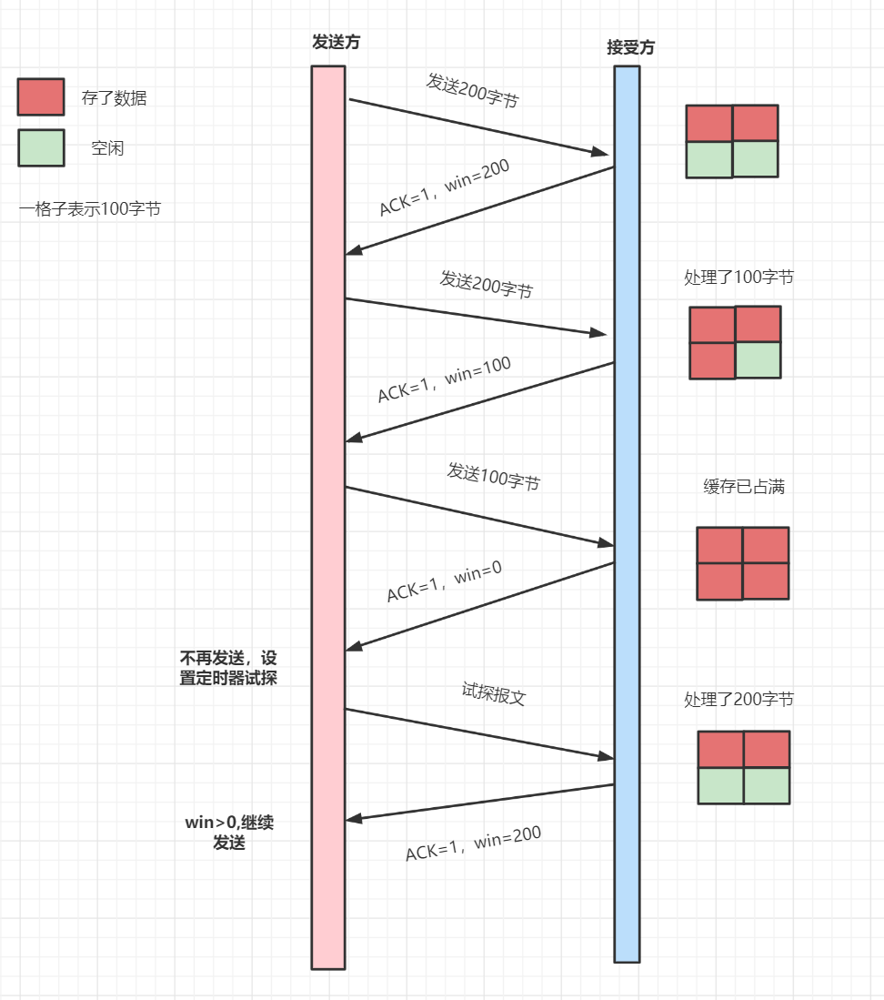

1. 假如当前发送方给接收方发送了200个字节，那么，发送方的SND.NXT会右移200个字节，也就是说当前的可用窗口减少了200 个字节。
2. 接受方收到后，放到缓冲队列里面，REV.WND =400-200=200字节，所以win=200字节返回给发送方。接收方会在 ACK 的报文首部带上缩小后的滑动窗口200字节
3. 发送方又发送200字节过来，200字节到达，继续放到缓冲队列。不过这时候，由于大量负载的原因，接受方处理不了这么多字节，只能处理100字节，剩余的100字节继续放到缓冲队列。这时候，REV.WND = 400-200-100=100字节，即win=100返回发送方。
4. 发送方继续干活，发送100字节过来，这时候，接受窗口win变为0。
5. 发送方停止发送，开启一个定时任务，每隔一段时间，就去询问接受方，直到win大于0，才继续开始发送。

## 15.TCP的拥塞控制

拥塞控制是作用于网络的，防止过多的数据包注入到网络中，避免出现网络负载过大的情况。它的目标主要是最大化利用网络上瓶颈链路的带宽。它跟流量控制又有什么区别呢？流量控制是作用于接收者的，根据接收端的实际接收能力控制发送速度，防止分组丢失的。

我们可以把网络链路比喻成一根水管，如果我们想最大化利用网络来传输数据，那就是尽快让水管达到最佳充满状态。

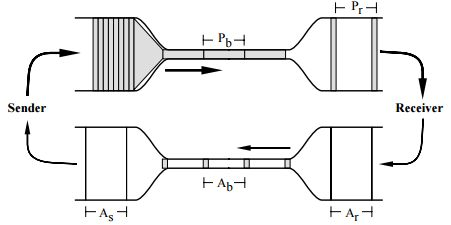

发送方维护一个**拥塞窗口cwnd（congestion window）** 的变量，用来估算在一段时间内这条链路（水管）可以承载和运输的数据（水）的数量。它大小代表着网络的拥塞程度，并且是动态变化的，但是为了达到最大的传输效率，我们该如何知道这条水管的运送效率是多少呢？

一个比较简单的方法就是不断增加传输的水量，直到水管快要爆裂为止（对应到网络上就是发生丢包），用 TCP 的描述就是：

> 只要网络中没有出现拥塞，拥塞窗口的值就可以再增大一些，以便把更多的数据包发送出去，但只要网络出现拥塞，拥塞窗口的值就应该减小一些，以减少注入到网络中的数据包数。

实际上，拥塞控制主要有这几种常用算法

- 慢启动
- 拥塞避免
- 拥塞发生
- 快速恢复

### 15.1 慢启动算法

慢启动算法，表面意思就是，别急慢慢来。它表示TCP建立连接完成后，一开始不要发送大量的数据，而是先探测一下网络的拥塞程度。由小到大逐渐增加拥塞窗口的大小，如果没有出现丢包，每收到一个ACK，就将拥塞窗口cwnd大小就加1（单位是MSS）。每轮次发送窗口增加一倍，呈指数增长，如果出现丢包，拥塞窗口就减半，进入拥塞避免阶段。

- TCP连接完成，初始化cwnd = 1，表明可以传一个MSS单位大小的数据。
- 每当收到一个ACK，cwnd就加一;
- 每当过了一个RTT，cwnd就增加一倍; 呈指数让升

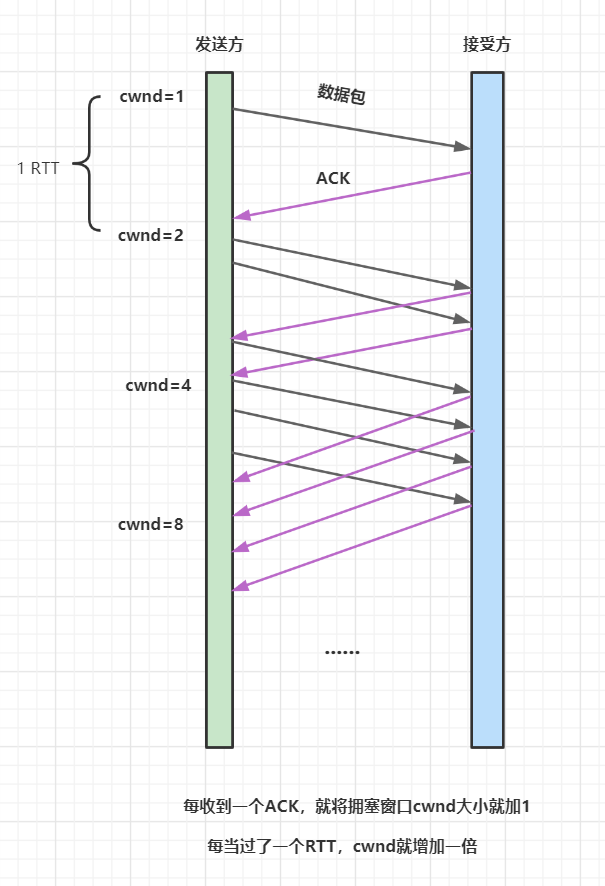

> 为了防止cwnd增长过大引起网络拥塞，还需设置一个慢启动阀值ssthresh（slow start threshold）状态变量。当cwnd到达该阀值后，就好像水管被关小了水龙头一样，减少拥塞状态。即当cwnd >ssthresh时，进入了拥塞避免算法。

### 15.2 拥塞避免算法

一般来说，慢启动阀值ssthresh是65535字节，cwnd到达慢启动阀值后

- 每收到一个ACK时，cwnd = cwnd + 1/cwnd
- 当每过一个RTT时，cwnd = cwnd + 1

显然这是一个线性上升的算法，避免过快导致网络拥塞问题。

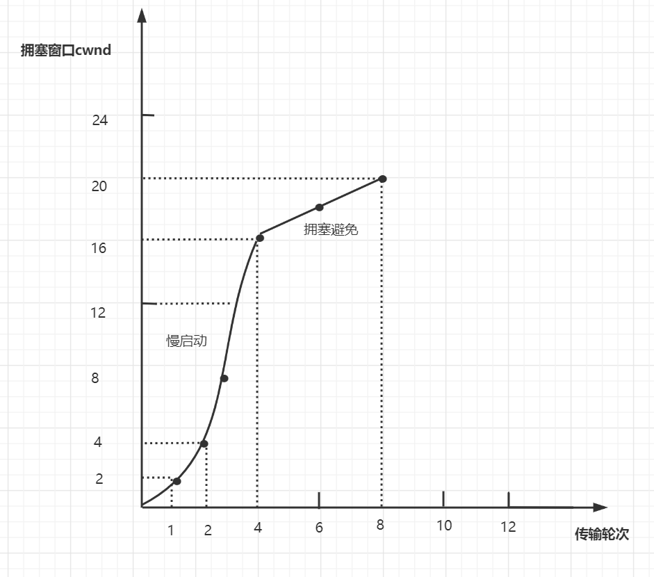

### 15.3 拥塞发生

当网络拥塞发生丢包时，会有两种情况：

- RTO超时重传
- 快速重传

如果是发生了RTO超时重传，就会使用拥塞发生算法

- 慢启动阀值sshthresh =  cwnd /2
- cwnd 重置为 1
- 进入新的慢启动过程

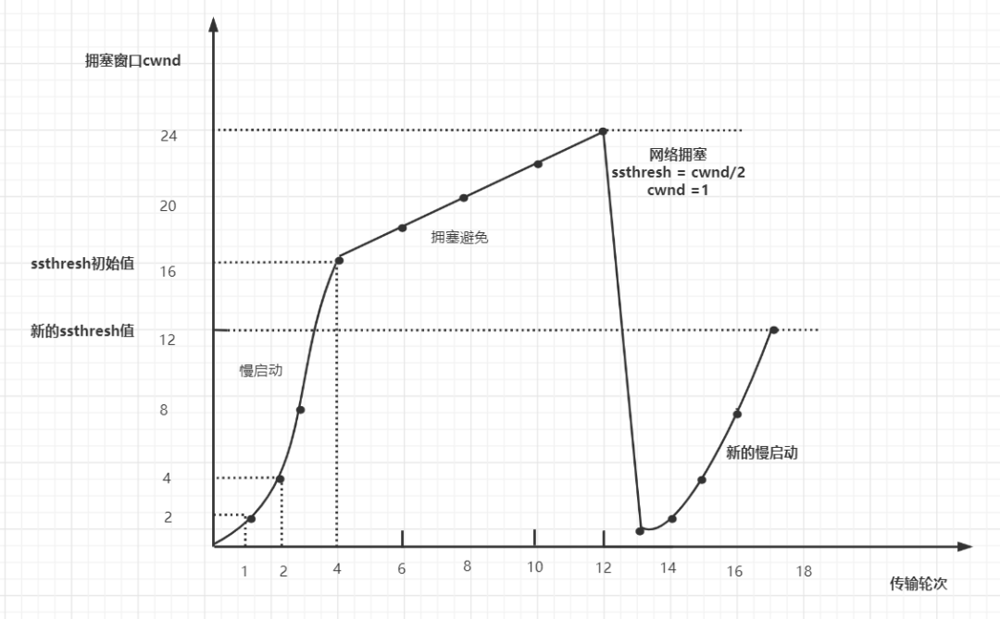

这真的是辛辛苦苦几十年，一朝回到解放前。其实还有更好的处理方式，就是快速重传。发送方收到3个连续重复的ACK时，就会快速地重传，不必等待RTO超时再重传。

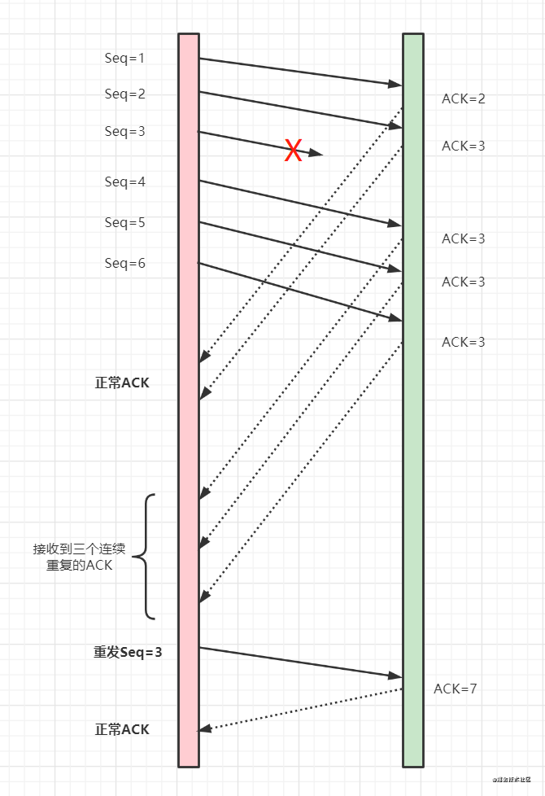

慢启动阀值ssthresh 和 cwnd 变化如下：

- 拥塞窗口大小 cwnd = cwnd/2
- 慢启动阀值 ssthresh = cwnd
- 进入快速恢复算法

### 15.4 快速恢复

快速重传和快速恢复算法一般同时使用。快速恢复算法认为，还有3个重复ACK收到，说明网络也没那么糟糕，所以没有必要像RTO超时那么强烈。

正如前面所说，进入快速恢复之前，cwnd 和 sshthresh已被更新：

```
- cwnd = cwnd /2
- sshthresh = cwn
```

然后，真正的快速算法如下：

- cwnd = sshthresh  + 3
- 重传重复的那几个ACK（即丢失的那几个数据包）
- 如果再收到重复的 ACK，那么 cwnd = cwnd +1
- 如果收到新数据的 ACK 后, cwnd = sshthresh。因为收到新数据的 ACK，表明恢复过程已经结束，可以再次进入了拥塞避免的算法了。

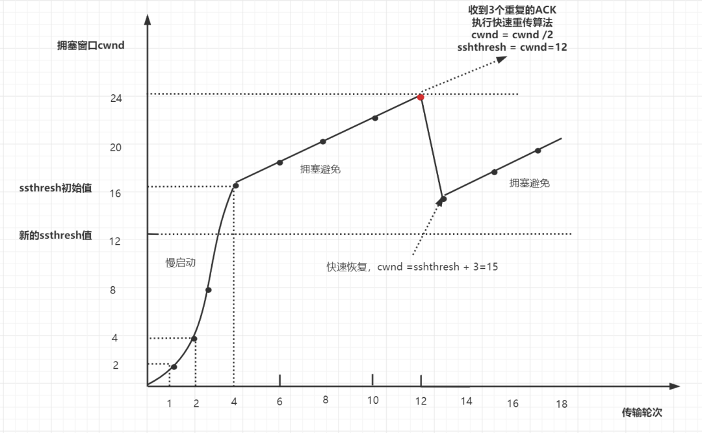

## 16.B+树 B-树的区别，为什么不用红黑树做索引

- 在B-树树中，键和值即存放在内部节点又存放在叶子节点；在 B+树中，内部节点只 存键，叶子节点则同时存放键和值。
- B+树的叶子节点有一条链相连，而 B 树的叶子节点各自独立的。
- B+树索引的所有数据均存储在叶子节点，而且数据是按照顺序排列的，链表 连着的。那么 B+树使得范围查找，排序查找，分组查找以及去重查找变得异 常简单。.
- B+树非叶子节点上是不存储数据的，仅存储键值，而 B-树节点中不仅存储键 值，也会存储数据。innodb 中页的默认大小是 16KB，如果不存储数据，那么 就会存储更多的键值，相应的树的阶数（节点的子节点树）就会更大，树就会 更矮更胖，如此一来我们查找数据进行磁盘的 IO 次数有会再次减少，数据查询 的效率也会更快.

**为什么不用红黑树做索引**

红黑树是一种自平衡的二叉搜索树，它在平衡性和查找效率上是非常好的。然而，红黑树在磁盘存储和数据库索引场景下可能不如B+树效率高效。这是由于以下几个原因：

- **磁盘IO效率**：B+树采用了一种层次化的索引结构，它的非叶子节点只包含索引信息，而数据存储在叶子节点上。这种结构使得每次磁盘IO能够获取更多的数据。而红黑树在每个节点都存储数据，这样会增加磁盘IO次数，降低IO效率。
- **顺序访问性能**：B+树的叶子节点形成有序链表，这使得范围查询变得更高效，可以很方便地进行范围遍历。而红黑树不具备这种特性。
- **内存占用**：红黑树在每个节点都需要存储数据，而B+树的非叶子节点只需要存储索引信息，这样在内存占用上，B+树相对更节省。

## 17. Redis的使用场景

redis主要有这16种使用场景

- 缓存
- 数据共享分布式
- 分布式锁
- 全局ID
- 计数器
- 限流
- 位统计
- 购物车
- 用户消息时间线timeline
- 消息队列
- 抽奖
- 点赞、签到、打卡
- 商品标签
- 商品筛选
- 用户关注、推荐模型
- 排行榜

详细的可以看这篇文章：[一口气说出 Redis 16 个常见使用场景](https://mp.weixin.qq.com/s?__biz=Mzg3NzU5NTIwNg==&mid=2247497788&idx=1&sn=d10aa00159da8e8dc300597fa85c2bf9&chksm=cf222715f855ae03df2ac378a28d5597776a995eee066e51f2515244f8921a4f8fd9ad43df7d&token=300427329&lang=zh_CN&scene=21#wechat_redirect)

## 18. redis 为什么快

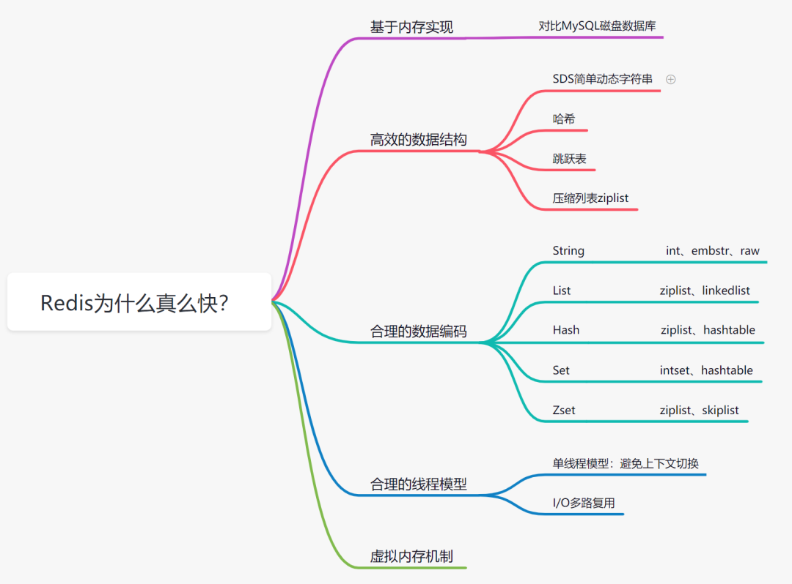

### 18.1 基于内存存储实现

我们都知道内存读写是比在磁盘快很多的，Redis基于内存存储实现的数据库，相对于数据存在磁盘的MySQL数据库，省去磁盘I/O的消耗。

### 18.2 高效的数据结构

我们知道，Mysql索引为了提高效率，选择了B+树的数据结构。其实合理的数据结构，就是可以让你的应用/程序更快。先看下Redis的数据结构&内部编码图：

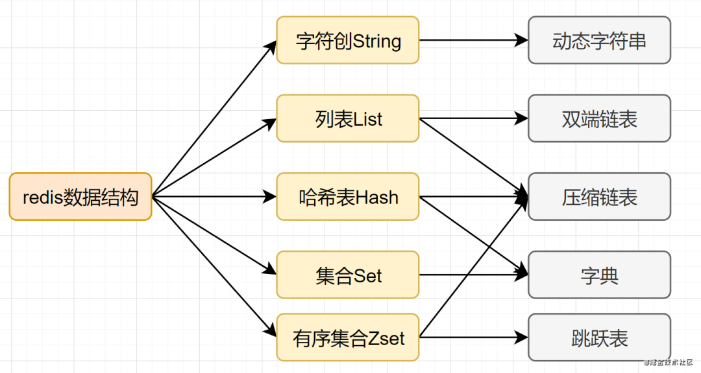

**SDS简单动态字符串**

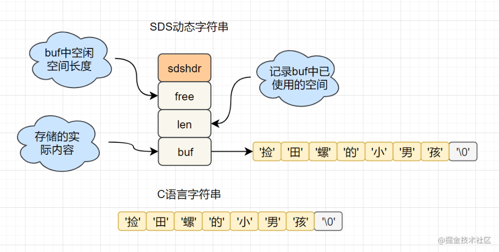

- 字符串长度处理：Redis获取字符串长度，时间复杂度为O(1)，而C语言中，需要从头开始遍历，复杂度为O（n）;
- 空间预分配：字符串修改越频繁的话，内存分配越频繁，就会消耗性能，而SDS修改和空间扩充，会额外分配未使用的空间，减少性能损耗。
- 惰性空间释放：SDS 缩短时，不是回收多余的内存空间，而是free记录下多余的空间，后续有变更，直接使用free中记录的空间，减少分配。
- 二进制安全：Redis可以存储一些二进制数据，在C语言中字符串遇到'\0'会结束，而 SDS中标志字符串结束的是len属性。

**跳跃表**

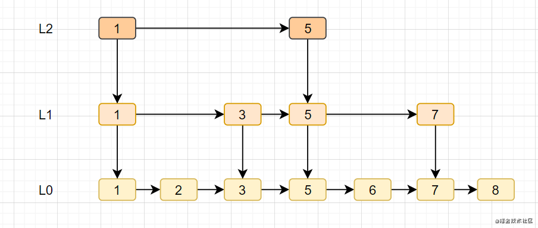

- 跳跃表是Redis特有的数据结构，就是在链表的基础上，增加多级索引提升查找效率。
- 跳跃表支持平均 O（logN）,最坏 O（N）复杂度的节点查找，还可以通过顺序性操作批量处理节点。

### 18.3 合理的数据编码

Redis 支持多种数据数据类型，每种基本类型，可能对多种数据结构。什么时候,使用什么样数据结构，使用什么样编码，是redis设计者总结优化的结果。

- String：如果存储数字的话，是用int类型的编码;如果存储非数字，小于等于39字节的字符串，是embstr；大于39个字节，则是raw编码。
- List：如果列表的元素个数小于512个，列表每个元素的值都小于64字节（默认），使用ziplist编码，否则使用linkedlist编码
- Hash：哈希类型元素个数小于512个，所有值小于64字节的话，使用ziplist编码,否则使用hashtable编码。
- Set：如果集合中的元素都是整数且元素个数小于512个，使用intset编码，否则使用hashtable编码。
- Zset：当有序集合的元素个数小于128个，每个元素的值小于64字节时，使用ziplist编码，否则使用skiplist（跳跃表）编码

### 18.4 合理的线程模型

I/O 多路复用

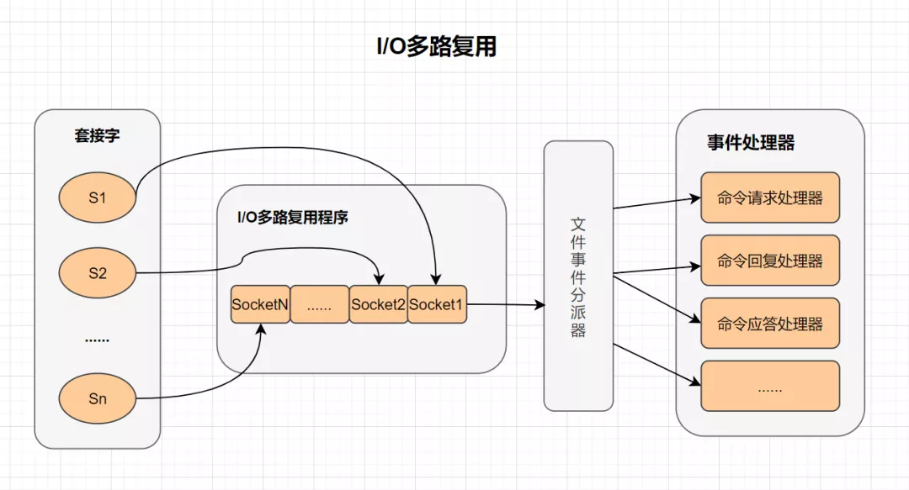

> 多路I/O复用技术可以让单个线程高效的处理多个连接请求，而Redis使用用epoll作为I/O多路复用技术的实现。并且，Redis自身的事件处理模型将epoll中的连接、读写、关闭都转换为事件，不在网络I/O上浪费过多的时间。

## 19.redis 分布式锁如何实现的？可能会有哪些坑

大家可以看看我之前这几篇文章哈：

- [Redis分布式锁的10个坑](https://mp.weixin.qq.com/s?__biz=Mzg3NzU5NTIwNg==&mid=2247503100&idx=1&sn=8612773ac3591f8ef7b5fa49b2394d91&chksm=cf2213d5f8559ac38cf154b73c43c500667a9f383d08c5ec7c1c725170aa2d20e4d15b50524b&token=300427329&lang=zh_CN&scene=21#wechat_redirect)
- [面试必备：聊聊分布式锁的多种实现！](https://mp.weixin.qq.com/s?__biz=Mzg3NzU5NTIwNg==&mid=2247498595&idx=1&sn=4e5308930e151a609baa2df820e48a89&chksm=cf22244af855ad5c71822cb33e828ce652c6f34202096a9344922b86dcbc08076d7922acde5f&token=300427329&lang=zh_CN&scene=21#wechat_redirect)
- [七种方案！探讨Redis分布式锁的正确使用姿势](https://mp.weixin.qq.com/s?__biz=Mzg3NzU5NTIwNg==&mid=2247488142&idx=1&sn=79a304efae7a814b6f71bbbc53810c0c&chksm=cf21cda7f85644b11ff80323defb90193bc1780b45c1c6081f00da85d665fd9eb32cc934b5cf&token=300427329&lang=zh_CN&scene=21#wechat_redirect)

## 20. 删除倒数第 n 个节点

```
/**
 * 更多干货，关注公众号：捡田螺的小男孩
 **/
public ListNode removeNthFromEnd(ListNode head, int n) {
    // 创建一个虚拟头节点，以便于处理删除头节点的情况
    ListNode dummy = new ListNode(0);
    dummy.next = head;
    
    ListNode first = dummy;
    ListNode second = dummy;
    
    // 将first指针向前移动n+1步
    for (int i = 0; i <= n; i++) {
        first = first.next;
    }
    
    // 同时移动first和second，直到first到达链表末尾
    while (first != null) {
        first = first.next;
        second = second.next;
    }
    
    // 删除倒数第n个节点
    second.next = second.next.next;
    
    return dummy.next; // 返回新的头节点
}
```