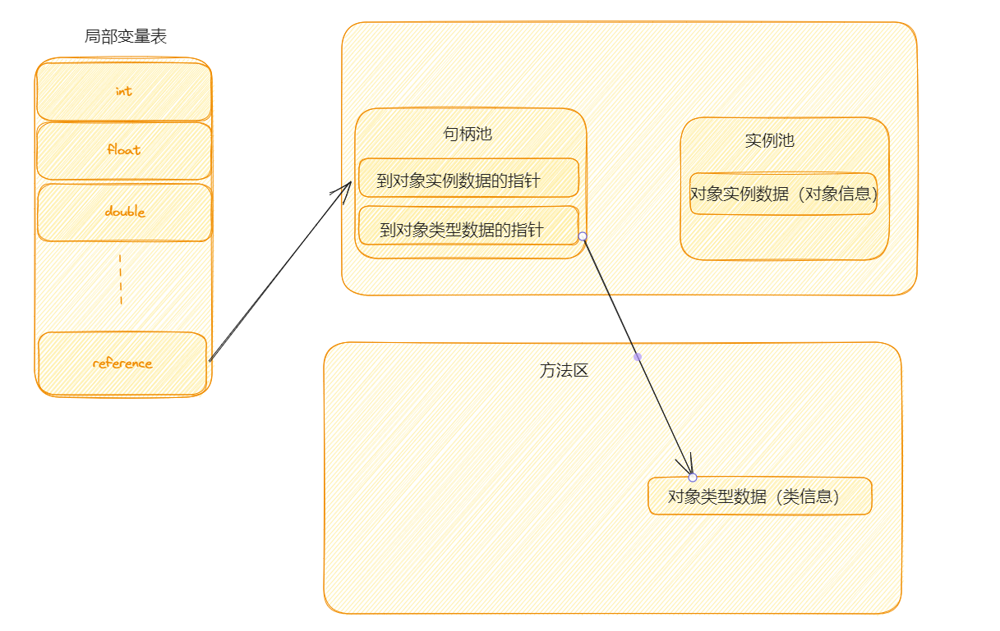
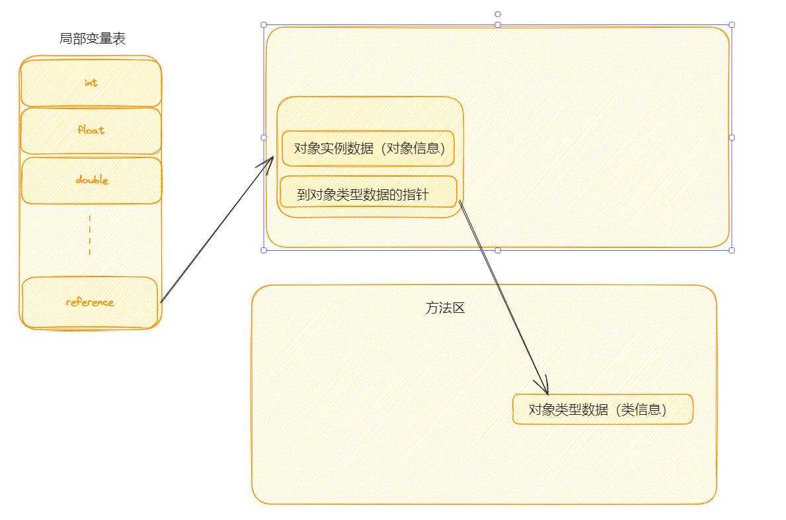

# HotSpot虚拟机对象探秘

## 对象的创建

对象的创建尤为重要！！！建议最好掌握

### Step1：类加载检查

虚拟机在解析`.class`文件的时候，如果遇到一条`new`指令，首先将去检查这个指令的参数是否能在常量池中定位到这个类的符号引用，并且检查这个符号引用代表的类是否已经被加载过、解析和初始化过。如果没有，那就必须先执行相应的类加载过程。

### Step2：分配内存

在**类加载检查**通过后，接下来虚拟机将会为新生对象**分配内存**。对象所需的内存大小在类加载完成后便可确定，为对象分配空间的任务等同于把一块确定大小的内存从Java堆中划分出来。**分配方式**有：**指针碰撞**和**空闲列表**两种，**选择那种分配方式由Java堆是否规整确定，而Java堆是否规整又由所采用的垃圾收集器是否带有压缩整理功能决定**。

**内存分配的两种方式**：

- **指针碰撞**
  - 适用场合：堆内存规整（即没有内存碎片）的情况下（说明采用的是**复制算法**或**标记整理法**）。
  - 原理：用过的内存全部整合到一边，没有用过的内存放在另一边，中间有一个分界指针，只需要向着没有用过的内存方向将该指针移动对象内存大小位置即可。
  - 使用该分配方式的GC收集器：Serial，ParNew。
- **空闲列表**
  - 适用场合：堆内存不规整的情况下（说明采用的是**标记清除算法**，有内存碎片）。
  - 原理：虚拟机会维护一个列表，该列表中会记录哪些内存块是可用的，在分配的时候，找一块儿足够大的内存块儿来划分给对象实例，最后更新列表记录。
  - 使用该分配方式的GC收集器：CMS

选择以上两种方式中的哪一种，取决于Java堆内存是否规整。而Java堆内存是否规整，取决于GC收集器的算法是**标记-清除**，还是**标记-整理**，值得注意的是，**复制算法**内存也是规整的。

**内存分配并发问题**：

在创建对象的时候有一个很重要的问题，就是线程安全，因为在实际开发过程中，创建对象是很频繁的事，作为虚拟机来说，必须要保证线程安全，通常来讲，虚拟机采用两种方式来保证线程安全：

- **CAS+失败重试**：CAS是乐观锁的一种实现方式。所谓乐观锁就是，每次不加锁而是假设没有冲突而去完成某项操作，如果因为冲突失败就重试，直到成功为止。**虚拟机采用CAS配上失败重试的方式保证更新操作的原子性**。
- **TLAB**：为每个线程预先在Eden区分配一块儿内存，JVM在给线程中对象分配内存时，首先在TLAB分配，当对象大于TLAB中的剩余内存或TLAB的剩余内存已经用尽时，再采用上述的CAS进行对象分配。

### Step3：初始化零值

内存分配完成后，虚拟机需要将分配到的内存空间都初始化为零值（不包括对象头），这一步操作保证了对象的实例字段在Java代码中可以不赋初始值就直接使用，程序能访问到这些字段的数据类型所对应的零值。

### Step4：设置对象头

初始化零值之后，**虚拟机要对对象进行必要的设置**，例如这个对象是哪个类的实例、如何才能找到类的元数据信息、对象的哈希码、对象的GC分代年龄等信息。**这些信息存放在对象头中**。另外，根据虚拟机当前运行状态的不同，如是否启用偏向锁等，对象头会有不同的设置方式。

### Step5：执行init方法

在上面工作都完成之后，从虚拟机的视角来看，一个新的对象已经产生了，但从Java程序的视角来看，对象创建才刚开始，`<init>`方法还没有执行，所有的字段都还为零。所以一般来说，执行new指令之后会接着执行 `<init>`方法，把对象按照程序员的意愿进行初始化，这样一个真正可用的对象才算完全产生出来。

## 对象的内存布局

在HotSpot虚拟机中，对象的内存布局分为以下3块区域：

- 对象头（Header）
- 实例数据（Instance Data）
- 对齐填充（Padding）

### 对象头

对象头包括两部分信息，**第一部分用于存储对象自身的运行时数据（哈希码，GC分代年龄，锁状态标志等）**，**另一部分是类型指针**，即对象指向它的类元数据的指针，虚拟机通过这个指针来确定这个对象是哪个类的实例。如果对象是一个数组，那么对象头还会包括数组长度。

### 实例数据

**这部分是对象真正存储的有效信息**，也是在程序中所定义的各种类型的字段内容。

### 对齐填充

**这部分不是必然存在的，也没有什么特别的含义，仅仅起占位作用。**

HotSpot虚拟机的自动内存管理系统要求对象起始地址必须是8字节的整数倍，换句话说就是对象的大小必须是8字节的整数倍。而对象头部分正好是8字节的倍数（1或2倍），因此，当对象实例数据部分没有对齐时，就需要通过对齐填充来补全。

## 对象的访问方式

建立对象就是为了使用对象，我们的Java程序通过栈上的reference数据来操作堆上的具体对象。对象的访问方式由虚拟机实现而定，目前主要是这两种方式：**句柄访问**，**直接指针访问**。

所有对象的存储空间都是在堆中分配的，但是这个对象的引用却是在堆栈中分配的。也就是说在简历一个对象时两个地方都分配内存，在堆中分配的内存实际建立这个对象，而在堆栈中分配的内存只是一个指向这个堆对象的指针（引用）而已。那么根据引用存放的地址类型的不同，对象有不同的访问方式。

### 句柄访问

堆中需要有一块叫做**句柄池**的区间，reference中存储的就是对象的句柄地址，而句柄中包含了对象实例数据与对象类型数据各自的具体地址信息。

### 直接指针访问

如果使用直接指针访问，reference中存储的直接就是对象的地址，通过引用能够直接访问对象，但是对象所在的内存空间需要额外的策略存储对象所属的类信息的地址。

HotSpot虚拟机主要使用的就是这种方式来进行对象访问。这两种对象访问方式各有优势。使用句柄来访问的最大好处是reference中存储的是稳定的句柄地址，在对象被移动时指挥改变句柄中的实例数据指针，而reference本身不需要修改。使用直接指针访问方式最大的好处就是速度快，它节省了一次指针定位的时间开销。