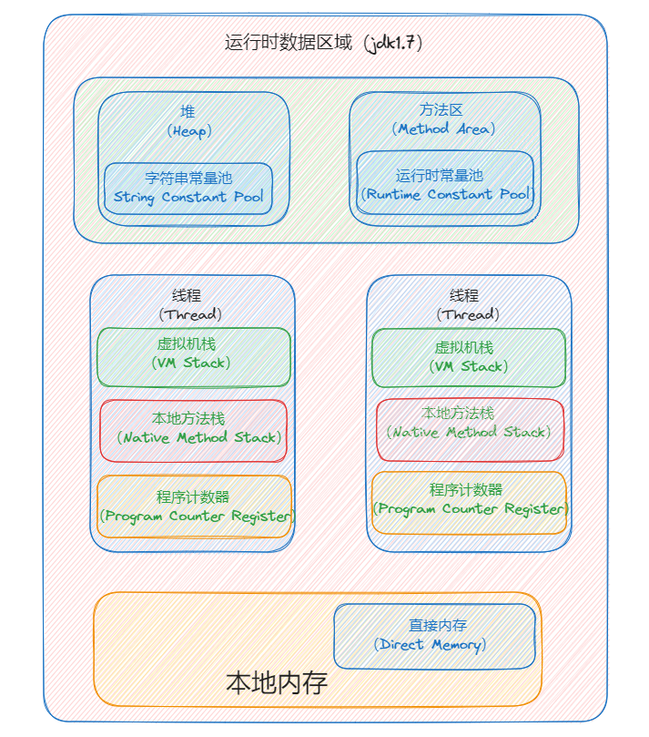
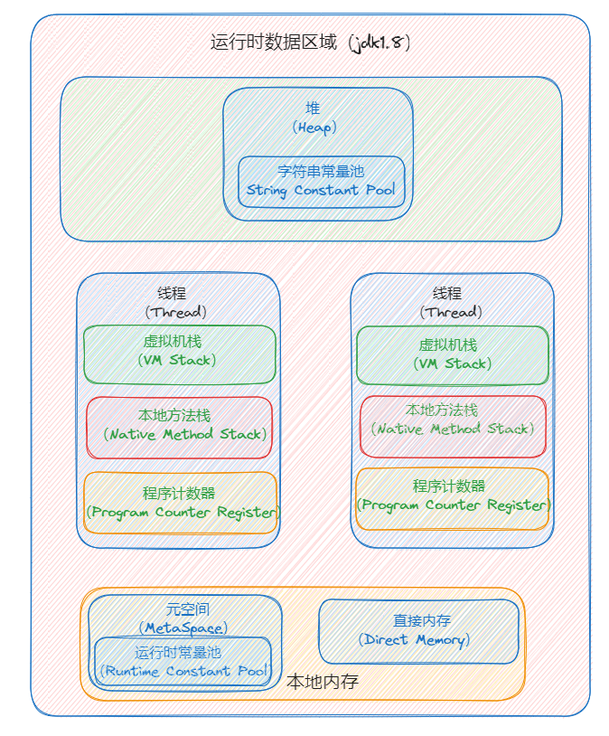
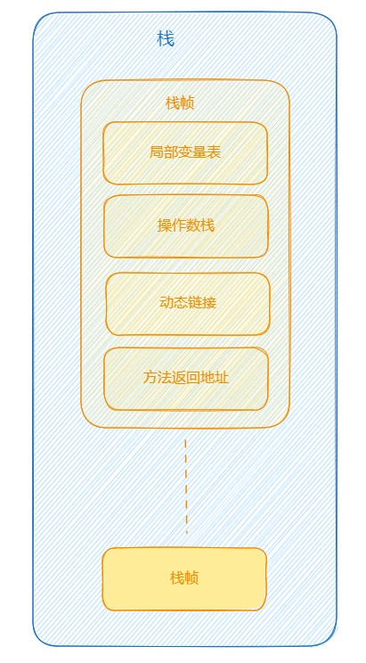
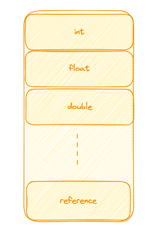
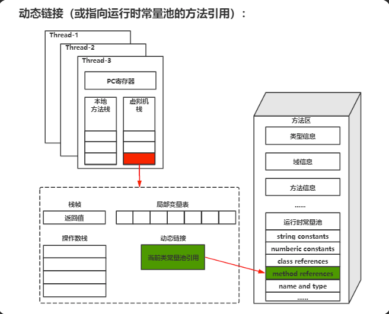
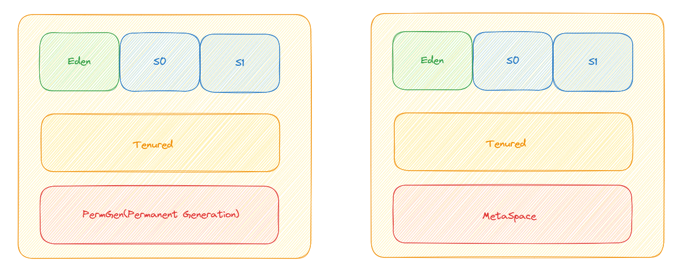
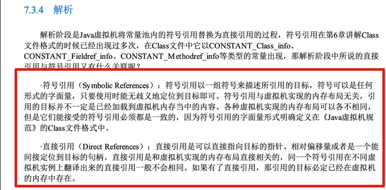
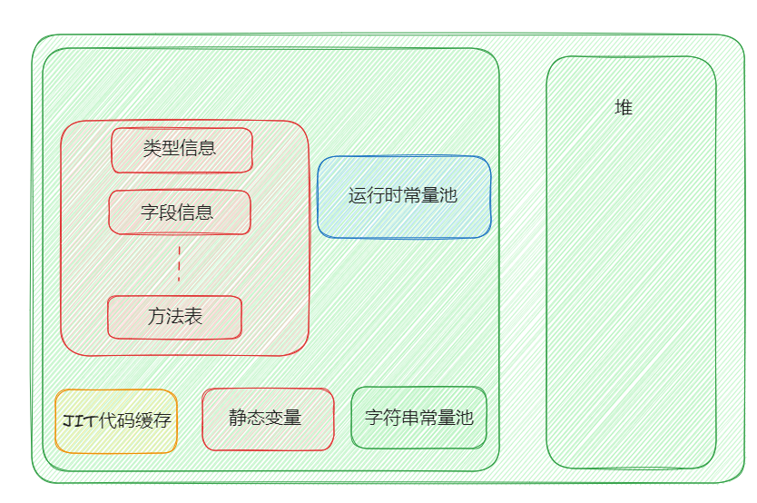
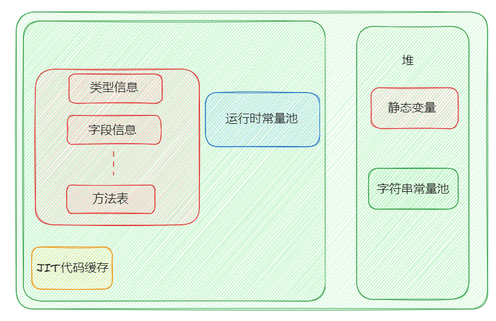

# JVM内存区域

Java虚拟机的内存空间分为**五个部分**。

- 程序计数器
- Java虚拟机栈
- 本地方法栈
- 堆
- 方法区

jdk1.8前后的虚拟机内存空间有点变化，下面两个图展示：

- JDK1.7



- JDK1.8



可以看到，主要的区别是**没有了方法区**，而是增加了元空间在本地内存。

**线程私有的：**

- 程序计数器
- 虚拟机栈
- 本地方法栈

线程共享的：

- 堆
- 方法区
- 直接内存

下面一一进行讲解

## 程序计数器

### 定义

程序计数器是一块比较小的内存空间，使当前线程正在执行的那条字节码指令的地址，可以看作当前线程所执行的字节码的行号指示器。若当前线程正在执行的是一个本地方法，那么此时程序计数器为`Undefined`。

### 作用

字节码解释器工作时通过改变这个计数器的值来选取下一跳需要执行的字节码指令，分支、循环、跳转、异常处理、线程恢复等功能都需要依赖这个计数器来完成；除此之外，为了线程能够恢复到正确的执行位置，每条线程都需要有一个独立的程序计数器，各线程之间计数器互不影响，独立存储，我们称这类内存区域为线程私有的内存。

综上，程序计数器的两个作用为：

- **字节码解释器通过改变计数器的值来一次读取指令，从而实现代码的流程控制等；**
- **多线程情况下，程序计数器记录的是当前线程执行的位置，从而当线程切换回来的时候，就知道上次线程执行到哪儿了。**

### 特点

- 内存较小的内存空间
- 线程私有
- 生命周期：随着线程创建而创建，结束而销毁
- 唯一一个不会出现 `OutOfMemory` 的内存区域

## Java虚拟机栈

### 定义

Java虚拟机栈是描述Java方法运行过程的内存模型。

Java虚拟机会为每一个即将运行的Java方法创建一块叫做**栈帧**的区域，用于存放该方法运行过程中的一些信息。

我们都知道方法调用的数据需要通过栈进行传递，每一次方法调用都会有一个对应的栈帧被压入栈中，每一个方法调用结束后，都会有一个栈帧被弹出。

栈是由一个个栈帧组成，而每个栈帧都拥有：局部变量表、操作数栈、动态链接、方法返回地址。



### 栈帧

**局部变量表**

主要存放编译器可知的各种数据类型（boolean、byte、short、char、int、long、float、double）、对象引用（reference类型，不同于对象本身，可能是一个指向对象起始地址的引用指针，也可能是指向一个代表对象的句柄或其他与此对象相关的位置）。



局部变量表定义为一个数字数组，用于存储方法参数、定义在方法体内部的局部变量。

局部变量表容量大小是在**编译期**确定的。最基本的存储单元是**slot**，32位类型占用一个slot，64位类型占用两个slot。

对于slot的理解：

- JVM虚拟机会为局部变量表中的每个slot都分配一个访问索引，通过这个索引即可成功访问到局部变量表中指定的局部变量值。
- 如果当前帧是由构造方法后者实例方法创建的，那么该对象引用this，会存放在index为0的slot处，其余的参数表顺序继续排列。
- 栈帧中的局部变量表中的槽位是可以重复的，如果一个局部变量表过了它的作用域，那么其作用域之后声明的新的局部变量就有可能会复用过期的局部变量的槽位，从而达到节省资源的目的。

在栈帧中，与**性能调优关系**最密切的部分就是**局部变量表**，方法执行时，虚拟机使用局部变量表完成方法的传递，局部变量表中的变量也是重要的垃圾回收根节点，只要被局部变量表中直接或间接引用的对象都不会被回收。

**操作数栈**

主要作为方法调用的中转站使用，用于存放方法执行过程中产生的中间计算结果。另外，计算过程中产生的临时变量也会放在操作数栈中。

- **栈顶缓存技术**：由于操作数是存储在内存中，频繁的进行内存读写操作影响执行速度，将栈顶元素全部缓存到物理CPU的寄存器中，以此降低对内存的读写次数，提升执行引擎的执行效率。
- 每个操作数栈会拥有一个明确的栈深度，用于存储数值，最大深度在编译期就定义好。32位类型占用一个栈单位深度，64位占用两个栈单位深度。
- 并非采用访问索引方式进行数据访问，而是只能通过**标准的入栈、出栈操作**完成一个数据访问。

**动态链接**

主要服务一个方法现需要调用其他方法的场景。Class文件的常量池里保存有大量的符号引用比如方法引用的符号引用。当一个方法要调用其他方法，需要将常量池中指向**方法的符号引用转化为其在内存地址中的直接引用**。**动态链接的作用就是为了将符号引用转换为调用方法的直接引用**，这个过程也被称为**动态链接**。通俗地说，就是如果被调用的方法在编译器就被确定，那么就只能在运行期将调用的方法地符号引用转换为直接引用，这种引用转换类型具备动态性，因此被称为动态链接。



栈空间虽然不是无限的，但一般正常调用地情况下是不会出现问题的。不过，如果函数调用陷入无限循环的话，就会导致栈中被压入太多栈帧而占用太多空间，导致栈空间过深。那么当线程请求栈地深度超过当前Java虚拟机栈地最大深度的时候，就会抛出 `StackOverFlowError` 错误。

Java方法有两种返回方式，一种是return正常返回，另一种是抛出异常。不管是哪种方式，都会导致栈帧被弹出。也就是说，**栈帧随着方法调用而创建，随着方法结束而销毁。无论方法正常完成还是异常完成都算作方法结束。**

除了 `StackOverFlowError` 错误之外，栈还可能会出现 `OutOfMemoryError` 错误，这是因为如果栈的内存大希奥可以动态扩展，如果虚拟机在动态扩展栈时无法申请到足够的内存空间，则抛出 `OutOfMemoryError` 错误。

### 特点

- 运行速度快，仅次于程序计数器。
- 局部变量表随着栈帧的创建而创建，大小在编译期确定，创建时只分配事先规定的大小即可。在方法运行过程中，局部变量表的大小不会发生改变。
- Java虚拟机会出现两种错误：`StackOverFlowError`和`OutOfMemoryError`。
  - `StackOverFlowError`：若栈的内存大小不允许动态扩展，那么当线程请求栈的深度超过当前Java虚拟机栈的最大深度的时候，就抛出这个错误。
  - `OutOfMemoryError`：如果栈的内存大小允许动态扩展，如果虚拟机在动态扩展栈时无法申请到足够的内存空间，就会抛出这个错误。
- Java虚拟机栈也是线程私有，随着线程创建而创建，随着线程结束而销毁。
- 出现 `StackOverFlowError`时，内存空间可能还有很多。

**方法返回地址**

这里也可以称为是方法调用相关的所有，包括方法调用和方法返回。

## 本地方法栈

### 定义

本地方法栈是为JVM运行`Native`方法准备的空间，由于很多Native方法都是用C或C++实现的，所以它通常又叫做C栈。它与Java虚拟机栈实现的功能类似，只不过本地方法栈是描述本地方法运行过程的内存模型。

### 栈帧

本地方法被执行时，也会创建相应的栈帧，栈帧用于存放局部变量表、操作数栈、动态链接、方法出口信息等

方法执行结束后，相应的栈帧也会出栈释放内存空间。也会抛出 `StackOverFlowError` 和 `OutOfMemoryError` 错误。

## 堆

### 定义

Java虚拟机中内存最大的一块，Java堆是所有线程共享的一块内存区域。Java中创建的**对象几乎都存放在堆中**。**此内存区域的唯一目的就是存放对象实例，几乎所有的对象实例以及数组都在这里分配内存。**

前面提到的是**几乎**所有对象都在堆中，为什么这样说呢？

Java 世界中“几乎”所有的对象都在堆中分配，但是，随着 JIT 编译器的发展与逃逸分析技术逐渐成熟，栈上分配、标量替换优化技术将会导致一些微妙的变化，所有的对象都分配到堆上也渐渐变得不那么“绝对”了。从 JDK 1.7 开始已经默认开启逃逸分析，如果某些方法中的对象引用没有被返回或者未被外面使用（也就是未逃逸出去），那么对象可以直接在栈上分配内存。

Java堆是垃圾收集器管理的主要区域，因此也被称作**GC堆（Gerage Collected Heap）**。从垃圾回收的角度，由于现在收集器基本都采用分代垃圾收集算法，所以Java堆还可以细分为：新生代、老年代；再细致一点有：Eden、Servivor、Old等空间。进一步划分的目的是为了更好的回收内存，或者更快的分配内存。

再JDK7版本以及JDK7版本之前，堆内存通常分为下面三部分：

1. 新生代内存（Young Generation）
2. 老年代（Old Generation）
3. 永久代（Permanent Generation）

如下图所示（Eden区、两个Servivor区S0和S1都属于新生代，中间一层属于老年代，最下面一层属于永久代）



**左边是JDk1.7，右边是JDK1.8**

**JDK8之后PermGen（永久代）已被MetaSpace取代。元空间使用的是本地内存**

大部分情况，对象都会首先在Eden区域分配，在一次新生代垃圾回收后，如果对象还存活，则会进入S0或者S1，并且对象的年龄还会加1（Eden区 -> Survivor区后对象的初始年龄变为1），当它的年龄增加到一定程度（默认是15岁），就会晋升到老年代中。对象晋升到老年代的年龄阈值，可以通过参数 `-XX:MaxTenuringThreshold` 来设置。

> 动态年龄的计算代码如下：
>
> ```c++
> uint ageTable::compute_tenuring_threshold(size_t survivor_capacity) {
> 	//survivor_capacity是survivor空间的大小
> size_t desired_survivor_size = (size_t)((((double) survivor_capacity)*TargetSurvivorRatio)/100);
> size_t total = 0;
> uint age = 1;
> while (age < table_size) {
> total += sizes[age];//sizes数组是每个年龄段对象大小
> if (total > desired_survivor_size) break;
> age++;
> }
> uint result = age < MaxTenuringThreshold ? age : MaxTenuringThreshold;
> 	...
> }
> 
> ```
>
> 

堆这里最容易出现的就是 `OutOfMemoryError` 错误，并且出现这种错误之后的表现形式还会有几种，比如：

1. `java.lang.OutOfMemoryError: GC Overhead Limit Exceeded`：当JVM花太多时间执行垃圾回收并且只能回收很少的堆空间时，就会发生此错误。
2. `java.lang.OutOfMemoryError: Java heap space`：假如在创建新的对象时，堆内存中的空间不足以存放新创建的对象，就会引发此错误。（和配置的最大堆内存有关，且受制于物理内存大小。最大堆内存可通过 `-Xmx` 参数配置，若没有特别配置，将会使用默认值）
3. ...

### 新生代与老年代

- 老年代比新生代生命周期长
- 新生代与老年代默认比例 `1:2` ：JVM调参数，`XX:NewRatio=2`，表示新生代占1，老年代占2，新生代占整个堆的1/3
- HotSpot中，Eden空间和另外两个Survivor空间缺省所占的比例是：`8:1:1`
- 几乎所有的Java对象都是**在Eden区被new出来的**，Eden放不了的大对象，就直接进入老年代了。

### 对象分配过程

- new的对象先放在Eden区，大小有限制
- 如果创建新对象时，Eden空间填满了，就会触发`Minor GC`，将Eden不再被其他对象引用的对象进行销毁，再加载新的对象放到Eden区，特别注意的是Survivor区满了是不会触发`Minor GC`的，而是Eden空间填满了，`Minor GC`才顺便清理Survivor区
- 将Eden中剩余的对象移到`Servivor0`区
- 再次触发垃圾回收，此时上次Servivor下来的，放在`Survivor0`区的，如果没有回收，就会放到`Survivor1`区
- 再次经历垃圾回收，又会将幸存者重新放回Servivor0区，以此类推
- 默认是15次循环，超过15次，则会将Survivor区幸村下来的转去老年区，JVM参数设置次数：`-XX:MaxTenuringThreshold=N`进行设置
- 频繁在新生区代收集，很少在老年代区收集，几乎不再永久代区/元空间收集

### Full GC / Major GC触发条件

- 显式调用 `System.gc()`，老年代的空间不够，方法区的空间不够等都会触发`Full GC`，同时对新生代和老年代回收，`Full GC`的STW的时间最长，应该要避免
- 在出现`Major GC`之前，会先触发`Minor GC`，如果老年代的空间还是不够就会触发`Major GC`，STW的时间长于`Minor GC`

## 方法区

### 定义

方法区属于JVM运行时数据区域的一块逻辑区域，是各个线程共享的内存区域。

方法区存放以下信息：

- 已经被虚拟机加载的类信息、字段信息、方法信息
- 常量
- 静态变量
- 即时编译器编译后的代码缓存

**方法区和永久代以及元空间的关系？**

方法区和永久代以及元空间的关系就像Java中接口和类的关系，类实现了接口，这里的类就可以看作是永久代和元空间，接口可以看作是方法区，也就是说永久代以及元空间是HotSpot虚拟机对虚拟机规范中方法区的两种实现方式。并且，永久代是jdk1.8之前的方法区实现，jdk.1.8及以后的实现变成了元空间。

**为什么要将永久代替换为元空间？**

>  详细请见《深入理解Java虚拟机》第3版2.2.5


1. 整个永久代有一个JVM本身设置的固定大小上限，无法进行调整，而元空间使用的是本地内存，受本机可用内存的限制，虽然元空间仍旧可能溢出，但是比原来出现的几率小（元空间溢出得到错误：`java.lang.OutOfMemoryError: MetaSpace`）

   你可以使用 `-XX: MaxMetaspaceSize` 标志设置最大元空间大小，默认值是`undefined`，这意味着它只受系统内存的限制。`-XX: MetaspaceSize`调整标志定义元空间的初始大小如果未指定此标志，则Metaspace将根据运行时的应用程序需求动态地调整大小。

2. 元空间里面存放的是类的元数据，这样加载多少类的元数据就不由 `MaxPermSize` 控制了，而是由系统的实际可用空间类控制，这样能加载的类就更多了。

3. 在JDK8，合并HotSpot和JRockit的代码时，JRockit从来没有一个叫永久代的东西，合并之后就没有币摇额外的设置这么一个永久代的地方了。

**方法区常用参数？**

jdk1.8前永久代没有移除的时候通过下面这些参数调节方法区大小：

```java
-XX: PermSize=N // 永久代初始大小
-XX: MaxPermSize=N // 永久代最大大小，超过这个值将会抛出OutOfMemory
```

相对而言，垃圾收集行为在这个区域是比较少出现的，但并非数据进去方法区之后就永久存在了。

jdk1.8开始，永久代彻底移除，取而代之的是元空间，下面是常用参数：

```java
-XX: MetaspaceSize=N // 设置Metaspace的初始大小
-XX: MaxMetaspaceSize=N // 设置Metaspace的最大大小
```

与永久代很大的不同就是，如果不指定大小的话，随着更多类的创建，虚拟机会耗尽所有可用的系统内存。

## 运行时常量池

Class文件中除了有类的版本、字段、方法、接口等描述信息外，还有用于存放编译期生成的各种字面量（Literal）和符号引用（Symbolic Reference）的**常量池表（Constant Pool Table）**。

字面量是源代码中的固定值的表示法，即通过字面我们就能知道其值的含义。字面量包括整数、浮点数和字符串字面量。常见的符号引用包括类符号引用、字段符号引用、方法符号引用、接口方法符号等。

《深入理解Java虚拟机》第三版7.34节的描述：



常量池表会在类加载后存放到方法区的运行时常量池中。

运行时常量池的功能类似于传统编程语言的符号表，尽管它包含了比典型符号表更广泛的数据。

既然运行时常量池是方法区的一部分，自然收到方法区内存的限制，当常量池无法再申请到内存时就会抛出 `OutOfMemoryError`错误。

## 字符串常量池

**字符串常量池**是JVM为了提升性能和减少内存消耗针对字符串（String类）专门开辟的一块区域，主要目的是为了避免字符串的重复创建。

```java
// 在堆中创建字符串对象“ab”
// 将字符串对象“ab”的引用保存在字符串常量池中
String aa = "ab";
// 直接返回字符串常量池中字符串对象“ab”的引用
String bb = "ab";
System.out.println(aa == bb); // true
```

HotSpot 虚拟机中字符串常量池的实现是 `src/hotspot/share/classfile/stringTable.cpp` ,`StringTable` 可以简单理解为一个固定大小的`HashTable` ，容量为 `StringTableSize`（可以通过 `-XX:StringTableSize`

 参数来设置），保存的是字符串（key）和 字符串对象的引用（value）的映射关系，字符串对象的引用指向堆中的字符串对象。

JDK1.7之前，字符串常量池存放在永久代。JDK1.7字符串常量池和静态变量从永久代移动了Java堆中。

- jdk1.6



- jdk1.7



**jdk1.7为什么要将字符串常量池移动到堆中？**

主要是因为永久代中GC的回收效率太低（参考前文说过的，很少在永久代回收），只有在整堆收集（Full GC）的时候才会被执行GC。Java程序中通常会有大量的被创建的字符串等待回收，将字符串常量池放到堆中，能够更高效及时回收字符串内存。

> 运行时常量池、方法区、字符串常量池这些都是不随虚拟机实现而改变的逻辑概念，是公共且抽象的，Metaspace、Heap是与具体某种虚拟机实现相关的物理概念，是私有且具体的。

## 直接内存

### 定义

是一种特殊的内存缓冲区，并不在Java堆或方法区中分配（但也可能被Java操作），而是通过JNI的方式在本地内存上分配的。

直接内存并不是虚拟机运行时数据区的一部分，也不是虚拟机规范中定义的内存区域，但是这部分内存也被频繁使用。而且也可能导致 `OutOfMemoryError` 错误出现。

JDK1.4中新加入的**NIO（Non-Blocking I/O，也被称为New I/O）**，引入了一种基于**通道（Channel）与缓存区（Buffer）的I/O方式，它可以直接使用Native函数库直接分配堆外内存，然后通过一个存储在Java队中的DirectByteBuffer对象作为这块内存的引用进行操作。这样就能在一些场景中显著提高性能，因为避免了在Java堆和Native堆之间来回复制数据。**

直接内存的分配不会收到Java堆的限制，但是，既然是内存就会收到本机总内存大小以及处理器寻址空间的限制。

类似的概念还有**堆外内存**。

堆外内存就是把内存对象分配在堆（新生代、老年代、永久代）以外的内存，这些内存只接受操作系统管理（而不是虚拟机），这样做的结果就是能够在一定程度上减少垃圾回收堆应用程序造成的影响。

### 直接内存与堆内存比较

- 直接内存申请空间耗费更高的性能
- 直接内存读取IO的性能要优于普通的堆内存
- 直接内存作用链：本地IO -> 直接内存 -> 本地IO
- 堆内存作用链：本地IO -> 直接内存 -> 非直接内存 -> 直接内存 -> 本地IO

