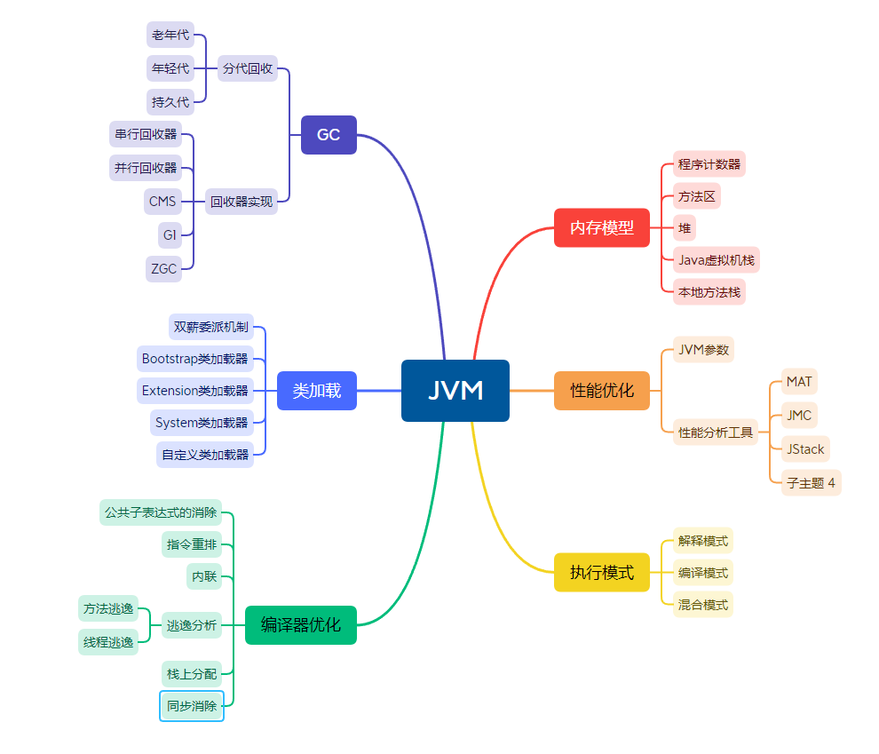

本篇章是主要用于讲解JVM的核心原理，下面是JVM的主要模块的主要功能，后续有修改会更新的。

其中**内存模型**，**类加载机制**、GC是**重点方面**。

**性能调优部分**更偏向于应用，重点突出**实践能力**。

**编译器优化**和**执行部分**偏向于理论基础，重点掌握知识点。

下面是一些比较重点的内容：

- 需要了解**内存模型**各部分内容，保存哪些数据
- **类加载双亲委派机制**，常用加载器分别加载哪种类型的类
- **GC分代回收的思想**和依据以及不同垃圾回收算法回收思路和适合场景
- **性能调优**常有JVM优化参数作用，参数调优的依据，常用的JVM分析工具能分析哪些问题以及使用方法。
- **执行模式解释/编译/混合模式**的优缺点，Java7提供的分层编译技术，JIT即时编译技术，OSR栈上替换，C1/C2编译器针对的场景，C2针对的是server模式，优化更激进；新技术方面Java10的graal编译器
- **编译器优化**javac的编译过程，ast抽象语法树，编译期优化和运行期优化

下面将按照以下目录更新文章：

- Java内存区域
- 垃圾回收
- 类加载
- [待完善]
