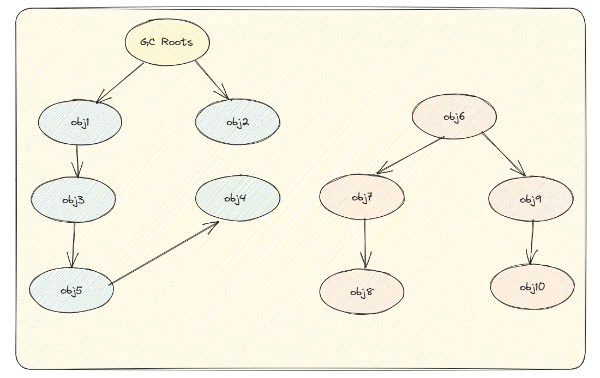
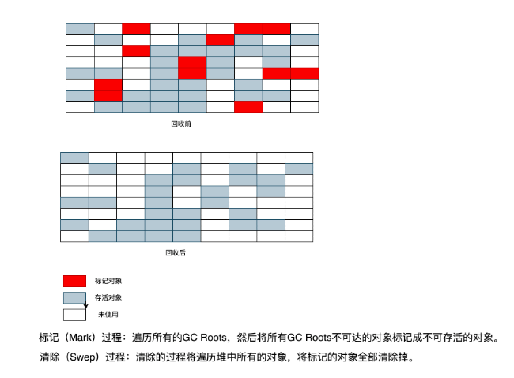
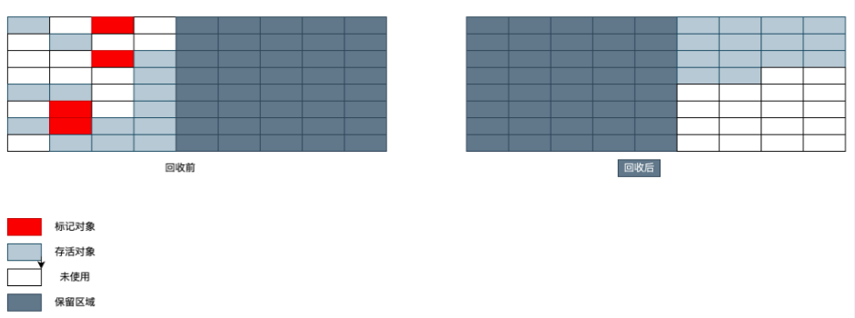
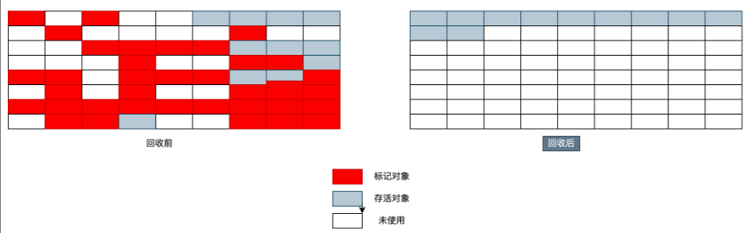
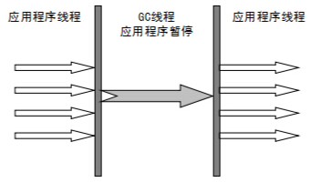
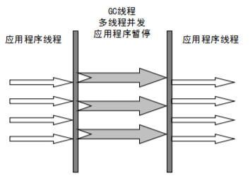
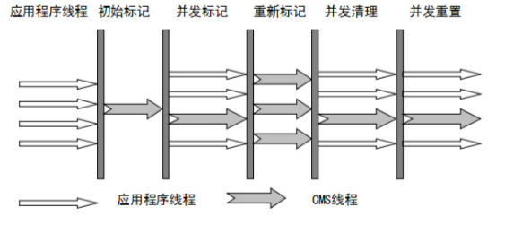

# 前言

当需要排查各种内存一出问题、当垃圾收集称为系统达到更高并发的瓶颈时，我们就需要对这些自动化的技术实施必要的监控和调节。

程序计数器、虚拟机栈、本地方法栈随着线程而生而死；栈帧随着方法的开始而入栈，随着方法的结束而出栈。这几个区域的内存分配和回收都具有确定性，在这几个区域内不需要过多考虑回收的问题，因为方法结束或者线程结束时，内存自然就跟着回收了。

而对于Java堆和方法区，我们只有在程序运行期间才能知道会创建哪些对象，这部分内存的分配和回收都是动态的，垃圾收集器所关注的正式这部分内存。

本节分为两大部分：

- 垃圾回收策略与算法
- 垃圾收集器

# 垃圾回收策略与算法

## 内存分配与回收策略

对象的内存分配，就是在堆上分配（也可能经过JIT编译后被拆散成标量类型并间接在栈上分配），对象主要分配在新生代的Eden区上，少数情况下可能分配陪在老年代，**分配规则不固定**，取决于当前使用的垃圾收集器组合以及相关的参数配置。

### 对象优先在Eden区分配

大多数情况下，对下给你在新生代中Eden区分配。当Eden区没有足够的空间进行分配时，虚拟机将发起一次**Minor GC**。

### 大对象直接进入老年代

大对象就是需要大量连续内存空间的对象，如字符串、数组等。

一个大对象能够存入Eden区的概率比较小，发生分配担保的概率比较大，而分配担保需要涉及大量的复制，就会造成效率低下。

大对象直接进入老年代的行为是由虚拟机动态决定的，它与具体使用的垃圾回收期和相关参数有关。大对象直接进入老年代是一种优化策略，旨在避免将大对象放入新生代，从而减少新生代的垃圾回收频率和成本。

虚拟机提供了一个 `-XX:PretenureSizeThreshold`参数，令大于这个设置值的对象直接在老年代分配，这样做的目的是避免在Eden区及两个Survivor区之间发生大量的内存复制。

- G1垃圾回收器会根据 `-XX:G1HeapRegionSize` 参数设置的堆区域大小和 `-XX:G1MixedGCLiveTHresholdPrecent` 参数设置的阈值，来决定哪些对象会直接进入老年代。
- Parallel Scavenge垃圾回收器中，默认情况下，并没有一个固定的阈值（ `-XX:ThresholdTolelrance` 是动态调整）来决定何时直接在老年代分配大对象。而是由虚拟机根据当前的堆内存情况和历史数据动态决定。

### 长期存活的对象将进入老年代

既然虚拟机采用了分代收集的思想来管理内存，那么内存回收时就必须能识别那些对象应该放在新生代，哪些对象应该在老年代。为了做到这一点，虚拟机给每个对象一个对象年龄计数器。

大部分情况，对象首先在Eden区域分配。如果对象在Eden出生并经过第一次Minor GC后仍然能够活下来，并且能被Survivor容纳，将被移动到Survivor区域，并且该对象的年龄+1（Eden区 -> Survivor区后对象的年龄加1）.

对象在Survivor中每熬过一次Minor GC年龄就会增加1岁，当年龄增加到一定程度（默认15），就会被晋升到老年代中。这个年龄阈值，可以通过参数 `-XX:MaxTenuringThreshold` 来设置。

针对HotSpotVM的实现，它里面的GC其实准确分类只有两大种：

- Partial GC（部分收集）

  - Young GC（Minor GC，新生代收集），只对新生代进行垃圾收集；

  - Old GC（Major GC，老年代收集），只对老年代进行垃圾收集。需要注意的是Major GC在有的语境中也用于指代整堆收集；

  - Mixed GC（混合收集）：对整个新生代和部分老年代进行垃圾收集。

- Full GC（整堆收集），收集整个Java堆和方法区

### 空间分配担保

空间分配担保是为了确保Minor GC之前老年代本身还有容纳新生代所有对象的剩余空间。

《深入理解Java虚拟机》第三章对于空间分配担保的描述如下：

> JDK6 update24之前，发生Minor GC之前，虚拟机必须先检查老年代最大可用的连续空间是否大于新生代所有对象总空间，如果这个条件成立，那这一次Minor GC可以确保是安全的。如果不成立，则虚拟机会先查看 `-XX:HandlePromotionFailure` 参数的设置值是否允许担保失败（Handle Promotion Failure）：如果允许，那会继续检查老年代最大可用的连续空间是否大于历次晋升到老年代对象的平均大小，如果大于，将尝试进行一次Minor GC，尽管这次Minor GC是有风险的；如果小于，或者 `-XX:HandlePromotionFailure` 设置不允许冒险，那这时就要改为一次Full GC。
>
> JDK6 update24之后，规则就变为只要老年代的连续空间大于新生代对象总大小或者历次晋升的平均大小，就会进行Minor GC， 否则将进行Full GC。

通过清除老年代中的废弃数据来扩大老年代空闲空间，以便给新生代作担保。这个过程就是分配担保。

> 总结以下有哪些情况可能会触发JVM进行Full GC。
>
> 1. `System.gc()` 方法的调用，此方法的调用是建议JVM进行Full GC，注意这只是建议而非一定，但在很多情况下它会触发Full GC，从而增加Full GC的频率。通常情况下我们只需要让虚拟机自己去管理内存即可，我们可以通过 `-XX:DisableExplicitGC` 来禁止调用该方法。
> 2. 老年代空间不足 老年代空间不足会触发Full GC操作，若进行该操作后空间依然不足，则会抛出如下错误：`java.lang.OutOfMemoryError: Java heap space`
> 3. 永久代空间不足 JVM规范中运行时数据区域中的方法区，在HotSpot虚拟机中也成为永久代（Permanet Generation），存放一些类信息、常量、静态变量等数据，当系统要加载的类、反射的类和调用的方法较多时，永久代可能会被占满，会触发Full GC。如果经过Full GC仍然回收不了，那么JVM会抛出以下错误：`java.lang.OutOfMemoryError: PermGen space`
> 4. CMS GC时出现 `promotion failed` 和 `concurrent mode failure` promotion failed，就是上文说的担保失败，而concurrent mode failure是在执行CMS GC的过程中同时有对象要放入老年代，而此时老年代空间不足造成的。
> 5. 统计得到的Minor GC晋升到老年代的平均大小小于老年代的剩余空间。

## 死亡对象判断方法

堆中几乎放着所有的对象实例，对堆垃圾回收前的第一步就是要判断哪些对象已经死亡（即不能再被任何途径使用的对象）

若一个对象不被任何对象或变量引用，那么它就是无效对象，需要被回收

### 引用计数法

给对象添加一个引用计数器（对象头维护者一个counter计数器）：

- 每当有一个地方引用它，计数器就加1；
- 当引用失效，计数器就减1；
- 任何时候计数器为0的对象就是不可能再被使用的。

**这个方法实现简单，效率高，但是目前主流的虚拟机中并没有选择这个算法来管理内存，其最主要的原因是他很难解决对象之间循环引用的问题。**（循环应用就是A对象引用B，B对象也引用A）

所谓对象之间的相互引用问题，如下面代码所示：除了对象 `objA` 和 `objB` 相互引用着对方之外，这两个对象之间再无任何引用。但是因为它们互相引用对方，导致它们的引用计数器都不为0，于是引用计数算法无法通知GC回收器回收他们。

```java
public class ReferenceCountingGc {
    Object instance = null;
    public static void main(String[] args) {
        ReferenceCountingGc objA = new ReferenceCountingGc();
        ReferenceCountingGc objB = new ReferenceCountingGc();
        objA.instance = objB;
        objB.isntance = objA;
        objA = null;
        objB = null;
    }
}
```

### 可达性分析算法

这个算法的基本思想就是通过一系列的称为`GC Roots`的对象作为起点，从这些对象开始向下搜索，节点所走过的路径称为引用链，当一个对象到`GC Roots`没有任何引用链相连的话，则证明此对象是不可用的，需要被回收。

如下图，`obj6 ~ obj10` 之间虽然有引用关系，但是GC Roots不可达，因此为需要被回收的对象。



**哪些对象可以作为GC Roots呢？**

- 虚拟机栈（栈帧中的本地变量表）中引用的对象
- 本地方法栈（Native方法）中引用的对象
- 方法区中类静态属性引用的对象
- 方法区中常量引用的对象
- 所有被同步锁持有的对象
- JNI（Java Native Interface）引用的对象

**对象可以被回收，就代表一定会被回收吗？**

即使在可达性分析法中不可达的对象，也并非是“非死不可”的，这时候它们暂时处于“缓刑阶段”，要真正宣告一个对象死亡，至少要经历两次标记过程；可达性分析法中不可达的对象被第一次标记并且进行一次筛选，筛选的条件是此对象是否有必要执行 `finalize` 方法。当对象没有覆盖 `finalize` 方法，或 `finalize` 方法已经被虚拟机调用过时，虚拟机将这两种情况视为没有必要执行。

被判定为需要执行的对象将会被放在一个队列中进行第二次标记，除非这个对象与引用链上的任何一个对象建立关联，否则就会被真的回收。

## 引用类型总结

无论是通过引用计数法判断对象引用数量，还是通过可达性分析法判断对象的引用链是否可达，判定对象的存活都与引用有关。

JDK1.2之前，Java中引用的定义很传统：如果reference类型的数据存储的数值代表的是另一块内存的起始地址，就成这块内存代表一个引用。

JDK1.2之后，Java对引用的概念进行了扩充，将引用分为强引用（StrongReference）、软引用（SoftReference）、弱引用（WeakReference）、虚引用（PhantomReference）四种（引用强度逐渐减弱）。

### 强引用

以前我们使用的大部分引用实际上都是强引用，这是使用最普遍的引用（类似 "`Object obj = new Object()`" 这类的引用，就是强引用）。如果一个对象具有强引用，那就类似于**必不可少的生活用品**，垃圾回收器绝不会回收它。当内存空间不足，Java虚拟机宁愿抛出`OOM`错误，使程序异常终止，也不会随意回收具有强引用的对象来解决内存不足问题。

### 软引用

如果一个对象只具有软引用，那就类似于**可有可无的生活用品**。如果内存空间足够，垃圾回收器就不会回收它，如果内存空间不足，就会回收这些对象的内存。只要垃圾回收器没有回收它，该对象就可以被程序使用。软引用可用来实现内存敏感的高速缓存。

软引用可以和一个引用队列（ReferenceQueue）联合使用，如果软引用所引用的对象被垃圾回收，JAVA 虚拟机就会把这个软引用加入到与之关联的引用队列中。

### 弱引用

如果一个对象只具有弱引用，那就类似于**可有可无的生活用品**。弱引用与软引用的区别在于：只具有弱引用的对象拥有更短暂的生命周期。在垃圾回收器线程扫描它所管辖的内存区域的过程中，一旦发现了只具有弱引用的对象，不管当前内存空间足够与否，都会回收它的内存。不过，由于垃圾回收器是一个优先级很低的线程， 因此不一定会很快发现那些只具有弱引用的对象。

弱引用可以和一个引用队列（ReferenceQueue）联合使用，如果弱引用所引用的对象被垃圾回收，Java 虚拟机就会把这个弱引用加入到与之关联的引用队列中。

### 虚引用

"虚引用"顾名思义，就是形同虚设，与其他几种引用都不同，虚引用并不会决定对象的生命周期。如果一个对象仅持有虚引用，那么它就和没有任何引用一样，在任何时候都可能被垃圾回收。

它仅仅是提供了一种确保对象被 finalize 以后，做某些事情的机制，比如，通常用来做所谓的 Post-Mortem 清理机制。

**虚引用主要用来跟踪对象被垃圾回收的活动**

**虚引用与软引用和弱引用的一个区别在于：** 虚引用必须和引用队列（ReferenceQueue）联合使用。当垃圾回收器准备回收一个对象时，如果发现它还有虚引用，就会在回收对象的内存之前，把这个虚引用加入到与之关联的引用队列中。程序可以通过判断引用队列中是否已经加入了虚引用，来了解被引用的对象是否将要被垃圾回收。程序如果发现某个虚引用已经被加入到引用队列，那么就可以在所引用的对象的内存被回收之前采取必要的行动。

特别注意，在程序设计中一般很少使用弱引用与虚引用，使用软引用的情况较多，这是因为**软引用可以加速 JVM 对垃圾内存的回收速度，可以维护系统的运行安全，防止内存溢出（OutOfMemory）等问题的产生**。

## 回收方法区内存

方法区中存放生命周期较长的类信息、常量、静态变量，每次垃圾收集只有少量垃圾被清除。方法区中主要清楚两种垃圾：

- 废弃常量
- 无用的类

### 如何判断一个常量是废弃常量？

运行时常量池主要回收的是废弃的常量。那么，我们如何判断一个常量是废弃常量呢？

> 1. **JDK1.7 之前运行时常量池逻辑包含字符串常量池存放在方法区, 此时 hotspot 虚拟机对方法区的实现为永久代**
>
> 2. **JDK1.7 字符串常量池被从方法区拿到了堆中, 这里没有提到运行时常量池,也就是说字符串常量池被单独拿到堆,运行时常量池剩下的东西还在方法区, 也就是 hotspot 中的永久代** 。
>
> 3. **JDK1.8 hotspot 移除了永久代用元空间(Metaspace)取而代之, 这时候字符串常量池还在堆, 运行时常量池还在方法区, 只不过方法区的实现从永久代变成了元空间(Metaspace)**

假如在字符串常量池中存在字符串 "abc"，如果当前没有任何 String对象引用该字符串常量的话，就说明常量 "abc" 就是废弃常量，如果这时发生内存回收的话而且有必要的话，"abc" 就会被系统清理出常量池了。

### 如何判断一个类是无用的类？

方法区主要回收的是无用的类，那么如何判断一个类是无用的类的呢？

判定一个常量是否是“废弃常量”比较简单，而要判定一个类是否是“无用的类”的条件则相对苛刻许多。类需要同时满足下面 3 个条件才能算是 **“无用的类”**：

- 该类所有的实例都已经被回收，也就是 Java 堆中不存在该类的任何实例。
- 加载该类的 `ClassLoader` 已经被回收。
- 该类对应的 `java.lang.Class` 对象没有在任何地方被引用，无法在任何地方通过反射访问该类的方法。

虚拟机可以对满足上述 3 个条件的无用类进行回收，这里说的仅仅是“可以”，而并不是和对象一样不使用了就会必然被回收。

## 垃圾收集算法

### 标记-清除算法

标记-清除（Mark-and-Sweep）算法分为标记和清除两个阶段：首先标记处所有不需要回收的对象，在标记完成后统一回收掉所有没有被标记的对象。



**标记**的过程是：遍历所有的`GC Roots`，然后将所有`GC Roots`可达的对象**标记为存活的对象**。

**清除**的过程是：将遍历堆中所有的对象，将没有标记的对象全部清除掉。于此同时，清除那些被标记过的对象的标记，以便下次的垃圾回收。

它是最基础的收集算法，后续算法都是对其不足进行改进得到。这种垃圾收集算法会带来两个明显的问题：

1. **效率问题**：标记和清除两个过程效率都不高
2. **空间问题**：标记清楚后会产生大量不连续的内存碎片（碎片太多可能导致需要分配较大对象时，无法找到足够的连续内存而不得不提前触发另一次垃圾收集动作）

### 复制算法

为了解决标记-清除算法的效率和内存碎片问题，复制（Copying）收集算法出现了。它可以将内存分为大小相同的两块，每次使用其中的一块。当这一块的内存使用完后，就将还存活的对象复制到另一块去，然后再把使用的空间一次清理掉。这样就使每次的内存回收都是对内存区间的一半进行回收。



这种算法存在下面问题：

- **可用内存变小**：缩小为原来的一半
- **不适合老年代**：如果存活对象数量比较大，复制性能会变得很差

### 标记-整理算法

标记-整理（Mark-and-Compact）算法是根据老年代的特点提出的一种标记算法，标记过程仍然与标记-清除算法一样，但后续步骤不是直接对可回收对象回收，而是让所有存活的对象向一端移动，然后直接清理掉端边界以外的内存。



**标记**：它的第一个阶段与**标记-清除算法**是一模一样的，均是遍历 `GC Roots`，然后将存活的对象标记。

**整理**：移动所有**存活的对象**，且按照内存地址次序依次排列，然后将末端内存地址以后的内存全部回收。因此，第二阶段才称为整理阶段。

由于多了整理这一步，因此效率也不高，适合老年代这种垃圾回收频率不是很高的场景。

老年代的对象一般寿命比较长，因此每次垃圾回收会有大量对象存活，如果采用复制算法，每次都需要复制大量存活的对象，效率很低。

### 分代收集算法

当前虚拟机的垃圾收集都采用分代收集算法，这种算法没有什么新的思想，只是根据对象存活周期的不同将内存分为几块。一般将 Java 堆分为新生代和老年代，这样我们就可以根据各个年代的特点选择合适的垃圾收集算法。

比如在**新生代**中，每次收集都会有大量对象死去，所以可以选择”**复制**“算法，只需要付出少量对象的复制成本就可以完成每次垃圾收集。而**老年代**的对象存活几率是比较高的，而且没有额外的空间对它进行分配担保，所以我们必须选择“**标记-清除**”或“**标记-整理**”算法进行垃圾收集。

# 垃圾收集器

**如果说收集算法是内存回收的方法论，那么垃圾收集器就是内存回收的具体体现。**

虽然我们对各个收集器进行比较，但并非要挑选出一个最好的收集器。因为直到现在为止还没有最好的垃圾收集器出现，更加没有万能的垃圾收集器，**我们能做的就是根据具体应用场景选择适合自己的垃圾收集器**。试想一下：如果有一种四海之内、任何场景下都适用的完美收集器存在，那么我们的 HotSpot 虚拟机就不会实现那么多不同的垃圾收集器了。

JDK 默认垃圾收集器（使用 `java -XX:+PrintCommandLineFlags -version` 命令查看）：

- JDK 8：Parallel Scavenge（新生代）+ Parallel Old（老年代）
- JDK 9 ~ JDK20: G1

### Serial收集器

Seaial（串行）收集器是最基本、历史最悠久的垃圾收集器了。这是一个单线程收集器。他的单线程的意义不仅仅意味着他只会使用一条垃圾收集线程去完成垃圾收集工作，更重要的是它在进行垃圾收集工作的时候必须暂停其他所有的工作线程（“Stop The World”），直到它收集结束。

**新生代采用复制算法，老年代采用标记-整理算法**。

一般客户端应用所需内存较小，不会创建太多对象，而且堆内存不大，因此垃圾收集器回收时间短，即使在这段时间停止一切用户线程，也不会感觉明显卡顿。因此 Serial 垃圾收集器**适合客户端**使用。

由于 Serial 收集器只使用一条 GC 线程，避免了线程切换的开销，从而简单高效。



但是 Serial 收集器有没有优于其他垃圾收集器的地方呢？当然有，它**简单而高效（与其他收集器的单线程相比）**。Serial 收集器由于没有线程交互的开销，自然可以获得很高的单线程收集效率。Serial 收集器对于运行在 Client 模式下的虚拟机来说是个不错的选择。

### ParNew收集器

ParNew收集器其实就是Serial收集器的多线程版本，除了使用多线程进行垃圾收集外，其余行为（控制参数、收集算法、回收策略等）和Serial收集器完全一样。

**新生代采用复制算法，老年代采用标记-整理算法**。



ParNew 是 Serial 的多线程版本。由多条 GC 线程并行地进行垃圾清理。但清理过程依然需要 Stop The World。

ParNew 追求“**低停顿时间**”,与 Serial 唯一区别就是使用了多线程进行垃圾收集，在多 CPU 环境下性能比 Serial 会有一定程度的提升；但**线程切换需要额外的开销**，因此在单 CPU 环境中表现不如 Serial。

它是许多运行在 Server 模式下的虚拟机的首要选择，除了 Serial 收集器外，只有它能与 CMS 收集器配合工作。

### Parallel Scavenge收集器

**这是jdk1.8默认收集器。**

**新生代采用复制算法，老年代采用标记-整理算法**。

Parallel Scavenge 和 ParNew 一样，都是多线程、新生代垃圾收集器。但是两者有巨大的不同点：

- Parallel Scavenge：追求 CPU 吞吐量，能够在较短时间内完成指定任务，因此适合没有交互的后台计算。
- ParNew：追求降低用户停顿时间，适合交互式应用。

```java
-XX:+UseParallelGC

    使用 Parallel 收集器+ 老年代串行

-XX:+UseParallelOldGC

    使用 Parallel 收集器+ 老年代并行
```

`吞吐量 = 运行用户代码时间 / (运行用户代码时间 + 垃圾收集时间)`

追求高吞吐量，可以通过减少 GC 执行实际工作的时间，然而，仅仅偶尔运行 GC 意味着每当 GC 运行时将有许多工作要做，因为在此期间积累在堆中的对象数量很高。单个 GC 需要花更多的时间来完成，从而导致更高的暂停时间。而考虑到低暂停时间，最好频繁运行 GC 以便更快速完成，反过来又导致吞吐量下降。

- 通过参数 `-XX:GCTimeRadio` 设置垃圾回收时间占总 CPU 时间的百分比。
- 通过参数 `-XX:MaxGCPauseMillis` 设置垃圾处理过程最久停顿时间。
- 通过命令 -XX:+UseAdaptiveSizePolicy 开启自适应策略。我们只要设置好堆的大小和 `MaxGCPauseMillis` 或 `GCTimeRadio`，收集器会自动调整新生代的大小、Eden 和 Survivor 的比例、对象进入老年代的年龄，以最大程度上接近我们设置的 `MaxGCPauseMillis` 或 `GCTimeRadio`。

### Serial Old收集器

Serial Old 收集器是 Serial 的老年代版本，都是单线程收集器，只启用一条 GC 线程，都适合客户端应用。它们唯一的区别就是：Serial Old 工作在老年代，使用“标记-整理”算法；Serial 工作在新生代，使用“复制”算法。

### Parallel Old收集器

Parallel Old 收集器是 Parallel Scavenge 的老年代版本，追求 CPU 吞吐量。**Parallel Scavenge 收集器的老年代版本**。使用多线程和“标记-整理”算法。在注重吞吐量以及 CPU 资源的场合，都可以优先考虑 Parallel Scavenge 收集器和 Parallel Old 收集器。

### CMS收集器

CMS（Concurrent Mark Sweep，并发标记清除）收集器是以获取最短回收停顿时间为目标的收集器（追求低停顿），它在垃圾收集时使得用户线程和 GC 线程并发执行，因此在垃圾收集过程中用户也不会感到明显的卡顿。

- 初始标记：Stop The World，仅使用一条初始标记线程对所有与 GC Roots 直接关联的对象进行标记。
- 并发标记：使用**多条**标记线程，与用户线程并发执行。此过程进行可达性分析，标记出所有废弃对象。速度很慢。
- 重新标记：Stop The World，使用多条标记线程并发执行，将刚才并发标记过程中新出现的废弃对象标记出来。
- 并发清除：只使用一条 GC 线程，与用户线程并发执行，清除刚才标记的对象。这个过程非常耗时。

并发标记与并发清除过程耗时最长，且可以与用户线程一起工作，因此，**总体上说**，CMS 收集器的内存回收过程是与用户线程**一起并发执行**的。



CMS 的缺点：

- 吞吐量低
- 无法处理浮动垃圾
- 使用“标记-清除”算法产生碎片空间，导致频繁 Full GC

对于产生碎片空间的问题，可以通过开启 -XX:+UseCMSCompactAtFullCollection，在每次 Full GC 完成后都会进行一次内存压缩整理，将零散在各处的对象整理到一块。设置参数 -XX:CMSFullGCsBeforeCompaction 告诉 CMS，经过了 N 次 Full GC 之后再进行一次内存整理。

### G1收集器

**G1（Garbage-First）是一款面向服务器的垃圾收集器，主要针对配备多颗处理器及大容量内存的机器，以极高概率满足GC停顿时间要求的同时，还具备吞吐量性能特征。**

被视为 JDK1.7 中 HotSpot 虚拟机的一个重要进化特征。它具备以下特点：

- **并行与并发**：G1 能充分利用 CPU、多核环境下的硬件优势，使用多个 CPU（CPU 或者 CPU 核心）来缩短 Stop-The-World 停顿时间。部分其他收集器原本需要停顿 Java 线程执行的 GC 动作，G1 收集器仍然可以通过并发的方式让 java 程序继续执行。
- **分代收集**：虽然 G1 可以不需要其他收集器配合就能独立管理整个 GC 堆，但是还是保留了分代的概念。
- **空间整合**：与 CMS 的“标记-清除”算法不同，G1 从整体来看是基于“标记-整理”算法实现的收集器；从局部上来看是基于“标记-复制”算法实现的。
- **可预测的停顿**：这是 G1 相对于 CMS 的另一个大优势，降低停顿时间是 G1 和 CMS 共同的关注点，但 G1 除了追求低停顿外，还能建立可预测的停顿时间模型，能让使用者明确指定在一个长度为 M 毫秒的时间片段内，消耗在垃圾收集上的时间不得超过 N 毫秒。

G1 收集器的运作大致分为以下几个步骤：

- **初始标记**
- **并发标记**
- **最终标记**
- **筛选回收**

**G1 收集器在后台维护了一个优先列表，每次根据允许的收集时间，优先选择回收价值最大的 Region(这也就是它的名字 Garbage-First 的由来)** 。这种使用 Region 划分内存空间以及有优先级的区域回收方式，保证了 G1 收集器在有限时间内可以尽可能高的收集效率（把内存化整为零）。

**从 JDK9 开始，G1 垃圾收集器成为了默认的垃圾收集器。**

### ZGC收集器

与 CMS 中的 ParNew 和 G1 类似，ZGC 也采用复制算法，不过 ZGC 对该算法做了重大改进。

在 ZGC 中出现 Stop The World 的情况会更少！

Java11 的时候 ，ZGC 还在试验阶段。经过多个版本的迭代，不断的完善和修复问题，ZGC 在 Java 15 已经可以正式使用了！

不过，默认的垃圾回收器依然是 G1。你可以通过下面的参数启动 ZGC：

```bash
$ java -XX:+UseZGC className
```

关于 ZGC 收集器的详细介绍推荐阅读美团技术团队的 [新一代垃圾回收器 ZGC 的探索与实践](https://tech.meituan.com/2020/08/06/new-zgc-practice-in-meituan.html) 这篇文章。