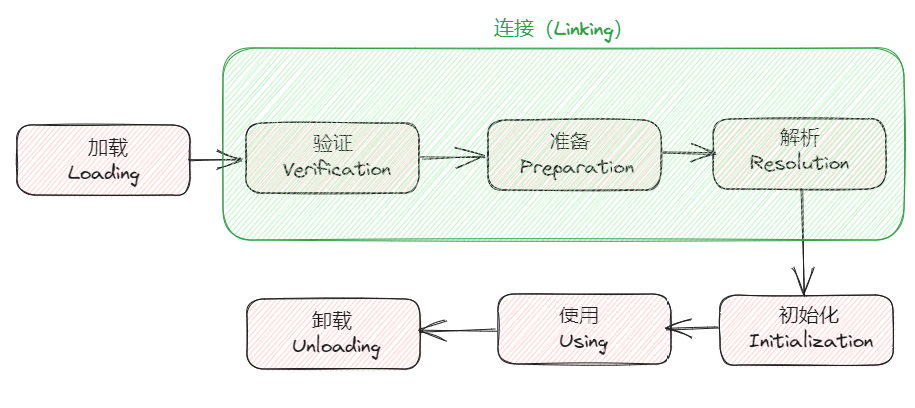
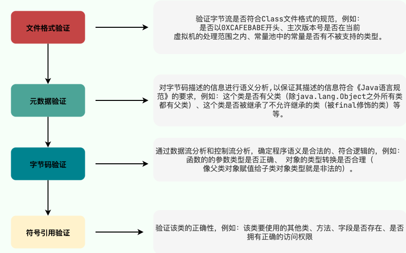
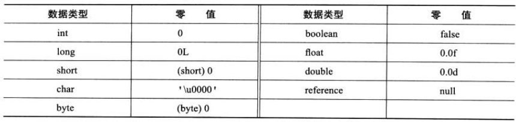
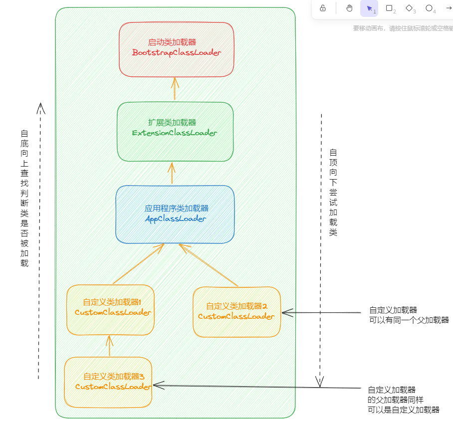

# 前言

本章主要有以下几个方面：

- 类文件结构
- 类加载过程
- 类加载器

# 类文件结构

## JVM的无关性

谈论JVM的无关性，主要有以下两个：

- 平台无关性：任何操作系统都能运行Java代码
- 语言无关性：JVM能运行除Java以外的其他代码

Java源代码首先使用`javac`编译器编译成`.class`文件，然后由JVM执行`.class`文件，从而程序开始运行。

JVM 只认识 `.class` 文件，它不关心是何种语言生成了 `.class` 文件，只要 `.class` 文件符合 JVM 的规范就能运行。 目前已经有 JRuby、Jython、Scala 等语言能够在 JVM 上运行。它们有各自的语法规则，不过它们的编译器 都能将各自的源码编译成符合 JVM 规范的 .class 文件，从而能够借助 JVM 运行它们。

> Java 语言中的各种变量、关键字和运算符号的语义最终都是由多条字节码命令组合而成的， 因此字节码命令所能提供的语义描述能力肯定会比 Java 语言本身更加强大。 因此，有一些 Java 语言本身无法有效支持的语言特性，不代表字节码本身无法有效支持。

## Class文件结构

Class 文件是二进制文件，它的内容具有严格的规范，文件中没有任何空格，全都是连续的 0/1。Class 文件 中的所有内容被分为两种类型：无符号数、表。

- 无符号数 无符号数表示 Class 文件中的值，这些值没有任何类型，但有不同的长度。u1、u2、u4、u8 分别代表 1/2/4/8 字节的无符号数。
- 表 由多个无符号数或者其他表作为数据项构成的复合数据类型。

如下所示：

```java
ClassFile {
    u4             magic; // Class 文件的标志
    u2             minor_version; // Class 的小版本号
    u2             major_version; // Class 的大版本号
    u2             constant_pool_count; // 常量池的数量
    cp_info        constant_pool[constant_pool_count-1]; // 常量池
    u2             access_flags; // Class 的访问标记
    u2             this_class; // 当前类
    u2             super_class; // 父类
    u2             interfaces_count; // 接口数量
    u2             interfaces[interfaces_count]; // 一个类可以实现多个接口
    u2             fields_count; // 字段数量
    field_info     fields[fields_count]; // 一个类可以有多个字段
    u2             methods_count; // 方法数量
    method_info    methods[methods_count]; // 一个类可以有个多个方法
    u2             attributes_count; // 此类的属性表中的属性数
    attribute_info attributes[attributes_count]; // 属性表集合
}

```

通过IDEA插件 `jclasslib` 可以更直观的观察class文件结构。

class文件具体由以下几个构成：

- 魔数
- 版本信息
- 常量池
- 访问标志
- 类索引、夫类索引、接口索引集合
- 字段表集合
- 方法表集合
- 属性表集合

### 魔数（Magic Number）

```java
u4             magic; // Class 文件的标志
```

每个class文件的头4个字节称为魔数（Magic Number），它唯一的作用就是**确定这个文件是否为一个能被虚拟机接收的class文件**。class 文件的魔数是用 16 进制表示的`0xCAFEBABE`，如果读取的文件不是以这个魔数开头，Java虚拟机将拒绝加载它。

### class文件版本号（Minor&Major Version）

```java
    u2             minor_version; // Class 的次版本号
    u2             major_version; // Class 的主版本号
```

紧接着魔数的四个字节存储的是class文件的版本号：5到6字节是**次版本号**，7到8字节是**主版本号**。

每当 Java 发布大版本（比如 Java 8，Java9）的时候，主版本号都会加 1。你可以使用 `javap -v` 命令来快速查看 Class 文件的版本号信息。

高版本的 Java 虚拟机可以执行低版本编译器生成的 Class 文件，但是低版本的 Java 虚拟机不能执行高版本编译器生成的 Class 文件。所以，我们在实际开发的时候要确保开发的的 JDK 版本和生产环境的 JDK 版本保持一致。

### 常量池（Constant Pool）

```java
u2             constant_pool_count; // 常量池的数量
cp_info        constant_pool[constant_pool_count-1]; // 常量池
```

紧接着主次版本号之后的是常量池，常量池的数量是 `constant_pool_count-1`（**常量池计数器是从 1 开始计数的，将第 0 项常量空出来是有特殊考虑的，索引值为 0 代表“不引用任何一个常量池项”**）。

常量池主要存放两大常量：

- **字面量**
- **符号引用**

字面量比较接近于 Java 语言层面的的常量概念，如文本字符串、声明为 final 的常量值等。

而符号引用则属于编译原理方面的概念。包括下面三类常量：

- 类和接口的全限定名
- 字段的名称和描述符
- 方法的名称和描述符

常量池中每一项常量都是一个表，这 14 种表有一个共同的特点：**开始的第一位是一个 u1 类型的标志位 -tag 来标识常量的类型，代表当前这个常量属于哪种常量类型。**

|                类型                | 标志（tag） |          描述          |
| :--------------------------------: | :---------: | :--------------------: |
|        `CONSTANT_utf8_info`        |      1      |   UTF-8 编码的字符串   |
|      `CONSTANT_Integer_info`       |      3      |       整形字面量       |
|       `CONSTANT_Float_info`        |      4      |      浮点型字面量      |
|        `CONSTANT_Long_info`        |     ５      |      长整型字面量      |
|       `CONSTANT_Double_info`       |     ６      |   双精度浮点型字面量   |
|       `CONSTANT_Class_info`        |     ７      |   类或接口的符号引用   |
|       `CONSTANT_String_info`       |     ８      |    字符串类型字面量    |
|      `CONSTANT_FieldRef_info`      |     ９      |     字段的符号引用     |
|     `CONSTANT_MethodRef_info`      |     10      |   类中方法的符号引用   |
| `CONSTANT_InterfaceMethodRef_info` |     11      |  接口中方法的符号引用  |
|    `CONSTANT_NameAndType_info`     |     12      |  字段或方法的符号引用  |
|     `CONSTANT_MethodType_info`     |     16      |      标志方法类型      |
|    `CONSTANT_MethodHandle_info`    |     15      |      表示方法句柄      |
|   `CONSTANT_InvokeDynamic_info`    |     18      | 表示一个动态方法调用点 |

对于 CONSTANT_Class_info（此类型的常量代表一个类或者接口的符号引用），它的二维表结构如下：

| 类型 | 名称       | 数量 |
| ---- | ---------- | ---- |
| u1   | tag        | 1    |
| u2   | name_index | 1    |

tag 是标志位，用于区分常量类型；name_index 是一个索引值，它指向常量池中一个 CONSTANT_Utf8_info 类型常量，此常量代表这个类（或接口）的全限定名，这里 name_index 值若为 0x0002，也即是指向了常量池中的第二项常量。

CONSTANT_Utf8_info 型常量的结构如下：

| 类型 | 名称   | 数量   |
| ---- | ------ | ------ |
| u1   | tag    | 1      |
| u2   | length | 1      |
| u1   | bytes  | length |

tag 是当前常量的类型；length 表示这个字符串的长度；bytes 是这个字符串的内容（采用缩略的 UTF8 编码）

`.class` 文件可以通过`javap -v class类名` 指令来看一下其常量池中的信息(`javap -v class类名-> temp.txt`：将结果输出到 temp.txt 文件)。

### 访问标志（Access Flags）

```java
u2             access_flags; // Class 的访问标记
```

在常量池结束之后，紧接着的两个字节代表访问标志，这个标志用于识别一些类或者接口层次的访问信息，包括：这个 Class 是类还是接口，是否为 `public` 或者 `abstract` 类型，如果是类的话是否声明为 `final` 等等。

### 类索引（This Class）、父类索引（Super Class）、接口（Interface）索引集合

```java
u2             this_class; // 当前类
u2             super_class; // 父类
u2             interfaces_count; // 接口数量
u2             interfaces[interfaces_count]; // 一个类可以实现多个接口
```

类索引和父类索引都是一个 u2 类型的数据，而接口索引集合是一组 u2 类型的数据的集合，Class 文件中由这三项数据来确定类的继承关系。类索引用于确定这个类的全限定名，父类索引用于确定这个类的父类的全限定名。

由于 Java 不允许多重继承，所以父类索引只有一个，除了 java.lang.Object 之外，所有的 Java 类都有父类，因此除了 java.lang.Object 外，所有 Java 类的父类索引都不为 0。一个类可能实现了多个接口，因此用接口索引集合来描述。这个集合第一项为 u2 类型的数据，表示索引表的容量，接下来就是接口的名字索引。

类索引和父类索引用两个 u2 类型的索引值表示，它们各自指向一个类型为 CONSTANT_Class_info 的类描述符常量，通过该常量总的索引值可以找到定义在 CONSTANT_Utf8_info 类型的常量中的全限定名字符串。

### 字段表集合（Fields）

```java
u2             fields_count; // 字段数量
field_info     fields[fields_count]; // 一个类会可以有个字段
```

字段表集合存储本类涉及到的成员变量，包括实例变量和类变量，但不包括方法中的局部变量。

每一个字段表只表示一个成员变量，本类中的所有成员变量构成了字段表集合。字段表结构如下：

| 类型 | 名称             | 数量             | 说明                                                         |
| ---- | ---------------- | ---------------- | ------------------------------------------------------------ |
| u2   | access_flags     | 1                | 字段的访问标志，与类稍有不同                                 |
| u2   | name_index       | 1                | 字段名字的索引                                               |
| u2   | descriptor_index | 1                | 描述符，用于描述字段的数据类型。 基本数据类型用大写字母表示； 对象类型用“L 对象类型的全限定名”表示。 |
| u2   | attributes_count | 1                | 属性表集合的长度                                             |
| u2   | attributes       | attributes_count | 属性表集合，用于存放属性的额外信息，如属性的值。             |

- **access_flags:** 字段的作用域（`public` ,`private`,`protected`修饰符），是实例变量还是类变量（`static`修饰符）,可否被序列化（transient 修饰符）,可变性（final）,可见性（volatile 修饰符，是否强制从主内存读写）。
- **name_index:** 对常量池的引用，表示的字段的名称；
- **descriptor_index:** 对常量池的引用，表示字段和方法的描述符；
- **attributes_count:** 一个字段还会拥有一些额外的属性，attributes_count 存放属性的个数；
- **attributes[attributes_count]:** 存放具体属性具体内容。

上述这些信息中，各个修饰符都是布尔值，要么有某个修饰符，要么没有，很适合使用标志位来表示。而字段叫什么名字、字段被定义为什么数据类型这些都是无法固定的，只能引用常量池中常量来描述。

> 字段表集合中不会出现从父类（或接口）中继承而来的字段，但有可能出现原本 Java 代码中不存在的字段，譬如在内部类中为了保持对外部类的访问性，会自动添加指向外部类实例的字段。

### 方法表集合（Methods）

```java
u2             methods_count;//方法数量
method_info    methods[methods_count];//一个类可以有个多个方法
```

methods_count 表示方法的数量，而 method_info 表示方法表。

Class 文件存储格式中对方法的描述与对字段的描述几乎采用了完全一致的方式。方法表的结构如同字段表一样，依次包括了访问标志、名称索引、描述符索引、属性表集合几项。

注意：因为`volatile`修饰符和`transient`修饰符不可以修饰方法，所以方法表的访问标志中没有这两个对应的标志，但是增加了`synchronized`、`native`、`abstract`等关键字修饰方法，所以也就多了这些关键字对应的标志。

### 属性表集合（Attributes）

```java
u2             attributes_count; // 此类的属性表中的属性数
attribute_info attributes[attributes_count]; // 属性表集合
```

在 Class 文件，字段表，方法表中都可以携带自己的属性表集合，以用于描述某些场景专有的信息。与 Class 文件中其它的数据项目要求的顺序、长度和内容不同，属性表集合的限制稍微宽松一些，不再要求各个属性表具有严格的顺序，并且只要不与已有的属性名重复，任何人实现的编译器都可以向属性表中写 入自己定义的属性信息，Java 虚拟机运行时会忽略掉它不认识的属性。

每个属性对应一张属性表，属性表的结构如下：

| 类型 | 名称                 | 数量             |
| ---- | -------------------- | ---------------- |
| u2   | attribute_name_index | 1                |
| u4   | attribute_length     | 1                |
| u1   | info                 | attribute_length |

# 类加载过程

## 类生命周期

类从被加载到虚拟机内存开始，到卸载出内存为止，它的整个生命周期包括以下 7 个阶段：

- 加载（loading）
- 验证（Verification）
- 准备（Preparation）
- 解析（Resolution）
- 初始化（Initialization）
- 使用（Using）
- 卸载（Unloading）

验证、准备、解析 3 个阶段统称为连接。

这七个阶段的顺序图如下：



## 类加载过程

**Class 文件需要加载到虚拟机中之后才能运行和使用，那么虚拟机是如何加载这些 Class 文件呢？**

系统加载 Class 类型的文件主要三步：**加载->连接->初始化**。连接过程又可分为三步：**验证->准备->解析**。

详见：[https://docs.oracle.com/javase/specs/jvms/se8/html/jvms-5.html#jvms-5.3](https://docs.oracle.com/javase/specs/jvms/se8/html/jvms-5.html#jvms-5.3)

### 加载

#### 加载的过程

“加载”是“类加载”过程的一个阶段，不能混淆这两个名词。在加载阶段，虚拟机需要完成 3 件事：

- 通过类的全限定名获取该类的二进制字节流。
- 将二进制字节流所代表的静态结构转化为方法区的运行时数据结构。
- 在内存中创建一个代表该类的 java.lang.Class 对象，作为方法区这个类的各种数据的访问入口。

#### 获取二进制字节流

对于 Class 文件，虚拟机没有指明要从哪里获取、怎样获取。除了直接从编译好的 .class 文件中读取，还有以下几种方式：

- 从 zip 包中读取，如 jar、war 等；
- 从网络中获取，如 Applet；
- 通过动态代理技术生成代理类的二进制字节流；
- 由 JSP 文件生成对应的 Class 类；
- 从数据库中读取，如 有些中间件服务器可以选择把程序安装到数据库中来完成程序代码在集群间的分发。

#### “非数组类”与“数组类”加载比较

- 非数组类加载阶段可以使用系统提供的引导类加载器，也可以由用户自定义的类加载器完成，开发人员可以通过定义自己的类加载器控制字节流的获取方式（如重写一个类加载器的 `loadClass()` 方法）。
- 数组类本身不通过类加载器创建，它是由 Java 虚拟机直接创建的，再由类加载器创建数组中的元素类。

#### 注意事项

- 虚拟机规范未规定 Class 对象的存储位置，对于 HotSpot 虚拟机而言，Class 对象比较特殊，它虽然是对象，但存放在方法区中。
- 加载阶段与连接阶段的部分内容交叉进行，加载阶段尚未完成，连接阶段可能已经开始了。但这两个阶段的开始时间仍然保持着固定的先后顺序。

### 验证

#### 验证的重要性

验证阶段确保 Class 文件的字节流中包含的信息符合当前虚拟机的要求，并且不会危害虚拟机自身的安全。

#### 验证的过程

- 文件格式验证 验证字节流是否符合 Class 文件格式的规范，并且能被当前版本的虚拟机处理，验证点如下：
  - 是否以魔数 0XCAFEBABE 开头。
  - 主次版本号是否在当前虚拟机处理范围内。
  - 常量池是否有不被支持的常量类型。
  - 指向常量的索引值是否指向了不存在的常量。
  - CONSTANT_Utf8_info 型的常量是否有不符合 UTF8 编码的数据。
  - ......
- 元数据验证 对字节码描述信息进行语义分析，确保其符合 Java 语法规范。
- 字节码验证 本阶段是验证过程中最复杂的一个阶段，是对方法体进行语义分析，保证方法在运行时不会出现危害虚拟机的事件。
- 符号引用验证 本阶段发生在解析阶段，确保解析正常执行。
  - 如果无法通过符号引用验证，JVM 会抛出异常，比如：
    - `java.lang.IllegalAccessError`：当类试图访问或修改它没有权限访问的字段，或调用它没有权限访问的方法时，抛出该异常。
    - `java.lang.NoSuchFieldError`：当类试图访问或修改一个指定的对象字段，而该对象不再包含该字段时，抛出该异常。
    - `java.lang.NoSuchMethodError`：当类试图访问一个指定的方法，而该方法不存在时，抛出该异常。
    - ......



### 准备

**准备阶段是正式为类变量（或称“静态成员变量”）分配内存并设置类变量初始值的阶段**。这些变量（不包括实例变量）所使用的内存都在方法区中进行分配。

对于该阶段有以下几点需要注意：

1. 这时候进行内存分配的仅包括类变量（ Class Variables ，即静态变量，被 `static` 关键字修饰的变量，只与类相关，因此被称为类变量），而不包括实例变量。实例变量会在对象实例化时随着对象一块分配在 Java 堆中。
2. 从概念上讲，类变量所使用的内存都应当在 **方法区** 中进行分配。不过有一点需要注意的是：JDK 7 之前，HotSpot 使用永久代来实现方法区的时候，实现是完全符合这种逻辑概念的。 而在 JDK 7 及之后，HotSpot 已经把原本放在永久代的字符串常量池、静态变量等移动到堆中，这个时候类变量则会随着 Class 对象一起存放在 Java 堆中。相关阅读：[《深入理解 Java 虚拟机（第 3 版）》勘误#75](https://github.com/fenixsoft/jvm_book/issues/75)
3. 这里所设置的初始值"通常情况"下是数据类型默认的零值（如 0、0L、null、false 等），比如我们定义了`public static int value=111` ，那么 value 变量在准备阶段的初始值就是 0 而不是 111（初始化阶段才会赋值）。特殊情况：比如给 value 变量加上了 final 关键字`public static final int value=111` ，那么准备阶段 value 的值就被赋值为 111。

**基本数据类型的零值**：



### 解析

**解析阶段是虚拟机将常量池内的符号引用替换为直接引用的过程。**解析动作主要针对类或接口、字段、类方法、接口方法、方法类型、方法句柄和调用限定符 7 类符号引用进行。

### 初始化

**初始化阶段是执行初始化方法 `<clinit> ()`方法的过程，是类加载的最后一步，这一步 JVM 才开始真正执行类中定义的 Java 程序代码(字节码)。**

> 说明：`<clinit>()` 方法是由编译器自动收集类中的所有类变量的赋值动作和静态语句块（static {} 块）中的语句合并产生的，编译器收集的顺序是由语句在源文件中出现的顺序所决定的。

对于`<clinit> ()` 方法的调用，虚拟机会自己确保其在多线程环境中的安全性。因为 `<clinit> ()` 方法是带锁线程安全，所以在多线程环境下进行类初始化的话可能会引起多个线程阻塞，并且这种阻塞很难被发现。

静态语句块中只能访问定义在静态语句块之前的变量，定义在它之后的变量，在前面的静态语句块中可以赋值，但不能访问。如下方代码所示：

```java
public class Test {
    static {
        i = 0;  // 给变量赋值可以正常编译通过
        System.out.println(i);  // 这句编译器会提示“非法向前引用”
    }
    static int i = 1;
}
```

`<clinit>()` 方法不需要显式调用父类构造器，虚拟机会保证在子类的 `<clinit>()` 方法执行之前，父类的 `<clinit>()` 方法已经执行完毕。

由于父类的 `<clinit>()` 方法先执行，意味着父类中定义的静态语句块要优先于子类的变量赋值操作。如下方代码所示：

```java
static class Parent {
    public static int A = 1;
    static {
        A = 2;
    }
}

static class Sub extends Parent {
    public static int B = A;
}

public static void main(String[] args) {
    System.out.println(Sub.B); // 输出 2
}
```

`<clinit>()` 方法不是必需的，如果一个类没有静态语句块，也没有对类变量的赋值操作，那么编译器可以不为这个类生成 `<clinit>()` 方法。

接口中不能使用静态代码块，但接口也需要通过 `<clinit>()` 方法为接口中定义的静态成员变量显式初始化。但接口与类不同，接口的 `<clinit>()` 方法不需要先执行父类的 `<clinit>()` 方法，只有当父接口中定义的变量使用时，父接口才会初始化。

## 类卸载

**卸载类即该类的 Class 对象被 GC。**

卸载类需要满足 3 个要求:

1. 该类的所有的实例对象都已被 GC，也就是说堆不存在该类的实例对象。
2. 该类没有在其他任何地方被引用
3. 该类的类加载器的实例已被 GC

所以，在 JVM 生命周期内，由 jvm 自带的类加载器加载的类是不会被卸载的。但是由我们自定义的类加载器加载的类是可能被卸载的。

只要想通一点就好了，JDK 自带的 `BootstrapClassLoader`, `ExtClassLoader`, `AppClassLoader` 负责加载 JDK 提供的类，所以它们(类加载器的实例)肯定不会被回收。而我们自定义的类加载器的实例是可以被回收的，所以使用我们自定义加载器加载的类是可以被卸载掉的。

# 类加载器

## 类加载器

### 类加载器介绍

类加载器从 JDK 1.0 就出现了，最初只是为了满足 Java Applet（已经被淘汰） 的需要。后来，慢慢成为 Java 程序中的一个重要组成部分，赋予了 Java 类可以被动态加载到 JVM 中并执行的能力。

根据官方 API 文档的介绍：

> A class loader is an object that is responsible for loading classes. The class ClassLoader is an abstract class. Given the binary name of a class, a class loader should attempt to locate or generate data that constitutes a definition for the class. A typical strategy is to transform the name into a file name and then read a "class file" of that name from a file system.
>
> Every Class object contains a reference to the ClassLoader that defined it.
>
> Class objects for array classes are not created by class loaders, but are created automatically as required by the Java runtime. The class loader for an array class, as returned by Class.getClassLoader() is the same as the class loader for its element type; if the element type is a primitive type, then the array class has no class loader.

翻译过来大概的意思是：

> 类加载器是一个负责加载类的对象。`ClassLoader` 是一个抽象类。给定类的二进制名称，类加载器应尝试定位或生成构成类定义的数据。典型的策略是将名称转换为文件名，然后从文件系统中读取该名称的“类文件”。
>
> 每个 Java 类都有一个引用指向加载它的 `ClassLoader`。不过，数组类不是通过 `ClassLoader` 创建的，而是 JVM 在需要的时候自动创建的，数组类通过`getClassLoader()`方法获取 `ClassLoader` 的时候和该数组的元素类型的 `ClassLoader` 是一致的。

从上面的介绍可以看出:

- 类加载器是一个负责加载类的对象，用于实现类加载过程中的加载这一步。
- 每个 Java 类都有一个引用指向加载它的 `ClassLoader`。
- 数组类不是通过 `ClassLoader` 创建的（数组类没有对应的二进制字节流），是由 JVM 直接生成的。

```java
class Class<T> {
  ...
  private final ClassLoader classLoader;
  @CallerSensitive
  public ClassLoader getClassLoader() {
     //...
  }
  ...
}
```

简单来说，**类加载器的主要作用就是加载 Java 类的字节码（ `.class` 文件）到 JVM 中（在内存中生成一个代表该类的 `Class` 对象）。** 字节码可以是 Java 源程序（`.java`文件）经过 `javac` 编译得来，也可以是通过工具动态生成或者通过网络下载得来。

其实除了加载类之外，类加载器还可以加载 Java 应用所需的资源如文本、图像、配置文件、视频等等文件资源。本文只讨论其核心功能：加载类。

### 类加载器加载规则

JVM 启动的时候，并不会一次性加载所有的类，而是根据需要去动态加载。也就是说，大部分类在具体用到的时候才会去加载，这样对内存更加友好。

对于已经加载的类会被放在 `ClassLoader` 中。在类加载的时候，系统会首先判断当前类是否被加载过。已经被加载的类会直接返回，否则才会尝试加载。也就是说，对于一个类加载器来说，相同二进制名称的类只会被加载一次。

```java
public abstract class ClassLoader {
  ...
  private final ClassLoader parent;
  // 由这个类加载器加载的类。
  private final Vector<Class<?>> classes = new Vector<>();
  // 由VM调用，用此类加载器记录每个已加载类。
  void addClass(Class<?> c) {
        classes.addElement(c);
   }
  ...
}
```

**判断类是否相等**

任意一个类，都由**加载它的类加载器**和这个**类本身**一同确立其在 Java 虚拟机中的唯一性，每一个类加载器，都有一个独立的类名称空间。

因此，比较两个类是否“相等”，只有在这两个类是由同一个类加载器加载的前提下才有意义，否则，即使这两个类来源于同一个 Class 文件，被同一个虚拟机加载，只要加载它们的类加载器不同，那么这两个类就必定不相等。

这里的“相等”，包括代表类的 Class 对象的 `equals()` 方法、`isInstance()` 方法的返回结果，也包括使用 instanceof 关键字做对象所属关系判定等情况。

### 类加载器种类

JVM 中内置了三个重要的 `ClassLoader`：

- 启动类加载器（`Bootstrap ClassLoader`）： 负责将存放在 `<JAVA_HOME>\lib` 目录中的，并且能被虚拟机识别的（仅按照文件名识别，如 rt.jar，名字不符合的类库即使放在 lib 目录中也不会被加载）类库加载到虚拟机内存中。
- 扩展类加载器（`Extension ClassLoader`）： 负责加载 `<JAVA_HOME>\lib\ext` 目录中的所有类库，开发者可以直接使用扩展类加载器。
- 应用程序类加载器（`Application ClassLoader`）： 由于这个类加载器是 ClassLoader 中的 `getSystemClassLoader()` 方法的返回值，所以一般也称它为“系统类加载器”。它负责加载用户类路径（classpath）上所指定的类库，开发者可以直接使用这个类加载器，如果应用程序中没有自定义过自己的类加载器，一般情况下这个就是程序中默认的类加载器。

除了这三种类加载器之外，用户还可以加入自定义的类加载器来进行拓展，以满足自己的特殊需求。就比如说，我们可以对 Java 类的字节码（ `.class` 文件）进行加密，加载时再利用自定义的类加载器对其解密。

除了 `BootstrapClassLoader` 是 JVM 自身的一部分之外，其他所有的类加载器都是在 JVM 外部实现的，并且全都继承自 `ClassLoader`抽象类。这样做的好处是用户可以自定义类加载器，以便让应用程序自己决定如何去获取所需的类。

每个 `ClassLoader` 可以通过`getParent()`获取其父 `ClassLoader`，如果获取到 `ClassLoader` 为`null`的话，那么该类是通过 `BootstrapClassLoader` 加载的。

```java
public abstract class ClassLoader {
  ...
  // 父加载器
  private final ClassLoader parent;
  @CallerSensitive
  public final ClassLoader getParent() {
     //...
  }
  ...
}
```

**为什么 获取到 `ClassLoader` 为`null`就是 `BootstrapClassLoader` 加载的呢？** 这是因为`BootstrapClassLoader` 由 C++ 实现，由于这个 C++ 实现的类加载器在 Java 中是没有与之对应的类的，所以拿到的结果是 null。

下面我们来看一个获取 `ClassLoader` 的小案例：

```java
public class PrintClassLoaderTree {

    public static void main(String[] args) {

        ClassLoader classLoader = PrintClassLoaderTree.class.getClassLoader();

        StringBuilder split = new StringBuilder("|--");
        boolean needContinue = true;
        while (needContinue){
            System.out.println(split.toString() + classLoader);
            if(classLoader == null){
                needContinue = false;
            }else{
                classLoader = classLoader.getParent();
                split.insert(0, "\t");
            }
        }
    }

}
```

输出结果(JDK 8 )：

```text
|--sun.misc.Launcher$AppClassLoader@18b4aac2
    |--sun.misc.Launcher$ExtClassLoader@53bd815b
        |--null
```

从输出结果可以看出：

- 我们编写的 Java 类 `PrintClassLoaderTree` 的 `ClassLoader` 是`AppClassLoader`；
- `AppClassLoader`的父 `ClassLoader` 是`ExtClassLoader`；
- `ExtClassLoader`的父`ClassLoader`是`Bootstrap ClassLoader`，因此输出结果为 null。

### 自定义类加载器

我们前面也说说了，除了 `BootstrapClassLoader` 其他类加载器均由 Java 实现且全部继承自`java.lang.ClassLoader`。如果我们要自定义自己的类加载器，很明显需要继承 `ClassLoader`抽象类。

`ClassLoader` 类有两个关键的方法：

- `protected Class loadClass(String name, boolean resolve)`：加载指定二进制名称的类，实现了双亲委派机制 。`name` 为类的二进制名称，`resolve` 如果为 true，在加载时调用 `resolveClass(Class<?> c)` 方法解析该类。
- `protected Class findClass(String name)`：根据类的二进制名称来查找类，默认实现是空方法。

官方 API 文档中写到：

> Subclasses of `ClassLoader` are encouraged to override `findClass(String name)`, rather than this method.
>
> 建议 `ClassLoader`的子类重写 `findClass(String name)`方法而不是`loadClass(String name, boolean resolve)` 方法。

如果我们不想打破双亲委派模型，就重写 `ClassLoader` 类中的 `findClass()` 方法即可，无法被父类加载器加载的类最终会通过这个方法被加载。但是，如果想打破双亲委派模型则需要重写 `loadClass()` 方法。

## 双亲委派模型

### 介绍

类加载器有很多种，当我们想要加载一个类的时候，具体是哪个类加载器加载呢？这就需要提到双亲委派模型了。

双亲委派模型是描述类加载器之间的层次关系。它要求除了顶层的启动类加载器外，其余的类加载器都应当有自己的父类加载器。（父子关系一般不会以继承的关系实现，而是以组合关系来复用父加载器的代码）

根据官网介绍：

> The ClassLoader class uses a delegation model to search for classes and resources. Each instance of ClassLoader has an associated parent class loader. When requested to find a class or resource, a ClassLoader instance will delegate the search for the class or resource to its parent class loader before attempting to find the class or resource itself. The virtual machine's built-in class loader, called the "bootstrap class loader", does not itself have a parent but may serve as the parent of a ClassLoader instance.

翻译过来大概的意思是：

> `ClassLoader` 类使用委托模型来搜索类和资源。每个 `ClassLoader` 实例都有一个相关的父类加载器。需要查找类或资源时，`ClassLoader` 实例会在试图亲自查找类或资源之前，将搜索类或资源的任务委托给其父类加载器。 虚拟机中被称为 "bootstrap class loader"的内置类加载器本身没有父类加载器，但是可以作为 `ClassLoader` 实例的父类加载器。

从上面的介绍可以看出：

- `ClassLoader` 类使用委托模型来搜索类和资源。
- 双亲委派模型要求除了顶层的启动类加载器外，其余的类加载器都应有自己的父类加载器。
- `ClassLoader` 实例会在试图亲自查找类或资源之前，将搜索类或资源的任务委托给其父类加载器。

下图展示的各种类加载器之间的层次关系被称为类加载器的“**双亲委派模型(Parents Delegation Model)**”。



> 注意 ⚠️：双亲委派模型并不是一种强制性的约束，只是 JDK 官方推荐的一种方式。如果我们因为某些特殊需求想要打破双亲委派模型，也是可以的

另外，类加载器之间的父子关系一般不是以继承的关系来实现的，而是通常使用组合关系来复用父加载器的代码。

```java
public abstract class ClassLoader {
  ...
  // 组合
  private final ClassLoader parent;
  protected ClassLoader(ClassLoader parent) {
       this(checkCreateClassLoader(), parent);
  }
  ...
}
```

在面向对象编程中，有一条非常经典的设计原则：**组合优于继承，多用组合少用继承。

### 执行流程

如果一个类加载器收到了类加载的请求，它首先不会自己去尝试加载这个类，而是把这个请求委派给父类加载器去完成，每一个层次的类加载器都是如此，因此所有的加载请求最终都应该传送到顶层的启动类加载器中，只有当父加载器反馈自己无法完成这个加载请求（找不到所需的类）时，子加载器才会尝试自己去加载。

在 java.lang.ClassLoader 中的 `loadClass` 方法中实现该过程。

```java
protected Class<?> loadClass(String name, boolean resolve)
    throws ClassNotFoundException
{
    synchronized (getClassLoadingLock(name)) {
        // 首先，检查该类是否已经加载过
        Class c = findLoadedClass(name);
        if (c == null) {
            // 如果 c 为 null，则说明该类没有被加载过
            long t0 = System.nanoTime();
            try {
                if (parent != null) {
                    // 当父类的加载器不为空，则通过父类的loadClass来加载该类
                    c = parent.loadClass(name, false);
                } else {
                    // 当父类的加载器为空，则调用启动类加载器来加载该类
                    c = findBootstrapClassOrNull(name);
                }
            } catch (ClassNotFoundException e) {
                // 非空父类的类加载器无法找到相应的类，则抛出异常
            }

            if (c == null) {
                // 当父类加载器无法加载时，则调用findClass方法来加载该类
                // 用户可通过覆写该方法，来自定义类加载器
                long t1 = System.nanoTime();
                c = findClass(name);

                // 用于统计类加载器相关的信息
                sun.misc.PerfCounter.getParentDelegationTime().addTime(t1 - t0);
                sun.misc.PerfCounter.getFindClassTime().addElapsedTimeFrom(t1);
                sun.misc.PerfCounter.getFindClasses().increment();
            }
        }
        if (resolve) {
            // 对类进行link操作
            resolveClass(c);
        }
        return c;
    }
}
```

### 双亲委派模型的好处

像 java.lang.Object 这些存放在 rt.jar 中的类，无论使用哪个类加载器加载，最终都会委派给最顶端的启动类加载器加载，从而使得不同加载器加载的 Object 类都是同一个。

相反，如果没有使用双亲委派模型，由各个类加载器自行去加载的话，如果用户自己编写了一个称为 java.lang.Object 的类，并放在 classpath 下，那么系统将会出现多个不同的 Object 类，Java 类型体系中最基础的行为也就无法保证。

### 打破双亲委派模型

自定义加载器的话，需要继承 `ClassLoader` 。如果我们不想打破双亲委派模型，就重写 `ClassLoader` 类中的 `findClass()` 方法即可，无法被父类加载器加载的类最终会通过这个方法被加载。但是，如果想打破双亲委派模型则需要重写 `loadClass()` 方法。

为什么是重写 `loadClass()` 方法打破双亲委派模型呢？双亲委派模型的执行流程已经解释了：

> 类加载器在进行类加载的时候，它首先不会自己去尝试加载这个类，而是把这个请求委派给父类加载器去完成（调用父加载器 `loadClass()`方法来加载类）。