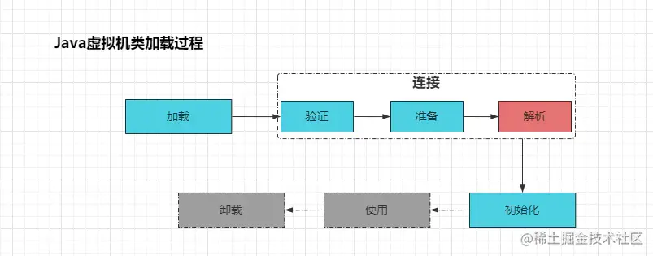
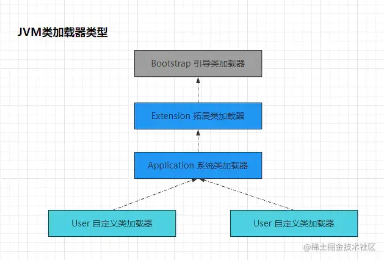
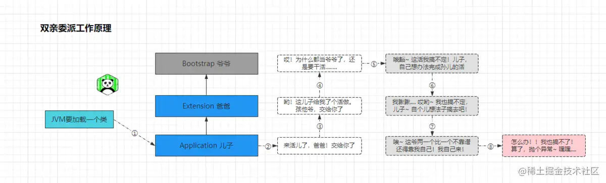
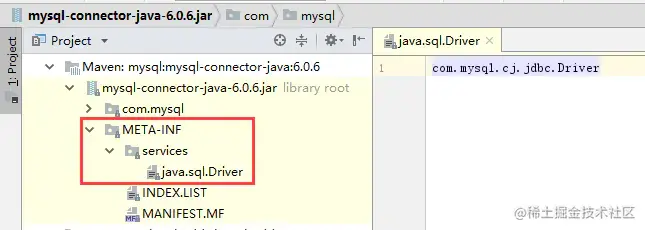

## 一、初窥类加载机制及加载过程详解

每个编写出的`.java`文件都存储着需执行的程序逻辑，经过Java编译器编译后，会为每个`.java`文件生成对应的`.class`字节码文件，`.class`文件中则记录着Java代码转换之后的虚拟机指令，每个`.class`文件开头都有特定的标识、魔数版本等信息。

当JVM需要用到某个类时，虚拟机会加载它的`.class`文件，加载了相关的字节码信息后，会为它创建对应的`Class`对象，而这个过程就被称为类加载。但需额外注意的是：类加载机制只负责`class`文件的加载，至于是否可以执行，则是由执行引擎决定。接着先看看类加载的过程。如下：
 
 如上图，类加载过程被分为三个步骤，五个阶段，分别为加载、验证、准备、解析以及初始化。加载、验证、准备、初始化这四个阶段的顺序是确定的。但解析阶段不一定，为了支持Java语言的运行时绑定特性，在某些情况下可以在初始化阶段之后再开始（也称为动态绑定或晚期绑定）。

#### 1.1、加载步骤

加载阶段是指通过完全限定名查找Class文件二进制数据并将其加载进内存的过程。大体流程会分为三步：

- ①通过完全限定名查找定位`.class`文件，并获取其二进制字节流数据
- ②把字节流所代表的静态存储结构转换为运行时数据结构
- ③在堆中间中为其创建一个`Class`对象，作为程序访问这些数据的入口

#### 1.2、连接步骤

连接步骤包含了验证、准备、解析三个阶段。这三个阶段中，前两个执行顺序是确定的，但解析阶段不一定，可能会发生在初始化之后。

##### 1.2.1、验证阶段

验证阶段主要用于确保被加载的`Class`正确性，检测`Class`字节流中的数据是否符合虚拟机的要求，确保不会危害虚拟机自身安全。验证阶段主要包括四种验证：文件格式验证、元数据验证、字节码验证以及符号引用验证。

- ①文件格式验证：验证字节流是否符合

  ```
  Class
  ```

  文件格式的规范

  - `CA/FE/BA/BE`魔数验证
  - 主次版本号验证
  - 常量池中常量类型是否存在不被支持的类型验证
  - 指向常量池中的索引是否有指定不存在或不符合类型的常量

- ②元数据验证：对字节码描述的信息进行语义分析，以保证其描述的信息符合Java语言规范的要求

  - 类是否有父类，除了`Object`之外，所有的类都应该有父类
  - 类的父类是否继承了不允许被继承的类（被`final`修饰的类）
  - 如果这个类不是抽象类，是否实现了其父类或接口中要求实现的所有方法
  - 类的字段/方法是否与父类的存在冲突。例如方法参数都一样，返回值却不同

- ③字节码验证：通过数据流和控制流分析，确定程序语义合法且符合逻辑

  - 对类的方法体进行校验分析，保证在运行时不会做出危害虚拟机的行为
  - 保证任意时刻操作数栈的数据类型与指令代码序列都能配合工作，不会出现类似于在操作数栈放了一个`int`类型的数据，读取时却按照`long`类型加载到本地变量表中的情况
  - 保障任何跳转指令都不会跳转到方法体之外的字节码指令上

- ④符号引用验证：确保后续的解析动作能正确执行

  - 通过字符串描述的全限定名是否能找到对应的类
  - 符号引用中的类、字段、方法的可访问性是否可被当前类访问

##### 1.2.2、准备阶段

准备阶段主要是为类中声明的静态变量分配内存空间，并将其初始化成默认值（零值）。不过值得注意的是：这个默认值并非指在Java代码中显式赋予的值，而是指数据类型的默认值。如`static int i = 5;`这里只会将`i`初始化为0。

在这里进行的内存分配仅包括类成员(`static`成员)，而实例成员则会在创建具体的Java对象时被一起分配在堆空间中。同时也不包含使用`final`修饰的`static`成员，因为`final`在编译的时候就会分配了，准备阶段会显示初始化。

##### 1.2.3、解析阶段

解析阶段主要是把类中对常量池内的符号引用转换为直接引用的过程。值得一提的是，解析操作往往会伴随着JVM在执行完初始化之后再执行

符号引用：用一组符号来描述引用的目标，符号引用的字面量形式明确定义在《Java虚拟机规范》的Class文件格式中
 直接引用：直接指向目标的指针、相对偏移量或一个间接定位到目标的句柄

而符号引用转直接引用的过程，主要针对类或接口、字段、类方法、接口方法、方法类型、方法句柄和调用点限定符等7类符号引用进行（分别对应常量池中的`CONSTANT_Class_info、CONSTANT_Fieldref_info、CONSTANT_Methodref_info`等）。

#### 1.3、初始化步骤

初始化步骤中，主要是对类的静态变量赋予正确的初始值，也就是在声明静态变量时指定的初始化值以及静态代码块中的赋值。本质上就是执行类构造器方法`<clinit>()`的过程。而触发初始化的情况分为六种，如下：

- ①遇到

  ```
  new/getstatic/putstatic/invokestatic
  ```

  这四条字节码指令时触发

  - `new`：使用new关键字创建一个实例对象
  - `getstatic`：读取一个静态字段
  - `putstatic`：设置一个静态字段
  - `invokestatic`：调用一个静态方法

- ②对类型进行反射调用，如果类型没有经过初始化，则会触发初始化

- ③初始化一个类的时候，发现父类没有初始化，则先触发父类初始化

- ④虚拟机启动时，需指定一个要执行的主类（包含main方法的那个类），虚拟机会初始化这个主类（如SpringBoot的启动类）

- ⑤当使用JDK7中新加入的动态语言支持时，如果一个`java.lang.invoke.MethodHandler`实例最后的解析结果为`REF_getStatic,REF_putStatic,REF_invokeStatic，REF_newInvokeSpecial`四种类型的方法句柄，并且这个方法对应的类没有进行初始化，则先触发其初始化

- ⑥当一个接口中定了JDK8新加入的默认方法时，如果这个接口的实现类发生了初始化，要先将接口进行初始化

在初始化阶段中，有且只有这六种情况会触发类的初始化，这些情况被称为主动引用。除了以上几种情况外，其他使用类的方式被看做是对类的被动引用，不会导致类的初始化。比如在子类中调用父类的静态字段、定义该类的数组方式引用、调用该类的常量等情况都不会触发类进行初始化。

同时，一个类被触发初始化时，在它进行初始化的时候，大体步骤如下：

- 如果类还未被加载、连接则先进行加载、连接步骤
- 如果当前类存在直接父类未被初始化，则先初始化直接父类
- 构造器方法中指令按照语句在源文中出现的顺序执行

如果大家对于类初始化特别感兴趣，也可以自己通过案例来模拟出各种主动引用以及被动引用的情况观察。

#### 1.4、使用、卸载

当一个类完整的经过了类加载过程之后，在内存中已经生成了Class对象，同时在Java程序中已经通过它开始创建实例对象使用时，该阶段被称为使用阶段。

而当一个Class对象不再被任何一处位置引用，即不可触及时，Class就会结束生命周期，该类加载的数据也会被卸载。但是注意：

> Java虚拟机自带的类加载器加载的类，在虚拟机的生命周期中始终不会被卸载，因为JVM始终会保持与这些类加载器的引用，而这些类加载器也会始终保持着自己加载的Class对象的引用，所以对于虚拟机而言，这些Class对象始终是可以被触及的。不过由用户自定义的类加载器加载的类是可以被卸载的。

## 二、JVM的类加载器(ClassLoader)分析

类加载器的任务是，根据一个类的全限定名读取它的二进制字节流数据后，将其加载到内存中并转换为一个与该类对应的Class对象。而虚拟机提供了三种类加载器，同时也可以自己实现，如下：
 

#### 2.1、Bootstrap 引导类加载器

引导类加载器在有些地方也被称为启动类加载器或根类加载器，但其实都是一个意思，都是在指`BootstrapClassLoader`。引导类加载器是使用C++语言实现的，是JVM自身的一部分，主要负责将`<JAVA_HOME>\lib`路径下的核心类库或`-Xbootclasspath`参数指定的路径下的jar包加载到内存中。

> 注意：因为JVM是通过全限定名加载类库的，所以，如果你的文件名不被虚拟机识别，就算你把jar包丢入到lib目录下，引导类加载器也并不会加载它。出于安全考虑，Bootstrap启动类加载器只加载包名为java、javax、sun等开头的类文件。

引导类加载器只为JVM提供加载服务，开发者不能直接使用它来加载自己的类。

#### 2.2、Extension 拓展类加载器

这个类加载器是由sun公司实现的，位于`HotSpot`源码目录中的`sun.misc.Launcher$ExtClassLoader`位置。它主要负责加载`<JAVA_HOME>\lib\ext`目录下或者由系统变量`-Djava.ext.dir`指定位路径中的类库。它可以直接被开发者使用。

#### 2.3、Application 系统类加载器

也被称为应用程序类加载器，也是由sun公司实现的，位于`HotSpot`源码目录中的`sun.misc.Launcher$AppClassLoader`位置。它负责加载系统类路径`java -classpath`或`-D java.class.path`指定路径下的类库，也就是经常用到的`classpath`路径。应用程序类加载器也可以直接被开发者使用。

> 一般情况下，该类加载器是程序的默认类加载器，我们可以通过ClassLoader.getSystemClassLoader()方法可以直接获取到它。

#### 2.4、User 自定义类加载器

在Java程序中，运行时一般都是通过如上三种类加载器相互配合执行的，当然，如果有特殊的加载需求也可以自定义类加载器，通过继承`ClassLoader`类实现（稍后分析）。

#### 2.5、四种类加载器之间的关系

如上分析的类加载器关系链如下：

> `Bootstrap`引导类加载器 → `Extension`拓展类加载器 → `Application`系统类加载器 → `User`自定义类加载器

`Bootstrap`类加载器是在JVM启动时初始化的，它会负责加载`ExtClassLoader`，并将其父加载器设置为`BootstrapClassLoader`。`BootstrapClassLoader`加载完`ExtClassLoader`后会接着加载`AppClassLoader`系统类加载器，并将其父加载器设置为`ExtClassLoader`拓展类加载器。而自己定义的类加载器会由系统类加载器加载，加载完成后，`AppClassLoader`会成为它们的父加载器。

> 但值得注意的是：类加载器之间并不存在相互继承或包含关系，从上至下仅存在父加载器的层级引用关系。

下面我们通过Java代码来简单剖析一下类加载器之间的关系，案例如下：

```java
java复制代码// 自定义类加载器
public class ClassLoaderDemo extends ClassLoader {
    public static void main(String[] args){
        ClassLoaderDemo classLoader = new ClassLoaderDemo();

        System.out.println("自定义加载器：" +
                classLoader);
        System.out.println("自定义加载器的父类加载器：" +
                classLoader.getParent());
        System.out.println("Java程序系统默认的加载器：" +
                ClassLoader.getSystemClassLoader());
        System.out.println("系统类加载器的父加载器：" +
                ClassLoader.getSystemClassLoader().getParent());
        System.out.println("拓展类加载器的父加载器："
                + ClassLoader.getSystemClassLoader().getParent().getParent());
    }
}
```

输出结果如下：

```java
java复制代码自定义加载器：com.sixstarServiceOrder.ClassLoaderDemo@6d5380c2
自定义加载器的父类加载器：sun.misc.Launcher$AppClassLoader@18b4aac2
Java程序系统默认的加载器：sun.misc.Launcher$AppClassLoader@18b4aac2
系统类加载器的父加载器：sun.misc.Launcher$ExtClassLoader@45ff54e6
拓展类加载器的父加载器：null
```

因为`BootstrapClassLoader`是由C++实现的，所以在获取`ExtClassLoader`的父类加载器时，获取到的结果为null。

#### 2.6、类加载器小结

JVM的类加载机制是按需加载的模式运行的，也就是代表着：所有类并不会在程序启动时全部加载，而是当需要用到某个类发现它未加载时，才会去触发加载的过程。

Java中的类加载器会被组织成存在父子级关系的层级结构。同时，类加载器之间也存在代理模式，当一个类需要被加载时，首先会依次根据层级结构检查自己父加载器是否对这个类进行了加载，如果父层已经装载了则可以直接使用，反之，如果未被装载则依次从上至下询问，是否在可加载范围，是否允许被当前层级的加载器加载，如果可以则加载。

每个类加载器都拥有一个自己的命名空间，命名空间的作用是用于存储被自身加载过的所有类的全限定名(`Fully Qualified Class Name`) ，子类加载器查找父类加载器是否加载过一个类时，就是通过类的权限定名在父类的命名空间中进行匹配。而Java虚拟机判断两个类是否相同的基准就是通过`ClassLoaderId + PackageName + ClassName`进行判断，也就代表着，Java程序运行过程中，是允许存在两个包名和类名完全一致的`class`的，只需要使用不同的类加载器加载即可，这也就是Java类加载器存在的隔离性问题，而Java为了解决这个问题，JVM引入了双亲委派机制(稍后分析）。

刚刚提到过，子类加载器可以检查父类加载器中加载的类，但这个是不可逆的，也就代表着父类加载器是不可以查找子类加载器加载的类，存在可见性限制。同时，被`Bootstrap、Ext、APP`三个类加载器加载的类是不可以被卸载的（前面分析过），但可以删除当前的类装载器，然后创建一个新的类装载器装载。

> 篇外：其实当Java在加载类时，会分为显式加载和隐式加载两种，显式加载指的是开发者手动通过调用`ClassLoader`加载一个类，比如`Class.forName(name)`或`obj.getClass().getClassLoader().loadClass()`方式加载`class`对象。而隐式加载则是指不会在程序中明确的指定加载某个类，属于被动式加载，比如在加载某个类时，该类中引用了另外一个类的对象时，JVM就会去自动加载另外一个类，而这种被动加载方式就被称为“隐式加载”。

## 三、类加载子系统中的双亲委派机制

前面提到过，为了解决类加载器的隔离性问题，JVM引入了双亲委派机制(1.2的时候引入的)，而双亲委派的核心思想在于两点：

- ①自下向上检查类是否已经被加载
- ②从上至下尝试加载类

下面来简单感受一下双亲委派机制的加载过程。

#### 3.1、双亲委派类加载过程

- ①当`App`尝试加载一个类时，它不会直接尝试加载这个类，首先会在自己的命名空间中查询是否已经加载过这个类，如果没有会先将这个类加载请求委派给父类加载器`Ext`完成
- ②当`Ext`尝试加载一个类时，它也不会直接尝试加载这个类，也会在自己的命名空间中查询是否已经加载过这个类，没有的话也会先将这个类加载请求委派给父类加载器`Bootstrap`完成
- ③如果`Bootstrap`加载失败，也就是代表着：这个需要被加载的类不在`Bootstrap`的加载范围内，那么`Bootstrap`会重新将这个类加载请求交由子类加载器`Ext`完成
- ④如果`Ext`加载失败，代表着这个类也不在`Ext`的加载范围内，最后会重新将这个类加载请求交给子类加载器`App`完成
- ⑤如果`App`加载器也加载失败，就代表这个类根据全限定名无法查找到，则会抛出`ClassNotFoundException`异常

#### 3.2、双亲委派机制的优势

从上述的过程中可以很直观的感受到：当JVM尝试加载一个类时，通常最底层的类加载器接收到了类加载请求之后，会先交由自己的上层类加载器完成，如下：
 
 OK~，那采用这种模式优势在哪儿呢？

> 采用双亲委派模式的好处在于：Java类随着它的类加载器存在了一种优先级的层次关系，这样做的优势在于，可以避免一个类在不同层级的类加载器中重复加载，如果父类加载器已经加载过该类了，那么就不需要子类加载器再加载一次。其次，也可以保障Java核心类的安全性问题，比如通过网络传输过来一个`java.lang.String`类，需要被加载时，通过这种双亲委派的方式，最终找到`Bootstrap`加载器后，发现该类已经被加载，从而就不会再加载传输过来的`java.lang.String`类，而是直接返回`Bootstrap`加载的`String.class`。这样可以有效防止Java的核心API类在运行时被篡改，从而保证所有子类共享同一基础类，减少性能开销和安全隐患问题。

#### 3.3、Java中双亲委派的实现原理

前面大致的探讨了Java的类加载机制以及双亲委派机制，接着再从代码层面了解一下Java中双亲委派模式的实现以及Java中定义的一些类加载器。

在Java中，所有的类加载器都间接的继承自`ClassLoader`类，包括`Ext、App`类加载器（`Bootstrap`除外，因为它是C++实现的），如下：

```java
java复制代码// sun.misc.Launcher类
public class Launcher {
    // sun.misc.Launcher类 → 构造器
    public Launcher(){
        Launcher.ExtClassLoader var1;
        try {
            // 会先初始化Ext类加载器并创建ExtClassLoader
            var1 = Launcher.ExtClassLoader.getExtClassLoader();
        } catch (IOException var10) {
            throw new InternalError(
                "Could not create extension class loader", var10);
        }
        try {
	        // 再创建AppClassLoader并把Ext作为父加载器传递给App
            loader = AppClassLoader.getAppClassLoader(extcl);
        } catch (IOException e) {
            throw new InternalError(
                "Could not create application class loader");
        }
        
        // 将APP类加载器设置为线程上下文类加载器（稍后分析）
        Thread.currentThread().setContextClassLoader(loader);
        // 省略......
    }
    
    // sun.misc.Launcher类 → ExtClassLoader内部类
    static class ExtClassLoader extends URLClassLoader {
        // ExtClassLoader内部类 → 构造器
        public ExtClassLoader(File[] var1) throws IOException {
            // 在Ext初始化时，父类构造器会被设置为null
            super(getExtURLs(var1), (ClassLoader)null, Launcher.factory);
            SharedSecrets.getJavaNetAccess().getURLClassPath(this)
                         .initLookupCache(this);
        }
    }
    
    // sun.misc.Launcher类 → AppClassLoader内部类
    static class AppClassLoader extends URLClassLoader {}
}

// java.net.URLClassLoader类
public class URLClassLoader extends SecureClassLoader
        implements Closeable {}

// java.security.SecureClassLoader类
public class SecureClassLoader extends ClassLoader {}
```

如上源码，`Ext、App`类加载器都是`sun.misc.Launcher`类的内部类，而`Launcher`在初始化时会首先创建`Ext`类加载器，而在初始化`Ext`时，它的构造器中会强行将其父类加载器设置为`null`。创建完成`Ext`类加载器之后，会紧接着再创建`App`类加载器，同时在创建`AppClassLoader`的时候会将`Ext`类加载器设置为`App`类加载器的父类加载器。

`Ext、App`类加载器都继承了`URLClassLoader`类，该类主要是用于读取各种`jar`包、本地`class`以及网络传递的`class`文件，通过找到它们的字节码，然后再将其读取成字节流，最后通过`defineClass()`方法创建类的Class对象。而`URLClassLoader`类继承了`SecureClassLoader`类，该类也作为了`ClassLoader`类的拓展类，新增了几个对代码源的位置及其证书的验证以及权限定义类验证(主要指对`class`源码的访问权限)的方法，一般我们不会直接跟这个类打交道，更多是与它的子类`URLClassLoader`有所关联。

总而言之，`Ext、App`类加载器都间接的继承了`ClassLoader`类，`ClassLoader`类作为Java类加载机制的顶层设计类，它是一个抽象类，下面来简单的看看`ClassLoader`，如下：

```java
java复制代码// ClassLoader类 → loadClass()方法
protected Class<?> loadClass(String name, boolean resolve)
    throws ClassNotFoundException
{
    // 加锁
    synchronized (getClassLoadingLock(name)) {
        // 先尝试通过全限定名从自己的命名空间中查找该Class对象
        Class<?> c = findLoadedClass(name);
        // 如果找到了则不需要加载了，如果==null，开始类加载
        if (c == null) {
            long t0 = System.nanoTime();
            try {
                // 先将类加载任务委托自己的父类加载器完成
                if (parent != null) {
                    c = parent.loadClass(name, false);
                } else {
                    // 如果父类加载器为null，代表当前已经是ext加载器了
                    // 那么则将任务委托给Bootstrap加载器加载
                    c = findBootstrapClassOrNull(name);
                }
            } catch (ClassNotFoundException e) {
                // 处理异常，抛出异常
            }

            if (c == null) {
                // 如果都没有找到，则通过自定义实现的findClass
                // 去查找并加载
                long t1 = System.nanoTime();
                c = findClass(name);

                // 这是记录类加载相关数据的（比如耗时、类加载数量等）
                sun.misc.PerfCounter.getParentDelegationTime().addTime(t1 - t0);
                sun.misc.PerfCounter.getFindClassTime().addElapsedTimeFrom(t1);
                sun.misc.PerfCounter.getFindClasses().increment();
            }
        }
        // 是否需要在加载时进行解析，如果是则触发解析操作
        if (resolve) {
            resolveClass(c);
        }
        // 返回加载后生成的Class对象
        return c;
    }
}

// ClassLoader类 → findClass()方法
protected Class<?> findClass(String name) 
            throws ClassNotFoundException {
    // 直接抛出异常(这个方法是留给子类重写的)
    throw new ClassNotFoundException(name);
}

// ClassLoader类 → defineClass()方法
protected final Class<?> defineClass(String name, byte[] b,
        int off, int len) throws ClassFormatError
{
    // 调用了defineClass方法，
    // 将字节数组b的内容转换为一个Java类
    return defineClass(name, b, off, len, null);
}

// ClassLoader类 → resolveClass()方法
protected final void resolveClass(Class<?> c) {
    // 调用本地(navite)方法，解析一个类
    resolveClass0(c);
}

// ClassLoader类 → getParent()方法
@CallerSensitive
public final ClassLoader getParent() {
    // 如果当前类加载器的父类加载器为空，则直接返回null
    if (parent == null)
        return null;
    // 如果不为空则先获取安全管理器
    SecurityManager sm = System.getSecurityManager();
    if (sm != null) {
        // 然后检查权限后返回当前classLoader的父类加载器
        checkClassLoaderPermission(parent,
                Reflection.getCallerClass());
    }
    return parent;
}
```

上述简单的罗列了一些`ClassLoader`类的关键方法，具体作用如下：

- `loadClass(name,resolve)`：加载名称为`name`的类，加载后返回`Class`对象实例
- `findClass(name)`：查找名称为`name`的类，返回是一个`Class`对象实例（该方法是留给子类重写覆盖的，在`loadClass`中，在父类加载器加载失败的情况下会调用该方法完成类加载，这样可以保证自定义的类加载器也符合双亲委托模式）
- `defineClass(name,b,off,len)`：将字节流`b`转换为一个`Class`对象
- `resolveClass(c)`：使用该方法可以对加载完生成的`Class`对象同时进行解析操作
- `getParent()`：获取当前类加载器的父类加载器

OK，简单的看了一下Java中类加载器之间的关系之后，怎么去分析双亲委派的实现呢？其实双亲委派模型的实现逻辑全在于`loadClass()`方法，而`ExtClassLoader`加载器是没有重写`loadClass()`方法，`AppClassLoader`加载器虽然重写了`loadClass()`方法，但其内部最终还是调用父类的`loadClass()`方法，如下：

```java
java复制代码// sun.misc.Launcher类 → AppClassLoader内部类 → loadClass()方法
 public Class loadClass(String name, boolean resolve)
     throws ClassNotFoundException
 {
     int i = name.lastIndexOf('.');
     if (i != -1) {
         SecurityManager sm = System.getSecurityManager();
         if (sm != null) {
             sm.checkPackageAccess(name.substring(0, i));
         }
     }
     // 依旧调用的是父类loadClass()方法
     return (super.loadClass(name, resolve));
 }
```

所以无论是`ExtClassLoader`还是`AppClassLoader`加载器，其本身都未打破`ClassLoader.loadClass()`方法中定义的双亲委派逻辑，`Bootstrap、Ext、App`这些JVM自带的类加载器都默认会遵守双亲委派模型。

## 四、自定义类加载器分析及实战

通过前面的分析不难得知，如果需要自定义类加载器，那么只需要继承`ClassLoader`类即可，但继承`ClassLoader`需要自己重写`findClass()`方法并编写加载逻辑。所以如果一般没有太过复杂的需求，可以直接继承`URLClassLoader`类，可以省略自己编写`findClass`方法以及文件加载转换成字节码流的步骤，使自定义类加载器编写更加简洁。那什么情况下时，我们需要自定义类加载器呢？

- ①当`class`文件不在`classpath`路径下时，需要自定义类加载器加载特定路径下的`class`

- ②当一个

  ```
  class
  ```

  文件是通过网络传输过来的并经过了加密处理，需要首先对

  ```
  class
  ```

  文件做了对应的解密处理后再加载到内存中时，需要自定义类加载器

  - 案例：比如我之前写的一个项目，运维子平台有个需求需要一个编写Java代码的终端，那对于这种情况就需要将运维平台中编写的`class`文件经过网络传输过来，然后对其类进行加载

- ③线上环境不能停机时，要动态更改某块代码，这种情况下需要自定义类加载器

  - 比如：当需要实现热部署功能时(一个class文件通过不同的类加载器产生不同class对象从而实现热部署功能)

#### 4.1、自定义类加载器实战

> 案例：运维子平台有个需求，需要一个编写Java代码的终端，那对于这种情况就需要将运维平台中编写的`class`文件经过加密后，通过网络传输过来，然后对其类的字节码数据进行解密后再加载。源码如下：

```java
java复制代码// 运维终端类加载器
public class OpsClassLoader extends ClassLoader {

    // 接收到的class文件本地的存储位置
    private String rootDirPath;

    // 构造器
    public OpsClassLoader(String rootDirPath) {
        this.rootDirPath = rootDirPath;
    }
    
    // 读取Class字节流并解密的方法
    private byte[] getClassDePass(String className) throws IOException {
        String classpath = rootDirPath + className;

        // 模拟文件读取过程.....
        FileInputStream fis = new FileInputStream(classpath);
        ByteArrayOutputStream baos = new ByteArrayOutputStream();
        int bufferSize = 1024;
        int n = 0;
        byte[] buffer = new byte[bufferSize];
        while ((n = fis.read(buffer)) != -1)
            // 模拟数据解密过程.....
            baos.write(buffer, 0, n);
        byte[] data = baos.toByteArray();

        // 模拟保存解密后的数据....
        return data;
    }

    // 重写了父类的findClass方法
    @SneakyThrows
    @Override
    protected Class<?> findClass(String name) throws ClassNotFoundException {
        // 读取指定的class文件
        byte[] classData = getClassDePass(name);
        // 如果没读取到数据，抛出类不存在的异常
        if (classData == null)
            throw new ClassNotFoundException();
        // 通过调用defineClass方法生成Class对象
        return defineClass(name,classData,0,classData.length);
    }
}
```

在如上源码中，我们通过了`getClassDePass()`方法读取了网络传输过来存储到本地的`class`文件的字节流数据，并对读取到的数据做了对应的解密处理（模拟），然后通过重写了父类的`ClassLoader.findClass()`方法，利用`defineClass()`方法在JVM内存中生成了最终的`Class`对象。

> 当然，如果你想代码更简洁，你也可以通过继承`URLClassLoader`类实现。

#### 4.2、热部署机制原理分析

相信大家对于热部署机制都并不陌生，在热部署机制没有出现时，往往我们稍微更改了一丢丢的Java代码，就需要对整个项目重启之后才可生效。这毫无疑问是非常痛苦的，尤其是早些年用`Eclipse、MyEclipse`编辑器开发的时代，很多时候因为你写完代码没有按`Ctrl+S`保存代码就赶着调试，急匆匆的启动了你的项目，到头来发现没有保存自己的新代码，又需要再次保存后重启项目，这种糟糕的经历大部分资历较老的开发者应该都遇到过。

所以在热部署机制未出现之前，一改就需重启的时代，尤其是一些大项目，启动都需花费几小时，无疑是令人糟心的体验。而热部署机制出现之后，我们可以发现，当我们在Java程序运行过程中，动态的修改了某个类的代码保存后，程序会自动加载更新代码，这是如何实现的呢？在之前的类加载机制中，我们分析得知：全限定名相同的一个类被加载过之后，第二次需要用到该类时，会直接在类加载器的命名空间（可以理解为缓存）中进行查找，而不会二次加载此类，而强制指定同一个类加载器二次加载同一个类时，会抛出异常。所以一般类被加载一次之后，就算某个类的`class`文件发生了改变，JVM也不会再次加载它。

> 而所谓的热部署机制的实现其实比较简单，就是通过利用不同的类加载器，去加载更改后的`class`文件，从而在内存中创建出两个不同的`Class`对象。从而达到类文件更改后可以生效的目的。

## 五、双亲委派破坏者 - 线程上下文类加载器

在Java中，官方为我们提供了很多SPI接口，例如JDBC、JBI、JNDI等。这类SPI接口，官方往往只会定义规范，具体的实现则是由第三方来完成的，比如JDBC，不同的数据库厂商都需自己根据JDBC接口的定义进行实现。

而这些SPI接口直接由Java核心库来提供，一般位于`rt.jar`包中，而第三方实现的具体代码库则一般被放在`classpath`的路径下。而此时问题来了：

> 位于`rt.jar`包中的SPI接口，是由Bootstrap类加载器完成加载的，而`classpath`路径下的SPI实现类，则是`App`类加载器进行加载的。但往往在SPI接口中，会经常调用实现者的代码，所以一般会需要先去加载自己的实现类，但实现类并不在Bootstrap类加载器的加载范围内，而经过前面的双亲委派机制的分析，我们已经得知：子类加载器可以将类加载请求委托给父类加载器进行加载，但这个过程是不可逆的。也就是父类加载器是不能将类加载请求委派给自己的子类加载器进行加载的，所以此时就出现了这个问题：如何加载SPI接口的实现类？答案是打破双亲委派模型。

> SPI（Service Provider Interface）：Java的SPI机制，其实就是可拔插机制。在一个系统中，往往会被分为不同的模块，比如日志模块、JDBC模块等，而每个模块一般都存在多种实现方案，如果在Java的核心库中，直接以硬编码的方式写死实现逻辑，那么如果要更换另一种实现方案，就需要修改核心库代码，这就违反了可拔插机制的原则。为了避免这样的问题出现，就需要一种动态的服务发现机制，可以在程序启动过程中，动态的检测实现者。而SPI中就提供了这么一种机制，专门为某个接口寻找服务实现的机制。如下：
>
> > 当第三方实现者提供了服务接口的一种实现之后，在jar包的META-INF/services/目录里同时创建一个以服务接口命名的文件，该文件就是实现该服务接口的实现类。而当外部程序装配这个模块的时候，就能通过该jar包META-INF/services/里的配置文件找到具体的实现类名，并装载实例化，完成模块的注入。基于这样一个约定就能很好的找到服务接口的实现类，而不需要再代码里制定。同时，JDK官方也提供了一个查找服务实现者的工具类：java.util.ServiceLoader。

线程上下文类加载器就是双亲委派模型的破坏者，可以在执行线程中打破双亲委派机制的加载链关系，从而使得程序可以逆向使用类加载器。
 那线程上下文类加载器又是如何打破双亲委派模型使得程序可以逆向使用类加载器的呢？接下来通过分析JDBC驱动的源码一窥究竟。

#### 5.1、JDBC角度分析线程上下文类加载器

我们先来看看Java中SPI定义的一个核心类：`DriverManager`，该类位于`rt.jar`包中，是Java中用于管理不同数据库厂商实现的驱动，同时这些各厂商实现的`Driver`驱动类，都继承自Java的核心类`java.sql.Driver`，如MySQL的`com.mysql.cj.jdbc.Driver`的驱动类。先看看`DriverManager`的源码，如下：

```java
java复制代码// rt.jar包 → DriverManager类
public class DriverManager {
	// .......
	
	// 静态代码块
    static {
        // 加载并初始化驱动
        loadInitialDrivers();
        println("JDBC DriverManager initialized");
    }

// DriverManager类 → loadInitialDrivers()方法
 private static void loadInitialDrivers() {
    // 先读取系统属性 jdbc.drivers
    String drivers;
    try {
        drivers = AccessController.doPrivileged(new PrivilegedAction<String>() {
            public String run() {
                return System.getProperty("jdbc.drivers");
            }
        });
    } catch (Exception ex) {
        drivers = null;
    }
    
    AccessController.doPrivileged(new PrivilegedAction<Void>() {
        public Void run() {
            //通过ServiceLoader类查找驱动类的文件位置并加载
            ServiceLoader<Driver> loadedDrivers =
            ServiceLoader.load(Driver.class);
            //省略......
        }
    });
    //省略......
}
```

观察如上源码，在`DriverManager`类的静态代码块中调用了`loadInitialDrivers()`方法，该方法中，会通过`ServiceLoader`查找服务接口的实现类。前面分析Java的`SPI`机制时，曾提到过：Java的`SPI`存在一种动态的服务发现机制，在程序启动时，会自动去`jar`包中的`META-INF/services/`目录查找以服务命名的文件，`mysql-connector-java-6.0.6.jar`包文件目录如下：
 
 观察如上工程结构，我们明确可以看到，在MySQL的`jar`包中存在一个`META-INF/services/`目录，而在该目录下，存在一个`java.sql.Driver`文件，该文件中指定了`MySQL`驱动`Driver`类的路径，该类源码如下：

```java
java复制代码// com.mysql.cj.jdbc.Driver类
public class Driver extends NonRegisteringDriver 
                        implements java.sql.Driver {
    public Driver() throws SQLException {
    }
    // 省略.....
}
```

可以看到，该类是实现了Java定义的SPI接口`java.sql.Driver`的，所以在启动时，`SPI`的动态服务发现机制可以发现指定的位置下的驱动类。

> 在MySQL6.0之后的jar包中，遗弃了之前的com.mysql.jdbc.Driver驱动，而是使用com.mysql.cj.jdbc.Driver取而代之，因为后者不需要再自己通过`Class.forName("com.mysql.jdbc.Driver")`这种方式手动注册驱动，全部都可以交由给SPI机制处理。

最终来看看SPI机制是如何加载对应实现类的，`ServiceLoader.load()`源码如下：

```java
java复制代码// ServiceLoader类 → load()方法
public static <S> ServiceLoader<S> load(Class<S> service) {
    // 获取线程上下文类加载器
    ClassLoader cl = Thread.currentThread().getContextClassLoader();
    // 使用线程上下文类加载器对驱动类进行加载
    return ServiceLoader.load(service, cl);
}
```

通过如上源码可以清晰的看见：最终是通过`Thread.currentThread().getContextClassLoader()`获取的当前执行线程的线程上下文类加载器对SPI接口的实现类进行了加载。OK~，在前面我们分析Java中的双亲委派实现时，曾提到了`Ext、App`类加载器都是`Launcher`类的内部类，`Ext、App`类加载器的初始化操作都是在`Launcher`的构造函数中完成的，同时，在该构造函数中，`Ext、App`初始化完成后，会执行下面这句代码：

> ```
> Thread.currentThread().setContextClassLoader(loader);
> ```

通过如上这句代码，在`Launcher`的构造函数中，会将已经创建好的`AppClassLoader`系统类加载器设置为默认的线程上下文类加载器。

分析到了这个地方后，可能有部分小伙伴会有些绕，我们稍微梳理一下总体流程：

> Java程序启动 → JVM初始化C++编写的`Bootstrap`启动类加载器 → `Bootstrap`加载Java核心类(核心类中包含`Launcher`类) → `Bootstrap`加载`Launcher`类，其中触发`Launcher`构造函数 → `Bootstrap`执行`Launcher`构造函数的逻辑 → `Bootstrap`初始化并创建`Ext、App`类加载器  → `Launcher`类的构造函数中将`Ext`设置为`App`的父类加载器 → 同时再将`App`设置为默认的线程上下文类加载器 → `Bootstrap`继续加载其他Java核心类（如：SPI接口） → SPI接口中调用了第三方实现类的方法 → `Bootstrap`尝试去加载第三方实现类，发现不在自己的加载范围内，无法加载 → 依赖于SPI的动态服务发现机制，这些实现类会被交由线程上下文类加载器进行加载（在前面讲过，线程上下文加载器在`Launcher`构造函数被设置为了`App`类加载器） → 通过`App`系统类加载器加载第三方实现类，发现这些实现类在`App`的加载范围内，可以被加载，SPI接口的实现类加载完成.....

加载流程如上，很明显的就可以感觉出来，线程上下文类加载器介入后，轻而易举的打破了原有的双亲委派模型，同时，也正是因为线程上下文类加载器的出现，从而使得Java的类加载器机制更加灵活，方便。

#### 5.2、线程上下文类加载器与SPI机制总结

简单来说，Java提供了很多核心接口的定义，这些接口被称为SPI接口，同时为了方便加载第三方的实现类，SPI提供了一种动态的服务发现机制（约定），只要第三方在编写实现类时，在工程内新建一个`META-INF/services/`目录并在该目录下创建一个与服务接口名称同名的文件，那么在程序启动的时候，就会根据约定去找到所有符合规范的实现类，然后交给线程上下文类加载器进行加载处理。