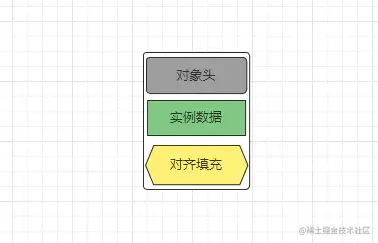
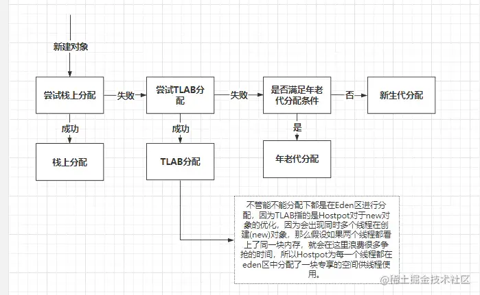
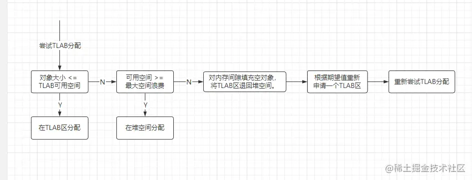
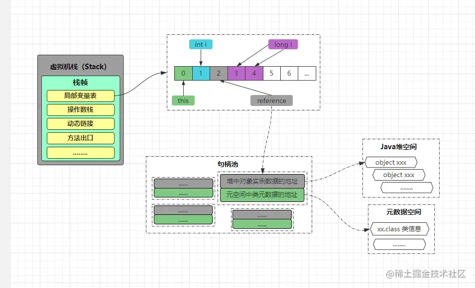

## 一、Java对象在内存中的布局

Java源代码中，使用`new`关键字创建出的对象实例，我们都知道在运行时会被分配到内存上存储，但分配的时候是直接在内存中“挖”一个对应大小的坑，然后把对象实例丢进去存储吗？其实并不然，Java对象一般在内存中的布局通常由对象头、实例数据、对齐填充三部分组成，如下：
 

> 在HotSpot虚拟机源码的`hotspot/src/share/vm/oops/`目录下，`instanceOop、instanceKlass、oop`几个C++的文件描述了对象的定义（有兴趣的小伙伴可以自行去研究，在[开篇](https://juejin.cn/post/7057537968923213837)中提供了HotSpot源码）。

### 1.1、对象头(Object Header)

Java对象头其实是一个比较复杂的东西，它通常也会由多部分组成，其中包含了`MarkWord`和类型指针（`ClassMetadataAddress/KlassWord`），如果是数组对象，还会存在数组长度。如下：
 

下面我们重点分析对象头的构成，JVM采取2个字宽/字长存储对象头，如果对象是数组，额外需要存储数组长度，所以数组对象在32位虚拟机中采取3个字宽存储对象头。而64位虚拟机采取两个半字宽+半字宽对齐数据存储对象头，而在32位虚拟机中一个字宽的大小为4byte，64位虚拟机下一个字宽大小为8byte，64位开启指针压缩(`-XX:+UseCompressedOops`)的情况下，MarkWord为8byte，KlassWord为4byte。

而关于这块的内容很多资料都含糊不清，几乎都是基于32位虚拟机而言的，那么我在这里分别列出32位/64位的对象头信息，对象头结构及存储大小说明如下：

| 虚拟机位数 | 对象头结构信息                 | 说明                                                         | 大小        |
| ---------- | ------------------------------ | ------------------------------------------------------------ | ----------- |
| 32位       | MarkWord                       | HashCode、分代年龄、是否偏向锁和锁标记位                     | 4byte/32bit |
| 32位       | ClassMetadataAddress/KlassWord | 类型指针指向对象的类元数据，JVM通过这个指针确定该对象是哪个类的实例 | 4byte/32bit |
| 32位       | ArrayLenght                    | 如果是数组对象存储数组长度，非数组对象不存在                 | 4byte/32bit |

| 虚拟机位数 | 对象头结构信息                 | 说明                                                         | 大小        |                                   |
| ---------- | ------------------------------ | ------------------------------------------------------------ | ----------- | --------------------------------- |
| 64位       | MarkWord                       | unused、HashCode、分代年龄、是否偏向锁和锁标记位             | 8byte/64bit |                                   |
| 64位       | ClassMetadataAddress/KlassWord | 类型指针指向对象的类元数据，JVM通过这个指针确定该对象是哪个类的实例 | 8byte/64bit | 开启指针压缩的情况下为4byte/32bit |
| 64位       | ArrayLenght                    | 如果是数组对象存储数组长度，非数组对象不存在                 | 4byte/32bit |                                   |

其中32位的JVM中对象头内MarkWord在默认情况下存储着对象的HashCode、分代年龄、是否偏向锁、锁标记位等信息，而64位JVM中对象头内MarkWord的默认信息存储着HashCode、分代年龄、是否偏向锁、锁标记位、unused，如下：

| 机位数 | 锁状态         | 哈希码 | 分代年龄 | 是否偏向锁 | 锁标志信息 |
| ------ | -------------- | ------ | -------- | ---------- | ---------- |
| 32位   | 无锁态（默认） | 25bit  | 4bit     | 1bit       | 2bit       |

| 位数 | 锁状态         | 哈希码 | 分代年龄 | 是否偏向锁 | 锁标志信息 | unused |
| ---- | -------------- | ------ | -------- | ---------- | ---------- | ------ |
| 64位 | 无锁态（默认） | 31bit  | 4bit     | 1bit       | 2bit       | 26bit  |

由于对象头的信息是与对象自身定义的成员属性数据没有关系的额外存储成本，因此考虑到JVM的空间效率，MarkWord被设计成为一个非固定的数据结构，以便可以复用方便存储更多有效的数据，它会根据对象本身的状态复用自己的存储空间，除了上述列出的MarkWord默认存储结构外，还有如下可能变化的结构：
 

**markword信息：**

- `unused`：未使用的区域。
- `identity_hashcode`：对象最原始的哈希值，就算重写`hashcode()`也不会改变。
- `age`：对象年龄。
- `biased_lock`：是否偏向锁。
- `lock`：锁标记位。
- `ThreadID`：持有锁资源的线程ID。
- `epoch`：偏向锁时间戳。
- `ptr_to_lock_record`：指向线程栈中`lock_record`的指针。
- `ptr_to_heavyweight_monitor`：指向堆中`monitor`对象的指针。

> LockRecord：LockRecord存在于线程栈中,翻译过来就是锁记录,它会拷贝一份对象头中的markword信息到自己的线程栈中去,这个拷贝的markword称为Displaced Mark Word ,另外还有一个指针指向对象。
>  关于MrakWord这块区域更多是提供给`Synchronized`锁使用，如果对这块感兴趣的可以看之前的文章：[深入理解Java并发编程之Synchronized关键字实现原理剖析](https://juejin.cn/post/6977744582725681182)，里面详细谈到了对象在运行过程中，锁膨胀/锁升级时这块区域的变化。

简单总结一下，对象头主要由`MarkWord、KlassWord`和有可能存在的数组长度三部分组成。MarkWord主要是用于存储对象的信息以及锁信息，KlassWord则是存储指向元空间中类元数据的指针，当然，如果当前对象是数组，那么也会在对象头中存储当前数组的长度。

### 1.2、实例数据(Instance Data)

实例数据是指一个聚合量所有标量的总和，也就是是指当前对象属性成员数据以及父类属性成员数据。举个例子：

```java
java复制代码public class A{
    int ia = 0;
    int ib = 1;
    long l = 8L;
    
    public static void main(String[] args){
        A a = new A();
    }
}
```

上述案例中，`A`类存在三个属性`ia、ib、l`，其中两个为`int`类型，一个`long`类型，那么此时对象`a`的实例数据大小则为`4 + 4 + 8 = 16byte(字节)`。

那此时再给这个案例加点料试试看，如下：

```java
java复制代码public class A{
    int ia = 0;
    int ib = 1;
    long l = 8L;
    B b = new B();
    
    public static void main(String[] args){
        A a = new A();
    }
    
    public static class B{
        Object obj = new Object();   
    }
}
```

此时对象`a`的实例数据大小又该如何计算呢？需要把`B`类的成员数据也计算进去嘛？实则不需要的，如果当类的一个成员属于引用类型，那么是直接存储指针的，而引用指针的大小为一个字宽，也就是在32位的VM中为`32bit`，在64位的VM中为`64bit`大小。所以此时对象`a`的实例数据大小为：`4 + 4 + 8 + 8 = 24byte`（未开启指针压缩的情况下是这个大小，但如果开启了则不为这个大小，稍后详细分析）。

### 1.3、对齐填充(Padding)

对齐填充在一个对象中是可能存在，也有可能不存在的，因为在64bit的虚拟机中，《虚拟机规范》中规定了：为了方便内存的单元读取、寻址、分配，Java对象的总大小必须要为8的整数倍，所以当一个对象的对象头+实例数据大小不为8的整数倍时，此刻就会出现对齐填充部分，将对象大小补齐为8的整数倍。

> 如：一个对象的对象头+实例数据大小总和为28bytes，那么此时就会出现4bytes的对齐填充，JVM为对象补齐成8的整数倍：32bytes。

### 1.4、指针压缩（CompressedOops）

指针压缩属于JVM的一种优化思想，一方面可以节省很大的内存开支，第二方面也可以方便JVM跳跃寻址（稍后分析），在64bit的虚拟机中为了提升内存的利用率，所以出现了指针压缩这一技术，指针压缩的技术会将Java程序中的所有引用指针(类型指针、堆引用指针、栈帧内变量引用指针等)都会压缩一半，而在Java中一个指针的大小是占一个字宽单位的，在64bit的虚拟机中一个字宽的大小为64bit，所以也就意味着在64位的虚拟机中，指针会从原本的64bit压缩为32bit的大小，而指针压缩这一技术在JDK1.7之后是默认开启的。

> 可能有些小伙伴会觉得，一个指针才节省32bit空间，而好像并不能节省多少空间，但如果你这样想就错了，Java程序运行时，其内部最多的不是常量，也不是对象，而是指针，栈帧中的引用指针、对象头的类元指针、堆中的引用指针....，指针是JVM中运行时数量最多的东西，所以当每个指针能够被压缩一半时，从程序整体而言，能够为程序节省非常大的空间。

指针压缩失效：指针压缩带来的好处是无可厚非，几乎能够为Java程序节省很大的内存空间，一般而言，如果不开启压缩的情况下对象内存需要14GB，在开启指针压缩之后几乎能够在10GB内存内分配下这些对象。但是压缩技术带来好处的同时，也存在非常大的弊端，因为指针通过压缩技术后被压缩到32bit，而Java中32bit的指针最大寻址为32GB，也就代表着如果你的堆内存为32G时出现了OOM问题，你此时将内存扩充到48GB时仍有可能会出现OOM，因为内存超出32GB后，32bit的指针无法寻址，所有压缩的指针将会失效，发生指针膨胀，所有指针将会从压缩后的32Bit大小回到压缩前的64Bit大小。

> 有些小伙到这里又会疑惑了，32bit的指针不是最大才支持4GB9（2的32次方）内存嘛？为什么Java中32bit的指针支持寻址32GB呢？其实这跟前面所说的对齐填充存在巨大的联系。在前面提到过，64位的虚拟机中，对象大小必须要为8的整数倍，如果当一个对象总大小不足8的整数倍时会出现对齐填充补齐。
>  从这个结论可以得知：当内存`byte`为第二位时绝对不可能是一个对象的开始，只有当内存位置为8的整数倍才有可能是对象的开始位置，所以可以按`8byte`为一个位置来寻址，4GB的位置可以被当作`4*8=32GB`，最终可以寻址32GB。举个例子带大家理解：
>  一个人只能走4步，普通人一步一米，所以这个人最多只能走4米，但是有另外一个人，一步能够走8米，所以这个人能最多走32米。

而在JVM中开启指针压缩后，对于对象位置的寻址计算存在三种方式，如下：

- ①如果堆的高位地址小于

  ```
  32GB
  ```

  ，说明不需要基址

  ```
  base
  ```

  就能定位堆中任意对象，这种模式被称为

  ```
  Zero-based Compressed Oops Mode
  ```

  ，计算公式如下：

  - 计算公式：add=0+offset∗8add = 0 + offset * 8 add=0+offset∗8
  - 计算前提：highheap<32GBhigh_{heap} < 32GBhighheap<32GB

- ②如果堆高位大于等于

  ```
  32GB
  ```

  ，说明需要

  ```
  base
  ```

  基地址，这时如果堆空间小于

  ```
  4GB
  ```

  ，说明基址+偏移能定位堆中任意对象，如下：

  - 计算公式：add=base+offsetadd = base + offset add=base+offset
  - 计算前提：sizeheap<4GBsize_{heap} < 4GBsizeheap<4GB

- ③如果堆空间大小处于

  ```
  4GB
  ```

  与

  ```
  32GB
  ```

  之间，这时只能通过基址+偏移x缩放

  ```
  scale
  ```

  （Java中缩放为8），才能定位堆中任意对象，如下：

  - 计算公式：add=base+offset∗8add = base + offset * 8 add=base+offset∗8
  - 计算前提：4GB<=sizeheap<32GB4GB <= size_{heap} < 32GB4GB<=sizeheap<32GB

### 1.5、JOL对象大小计算实战

为了方便观察到对象的内存布局，首先导入一个`OpenJDK`组织提供的工具：`JOL`，`maven`依赖如下：

```xml
xml复制代码<!-- https://mvnrepository.com/artifact/org.openjdk.jol/jol-core -->
<dependency>
    <groupId>org.openjdk.jol</groupId>
    <artifactId>jol-core</artifactId>
    <version>0.9</version>
</dependency>
```

在该工具中提供了两个API：

- `GraphLayout.parseInstance(obj).toPrintable()`：查看对象外部信息：包括引用的对象
- `GraphLayout.parseInstance(obj).totalSize()`：查看对象占用空间总大小

##### 先上一个面试题，在Java中创建一个`Object`对象会占用多少内存？

按照上面的讲解，我们可以来进行初步计算，对象头大小应该理论上为`mrakword+klassword=16bytes=128bit`，同时`Object`类中是没有定义任何属性的，所以不存在实例数据。但如果在开启指针压缩的情况下，只会有`12bytes`，因为对象头中的类元指针会被压缩一半，所以会出现`4bytes`的对齐填充，最终不管是否开启了指针压缩，大小应该为`16`字节，接着来论证一下（环境：默认开启指针压缩的JDK1.8版本）：

```java
java复制代码public static void main(String[] args){
    Object obj = new Object();
    System.out.println(ClassLayout.parseInstance(obj).toPrintable());
}
```

结果运行如下：

```java
java复制代码java.lang.Object object internals:
 OFFSET  SIZE   TYPE DESCRIPTION            VALUE
      0     4        (object header)        ......  
      4     4        (object header)        ...... 
      8     4        (object header)        ......  
     12     4        (loss due to the next object alignment)
Instance size: 16 bytes
Space losses: 0 bytes internal + 4 bytes external = 4 bytes total
```

从结果中可以很明显的看到，`0~12byte`为对象头，`12~16byte`为对齐填充数据，最终大小为`16bytes`，与上述的推测无误，在开启指针压缩的环境下，会出现`4bytes`的对齐填充数据。

#### 1.5.1、数组对象大小计算

上述简单分析了`Object`对象的大小之后，我们再来看一个案例，如下：

```java
java复制代码public static void main(String[] args){
    Object obj = new int[9];
    System.out.println(ClassLayout.parseInstance(obj).toPrintable());
}
```

此时大小又为多少呢？因为该数组为`int`数组，而`int`类型的大小为`32bit/4bytes`，所以理论上它的大小为：(`12bytes`对象头+`9*4=36bytes`数组空间) = `48bytes`，对吗？先看看运行结果：

```java
java复制代码[I object internals:
 OFFSET  SIZE   TYPE DESCRIPTION          VALUE
      0     4        (object header)      .....
      4     4        (object header)      .....
      8     4        (object header)      .....
     12     4        (object header)      .....
     16    36    int [I.<elements>        N/A
     52     4        (loss due to the next object alignment)
Instance size: 56 bytes
Space losses: 0 bytes internal + 4 bytes external = 4 bytes total
```

从结果中可以看出最终大小为`56bytes`，实际的大小与前面的推断存在明显出入，为什么呢？这是因为目前的`obj`对象是一个数组对象，在前面分析对象头构成的时候曾分析过，如果一个对象是数组对象，那么它的对象头中也会使用`4bytes`存储数组的长度，所以此时的`obj`对象头大小为`16bytes`，其中`12~16bytes`用于存储数组的长度，再加上`9`个`int`类型的数组空间`36bytes`，大小为`52bytes`，因为`52`不为8的整数倍，所以JVM会为其补充`4bytes`的对齐填充数据，最终大小就成了上述运行结果中的`56bytes`。

> PS/拓展：
>  ①当平时开发过程中，使用数组对象`array.length`属性时，它的长度是从哪儿获取的呢？从现在之后，你就能得到答案：从对象的头部中获取到的。
>  ②如果Java中，不考虑内存的情况下，一个数组对象最大长度可以为多大呢？答案是`int`类型能够表达的最大值，因为对象头中只使用了`4bytes`存储数组长度。
>  怎么样？是不是很有趣？**其实往往很多平时开发过程中的疑惑，当你搞懂底层概念之后，答案也自然而然的浮现在你眼前了。**

#### 1.5.2、实例对象大小计算

前面分析了数组对象之后，接着再来看看开发过程中经常定义的实例对象，案例如下：

```java
java复制代码public class ObjectSizeTest {
    public static class A{
        int i = 0;
        long l = 0L;
        Object obj = new Object();
    }

    public static void main(String[] args){
        A a = new A();
        System.out.println(ClassLayout.parseInstance(a).toPrintable());
    }
}

// --------- 运行结果：-------------
java.lang.Object object internals:
 OFFSET  SIZE   TYPE DESCRIPTION            VALUE
      0     4        (object header)        ......  
      4     4        (object header)        ...... 
      8     4        (object header)        ......  
     12     4        int A.i                0
     16     8        long A.l               0
     24     4        java.lang.Object A.obj (object)
     28     4        (loss due to the next object alignment)
Instance size: 32 bytes
Space losses: 0 bytes internal + 4 bytes external = 4 bytes total
```

结果没啥意外的，掌握了前面知识的小伙伴都可以独立计算出来这个结果，唯一值得一提的就是可以看到，在`24~28bytes`这四个字节存储的是`obj`对象的堆引用指针，此时因为开启了指针压缩，所以占`32bit/4bytes`大小。

至此，Java对象在内存中的布局方式以及大小计算的方式已经阐述完毕，接下来再来探讨一下Java对象分配的过程。

## 二、Java对象分配过程详解

在Java中存在很多种创建对象的方式，最常见且最常用的则是`new`关键字，但除开`new`关键字之外，也存在其他几种创建对象的方式，如下：

- ①通过调用`Class`类的`newInstance`方法完成对象创建。
- ②通过反射机制调用`Constructor`类的`newInstance`方法完成创建。
- ③类实现`Cloneable`接口，通过`clone`方法克隆对象完成创建。
- ④从本地文件、网络中读取二进制流数据，通过反序列化完成创建。
- ⑤使用第三方库`Objenesis`完成对象创建。

但无论通过哪种方式进行创建对象，虚拟机都会将创建的过程分为三步：类加载检测、内存分配以及对象头设置。

### 2.1、类加载检测

当虚拟机遇到一条创建指令时，首先去检查这个指令的参数是否能在常量池中定位到一个类的符号引用，同时并检查这个符号引用代表的类是否被加载解析初始化过。如果没有，在双亲委派模式下，使用当前类加载器以当前创建对象的全限定名作为`key`值进行查找对应的`.class`文件，如果没有找到文件，则抛出ClassNotFoundException异常，找到了则先完成[类加载过程](https://juejin.cn/post/7057538607828959263)，完成了类加载过程后，再开始为其对象分配内存。

### 2.2、内存分配

当一个对象的类已经被加载后，会依据第一阶段分析的方式去计算出该对象所需的内存空间大小，计算出大小后会开始对象分配过程，而内存分配就是指在内存中划出一块与对象大小相等的区域出来，然后将对象放进去的过程。但需要额外注意的是：Java的对象并不是直接一开始就尝试在堆上进行分配的，分配过程如下：
 

#### 2.2.1、栈上分配

栈上分配是属于C2编译器的激进优化，如果对于C2的激进优化手段不明白的小伙伴可以参考之前的第三篇文章：[《全面详解执行引擎子系统与JIT即时编译原理》](https://juejin.cn/post/7057538585603342372)，建立在逃逸分析的基础上，使用标量替换拆解聚合量，以基本量代替对象，然后最终做到将对象拆散分配在虚拟机栈的局部变量表中，从而减少对象实例的产生，减少堆内存的使用以及GC次数。

> 逃逸分析：逃逸分析是建立在方法为单位之上的，如果一个成员在方法体中产生，但是直至方法结束也没有走出方法体的作用域，那么该成员就可以被理解为未逃逸。反之，如果一个成员在方法最后被return出去了或在方法体的逻辑中被赋值给了外部成员，那么则代表着该成员逃逸了。
>  标量替换：建立在逃逸分析的基础上使用基本量标量代替对象这种聚合量，标量泛指不可再拆解的数据，八大基本数据类型就是典型的标量。

如果对象被分配在栈上，那么该对象就无需GC机制回收它，该对象会随着方法栈帧的销毁随之自动回收。但如果一个对象大小超过了栈可用空间（栈总大小-已使用空间），那么此时就不会尝试将对象进行栈上分配。

> 栈上分配因为是建立在逃逸分析之上的，所以能够被栈上分配的对象绝对是只在栈帧内有用的，也就代表栈上分配的对象不会有GC年龄，随着栈帧的入栈出栈动作而创建销毁。

#### 2.2.2、TLAB分配

TLAB全称叫做`Thread Local Allocation Buffer`，是指JVM在`Eden`区为每条线程划分的一块私有缓冲内存。在上篇对于JVM内存区域分析的文章中曾分析到：大部分的Java对象是会被分配在堆上的，但也说到过堆是线程共享的，那么此时就会出现一个问题：当JVM运行时，如果出现两条线程选择了同一块内存区域分配对象时，不可避免的肯定会发生竞争，这样就导致了分配速度下降，举个例子理解一下：

> 背景：唐朝
>  故事：建房子
>  张三和李四两家的孩子都长大了（在古代男子成年后需要分家），张三和李四都有点小钱，所以都想着花钱去官府买块地，然后给各自的孩子建栋房子，后面张三和李四看上了同一块地皮，双方都不肯谦让。此时该怎么办？必然会出现冲突，谁赢了这块地归谁。而双方一发生冲突，从吵架、打架、报官、调解....，又会耽误一大段时间，最终导致建房子的事情一拖再拖....

从上述这个故事中可以看出，这种“多者看上同一块地皮”的事情是非常影响性能的，那此时如何解决这类问题呢？

> 对于官府而言，类似“张三李四”这样的事情如果是少量发生还好，但这种事情三天两头来一起，最终地方官府上报给朝廷，朝廷为了根治这类问题，直接推出了“土地私有化”制度，给每户人家分配几亩土地，如果要给自己的孩子建房子，那么不需要再在官府花钱买公用土地了，直接在自己分配的土地上建房子，此时这个问题就被根治了。

而在JVM中也存在类似的烦恼，在为对象分配内存时，往往会出现多条线程竞争同一块内存区域的“惨案”，虚拟机为了根治这个问题同样采取了类似于上述故事中“朝廷”的手段，为每条线程专门分配一块内存区域，这块区域就被称为**TLAB区**，当一条线程尝试为一个对象分配内存时，如果开启了TLAB分配的情况下，那么会先尝试在TLAB区域进行分配。（程序启动时可以通过参数`-XX:UseTLAB`设置是否开启TLAB分配）。

而值得一提的是：TLAB并不是独立在堆空间之外的区域，而是JVM直接在`Eden`区为每条线程划分出来的。默认情况下，TLAB区域的大小只占整个`Eden`区的`1%`，不过也可以通过参数：`-XX:TLABWasteTargetPercent`设置TLAB区所占用`Eden`区的空间占比。

一般情况下，JVM会将TLAB作为内存分配的首选项（C2激进优化下的栈上分配除外），只有当TLAB区分配失败时才会开始尝试在堆上分配。

##### TLAB分配过程

当创建一个对象时，开启了激进优化的情况时，首先会尝试栈上分配，如果栈上分配失败，会进行TLAB分配，首先会比较对象所需空间大小和TLAB剩余可用空间大小，如果TLAB可以放下去，那么就直接将对象分配在TLAB区。如果TLAB区的可用空间分配不下该对象，则会先判断剩余空间是否大于规定的**最大空间浪费大小**，如果大于则直接在堆上进行分配，如果不大于则先使用空对象填充*内存间隙*，然后将当前TLAB退回堆空间，重新根据**期望值**申请一个新的TLAB区，再次进行分配。如下：
 

> 在上面的TLAB分配过程分析中，提到了几个名词：最大空间浪费大小、内存间隙以及期望值，释义如下：
>  最大空间浪费：其意如名，是指JVM允许一个TLAB区最多剩余多少内存不使用，一般来说这个值是动态的。
>  内存间隙：当前 TLAB不够分配时，如果剩余空间小于最大空间浪费限制，那么这个 TLAB区会被退回Eden区，然后重新申请一个新的TLAB，而这个TLAB被退回到Eden区之后，该TLAB的剩余空间就会成为孔隙。如果不管这些孔隙，由于TLAB仅线程内知道哪些被分配了，在GC扫描发生时，又需要做额外的检查，那么会影响GC扫描效率。所以TLAB回归Eden的时候，会将剩余可用的空间用一个`dummy object`(空对象) 填充满。如果填充已经确认会被回收的对象，也就是`dummy object`，GC会直接标记之后跳过这块内存，增加GC扫描效率。
>  期望值：期望值这个概念在JVM中是惯用的思想，无论是JIT还是GC等，都以期望值作为激进优化的基础，这个期望是根据JVM运行期间的“历史数据”计算得出的，也就是每次输入采样值，根据历史采样值得出最新的期望值。

##### TLAB中常用的期望值算法EMA - 指数移动平均数算法

EMA（`Exponential Moving Average`）算法的核心在于设置合适的最小权重，最小权重越大，变化得越快，受历史数据影响越小。根据应用设置合适的最小权重，可以让你的期望更加理想。具体可以参考：[百度百科](https://link.juejin.cn?target=https%3A%2F%2Fbaike.baidu.com%2Fitem%2FEMA%2F12646151%3Ffr%3Daladdin)。

> 注意：当TLAB退回给堆空间时，那原本里面存储的对象需要挪动到新的TLAB区域吗？

答案是不需要的，因为TLAB区本身使用的就是Eden区的内存划出来的，所以直接将间隙内存填充好空对象之后退回给堆空间即可，原本的对象不需要挪动到新分配的TLAB区中，照样是可以通过原本的引用指针访问之前位置中的对象的，唯一需要改变的就是将线程的TLAB区指向改成新申请的内存区域。

#### 2.2.3、年老代分配

如果在TLAB区尝试分配失败后，对象会进行判定：是否满足年老代分配标准，如果满足了则直接在年老代空间中分配。可能有些小伙伴会疑惑：对象不是先尝试在新生代进行分配之后，再进入年老代分配吗？其实这是错误的概念，对象在初次分配时会先进行判定一次是否符合年老代分配标准，如果符合则直接进入年老代。

##### 年老代分配条件

初次分配时，大对象直接进入年老代。
 一般对象进入年老代的情况只有三种：大对象、长期存活对象以及动态年龄判断符合条件的对象，在JVM启动的时候你可以通过`-XX:PretenureSizeThreshold`参数指定大对象的阈值，如果对象在分配时超出这个大小，会直接进入年老代。

> 这样做的好处在于：可以避免一个大对象在两个`survivor`区域来回反复横跳。因为每次新生代GC时，都会将存活的对象从一个`survivor`区移动到另外一个`survivor`区，而一般来说，大对象绝对不属于朝生夕死的对象，所以就代表着：大对象被分配之后很大几率都会在两个`survivor`区来回移动，大对象的移动对于JVM来说是比较沉重的负担，内存分配、数据拷贝等都需要时间以及资源开销。同时因为大对象的迁移会存在耗时，所以也会导致GC时间变长。

所以对于大对象而言，直接进入年老代会比较合适，这也属于JVM的细节方面优化。

> 上述的这段是基于分代GC器而言的，实则不同的GC器对于大对象的判定标准也不一样，尤其是到了后面的不分代GC器，大对象则不会进入年老代，而是会有专门存储大对象的区域，如`G1、ShenandoahGC`中的`Humongous`区、`ZGC`中的`Large`区等。而这些GC器对于大对象的判定标准可以参考上篇：[《深入理解虚拟机运行时数据区与内存溢出、内存泄露剖析》](https://juejin.cn/post/7057538798686568461)中的堆空间讲解部分。

#### 2.2.4、新生代分配

如果栈上分配、TLAB分配、年老代分配都未成功，此时就会来到Eden区尝试新生代分配。而在新生代分配时，会存在两种分配方式：

- ①指针碰撞：指针碰撞是Java在为对象分配堆内存时的一种内存分配方式，一般适用于

  ```
  Serial、ParNew
  ```

  等不会产生内存碎片、堆内存完整的的垃圾收集器。

  - 分配过程：堆中已用分配内存和为分配的空闲内存分别会处于不同的一侧，通过一个指针指向分界点区分，当JVM要为一个新的对象分配内存时，只需把指针往空闲的一端移动与对象大小相等的距离即可。

- ②空闲列表：与指针碰撞一样，空闲列表同样是Java在为新对象分配堆内存时的一种内存分配方式，一般适用于CMS等一些会产生内存碎片、堆内存不完整的垃圾收集器。

  - 分配过程：堆中的已用内存和空闲内存相互交错，JVM通过维护一张内存列表记录可用的空闲内存块信息，当创建新对象需要分配内存时，从列表中找到一个足够大的内存块分配给对象实例，并同步更新列表上的记录，当GC收集器发生GC时，也会将已回收的内存更新到内存列表。

上述的两种内存分配方式，指针碰撞的方式更适用于内存整齐的堆空间，而空闲列表则更适合内存不完整的堆空间，一般来说，JVM会根据当前程序采用的GC器来决定究竟采用何种分配方式。

> 在Eden区分配内存时，因为是共享区域，必然会存在多条线程同时操作的可能，所以为了避免出现线程安全问题，在Eden区分配内存时需要进行同步处理，在HotSpot VM中采用的是线程CAS+失败换位重试的方式保证原子性。

#### 2.2.5、内存分配小结

至此，关于Java对象的内存分配阶段已阐述完毕，简单来说，如果当前JVM处于热机状态，C2编译器已经介入的情况下，首先会尝试将对象在栈上分配，如果栈上分配失败则会尝试TLAB分配，TLAB分配失败则会判定对象是否满足年老代分配标准，如果满足则直接将对象分配在年老代，反之则尝试将对象在新生代Eden区进行分配。

> JVM如果处于冷机状态，C2编译器还未工作的情况下，则TLAB分配作为对象分配的首选项。

### 2.3、初始化内存

经过内存分配的步骤之后，当前创建的Java对象会在内存中被分配到一块区域，接着则会初始化分配到的这块空间，JVM会将分配到的内存空间（不包括对象头）都初始化为零值，这样做的好处在于：可以保证对象的实例字段在Java代码中不赋初始值就直接使用，程序可以访问到字段对应数据类型所对应的零值，避免不赋值直接访问导致的空指针异常。

> 如果对象是被分配在栈上，那所有数据都会被分配在栈帧中的局部变量表中。
>  如果对象是TLAB分配，那么初始化内存这步操作会被提前到内存分配的阶段进行。

### 2.4、设置对象头

当初始化零值完成后，紧接着会对于对象的对象头进行设置。首先会将对象的原始哈希码、GC年龄、锁标志、锁信息组装成`MrakWord`放入对象头中，然后会将指向当前对象类元数据的类型指针`KlassWord`也加入对象头中，如果当前对象是数组对象，那么还会将编码时指定的数组长度`ArrayLength`放入对象中，最终当对象头中的所有数据全部组装完成后，会将该对象头放在对象分配的内存区域中存储。

### 2.5、执行`<init>`函数

当上述步骤全部完成后，最后会执行`<init>`函数，也就是构造函数，主要是对属性进行显式赋值。从Java层面来说，这也是真正的按照开发者的意愿对一个对象进行初始化赋值，经过这个步骤之后才能够在真正意义上构建出一个可用对象。

## 三、一个对象从生到死的历程

经过分配过程之后，一个Java对象便在内存中真正的诞生了，对象最终会出现在Eden区（TLAB分配也是在Eden区，栈上分配不算），而线程栈中会出现一个指向对象的引用，之后需要使用该对象时，直接通过引用中的直接地址或句柄访问该块内存区域中的对象数据。

### 3.1、对象的访问方式

在Java中对象都是通过`reference`访问的，`reference`主要分为两种访问方式，一种为句柄访问，另一种则为直接指针访问。

#### 3.1.1、句柄访问

Java堆中会专门划分出一块内存区域作为句柄池，用于存储所有引用的地址，`reference`中存储的就是对象的句柄地址，句柄包含对象实例数据与类型数据的信息，如下：
 
 当需要使用对象时，会先访问`reference`中存储的句柄地址，然后根据句柄地址中存储的实际内存地址再次定位后，访问对象在内存中的数据。

#### 3.1.2、直接指针访问

如果采用直接指针的方式访问，那么`reference`中存储的就是对象在堆中的内存地址，而类型指针则放入到了对象头中存储，如下：
 
 这种访问模式下，当需要使用对象时，可以直接通过`reference`中存储的堆内存地址定位并访问对象数据。

#### 3.1.3、访问方式小结

使用句柄方式访问带来的最大好处是：`reference`中存放的是稳定句柄地址，在对象被移动（GC时会发生）时只改变句柄中实例数据指针，`reference`本身不用改变。但是总体来说，每次访问对象时都需要经过一次转发，访问速度会比直接指针方式慢上很多。

使用指针访问访问带来的最大好处就是速度快，节省了一次指针定位的时间开销，由于对象访问在Java中非常频繁，所以积少成多，从整体上来看也是节省了非常可观的执行成本。但是当GC发生对象移动时，被移动的对象对应的所有`reference`中的引用信息也需要同步更新。

> HotSpot虚拟机中是采用指针的访问方式，通过直接指针定位并访问对象数据（但使用Shenandoah收集器的话，也会有一次额外的转发）。

### 3.2、GC时的对象移动与对象晋升

在HotSpot中是通过直接指针方式访问对象的，而运行过程中，`reference`位于线程栈中，对象的实例数据则存储在堆中。当一条线程执行完成一个方法后，与该方法对应的栈帧会被销毁，而栈帧中的局部变量表也会随之销毁，此时局部变量表中的`reference`也会被回收。而此时堆中的对象就变成了没有指针引用的“垃圾”对象，如果在下一次GC发生前还是没有新的指针引用它，那么该对象则会被回收（具体的过程会在GC篇详细阐述）。

而那些在GC发生时，依旧还存在着引用的对象，那么则会将其从`Eden`区移入到`Survivor`区中，而移动之后，与之对应的`reference`中的指针也必须要改为最新的内存地址。

> 新生代中一共存在两个`Survivor`区：`S0/S1`，也被称为或`From/To`区，这两个区域在同一时刻，永远有一个是空的，当下次GC发生时，作为存活对象新的“避难所”。但`From/To`两个名词并不是一个区域固定的称呼，而是动态的，存放对象的`Survivor`区被称为`From`区，而空的`Survivor`区被称为`To`区。

当对象移动一次，那么对象头内`MrakWord`中的对象年龄则会`+1`（刚创建的对象年龄为0）。而大部分的分代GC器中，对于老年代的晋升标准默认为`15`岁（`CMS`为8岁），也就是当对象来回移动`16`次之后，这些依旧存活的对象会被转入年老代存储，可以通过参数`-XX:MaxTenuringThreshold`更改年龄阈值。

#### 3.2.1、动态对象年龄判定

一般情况下，正常对象是需要达到指定的年龄阈值才能进入年老代的，但为了能更好的适应不同程序的内存状况，JVM并不总是要求对象的年龄必须达到阈值才能晋升到年老代，如果在`Survivor`区中相同年龄的所有对象大小总和大于`Survivor`空间的一半，那么`Survivor`区中所有大于或等于该年龄的对象就可以直接进入年老代，无需等到满足阈值的标准后再晋升，这种晋升方式也被称为JVM的动态对象年龄判定。

#### 3.2.2、空间分配担保机制

分配担保是指年老代为新生代提供担保，可以通过`HandlePromotionFailure`参数关闭或开启（JDK1.6之后默认开启）。当发生GC时，一个S区空间无法储存`Eden`区和另外一个S区的存活对象时，这些对象会被直接转移到年老代，这个过程就是空间分配担保。在进行`MinorGC`前，如果老年代的连续空间大于新生代对象大小总和或历次晋升的平均大小，如果大于，则此次`MinorGC`是安全的，则进行`MinorGC`，否则进行`FullGC`。

> 分配担保的作用：假如大量对象在新生代发生GC后依旧存活（最极端情况为GC后新生代中所有对象全部存活），而`Survivor`空间是比较小的，这时就需要老年代进行分配担保，把`Survivor`无法容纳的对象放到老年代。老年代要进行空间分配担保，前提是老年代得有足够空间来容纳这些对象，但一共有多少对象在内存回收后存活下来是不可预知的，因此只好取之前每次垃圾回收后晋升到老年代的对象大小的平均值作为参考。使用这个平均值与老年代剩余空间进行比较，来决定是否进行`FullGC`来让老年代腾出更多空间。

### 3.3、小结

对象创建之后，实例数据存在堆中，运行时线程通过栈帧中的指针访问对象，当方法执行结束时，对应的指针也会随之销毁，而堆中的对象会随着下一次GC的来临而被回收，而躲过一次GC的对象年龄会`+1`，当对象年龄达到指定阈值或满足动态对象年龄判定标准等情况时，会从新生代移入到年老代存储。

## 四、对象引用类型-强软弱虚全面分析

在JDK1.2中，Java对引用概念的进行了拓充，在1.2之后Java提供了四个级别的引用，按照引用强度依次排序为强引用（`StrongReference`）、软引用（`SoftReference`）、弱引用(`WeakReference`)、虚引用(`PhantomReference`)引用。除开强引用类型外，其余三种引用类型均可在`java.lang.ref`包中找到对应的类，开发过程中允许直接使用这些引用类型操作。

### 4.1、强引用类型(StrongReference)

强引用类型是Java程序运行过程中最常见的引用类型，通过`new`指令创建出来的对象都属于强引用类型，堆中的对象与栈中的变量保持着直接引用。如下：

> ```
> Object obj = new Object();
> ```

在上述代码中，通过`new`指令创建的`Object`实例会被分配在堆中存储，而变量`obj`会被放在当前方法对应的栈帧内的局部变量表中存储，在运行时可以直接通过`obj`变量操作堆中的实例对象，那么`obj`就是该`Object`实例对象的强引用。

> 众所周知，如果在Java程序运行过程中堆内存不足时，GC机制会被触发，GC收集器会开始检测可回收的"垃圾"对象，但是当GC器遇到存在强引用的对象时，GC机制不会强制回收它，因为存在强引用的对象都会被判定为“存活”对象，当GC扫描几圈下来之后，发现堆中的对象都存在强引用时，这种情况GC机制宁愿抛出OOM也不会强制回收一部分对象。
>  因为保持强引用的对象是不会被GC机制回收的，所以一般在编码时如果确定一个对象不再使用后，可以显示的将对象引用清空，如：`obj=null;`，这样能够方便GC机制在查找垃圾时直接发现并标记该对象。

### 4.2、软引用类型(SoftReference)

软引用是指使用`java.lang.ref.SoftReference`类型修饰的对象，当一个对象只存在软引用时，在堆内存不足的情况下，该引用级别的对象将被GC机制回收。不过当堆内存还充足的情况下，该引用级别的对象是不会被回收的，所以平时如果需要实现JVM级别的简单缓存，那么可以使用该级别的引用类型实现。使用案例如下：

```java
java复制代码SoftReference<HashMap> cacheSoftRef = 
    new SoftReference<HashMap>(new HashMap<Object,Object>());
cacheSoftRef.get().put("竹子","熊猫");
System.out.println(cacheSoftRef.get().get("竹子"));
```

如上案例中便通过软引用类型实现了一个简单的缓存器。

### 4.3、弱引用类型(WeakReference)

弱引用类型是指使用`java.lang.ref.WeakReference`类型修饰的对象，与软引用的区别在于：弱引用类型的对象生命周期更短，因为弱引用类型的对象只要被GC发现，不管当前的堆内存资源是否紧张，都会被GC机制回收。不过因为GC线程的优先级比用户线程更低，所以一般不会立马发现弱引用类型对象，因此一般弱引用类型的对象也会有一段不短的存活周期。

> 从软引和弱引的特性上来看，它们都适合用来实现简单的缓存机制，用于保存那些可有可无的缓存数据，内存充足时可以稍微增加程序的执行效率，而内存紧张时会被回收，不会因此导致OOM。

但弱引用也是比较特殊的一种引用，在有线程使用弱引用的过程中，`GC`是不会回收它的，如下案例：


上述案例中，创建了`zhuZiWR、xiongMaoWR`两个弱引用对象，这是两个学生对象的弱引用，但大家从结果中可以明显观测到，`zhuZiWR`这个弱引用，在经历过`GC`之后并未被回收，这是为什么呢？因为该弱引用对象，是基于`student`这个变量创建的。

> 这里`student`属于`main()`方法中的变量，运行时会被压入`main()`的栈帧中，而由于它是一个对象实例，所以栈帧中只会保存指针，具体的对象数据会被放入堆中。

这里注意：因为`main()`栈帧中，拥有一根指向`id=1`这个学生对象的指针，这是一根强引用类型的指针，而`id=1（student）`这个对象与`zhuZiWR`弱引用对象存在联系，所以在`GC`时，是可以通过`student`指针，判定出`zhuZiWR`弱对象属于存活对象！因此，`GC`时不会回收它！

> 反观`xiongMaoWR`这个弱引用，因为`id=2`这个学生对象，是直接`new`出来的实例，这也意味着：`main`线程的栈帧中，并不存在与`id=2`这个学生对象的关联指针！因此在`GC`时，`GC`线程无法根据栈帧内的指针，找到`id=2`这个对象，所以它会被回收，而与之关联的`xiongMaoWR`弱引用，因此也会被回收。

### 4.4、虚引用类型(PhantomReference)

虚引用也在有些地方被称为幽灵引用，虚引用是指使用`java.lang.ref.PhantomReference`类型修饰的对象，不过在使用虚引用的时候是需要配合`ReferenceQueue`引用队列才能联合使用。与其他的几种引用类型不同的是：虚引用不会决定GC机制对一个对象的回收权，如果一个对象仅仅存在虚引用，那么GC机制将会把他当成一个没有任何引用类型的对象，随时随刻可以回收它。不过它还有个额外的用途：跟踪垃圾回收过程，也正是由于虚引用可以跟踪对象的回收时间，所以也可以将一些资源释放操作放置在虚引用中执行和记录。

> 当GC机制准备回收一个对象时发现它还存在虚引用，那么GC机制就会在回收前，把虚引用加入到与之关联的引用队列中，程序可以通过判断队列中是否加入该虚引用，来判断被引用的对象是否将要GC回收，从而可以在finalize方法中采取一些对应的处理措施。