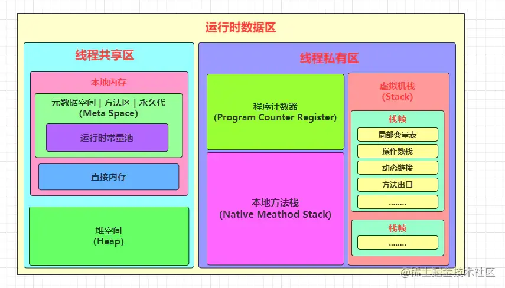
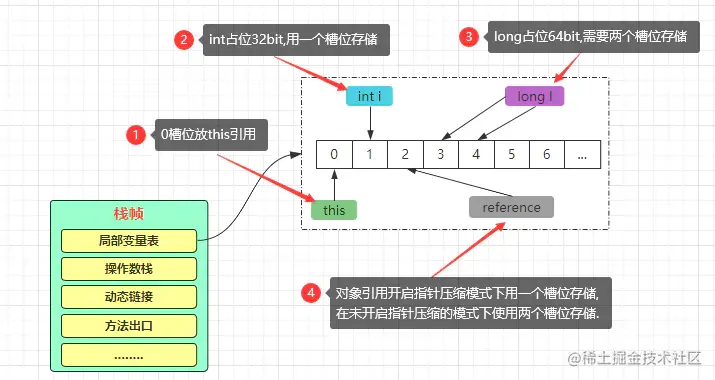
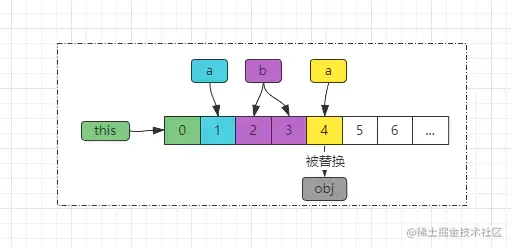
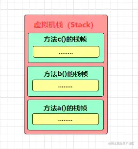
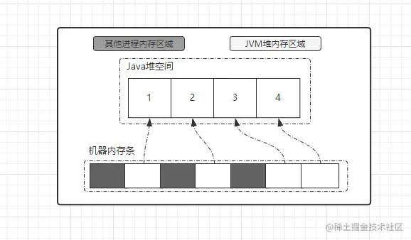
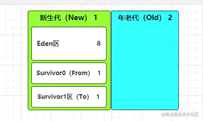
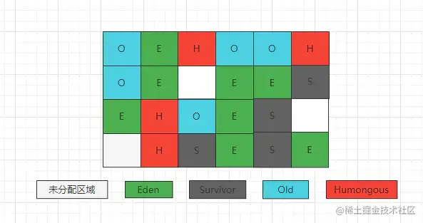
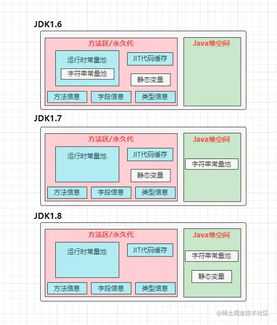

## 一、全面详解JVM运行时内存区域

JVM在运行Java程序时，会把自身管理的内存分为若干个不同的数据区域，这些区域各自都有各自的用途，同时，不同的区域也有着不同的生命周期，有些区域随着虚拟机的启动而开辟，随着虚拟机的终止而销毁，有的区域则是在运行过程中不断的创建与销毁。

JVM内存区域也被称为JVM运行时数据区，主要包含**程序计数器、虚拟机栈、本地方法栈、堆空间、元数据空间（方法区）、运行时常量池、字符串常量池、直接内存（本地内存）等**。站在程序执行的角度来看，总体可分为线程共享区和线程私有区两大块。如下图：
 
 下面会分别从线程私有和线程共享两个角度对JVM的每个内存区域进行阐述，

### 1.1、线程私有区

线程私有区的含义是指：对于每条线程而言，在创建它们时，JVM都会为它们分配的区域，这些内存区域的生命周期会随着线程的启动、死亡而创建和销毁。这些区域创建后，其他线程是不可见的，只有当前线程自身可以访问。

运行时数据区中的线程私有区域主要包含：程序计数器、虚拟机栈以及本地方法栈。

#### 1.1.1、程序计数器（Progran Counter Register）

程序计数器是JVM为每条线程开辟的一块较小的区域，每条线程都有且只有一个程序计数器，线程之间不相互干扰。生命周期与线程一致，随线程启动而生，线程销毁而亡。同时也是JVM所有内存区域中唯一不会发生OOM（`OutOfMemoryError`/内存溢出）的区域，GC机制不会触及的区域。

主要是作为当前线程执行时的字节码行号指示器来使用的，当线程执行一个Java方法时，记录线程正在执行的字节码指令地址，当执行引擎处理完某个指令后，程序计数器需要进行对应更新，将指针改向下一条要执行的指令地址，执行引擎会根据PC计数器中记录的地址进行对应的指令执行。当线程在执行一些由`C/C++`编写的`Native`方法时，PC计数器中则为空（`Undefined`）。除此作用之外，也可以保证线程发生CPU时间片切换后能恢复到正确的位置执行。

#### 1.1.2、虚拟机栈（Stack）

虚拟机栈也被称为Java栈，在JVM的内存区域中，栈主要是作为运行时执行的单位，栈的作用是负责程序运行时具体如何执行、如何处理数据等工作。生命周期与线程一致，每个线程创建时都会为之创建一个虚拟机栈。

当线程在执行一个Java方法时，都会为执行的方法生产一个**栈帧（`Stack Frame`）**，每个Java方法的调用到执行结束，对应着虚拟机栈中的一个栈帧的从入栈到出栈的过程，一个栈帧需要分配多大的内存空间，在编译器就已经确定了，不会受到运行时变量数据的大小影响。对于执行引擎而言，它只会对位于栈顶的栈帧元素（被称为**当前栈帧**）进行操作，与当前栈帧关联的方法被称为当前方法。

一个栈帧中主要包含**局部变量表、操作数栈、动态链接、方法出口**等信息，接下来依次对它们进行分析。

##### 1.1.2.1、局部变量表

局部变量表是一个由槽（`slot`）组成的数组，用于存放当前实例对象的引用信息、方法参数以及方法体内定义的基本数据类型变量、对象引用以及返回地址等信息，在`Class`文件的方法表的`Code`属性的`max_locals`指定了该方法所需局部变量表的最大容量。

> 槽（`Slot`）：槽是局部变量表中的最小单位，规定大小为32bit，对于32bit大小的数据，如`int`类型的变量、指针压缩后的对象引用信息等，都会使用一个槽来存储。而对于64位的数据，如`long、double`类型的变量、未开启指针压缩的对象引用等数据，JVM会为其分配两个连续的槽空间进行存储。
>  局部变量表中每个槽位都会有个固定的索引下标值，在执行方法时，执行引擎会根据索引值去访问局部变量表的指定槽位，然后将数据加载到操作数栈中进行执行。

局部变量表中存储的数据只对于当前方法中有效，虚拟机在执行时，依靠于操作数栈与局部变量表中存储的数据完成执行操作。方法执行结束后，局部变量表会随着栈帧的的出栈/销毁而随之销毁。一般而言，如果当前方法属于构造方法或实例方法，那么这些方法的局部变量表中下标为`0`的槽位必然存储的是`this`引用，也就是局部变量表中的第一个位置会被用来放当前方法所属的对象引用，其他的局部变量会按照顺序在局部变量表中进行存储。如下图：
 

> PS：值得注意的是：局部变量表中的槽位空间是可以被重复使用的，当局部变量表的一个数据失去作用并没有保持引用关系时，虚拟机会尝试将原本存储该数据的槽位用于分配新的数据，来个案例理解一下：

```java
java复制代码public void test(){
    int a = 1;
    long b = 8l;
    Object obj = new Object();
    // 模拟使用上述变量的过程....
    obj = null;
    // 继续往下执行......
    int c = 7;
    //.....
}
```

如上代码，我们按照前面对于局部变量表的讲解来初步想象出最初的局部变量表的布局，应该是如下这个样子的：
 
 根据前面的代码进行执行，经过初次分配后的局部变量表应该是上图所示的情况，按照原本的逻辑来说，`int`类型的变量`c`，应该会被分配到第六个槽位，也就是下标索引为`5`的位置，但实际上因为我们在如上Java程序中，对`obj`变量进行了置空操作，也就代表着局部变量表中存储`obj`这个引用的数据槽位不会再被使用，所以虚拟机会尝试复用该槽，如下：
 
 当需要为整数型的变量`c`分配槽位时，会直接将`c`分配到第五个槽位，也就是原本存储`obj`引用指针的位置。不过值得注意一提的是：这里是直接替换掉了原本槽位的数据，而不是先将原本槽位的数据移出。

> 局部变量表中的对象引用信息是在后续GC篇章中，一个重要的GC根节点，一个堆中的对象只要在一个局部变量表中被直接或间接的引用着，那么GC触发时就不会回收这个堆中对象。

同时，基于性能调优而言，在栈帧中与之关联的最密切的部分，就是局部变量表，方法执行时，虚拟机使用局部变量表完成方法参数的传递。

##### 1.1.2.2、操作数栈（Operand Stack）

操作数栈是一个遵循FILO先进后出模式的栈结构，在`Class`文件的结构定义中的`Code`属性的`max_stacks`定义了执行过程中最大的栈深度(会在编译器就确定一个方法的最大栈深度)。在前面的篇章中曾不止一次提及过，Java虚拟机是基于栈式的虚拟机，执行引擎中的解释器也是基于栈的工作模式，这个栈则是指操作数栈。

在执行一个方法时，首先会先创建一个与该方法对于的栈帧，该栈帧中的操作数栈最初是空的，在执行过程中，会根据字节码指令往栈中写入（入栈）和提取（出栈）数据。操作数栈的主要目的是用于保存计算过程的中间结果，同时作为计算过程中变量临时的存储空间。

> 与前面的局部变量表一样，操作数栈也是一个由`32bit`为单位的字节数组构成的，操作数栈中可支持存储的数据类型主要有：`int、long、float、double、reference、returnType`等类型，对于`byte、short、char`类型的数据会在入栈前被转为`int`类型放入栈中存储。
>  但与局部变量表不同的是：局部变量表是通过下标索引去访问存储的数据，而操作数栈中则是通过标准的压栈、出栈的方式完成数据访问。

同时因为操作数栈在运行时是位于内存中的，频繁的去对内存进行读写操作会影响执行速度，所以实际在执行过程中，虚拟机会将栈顶元素全部缓存到物理CPU的寄存器或高速缓存（L1/L2/L3）中，以此降低对内存的读写次数，从而提升执行引擎的执行效率。

还是用之前篇章中的`add`方法的`a+b`例子进行讲解，源码与操作数栈计算过程如下图： 

##### 1.1.2.3、动态链接（Dynamic Linking）

虚拟机栈中的每个栈帧都包含一个指向运行时常量池中该栈帧所属方法的引用，持有这个引用是为了支持方法调用过程中的动态链接（比如`invokedynamic`指令的调用）。

在Java源文件被编译成Class文件时，类中所有的变量、方法调用都会化为符号引用，然后保存在`class`文件的常量池中，在`class`文件中描述一个方法调用另一个方法时，就使用常量池中指向方法的符号引用来表示的。动态链接的作用就是为了将这些符号引用转换为调用方法的直接引用。

> 常量池：位于编译后生成的`class`字节码文件中。
>  运行时常量池：位于运行期间的元数据空间/方法区中。

##### 1.1.2.4、方法出口（Return Address）

一个方法当开始被执行引擎执行时，只有两种情况会导致方法退出，一种是在执行过程中遇到了正常返回的字节码指令，如：`ireturn、lreturn、dreturn、areturn、return`，释义如下：

- `ireturn`：返回值为`int、byte、char、short、boolean`类型时使用该指令返回
- `lreturn`：返回值为`long`类型时使用该指令返回
- `dreturn`：返回值为`double`类型时使用该指令返回
- `areturn`：返回值为引用类型时使用该指令返回
- `return`：无返回`void`、类或接口初始化方法时使用该指令返回

方法正常执行完成后退出的情况被称为**正常完成出口**，一般执行返回的字节码指令时，调用者的程序计数器会被作为返回的地址。

除开正常执行完成后退出的情况外，还有一种情况也会导致方法的退出，那就是方法执行过程中出现了异常，并且在方法体中没有处理该异常（没有`try/catch`），此时也会导致方法退出，这种情况下被称为**异常完成出口**，返回地址则需要通过异常处理器表来确定。

当一个方法执行结束退出时，会执行如下步骤：

- ①复原上层方法的局部变量表以及操作数栈。
- ②如果当前方法有返回值的情况下，把返回值压入调用者方法栈帧的操作数栈中。
- ③将PC计数器的地址指向改为方法下一条指令的位置，从而使得调用者正常工作。
- PS：异常退出的情况下，是不会给上层调用者返回任何值的。

##### 1.1.2.5、附加信息

各大厂商在实现JVM时，会增加一些《虚拟机规范》里没有描述的信息到栈帧中，如与调试相关的信息等，这类规范中未曾描述的信息则被称为附加信息（不同的VM可能存在的附加信息也可能不会一致）。

##### 1.1.2.6、虚拟机栈的特点与运行原理

采用数组这种快捷有效的存储方式，同时在运行时也被放在内存中，并且也会将操作数栈的栈顶数据放入高速缓存或寄存器中，所以从访问速度上来看，     仅次于PC寄存器。

虚拟机栈这块内存区域不存在垃圾回收，但是存在`OOM`，在《Java虚拟机规范》中，对这个区域规定了两种异常：

- `StackOverflowError`：当前线程请求的栈深度大于虚拟机栈所允许的深度时抛出该异常。
- `OutOfMemoryError`：如果扩展时无法申请到足够的内存空间会抛出`OOM`异常。

> 对于每条线程的虚拟机栈大小可以通过`-Xss`参数进行调整，默认单位为字节，默认大小为`1MB/1024KB/1048576字节`。

JVM运行期间，每条线程都拥有自己独立的虚拟机栈（线程栈），当前线程栈中的数据以栈帧的格式进行存储，当前线程正在执行的每一个方法都会在虚拟机栈中生成一个对应的栈帧，如下案例：

```java
java复制代码public void a(){
    int b_result = b();
}
public int b(){
    c();
    return 9;
}
public void c(){
    // ....
}
```

当一条线程执行方法`a()`时，它的虚拟机栈情况如下：
 
 对于这条线程而言，栈中的所有栈帧在同一时刻时，只会存在一个活动栈帧，也就是位于栈顶的栈帧，也就是我们前面所说的当前栈帧。执行引擎执行时，只会执行当前栈帧的字节码指令，如果执行当前方法时，在其中调用了其他方法，那么另外一个方法对应的栈帧会被创建出来，放在顶端，从而成为新的当前帧，接着执行引擎会去执行新帧，当该帧执行结束时，会传回此方法的执行结果给前一个栈帧，也就是上层调用者，比如上述案例中`a()`就是`b()`的上层调用者，接着虚拟机会丢弃当前栈帧，使得前一个栈帧重新成为栈顶的当前帧。这个过程会不断重复，直至一条方法调用链结束或因为异常中断，才会停止。

#### 1.1.3、本地方法栈（Native Method Stack）

本地方法栈和虚拟机栈差不多是类似的，区别在于虚拟机栈是用于执行Java方法的，而本地方法栈则是用于执行C所编写的`Native`本地方法。在程序运行之初，首先会在本地方法栈中登记`Native`本地方法，在执行引擎执行时，保存本地方法的相关数据（参数、局部变量等）。

因为是c编写的本地方法，所以本地方法库中的`Native`方法会被编译为基于本机硬件和操作系统的程序。本地方法执行是在os中执行的，并非在JVM中执行的，所以使用的是os的程序计数器而非JVM的程序计数器，当开始执行一个本地方法时，就会进入不再受虚拟机限制的环境，级别与虚拟机一样，可以直接访问JVM的任何内存区域，也可以直接使用CPU处理器的寄存器和本地内存等。而本地方法栈只是存储了线程要运行这个方法的必要信息，比如出口，入口，动态链接，局部变量表，操作数栈等。

> 不过在HotSpot虚拟机中，它将本地方法栈和虚拟机栈两者合二为一了。

### 1.2、线程共享区

线程共享的含义是指：在运行时，这些区域对于程序中的所有线程而言都是可见的，这些区域的状态不会因为某一条线程的死亡而发生改变，这些区域创建后是与JVM同级别的，伴随JVM的生命周期共生共死。

运行时数据区中的线程共享去主要包含：堆空间、元数据空间（方法区）以及直接内存这三大块。

#### 1.2.1、Java堆空间（Heap）

在Java内存中，堆空间也是最重要的一块区域，大部分的JVM调优手段都是基于堆空间而进行展开的。Java堆的作用与前面分析的Java栈不同，栈主要是作为运行时的单位，用于临时存储运行时需要以及产生的数据，而Java堆是存储的单位，主要解决的问题是数据存储问题，重点关注的领域是数据怎么存，放哪里，怎么放等。

堆空间会在JVM启动时被创建出来，对于JVM来说，堆空间是唯一的，每个JVM只会存在一个堆空间，同时容量大小会在创建时就被确定，当然，我们可以通过参数`-Xms `和`-Xmx`指定堆的起始内存大小和最大内存大小，当超过`-Xmx`参数指定的大小时则会抛出`OOM`。

> 默认情况下，如果不通过参数强制指定堆空间大小，那么JVM会根据当前所在的平台进行自适应调整，起始大小默认为当前物理机器内存的1/64，最大大小默认为当前物理机器内存的1/4。

在Java程序运行时，系统运行过程中产生的大部分实例对象以及数组对象都会被放到堆中存储。

> 创建Java堆时，本质上并不是直接在内存中划分了一块完整的空间给JVM，因为在《Java虚拟机规范》中提及到：堆空间在物理上可以是不连续的，只需要逻辑上视为连续即可。所以一个JVM的堆空间在实际的机器内存上，可能是由机器内存中多个不同位置的空间组成的，如下图：
>  

Java堆同时也是变化比较频繁的区域，在不同Java版本中，堆空间也发生了不同的改变：

- JDK7及之前：堆空间包含新生代、年老代以及永久代。
- JDK8：堆空间包含新生代和年老代，永久代被改为元数据空间，位于堆之外。
- JDK9：堆空间从逻辑上保留了分代的概念，但物理上本身不分代。
- JDK11：堆空间从此以后逻辑和物理上都不分代。

本质上来说，影响堆空间结构的并不是Java版本的不同，Java堆结构是跟JVM运行时所使用的垃圾回收器息息相关的，由GC器决定了运行时的堆空间会被划分为何种结构。

> 在JDK1.8及之前的Java版本中，几乎所有的GC器都会把堆空间划分为至少两个区域：新生代和年老代，但在JDK1.9到之后的GC器中，大多数的GC器开始了不分代的路子（具体原因稍后分析）。

##### 1.2.1.1、分代堆空间

分代的含义是指在JVM运行过程中，堆空间是否会被分为不同的区域分别用于存储不同生命周期的对象实例，JDK1.8之前的堆结构是完全分代的，也就是指逻辑+物理上都分代，在运行时物理内存会被划为几块不同的区域，也就是一个`Eden`区、两个`Survivor `区（`Form/To`区）以及一个`Old`区，从物理内存上来说各个区域都是完整且连续的内存，每块区域都用于存储不同周期的对象实例，相互之间并不干扰。

##### 1.2.1.2、不分代堆空间

到了JDK1.9时，G1正式出道，成为了JVM内嵌的默认GC器，Java堆空间从此出现了不分代的概念，但不分代也分为两种情况，一种是逻辑分代，物理不分代，另一种则是逻辑+物理都不分代。

> 逻辑分代，物理不分代（G1）：对象分配的逻辑上还是存在分代的思想，但是物理内存上不会再分为几块完整的分代空间。
>  逻辑+物理都不分代（ZGC、ShenandoahGC）：无论从对象分配的逻辑上还是物理内存上，都不存在分代的概念。

下面简单叙述一下不同版本的堆空间结构，具体的会在GC篇章中进行阐述。

##### 1.2.1.3、JDK7及之前的堆空间内存划分

在JDK1.7及之前的JVM中，所有的GC器都是物理+逻辑都分代的，包括内嵌的默认GC器`Parallel Scavenge（新生代）+ Parallel Old（老年代）`也分代，所以一般堆空间会被划分为三个区域：新生代、年老代以及永久代：

- 新生代：一个`Eden`区、两个`Survivor`区（`Form/To`区），比例：`8:1:1`
- 年老代：一个`Old`区
- 永久代：方法区


 新生代主要用于存储未达到年老代分配条件的对象，其中`Eden`区是专门用来存储刚创建出来的对象实例，两个`Survivor`区主要用于垃圾回收时给存活对象“避难”。
 年老代主要用于存储达到符合分配条件的对象实例，比如达到“年龄”的对象以及过大“体积”的大对象等。
 方法区/永久代主要用于存储类的元数据信息，如类描述信息、字段信息、方法信息、静态变量信息、异常表、方法表等。

> 默认情况下新生代和年老代的空间比例为`1:2`，新生代占`1/3`，年老代占`2/3`，当然也可以通过参数：`-XX:NewRatio=x`来指定比例，也可以通过`-Xmn`参数强制指定新生代的内存最大大小，如果和前面的`Ratio`参数冲突了则以后者为准。
>  新生代中，一个`Eden`区、两个`Survivor`区（`Form/To`区），默认比例为`8:1:1`，当然也可以通过参数`-XX:SurvivorRatio`调整这个空间比例。但实际上初始情况下是`6:1:1`，因为JVM存在自适应机制，当然也可以通过`-XX:-UseAdaptiveSizePolicy`参数关闭JVM的自适应机制（不推荐）。

##### 1.2.1.4、JDK8堆空间内存划分

到了JDK1.8的时候，JVM将永久代，也就是方法区整合成了元数据空间，并且将其移出了堆，将其放在堆空间外的本地内存中。
 

JDK1.8的时候没啥好讲的，和1.7差距不大，最大区别在于移除了方法区，在本地内存中加入了元数据空间来存储之前方法区中的大部分数据（原方法区中的数据并不是所有都被迁移到了元空间存储，有些数据被分散到了JVM各个区域）。除此之外，常量池在1.8的时候也被移到了堆外。

##### 1.2.1.5、JDK9堆空间内存划分

到了JDK1.9时，堆空间慢慢的开始了划时代的改变，在此之前，堆空间的布局都是采用分代存储的方式，无论从逻辑上还是从物理内存上，都是分代的。但是到了Java9的时候，因为默认GC器改为了G1，所以堆中的内存区域被划为了一个个的`Region`区。
 
 在JDK1.9时，G1将Java堆划分为多个大小相等的独立的`Region`区域，不过在`HotSpot`的源码`TARGET_REGION_NUMBER`定义了`Region`区的数量限制为`2048`个（实际上允许超过这个值，但是超过这个数量后，堆空间会变的难以管理）。

> 一般`Region`区的大小等于堆空间的总大小除以2048，比如目前的堆空间总大小为8GB，就是`8192MB/2048=4MB`，那么最终每个`Region`区的大小为`4MB`，当然也可以用参数`-XX:G1HeapRegionSize`强制指定每个`Region`区的大小，但是不推荐，毕竟默认的计算方式计算出的大小是最适合管理堆空间的。
>  G1保留了年轻代和老年代的概念，但不再是物理隔阂了，它们都是可以不连续物理内存来组成的`Region`的集合。

默认新生代对堆内存的初始占比是5%，如果堆大小为8GB，那么年轻代占据`400MB`左右的内存，对应大概是`100`个`Region`区，可以通过`-XX:G1NewSizePercent`设置新生代初始占比。
 在Java程序运行中，JVM会不停的给新生代增加更多的`Region`区，但是最多新生代的占比不会超过堆空间总大小的60%，可以通过`-XX:G1MaxNewSizePercent`调整（也不推荐，如果超过这个比例，年老代的空间会变的很小，容易触发全局GC）。新生代中的`Eden`区和`Survivor`区对应的`Region`区比例也跟之前一样，默认8:1:1，假设新生代现在有400个`Region`，那么整个新生代的占比则为`Eden=320,S0/From=40,S1/To=40`。

G1中的年老代晋升条件和之前的无差，达到年龄阈值的对象会被转入年老代的`Region`区中，不同的是对于大对象的分配，在G1中不会让大对象进入年老代，在G1中由专门存放大对象的`Region`区叫做`Humongous`区，如果在分配对象时，判定出一个对象属于大对象，那么则会直接将其放入`Humongous`区存储。

> 在G1中，判定一个对象是否为大对象的方式为：对象大小是否超过单个普通`Region`区的50%，如果超过则代表当前对象为大对象，那么该对象会被直接放入`Humongous`区。比如：目前是8GB的堆空间，每个`Region`区的大小为`4MB`，当一个对象大小超过`2MB`时则会被判定为属于大对象。

`Humongous`区存在的意义：可以避免一些“短命”的巨型对象直接进入年老代，节约年老代的内存空间，可以有效避免年老代因空间不足时的GC开销。

当堆空间发生全局GC(`FullGC`)时，除开回收新生代和年老代之外，也会对`Humongous`区进行回收。

##### 1.2.1.6、JDK11堆空间内存划分

在JDK11的时候，Java又推出了一款新的垃圾回收器`ZGC`，它也是一款基于`Region`区内存布局的GC器，这款GC器是真正意义上的不分代，无论是从逻辑上还是物理上都不分代。
 
 在ZGC中，也会把堆空间划分为一个个的`Region`区域，但ZGC中的`Region`区不存在分代的概念，它仅仅只是简单的将所有`Region`区分为了大、中、小三个等级：

- 小型`Region`区(`Small`)：固定大小为`2MB`，用于分配小于`256KB`的对象。
- 中型`Region`区(`Medium`)：固定大小为`32MB`，用于分配`>=256KB ~ <=4MB`的对象。
- 大型`Region`区(`Large`)：没有固定大小，容量可以动态变化，但是大小必须为`2MB`的整数倍，专门用于存放`>4MB`的巨型对象。但值得一提的是：每个`Large`区只能存放一个大对象，也就代表着你的这个大对象多大，那么这个`Large`区就为多大，所以一般情况下，`Large`区的容量要小于`Medium`区，并且需要注意：`Large`区的空间是不会被重新分配的（GC篇章详细分析）。

> PS：实际上，JDK11中的ZGC并不是因为要抛弃分代理念而不设计分代的堆空间的，因为实际上最开始分代理念被提出的本质原因是源于「大部分对象朝生夕死」这个概念的，而实际上大部分Java程序在运行时都符合这个现象，所以逻辑分代+物理不分代是堆空间最好的结构方案。但问题在于：ZGC为何不设计出分代的堆空间结构呢？其实本质原因是分代实现起来非常麻烦且复杂，所以就先实现出一个比较简单可用的单代版本，后续可能会优化改进（但实际上能不能改进成功还不好说，ZGC的研发团队负责人`Per`是从`JRockit`GC组过来的，R大在和`per`聊天时曾聊到过：`per`之前在`JRockit`GC器上尝试了四五次都以失败告终，ZGC上能不能成功还是得看未来了）。

##### 1.2.1.7、堆总结

Java堆空间是JVM运行时内存区域中占比最大的一块，此内存区域唯一的目的就是存储运行时创建出的对象实例。同时，随着运行时采用的GC器不同，Java堆也会被分为不同的结构，其中主要可分为分代和不分代的两类结构。相对来说，分代结构是最适合Java对象“朝生夕死”的特性的，如果堆结构是分代的，可以使得JVM能够更好的管理堆内存中的对象，包括内存的分配以及回收。

#### 1.2.2、本地内存

运行时数据区中的本地内存主要可分为两块，一部分为元数据空间（原方法区），另一部分则为直接内存。在任何一个平台上运行一个进程，操作系统都会为其分配对应的内存，JVM也不例外，在启动时也会向操作系统申请资源分配（内存、CPU、线程数等）。但值得注意的是：元数据空间和直接内存这两块区域，并不处于OS为JVM分配的内存中，而是直接使用物理机的内存进行数据存放，但是**本地内存**还是会被JVM管理。

##### 1.2.2.1、元数据空间（Metaspace）

前面曾提及过，元数据空间是之前的方法区（永久代）移过的，所以在讲元数据空间之前，先聊聊JDK1.7的方法区。

> 方法区也就是所谓的永久代/持久代，方法区中主要存储了可以通过反射机制拿到的所有数据，如`Class`类信息、`Method`方法信息、`Filed`字段信息，方法区需要多少的空间具体会取决于JVM运行时会加载多少类，因为经过类加载后的`Class`文件会生成类的元数据，然后将其存储在这块区域。当然，当一个类被卸载时，该类数据占用的空间也会在FullGC发生时伴随一起释放。
>  方法区主要存储的数据：类的元数据、VM内部表、类的层级信息/方法信息/字段信息、方法的编译信息和字节码数据、静态变量、常量池以及符号引用。
>  在JDK1.7时，方法区的默认最大空间为64MB，也可以通过参数`-XX:MaxPermSize`调整。

**为什么JDK1.8时会移除方法区呢？**
 其实在JDK1.7的时候就已经为1.8移除方法区在开展准备工作了，在1.7的时候已经将原本放在方法区的字符串常量池移动到了堆中，而在1.8的时候全面移除了方法区的存在，具体原因主要有三个：
 ①方法区不容易设置大小，给大了浪费空间，给小了容易OOM，比如`Tomcat`部署多个工程，加载大量jar包就容易导致方法区OOM。
 ②垃圾回收机制对于永久代的回收效率比较低，并且为GC带来了一些不必要的复杂度。
 ③为了更好的融合Sun HotSpot和BEA JRockit两款虚拟机，因为只有HotSpot中存在方法区的概念，其他的虚拟机中都不存在此概念，所以为了Oracle HotSpot更好的“前途”，所以干脆移除了方法区，从而达到Sun HotSpot和BEA JRockit完美融合的目的。

OK，简单的看了一下方法区的描述之后，接着可以来看看元数据空间了。当然，如果你想知道具体方法区中存什么，那么可以看[这个](https://link.juejin.cn?target=https%3A%2F%2Fzhuanlan.zhihu.com%2Fp%2F108668874)。

元数据空间则是1.8移除掉方法区之后的产物，主要用于存放运行时常量池和类信息，如下：
 
 而之前方法区运行时常量池中的字符串常量池则被放置在了堆中，因为在程序运行过程中会随着运行时间的增加，字符串常量池中的字符串会越来越多，所占空间会越来越大，所以将其放在堆中的好处在于：使得字符串常量池在GC机制的范围之内，字符串也会存在回收操作。
 同时除开字符串常量池被挪动到了堆内之外，类的静态变量的存储也被放在了堆中。对比如下：
 

##### 1.2.2.2、直接内存

直接内存这块区域不是虚拟机的内存区域，在《Java虚拟机规范》中也没有定义，在创建时会直接向操作系统申请内存空间，属于直接使用物理内存的一块区域，也被称为“堆外空间”。

对比堆空间而言，访问直接内存的速度会超出堆内存，也就是读写性能优于Java堆，来源于Java的NIO库，Java的NIO可以允许Java程序直接使用本地的直接内存存储数据缓冲，因为如果把一些文件数据转为对象存储在堆中时，很容易导致堆空间负载过重而OOM。所以出于性能和稳定性两方面的考虑，一般对于一些读写频繁的场景或读取/写出大文件时的场景都可以使用直接内存进行操作。

> 如果程序中需要用到直接内存时可以通过`java.nio.ByteBuffer`来创建，调用`allocateDirect`方法申请即可，同时可以通过存在堆中的`DirectByteBuffer`操作直接内存。

直接内存的最大空间值可以通过`-XX:MaxDirectMemorySize`设置，如果不指定则默认与`-Xmx`参数设置的空间大小一致。直接内存属于比较昂贵的资源，因为需要直接向OS申请，所以分配成本较高，并且创建出来之后也不受JVM的直接控制，所以GC机制对于这块区域的内存空间难以管理，只有当发生`FullGC`时才会对于这块区域进行回收。

> 同时这块区域是也会出现OOM的，因为物理机的内存终归是有限的，受到硬件的限制，所以如果一直向操作系统申请直接内存使用，完事后JVM的GC机制又无法有效回收使用过的内存，可能在下一次`FullGC`到来之前就会将物理机分配的内存空间申请耗尽，从而引发OOM。

所以一般在使用直接内存的时候，不能将希望寄托给GC机制的全局GC来管理内存，因此我们可以和C语言一样，尝试自己写一个回收直接内存的方法，然后使用完成后自己手动回收申请的内存，方法如下：

```java
java复制代码import java.nio.ByteBuffer;
import sun.nio.ch.DirectBuffer;
public class NonHeapGC {
  public static void clean(final ByteBuffer byteBuffer) { 
    if (byteBuffer.isDirect()) { 
      ((DirectBuffer)byteBuffer).cleaner().clean(); 
    } 
 } 
  public static void sleep(long i) { 
    try { 
       Thread.sleep(i); 
     }catch(Exception e) { 
       /*skip*/ 
     } 
  } 
  public static void main(String []args) throws Exception { 
      ByteBuffer buffer = ByteBuffer.allocateDirect(1024 * 1024 * 200); 
      System.out.println("start"); 
      sleep(5000); 
      clean(buffer);//执行垃圾回收
//     System.gc(); //执行Full gc进行垃圾回收
      System.out.println("end"); 
      sleep(5000); 
  } 
}
```

当使用完成申请的内存空间后，可以手动调用`clean()`方法进行内存的回收释放。

## 二、内存溢出OOM(OutOfMemory)

OOM这个词在不少篇章中都曾反复提及，它的具体含义是指`OutOfMemoryError`内存溢出错误。在JVM的运行时数据区中，除开程序计数器之外，其他的区域都会存在内存溢出的风险，下面依次进行举例分析。

### 2.1、Java堆空间OOM

前面分析内存区域时曾谈到：Java堆空间是用于存储对象实例和数组数据的内存区域，同时JVM的GC机制也会重点对于这块区域进行内存管理。但是如果内存不足发生GC时，堆中的对象都还存活，此时又没有足够的内存分配新的对象实例，最终堆空间就会出现OOM，如下案例：

```java
java复制代码public class OOM {
    // 测试内存溢出的对象类
    public static class OomObject{}

    /**
     *  测试Java堆空间OOM的方法
     *  JVM启动参数：-Xms10M -Xmx10M -XX:+HeapDumpOnOutOfMemoryError
     * */
    public static void HeapOOM(){
        List<OomObject> OOMlist = new ArrayList<>();
        // 死循环：反复往集合中添加对象实例
        for(;;){
            OOMlist.add(new OomObject());
        }
    }

    public static void main(String[] args){
        // 调用测试堆空间OOM的方法
        HeapOOM();
    }
}
```

如上案例，在程序启动时使用参数`-Xms`指定JVM堆空间的初始大小为`10MB`，同时为了防止内存不足时动态扩容，我们也通过`-Xmx`指定了堆空间的最大大小为`10MB`，然后在`HeapOOM`方法中使用死循环反复往集合中添加`OomObject`对象实例，

> `-XX:+HeapDumpOnOutOfMemoryError`：可以让虚拟机在出现内存溢出异常时Dump出内存堆运行时快照，可以使用`VisualVM`堆快照进行分析（后续GC篇章会用到，本篇不做详细介绍）。

最终程序执行结果如下：

```java
java复制代码java.lang.OutOfMemoryError: Java heap space
Dumping heap to java_pid16160.hprof ...
Heap dump file created [14045343 bytes in 0.092 secs]
Exception in thread "main" java.lang.OutOfMemoryError: Java heap space
	.......
```

才能上述结果中，可以清晰的看见`java.lang.OutOfMemoryError: Java heap space`这一行信息，从这行信息中可以得知：目前程序执行出现了内存溢出，而溢出的区域为Java堆空间。

#### 2.1.1、线上环境堆空间OOM的原因

- ①内存中加载数据量过于庞大导致OOM，如一次性从数据库中查询出几千万条数据导致创建出一个超大型的数据数组。
- ②集合对象中存在对象的引用，使得集合中的一些失效对象无法被GC回收。
- ③代码中存在逻辑不正确的循环导致在特定情况下产生了大量重复的对象实例。
- ④使用第三方依赖时，第三方依赖中存在BUG，导致运行时生成大量对象。
- ⑤JVM启动时，使用参数为其分配的堆空间过小，导致程序正常运行的内存都不足够。
- ⑥程序中存在无限递归调用，导致一直生成对象OOM。
- ⑦系统流量超出原有的预估值，导致大量请求进入系统，创建大量对象，内存过小OOM。
- ⑧......

其实本质上来说，线上环境引发Java堆OOM的原因有很多，但归根到底就那几个：
 一、程序正常运行，堆中存活对象过多无法回收，新对象没有内存分配导致的。
 二、代码中存在不规范的语法，因代码原因导致运行过程中出现OOM，如无限递归/死循环/用完后不释放等。
 三、运行过程中出现了内存泄露，泄露问题一点点将内存蚕食掉了，导致最终可用内存变得很小，从而诱发OOM。

#### 2.1.2、线上环境堆OOM问题排查

一般而言，线上环境出现问题后，总会分为固定的几个步骤，从发现问题出发，慢慢到后续的排查问题、定位问题、解决问题、尝试最优解、适当考虑拓展性，这是解决问题的一条完整链路。

如前面的堆空间OOM问题，从发生问题之后，首先应该通过相关的一些JVM工具，对日志进行`dump`分析，定位出可能发生该问题的几个可疑位置，然后对这些位置依次进行排查，最终定位到具体是由于什么原因导致的OOM，再“对症下药”，堆OOM问题解决方案一般有以下几种：

- ①如果确定是代码问题，则通过工具定位到具体的代码，然后对代码进行改正即可。
- ②如果确实是所分配的堆空间无法保障JVM的正常运行了，那么应该分配更大的堆空间。
- ③如果是因为内存泄露导致的OOM，那么则应该进一步定位内存泄露出现的原因，然后进行对应的解决。

#### 2.1.3、GC overhead limit exceeded

在Java程序执行过程中，如果当JVM花费了98%以上的时间在GC，但成功回收的内存不足2%，并且该动作重复五次时，就会抛出`java.lang.OutOfMemoryError:GC overhead limit exceeded`错误，这种情况就属于分配的空间不足以支撑系统的正常开销，导致程序耗尽了所有的内存资源，GC机制想回收也束手无策。这种情况下一般都可以先尝试加大堆内存解决。

### 2.2、虚拟机栈和本地方法栈OOM

关于Java栈的内存溢出主要可分为本地方法栈和虚拟机栈OOM，但在HotSpot中将两者合一了，所以在该虚拟机中只存在虚拟机栈OOM的问题，但虚拟机栈除开会出现OOM外，还会出现另一种内存问题：`SOF`，如下：

- `StackOverflowError`：当前线程请求的栈深度大于虚拟机栈所允许的深度时抛出该异常。
- `OutOfMemoryError`：如果扩展时无法申请到足够的内存空间会抛出`OOM`异常。

#### 2.2.1、虚拟机栈SOF问题测试

先上代码：

```java
java复制代码public class OOM {
    /**
     * 测试虚拟机栈SOF的方法
     * JVM启动参数：-Xss128k
     */
    public static void VMStackSOF() {
        int stackLength = 1;
        stackLength++;
        VMStackSOF();
    }

    public static void main(String[] args){
        // 调用测试虚拟机栈SOF的方法
        VMStackSOF();
    }
}
```

如上案例中，首先使用`-Xss`指定了虚拟机栈的大小为`128KB`，然后在`VMStackSOF()`方法中不断的递归调用自身，运行结果如下：

```java
java复制代码Exception in thread "main" java.lang.StackOverflowError
	.........
```

从结果中可以很明显的看出`SOF`问题，因为前面通过参数设定了每条线程的虚拟机栈空间为`128K`，所以在`VMStackSOF()`方法的不断递归下，程序最终抛出了`java.lang.StackOverflowError`错误。在运行过程中，一条线程在执行一个方法时，无论是栈帧太大还是虚拟机栈容量太小，当无法分配内存时都会抛出`SOF`问题。

#### 2.2.2、虚拟机栈OOM问题测试

```java
java复制代码public class OOM {
    /**
     * 测试虚拟机栈OOM的方法
     * JVM启动参数：-Xss1M
     */
    public static void VMStackOOM() {
        for (;;){
            new Thread(()->{
                while (1==1){}
            }).start();
        }
    }

    // ！！！慎重运行，大多数情况下会导致OS假死！！！
    public static void main(String[] args){
        // 调用测试虚拟机栈OOM的方法
        VMStackOOM(); 
    }
}
```

其实Java栈的OOM是很难观测到的，因为栈OOM的条件为：**如果栈空间扩展时无法申请到足够的内存空间会抛出OOM异常。** 但是这个条件在HotSpot中几乎很难达到，因为虚拟机栈所需的空间大小，在编译期就已经确定了，在运行期间机会很少存在会发生Java栈动态扩容的情况，所以我们在上述代码中，采用另一种方式观测栈溢出，就是在`VMStackOOM()`方法中不断的创建新线程并且持续保持着这些线程活跃。最终当JVM创建某条线程时，在为其分配虚拟机栈空间的时候，假设此时机器的内存空间已经被申请完了，那么此时就会出现OOM。

在上述案例中，首先使用了`-Xss`参数指定了虚拟机栈的大小为`1MB`，但是这种方式不咋靠谱，请慎重运行！因为大多数情况下会导致你的机器/电脑操作系统资源耗尽而陷入假死状态，结果运行如下：

```java
java复制代码Exception in thread "main" java.lang.OutOfMemoryError: 
            unable to create new native thread
            ........
```

从上述结果中可以得知，当一直创建线程时就会抛出OOM异常，但是这种并不是真正意义上的栈内存溢出，只能从某种意义上来说，“勉强”可以被称为Java栈溢出。因为每条Java线程在创建时，都会向OS申请资源并映射到一条内核线程上，每条Java线程都会占用一定的内存空间，当物理内存耗尽，OS无法为一条新创建的线程分配内存时就会出现这个问题。

其实如果你想在HotSpot中观测到真正的Java栈溢出，实则还有一种办法：

> 在前面论述虚拟机栈时，曾提到过，虚拟机栈所需的空间的大多数情况下在编译期间就已确定，所以基于这个准则，我们几乎很难在程序中满足栈溢出的条件。但事情不是绝对的，我们分析过栈帧之后得知：方法的入参在运行时会放在局部变量表中存储，而局部变量表位于栈帧之中，栈帧位于虚拟机栈当中，那如果我们在编写程序时，定义方法的时候，把方法的入参数量定义成不确定的个数，这样的话该方法对应栈帧的所需空间大小编译期就无法确定了，从而就会出现虚拟机栈在运行期间申请空间的动态扩容情况啦。代码如下：

```java
java复制代码/**
 * 测试虚拟机栈OOM的方法
 * JVM启动参数：-Xss256k
 */
public static void VMStackOOM(long... l) {}
```

如上方法中，入参的数量就是不确定的，必须要等到具体调用执行时才能确定到底会传入多少个参数进来，而我们此时使用`-Xss`指定了栈大小为`256kb`，一个`long`类型的入参所占空间为`8bytes`，`256kb=(1024*256)bytes`，理论上在调用`VMStackOOM()`方法时，往该方法中传递`10w`个`long`类型的入参，是肯定可以观测到Java栈OOM的情况的。

> 但你问我为什么不贴执行结果，因为为一个方法传递10w个参数是个大工程，有兴趣的可以自己去尝试~

#### 2.2.3、虚拟机栈OOM原因及解决方案

虚拟机栈这块区域出现OOM的原因大多数情况下就只存在两种，一种是无限递归导致产生大量栈帧引发的问题，另外一种则是无限创建新线程导致耗尽了物理内存抛出的问题。其实这两种并不算真正意义上的虚拟机栈OOM，前者被称为SOF问题，后者则是因为资源耗尽导致的。

- SOF问题：

  - 产生原因：一般是因为无限递归导致的。
  - 解决方案：优化代码，可以使用递归，但是不要产生无限递归。

- ```
  Unable to create new native thread
  ```

  问题：

  - 产生原因：
    - ①线程数超过了操作系统最大线程数`ulimit`的限制。
    - ②线程数超过了`kernel.pid_max`一个进程中规定的内核映射数。
    - ③申请创建线程时，物理机内存被耗尽，没有足够内存分配新线程。
  - 解决方案：
    - 升级硬件配置
    - 使用`-Xss`缩小Java栈的大小
    - 修改操作系统默认参数

### 2.3、元数据空间和运行时常量池OOM

元数据空间主要存储类名、访问修饰符、常量池、字段描述、方法描述等信息，对于测试元数据空间的内存溢出基本思路是：在运行时产生大量类字节码，从而使得元数据空间内存被耗尽，从而抛出OOM。案例如下：

```java
java复制代码public class OOM {
    // 测试内存溢出的对象类
    public static class OomObject{}
    
    /**
     *  测试运行时常量池OOM的方法
     * JVM启动参数：-XX:PermSize=10M -XX:MaxPermSize=10M
     * 适用版本：JDK1.6及之前
     */
    public static void RuntimeConstantPoolOOM(){
        // 使用List保持着常量池的引用，避免Full GC回收常量池
        List<String> list = new ArrayList<>();
        // 10MB的PermSize在Integer范围内足够产生OOM了
        int i = 0;
        while (true) {
            list.add(String.valueOf(i++).intern());
        }
    }

    /**
     *  测试元数据空间OOM的方法
     *  JVM启动参数：-XX:MetaspaceSize=10M  
     *               -XX:MaxMetaspaceSize=10M  
     *               -XX:+HeapDumpOnOutOfMemoryError
     * */
    public static void MetaSpaceOOM(String[] args){
        while (true) {
            Enhancer enhancer=new Enhancer();
            enhancer.setSuperclass(OomObject.class);
            enhancer.setUseCache(false);
            enhancer.setCallback((MethodInterceptor) 
                    (o, method, objects, methodProxy)
                    -> methodProxy.invokeSuper(o,args));
            enhancer.create();
        }
    }

    public static void main(String[] args){
        // 调用测试元数据空间OOM的方法
        MetaSpaceOOM(args);
    }
}
```

在上述案例中，使用JVM参数设定了元数据空间的大小为`10MB`，然后通过`enhancer`对象的`CGLIB`动态代理生产大量的类字节码文件填充元数据空间，从而最终达到OOM的效果，运行结果如下：

```java
java复制代码java.lang.OutOfMemoryError: Metaspace
Dumping heap to java_pid13784.hprof ...
Heap dump file created [4383328 bytes in 0.026 secs]
Exception in thread "main" java.lang.OutOfMemoryError: Metaspace
        ......
```

从结果中可以清晰的看见元数据空间OOM的日志：`java.lang.OutOfMemoryError: Metaspace`。

> 对于运行时常量池OOM的测试，在JDK1.6时，因为字符串常量池位于运行时常量池中，所以还比较好测试，生成大量的字符串即可。但1.7之后，字符串常量池被移入到了堆空间中，这样就很难使得运行时常量池再发生OOM的错误了，但如果有兴趣的小伙伴也可以把上述案例中的`RuntimeConstantPoolOOM()`方法放在1.6的环境中跑一次，也能够观测到运行时常量池的内存溢出。

#### 2.3.1、元数据空间OOM的原因及解决方案

元数据空间溢出的原因主要存在如下几种：

- ①加载的类信息过多，导致OOM
- ②JIT生成的热点代码过多，导致OOM
- ③运行时常量池溢出，导致OOM

> 对于这块区域的OOM，因为是位于本地内存的原因，所以一般排查掉由于cglib生成了大量的代理类这种原因导致的OOM外，其他情况下一般都是因为分配的内存不足以支撑运行时产生的数据导致的，这种情况下一般通过对应的参数调大分配的空间即可。
>  但如果是因为cglib代理导致的OOM，那么可以开启`-XX:+CMSClassUnloadingEnabled `和`-XX:+UseConcMarkSweepGC`参数，允许JVM卸载类，因为默认情况下，JVM是不会卸载类的，这些动态代理生成的类生命周期很短暂，加载使用一次后可能很长时间内不会再使用它们，此时就可以让JVM将这些类自动卸载掉。

### 2.4、直接内存OOM

前面提到过，直接内存的空间大小可以通过`-XX:MaxDirectMemorySize`参数指定，案例如下：

```java
java复制代码public class OOM {
    /**
     *  测试直接内存OOM的方法
     * JVM启动参数：-Xmx10M -XX:MaxDirectMemorySize=10M
     */
    public static void DirectMemoryOOM(){
        Field unsafeField = Unsafe.class.getDeclaredFields()[0];
        unsafeField.setAccessible(true);
        Unsafe unsafe = null;
        try {
            unsafe = (Unsafe) unsafeField.get(null);
        } catch (IllegalAccessException e) {
            e.printStackTrace();
        }
        while (true) {
            // 申请1MB的直接内存
            unsafe.allocateMemory(1024*1024);
        }
    }

    public static void main(String[] args){
        // 调用测试虚拟机栈OOM的方法
        DirectMemoryOOM();
    }
}
```

如上案例中，使用了`-XX:MaxDirectMemorySize/-Xmx`指定了元数据空间大小和堆最大空间大小为`10MB`，然后使用反射获取到了`Unsafe`对象的`allocateMemory()`方法在不断的申请`1MB`直接内存，最终执行结果如下：

```java
java复制代码Exception in thread "main" java.lang.OutOfMemoryError
	at sun.misc.Unsafe.allocateMemory(Native Method)
	.......
```

在`DirectMemoryOOM()`方法中，一直在循环申请直接内存使用，但是申请之后没有释放，当申请到第11次时，分配的直接内存空间被耗尽，从而抛出了`OOM`错误。

#### 2.4.1、直接内存OOM产生原因及解决方案

直接内存OOM主要存在两种原因，一种为申请后没有合理释放，在FullGC来临之前耗尽了分配的所有空间，第二种则是因为申请的内存大小超出了直接内存的可用内存大小。这两种情况，前者可以尽量保证自己在使用完直接内存后手动回收，不要依赖JVM的GC机制管理内存，后者则可以通过调大直接内存的空间大小，确保有足够的内存使用。

## 三、内存泄露(Memory Leak)

内存泄露是指程序分配的内存由于某些原因未释放或无法释放，造成系统内存的浪费。针对于Java而言，是指申请的内存空间没有被正确释放，存储在该区域的数据使用完后没有被回收，而指向这块区域的直接指针却不存在了，但还有其他引用可以关联到该区域，造成数据已经失效，引用链依旧保持，GC无法回收的情况出现，最终导致后续程序里这块内存被永远占用（不可达），内存空间就这么一点点被蚕食，最后导致程序运行缓慢、内存耗尽的问题出现。

> 举个例子：我开了一家`POS`游戏店，里面有100个位置，给每个位置上都准备了一台最新的`POS`游戏机。各位小伙伴按照分配的位置依次入座，每人都领一台游戏机开始玩游戏，本来玩完之后是应该将自己拿到的游戏机关机放在自己的座位上的，这样我可以根据大家的座位号依次回收每位小伙伴的游戏机，但是有几个心怀不轨的家伙玩完之后不关机，结果还顺走了我的游戏机跑路了，这样我就无法根据座位号回收这几台游戏机了，如此我就只剩下了九十多台游戏机给下一次的小伙伴玩，依次类推，每次都发生几起"顺手牵羊"事件，最后导致我的游戏店中一台游戏机都没有了....

在Java中典型的内存泄露案例是使用`ThreadLocal`，详细可以参考[并发编程中的ThreadLocal分析章节。](https://link.juejin.cn?target=https%3A%2F%2Fwww.jianshu.com%2Fp%2F0de4c2781afa)除此之外，在Java程序中大量的`static`成员、未正确关闭连接、不正确的`equals()`和`hashCode()`、引用了外部类的内部类、非正确的重写`finalize()`方法、常量字符串等原因都有可能导致Java应用发生内存泄露。

内存泄露从发生方式的角度来看，可以大致被分为四类：

- ①常发性内存泄漏：这种情况是指发生内存泄露的代码会被多次执行到，每次执行都会导致一块内存区域泄露。
- ②偶发性内存泄漏：发生内存泄漏的代码只有在某些特定环境或操作过程下才会发生。
- ③一次性内存泄漏：发生内存泄漏的代码在程序执行过程中只会被执行一次，二次执行时却正常无误。
- ④隐式内存泄漏：程序在运行过程中不停的分配内存，但是直到结束的时候才释放内存。

> 相对来说，不管是那种泄露方式在Java中都比较难碰到，因为Java有完善的GC机制存在，所以发生内存泄露的几率很小很小，尤其是在目前的Java新版本中，发生几率几乎为零。不过在早期的JDK版本中发生内存泄露的几率还是蛮大的，因为早期Sun HotSpot中没有对method area进行有效回收，从而使得Java程序在执行过程中经常出现该问题。

在程序抛出OOM问题时，一般是先通过内存映像分析工具(如`Eclipse Memory Analyzer`)对`dump`出来的堆转存快照进行分析，重点是确认内存中的对象是否是必要的，先分清是因为内存泄漏还是内存溢出。
 如果是内存泄漏，可进一步通过工具（如`Jrockit`等工具）查看泄漏对象到GC Roots的引用链。于是就能找到泄漏对象时通过怎样的路径与GC Roots相关联并导致垃圾收集器无法自动回收。

### 3.1、重点：关于内存溢出的误区

先来看这么个说法：

> “在Java中，两个对象相互引用，保持着存活状态，从而造成引用循环，导致GC机制无法回收该对象所占用的内存区域，从而造成了内存泄漏。”

上述这句话听起来好像没太大问题，乍一听几乎大部分人都会认为是正确的，但实则该说法在Java中并不成立。因为Java中GC判断算法采用的是可达性分析算法，对于根不可达的对象都会判定为垃圾对象，会被统一回收。因此，就算在堆中有引用循环的情况出现，也不会引发内存泄漏问题。

### 3.2、内存溢出与内存泄漏的区别

**内存溢出：** 程序分配到了`10MB`内存，但运行过程中产生了`11MB`数据写入到该空间，这叫做内存溢出。

> 举例：一个木桶只能装`40L`水，但此时往里面倒入`50L`水，多出来的水会从桶顶溢出。换到程序的内存中，这种情况就被称为内存溢出。

**内存泄露：** 你在程序中申请了一块内存，使用了之后之后不会再使用，但是没有释放，而JVM的GC机制也无法回收这块区域，此时就可以被称为内存泄漏。好比程序中开了一个流对象，使用完成之后没手动关闭，GC机制也无法回收它，这种情况就是内存泄露。

> 举例：一个木桶只能装`40L`水，但此刻我往里面丢块`2KG`的黄金，那该水桶在之后的过程中，最多只能装`38L`的水。此时这种情况换到程序的内存中，就被称为内存泄漏。
>  （PS：不考虑物体密度的情况，举例说明不要死磕！）

## 四、其他的内存溢出问题

在前面介绍OOM时，对一些常见区域的内存溢出问题做了简单介绍，接下来会介绍几种平时难以见到的内存溢出情况。

#### 4.1、Out of swap space

`Out of swap space`代表所有可用的虚拟内存已被耗尽，虚拟内存是由物理内存和交换空间两部分组成的，当运行时程序请求的虚拟内存溢出时就会抛出该错误。出现该问题的原因主要有两个，一个是地址空间不足，另一个则是物理内存已被耗尽，解决方案一般是只能提升硬件配置。

#### 4.2、Kill process or sacrifice child

`Kill process or sacrifice child`这种OOM的情况，属于Linux操作系统抛出的错误，当系统可用内存快耗尽时，内核的`Out of Memory Killer`组件会对所有进程进行打分，然后会尝试杀死一些评分低的进程，释放它们占用的内存空间来确保拥有足够的内存维护OS的运行。
 一般来说，Java程序中是不必担心遇到这个问题的，因为“打分”这一操作，会基于活跃度进行，而Java程序部署之后，一般情况下都会处于持续运行的状态。

#### 4.3、Requested array size exceeds VM limit

JVM限制了数组的最大长度，该错误表示程序请求创建的数组超过最大长度限制。因为数组这种数据结构，要求在分配时，物理内存必须连续，所以当分配一个巨型数组时，发现堆空间中已经没有一块这么大的连续空间，并且GC之后还是分配不下，那么就会抛出`Requested array size exceeds VM limit`错误。

如果你在程序中，遇到了这种问题，那么一般都是需要从业务上进行拆分，对于如此巨大的数组可以分为多次查询，将其分割为多个不同的小数组分配即可。