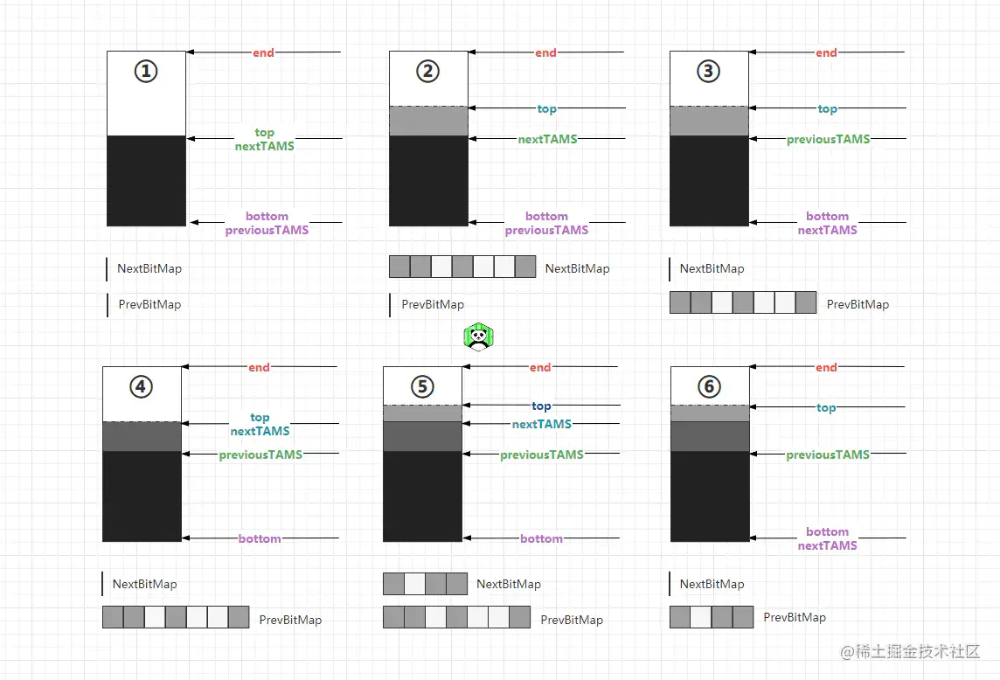

## 一、开创GC“分区回收”新时代的里程碑 - G1

  在《分代篇》中谈到：CMS收集器是JVM中开辟**并发收集**的里程碑，而本次的主角G1则是开创GC**分区回收**新时代的里程碑。在G1之前，所有的收集器都是按部就班的执行“物理+逻辑分代”的收集原则，而在G1收集器中，开始正式将堆空间划分为“物理分区不分代”的内存结构，从此拉开了JVM分区回收的序幕。

  G1全称为`Garbage-First Garbage Collector`（垃圾优先收集器），该款收集器在JDK1.7时被引入Java，在1.7之后，我们可以通过参数`-XX:+UseG1GC`装配它。G1是一款专门针对于拥有多核处理器和大内存的机器的收集器，在满足了GC响应时间的延迟可控的情况下，也会尽可能提高的程序的吞吐量，官方推出该款收集器的目的在于：打算使用G1替换CMS收集器，并且让G1担当起全功能收集器的重任和期望，成为JVM中的第一款能够驾驭一切的**全功能垃圾收集器**。

G1收集器具备如下特性：

- ①与CMS收集器一样，能够与用户线程同时执行，完成并发收集。
- ②GC过程会有整理内存的过程，不会产生内存碎片，并且整理空闲内存速度更快。
- ③GC发生时，停顿时间可控，可以让程序更大程度上追求低延迟。
- ④追求低延迟的同时，尽可能会保证高吞吐量。
- ⑤对于堆的未使用内存可以返还给操作系统。

接下来我们首先以G1的内存划分为起点出发，对该款收集器进行全面剖析。

### 1.1、G1收集器的堆空间内存划分

在G1收集器之前，Java的堆空间大致都长这个样子：
 
 到了JDK1.9时，堆空间慢慢的开始了划时代的改变，在此之前，堆空间的布局都是采用分代存储的方式，无论从逻辑上还是从物理内存上，都是分代的。但是到了Java9的时候，因为默认GC器改为了G1，所以堆中的内存区域被划为了一个个的`Region`区。

  每个分区都可能是年轻代也可能是老年代，但是在同一时刻只能属于某个代。在运行时，每个分区都会被打上唯一的分区标识。
 不过在G1收集器中，年轻代`Eden`区、幸存区`Survivor`、老年代`Old`区这些概念依旧还存在，但却成为了逻辑上的概念，这样做的好处在于：也可以复用之前分代框架的逻辑，同时也满足了Java对象**朝生夕死**的特性。

> 不过G1收集器虽然在逻辑上存在分代的概念，但不再是物理隔阂了，也就是指在物理内存上是不分代的，内存空间会被划分为一个个的`Region`区，这样做的好处在于：JVM不需要再为堆空间分配连续的内存，堆空间可以是不连续物理内存来组成`Region`的集合。
>  同时也带来了额外的好处：有的`Region`区内垃圾对象特别多，有的分区内垃圾对象很少，G1可以优先回收垃圾对象特别多的`Region`区，这样可以花费较少的时间来回收垃圾，这也就是G1名字的由来，即垃圾优先收集器。
>  在运行时，G1收集器会将堆空间变为如下结构：


 G1将Java堆划分为多个大小相等的独立的`Region`区域，不过在`HotSpot`的源码`TARGET_REGION_NUMBER`定义了`Region`区的数量限制为`2048`个（实际上允许超过这个值，但是超过这个数量后，堆空间会变的难以管理）。

> 一般`Region`区的大小等于堆空间的总大小除以2048，比如目前的堆空间总大小为8GB，就是`8192MB/2048=4MB`，那么最终每个`Region`区的大小为`4MB`，当然也可以用参数`-XX:G1HeapRegionSize`强制指定每个`Region`区的大小，但是不推荐，毕竟默认的计算方式计算出的大小是最适合管理堆空间的。
>  对于这块的逻辑，在HotSpot源码的`/share/vm/gc_implementation/g1/heapRegion.cpp`文件中定义了具体实现，具体可以参考其内部的`HeapRegion::setup_heap_region_size(size_t initial_heap_size, size_t max_heap_size)`函数。

  默认新生代对堆内存的初始占比是5%，如果堆大小为8GB，那么年轻代占据`400MB`左右的内存，对应大概是100个`Region`区，可以通过`-XX:G1NewSizePercent`设置新生代初始占比。
 在Java程序运行中，JVM会不停的给新生代增加更多的`Region`区，但是最多新生代的占比不会超过堆空间总大小的60%，可以通过`-XX:G1MaxNewSizePercent`调整（也不推荐，如果超过这个比例，年老代的空间会变的很小，容易触发全局GC）。新生代中的`Eden`区和`Survivor`区对应的`Region`区比例也跟之前一样，默认8:1:1，假设新生代现在有400个`Region`，那么整个新生代的占比则为`Eden=320,S0/From=40,S1/To=40`。

  G1中的年老代晋升条件和之前的无差，达到年龄阈值的对象会被转入年老代的`Region`区中，不同的是对于大对象的分配，在G1中不会让大对象进入年老代，在G1中由专门存放大对象的`Region`区叫做`Humongous`区，如果在分配对象时，判定出一个对象属于大对象，那么则会直接将其放入`Humongous`区存储。

> 在G1中，判定一个对象是否为大对象的方式为：对象大小是否超过单个普通`Region`区的50%，如果超过则代表当前对象为大对象，那么该对象会被直接放入`Humongous`区。比如：目前是8GB的堆空间，每个`Region`区的大小为`4MB`，当一个对象大小超过`2MB`时则会被判定为属于大对象。如果程序运行过程中出现一个“巨型对象”，当一个`Humongous`区存不下时，可能会横跨多个`Region`区存储它。

  `Humongous`区存在的意义：可以避免一些“短命”的巨型对象直接进入年老代，节约年老代的内存空间，可以有效避免年老代因空间不足时的GC开销。

  当堆空间发生全局GC(`FullGC`)时，除开回收新生代和年老代之外，也会对`Humongous`区进行回收。

> 其实在[《JVM成神路第四章：JVM运行时内存划分》](https://juejin.cn/post/7057538798686568461)中也提及过：逻辑分代+物理分区的结构是堆空间最佳的方案，所以G1的这种结构也是最理想的结构，但后续的ZGC、ShenandoahGC收集器中，因为实现方面的某些原因，导致最终无法采用这种结构。

### 1.2、G1收集器GC类型

G1中主要存在`YoungGC、MixedGC`以及`FullGC`三种GC类型，这三种GC类型分别会在不同情景下被触发。

#### 1.2.1、YoungGC

  前面提及过，G1对于整个堆空间所有的`Region`区不会在一开始就全部分配完，无论是新生代、幸存区以及年老代在最开始都是会有初始数量的，在程序运行过程中会根据需求不断增加每个分代区域的`Region`数量。

  所以`YoungGC`并非说`Eden`区放满了就会立马被触发，在G1中，当新生代区域被用完时，G1首先会大概计算一下回收当前的新生代空间需要花费多少时间，如果回收时间远远小于参数`-XX:MaxGCPauseMills`设定的值，那么不会触发`YoungGC`，而是会继续为新生代增加新的`Region`区用于存放新分配的对象实例。直至某次`Eden`区空间再次被放满并经过计算后，此次回收的耗时接近`-XX:MaxGCPauseMills`参数设定的值，那么才会触发`YoungGC`。

  G1收集器中的新生代收集，依旧保留了分代收集器的特性，当`YoungGC`被触发时，首先会将目标`Region`区中的存活对象移动至幸存区空间（被打着`Survivor-from`区标志的`Region`）。同时达到晋升年龄标准的对象也会被移入至年老代`Region`中存储。

> 值得注意的是：G1收集器在发生`YoungGC`时，复制移动对象时是采用的多线程并行复制，以此来换取更优异的GC性能。
>  用户如若未曾显式通过`-XX:MaxGCPauseMills`参数设定GC预期回收停顿时间值，那么G1默认为`200ms`。

#### 1.2.2、MixedGC

  `MixedGC`翻译过来的意思为混合型GC，而并非是指`FullGC`。当整个堆中年老代的区域占有率达到参数`-XX:InitiatingHeapOccupancyPercent`设定的值后触发`MixedGC`，发生该类型GC后，会回收所有新生代`Region`区、部分年老代`Region`区（会根据期望的GC停顿时间选择合适的年老代`Region`区优先回收）以及大对象`Humongous`区。

>   正常情况下，G1垃圾收集时会先发生`MixedGC`，主要采用复制算法，在GC时先将要回收的`Region`区中存活的对象拷贝至别的`Region`区内，拷贝过程中，如果发现没有足够多的空闲`Region`区承载拷贝对象，此时就会触发一次`Full GC`。

#### 1.2.3、FullGC

  当整个堆空间中的空闲`Region`不足以支撑拷贝对象或由于元数据空间满了等原因触发，在发生`FullGC`时，G1首先会停止系统所有用户线程，然后采用单线程进行标记、清理和压缩整理内存，以便于清理出足够多的空闲`Region`来供下一次`MixedGC`使用。但该过程是单线程串行收集的，因此这个过程非常耗时的(`ShenandoahGC`中采用了多线程并行收集)。

> 其实G1收集器中并没有FullGC，，G1中的FullGC是采用serial old FullGC。因为G1在设计时的初衷就是要避免发生FullGC，如果上述两种GC发生后还是无法使得程序恢复正常执行，最终就会触发SerialOld收集器的FullGC。

### 1.3、G1收集器垃圾回收过程

G1收集器一般在发生GC时执行过程大致会分为四个步骤（主要指`MixedGC`）：

- ①初始标记（`InitialMark`）：先触发`STW`，然后使用单条GC线程快速标记`GCRoots`直连的对象。
- ②并发标记（`ConcurrentMarking`）：与CMS的并发标记过程一致，采用多条GC线程与用户线程共同执行，根据`Root`根节点标记所有对象。
- ③最终标记（`Remark`）：同CMS的重新标记阶段，主要是为了纠正并发标记阶段因用户操作导致的错标、误标、漏标对象。
- ④筛选回收（`Cleanup`）：先对各个`Region`区的回收价值和成本进行排序，找出「回收价值最大」的`Region`优先回收。

> G1收集器正是由于「筛选回收」阶段的存在，所以才得以冠名「垃圾优先收集器」。在该阶段中，对各个`Region`区排序后，G1会根据用户指定的期望停顿时间（即`-XX:MaxGCPauseMillis`参数设定的值）选择「价值最大且最符合用户预期」的`Region`区进行回收，举个例子：
>  假设此时年老代空间共有`800`个`Region`区，并且都满了，所以此刻会触发GC。但根据GC的预期停顿时间值，本次GC只能允许停顿`200ms`，而G1经过前面的成本计算后，大致可推断出：本次GC回收`600`个`Region`区恰好停顿时间可控制在`200ms`左右，那么最终就会以「回收`600`个`Region`区」为基准触发GC，这样则能尽量确保GC导致的停顿时间可以被控制在我们指定的范围之内。

  不过值得注意的是：筛选回收阶段在G1收集器中是会停止所有用户线程后，采用多线程并行回收的。但实际上这个过程中可以与用户线程一起执行做到并发收集的，但因为G1只回收一部分`Region`区，停顿时间是可控的，因此停止用户线程后回收效率会大幅度提高。同时，假设实现并发回收，则又需要考虑用户线程执行带来的一些问题，所以综合考虑，G1中回收阶段采用了发生`STW`方案完成（在后续的`ZGC、ShenandoahGC`收集器中实现了并发回收），G1收集过程如下：
 
 在G1中不管是新生代还是年老代，回收算法都是采用复制算法，在GC发生时都会将一个`Region`区中存活的对象复制到另外一个`Region`区内。同比之前的CMS收集器采用的标-清算法而言，这种方式不会造成内存碎片，因此也不需要花费额外的成本整理内存。

> 但自`G1`开始，包括之后的`ZGC、ShenandoahGC`收集器，从每个`Region`区角度看来是采用的复制算法，但从堆空间整体看来，则是采用了标-整算法，这也是所谓的“**局部复制，全局标-整**”。
>  这两种算法无论是那种都不会造成内存碎片产生，带来的好处是：在为大对象进行内存分配时，不会因为找不到连续的内存空间提前触发下一次GC，有利于程序长期运行，尤其是在大内存情况下的堆空间，带来的优势额外明显。

*不过注意：在内存较小的堆空间情况下，CMS的表现会优于G1收集器，平衡点在`6~8GB`左右。*

### 1.4、G1中三色标记-漏标问题解决方案剖析

  在[《GC分代篇》](https://juejin.cn/post/7075258758196101156)中曾提及过：CMS收集器拉开了并发收集的新序幕，而并发收集的核心在于**三色标记算法**，但三色标记又注定着会出现漏标问题，所以接下来探讨一下G1收集器中解决三色算法漏标问题的手段：**STAB + 写屏障**。

> 对象的读写屏障的具体实现位于HotSpot源码的：`hotspot/src/share/vm/oops/oop.inline.hpp`文件，其内部是通过内联方法实现（HotSpot虚拟机中写屏障的实现有好几个版本）。

#### 1.4.1、STAB解决新分配对象的漏标问题

  STAB全称为`snapshot-at-the-beginning`，其存在的意义是为了维护G1收集器GC-并发收集的正确性。GC的正确性是保证存活的对象不被回收，简单点来说就是保证回收的都是垃圾。

> 如果是独占式收集，也就是发生STW后串行回收的方式，那GC时能够确保100%的正确性，但如若收集过程是与用户线程并发执行的，GC线程一边标记，用户线程一边执行，因而堆中的对象引用会存在变更，出现不稳定因素，最终导致标记的正确性无法得到保障。而为了解决该问题，在G1收集器中则引入了STAB机制。

  STAB机制中，会在GC开始标记前通过`RootTracing`生成的一张堆空间存活对象快照，在并发标记时，所有快照中当时存活的对象就会认为是存活的，标记过程中新分配的对象也会被标记为存活对象，不会被回收，G1通过这种方式则可确保新分配对象的GC正确性。不过在理解STAB具体操作前，先来看看`Region`区结构：

> 在G1划分的堆空间中，每个`Region`区都包含了五个指针，分别为：`bottom、previous TAMS、next TAMS、top`以及`end`，如下图：
>  

  五个指针释义如下：

- 两个`TAMS(top-at-mark-start)`指针，用于记录前后两次发生并发标记时的位置。
- `bottom`指针：当前`Region`区分配对象的起始位置。
- `top`指针：`Region`区目前已用空间的位置。
- `end`指针：当前`Region`区能够分配的最大位置。

> 如若感觉对于这几根指针不理解，那么你可以将`Region`区想象成一个透明的玻璃杯，`bottom`指针指向杯底位置、`top`指针指向杯中水位的那条线、`end`指针则是杯口/杯顶，也就是目前玻璃杯能够装水的最大容量。

并发标记发生后，STAB具体过程如下：

- ①第N次GC被触发，首先会将`Region`区的`top`指针赋值给`nextTAMS`，在「并发标记期间」新分配的对象都在`nextTAMS ~ top`指针之间，STAB机制能够确保这部分对象是绝对会被标记，默认为存活的。
- ②当「并发标记」即将结束时，会将`nextTAMS`指针赋值给`preTAMS`，STAB机制紧接着会为`bottom ~ preTAMS`之间的对象生成一个快照文件（`BitMap`结构），所有垃圾对象可通过快照文件识别出来。
- ③后续每次GC不断重复如上步骤。
- 如下示意图中演示了两轮GC并发标记过程：
   
- ①阶段是初始标记阶段，发生STW，将目标`Region`区的`Top`赋值给`nextTAMS`。
- ①~②阶段是并发标记阶段，GC线程与用户线程一同执行，并发标记区内所有存活对象。
- ②阶段中，`nextTAMS ~ top`指针之间是新分配的对象，这些对象被称为「隐式对象」，同时会使用一个`BitMap`开始记录「并发标记」期间标记的对象地址。
- ③阶段则是清除回收阶段，将`nextTAMS`赋值给`preTAMS`（包括`BitMap`中的标记数据也会一同赋值给`PrevBitMap`），然后清理`bottom ~ preTAMS`之间的所有垃圾对象。
- 对于并发标记阶段产生的「隐式对象」会在下次GC回收时再清除，如上图中的阶段⑥，会清除第一次GC-并发标记时产生的新对象。这也是STAB机制存在的弊端，会在一定程度上造成浮动垃圾出现。

> 最终G1收集器中，通过如上机制确保了并发标记过程中，新对象不会漏标（因为压根没标记新产生的对象，直接默认为所有新对象都是活的，至于新对象到底是死是活，这件事情则留给下次GC来处理）。

#### 1.4.2、STAB+写屏障解决引用更改对象的漏标问题

  对于新分配的对象漏标问题在前面已经阐述过了，那么G1收集器又是如何解决「并发标记」过程中，原有对象引用发生更改导致的漏标问题呢？引用分代篇中的片段，如下：

> ①一条用户线程在执行过程中，断开了一个未标记的白色对象连接，然后该对象又被一个已经标记成黑色的对象建立起了引用连接。如下图：
>  
>  白色对象断开了左侧灰色对象的引用，又与右侧的黑色对象建立了新的引用关系。

> ②一条用户线程在执行过程中，正好在GC线程标记时，将一个灰色对象与一个未标记的白色对象之间的引用连接断开了，然后当GC标记完成这个灰色对象，将其标记为黑色后，之前断开的白色对象又重新与之建立起了引用关系。如下图：
>  
>  GC标记前，白色对象断开了与灰色对象的引用，四秒钟之后GC标记灰色对象完成，而此时恰巧白色对象又重新与标记结束后成为黑色的对象重新建立了引用关系。

  而当出现这两种情况时，因为重新建立引用的白色对象“父节点”已经被标记黑色了，所以GC线程不会再次标记该对象以及其成员对象，所以这些白色对象会被一直停留在白色集合中。最终导致的结果就是这些依旧存在引用的存活对象会被“误判”为垃圾对象清除掉。而这种情况会直接影响到应用程序的正确性，是不可接受的。

> 先来思考一下引起漏标问题的原因：
>  条件一：灰色对象断开了与白色对象的引用（直接引用或间接引用都可）。
>  条件二：已经标为黑色的对象重新与白色对象建立了引用关系。
>  只有当一个对象同时满足了如上两个条件时才可发生漏标问题。
>  上个简单的代码案例理解一下：

```java
java复制代码Object X = obj.fieldX; // 获取obj.fieldX成员对象
obj.fieldX = null; // 将原本obj.fieldX的引用断开
objA.fieldX = X; // 将断开引用的X白色对象与黑色对象objA建立引用
```

  从如上代码角度来看，假设`obj`是一个灰色对象，此时先获取它的成员`fieldX`并将其赋值给变量`X`，让其堆中实例与变量`X`保持着引用关系。紧接着再将`obj.fieldX`置空，断开与`obj`对象的引用关系，最后再与黑色对象`objA`建立起引用关系，最终关系如下：

> 灰色对象`obj`，白色对象`obj.fieldX/X`，黑色对象`objA`。
>  白色对象`X`在GC机制标记灰色对象`obj`成员属性之前，与灰色对象断开了引用，然后又“勾搭”上了黑色对象`objA`，此刻白色对象`X`就会被永远停留在白色集合中，直至清除阶段到来，被“误判”为垃圾回收掉。

  在CMS中为解决该问题的手段为：写后屏障+增量更新，采用了写后屏障记录了更改引用的对象，然后通过溯源对发生改动的节点进行了重新扫描。而G1中则是通过STAB+写前屏障解决该问题，如下：

```c++
c++复制代码// HotSpot中对象字段赋值逻辑
void oop_field_store(oop* field, oop new_value) { 
    *field = new_value; // 赋值操作：新值替换老值
} 

// HotSpot中对象字段写屏障（最容易理解的实现版本）
void oop_field_store(oop* field, oop new_value) {
    pre_write_barrier(field); // 写前屏障
    *field = new_value; // 赋值操作：新值替换老值
    post_write_barrier(field, value);  // 写后屏障
} 
```

G1收集器会通过写前屏障，在引用被更改前先记录一下原本的引用信息，如下：

```c++
c++复制代码void pre_write_barrier(oop* field) {
  // 处于GC并发标记阶段且该对象没有被标记（访问）过
  if($gc_phase == GC_CONCURRENT_MARK && !isMarkd(field)) { 
      oop old_value = *field; // 获取旧值
      remark_set.add(old_value); // 记录  原来的引用对象
  }
}
```

  G1中的这种做法思路为：保留GC开始时的对象图关系，即原始快照（`SATB：Snapshot At The Beginning`），并发标记过程会以最初的对象图关系进行访问，就算并发标记过程中某个对象的引用信息发生了改变，G1会通过写前屏障记录原有的对象引用关系，依旧会按照最初的对象图快照进行标记。

> G1处理该问题时的思路非常简单，总而言之一句话：并发标记过程中，我不管你的引用关系怎么改变，我反正就跟着最开始的对象图关系进行标记。
>  值得额外注意的是：GC开始前的快照是个逻辑上的概念，其实本质上G1是一直通过写前屏障维护着该快照，从而达到依据「原始快照」进行标记的目标。
>  G1是通过破坏「条件一：灰色对象断开了与白色对象的引用。」解决了漏标问题。

  上述过程中的源码并非G1的真正实现，仅是伪代码逻辑便于各位理解，真正的实现位于`G1SATBCardTableModRefBS::enqueue(oop pre_val)`函数中。其实在G1中引用发生更改时，会把原引用保存到`satb_mark_queue`中，每条线程都自带一个`satb_mark_queue`。在下一次的并发标记阶段，会依次处理`satb_mark_queue`中的对象，确保这部分对象在本轮GC中是存活的。

- 这样STAB就保证了真正存活的对象不会被GC误回收，但同时也造成了某些应该被回收的垃圾对象逃过了GC，从而导致产生许多额外的浮动垃圾(`float garbage`)。

### 1.5、G1中解决跨代引用手段 - RSet

  在分代篇中曾谈到过：CMS以及之前的大部分的分代收集器为了解决跨代引用问题，实现记忆集时，都采用的为卡表`CardTable`的结构，而在G1中则实现了一种新的数据结构：`Remembered Set`，简称为`RSet`，在有些地方也被称为“双向卡表”。

  在每个`Region`区中都存在一个`RSet`，其中记录了其他`Region`中的对象引用当前`Region`中对象的关系，也就是记录着“**谁引用了我的对象**”，属于`points-into`结构。而之前的卡表则是属于`points-out`结构，记录着“**我引用了谁的对象**”，在卡表中存在多个卡页，每个卡页记录着一定范围（`512KB`）的堆。

> `RSet`也好，`CardTable`也罢，其实都是记忆集的一种具体实现，你也可以将`RSet`理解成一种`CardTable`的进阶实现方式。G1中的`RSet`本质上就是一个哈希表结构（`HashTable`），`Key`为其他引用当前区内对象的`Region`起始地址，`Value`则是一个集合，里面的元素为其他`Region`中每个引用当前区内对象的地址。
>  在虚拟机运行期间，`RSet`中的引用关系靠`post-write barrier`和`Concurrent refinement threads`来维护。

  当发生YGC时，扫描标记对象时，只需要选定目标新生代`Region`的`RSet`作为根集，这些`RSet`中记录了`Old → Young`的跨代引用，GC扫描时只需要扫描这些`RSet`即可，从而避免了扫描整个`Old`区。而当G1发生`MixedGC`时，`Old`类型的`Region`也有`RSet`记录着`Old → Old`的引用关系，而`Old → Young`的跨代引用可以从`Young`类型的`Region`中得到，这样在发生`MixedGC`时也不会出现整堆扫描的情况，所以引入`RSet`在很大程度上减少了大量的GC工作。

> *实际上G1中的`RSet`对内存的开销也并不小，当JVM中分区较多且运行时间较长的情况下，这块的内存开销可能会占用到`20%`以上。*

### 1.6、G1收集器总结

  G1收集器是开辟分区收集的里程碑，同时它也被称为垃圾优先收集器，因为G1会在后台维护着一个优先列表：`CollectionSet（CSet）`，它记录了GC要收集的`Region`集合，集合里的`Region`可以是任意年代的。
 每次GC发生时会根据「用户指定的期望停顿时间或默认的期望停顿时间」，优先从列表中选择「回收价值最大」`Region`区回收，这也是G1名字的由来。比如：

> 一个`Region`花`120ms`能回收`10MB`垃圾，而另外一个`Region`花`80ms`能回收`20MB`垃圾，在回收时间有限情况下，G1当然会优先选择后面这个“性价比”更高的`Region`回收。这种使用`Region`划分内存空间以及有优先级的区域回收方式，能够确保G1收集器在有限时间内，可以尽可能达到更高的收集效率。

  毋庸置疑的一点，可以由用户指定「GC回收过程中的期望停顿时间」是G1的一大亮点，通过设置不同的「期望停顿时间」可以使得G1在任意场景下，都能在「吞吐量」和「响应时间/低延迟」之间取得很好的平衡。但这里设置的「期望停顿时间」值必须要符合实际，如果想着：如果设置成`20ms`岂不是超低延迟了？这是并不现实的，只能称为异想天开，因为G1回收阶段也需要发生STW的来根扫描、复制对象、清理对象的，所以这个「期望停顿时间」值也得有个度。与分代篇中分析PS收集器提到的一样：

> 在追求响应时间的时候必然会牺牲吞吐量，而追求吞吐量的同时必然会牺牲响应时间。**鱼和熊掌不可兼得矣。**

  G1的默认的「停顿时间」目标为`200ms`，但一般而言，实际过程中中占到[几十 ~ 三百毫秒之间]都很正常，但如果我们把停顿时间调得非常低，譬如前面的`20ms`， 很可能出现的结果就是：

> 由于停顿目标时间太短，导致每次选出来回收的目标`Region`只占堆内存很小的一部分， 收集器收集的速度逐渐跟不上分配器分配的速度，最终造成垃圾慢慢堆积，从而拖垮整个程序触发单线程的`FullGC`。
>  因为很可能一开始收集器还能从空闲的堆内存中获得一些喘息的时间，但程序运行的时间越长，对内存造成的负担就越重，最终占满堆引发`FullGC`，反而降低整体性能，所以实际应用中，通常把「期望停顿时间」设置为`100ms~300ms`之间会是比较合理的选择。

### 1.7、什么场景下适合采用G1收集器的建议

- ①堆空间内`50%`以上的内存会被存活占用的应用
- ②分配速度和晋升速度特别快的应用
- ③至少`8GB`以上堆内存的应用
- ④采用原本分代收集器GC时间会长达`1s+`的应用
- ⑤追求停顿时间在`500ms`以内的应用

## 二、一款源自于JDK11的性能魔兽 - ZGC

  在JDK11的时候，Java再次推出一款全新的垃圾回收器`ZGC`，它也是一款基于分区概念的内存布局GC器，这款GC器是真正意义上的不分代收集器，因为它无论是从逻辑上，还是物理上都不再保留分代的概念。

> ZGC的内存结构实际上被称为分页，源于`Linux Kernel 2.6`中引入了标准的大页`huge page`，大页存在两种尺度，分别为`2MB`以及`1GB`。
>  Linux内核引入大页的目的主要在于为了迎合硬件发展，因为在云计算、弹性调度等技术的发展，服务器硬件的配置会越来越高，如果再依照之前标准页`4KB`的大小划分内存，那最终反而会影响性能。

  `ZGC`主打的是超低延迟与吞吐量，在实现时，`ZGC`也会在尽可能堆吞吐量影响不大的前提下，实现在任意堆内存大小下都可以把垃圾回收的停顿时间限制在`10ms`以内的低延迟。ZGC最初是源于`Azul System`公司的`C4(Concurrent Continuously Compacting Collector)`收集器与`PauselessGC`，Java引入ZGC的目的主要有如下四点：

- ①奠定未来GC特性的基础。
- ②为了支持超大级别堆空间（`TB`级别），最高支持`16TB`。
- ③在最糟糕的情况下，对吞吐量的影响也不会降低超过15%。
- ④GC触发产生的停顿时间不会偏差`10ms`。

### 2.1、ZGC堆空间内存划分

  在ZGC中，也会把堆空间划分为一个个的`Region`区域，但ZGC中的`Region`区不存在分代的概念，它仅仅只是简单的将所有`Region`区分为了大、中、小三个等级，如下： 

- 小型区/页(`Small`)：固定大小为`2MB`，用于分配小于`256KB`的对象。
- 中型区/页(`Medium`)：固定大小为`32MB`，用于分配`>=256KB ~ <=4MB`的对象。
- 大型区/页(`Large`)：没有固定大小，容量可以动态变化，但是大小必须为`2MB`的整数倍，专门用于存放`>4MB`的巨型对象。但值得一提的是：每个`Large`区只能存放一个大对象，也就代表着你的这个大对象多大，那么这个`Large`区就为多大，所以一般情况下，`Large`区的容量要小于`Medium`区，并且需要注意：`Large`区的空间是不会被重新分配的（稍后分析）。

源码中的注释如下：
 

> 实际上JDK11中的ZGC并不是因为要抛弃分代理念而不设计分代的堆空间的，因为实际上最开始分代理念被提出的本质原因是源于「大部分对象朝生夕死」这个概念的，而实际上大部分Java程序在运行时都符合这个现象，所以逻辑分代+物理不分代是堆空间最好的结构方案。但问题在于：ZGC为何不设计出分代的堆空间结构呢？其实本质原因是分代实现起来非常麻烦且复杂，所以就先实现出一个比较简单可用的单代版本，后续可能会优化改进。

#### 2.1.1、TB级别内存出处：NUMA架构

  前面提到过：“ZGC的目的是为了能够驾驭TB级别的超大堆空间”，但问题在于很多小伙伴的生产环境中，硬盘都不一定能够达到TB级别，那服务器怎么能有`TB`级的内存用于分配Java堆呢？而想要搞明白这个点就不得不提及到[`NUMA`架构](https://link.juejin.cn?target=https%3A%2F%2Fbaike.baidu.com%2Fitem%2FNUMA%2F6906025%3Ffr%3Daladdin)，当然，与之对应的则为`UMA`架构，如下：

> `UMA`架构：`UMA`即`Uniform Memory Access Architecture`（统一内存访问），`UMA`也就是一般正常电脑的常用架构，一块内存多颗CPU，所有CPU在处理时都去访问一块内存，所以必然就会出现竞争（争夺内存主线访问权），而操作系统为了避免竞争过程中出现安全性问题，注定着也会伴随锁概念存在，有锁在的场景定然就会影响效率。同时CPU访问内存都需要通过总线和北桥，因此当CPU核数越来越多时，渐渐的总线和北桥就成为瓶颈，从而导致使用`UMA/SMP`架构机器CPU核数越多，竞争会越大，性能会越低。

> `NUMA`架构：`NUMA`即`Non Uniform Memory Access Architecture`（非统一内存访问），`NUMA`架构下，每颗CPU都会对应有一块内存，具体内存取决于处理器的内存位置，一般与CPU对应的内存都是在主板上离该CPU最近的，CPU会优先访问这块内存，每颗CPU各自访问距离自己最近的内存，效率自然而然就提高了。
>  但上述内容并非重点，重点是`NUMA`架构允许多台机器共同组成一个服务供给外部使用，`NUMA`技术可以使众多服务器像单一系统那样运转，该架构在中大型系统上一直非常盛行，也是高性能的解决方案，尤其在系统延迟方面表现都很优秀，因此，实际上堆空间也可以由多台机器的内存组成。
>  **ZGC是能自动感知NUMA架构并可以充分利用NUMA架构特性的一款垃圾收集器。**

### 2.2、ZGC回收过程

ZGC收集器在发生GC时，其实主要操作只有三个：标记、转移与重定位。

- 标记：从根节点出发标记所有存活对象。
- 转移：将需要回收区域中的存活对象转移到新的分区中。
- 重定位：将所有指向转移前地址的指针更改为指向转移后的地址。

> 实际上重定位动作会在标记阶段中的执行，在标记的时候如果发现指针还是引用老的地址则会修正成新的地址，然后再进行标记。
>  但是值得注意的是：第一次GC发生时，并不会发生重定位动作，因为已经标记完了，这个时候只会记录一下原本的对象被转移到哪儿去了。只有当第二次GC发生时，开始标记的时候发现某个对象被转移了，但引用还是老的，此时才会发生重定位操作，即修改成新的引用地址。

  ZGC中的一次垃圾回收过程会被分为十个步骤：**初始标记、并发标记、再次标记、并发转移准备：[非强引用并发标记、重置转移集、回收无效页面（区）、选择目标回收页面、初始化转移集（表）]、初始转移、并发转移**，其中只有初始标记、再次标记、初始转移阶段会存在短暂的STW，其他阶段都是并发执行的。

> ZGC回收过程的十个步骤中，非强引用并发标记、重置转移集、回收无效页面（区）、选择目标回收页面、初始化转移集（表）这些步骤都是并发的，都会发生在并发转移准备阶段内，如下：
>  

- ①初始标记
   这个阶段会触发STW，仅标记根可直达的对象，并将其压入到**标记栈**中，在该阶段中也会发生一些其他动作，如重置 TLAB、判断是否要清除软引用等。

- ②并发标记
   根据「初始标记」的根对象开启多条GC线程，并发遍历对象图，同时也会统计每个分区/页面中的存活对象数量。
   标记栈

- ③再次标记
   这个阶段也会出现短暂的STW，因为「并发标记」阶段中应用线程还是在运行的，所以会修改对象的引用导致漏标的情况出现，因此需要再次标记阶段来标记漏标的对象（如果此阶段停顿时间过长，ZGC会再次进入并发标记阶段重新标记）。

- ④非强引用并发标记和引用并发处理
   遍历前面过程中的非强引用类型根对象，但并不是所有非强根对象都可并发标记，有部分不能并发标记的非强根对象会再前面的「再次标记」阶段中处理。同时也会标记堆中的非强引用类型对象。

- ⑤重置转移集/表

  重置上一次GC发生时，转移表中记录的数据，方便本次GC使用。

  - 在ZGC中，因为在回收时需要把一个分区中的存活对象转移进另外一个空闲分区中，而ZGC的转移又是并发执行的，因此，一条用户线程访问堆中的一个对象时，该对象恰巧被转移了，那么这条用户线程根据原本的指针是无法定位对象的，所以在ZGC中引入了转移表`forwardingTable`的概念。
  - 转移表可以理解为一个`Map<OldAddress,NewAddress>`结构的集合，当一条线程根据指针访问一个被转移的对象时，如果该对象已经被转移，则会根据转移表的记录去新地址中查找对象，并同时会更新指针的引用。

- ⑥回收无效分区/页面
   回收物理内存已经被释放的无效的虚拟内存页面。ZGC是一款支持返还堆内存给物理机器的收集器，在机器内存紧张时会释放一些未使用的堆空间，但释放的页面需要在新一轮标记完成之后才能释放，所以在这个阶段其实回收的是上一次GC释放的空间。

- ⑦选择待回收的分区/页面
   ZGC与GC收集器一样，也会存在「垃圾优先」的特性，在标记完成后，整个堆中会有很多分区可以回收，ZGC也会筛选出回收价值最大的页面来作为本次GC回收的目标。

- ⑧初始化待转移集合的转移表

  初始化待回收分区/页面的转移表，方便记录区中存活对象的转移信息。

  - 注：每个页面/分区都存在一个转移表`forwardingTable`。

- ⑨初始转移
   这个阶段会发生STW，遍历所有`GCRoots`节点及其直连对象，如果遍历到的对象在回收分区集合内，则在新的分区中为该对象分配对应的空间。不过值得注意的是：该阶段只会转移根对象（也就是`GCRoots`节点直连对象）。

- ⑩并发转移
   这个阶段与之前的「并发标记」很相似，从上一步转移的根对象出发，遍历目标区域中的所有对象，做并发转移处理。

> 其实简单来说，ZGC的回收过程可以分为四大阶段：并发标记、并发转移准备、并发转移、并发重映射/定位。

  同时ZGC也是一款不分代的收集器，也就代表着ZGC中只存在一种GC类型，同时也不需要记忆集这种概念存在，因为是单代的堆空间，所以每次回收都是扫描所有页面，不需要额外解决跨代引用问题。

#### 2.2.1、为何Large区不能被重分配/转移呢？

  因为`Large`区中只会存储一个对象，在GC发生时标记完成后，直接决定是否回收即可，`Large`区中存储的对象并非不能转移到其他区，而是没有必要，本身当前`Large`区中就只有一个大对象，转移还得专门准备另外一个`Large`区接收，但本质上转不转移都不会影响，反而会增加额外的空间开销。

#### 2.2.2、ZGC的核心 - 染色指针（colored pointers）技术

  `ColoredPointers`，ZGC的核心技术之一，在此之前所有的GC信息保存在对象头中，但ZGC中的GC信息保存在指针内。同时，在ZGC中不存在指针压缩，因为ZGC中对于指针进行了改造，通过程序中的引用指针来实现了染色指针技术，由于染色指针对于指针的64个比特位全部都使用了，所以指针无法再进行压缩。
 染色指针也有很多其他称呼，诸如：颜色指针、着色指针等，其实都是一个意思，无非就是将64位指针中的几位拿出来用于标记对象此时的情况，ZGC中的染色指针用到了四种“颜色（状态）”，分别为：`Marked0、Marked1、Remapped、Finalizable`，如下：
 
 对于上图中指针的释义，源码注释如下：
 
 从注释中可看出：`0~41Bit`这42位是正常的地址记录，所以ZGC实际上最大能够支持`4TB`（理论上最大可以支持`16TB`）的堆内存，因为42位的地址最大寻址为`4TB(2^42=4TB)`。除开这42个地址位外，其他的位数释义如下：

- ```
  42~45Bit
  ```

  /4位：标志位

  - `Finalizable=1000`：此位与并发引用处理有关，表示这个对象只能通过`finalizer`才能访问。
  - `Remapped=0100`：设置此位的值后，表示这个对象未指向`RelocationSet`中（`relocation set`表示需要GC的`Region`分区/页面集合）。
  - `Marked1=0010`：标记对象，用于辅助GC。
  - `Marked0=0001`：标记对象，用于辅助GC。

- `46~63Bit`/18位：预留位，预留给以后使用。

> 不过我们在分析具体实现前，先来探讨几个问题。

> ①ZGC为何仅支持`4TB`（JDK13拓展到了`16TB`），不是还有很多位没用吗？
>  前面分析指针后得知，ZGC在指针中预留了18位没使用，那为什么不全部用上，让ZGC支持超级巨大的堆空间。其实这跟硬件和OS有关，因为`X86_64`架构的硬件只有48条地址总线，硬件的主板地址总线最宽只有`48bit`，其中4个是颜色位，就只剩下了44位了，所以受限于目前的硬件，ZGC最大就只能支持`2^44=16TB`内存。

> ②为什么会有两个`Marked`标识？
>  这是为了防止不同GC周期之间的标记混淆，所以搞了两个`Marked`标识，每当新的一次GC开始时，都会交换使用的标记位。例如：第一次GC使用`M0`，第二次GC就会使用`M1`，第三次又会使用`M0`.....，因为ZGC标记完所有分区的存活对象后，会选择分区进行回收，因此有一部分区域内的存活对象不会被转移，那么这些对象的标识就不会复位，会停留在之前的`Marked`标识（比如`M0`），如果下次GC还是使用相同`M0`来标记对象，那混淆了这两种对象。为了确保标记不会混淆，所以搞了两个`Marked`标识交替使用。

> ③为什么ZGC运行过程中指针的标记位变动不会影响对象的内存寻址？
>  这是因为ZGC的染色指针用到了一种叫做多重映射的技术，也就是指**多个虚拟地址指向同一个物理地址**，不管指针地址是`0001....`还是`0010.....`，或者`0100....`等等，最终对应的都是同一个物理地址。

OK，简单分析明白上述几个问题之后，再来看看ZGC基于染色指针的并发处理过程：

- 在第一次GC发生前，堆中所有对象的标识为：`Remapped`。
- 第一次GC被触发后，GC线程开始标记，开始扫描，如果对象是`Remapped`标志，并且该对象根节点可达的，则将其改为`M0`标识，表示存活对象。
- 如果标记过程中，扫描到的对象标识已经为`M0`，代表该对象已经被标记过，或者是GC开始后新分配的对象，这种情况下无需处理。
- 在GC开始后，用户线程新创建的对象，会直接标识为`M0`。
- 在标记阶段，GC线程仅标记用户线程可直接访问的对象还是不够的，实际上还需要把对象的成员变量所引用的对象都进行递归标记。

总归而言，在「标记阶段」结束后，对象要么是`M0`存活状态，要么是`Remapped`待回收状态。最终，所有被标记为`M0`状态的活跃对象都会被放入「活跃信息表」中。等到了「转移阶段」再对这些对象进行处理，流程如下：

- ZGC选择目标回收区域，开始并发转移。
- GC线程遍历访问目标区域中的对象，如果对象标识为`M0`并且存在于活跃表中，则把该对象转移到新的分区/页面空间中，同时将其标识修正为`Remapped`标志。
- GC线程如果扫描到的对象存在于活跃表中，但标识为`Remapped`，说明该对象已经转移过了，无需处理。
- 用户线程在「转移阶段」新创建的对象，会被标识为`Remapped`。
- 如果GC线程遍历到的对象不是`M0`状态或不在活跃表中，也无需处理。

  最终，当目标区域中的所有存活对象被转移到新的分区后，ZGC统一回收原本的选择的回收区域。至此，一轮GC结束，整个堆空间会正常执行下去，直至触发下一轮GC。而当下一轮GC发生时，会采用`M1`作为GC辅助标识，而并非`M0`，具体原因在前面分析过了则不再阐述。

> PS：在有些地方也把指针中的几个标识称为：**地址视图**。简单来说，地址视图指的就是此时地址指针的标记位，比如标记位现在是`M0`，那么此时的视图就是 `M0`视图。

##### 染色指针带来的好处

- ①一旦某个分区中的存活对象被移走，该分区就可以立即回收并重用，不必等到整个堆中所有指向该`Region`区的引用都被修正后才能清理。
- ②颜色指针可以大幅减少在GC过程中内存屏障的使用数量，ZGC只使用了读屏障。
- ③颜色指针具备强大的扩展性，它可以作为一种可扩展的存储结构用来记录更多与对象标记、重定位过程相关的数据，以便日后进一步提高性能。

#### 2.2.3、何谓转移表/集（ForwardingTable）？

  转移表`ForwardingTable`是ZGC确保转移对象后，其他引用指针能够指向最新地址的一种技术，每个页面/分区中都会存在，其实就是该区中所有存活对象的转移记录，一条线程通过引用来读取对象时，发现对象被转移后就会去转移表中查询最新的地址。同时转移表中的数据会在发生第二次GC时清空重置，也包括会在第二次GC时触发重映射/重定位操作。

### 2.3、ZGC - 读屏障解决对象漏标

  之前曾提及过：ZGC是通过读屏障的手段解决了对象漏标问题，读屏障也就相当于读取引用时的AOP，伪代码如下：

```c++
c++复制代码oop oop_field_load(oop* field) {
    pre_load_barrier(field); // 读屏障-读前操作
    return *field;
}

void pre_load_barrier(oop* field, oop old_value) {  
  if($gc_phase == GC_CONCURRENT_MARK && !isMarkd(field)) {
      oop old_value = *field;
      remark_set.add(old_value); // 记录读取到的对象
  }
}
```

  读屏障是在读取成员变量时，统统记录下来，这种做法是保守的，但也是安全的。因为前述分析对象漏标问题时，曾谈到过：引发漏标问题必须要满足两个条件，其中条件二为：「已经标为黑色的对象重新与白色对象建立了引用关系」，而黑色对象想要与白色对象重新建立引用的前提是：得先读取到白色对象，此时读屏障的作用就出来了，可以直接记录谁读取了当前白色对象，然后在「再次标记」重新标记一下这些黑色对象即可。

> 通过读屏障还有另外的作用，GC发生后，堆中一部分存活对象被转移，当应用线程读取对象时，可以利用读屏障通过指针上的标志来判断对象是否被转移，如果读取的对象已经被转移，那么则修正当前对象引用为最新地址（去转移表中查）。这样做的好处在于：下次其他线程再读取该转移对象时，可以正常访问读取到最新值。
>  当然，这种情况在有些地方也被称为：**ZGC的指针拥有“自愈”的能力。**

### 2.4、ZGC的垃圾回收什么情况下会被触发？

ZGC中目前会有四种机制导致GC被触发：

- ①定时触发，默认为不使用，可通过`ZCollectionInterval`参数配置。
- ②预热触发，最多三次，在堆内存达到`10%、20%、30%`时触发，主要时统计GC时间，为其他GC机制使用。
- ③分配速率，基于正态分布统计，计算内存`99.9%`可能的最大分配速率，以及此速率下内存将要耗尽的时间点，在耗尽之前触发GC「耗尽时间 - 一次GC最大持续时间 - 一次GC检测周期时间」。
- ④主动触发，默认开启，可通过`ZProactive`参数配置，距上次GC堆内存增长10%，或超过5分钟时，对比「距上次GC的间隔时间」和「49*一次GC的最大持续时间」，超过则触发。

### 2.5、ZGC总结

  ZGC因为是基于64位指针实现的染色指针技术，所以也就注定了ZGC并不能支持32位的机器。同时，ZGC通过多阶段的并发执行+几个短暂的STW阶段来达到低延迟的目的。
 ZGC最大的问题是浮动垃圾，假设ZGC的一次完整GC需要八分钟，在这期间由于新对象的分配速率很高，所以堆中会产生大量的新对象，这些新对象是不会被计入本次GC的，会被直接判定为存活对象，而本轮GC回收期间可能新分配的对象会有大部分对象都成为了“垃圾”，但这些“浮动垃圾”只能等待下次GC的时候进行回收。

  ZGC不会因为堆空间的扩大而增大停顿时间的原因在于：ZGC只会在处理根节点等阶段才会出现STW，而堆空间再怎么扩大，内存中的根节点数量不会出现质的增长，所以ZGC的停顿时间几乎不受限于内存大小。
 同时，ZGC与之前的收集器还有一点很大的不同在于：ZGC标记的是指针而并非对象，但最终达到的效果是等价的，因为所有对象以及所有指针都会被遍历。
 在标记和转移的阶段，每次从堆中读取一个指针时，这个指针都会经过`LVB(Loaded Value Barrier)`读屏障。这个读屏障会在不同的阶段做不同的事情，在标记阶段，它会把指针“修正”成最新的对象地址值；而在转移阶段，这个屏障会把读出的指针更新到对象的新地址上，并且把堆里的这个指针“修正”到原本的字段里。这样做的好处在于：就算GC时把对象移动了，读屏障也会发现并修正指针，于是对于用户线程层面而言，就永远都会持有更新后的有效指针，而不需要通过`stop-the-world`这种最粗粒度的同步方式来让GC与应用之间同步。

> 写在最后的话：**ZGC的不分代其实是它的缺点，因为对象都是满足朝生夕死的特性，ZGC不分代只是因为分代比较难实现。**

## 三、一个来自JDK12的性能神兽 - ShenandoahGC

  在JDK11中推出ZGC后，JDK12马不停蹄的推出了`ShenandoahGC`收集器，它与`G1、ZGC`收集器一样，都是基于分区结构实现的一款收集器。和ZGC对比，相同的是：它们的停顿时间都不会受到堆空间大小的影响，但`ShenandoahGC`与ZGC不同的是：

> ZGC是基于`colored pointers`染色指针实现的，而`ShenandoahGC`是基于`brooks pointers`转发指针实现。

  `ShenandoahGC`的内存布局与G1很相似，也会将堆内存划分为一个个 大小相同的`Region`区域，也同样有存放大对象的`Humongous`区，你可以把`ShenandoahGC`看做G1收集器的修改版，它比G1收集器实现上来说更为激进，一味追求极致低延迟。但`ShenandoahGC`和ZGC一样，也没有实现分代的架构，所以在触发GC时也不会有新生代、年老代之说，只会存在一种覆盖全局的GC类型。

### 3.1、ShenandoahGC收集过程

  `ShenandoahGC`的一次垃圾回收会由两个STW阶段以及两个并发执行阶段组成，在的GC被触发后，会开始对整个堆空间进行垃圾收集，过程如下：
 

- 初始标记阶段：标记`GCRoots`直接可达的对象，会发生STW，但非常短暂。
- 并发标记阶段：和用户线程一同工作，从根对象出发，标记堆中所有对象。
- 最终标记阶段：同比`G1、ZGC`中的重新标记阶段，会触发STW，会在该阶段中修正并发标记过程中由于用户线程修改引用关系的导致的漏标错标对象，使用STAB机制实现。同时在该阶段中也会选择出回收价值最大的区域作为目标区域等待回收。
- 并发回收阶段：与用户线程并发执行，会待回收区域中的存活对象复制到其他未使用的`Region`区中去，然后会将原本的`Region`区全部清理并回收。

  上述过程中，前面的阶段与`G1`差异不大，重点在于最后的回收阶段，它是与用户线程并发执行的，所以也会造成新的问题出现：

> 问题①：回收过程中，如果一个对象被复制到新的区域，用户线程通过原本指针访问时如何定位对象呢？
>  问题②：在并发回收过程中，如果复制的时候出现了安全性问题怎么办？

  这两个问题在`ShenandoahGC`中，前者通过了`BrooksPointers`转发指针解决，而后者则建立在转发指针的基础上，采用了读+写屏障解决，接下来看看`ShenandoahGC`的核心实现：`BrooksPointers`转发指针。

### 3.2、ShenandoahGC核心-BrooksPointers转发指针

  当对象被复制到新的区域时，用户线程如何根据指针定位到最新的对象地址呢？在前面的ZGC中可以通过染色指针+读屏障的方案获取到最新的地址，但在`ShenandoahGC`中却提出了另一种方案：`BrooksPointers`转发指针。

> 所谓的转发指针就是在每个对象的对象头前面添加了一个新的字段，也就是对象头前面多了根指针。对于未移动的对象而言，指针指向的地址是自己，但对于移动的对象而言，该指针指向的为对象新地址中的`BrooksPointers`转发指针，示意图如下：


 因为`ShenandoahGC`采用了转发指针技术，所以当用户线程访问一个对象时，需要首先先找到`BrooksPointers`，再通过该指针中的地址找到对象。

> 同时，如果对象被移动后，对象访问的流程就变成了这样：先找到旧的`BrooksPointers`，再根据旧的转发指针找到新的`BrooksPointers`，然后再根据新的转发指针找到对象。
>  相当于添加了一个句柄池的机制，类似于句柄访问的方式。

`ShenandoahGC`通过这种技术解决了被移动对象的访问问题，但带来弊端也很明显，每次访问都需要多上至少一次额外转发。

再来看看由于并发回收导致的线程安全问题，情况如下：

- ①GC线程正在复制旧对象去到新的区域。
- ②用户线程此时更新了原本对象的数据。
- ③GC线程将原本旧对象的转发指针指向新对象的转发指针。

  分析如上情况可以得知，因为GC线程已经复制对象了，只是还没来得及更新旧对象的转发指针，所以导致了用户操作落到了旧对象上面，从而出现了安全问题。而`ShenandoahGC`中则采用读、写屏障确保了步骤①、③是原子性的，从而解决了该问题。

### 3.3、ShenandoahGC的连接矩阵

  在G1中解决跨区引用是通过`RSet`这种记忆集的方式实现，而在`ShenandoahGC`为了记录跨区的对象引用，也提出了一种新的概念：连接矩阵，连接矩阵其实本质上类似于一个二维数组，如果第`N`个`Region`区中有对象指向`RegionM`区的对象，那么就在矩阵的N行M列中打上一个标记：
 
 如上图，`R-3`区的对象`A`引用了`R-5`区的对象`B`，而对象`B`又引用了`R-7`区中的对象`C`，那么最终在矩阵上，这些跨区引用对象所在位置就会被打上对应的标记，在回收时通过这张矩阵图就可以得出哪些`Region`之间产生了跨区引用。

## 四、高性能垃圾收集器总结

  在三款高性能的GC器中，就目前而言，唯一保留了分代思想的是G1，而`ZGC、ShenandoahGC`并非是因为不分代性能好一些而不实现的，而是因为实现难度大所以才没有实现，在之前就曾提及过：逻辑分代+物理分区的结构才是最佳的，所以不分代的结构对于`ZGC、ShenandoahGC`来说，其实是一个缺点，因为不分代的堆空间，每次触发GC时都会扫描整堆。

  G1收集器在后续的JDK版本中一直在做优化，因为G1是打算作为全能的默认GC器来研发的，但G1收集器最大的遗憾和短板在于：回收阶段需要发生STW，所以导致了使用G1收集器的程序会出现不短的停顿。
 而`ZGC、ShenandoahGC`两款收集器，前者采用了染色指针+读屏障技术做到了并发回收，后者通过转发指针+读写屏障也实现了并发回收。因此，使用这两款收集器的应用程序，在运行期间触发GC时，造成的停顿会非常短暂，所以如果你的项目对延迟要求非常低，那么它两个是很不错的选择。
 不过ZGC由于承诺了最大不超过`10ms`的低延迟，所以最恶劣的情况可能会导致降低`15%`左右的吞吐量，因此，如果你想使用它，那么要做好扩大堆空间的准备，因为只能通过加大堆空间来做到提升吞吐量。而`ShenandoahGC`因为额外增加了转发指针，所以也存在两个问题：
 ①访问对象时，速度会更慢，因为需要至少经过一次地址转发。
 ②需要更多的空间存储多出来的这根指针。
 同时，`ShenandoahGC`是没有给出类似于ZGC的“最大`10ms`的低延迟”承诺，所以就现阶段而言，`ShenandoahGC`性能会比ZGC差一些，但唯一的优势在于：它可以比ZGC支持更大的堆空间（虽然没啥用）。

### 4.1、G1、ZGC与ShenandoahGC区别

| 对比项           | G1                       | ZGC      | ShenandoahGC |
| ---------------- | ------------------------ | -------- | ------------ |
| 是否支持并发回收 | 不支持                   | 支持     | 支持         |
| 最大堆空间大小   | 达到上百GB停顿时间会很长 | 16TB     | 256TB        |
| 平均停顿         | 500ms以内                | 10ms以内 | 1~20ms左右   |
| 是否支持指针压缩 | 支持                     | 不支持   | 支持         |

其实从上面的数据来看，好像G1收集器压根比不上其他两款，但实际上并非如此，因为每款收集器都会有自己的适用场景，就好比在几百`MB`的堆空间中，装载ZGC就一定比G1好吗？其实是不见得的。因为G1中存在分代的逻辑，而ZGC是单代的，所以如果在分配速率较快的情况下，ZGC可能会跟不上（因为ZGC的整个GC过程很久），而G1则可以完全胜任。