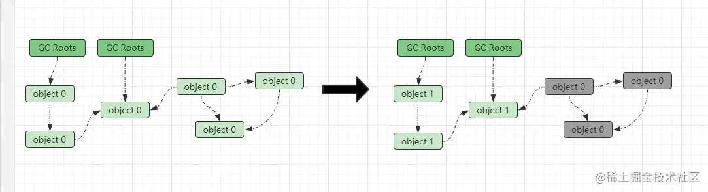

## 一、如何判断存活对象？

GC机制只会回收运行过程中产生的“垃圾”对象，对于存活对象是不会进行回收的，那么在运行过程中又该如何判断一个对象是否为“垃圾”呢？“垃圾”是指运行过程中已经没有任何指针指向的对象，这类对象就是GC机制回收的目标。

在编程中主要存在两种垃圾判定算法，一种为**引用计数算法**，另一种为**可达性分析算法**。

### 1.1、引用计数算法

创建出的每个对象自身都携带一个引用计数器，主要用于记录自身的引用情况。当一个指针指向当前对象时，该计数器会`+1`，如下：

> ```
> Object obj = new Object();
> ```

当`Object`的对象实例被创建出来后，计数器会被初始化为`1`，因为局部变量`obj`的指针引用了该实例对象。而后续执行过程中，又有另外一个变量引用该实例时，该对象的引用计数器会`+1`。而当方法执行结束，栈帧中局部变量表中引用该对象的指针随之销毁时，当前对象的引用计数器会`-1`。当一个对象的计数器为`0`时，代表当前对象已经没有指针引用它了，那么在GC发生时，该对象会被判定为“垃圾”，然后会被回收。

> 这种判断算法的优势在于：实现简单，垃圾便于辨识，判断效率高，回收没有延迟性。但凡事有利必有弊，该算法一方面因为需要额外存储计数器，以及每次引用指向或消失时都需要同步更新计数器，所以增加了存储成本和时间开销；另一方面存在一个致命缺陷，这种算法无法处理两个对象相互引用这种引用循环的状况，如下：

```java
java复制代码public class A{
    public B b;
}
public class B{
    public A a;
}
public static void main(String[] args){
    A a = new A();
    B b = new B();
    a.b = b;
    b.a = a;
}
```

上述案例中存在`A、B`两个类，`A`类中存在一个`B`类型的成员，同样`B`类中也存在一个`A`类型的成员，然后在`main`方法中分别创建出`A、B`两个类的实例对象`a,b`，然后让它两之间相互引用，最终产生的引用情况如下：
 
 两个对象因为相互引用的关系，所以各自的引用计数器都会为`1`，因为还存在一个引用，所以导致GC器无法回收这两个对象，最终造成这两个对象所占用的空间发生内存泄露。

正是因为该问题的存在，所以Java中并没有采用这种算法作为判定对象存活的算法，而是采用了另一种可达性分析的算法实现对象存活判定。

> 但对于引用计数这种存活判定算法，在其他编程语言中应用也比较广泛，如Python、Redis、Perl、PHP等，它们的对象都是采用该算法进行存活判定。

### 1.2、可达性分析算法

可达性分析算法在有些地方也被称为根可达或根搜索算法，在该算法中存在一个`GCRoots`的概念，在GC发生时，会以这些`GCRoots`作为根节点，然后从上至下的方式进行搜索分析，搜索走过的路线则被称为`Reference Chain`引用链。当一个对象没有任何引用链相连时，则会被判定为该对象是不可达的，即代表着此对象不可用，最终该对象会被判定为“垃圾”对象等待回收。

#### 1.2.1、可以作为GC Roots的对象

GC Roots是根可达算法的基本，而在JVM运行过程中，可以被作为GC Roots的对象有如下四大类：

- ①虚拟机栈中引用的对象
- ②元数据空间中类静态属性引用的对象
- ③元空间运行时常量池中常量引用的对象
- ④本地方法栈中JNI（native方法）中引用的对象

> 除开上述中的四大类对象可以被作为根节点外，也包括被`synchronized`持有的对象、JVM内部的一些引用对象（如类加载器、异常类对象等）都可以作为根节点对象。由于Root采用栈方式存放变量和指针，所以如果一个指针，它保存了堆内存里面的对象，但是自己又不存放在堆内存里面，那么它就可以被看作为一个根节点。

采用可达性分析算法来判断对象是否存活以及需要回收那些对象内存时，必须要在一个能够保障一致性的内存快照中进行，如果这个点不能满足则会导致最终的结果不准确。

> 这也是GC进行时必须STW的一个重要原因，即使是号称几乎不会发生停顿的并发收集器中，枚举根节点也是必须要停顿的。

#### 1.2.2、可达性分析算法标记过程

前面提到过，可达性分析算法中会以`GC Roots`节点作为根节点向下搜索，可以被搜索到的对象则为存活对象，而当一些对象没有任何一条搜索链可到达时，该对象则为“可回收”对象，如下图：
 
 在图中存在两个根节点，而通过这两个根节点向下搜索，`object1、2、3、4`对象都是可达的，那代表着这四个对象都为存活对象。而`object5、6、7`三者之间虽然存在引用关系，但实际上已经没有`Roots`节点可以到达了，那最终这三个对象会被一起判定为“垃圾”后回收。

### 1.3、对象的finalization机制

所有的GC机制前提都是：要能够识别出要内存中需被回收的垃圾对象。因此需要对所有对象给出一个可触及性的定义，而在Java中对象可触及性分为三类：

- ①可触及的：存在于引用链上的对象则是可触及对象，也就是指通过根节点是可以找到的对象。
- ②可复活的：一旦当一个对象的所有引用被释放，那么它就会处于可复活状态，因为在`finalize()`中可能复活该对象。
- ③不可触及的：在`finalize()`执行后，对象会进入不可触及状态，从此该对象没有机会再次复活，只能等待被GC机制回收。

对于可触及类型和不可触及类型的对象则不再分析，因为比较容易理解，重点来看看可复活类型的对象。在Java语言中提供了对象终止`finaliztion`机制，允许开发人员自己编写对象被销毁/回收之前的自定义处理逻辑。

> 当垃圾回收器发现一个对象没有引用指向时，那么在GC之前，总会先调用这个对象的`finalize()`方法。但如果该对象所属的类没有重写`finalize()`方法或已经执行过一次该方法了，最终则不会再执行`finalize()`方法。
>  如果一个对象没了引用，但是重写了`finalize()`方法并且未被执行过，那么该对象会被插入到`F-Queue`队列中，该队列是JVM自动创建的一个队列，由低优先级的`Finalizer`线程执行其`finalize()`方法。
>  `finalize()`方法是一个对象实例最后的复活机会，因为GC机制会二次对`F-Queue`队列中的对象进行标记。如果一个对象执行`finalize()`方法过程中，与引用链上的任何一个对象建立了联系，那么该对象会被移出队列，然后标记为存活对象。
>  但需要值的注意是：
>
> > ①执行过一次`finalize()`方法的对象再也没有机会进入到`F-Queue`队列中，当执行过一次之后`finalize()`方法不会再次被调用，对象会直接变成不可触及的状态。
> >  ②`finalize()`方法的执行具备不确定性，JVM只会保证对象的`finalize()`方法会调用，但不保证`finalize()`方法100%能执行完毕。比如此时，`Finalizer`线程正在执行一个对象`finalize()`方法，但是其内部的逻辑执行比较耗时，而此时堆内存严重不足（已用内存达到`98%`以上）时，GC会强制回收掉该队列中的对象。也就相当于`finalize()`方法本来是对象的最后抢救机会，结果抢救过程中因为某些意外因素，对象直接嗝屁了。

下面来个简单的案例理解一下对象复活：

```java
java复制代码public class Finalization {
    public static Finalization f;

    // 当对象被GC时，会在GC前调用finalize()方法执行
    @Override
    protected void finalize() throws Throwable {
        super.finalize();
        System.out.println("重新与GcRoots建立连接...");
        // 当执finalize方法时，重新将当前实例复活，让对象变成可触及性的
        f = this;  
    }

    @Override
    public String toString() {
        return "我是Finalization实例对象....";
    }

    public static void main(String[] args) throws
            InterruptedException {
        f = new Finalization();
        f = null;   // 置空引用(处于可复活状态)
        
        System.out.println("第一次GC被强制触发了....");
        System.gc(); // 手动触发GC
        
        Thread.sleep(1000);
        if (f == null) {
            System.out.println("f == null");
        } else {
            System.out.println("f ！= null");
        }
        
        f = null;    // 再次置空(前面复活过一次，这次为不可复活)
        System.out.println("第二次GC被强制触发了....");
        System.gc(); // 手动触发GC
        
        Thread.sleep(1000);
        if (f == null) {
            System.out.println("f == null");
        } else {
            System.out.println("f ！= null");
        }
    }
}
```

在上述代码中，我们定义了一个类：`Finalization`重写了`Object`的`finalize()`与`toString()`方法，同时也定义了一个静态成员`f`，在`finalize()`方法中，将当前实例`this`再与该`static`成员建立起引用关系。

同时，在`main`方法中，创建出该类的实例对象赋值给静态成员`f`后又显式置空（赋值`null`），并手动调用`System.gc()`强制触发GC，然后则再观察该实例是否被回收，运行结果如下：

```java
java复制代码第一次GC被强制触发了....
重新与GcRoots建立连接...
f ！= null
第二次GC被强制触发了....
f == null
```

从结果中可以得知：程序运行时，第一次强制触发GC机制后，显式置空的对象并没有被回收。这是因为如果一个对象在GC时，它所在的类重写了`finalize()`方法则会先执行该方法后再回收，而在`finalize()`中，我们手动的将当前实例`this`与`GcRoots`节点：静态成员`f`重新建立了引用指向，所以最开始创建的实例会被重新标记为存活对象，从而做到**对象复活**。
 但是当我们再将前述的步骤重复一次时，会发现对象直接被回收了，没有再次复活，这是因为`finalize()`方法只会被执行一次。

> 一般来说，很多地方建议把一些资源关闭（如文件、套接字、数据库连接等）、业务断尾、程序退出等一些逻辑写在`finalize()`方法中，但我并不建议这样干，因为毕竟`finalize()`方法的执行具备不确定性。而且再新版本的Java中也移除了改机制。

## 二、垃圾回收算法

上述过程中的引用计数法或可达性分析算法都并不能真正帮助我们完成垃圾回收的工作，它们的作用是：用于判断出堆内存中的那些对象还依旧存活，仅此而已。而实际的垃圾回收工作则需要交给具体的GC算法和GC器来完成。

GC算法一般在堆可用内存不足的情况下会被触发，通常来说，它们首先会先停止应用程序（也被称为`STW：StopTheWorld`），也就是指将JVM中的所有用户线程暂停，这样可以保持堆内存在该时间段内不会发生新的变化，能够在最大程度上保证结果的准确性。而目前JVM中主要存在三种GC算法：标记-清除算法（标-清算法）、复制算法以及标记-整理算法（标-整算法），下面来逐步分析。

### 2.1、标记-清除算法

标记清除算法是现代GC算法的基础，标-清算法会将回收工作分为标记和清除两个阶段。在标记阶段会根据可达性分析算法，通过根节点标记堆中所有的可达对象，而这些对象则被称为堆中存活对象，反之，未被标记的则为垃圾对象。然后在清除阶段，会对于所有未标记的对象进行清除。举个例子，目前堆空间如下：
 
 上图是程序运行期间所有对象的状态，初始GC标志位都为`0`，也就是未标记状态，假设此时系统堆内存出现不足，那么最终会触发GC机制。GC开始时，在标记阶段首先会停下整个程序，然后GC线程开始遍历所有`GC Roots`节点，根据可达性分析算法找出所有的存活对象并标记为`1`，如下：
 
 标记阶段完成后，会找出并标记所有存活对象，接下来就会执行清除阶段，清楚所有未被标记的对象，如下：
 
 最终堆空间会处于如上图中的状态，所有未被标记的对象会被清除回收掉，留下的则是前面被标记的存活对象。同时为了方便下次GC，在清除操作完成之后，会将前面存活对象的GC标志位复位，也就是会将标记从`1`为还原成未标记的`0`。

> 注：关于GC标记到底在哪儿？其实在上一章节中就已经分析过了，在对象头中存在一个markword字段，而GC标志位就存在其内部。
>  同时，清除阶段并不是简单的置空内存，而是把需要清除的对象地址保存在空闲的地址列表里，下次有新对象需要加载时，判断垃圾的位置空间是否够，如果够就存放。

#### 标-清算法总结

标记-清除算法是最初的GC算法，因为在标记阶段需要停下所有用户线程，也就是发生`STW`，而标记的时候又需要遍历整个堆空间中的所有`GcRoots`，所以耗时比较长，对于客户端而言，可能会导致GC发生时，造成很长一段时间内无响应。同时，因为堆空间中的垃圾对象是会分散在内存的各个角落，所以一次GC之后，会造成大量的内存碎片，也就是通过标-清算法清理出来的内存是不连续的，为了解决这个问题，JVM就不得不再额外维持一个内存的空闲列表，这又是一种开销。而且在分配数组对象或大对象时，连续的内存空间资源又会变得很匮乏。

### 2.2、复制算法

复制算法与前面的标-清算法相比，它就可以很好的保证内存回收之后的内存整齐度。因为复制算法会将JVM中原有的堆内存分为两块，在同一时刻只会使用一块内存用于对象分配。在发生GC时，首先会将使用的那块内存区域中的存活对象复制到未使用的这块内存中。等复制完成之后，对当前使用的这块内存进行全面清除回收，清除完成之后，交换两块内存之间的角色，最后GC结束。假设堆空间如下：
 
 在发生GC时，首先会将左侧这块内存区域中的存活对象移动到右侧这块空闲内存中，如下：
 
 然后会对于左侧这块内存所有区域进行统一回收，如下：
 
 最终左侧空出来用作下次GC发生时转移存活对象，而右侧则成为新的对象分配区域，原本的两块区域角色互相转换。

> 复制算法带来的好处是显而易见的，因为每次GC都是直接对半边区域进行回收，所以回收之后不需要考虑内存碎片的复杂情况，在内存分配时直接可以使用简单高效的 **指针碰撞** 方式分配对象。

但这种算法最大的问题在于对内存的浪费，因为在实际内存分配时只会使用一块内存，所以在实际分配时，内存直接缩水一半，这是比较头疼的事情。同时，存活的对象在GC发生时，还需要复制到另一块内存区域，因此对象移动的开销也需要考虑在内，所以想要使用这种算法，最起码对象的存活率要非常低才行。

> 在现代高性能虚拟机中，一般都采用复制算法来收集新生代空间，因为新生代中95%左右的对象都是朝生夕死的。在HotSpot中，新生代会被划分为`Eden*1、Survivor*2`三个区域，但比例并非`1:1`，因为经过一次GC后能够依旧活着的对象是十不存一的，所以需要转移的对象并不多，所以在HotSpotVM中，三个区域的比例默认为`8:1:1`。当每次新生代发生GC时，就将`Eden`区和一块`Survivor`区的存活对象移动到另外一块`Survivor`区中，最后对`Eden`区和原本那块`Survivor`区进行全面回收。所以也就是说，HotSpot中新生代的内存最多浪费`10%`，最大容量为`80%+10%=90%`。

但凡事没有绝对，因为在运行时，谁也不能保证每次存活的对象总量都小于新生代空间的`10%`，所以有时候可能会出现：另外一块`Survivor`区`10%`的空间放不下新生代的存活对象这种情况，所以此时就需要 **空间分配担保机制** 介入了。

> 空间分配担保机制在上篇关于[《对象探秘篇章》](https://link.juejin.cn?target=https%3A%2F%2Fwww.jianshu.com%2Fp%2F4655855c444d)中则详细探讨过，该机制是指：当Survivor空间不够用时，需要依赖于年老代进行分配担保，对Survivor空间空间中的存活对象进行动态晋升判定，把一些符合条件的对象提前转入到年老代空间中存储，以确保新生代能够空出足够的空间，确保新生代GC的正常工作。

#### 复制算法小结

与标记-清除算法相比，复制算法明显是一种更为高效的回收方法，但该算法想要实现则必须要牺牲一部分内存，所以会存在一定程度上的内存浪费，在HotSpotVM中将浪费空间比例控制到了`10%`。同时，该算法不适用于存活对象较多的场景，如年老代，因为每次GC发生时都需要将存活对象迁移至另一块内存区域中，如果存活对象过多，那么对象的移动也会耗费大量的时间。所以一般复制算法主要作为新生代中的垃圾收集策略。

复制算法在对象存活率较高的情景下明显不适用，因为需要做比较多的复制操作，所以效率将会变的比较低，同时更为致命的是永远都要空出一片内存区域留给GC备用，会造成很大程度上的内存浪费。而且极端情况下，存活对象的总量超出或等于另一块内存区域时，还需要额外的内存区域为当前区域提供分配担保。

> 综上所述，复制算法是注定不能用于年老代的，因为一方面没有新的区域为年老代提供分配担保，另一方面则是年老代中的对象明显生命周期都很长，存活对象会非常多。

### 2.3、标记-整理算法

标记-整理算法也被称为标记-压缩算法，标-整算法适用于存活率较高的场景，它是建立在标-清算法的基础上做了优化。标-整算法也会分为两个阶段，分别为标记阶段、整理阶段：

- ①标记阶段：和标-清算法一样。在标记阶段时也会基于`GcRoots`节点遍历整个内存中的所有对象，然后对所有存活对象做一次标记。
- ②整理阶段：在整理阶段该算法并不会和标-清算法一样简单的清理内存，而是会将所有存活对象移动（压缩）到内存的一端，然后对于存活对象边界之外的内存进行统一回收。
- 假设此时堆内存如下：


 假设此时有个大对象需要分配进来，然后发现内存不足触发GC机制，那么首先会进入到标记阶段，将堆中所有存活对象进行标记，如下：
 
 最终所有的存活对象会被标记，标记完成之后会进入整理阶段，首先会将所有存活对象压缩到内存一端，如下：
 
 当所有存活对象全部被压缩到内存的一端后，GC机制会开始对于存活对象边界之外的内存区域进行统一回收，回收掉这些内存区域之后，最后再把存活对象的GC标志复位，然后GC结束，如下：
 

> 经过如上过程应该可以得知：经过标-整算法之后的堆空间会变成整齐的内存，因为被标记为存活的对象都会被压缩到内存的一端。如此一来，当我们需要给新对象分配内存时，JVM只需要持有一个内存的起始地址即可，也就是保留一根指针指向已用内存和空闲内存的分割点，也就是可以直接采用指针碰撞的方式进行内存分配，这比维护一个空闲列表显然少了许多开销。

#### 2.3.1、标-整算法小结

标-整算法听来好像很不错，即解决了标-清算法的内存碎片，又解决了复制算法的空间浪费，但是标-整算法唯一的美中不足在于：它的整体**收集效率并不高**。因为标-整算法不仅仅要标记对象，同时还要移动存活对象，所以整个GC过程下来，它所需要耗费的时间资源开销必然是不小的。

> 不过一般年老代空间都是采用标-整算法，因为一方面年老代GC次数方面远没有新生代频繁，同时，晋升年老代的对象一般来说体积不会很小，所以在晋升时需要足够的内存大小分配，如果采用标-清算法会导致大对象无法进行分配，如若采用复制算法则没有新的空间为年老代提供分配担保，所以标-整算法是三者中最适用于年老代`GC`的。

### 2.4、垃圾收集算法总结

如上三种GC算法则是JVM虚拟机的基础GC算法，综合对比来看：

- 收集速度：复制算法 > 标-清算法 > 标-整算法
- 内存整齐度：复制算法 = 标-整算法 > 标-清算法
- 内存利用率：标-整算法 > 标-清算法 > 复制算法

在GC算法中，速度快的需要用空间来换，空间利用率高且整齐度高的，则需要牺牲时间来换取，所以相对而言，在绝大部分算法中，**时间与空间不可兼得**。

在上述三种算法中，复制算法和标-整算法都是基于标-清算法进行优化的，所以在现代的高性能JVM中绝大多数虚拟机都采用复制或标-整算法进行垃圾收集工作。

### 2.5、分代收集策略

现代商用虚拟机中的GC机制一般都会采用“分代收集策略”，如JDK1.8及之前的`HotSpotVM`中，都会采用分代收集策略，也就是根据对象不同的生命周期将堆空间划分为不同的区域，然后在不同区域中采用不同的垃圾收集算法进行回收工作。

- 新生代：一般使用复制算法，因为在新生代中的对象几乎绝大部分都是朝生夕死的，每次GC发生后只会有少量对象存活，这种情况下采用复制算法无疑是个不错的选择，付出一定的内存空间开销以及少量存活对象的移动开销，换取内存的整齐度以及可观收集效率，这很明显是个“划得来的买卖”。
- 年老代：一般采用标-整算法或标-清算法，但绝大多数年老代GC器都会选择采用标-整算法，因为毕竟标-清算法会导致大量的内存碎片产生，在年老代对象分配时，内存不完整可能会导致大对象分配不下而持续触发GC。而标-整算法虽然效率较低，但胜在GC后内存足够整齐，再加上年老代的GC并没有新生代频繁，所以年老代空间采用标-整算法无疑也是个不错的选择。

> 注：为什么年老代不考虑复制算法呢？
>  一方面是因为年老代空间中的对象普遍存活率都比较高，第二方面是没有新的空间为年老代做分配担保，所以复制算法是明显并不适合年老代的。

### 2.6、分区收集策略

在JDK1.8及之前的JVM中，堆中间一般会按照对象的生命周期长短划分为新生代、年老代两个空间，分别用于存储不同周期的对象。而在新版本的GC器，如`G1、ZGC`中，则摒弃了之前物理内存上分代的思想，在运行时并不会直接将堆空间切分为两块区域，而是将整个堆划分为连续且不同的小区间，每一个小区间都独立使用，独立回收，这种回收策略带来的好处是：可以控制一次回收多少个小区间。

## 三、STW（stop the world）世界暂停

在前面介绍GC算法时曾提到过，在发生GC时会停下所有的用户线程，从而导致Java程序出现全局停顿的无响应情况，而这种情况则被称为STW（Stop The World）世界暂停。在发生STW之后，所有的Java代码会停止运行，不过native代码是可以继续执行的，但也不能和JVM交互。一般发生STW都是由于GC引起的，但在某几种少数情况下，也会导致STW出现，如线程`Dump`、死锁检查、堆日志`Dump`等。

### 3.1、GC发生时为什么需要STW？

GC发生时为什么都必须要STW呢？这主要有两个原因，一个是尽量为了避免浮动垃圾产生，第二个则是为了确保一致性。

#### 3.1.1、避免产生浮动垃圾

如果在GC发生时不停下用户线程，那么会导致这么一种情况出现，就是刚刚标记完成一块区域中的对象，但转眼用户线程又在该区域中产生了新的“垃圾”。举个例子：

> 好比你生日聚会，聚会搞得屋子很乱，所以有人需要过来打扫卫生，但保洁人员刚扫完这边，那边又被搞乱了，又跑过去扫完那边之后，这边又被搞乱了，最终导致房间永远无法打扫干净。为了避免在打扫过程中产生“浮动垃圾”，就只能选择让所有聚会人员全部停止活动，这样才能确保最终屋子能够打扫干净。

同时，如果在GC发生时不做全局停顿，带来的后果则是：会给GC线程造成很大的负担，GC算法的实现难度也会增加，因为GC机制很难去准确判断哪些是垃圾。

#### 3.1.2、确保内存一致性

在GC发生时，可达性分析算法的工作必须要在一个能够确保一致性的内存快照中进行。也就是指：在整个分析期间，JVM看起来就像被冻结在某个时间点上，不可以出现分析过程中对象引用关系还在不断变化的情况，该点不满足的话分析结果的准确性无法得到保证。这也是GC进行时，必须停止所有用户线程的其中一个重要原因。

### 3.2、STW会带来什么问题？

不过STW也会带来一些问题，比如导致客户端长时间无响应、HA（高可用）系统中的主从切换脑裂、上游系统宕机等。

#### 3.2.1、客户端长时间无响应问题

因为STW发生时，会停止所有用户线程，所以对于客户端发送过来的网络请求并没有线程处理，最终导致客户端那边一直“转圈等待”，STW不结束，则客户端会一直处于无响应状态。

#### 3.2.2、HA系统中的主从切换脑裂问题

同时如果你的系统做了主备、主从、多活等HA方案，那么如果主机触发GC发生STW，最终造成主机长时间停顿，而备机会监测到主机没有工作，于是备机开始尝试将流量切换到自身来处理，从备机变为了主机。
 但旧主不工作只是暂时的，因为GC的原因导致暂停一段时间，而当GC完成后，旧主会依旧开始工作，最终造成了整个HA系统中出现了双主情况，形成了脑裂问题，最终影响生产环境。

#### 3.2.3、上游系统宕机问题

如果你的系统是以多机器部署的工程项目，那么如果当某个工程所在的机器发送GC出现STW时，那么上游系统过来的请求则不会处理，如果STW时间一长，最终很有可能导致上游机器扛不住流量而出现宕机。

> 其实STW在线上环境时，绝大多数情况下并不会出现这些问题，因为一般来说，GC发生时STW的时间是比较短暂的，同时现在的GC器也都在追求高吞吐与低延迟，所以你几乎很难遇到线上长时间的STW出现。

## 四、GC类型划分

JVM在发生GC时，主要作用的区域有三个：新生代、年老代以及元数据空间，当然，程序运行期间，绝对多数GC都是在回收新生代。一般而言，GC可以分为四种类型，如下：

- ①新生代收集：只针对新生代的GC，当`Eden`区满了时触发，`Survivor`满了并不会触发。
- ②年老代收集：针对年老代空间的GC，不过目前只有`CMS`存在单独回收年老代的行为。
- ③混合收集：指收集范围覆盖整个新生代空间及部分年老代空间的GC，目前只有`G1`存在该行为。
- ④全面收集：覆盖新生代、年老代以及元数据空间的GC，会对于所有可发生GC的内存进行收集。

### 4.1、新生代收集（MinorGC/YoungGC）

发生在新生代的GC也被称为`MinorGC`或`YoungGC`，在JVM中，发生次数最多的也就是新生代GC，毕竟新生代中的对象都是朝生夕死的，也是分配最为频繁的，所以新生代GC也是触发最频繁的。不过新生代GC只有`Eden`区满了才会触发，而`Survivor`区满了后是不会触发的。对于大部分Java程序而言，新生代GC造成的STW停顿几乎可以忽略不计，因为新生代GC只需要标记出垃圾对象即可，对于存活对象移动的工作量是比较小的。

### 4.2、年老代收集（Major GC/Old GC）

当老年代满时会触发`MajorGC`，当然在有些地方也被称为`OldGC`，但一般而言，年老代GC触发时往往都会伴随新生代GC一起发生，只有CMS收集器会有单独收集年老代空间的行为，其他收集器均无此行为。

### 4.3、混合收集（MixedGC）

混合收集`MixedGC`是指收集范围覆盖整个新生代空间及部分年老代空间的GC，但目前只有`G1`存在该行为，其他收集器均不支持，因为`G1`收集器是逻辑分代，物理分区的结构，所以可以针对于不同的分区进行单独的收集，在发生GC时，可以选取新生代分区+部分年老代分区进行回收。

### 4.4、全面收集（FullGC）

全面收集也被称为`FullGC`，是所有GC类型中，耗时最长、停顿最久的GC，FullGC会对于所有可发生GC的区域进行全面回收，其中涵盖新生代、年老代以及元数据空间，而一般触发FullGC的原因有如下几种：

- ①调用`System.gc()`时，JVM在内存占用较多时会尝试发生`FullGC`，但并非100%触发。
- ②除`CMS`之外收集器，当年老代不足时也会触发`FullGC`。
- ③元数据空间内存不足时，也会触发`FullGC`。
- ④对象晋升时年老代空间无法承载晋升对象时也会触发`FullGC`。
- ⑤新生代空间分配担保机制触发时，也会先触发`FullGC`。

## 五、安全点与安全区域

从前面的阐述中不难得知的一个结论：当GC发生时，必然会出现程序停顿，也就是需要停止所有用户线程。但问题在于：用户线程停止的时机必须合理，不然在恢复线程后，有可能会导致最终的执行结果出现不一致，因此用户线程必然需要在一个安全的位置暂停。

而在JVM中，存在两个概念：**安全点和安全区域**，当用户线程执行到安全点或安全区域的代码处，此时发生停止是安全的，后续再次唤醒线程工作时，执行结果也不会因为线程暂停而受到任何影响。

### 5.1、安全点(SafePoint)

无论是在GC中还是并发编程中，都会经常出现安全点这个概念，因为当我们需要阻塞停止一条线程时，都需要在安全点停止，简单说安全点就是指当线程运行到这类位置时，堆对象状态是确定一致的，线程停止后，JVM可以安全地进行操作，如GC、偏向锁撒销等。

而JVM中对于安全点的定义主要有如下几种：

- ①循环结束的末尾段
- ②方法调用之后
- ③抛出异常的位置
- ④方法返回之前

当JVM需要发生GC、偏向锁撤销等操作时，如何才能让所有线程到达安全点阻塞或停止？

- ①主动式中断(JVM采用的方式)：不中断线程，而是设置一个标志，而后让每条线程执行时主动轮询这个标志，当一个线程到达安全点后，发现中断标志为`true`时就自己中断挂起。
- ②抢断式中断：先中断所有线程，如果发现线程未执行到安全点则恢复线程让其运行到安全点位置。

### 5.2、安全区域(SafeRegion)

当Java程序需要停下所有用户线程时，某些线程可能处于中断或者休眠状态，从而无法响应JVM的中断请求走到安全点位置挂起了，所以出现了安全区域的概念。

> 安全区域是指一条线程执行到一段代码时，该区域的代码不会改变堆中对象的引用。在这区域内JVM可以安全地进行操作。当线程进入到该区域时需要先标识自己进入了，这样GC线程则不会管这些已标识的线程，当线程要离开这个区域时需要先判断可达性分析是否完成，如果完成了则往下执行，如果没有则需要原地等待到GC线程发出安全离开信息为止。