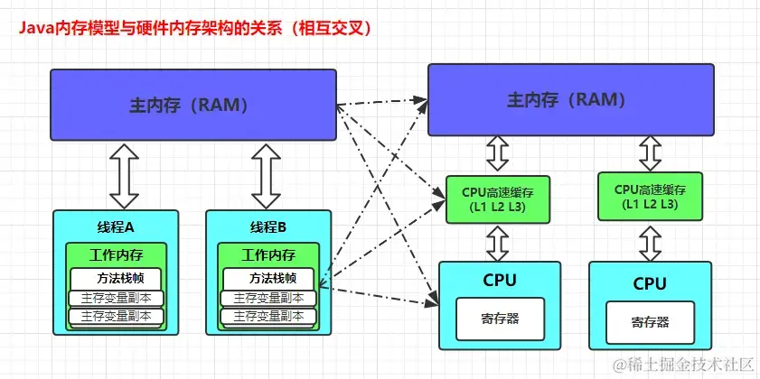
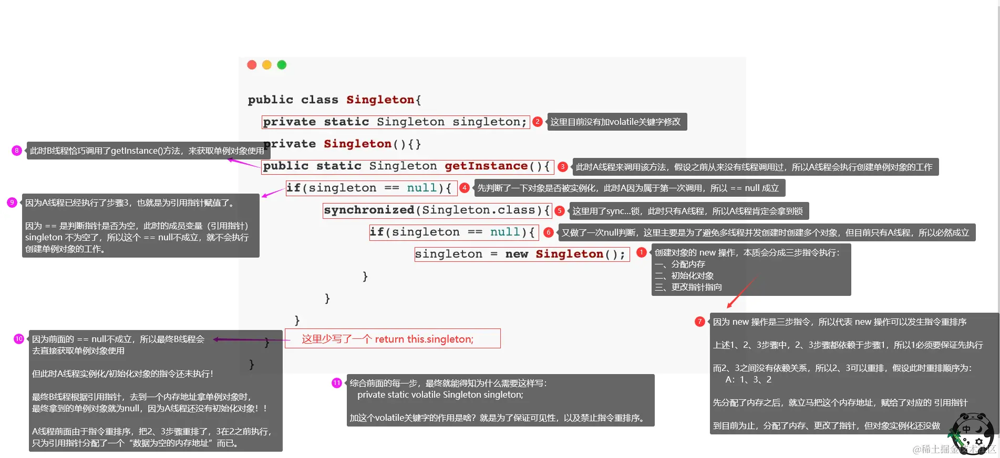

## 一、理解JVM内存模型与Java内存模型JMM的区别

### 1.1、JVM内存模型（JVM内存区域划分）

众所周知，`Java`语言使用`JVM`虚拟机屏蔽了平台差异，避免像`C/C++`那样直接与操作系统接触，从而做到了无视平台，一次编译到处运行！为此，`Java`程序想要运行，必须跑在`JVM`之上，`JVM`示意图如下：


`JVM`在运行期间，会把自己管理的内存划分为以上区域（运行时数据区），每个区域有着各自的用途，在`Java`程序运行时会发挥着不同的作用。而`JVM`运行时数据区总共可划分为线程私有区、线程共享区两大块，下面来简单说说各大区域具体作用。

#### 1.1.1、方法区（Method Area）

方法区（在`Java8`之后被更改为元数据空间），该区域属于线程共享区，又称`Non-Heap`（非堆）内存，主要用于存储已被虚拟机加载的类信息、常量、静态变量、`JIT`编译后的代码缓存等数据。值得注意的是：在方法区中有一个叫运行时常量池(`Runtime Constant Pool`）的区域，它主要用来存放编译器生成的各种字面量和符号引用，这些内容会在类加载完成后载入到运行时常量池中，以便后续使用。

> 该区域有可能导致`OOM`异常，根据`Java`虚拟机规范的规定，当方法区无法满足内存分配需求时，将抛出`OutOfMemoryError`异常。

#### 1.1.2、JVM堆（Java Heap）

`Java`堆也属于线程共享的内存区域，它在虚拟机启动时创建，是`JVM`所管理的内存中，最大的一块，主要用来存放对象实例，几乎`new`的所有对象都在这里分配内存（注意这里用的是“几乎”，有些对象不一定在堆中）。

堆空间是垃圾收集器管理的主要区域，因此很多时候也被称做`GC`堆，如果在堆中没有空闲内存提供给新对象分配时，此时就会触发`GC`回收；如若经过`GC`后依旧没有空闲内存，并且堆空间也无法再扩展时，将会抛出`OutOfMemoryError`异常。

#### 1.1.3、程序计数器(Program Counter Register)

程序计数器属于线程私有区域，是一小块内存空间，主要作为线程所执行的行号指示器。`JVM`字节码解释器工作时，通过改变这个计数器的值，来选取下一条需要执行的字节码指令，分支、循环、跳转、异常处理、线程恢复等基础功能，都需要依赖这个计数器来完成。

主要作用其实就是因为`CPU`时间片在调度线程工作时，会“中断/挂起”某个线程的操作，让另外一个线程开始工作，当“中断”的线程重新被`CPU`再次调度时，如何得知上次执行到那行代码了？就是靠程序计数器来得知上次执行的位置。

#### 1.1.4、虚拟机栈(Java Virtual Machine Stacks)

虚拟机栈也属于线程私有区，它有着另一个名字叫：线程栈，操作系统在创建线程时分配，虚拟机栈的总数与线程数对应，主要在执行`Java`方法时，作为临时内存区域使用。

当线程开始执行一个方法时，会先创建一个栈桢来存储方法的的变量表、操作数栈、动态链接、返回值、返回地址等信息。每个方法从调用至结束，对于一个栈桢在虚拟机栈中的入栈和出栈过程，如下：


#### 1.1.5、本地方法栈(Native Method Stacks)

本地方法栈属于线程私有的数据区域，该区域跟`C`所编写的`Native`方法相关，`JVM`会在本地方法栈中，维护一张本地方法登记表，当有线程需调用`Native`方法时，这里会登记是哪个线程调用了哪个本地方法/接口，并不会在本地方法栈中直接发生调用，这里只是做个调用登记，而真正的调用，需要通过本地方法接口去调用本地方法库中`C`编写的函数。

*一般情况下，我们无需关心此区域，因为在`HotSpot`虚拟机中，和虚拟机栈已经合二为一了。*

之所以说这些的内容，是为了让大家搞清`JVM`内存模型，和`JMM`内存模型是完全两个不同的概念。`JVM`内存模型是`Java`程序在运行期间的数据区域，对于操作系统来说，它本质还是存在于主内存之中。

`JMM`则是`Java`语言与`OS`硬件架构层面的概念，主要作用是规定硬件架构与`Java`语言的内存模型，`JMM`并不存在具体的代码，而仅仅只是一种规范，并不能说是某些技术实现。

### 1.2、Java内存模型（JMM）概述

`Java Memory Model`（简称`JMM`）`Java`内存模型，本身是一种抽象的概念，并不真实存在，它描述的是一组规则或规范，通过这组规范定义了程序中各个变量（包括实例字段，静态字段和构成数组对象的元素）的访问方式。

由于`JVM`运行程序的实体是线程，每个线程创建时，`JVM`都会为其分配工作内存，用于存储线程私有的数据。而`Java`内存模型中，规定所有变量都存储在主内存，主内存是共享内存区域，所有线程都可以访问。当线程想对一个变量进行赋值/运算等操作时，必须在工作内存中进行。

为此，当线程想操作变量时，首先要将变量从主内存拷贝的自己的工作内存，然后对变量进行操作，操作完成后，再将变更后的值刷写回主内存。也就是说：线程不能直接操作主内存中的变量，为了避免造成数据污染问题，必须将主内存中的变量，拷贝到工作内存中。

有些小伙伴会疑惑：Java中线程在操作一个对象时，对象不应该是在堆中吗？栈内不是只能存对象的引用地址吗？这时线程是直接在堆上操作的吗？

这里简单说一下，当线程操作一个对象时，会先根据引用地址去找到主存中的真实对象，然后会将对象拷贝到自己的工作内存再操作……（因为任何一个对象，都是由基本数据组成的）。如果当操作的对象较大时，比如一个`1MB+`的对象，这时并不会完全拷贝，而是将自己需要操作的那部分成员拷贝回来。

前面说过，工作内存是每个线程的私有数据区域，因此不同的线程间，无法访问对方的工作内存，线程间的通信(传值)必须要靠主内存来完成，其简要访问过程如下图：


重点注意：`JMM`与`JVM`内存区域，这是两个不同层次的概念，在理解`JMM`时，请不要带着`JVM`内存模型的思维去理解。更恰当的说：`JMM`描述的是一组规则，通过这组规则控制`Java`程序中，各个变量在共享数据区域和私有数据区域的访问方式，`JMM`是围绕原子性、有序性、可见性拓展延伸的。

`JMM`与`JVM`内存区域唯一相似点就是：**都存在共享数据区域和私有数据区域**。或许在某些地方，我们可能会看见主内存被描述为堆内存，工作内存被称为线程栈，这个说法虽不是那么专业，可是要表达的含义大致相同，下面来具体说说`JMM`中的主内存和工作内存。

#### 1.2.1、主内存

在`JMM`中，主内存属于线程共享区，从某个程度上讲，主存应该包括了堆和方法区。

主要存储的是共享数据，不管是类的成员变量、还是方法中的局部变量，又或者共享的类信息、常量、静态变量等数据，包括所有线程创建的实例对象，都会被存放在主内存中（除开栈上分配的对象）。

由于属于共享数据区域，多条线程对同一个数据进行非原子性操作时，就会发生线程安全问题。

#### 1.2.2、工作内存

工作内存则属于线程私有区，从某个程度上讲，应该包括程序计数器、虚拟机栈以及本地方法栈。

主要存储当前方法的所有本地变量信息，每个线程的工作内存对其它线程不可见，比如`T1`的工作内存中，存储着主内存中拷贝回来的某个共享变量副本，这对于`T2`线程也是不可见的。

就算是两个线程执行的是同一段代码、同一个方法，它们也只会在各自的工作内存中，创建属于当前线程的本地变量、字节码行号指示器、相关`Native`方法等信息，而不会两者之间共用一块内存的数据。

注意：由于工作内存是每个线程的私有数据，线程间无法相互访问工作内存，线程之间的通讯需要依赖于主存，因此存储在工作内存的数据不存在线程安全问题。

#### 1.2.3、工作内存与主内存的关系

弄清楚主内存和工作内存后，接着了解一下两者的数据存储类型及操作方式。

根据虚拟机规范，对于一个实例对象的成员方法而言，如果方法中包含的本地变量（局部变量），是`boolean、byte、short、char、int、long、float、double`八大基本数据类型，这将直接存储在工作内存的栈帧结构的局部变量表中。

倘若本地变量是引用类型，那么该对象的在内存中的具体引用地址，将会被存储在工作内存的栈帧结构的局部变量表中；而具体的实例对象，将存储在主内存（共享数据区域：堆）中。但对于实例对象的成员字段，不管是基本数据类型，还是`Integer、Double`等包装类型，又或者是引用类型，都会被存储到堆区（栈上分配除外）。

至于`static`变量以及类本身相关信息将会存储在主内存中。

需要注意的是：在主内存中的实例对象可以被多条线程共享，倘若两条线程同时调用同一个类的、同一个方法，那这两条线程需要将操作的数据，拷贝一份到自己的工作内存中，在工作内存运算完成后，才刷新到主内存，简单示意图如下所示：


 

方法内的局部变量操作：


 

## 二、硬件内存架构、OS与Java多线程实现原理及JMM

### 2.1、计算机硬件内存架构


如上图所示，这是一副`CPU`与内存操作的简易图，实际没有这么简单，为了理解方便，我们省去了南北桥。

就目前计算机而言，一般拥有多个`CPU`，并且每个`CPU`可能存在多个核心，多核是指在一枚处理器中，集成两个或多个完整的计算引擎（核心），这样就可以支持多任务并行执行。从多线程的调度来说，每个线程都会映射到各个`CPU`核心上并行执行。

在`CPU`内部有一组`CPU`寄存器，寄存器存储`CPU`直接访问和处理的数据，也就是一个临时放数据的空间。一般`CPU`都会从内存取数据到寄存器，然后进行处理，但由于内存的处理速度远远低于`CPU`，导致`CPU`在处理指令时，往往很多时间花费在等待内存准备数据上。

为了解决上述问题，于是在寄存器和主内存间，添加了`CPU`高速缓存，该缓存区域空间比较小，但访问速度比主内存快得多，如果`CPU`总是操作主内存中同一地址的数据，很容易影响`CPU`执行速度，此时高速缓存就可以把从内存提取的数据暂时保存起来，如果寄存器要取内存中同一位置的数据，直接从缓存中提取，无需直接从主内存取。

需要注意的是：寄存器并不每次数据都可以从缓存中取得，只要不是同一个内存地址的数据，那寄存器就得绕过缓存从内存取数据，这种现象有个专业的名称叫：**缓存的命中率**。从缓存中取算命中，从内存中取算没命中，由此可见，缓存命中率的高低也会影响`CPU`执行性能。

上述就是`CPU`、缓存以及主内存，三者之间的简要交互过程，总而言之，当`CPU`需要访问主存数据时，会先读取一部分主存数据到`CPU`高速缓存（后续`CPU`缓存中，存在需要的数据就会直接从缓存获取），进而在读取缓存数据到寄存器。当`CPU`需要写数据到主存时，同样会先刷新寄存器中的数据到`CPU`缓存，然后再把数据刷新到主内存中。

实则就类似于`Java-->Redis-->MySQL`的关系，`Java`程序性能由于`MySQL`要走磁盘受到了影响，导致`Java`程序在处理请求时，每次都会因为`MySQL`过慢而陷入阻塞等待状态，必须等到`MySQL`的结果返回后才能继续工作，那么此时这种模式的问题是：

> 数据库的读写速度，跟不上`Java`应用程序的性能，导致整个请求处理起来变的很慢，但实际上在`DB`处理读写操作的过程，`Java`线程需要阻塞等待，这样会导致整体系统的吞吐量下降，此时我们可以加入`Redis`缓存来提升响应速度，从而提升系统整体的吞吐和性能。

上述的主存就类似于`MySQL`，`CPU`高速缓存就类似于`Redis`，而`CPU`寄存器就类似于`Java`程序。

### 2.2、OS与JVM线程关系及Java线程实现原理

经过上面的阐述，我们大致了解了`JVM`内存模型、`Java`内存模型、硬件内存架构，下面来聊聊`Java`中线程的实现原理，这有助于我们理解`Java`内存模型与硬件内存架构的关系。

在`Java`中，线程是基于一对一模型实现的，所谓的一对一模型，就是在语言级别的层面，去间接调用系统内核的线程模型，如我们在使用`Java`线程时：

```java
java
复制代码new  Thread(Runnable).start();
```

`JVM`最终会调用当前操作系统的内核线程，来执行当前的`Runnable`任务。

这里需了解一个术语，内核线程(`Kernel-Level Thread，KLT`)，它是由操作系统内核（`Kernel`）支持的线程，这种线程由操作系统内核进行控制，内核通过操作调度器完成对线程的执行调度，并将线程的任务映射到各个处理器上。每个内核线程可以视为内核的一个分身，这也就是操作系统可以同时处理多个任务的原因。

可是由于我们编写的多线程程序，是属于语言层面的多线程，一般无法直接调用/创建内核线程，取而代之的是一种轻量级的进程(`Light Weight Process`)，这也是通常意义上的线程。由于每个轻量级进程都会映射一个内核线程，因此我们可以通过轻量级进程来调用内核线程，进而由操作系统内核将任务映射到各个处理器，这种轻量级进程与内核线程间一对一的关系，就称为`Java`线程与`OS`内核线程的一对一模型。如下图：


`Java`中的每个线程都会经过`OS`内核，进而被映射到`CPU`中处理。当然，如果`CPU`存在多核，那么一个`CPU`同时也能并行调度执行多个线程。

### 2.3、JMM与硬件内存架构的关系

通过前面是分析后，我们可以发现，`Java`线程的执行，最终都会映射到硬件处理器上执行，但`Java`内存模型和硬件内存架构并不完全一致。

对于硬件内存来说只有寄存器、高速缓存、主内存的概念，并没有工作内存（线程私有数据区域）和主内存（线程共享数据区域）之分。也就是说`JMM`内存划分，无法对硬件的内存产生任何影响，因为`JMM`只是一种抽象的概念，是一组规则，并不实际存在，不管是工作内存的数据还是主内存的数据，对于计算机硬件来说，都有可能存储在计算机主内存、`CPU`缓存或者寄存器中。

总的来说，`Java`内存模型和硬件内存架构是相互交叉的关系，是一种抽象概念划分与真实物理硬件的交叉（注意：对于JVM内存区域划分也是同样的道理）。



### 2.4、为什么需要有JMM的存在？

接着来谈谈Java内存模型存在的必要性，因为我们去学习某个知识的话要做到知其然知其所以然。

由于线程是`OS`的最小调度单位，所有程序运行时的实体，本质上都是一条条线程，运行在`OS`上的`Java`程序也不例外。而每个线程创建时，`JVM`都会为其创建一个工作内存（可以理解成虚拟机栈），用于存储线程私有的数据，线程如果想要操作主存中的某个变量，必须通过工作内存间接完成。

主要过程是将变量从主内存拷贝到线程自己的工作内存空间，然后先在工作内存中对变量进行操作，操作完成后再将变量刷写回主内存，如果存在两个线程同时对主内存中的、同一个实例对象/变量进行操作，这就有可能诱发线程安全问题。如下图，主内存中存在一个共享变量`int i = 0`：


#### 2.4.1、第一种情况（左图）

现有`A、B`两条线程，分别对变量`i`进行操作，`A、B`线程各自的都会先将主存中的`i`，拷贝一份副本到自己的工作内存，然后再在工作内存中对`i`进行自增操作。

那么假设此时`A、B`线程，同时将主存中`i=0`这个数据，拷贝到自己的工作内存进行操作。在这个过程中，其实`A`在自己工作内存中对`i`进行自增操作，这对`B`工作内存的副本`i`是不可见的，当`A`完成自增操作后，会将结果`i=1`刷写回主存。

此时`B`也做了`i++`操作，也是先基于主存中拷贝`i=0`这个值，接着在自己的工作内存完成`i++`自增操作，所以`B`刷写回主存的值也是`1`。

可是诸位仔细分析一下，此刻两条线程都对主存中的`i`进行了自增操作，理想结果应该是`i=2`，但是现在的结果却是`i=1`。现在这个现象，就可以被称为“线程安全问题、数据污染问题、数据不一致问题……”。

#### 2.4.2、第二种情况（右图）

假设现在`A`线程想要把`i`的值修改为`2`，而`B`线程却想要读取`i`的值，那么`B`线程读取到的值，是`A`线程更新后的`i=2`这个值，还是更新前的`i=1`这个值呢？答案是不确定，即`B`线程有可能读取到`A`线程更新前的`1`，也有可能读取到A线程更新后的`2`。

这是因为工作内存属于每个线程的私有数据区域，而线程`A`修改变量`i`时，首先是将变量从主内存拷贝到自己的工作内存中，然后对变量进行操作，操作完成后再将变量`i`写回主内存。对于`B`线程的也是类似的，这样就有可能造成主内存与工作内存间数据存在一致性问题。

假如`A`线程修改完后，正在将数据写回主内存，而`B`线程此时正在读取主内存的`i`，也就是将`i=1`拷贝到自己的工作内存中，这样`B`线程读取到的值就是`i=1`。但如果`A`线程已将`i=2`写回主内存后，`B`线程才开始读取的话，那么此时`B`线程读到的就是`2`，但到底是哪种情况先发生呢？这是不确定的。

所以如上两种情况，对于程序来说是不应该的，假设把这个变量`i`换成淘宝双十一的商品库存数，`A、B`线程换成参加双十一的用户，这时就会导致超卖、重复卖等问题的出现，这会由于技术问题造成业务经济受损，尤其是是在类似于淘宝双十一此类的大促活动中，此类问题如果不控制好，出现问题的风险会成倍增长，其实这也就是所谓的线程安全问题。

为了解决上述两类问题，`JVM`定义了一组规则，通过这组规则来决定：一个线程对共享变量的写入何时对另一个线程可见，这组规则也称为`Java`内存模型（`JMM`），`JMM`整体是围绕着程序执行的原子性、有序性、可见性展开的，下面我们看看这三个特性。

### 2.5、Java内存模型JMM围绕的三大特性

#### 2.5.1、原子性

原子性指的是一个操作是不可中断的，即使是在多线程环境下，一个操作一旦开始就不会被其他线程影响。

比如对于一个静态变量`int i = 0`，两条线程同时对它赋值，线程`A`操作为`i=1`，而线程`B`操作为`i=2`，不管线程如何运行，最终 `i`的值要么是`1`，要么是`2`，`A、B`线程之间的操作是没有干扰的，这就是原子性操作，不可被中断的特点。

有点要注意的是：对于`32`位系统的来说，`byte、short、int、float、boolean、char`等基本数据类型的读写是原子操作，而`long、double`类型的数据，它们的读写并非原子性的！

也就是说：**如果存在两条线程同时对`long`或`double`类型的数据进行读写操作时，相互之间会存在干扰**。因为对于`32`位虚拟机来说，每次原子读写是`32bit`，而`long、double`是`64bit`的存储单元，这样会导致一个线程在写时，操作完前`32`位的原子操作后，轮到`B`线程读取时，恰好只读取到了后`32`位的数据，这样可能会读取到一个既非原值、又不是线程修改值的变量，它可能是“半个变量”的数值，即`64`位数据被两个线程分成了两次读取。

不过也不必太担心，因为读取到“半个变量”的情况比较少见，至少在目前商用的虚拟机中，几乎都把`64`位数据的读写操作，作为原子操作来执行，因此对于这个问题不必太在意，知道有这么回事即可。

其实原子性操作的本质，**是指一组操作要么全部执行成功，要么就全部失败**。举个例子：

> 下单：{增加订单，减库存}

对于用户来说，下单是一组操作，那么系统就必须保证下单操作的原子性，“增加订单、减库存”要么全部成功，要么全部失败，不能出现“增加订单成功、减库存失败”这种现象。这个例子从宏观上来讲，就是一个原子性操作的体现。

非原子性操作反之，如果一组操作可以被打断，这说明就是一组非原子性操作，如“增加订单之后，减库存的操作可以被打断”（线程安全问题产生的根本原因，就是由于多线程对一个共享资源进行非原子性操作导致的）。

但是有个点，在我们研究`Java`并发编程以及在研究可见性时需要注意，就是计算机在执行程序时，会通过“指令重排”优化它的操作。计算机在执行程序时，为了提高性能，编译器和处理器的常常会对指令进行重排序，一般分以下`3`种。

**①编译器优化的重排**：编译器在不改变单线程程序语义的前提下，可以重新安排语句的执行顺序。

**②指令并行的重排**：现代处理器采用了指令级并行技术来将多条指令重叠执行。如果不存在数据依赖性（即后一个执行的语句，无需依赖前面语句的执行结果），处理器可以改变语句对应机器指令的执行顺序。

**③内存系统的重排**：由于处理器使用缓存和读写缓存冲区，这使得加载（`load`）和存储`store`操作看上去可能是在乱序执行，因为三级缓存的存在，导致内存与缓存的数据同步存在时间差。

其中编译器优化的重排序，属于编译期重排；指令并行的重排、内存系统的重排属于处理器重排。在多线程环境中，这些重排优化可能会导致程序出现内存可见性问题，下面分别阐明这两种重排优化可能带来的问题。

##### 2.5.1.1、编译器优化指令重排

```java
java复制代码// 主存的共享变量
int a = 0;
int b = 0;

//线程A                   线程B
代码1：int x = a;         代码3：int y = b;
代码2：b = 1;             代码4：a = 2;
```

此时有四行代码`1、2、3、4`，其中`1、2`属于线程`A`，`3、4`属于线程`B`，两个线程同时执行，从程序的执行上来看，由于并行执行的原因，按理应该是`x=0、y=0;`这个结果，理论上不会出现`x=2、y=1;`这种结果，但是实际上这种情况是有概率出现的，因为编译器会对一些前后不依赖/影响、耦合度为`0`的代码，进行指令重排优化，假设此时编译器对这段代码进行指令重排优化后，出现的情况如下：

```java
java复制代码//线程A                   线程B
代码2：b = 1;         代码4：a = 2;
代码1：int x = a;     代码3：int y = b;         
```

这种情况下再结合之前的线程安全问题一起理解，那就有可能出现`x=2、y=1;`这种结果，这也就说明在多线程环境下，由于编译器会对代码做指令重排的优化工作（因为一般代码都是由上往下执行，指令重排是`OS`对单线程代码的优化），最终导致在多线程环境下，多个线程使用变量时无法保证一致性。

不过值得注意的是：**编译器重排的前提，是代码不存在依赖性时才会发生**。而依赖性可分为两种，一种是数据依赖，如：

```java
java复制代码int a = 1;
int b = a;
```

上述代码中`b`依赖`a`的数据。另一种是控制依赖，如：

```java
java复制代码boolean f = ture;
if(f){
    System.out.println("123");
})
```

上述`if`判断这个流程控制，依赖于变量`f`的值。像这类前后存在依赖关系的代码，就无法进行重排序。

##### 2.5.1.2、处理器指令重排

先了解一下指令重排的概念，处理器指令重排是对`CPU`的性能优化，从指令的执行角度来说一条指令可以分为多个步骤完成，如下：

> 取指：`IF`
>  译码和取寄存器操作数：`ID`
>  执行或者有效地址计算：`EX`
>  存储器访问：`MEM`
>  写回：`WB`

`CPU`在工作时，需要将一个指令分为上述多个步骤依次执行（不同硬件有可能不一样），由于每一步会使用不同的硬件完成操作。比如取值时，会用到`PC`寄存器和存储器；译码时会用到指令寄存器组；执行时会用到`ALU`（算术逻辑单元）、写回时用到寄存器组。为了提高硬件利用率，`CPU`执行指令是按流水线技术来工作的，如下：


> 流水线技术：类似于工厂中的生产流水线，工人们各司其职，做完自己的就往后面传，然后开始一个新的，做完了再往后面传递.....。`CPU`执行指令亦是如此，如果等到一条指令执行完毕后，再开始执行下一条指令，效率无疑特别低。就好比工厂的生产流水线，先等到一个产品生产完毕之后，再开始生产下一个，效率非常低下并且浪费人工，如果真这样干，一条流水线同时就只会有一个工人在做事，其他的看着，只有当这个产品走到最后一个人手上，并且最后一个人完成了组装之后，第一个工人再开始第二个产品的制作。

从图中可以看出，当指令`1`还未执行完成时，第`2`条指令便利用空闲的硬件开始执行。这样做是有好处的，如果每个步骤花费`1ms`，如果第`2`条指令，需要等待第`1`条指令执行完后再执行的话，则需要等待`5ms`，但如果使用流水线技术，指令`2`只需等待`1ms`就可以开始执行了，这样就能大大提升`CPU`的执行性能。

虽然流水线技术可以大大提升`CPU`的性能，但不幸的是：一旦出现流水中断，所有硬件设备将会进入一轮停顿期，当再次弥补中断点可能需要几个周期，这样性能损失也会很大，就好比工厂组装手机的流水线，一旦某个零件组装工序中断，那么该工序往后的工人，都有可能进入一轮或者几轮等待组装零件的过程。

因此我们需要尽量阻止指令中断的情况，指令重排就是其中一种优化中断的手段，我们通过一个例子来阐明指令重排是如何阻止流水线技术中断的，如下：

```java
java复制代码i = a + b;
y = c - d;     
```


| 指令           | 描述                                                         |
| -------------- | ------------------------------------------------------------ |
| `LW R1,a`      | `LW`指令表示`load`，其中`LW R1,a`表示把`a`的值加载到寄存器`R1`中 |
| `LW R2,b`      | 表示把`b`的值加载到寄存器`R2`中                              |
| ` R3,R1,R2`    | `ADD`指令表示加法，把`R1 、R2`的值相加，并把结果存入`R3`寄存器中 |
| `SW i,R3`      | `SW`表示`store`，即将`R3`寄存器的值保持到变量`i`中           |
| `LW R4,c`      | 表示把`c`的值加载到寄存器`R4`中                              |
| `LW R5,d`      | 表示把`d`的值加载到寄存器`R5`中                              |
| `SUB R6,R4,R5` | `SUB`指令表示减法，把`R4、R5`的值相减，并存入`R6`寄存器中    |
| `SW y,R6`      | 表示将`R6`寄存器的值保持到变量`y`中                          |

上述便是汇编指令的执行过程，在某些指令上存在`X`的标志，`X`代表中断的含义，也就是图中只要有`X`的地方，就会导致指令流水线出现停顿，同时也会影响后续指令的执行，可能需要经过`1`个或几个指令周期才可能恢复正常，那为什么停顿呢？

这是因为部分数据还没准备好，如执行`ADD`指令时，需要使用到前面指令的数据`R1，R2`，而此时`R2`的`MEM`操作没有完成，即未拷贝到存储器中，这样加法计算就无法进行，必须等到`MEM`操作完成后才能执行，因此就产生了停顿，其他指令也是类似的情况。

前面讲过，停顿会造成`CPU`性能下降，因此我们应该想办法消除这些停顿，这时就需要使用到指令重排了，如下图，既然`ADD`指令需要等待，那我们就利用等待的时间做些别的事情，如把`LW R4,c`和`LW R5,d`移动到前面执行，毕竟`LW R4,c`和`LW R5,d`的执行，并没有数据依赖关系，对他们有数据依赖关系的`SUB R6,R5,R4`指令，在`R4,R5`加载完成后才执行的，没有影响，过程如下：


正如上图所示，所有的停顿都完美消除了，指令流水线也无需中断了，这样`CPU`的性能也能带来很好的提升，这就是处理器指令重排的作用。

关于编译器重排以及指令重排（这两种情况后面统一称为指令重排）相关内容已阐述清晰了，我们必须意识到：**对于单线程而言，指令重排几乎不会带来任何影响**，毕竟重排的前提是保证串行语义执行的一致性，但对于多线程环境而言，指令重排就可能导致严重的程序乱序执行问题，如下：

```java
java复制代码int a = 0;
boolean f = false;

public void methodA(){
    a = 1;
    f = true;
}
public void methodB(){
    if(f){
        int i = a + 1；
    }
}
```

如上述代码，线程`A、B`同时对该实例对象进行操作，其中`A`线程调用`methodA`方法，而`B`线程调用`methodB`方法，由于指令重排等原因，可能导致程序执行顺序变为如下：

```java
java复制代码线程A                      线程B
 methodA：                methodB：
 代码1:f= true;           代码1:f= true;
 代码2:a = 1;             代码2: a = 0 ; //读取到了未更新的a
                          代码3: i =  a + 1;
```

由于指令重排的原因，线程`A`的`f`置为`true`被提前执行了，接着线程`A`正准备执行`a=1`赋值操作。可此时因为`f=true`了，所以线程`B`正好读取`f`的值为`true`，就会进入`if`分支，直接获取`a`的值。

而此时线程`A`还在自己的工作内存中，对拷贝过来的变量副本`a（0）`进行赋值操作，这时还未刷写到主存。此时线程`B`读取`a`变量，读到的`a`值还是为`0`，那么拷贝到线程`B`工作内存的`a`变量值会等于`0`，然后`B`线程在工作内存中执行`i=a+1`操作，因为处理器指令重排的原因，线程`B`读到`a`为`0`，导致最终`i`的值为`1`，而不是预期的`2`，这就是多线程环境下，指令重排导致的程序乱序执行的结果。

因此，请记住，指令重排只会保证单线程中串行语义的执行一致性。单线程环境时，能够通过指令重排优化程序性能、消除`CPU`停顿；但是这种重排序，并不会关心多线程间的语义一致性。

#### 2.5.2、可见性

经过前面的阐述，如果真正理解了指令重排现象之后，各位小伙伴再来理解可见性就很容易了，可见性指的是：**当一个线程修改了某个共享变量的值，其他线程是否能够马上得知这个修改的值**。

对于串行程序来说，可见性是不存在的，因为在任何一步操作中修改了某个变量的值，后续的操作都能读取这个变量值，并且是修改过的新值。但在多线程环境中可就不一定了，前面我们分析过，由于线程对共享变量的操作，都是拷贝到各自的工作内存运算的，运算完成后才刷回主内存中。

这就可能存在一个线程`A`修改了共享变量`i`的值，还未写回主内存时，另外一个线程`B`又对主内存中的`i`进行操作，此时`A`线程工作内存中`i`对线程`B`不可见，这种工作内存与主内存之间同步延迟的现象，就造成了可见性问题。

另外指令重排以及编译器优化也可能导致可见性问题，通过前面的分析，我们知道：无论是编译器优化还是处理器优化的重排现象，在多线程环境下，都会会导致程序乱序执行的情况出现，从而也就导致可见性问题。

#### 2.5.3、有序性

有序性是指：对于单线程执行的代码，我们总是认为代码是按顺序依次执行的，这样的理解如果是放在单线程环境下没有问题，毕竟对于单线程而言确实如此，执行会根据编码的顺序从上往下执行，就算发生指令重排序，由于所有硬件优化的前提都是必须遵守`as-if-serial`语义，所以不管怎么排序，都不会、不能影响单线程程序的执行结果，我们将这称之为有序执行。

反之，对于多线程环境，则可能出现乱序现象，因为程序编译成机器码指令后，可能会出现指令重排现象，重排后的指令与原指令的顺序未必一致。要明白的是：**在`Java`程序中，倘若在本线程内，所有操作都视为有序行为，如果是多线程环境下，一个线程中观察另外一个线程，所有操作都是无序的**。前半句指的是单线程内保证串行语义执行的一致性，后半句则指指令重排现象和工作内存与主内存同步延迟现象。

### 2.6、JMM是如何解决上述问题的？

真正理解上述所有内容后，再来看`Java`为我们提供的解决方案，如原子性问题，除了`JVM`自身保障了读写基本数据类型的原子性外，对于方法级别或者代码块级别的原子性操作，可以使用`synchronized`关键字，或者`Lock`锁接口的实现类来保证程序执行的原子性，关于`synchronized`的详解（能保证三特性不能禁止指令重排），下章我们会讲到。

而工作内存与主内存同步延迟现象导致的可见性问题，可以使用加锁或者`Volatile`关键字解决，它们都可以使一个线程修改后的变量立即对其他线程可见。

对于指令重排导致的可见性问题和有序性问题，则可以利用`volatile`关键字解决，因为`volatile`的另外一个作用就是禁止重排序优化，关于`volatile`稍后会进一步分析。

除了靠`sychronized`和`volatile`关键字（`volatile`关键字不能保证原子性，只能保证的是禁止指令重排与可见性问题）来保证原子性、可见性以及有序性外，`JMM`内部还定义一套`happens-before`原则来保证多线程环境下两个操作间的原子性、可见性以及有序性。

### 2.7、JMM中的happens-before原则

#### 2.7.1、线程在执行的过程中与内存的交互

在了解`JMM`的`happens-before`原则之前，必须先对线程执行过程中，与内存的交互操作要有个简单的认知。`Java`程序在执行的过程中，实际就是`OS`在调度`JVM`的“线程”执行，执行的过程就是与内存的交互操作，而内存交互操作有`8`种（虚拟机实现必须保证每一个操作都是原子的，不可在分的，对于`double、long`类型的变量来说，`load、store、read`和`write`操作在某些平台上允许例外）：

- `lock`（锁定）：作用于主内存的变量，把一个变量标识为线程独占状态；
- `unlock`（解锁）：作用于主内存的变量，它把一个处于锁定状态的变量释放出来，释放后的变量才可以被其他线程锁定；
- `read`（读取）：作用于主内存变量，它把一个变量的值从主内存传输到线程的工作内存中，以便随后的load动作使用；
- `load`（载入）：作用于工作内存的变量，它把read操作从主存中变量放入工作内存中；
- `use`（使用）：作用于工作内存中的变量，它把工作内存中的变量传输给执行引擎，每当虚拟机遇到一个需要使用到变量的值，就会使用到这个指令；
- `assign`（赋值）：作用于工作内存中的变量，它把一个从执行引擎中接受到的值放入工作内存的变量副本中；
- `store`（存储）：作用于主内存中的变量，它把一个从工作内存中一个变量的值传送到主内存中，以便后续的write使用；
- `write`（写入）：作用于主内存中的变量，它把store操作从工作内存中得到的变量的值放入主内存的变量中。

`JMM`对这八种指令的使用，制定了如下规则：

- ①不允许`read`和`load`、`store`和`write`操作之一单独出现。即：使用了`read`必须`load`，使用了`store`必须`write`；
- ②不允许线程丢弃他最近的`assign`操作，即工作变量的数据改变了之后，必须告知主存；
- ③不允许一个线程将没有`assign`的数据从工作内存同步回主内存；
- ④一个新的变量必须在主内存中诞生，不允许工作内存直接使用一个未被初始化的变量。就是对变量实施`use、store`操作之前，必须经过`assign`和`load`操作；
- ⑤一个变量同一时间只有一个线程能对其进行`lock`。多次`lock`后，必须执行相同次数的`unlock`才能解锁；
- ⑥如果对一个变量进行`lock`操作，会清空所有工作内存中此变量的值，在执行引擎使用这个变量前，必须重新`load`或`assign`操作初始化变量的值；
- ⑦如果一个变量没有被`lock`，就不能对其进行`unlock`操作。也不能`unlock`一个被其他线程锁住的变量；
- ⑧对一个变量进行`unlock`操作之前，必须把此变量同步回主内存；

JMM对这八种操作规则和对`volatile`的一些特殊规则，就能确定哪里操作是线程安全，哪些操作是线程不安全的了。但是这些规则实在复杂，很难在实践中直接分析，所以一般我们也不会通过上述规则进行分析。更多的时候，会使用`JMM`中的`happens-before`规则来进行分析。

#### 2.7.2、JMM中的happens-before原则

假如在多线程开发过程中，我们需要通过加锁或`volatile`来解决这些问题的话，那么编写程序的时候会非常麻烦，而且加锁本质上是让多线程的并行执行变为了串行执行，这样会大大的影响程序的性能，那么其实真的需要嘛？不需要，因为在`JMM`中还为我们提供`happens-before`原则来辅助保证程序执行的原子性、可见性以及有序性的问题，它是判断数据是否存在竞争、线程是否安全的依据，`happens-before`原则内容如下。

- **一、程序顺序原则**：即在一个线程内必须保证语义串行性，也就是说按照代码顺序执行；
- **二、锁规则**：解锁(`unlock`)操作必然发生在后续的同一个锁的加锁(`lock`)之前，也就是说，如果对于一个锁解锁后，再加锁，那么加锁的动作必须在解锁动作之后(同一个锁)；
- **三、volatile规则**：`volatile`变量的写，先发生于读，这保证了`volatile`变量的可见性。简单的理解就是：`volatile`变量在每次被线程访问时，都强迫从主内存中读该变量的值，而当该变量发生变化时，又会强迫将最新的值刷新到主内存，任何时刻，不同的线程总是能够看到该变量的最新值；
- **四、线程启动规则**：线程的`start()`方法先于它的每一个动作，即如果线程`A`，在执行线程`B`的`start`方法前修改了共享变量的值，那么当线程`B`执行`start`方法时，线程`A`变更过的共享变量，对线程`B`可见；
- **五、传递性优先级规则**：`A`先于`B`，`B`先于`C`，那么`A`必然先于`C`；
- **六、线程终止规则**：线程的所有操作先于线程的终结，`Thread.join()`方法的作用是等待当前执行的线程终止。假设在线程`B`终止之前，修改了共享变量，线程`A`从线程`B`的`join`方法成功返回后，线程`B`对共享变量的修改将对线程`A`可见；
- **七、线程中断规则**：对线程`interrupt()`方法的调用，先发生于被中断线程的代码检测到中断事件的发生，可以通过`Thread.interrupted()`方法检测线程是否中断；
- **八、对象终结规则**：对象的构造函数执行，结束先于`finalize()`方法。

`happens-before`原则无需添加任何手段来保证，这是由`JMM`规定的，`Java`程序默认遵守如上八条原则，下面我们再通过之前的案例，重新认识这八条原则是如何判断线程是否会出现安全问题：

```java
java复制代码int a = 0;
boolean f = false;
public void methodA(){
    a = 1;
    f = true;
}
public void methodB(){
    if(f){
        int i = a + 1；
    }
}
```

同样的道理，目前存在`A、B`两条线程，线程`A`调用实例对象的`methodA()`方法，线程`B`调用`methodB()`方法，线程`A`先启动、线程`B`后启动，那么线程`B`读取到的`i`值是多少呢？

现在依据`happens-before`的八条原则进行判断：

- 由于存在两条线程同时调用，因此程序顺序原则不合适。
- `methodA()`方法和`methodB()`方法都没有使用同步手段，锁规则也不合适。
- 没有使用`volatile`关键字，`volatile`变量原则不适应。
- 线程启动规则、线程终止规则、线程中断规则、对象终结规则、传递性在本次案例也不合适。
- 线程`A、B`的启动时间虽然有先后，但线程`B`执行结果却不确定。

也就是说，上述代码没有适合`8`条原则中的任意一条，也没有使用任何同步手段，所以上述的操作是线程不安全的，因此线程`B`读取的值自然也是不确定的。

修复这个问题的方式很简单，要么给`methodA()`方法和`methodB()`方法添加同步手段（加锁），或者给共享变量添加`volatile`关键字修饰，保证该变量在被一个线程修改后总对其他线程可见。

## 三、Volatile关键字

### 3.1、Volatile关键字保证的可见性

`Volatile`是`Java`提供的轻量级同步工具，它能保证可见性和做到禁止指令重排做到有序性，但是它不能保证原子性，如果你的程序必须保障原子性的话，那么可以考虑使用`JUC`原子包下的原子类（后续篇章会讲到），或者靠加锁的方式来保证。

但是我们假设使用`volatile`来修饰共享变量，那它能够保证的是：**一个线程对`volatile`所修饰的变量进行更改操作后，总是能对其他线程可见**，如下：

```java
java复制代码volatile int i = 0;
public void add(){
      i++;
}
```

对于上述代码，任何线程调用`add()`方法对`i`进行`i++`操作后，对其他线程都是可见的，但这段代码不存在线程安全问题吗？存在，为什么？因为`i++`并不是原子性操作，`i++`实际上是三个操作的组成：

> 从主存读取值、工作内存中`+1`操作、将运算结果刷写回主存。

任何一条线程在执行任何一步时，都有可能被其他线程打断，所以还是会出现线程安全问题（具体参考之前描述线程安全问题第一种情况）。

为此，我们要清楚，此时如果有多条线程调用`add()`方法，依旧会出现线程安全问题，如果想要解决这个问题，还是需要使用`synchronized、lock`或者原子类来保证，`volatile`关键字只能禁止指令重排以及可见性。

现在再来看一个案例，此类场景可以使用`volatile`关键字修饰变量，从而达到线程安全的目的，如下：

```java
java复制代码volatile boolean flag;

public void toTrue(){
      flag = true;
}

public void methodA(){
      while(!flag){
          System.out.println("我是false....false.....false.......");
      }
}
```

由于对`boolean`变量`flag`值的修改，属于原子性操作，因此可以通过使用`volatile`修饰`flag`变量，使用该变量对其他线程立即可见，从而达到线程安全的目的。

那么`JMM`是如何实现让`volatile`变量对其他线程立即可见的呢？实际上，当写一个`volatile`变量时，`JMM`会把该线程工作内存中的共享变量值刷新到主内存中；当读取一个`volatile`变量时，`JMM`会把该线程对应的工作内存置为无效，那么该线程只能从主内存中重新读取共享变量。

`volatile`变量正是通过这种写-读方式实现对其他线程可见（其内存语义实现则是通过内存屏障，稍后会说明）。

### 3.2、Volatile如何禁止指令重排序的？

`volatile`关键字另一个作用，就是禁止编译器或者处理器对指令进行重排优化，从而避免多线程环境下程序出现乱序执行的现象，那`volatile`是如何做到禁止指令重排优化的呢？先了解一个概念，内存屏障(`Memory Barrier`）。

内存屏障，又称内存栅栏，是一个`CPU`指令，它的作用有两个，一是保证特定操作的执行顺序，二是保证某些变量的内存可见性（利用该特性实现`volatile`的内存可见性）。

由于编译器和处理器都能执行指令重排优化，如果在指令间插入一条`MemoryBarrier`，则会告诉编译器和`CPU`，不管什么指令都不能和这条`MemoryBarrier`指令重排序，也就是通过插入内存屏障，禁止在内存屏障前后的指令执行重排序优化。

`Memory Barrier`的另外一个作用：强制刷出各种`CPU`缓存数据，因此任何`CPU`上的线程都能读取到这些数据的最新版本。

| 屏障类型              | 指令示例                      | 说明                                                         |
| --------------------- | ----------------------------- | ------------------------------------------------------------ |
| `LoadLoad Barriers`   | `Load1; LoadLoad; Load2;`     | 确保`Load1`指令数据的装载，发生于`Load2`及后续所有装载指令的数据装载之前。 |
| `StoreStore Barriers` | `Store1; StoreStore; Store2;` | 确保`Store1`数据的存储对其他处理器可见（刷新到内存中），并发生于`Store2`及后续所有存储指令的数据写入之前。 |
| `LoadStore Barriers`  | `Load1; LoadStore; Store2;`   | 确保`Load1`指令数据的装载，发生于`Store2`及后续所有存储指令的数据写入之前。 |
| `StoreLoad Barriers`  | `Store1; StoreLoad; Load2;`   | 确保`Store1`数据的存储对其他处理器可见（刷新到内存中），并发生于`Load2`及后续所有装载指令的数据装载之前。`StoreLoad Barriers`会使该屏障之前的所有内存访问指令（存储和装载）完成之后，才执行该屏障之后的内存访问指令。 |

`Java`编译器在生成指令序列的适当位置，会插入内存屏障指令来禁止特定类型的处理器重排序，从而让程序按我们预想的流程去执行。

`JMM`把内存屏障指令分为`4`类，`StoreLoad Barriers`是一个“全能型”的屏障，它同时具有其他3个屏障的效果。现代的多处理器大多支持该屏障（其他类型的屏障不一定被所有处理器支持）。

总之，`volatile`变量正是通过内存屏障实现其在内存中的语义，即可见性和禁止重排优化。案例如下：

```java
java复制代码public class Singleton{
  private static Singleton singleton;
  
  private Singleton(){}
  
  public static Singleton getInstance(){
     if(singleton == null){
          synchronized(Singleton.class){
                if(singleton == null){
                      singleton = new Singleton();
               }
          }
      }
  }
}
```

上述代码是一个经典双重检测的单例模式，这段代码在单线程环境下并没有什么问题，可是如果在多线程环境下，就可能出现线程安全问题。原因在于某一个线程执行到第一次检测，读取到的`singleton`不为`null`时，`singleton`的引用对象可能没有完成初始化。

因为`singleton = new Singleton();`可以分为以下3步完成（伪代码）：

```java
java复制代码// 1.分配对象内存空间
memory = allocate();

// 2.初始化对象
singleton(memory); 

// 3.设置singleton指向刚分配的内存地址，此时singleton != null
singleton = memory;
```

由于步骤1和步骤2间可能会重排序，如下：

```java
java复制代码// 1.分配对象内存空间
memory = allocate(); 

// 3.设置singleton指向刚分配的内存地址，此时singleton != null
singleton = memory; 

// 2.初始化对象
singleton(memory);
```

由于步骤`2`和步骤`3`不存在数据依赖关系，而且无论重排前还是重排后，程序的执行结果在单线程中并没有改变，因此这种重排优化是允许的。

但是指令重排只会保证串行语义的执行的一致性(单线程)，并不会关心多线程间的语义一致性。所以当一条线程访问`singleton`不为`null`时，由于`singleton`实例未必已初始化完成，也就造成了线程安全问题。

那么该如何解决呢，很简单，我们使用`volatile`禁止`new singleton()`时发生指令重排即可：

```java
java
复制代码private volatile static Singleton singleton;
```

下面简单说明一下双重锁单例的流程：



### 3.3、volatile关键字的真正实现

```java
java
复制代码private volatile static Singleton singleton;
```

在这个双重锁单例的例子中，为`singleton`变量加上`volatile`后，会禁止`new`这个操作，被其他线程打断，而我们提到过：**`volatile`具备禁止指令重排序的作用**，但是这种禁止重排序，并不是禁止了所有指令重排，下面展开聊聊。

```java
java复制代码A操作
B操作
C操作
D操作
E操作
```

现在这里有五个指令操作，假设它们之间不存在依赖性，因此可以被任意重排序，可以是`ACDEB、ABEDC`……，现在对`B、C、D`操作加上内存屏障：

```java
java复制代码A操作

内存屏障
B操作
C操作
D操作
内存屏障

E操作
```

这会禁止`A、B、C、D、E`五个操作重排序嘛？其实并不会，依旧会发生重排，比如重排成`E、(D、B、C)、A`，但由于我对`B、C、D`加了内存屏障，尽管可以重排序，但`(B、C、D)`三个操作变成了一个整体，内部就算重排，也不会有任何影响。

这相当于把`(B、C、D)`当成了一个指令（原子操作），不可以被其他线程打断，所以`volatile`可不可以禁止指令重排呢？答案是可以的，说禁止也对，说不禁止也对，就是相对视角的问题，许多资料讲述：“`volatile`可以禁止指令重排序”，其实更具体的说法应该是：“`volatile`可以禁止屏障内的指令，和屏障外的指令发生重排序”。

同时还有个误区要纠正一下：**`volatile`并没有直接使用`OS`的内存屏障指令，而是使用`JVM`内存屏障字节码指令，`JVM`的内存屏障字节码指令会间接使用`OS`的内存屏障指令**。这句话有点绕，简单来说就是：`JVM`对`OS`原生的内存屏障指令有层封装，`volatile`使用的是`JVM`封装后的内存屏障。

`JVM`内存屏障字节码指令的定义，位于`HotSpot`源码的`bytecodeInterpreter.cpp`文件中：


许多资料讲述`volatile`可见性时，会直接跳过`JVM`这层封装，直接去聊操作系统级别的`MESI`等一致性协议，其实这是有点不太妥当的，因为`OS`的内存屏障指令，保证了`cpu`寄存器、高速缓冲区、机器内存的数据一致性，这是硬件层面的数据一致性。

而`JVM`的内存屏障指令（字节码指令），保证了`JVM`线程工作内存（线程栈），和`JVM`程序主内存中的数据一致性，这是软件层面的数据一致性。

`JVM`的指令最终会依赖`OS`的指令，但有些资料会跳过了`JVM`内存屏障这层封装，直接跟你去聊了`OS`内存屏障，这就导致了许多人，压根不清楚`JVM`还有一层封装，以为`volatile`直接用了`OS`的原语指令。搞清这个误区后，接着再来说说`volatile`如何实现的可见性。

保证内存数据的可见性，原理还是内存屏障，但用的是读+写屏障，当多个线程读共享变量时，会触发读屏障，读屏障中会记录哪些线程读了这个变量，然后当一条线程写回数据时，就会触发写屏障，此时写屏障里面，就会根据前面“读屏障”记录下来的线程，去通知所有还未刷回的线程，重新再来读取一次最新值，以此实现了内存中共享数据的可见性。

在硬件层面，将`volatile`修改的高速缓存数据，写回到机器内存时，这个写回内存操作会将把其他处理器（寄存器）中，缓存了该地址的数据置为无效。多核处理器下，为了保证各个处理器的缓存是一致的，就会实现缓存一致性协议，每个处理器通过嗅探在总线上传播的数据，来检查自己寄存器中的值是不是过期了，当处理器发现自己寄存器中对应内存地址的数据被修改时，就会将当前处理器的缓存行设置成无效状态，当处理器对这个无效状态的数据进行修改时，就会重新从机器内存中读取数据到`CPU`寄存器。

> PS：上述两段话中，前者是`JVM`字节码指令保障的软件层面数据一致性，后者是`OS`原语指令保障的硬件层面数据一致性，两者相结合，从而实现了`volatile`关键字的可见性。

