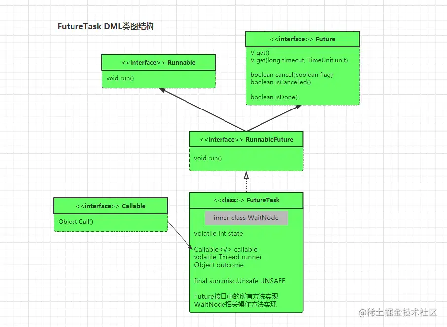
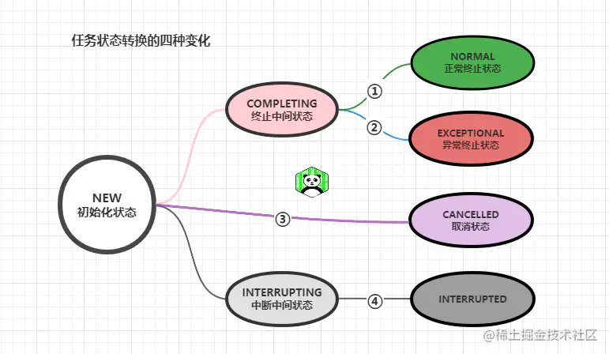
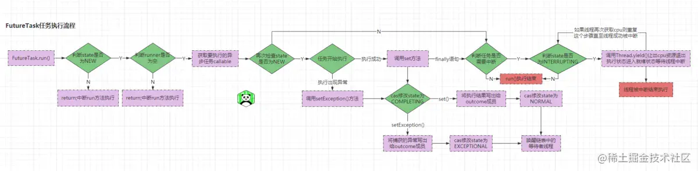
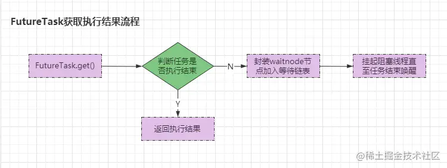

## 一、Runnable与Callable接口浅析

在Java中，一般开启多线程的方式都是使用创建Thread对象的方式，如下：

```java
java复制代码new Thread(
    @Override
    public void run() {}
).start();
```

但是这种方式显而易见的存在一个致命的缺陷：创建对象时就将线程执行者与要执行的任务绑定在了一块儿，使用起来不怎么灵活。所以可以通过实现Runnable接口的实现类创建出多线程任务对象，也可以直接通过创建Runnable匿名内部类对象达到同样的效果，如下：

```java
java复制代码public class Task implements Runnable{
    @Override
    public void run() {}
    
    public static void main(String[] args){
        Task task = new Task();    
        Thread t1 = new Thread(task);
        Thread t2 = new Thread(task);
        t1.start();t2.start();
        
        // 或者也可以这样！
        Runnable taskRunnable = new Runnable(){
            @Override
            public void run() {}
        };
        Thread tA = new Thread(task);
        Thread tB = new Thread(task);
        tA.start();tB.start();
    }
}
```

总的来说，上面的两种方式都将执行者`线程实体Thread对象`和任务`Runnable对象`分开，在实际编码过程中，可以选择多条线程同时执行一个`task`任务，这种方式会使得多线程编程更加灵活。

但是在实际开发过程中，往往有时候的多线程任务执行完成之后是需要返回值的，但是`Runnable`接口的`run()`方法是`void`无返回类型的，那么当需要返回值时又该怎么办呢？此时我们就可以用到`Callable`。先来看看`Callable`接口的定义：

```java
java复制代码@FunctionalInterface
public interface Runnable {
    public abstract void run();
}

@FunctionalInterface
public interface Callable<V> {
    V call() throws Exception;
}
```

显而易见，`Callable`接口与`Runnable`接口一样，都是被定义为一个函数式接口，且与`Runnable`接口一样仅提供了一个方法`call()`。与`Runnable`接口的不同点在于：

- `call()`方法可以有返回值，返回类型为泛型`V`，代表着支持所有类型的返回值。
- `call()`方法定义时声明了可以抛出异常：`throws Exception`，而`run()`则不行。

但是需要注意的是：虽然Thread类提供了很多构造器方法，但是没有一个构造方法是可以接收Callable对象的，如下：

```java
java复制代码public Thread()
public Thread(Runnable target)
Thread(Runnable target, AccessControlContext acc)
public Thread(ThreadGroup group, Runnable target)
public Thread(String name)
public Thread(ThreadGroup group, String name)
public Thread(Runnable target, String name)
public Thread(ThreadGroup group, Runnable target, String name)
public Thread(ThreadGroup group, Runnable target, 
        String name,long stackSize)
```

如上便是Thread类提供的所有构造器，如前面所说的那样，并没有提供一个可以直接接收Callable对象的构造器，那么在使用Callable时到底是怎么交给线程执行的呢？肯定需要依赖于别的东西才能交由线程执行，哪这个Callable依赖的东西到底是什么？FutureTask！先上个案例：

```java
java复制代码public static void main(String[] args) throws Exception {
    FutureTask<String> futureTask = new FutureTask<>(() ->
            Thread.currentThread().getName() + "-竹子爱熊猫......");
    new Thread(futureTask, "T1").start();
    System.out.println("main线程获取异步执行结果："
            + futureTask.get());
}

// 执行结果：main线程获取异步执行结果：T1-竹子爱熊猫......
```

嗯？怎么实现的？下面我们可以简单的看看源码(后续会详细分析)：

```java
java复制代码// FutureTask类
public class FutureTask<V> implements RunnableFuture<V> {
    // FutureTask类 → 构造方法
    public FutureTask(Callable<V> callable) {
        if (callable == null)
            throw new NullPointerException();
        this.callable = callable;
        this.state = NEW; // 将当前的任务状态设置为NEW新建状态
    }
}
// RunnableFuture接口
public interface RunnableFuture<V> extends Runnable, Future<V> {
    void run();
}
```

ok~，到目前为止我们可以发现，`FutureTask`构造器中可以接收一个`Callable`类型的对象，而`FutureTask`实现了`Runnable,Future`两个接口，所以当我们创建了一个`Callable`类型的任务时，可以先封装成一个`FutureTask`对象，再将封装好的`FutureTask`传递给线程执行即可。

## 二、Callable接口与FutureTask结构详解

上面我们简单的对于Runnable、Callable接口以及FutureTask进行介绍，接下来我们可以从源码角度分析一下具体的实现，先简单看看大体的类结构：

```java
java复制代码// Callable接口
@FunctionalInterface
public interface Callable<V> {
    V call() throws Exception;
}

// FutureTask类(省略其他代码，后续会详细介绍)
public class FutureTask<V> implements RunnableFuture<V>{}

// RunnableFuture接口
public interface RunnableFuture<V> extends Runnable, Future<V> {
    void run();
}

// Runnable接口
@FunctionalInterface
public interface Runnable {
    public abstract void run();
}

// Future接口
public interface Future<V> {
    // 尝试取消Callable任务，取消成功返回true，反之false
    boolean cancel(boolean mayInterruptIfRunning);
    // 判断Callable任务是否被取消
    boolean isCancelled();
    
    // 判断call()是否执行结束，结束返回true，反之false
    // 返回true的情况一共有三种：
    //      ①正常执行完成返回结果
    //      ②执行过程中抛出异常中断了执行
    //      ③Callable任务被取消导致执行结束
    boolean isDone();
    
    // 获取call()执行结果，执行完成则返回，未完成则阻塞至完成为止
    V get() throws InterruptedException, ExecutionException;
    // get()方法的升级版，如果未完成会阻塞直至执行完毕或超时
    V get(long timeout, TimeUnit unit)
        throws InterruptedException, ExecutionException, TimeoutException;
}
```

如上，`Callable`任务依赖`FutureTask`类执行，而`FutureTask`类实现了`RunnableFuture`接口，`RunnableFuture`接口实则没有提供新的方法，只是简单的继承整合了`Runnable,Future`两个接口，所以大体类图关系如下：
 
 在`FutureTask`中，与AQS一样，存在一个用`volatile`关键字修饰的int变量`state`，`FutureTask`通过它对任务的执行状态进行管理。如下：

```java
java复制代码    /*
     * Possible state transitions:
     * NEW -> COMPLETING -> NORMAL
     * NEW -> COMPLETING -> EXCEPTIONAL
     * NEW -> CANCELLED
     * NEW -> INTERRUPTING -> INTERRUPTED
     */
    private volatile int state;
    private static final int NEW          = 0;
    private static final int COMPLETING   = 1;
    private static final int NORMAL       = 2;
    private static final int EXCEPTIONAL  = 3;
    private static final int CANCELLED    = 4;
    private static final int INTERRUPTING = 5;
    private static final int INTERRUPTED  = 6;
```

`state`存在四种状态转换变化，如源码中的注释：

```java
java复制代码/*
 * Possible state transitions:
 * ①：NEW -> COMPLETING -> NORMAL
 * ②：NEW -> COMPLETING -> EXCEPTIONAL
 * ③：NEW -> CANCELLED
 * ④：NEW -> INTERRUPTING -> INTERRUPTED
 */
```

- `NEW`：初始化状态，任务刚被创建出来处于的状态
- `COMPLETING`：终止中间状态，任务从NEW变为NORMAL/EXCEPTIONAL时会经历的短暂状态
- `NORMAL`：正常终止状态，任务正常执行完成后处于的状态
- `EXCEPTIONAL`：异常终止状态，任务执行过程中抛出了异常后处于的状态
- `CANCELLED`：取消状态，任务被成功取消后处于的状态
- `INTERRUPTING`：中断中间状态，任务还未执行或在执行中时调用cancel(true)处于的中间状态
- `INTERRUPTED`：中断最终状态，执行任务被取消且执行线程被中断后处于的状态



如上便是`FutureTask`在不同情况下会经历的所有状态，当我们创建一个`FutureTask`时，`FutureTask`对象的`state`一定是处于`NEW`新建状态的，因为在`FutureTask`的构造方法中会执行`this.state = NEW;`操作。
 同时，随着任务开始执行之后，`FutureTask`的状态会开始发生转换，在`NEW→NORMAL`与`NEW→EXCEPTIONAL`两种状态转换过程中，还会出现`COMPLETING`中间状态，但这种中间状态存在的时间非常短暂，也会马上变成相应的最终状态。不过值得我们注意的是：，`FutureTask`的状态转换是不可逆的，并且同时只要状态不处于`NEW`初始化状态，那么就可以认为该任务已经结束，例如`FutureTask`判断任务是否执行结束的`isDone()`方法：

```java
java复制代码public boolean isDone() {
    // 只要任务状态不是NEW都返回true
    return state != NEW;
}
```

ok~，到目前为止我们已经简单了解了`FutureTask`的类图结构以及任务状态`state`，接下来再简单的看看`FutureTask`的整体成员结构。在`FutureTask`中存在两类线程：
 ①执行者：执行异步任务的线程，只存在一条线程
 ②等待者：等待获取执行结果的线程，可能存在多条线程
 后续我们都以“执行者”、“等待者”来称呼这两类线程，下面我们来看看`FutureTask`的成员：

```java
java复制代码// 任务的执行状态
private volatile int state;
// 异步任务：Callable对象
private Callable<V> callable;
// 任务执行结果（因为是Object类型，所以异常也是可以保存的）
private Object outcome;
// 执行者线程
private volatile Thread runner;
// 等待者线程：由WaitNode内部类构成的链表
private volatile WaitNode waiters;

// 静态内部类：WaitNode
static final class WaitNode {
    volatile Thread thread;
    volatile WaitNode next;
    WaitNode() { thread = Thread.currentThread(); }
}
```

前面我们曾提到过，`Future`接口的`get()`方法作用是获取异步执行之后的结果，若执行还未完成，获取执行结果的等待者则会阻塞。那么`FutureTask`作为`Future`接口的实现者，自然也对该方法进行了实现。而在`FutureTask`是怎么在"执行者"未执行完成的情况下，将想要获取结果的“等待者”阻塞的呢？这是因为`FutureTask`内部在逻辑上存在一个由`WaitNode`节点组成的单向链表，当一条线程尝试获取执行结果但是还未执行结束时，`FutureTask`则会每个等待者封装成一个`WaitNode`节点，并将其加入该链表中，直至执行者的任务执行完成后，再唤醒链表的每个节点中的线程。(有些类似于ReetrantLock的Condition等待队列实现模式)

而因为`FutureTask`内部的链表因为仅仅只是逻辑链表的原因，所以`FutureTask`本身只会将链表的`head`节点存储在成员变量`waiters`中，其余的节点通过`WaitNode`中的`next`后继指针连接。

ok~，到目前为止，对`FutureTask`的内部结构已经有了基本的全面认识，接下里我们再看看`FutureTask`的具体实现过程。

## 三、深入源码分析FutureTask执行流程及等待原理

在前面的类图结构中，可以看到`FutureTask`是实现了`RunnableFuture`接口的，而`RunnableFuture`接口继承了`Runnable,Future`两个接口，那么接下来分别从两个接口的实现来分析`FutureTask`接口的实现。

### 3.1、Runnable接口的执行流程实现分析

```java
java复制代码// Runnable接口
@FunctionalInterface
public interface Runnable {
    public abstract void run();
}
```

`Runnable`接口中仅提供了一个`run()`方法，所以我们先看看`FutureTask`中的`run()`实现：

```java
java复制代码// FutureTask类 → run()方法
public void run() {
    // ①判断state是否为NEW，如果不是代表任务已经执行过或被取消
    // ②判断执行者位置上是否有线程，有则代表着当前任务正在执行
    // 如果state不为NEW或者执行者不为空都会直接终止当前线程执行
    if (state != NEW ||
        !UNSAFE.compareAndSwapObject(this, runnerOffset,
                            null, Thread.currentThread()))
        return;
    
    // 如果state==NEW且runner==currentThread，接着继续往下执行
    try {
        // 获取需要执行的异步任务
        Callable<V> c = callable;
        // 检查任务是否为空并再次检查state是否处于初始化状态
        if (c != null && state == NEW) {
            // 接收结果
            V result; 
            // 接收终止状态：true为正常结束，false则为异常结束
            boolean ran; 
            try {
                // 调用call()执行任务并获取执行结果
                result = c.call();
                // 终止状态改为正常结束
                ran = true;
            } catch (Throwable ex) {
                // 返回结果置为空
                result = null;
                // 终止状态改为异常结束
                ran = false;
                // CAS-将捕获的异常设置给outcome全局变量
                setException(ex);
            }
            // 如果执行状态为正常结束
            if (ran)
                // CAS-将执行结果设置给outcome全局变量
                set(result);
        }
    } finally {
        // 将执行者线程的引用置为null
        runner = null;
        // 检查state是否为INTERRUPTING、INTERRUPTED中断状态
        int s = state;
        if (s >= INTERRUPTING)
            // 如果是则响应线程中断
            handlePossibleCancellationInterrupt(s);
    }
}
```

如上便是`FutureTask`对`run()`方法的实现，简单来说，在`FutureTask.run()`方法中主要做了如下四步：

- ①判断任务执行状态，如果正在执行或被执行过则直接`return`，反之则继续执行任务
- ②如果任务执行过程中出现异常，则调用`setException()`写出捕获的异常信息
- ③如果任务执行成功后，获取执行返回值并调用`set()`写出任务执行完成后的返回值
- ④任务执行结束时，判断任务状态是否需要中断，需要则调用`handlePossibleCancellationInterrupt()`进行中断处理

ok~，接下来再详细看看`setException()`与`set()`方法：

```java
java复制代码// FutureTask类 → setException()方法
protected void setException(Throwable t) {
    // 利用CAS机制将state改为COMPLETING中间状态
    if (UNSAFE.compareAndSwapInt(this,stateOffset,NEW,COMPLETING)) {
        // 将捕获的异常写出给outcome成员
        outcome = t;
        // 再次利用CAS修改state为EXCEPTIONAL异常终止状态
        UNSAFE.putOrderedInt(this,stateOffset,EXCEPTIONAL); // 最终态
        // 唤醒等待队列中的等待者线程
        finishCompletion();
    }
}

// FutureTask类 → set()方法
protected void set(V v) {
    // 利用CAS机制修改state为COMPLETING中间状态
    if (UNSAFE.compareAndSwapInt(this, stateOffset, NEW, COMPLETING)) {
        // 将执行结果写出给outcome成员
        outcome = v;
        // 再次利用CAS修改state为NORMAL正常终止状态
        UNSAFE.putOrderedInt(this, stateOffset, NORMAL); // 最终态
        // 唤醒等待队列中的等待者线程
        finishCompletion();
    }
}
```

如源码所示，当任务执行过程中抛出异常时会调用`setException()`方法而该方法的逻辑也分为四步：

- ①先使用CAS操作将`state`修改为`COMPLETING`中间状态
- ②将捕获的异常写出给`outcome`成员
- ③写出捕获的异常后再次使用CAS将`state`改为`EXCEPTIONAL`异常终止状态
- ④调用`finishCompletion()`方法唤醒等待列表中的等待者线程

不过当任务正常执行结束后会调用`set()`方法，而`set()`方法与`setException()`方法同理，也分为四步执行：

- ①先使用CAS操作将`state`修改为`COMPLETING`中间状态
- ②将任务正常执行结束的返回值写出给`outcome`成员
- ③写出后再次使用CAS将`state`改为`NORMAL`正常终止状态
- ④调用`finishCompletion()`方法唤醒等待列表中的等待者线程

ok~，紧接着再来看看唤醒等待链表中“等待者”线程的`finishCompletion()`方法：

```java
java复制代码// FutureTask类 → finishCompletion()方法
private void finishCompletion() {
// 该方法调用前state一定要为最终态
    // 获取waiters中保存的head节点，根据head遍历整个逻辑链表
    for (WaitNode q; (q = waiters) != null;) {
        // 利用cas操作将原本的head节点置null
        if (UNSAFE.compareAndSwapObject(this, waitersOffset, q, null)) {
            for (;;) {
                // 获取q节点的线程
                Thread t = q.thread;
                if (t != null) {
                    q.thread = null; // 置空线程引用信息
                    LockSupport.unpark(t);// 唤醒节点中的线程
                }
                // 获取链表中的下一个节点
                WaitNode next = q.next;
                // 如果下一个节点为空则代表着已经是链表尾部了
                if (next == null)
                    // 那么则终止循环
                    break;
                // 置空当前节点的后继节点引用信息方便GC
                q.next = null; 
                // 将获取到的后继节点赋值给q
                q = next;
            }
            // 当遍历完成整个链表后退出循环
            break;
        }
    }
    // done()方法没有具体实现，留给使用者自身用于拓展的
    // 可以根据需求让执行者线程在执行完毕前多做一点善后工作
    done();
    callable = null;        // to reduce footprint
}
```

`finishCompletion()`方法的逻辑相对来说就比较简单了，通过成员变量`waiters`中保存的`head`头节点与`next`后继节点指针，遍历唤醒整个逻辑链表所有节点中的等待者线程。

到目前为止，任务执行的逻辑都已经分析完毕了，但是在`FutureTask.run()`的最后，还存在`finally`语句块，这代表着不管任务执行过程中有没有出现异常都会执行的逻辑，如下：

```java
java复制代码finally {
    // 将执行者线程的引用置为null
    runner = null;
    // 检查state是否为INTERRUPTING、INTERRUPTED中断状态
    int s = state;
    if (s >= INTERRUPTING)
        // 如果是则响应线程中断
        handlePossibleCancellationInterrupt(s);
}

// FutureTask类 → handlePossibleCancellationInterrupt()方法
private void handlePossibleCancellationInterrupt(int s) {
    // 1.如果state==INTERRUPTING中断中间状态
    if (s == INTERRUPTING)
        // 3.如果线程再次从就绪状态获取到cpu资源回到执行状态
        //   循环调用yield()方法让当前线程持续处于就绪状态
        //   直至线程被中断且state==INTERRUPTED为止
        while (state == INTERRUPTING)
            // 2.调用yield()让当前线程让出cpu资源退出执行状态
            //   回到就绪状态方便响应线程中断
            Thread.yield(); 
}
```

在`finally`语句块中，会判断`state`是否为为`INTERRUPTING、INTERRUPTED`中断状态，如果是会调用`handlePossibleCancellationInterrupt()`方法响应线程中断操作，该方法的具体逻辑请参考如上源码我写的注释。整体执行流程如下：
 
 至此，整个FutureTask执行任务的流程分析结束。

### 3.2、FutureTask对Future接口的实现分析

在前面曾提到`FutureTask`实现了`RunnableFuture`接口，而`RunnableFuture`除开继承了`Runnable`外，还继承了`Future`接口，接着首先来看看Future接口的定义：

```java
java复制代码// Future接口
public interface Future<V> {
    // 尝试取消Callable任务，取消成功返回true，反之false
    boolean cancel(boolean mayInterruptIfRunning);
    // 判断Callable任务是否被取消
    boolean isCancelled();
    
    // 判断call()是否执行结束，结束返回true，反之false
    // 返回true的情况一共有三种：
    //      ①正常执行完成返回结果
    //      ②执行过程中抛出异常中断了执行
    //      ③Callable任务被取消导致执行结束
    boolean isDone();
    
    // 获取call()执行结果，执行完成则返回，未完成则阻塞至完成为止
    V get() throws InterruptedException, ExecutionException;
    // get()方法的升级版，如果未完成会阻塞直至执行完毕或超时
    V get(long timeout, TimeUnit unit)
        throws InterruptedException, ExecutionException, TimeoutException;
}
```

在`Future`接口中主要提供了两类方法：获取任务执行结果的`get`方法以及取消任务的`cancel`方法，我们依次从`get -> cancel`逐步分析。先来看看`FutureTask`类对`get`方法的实现：

```java
java复制代码// FutureTask类 → get()方法
public V get() throws InterruptedException, ExecutionException {
    // 获取任务状态
    int s = state;
    // 如果任务状态不大于终止中间状态则阻塞线程
    if (s <= COMPLETING)
        s = awaitDone(false, 0L);
    // 如果state大于终止中间状态则代表是最终态了，则返回执行结果
    return report(s);
}

// FutureTask类 → 超时版get()方法
public V get(long timeout, TimeUnit unit)
    throws InterruptedException, ExecutionException, TimeoutException {
    if (unit == null)
        throw new NullPointerException();
    int s = state;
    // 如果任务还没执行完成，那么调用awaitDone传递给定的时间阻塞线程
    // 如果时间到了状态还是不大于COMPLETING则代表任务还未执行结束
    // 那么抛出TimeoutException强制中断当前方法执行，退出等待状态
    if (s <= COMPLETING &&
        (s = awaitDone(true, unit.toNanos(timeout))) <= COMPLETING)
        throw new TimeoutException();
    // 如果任务执行完成或在给定时间内执行完成则返回执行结果
    return report();
}
```

`FutureTask.get()`方法的逻辑相对来说就比较简单了：

- ①首先判断了一下任务有没有执行结束(state是否<=COMPLETING，如果<=代表还没结束)
- ②如果任务还未执行或还在执行过程中，调用`awaitDone()`方法阻塞当前等待者线程
- ③如果任务已经执行结束(状态变为了最终态)，调用`report()`返回执行的结果

而超时等待版的`FutureTask.get()`方法则是在第二步的时候有些不一致，在超时版本的get方法中，当任务还未执行或者还在执行过程中的情况下，会调用`awaitDone(true,unit.toNanos(timeout)))`方法在给定的时间内等待，如果时间到了任务还未执行结束则会抛出`TimeoutException`异常强制线程退出等待状态。

ok~，接着再来看看`awaitDone()`和`report()`方法：

```java
java复制代码// FutureTask类 → awaitDone()方法
private int awaitDone(boolean timed, long nanos)
        throws InterruptedException {
    // 计算等待的截止时间
    final long deadline = timed ? System.nanoTime() + nanos : 0L;
    WaitNode q = null;
    boolean queued = false;
    for (;;) {
        // 如果出现线程中断信息则移除等待链表节点信息
        if (Thread.interrupted()) {
            removeWaiter(q);
            throw new InterruptedException();
        }
        
        // 再次获取任务状态，如果大于COMPLETING
        // 代表任务已经执行结束，直接返回最新的state值
        int s = state;
        if (s > COMPLETING) {
            if (q != null)
                q.thread = null;
            return s;
        }
        // 如果state==中间状态代表任务已经快执行完成了
        // 那么则让当前线程让出cpu资源进入就绪状态稍微等待
        else if (s == COMPLETING) // cannot time out yet
            Thread.yield();
        // 如果任务还在执行或还未执行则构建waitnode节点
        else if (q == null)
            q = new WaitNode();
        // 利用cas机制将构建好的waitnode节点加入逻辑链表
        // 注意：该链表是栈的结构，所以并不是将新的节点
        // 变为之前节点的next，而是新节点变为head节点
        // 旧节点变为next后继节点（这样方便维护逻辑链表结构）
        else if (!queued)
            queued = UNSAFE.compareAndSwapObject(this, waitersOffset,
                                                 q.next = waiters, q);
        // 如果是超时等待的模式，则先判断时间有没有超时
        // 如果已经超时则删除对应节点并返回最新的state值
        else if (timed) {
            nanos = deadline - System.nanoTime();
            if (nanos <= 0L) {
                removeWaiter(q);
                return state;
            }
            // 如果还没超时则将线程挂起阻塞指定时间
            LockSupport.parkNanos(this, nanos);
        }
        else
            // 如果不是超时版本则直接挂起阻塞线程
            LockSupport.park(this);
    }
}

// FutureTask类 → report()方法
private V report(int s) throws ExecutionException {
    // 获取成员变量outcome的值
    Object x = outcome;
    // 如果state为正常终止状态则返回执行结果
    if (s == NORMAL)
        return (V)x;
    // 如果任务被取消或线程被中断则抛出CancellationException异常
    if (s >= CANCELLED)
        throw new CancellationException();
    // 如果state为异常终止状态则抛出捕获的异常信息
    throw new ExecutionException((Throwable)x);
}
```

ok~，源码如上，先来看看略微复杂的`awaitDone()`方法，在`awaitDone()`方法首先会计算等待的截止时间（如果不需要超时等待则没有截止时间），计算好等待的截止时间之后会开启一个死循环，在循环中每次都会执行如下步骤：

- ①判断当前等待者线程是否被其他线程中断，如果是则移除对应节点信息并抛出`InterruptedException`异常强制中断执行
- ②判断state是否大于COMPLETING，大于则代表任务执行结束，置空当前节点线程信息并返回最新state值
- ③判断state是否等于COMPLETING，等于则代表执行即将结束，当前线程让出CPU资源，退出执行状态并进入就绪状态，等待最终态的出现
- ④如果任务还未执行结束，则判断当前等待者线程是否已经构建waitnode节点，如果没有则为当前线程构建节点信息
- ⑤如果新构建出的节点还未加入等待链表，则利用cas机制将构建的节点设置为head节点，老head变为当前节点的next节点
- ⑥使用`LockSupport`类将当前线程挂起阻塞，如果是超时等待的`get()`则挂起阻塞特定时间

如上即是整个`awaitDone()`方法的执行流程，上个例子理解一下：

> 假设目前一个FutureTask任务状态为NEW，并且成员waiter=null(相当于链表为空，head=null)。这时候两条线程：T1先调用get()获取执行结果,紧接着T2也调用get()尝试获取执行结果，同时此时任务还未开始执行或者还在执行过程中，那么这两条线程的执行流程如下：

- T1：第一次循环时，`q==null且!queued`条件成立，为T1构建节点信息并利用cas机制将`waiter=T1`,T1节点成为head节点，第一次循环结束
- T2：第一次循环时，`q==null且!queued`条件成立，为T2构建节点信息并利用cas机制将`waiter=T2,next=T1`,T2成为head节点，T1成为后继节点，第一次循环结束
- T1：第二次循环时，假设任务还在执行或还未执行，所有条件都不成立，只有最后的阻塞条件成立，阻塞T1线程，T1挂起直至执行结束
- T2：第二次循环时，假设任务还在执行或还未执行，所有条件都不成立，只有最后的阻塞条件成立，阻塞T2线程，T2挂起直至执行结束
- T1：任务执行结束后调用`finishCompletion()`唤醒链表中的线程，T1恢复执行，第三次循环开始，`state>COMPLETING`成立，清空节点线程信息并返回最新state值
- T2：任务执行结束后调用`finishCompletion()`唤醒链表中的线程，T2恢复执行，第三次循环开始，`state>COMPLETING`成立，清空节点线程信息并返回最新state值

ok~，Future接口的`get`方法分析到此结束了，接着继续来看看`cancel()`方法：

```java
java复制代码// FutureTask类 → cancel()方法
// 入参为true代表中断执行者线程执行
// 入参为false代表取消任务执行
public boolean cancel(boolean mayInterruptIfRunning) {
    // 如果state!=NEW代表任务已经执行结束，直接返回false
    // 如果入参为false则CAS修改state=CANCELLED，返回true即可
    if (!(state == NEW &&
          UNSAFE.compareAndSwapInt(this, stateOffset, NEW,
              mayInterruptIfRunning ? INTERRUPTING : CANCELLED)))
        return false;
    // 因为call()方法执行过程中可能会抛出异常
    // 所以需要try finally语句块保证等待者线程唤醒
    try {
        // 如果入参为true，则中断执行者线程
        if (mayInterruptIfRunning) {
            try {
                Thread t = runner;
                if (t != null)
                    // interrupt()不能保证一定中断执行线程
                    // 因为强制中断线程不安全，所以java弃用了stop()方法
                    // 而是换成了协调式中断，线程调用interrupt()后
                    // 只会发出中断信号，由被中断线程决定响不响应中断操作
                    t.interrupt();
            } finally { // final state
                // 中断后利用CAS修改state=INTERRUPTED最终态
                UNSAFE.putOrderedInt(this, stateOffset, INTERRUPTED);
            }
        }
    } finally {
        // 不管是取消任务还是中断执行，完成后都会唤醒等待链表的所有线程
        finishCompletion();
    }
    return true;
}
```

当某条调用`FutureTask.cancel()`方法后，会根据传入的`boolean`值决定是进行中断执行者线程操作还是取消任务执行，具体执行逻辑如下：

- ```
  mayInterruptIfRunning
  ```

  传入

  ```
  true
  ```

  的情况下：

  - ①判断任务是否已经执行结束，是则直接返回`false`，反之则利用cas机制将`state=INTERRUPTING`中断中间状态
  - ②获取执行者线程`runner`成员，调用执行者的`interrupt()`方法向执行者线程发出一个中断信号
  - ③利用CAS机制将`state=INTERRUPTED`中断最终态
  - 调用`finishCompletion()`方法唤醒链表中的所有等待者线程

- ```
  mayInterruptIfRunning
  ```

  传入

  ```
  false
  ```

  的情况下：

  - ①判断任务是否已经执行结束，是则直接返回`false`
  - ②如果任务还未执行或还在执行则利用cas机制将`state=CANCELLED`取消状态

但是不难发现，在前面的源码注释中，我曾写到`t.interrupt()`方法是无法强制中断线程执行的，具体原因并不是因为无法做到强制中断，这个是可以实现的，在JDK的早期版本中`Thread`也提供了`stop()`方法可以用来强制停止执行线程，但是因为强制关闭执行线程会导致一系列的问题产生，如：安全性问题、数据一致性问题等，所以在JDK后续的版本中便弃用了`stop()`这类强制式中断线程的方法，而是换成`interrupt()`这种协调式中断的方法。当一条线程调用另外一条线程的`interrupt()`方法后并不会直接强制中断线程，而是仅仅给需要中断的线程发送一个中断信号，而是否中断执行则是由执行线程本身决定的，而关于执行线程是否能检测到这个发出的中断信号则需要取决于执行线程运行的代码。

ok~，哪有人可能会疑惑：不能保证一定中断执行者线程，那么这个`cancel()`方法还有作用吗？
 答案是肯定有用的，因为调用`cancel()`方法之后，只要任务没有执行结束的情况下，`state`一定会被修改成`CANCELLED`或者`INTERRUPTING`状态，那么后续等待者线程在执行`get`时则会检测到任务状态已经不是`NEW`了，那么则不会`awaitDone()`方法阻塞等待。

到目前为止，Future接口的两个核心方法已经分析结束了，接着来看看两个`is`判断类型的方法：`isCancelled()、isDone()`：

```java
java复制代码// FutureTask类 → isCancelled()方法
public boolean isCancelled() {
    // 如果state>=CANCELLED都代表状态不是执行终止状态
    // 那么则代表着肯定是中断或者取消状态，所以：
    // state>=CANCELLED代表任务被取消，反之则是没有
    return state >= CANCELLED;
}

// FutureTask类 → isDone()方法
public boolean isDone() {
    // 如果state!=NEW初始化状态则代表任务执行结束
    // 因为就算是中间状态也会很快变为最终态
    return state != NEW;
}
```

最后再上个简单的`FutureTask.get()`执行流程：
 

### 3.3、FutureTask总结

在FutureTask出现之前，Java中的多线程编程执行任务后是不能获取执行结果的，当我们需要多线程执行后的结果时则需要自己经过复杂的实现(如写到缓存或者全局变量中主线程再去读取)。而FutureTask整合了Runnable、Callable、Future三个接口，使得我们的多线程任务执行后可以异步获取到多线程的执行结果。FutureTask会将执行结束后的结果保存在成员变量：outcome中，等待获取执行结果的线程则读取outcome成员值即可。

## 四、CompletableFuture类详解

在之前的FutureTask中，如果想要获取到多线程执行的结果，有两种办法，一种是轮询`FutureTask.isDone()`方法，当结果为true的时候获取执行结果，第二种则是调用`FutureTask.get()`方法。但是无论那种方式都无法实现真正意义上的异步回调，因为任务执行需要时间，所以都会使得主线程被迫阻塞，等待执行结果返回后才能接着往下执行，最多只能在一定程度上减少等待方面开销的时间，如：

```java
java复制代码public static void main(String[] args) throws Exception {
    FutureTask<String> futureTask = new FutureTask<>(() ->
            Thread.currentThread().getName() + "-竹子爱熊猫......");
    new Thread(futureTask, "T1").start();
    
    // 可以在这里先完成别的工作，因为任务执行需要时间
    
    // 最后再获取执行结果
    System.out.println("main线程获取异步执行结果："
            + futureTask.get());
}
```

这种方式可以在一定程度上利用异步任务执行的时间来完成别的工作，但是总归来说与“异步获取执行结果”这个设计的初衷还是存在出入。而CompletableFuture的出现则可以实现真正意义上的实现异步，不会在使用时因为任务还没执行完成导致获取执行结果的线程也被迫阻塞，CompletableFuture将处理执行结果的过程也放到异步线程里去完成，采用回调函数的概念解决问题。

CompletableFuture是JDK8支持函数式编程后引入的一个类，实现了Future与CompletionStage接口，利用CompletionStage接口中提供的方法去支持任务完成时触发的函数和操作，用then，when等操作来防止FutureTask的get阻塞和轮询isDone的现象出现。不过因为CompletableFuture类是JDK8中新加入的，所以它在使用的时候，会配合大量的函数编程、链式编程、Lambda表达式等一些JDK1.8的特性，所以如果对于JDK1.8特性不太了解的可以参考之前的文章：[Java8新特性](https://link.juejin.cn?target=https%3A%2F%2Fwww.jianshu.com%2Fp%2Fa93a31d4648a)。

> 因为CompletableFuture类中提供的方法有大概五六十个，同时也存在非常多的内部类，所以本次我们就一个个的依次分析一些重要的方法，先简单的认识后再逐步深入的分析原理实现。

### 4.1、CompletableFuture异步任务的创建方式

CompletableFuture中创建一个异步任务的方式总归有三种：

- ①与之前的FutureTask一样的使用方式，通过new对象完成创建
- ②通过CompletableFuture提供的静态方法完成创建
- ③通过CompletableFuture提供的成员方法完成创建

下面逐步来一个个演示：

#### 4.1.1、创建CompletableFuture对象的方式创建异步任务

CompletableFuture类因为是作为FutureTask的优化版本，所以除开Java8语法的写法之外，也保留了FutureTask的用法，如下：

```java
java复制代码public class CompletableFutureDemo {
    public static void main(String[] args) throws Exception {
        CompletableFuture completableFuture = new CompletableFuture();
        new Thread(()->{
            System.out.println("异步任务......");
            // 执行完成后可以往CompletableFuture对象里面写出返回值
            completableFuture.complete(Thread.currentThread().getName());
        }).start();
        // 主线程获取异步任务执行结果
        System.out.println("main线程获取执行结果：" + completableFuture.get());
        for (int i = 1; i <= 3; i++){
            System.out.println("main线程 - 输出："+i);
        }
        
    }
   /**
     *  执行结果：
     *     异步任务......
     *     main线程获取执行结果：Thread-0
     *     main线程 - 输出：1
     *     main线程 - 输出：2
     *     main线程 - 输出：3
     */
}
```

这种方式比较简单，也比较容易理解，创建一条线程执行异步操作，执行完成后往`completableFuture`对象中写入需要返回的值，而主线程则调用`completableFuture.get()`方法获取异步线程写回的值。单身显而易见，这种方式与之前的`FutureTask`没任何区别，在主线程获取到执行结果之前，因为任务还在执行，所以主线程会被迫阻塞，等待任务执行结束后才能继续往下执行。

#### 4.1.2、通过CompletableFuture静态方法完成异步任务创建

CompletableFuture类提供了五个静态方法可以完成创建异步任务的操作，如下：

```java
java复制代码public static CompletableFuture<Void> runAsync(Runnable runnable);
public static CompletableFuture<Void> runAsync(Runnable runnable,Executor executor);
public static <U> CompletableFuture<U> supplyAsync(Supplier<U> supplier);
public static <U> CompletableFuture<U> supplyAsync(Supplier<U> supplier,Executor executor);
public static <U> CompletableFuture<U> completedFuture(U value);
```

在这四个方法中，`run`开头的代表创建一个没有返回值的异步任务，`supply`开头的方法代表创建一个具备返回值的异步任务。同时这两类方法都支持指定执行线程池，如果不指定执行线程池，CompletableFuture则会默认使用`ForkJoinPool.commonPool()`线程池内的线程执行创建出的异步任务。 ok~，上个案例理解一下：

> 创建一个异步任务完成100内的偶数求和，执行完成后返回求和结果，代码如下：

```java
java复制代码public class CompletableFutureDemo {
    public static void main(String[] args) throws Exception {
        // 创建有返回值的异步任务 ::为方法引用的语法
        CompletableFuture<String> supplyCF = CompletableFuture
                .supplyAsync(CompletableFutureDemo::evenNumbersSum);
        // 执行成功的回调
        supplyCF.thenAccept(System.out::println);
        // 执行过程中出现异常的回调
        supplyCF.exceptionally((e)->{
            e.printStackTrace();
            return "异步任务执行过程中出现异常....";
        });
        // 主线程执行打印1234...操作
        // 因为如果不为CompletableFuture指定线程池执行任务的情况下，
        // CompletableFuture默认是使用ForkJoinPool.commonPool()的线程
        // 同时是作为main线程的守护线程进行的，如果main挂了，执行异步任
        // 务的线程也会随之终止结束，并不会继续执行异步任务
        for (int i = 1; i <= 10; i++){
            System.out.println("main线程 - 输出："+i);
            Thread.sleep(50);
        }
    }
    // 求和100内的偶数
    private static String evenNumbersSum() {
        int sum = 0;
        try {
            Thread.sleep(100);
        } catch (InterruptedException e) {
            e.printStackTrace();
        }
        for (int i = 1; i <= 100; i++) {
            if (i % 2 == 0) sum += i;
        }
        return Thread.currentThread().getName()+"线程 - 100内偶数之和："+sum;
    }
   /**
     * 执行结果：
     *      main线程 - 输出：1
     *      main线程 - 输出：2
     *      ForkJoinPool.commonPool-worker-1线程 - 100内偶数之和：2550
     *      main线程 - 输出：3
     *      main线程 - 输出：4
     *      main线程 - 输出：5
     *      main线程 - 输出：6
     *      main线程 - 输出：7
     *      main线程 - 输出：8
     *      main线程 - 输出：9
     *      main线程 - 输出：10
     **/
    
}
```

如上案例，通过了`CompletableFuture.supplyAsync`创建了一个带返回值的异步任务`supplyCF`，因为没有指定线程池则使用默认的`ForkJoinPool.commonPool()`线程池来完成该任务的执行，同时采用`supplyCF.thenAccept`作为成功的回调方法，采用`supplyCF.exceptionally`作为执行过程中抛出异常时的回调方法，同时主线程`main`创建完成异步任务后，写好了成功和失败的回调函数后，继续执行打印`1、2、3、4...`的逻辑。从上面的执行结果我们可以看出，当main线程创建好异步任务以及相关后续处理后，其实并没有阻塞等待任务的完成，而是继续执行接下来的逻辑，当任务执行结束时则会触发提前定义好的回调函数，返回任务执行结果(执行出现异常则会将捕获的异常信息返回给exceptionally回调函数)。显而易见，`CompletableFuture`任务对比之前的`FutureTask`任务，在执行上以及执行结果返回上实现了真正意义上的“异步”。

ok~，接下来再看看其他几种创建`CompletableFuture`异步任务的静态方法使用。如下：

```java
java复制代码public class CompletableFutureDemo {
    public static void main(String[] args) throws Exception {
        // 创建有返回值的异步任务
        CompletableFuture<String> supplyCF = CompletableFuture
                .supplyAsync(CompletableFutureDemo::evenNumbersSum);
        // 执行成功的回调
        supplyCF.thenAccept(System.out::println);
        // 执行过程中出现异常的回调
        supplyCF.exceptionally((e)->{
            e.printStackTrace();
            return "异步任务执行过程中出现异常....";
        });
        // 主线程执行打印1234...操作
        // 因为如果不为CompletableFuture指定线程池执行任务的情况下，
        // CompletableFuture默认是使用ForkJoinPool.commonPool()的线程
        // 同时是作为main线程的守护线程进行的，如果main挂了，执行异步任
        // 务的线程也会随之终止结束，并不会继续执行异步任务
        for (int i = 1; i <= 10; i++){
            System.out.println("main线程 - 输出："+i);
            Thread.sleep(50);
        }
        
        /***************************************************/
        
        // 创建一个异步任务，已经给定返回值了
        CompletableFuture c = CompletableFuture.completedFuture("竹子");
        c.thenApply(r -> {
            System.out.println("上个任务结果："+r);
            return r+"...熊猫";
        });
        c.thenAccept(System.out::println);
        
        /***************************************************/

        // 创建一个没有返回值的异步任务
        CompletableFuture runCF = CompletableFuture.runAsync(()->{
            System.out.println(Thread.currentThread().getName()+"没有返回值的异步任务");
        });
        
        /***************************************************/
        
        // 创建单例的线程池
        ExecutorService executor = Executors.newSingleThreadExecutor();
        // 创建一个有返回值的异步任务并指定执行的线程池
        CompletableFuture<String> supplyCFThreadPool =
                CompletableFuture.supplyAsync(CompletableFutureDemo::oddNumbersSum,executor);
        // // 执行过程中出现异常的回调
        supplyCFThreadPool.thenAccept(System.out::println);
        // 执行过程中出现异常的回调
        supplyCF.exceptionally((e)->{
            e.printStackTrace();
            return "异步任务执行过程中出现异常....";
        });
        
        // 关闭线程池
        executor.shutdown();
    }

    // 求和100内的偶数
    private static String evenNumbersSum() {
        int sum = 0;
        try {
            Thread.sleep(100);
        } catch (InterruptedException e) {
            e.printStackTrace();
        }
        for (int i = 1; i <= 100; i++) {
            if (i % 2 == 0) sum += i;
        }
        return Thread.currentThread().getName()+"线程 - 100内偶数之和："+sum;
    }
    
    // 求和100内的奇数
    private static String oddNumbersSum() {
        int sum = 0;
        try {
            Thread.sleep(100);
        } catch (InterruptedException e) {
            e.printStackTrace();
        }
        for (int i = 1; i <= 100; i++) {
            if (i % 2 != 0) sum += i;
        }
        return Thread.currentThread().getName()+"线程 - 100内奇数之和："+sum;
    }
}
```

在上述的案例中，分别创建了四个异步任务，第一个则是前面分析的案例，不再赘述。

- 第二个则是创建了一个有返回值的异步任务，同时与第一个任务不同的是：我们指定执行的线程池`executor`，那么该任务在执行的时候则不会使用默认的`ForkJoinPool.commonPool()`线程池，不过在使用这种方式的时候，一定要记住需要关闭自己创建的线程池。
- 第三个异步任务则是通过`CompletableFuture.runAsync`方法创建了一个没有返回值的异步任务，传递的参数是一个`Runnable`对象，与最开始的`new Thread()`方式区别不大，但是与之不同的是：该任务的执行因为没有指定线程池，所以也是通过默认的`ForkJoinPool.commonPool()`线程池执行的，而不会另起线程执行。
- 第四个任务则是创建了一个已经提前指定了返回值的`CompletableFuture`任务，很多人可能会感觉这种方式很鸡肋，但是可以配合CompletableFuture成员方法完成链式创建。

#### 4.1.3、通过CompletableFuture成员方法完成异步任务创建

在使用这种方式创建任务的前提是需要建立在已经创建出一个`CompletableFuture`对象上。总归来说这类成员方法创建异步任务的方式属于串行化的形式创建的，下一个任务依赖于上一个任务的执行结果时，就可以采用这种方式。CompletableFuture中提供很多这类方法：

```java
java复制代码// 可以基于CompletableFuture对象接着创建一个有返回任务
public <U> CompletableFuture<U> thenApply(Function<? super T,
                                ? extends U> fn)
public <U> CompletableFuture<U> thenApplyAsync(Function<? super T,
                                ? extends U> fn)
public <U> CompletableFuture<U> thenApplyAsync(Function<? super T,
                                ? extends U> fn, Executor executor)

// 可以在上一个任务执行失败的情况下接着执行
public <U> CompletionStage<U> handle(BiFunction<? super T, Throwable, 
                                    ? extends U> fn);
public <U> CompletionStage<U> handleAsync(BiFunction<? super T, Throwable, 
                                    ? extends U> fn);
public <U> CompletionStage<U> handleAsync(BiFunction<? super T, Throwable, 
                                    ? extends U> fn,Executor executor);

// 可以基于CompletableFuture对象接着创建一个无返回任务
CompletionStage<Void> thenRun(Runnable action); 
CompletionStage<Void> thenRunAsync(Runnable action); 
CompletionStage<Void> thenRunAsync(Runnable action,Executor executor); 

// 与thenApply方法类似，但是thenApply方法操作的是同一个CompletableFuture
// 而该类方法则是生产新的CompletableFuture<返回值>对象进行操作
public <U> CompletableFuture<U> thenCompose(Function<? super T, 
                        ? extends CompletionStage<U>> fn);
public <U> CompletableFuture<U> thenComposeAsync(
        Function<? super T, ? extends CompletionStage<U>> fn);
public <U> CompletableFuture<U> thenComposeAsync(Function<? super T, 
                ? extends CompletionStage<U>> fn,Executor executor)
```

如上列出来了一些常用的方法，方法总体分为四类，这四类方法都可以使得任务串行化执行：

- ①thenApply类：此类方法可以基于上一个任务再创建一个新的有返回型任务。
- ②handle类：与thenApply类作用相同，不同点在于thenApply类方法只能在上一个任务执行正常的情况下才能执行，当上一个任务执行抛出异常后则不会执行。而handle类在上个任务出现异常的情况下也可以接着执行。
- ③thenRun类：此类方法可以基于上一个任务再创建一个新的无返回型任务。
- ④thenCompose类：与thenApply类大致相同，不同点在于每次向下传递都是新的CompletableFuture对象，而thenApply向下传递的都是同一个CompletableFuture对象对象

但是不难发现，不管是哪类方法，其实方法名都会有后面跟了`Async`的和没跟`Async`的，那么这种跟了`Async`代表什么意思呢？如果调用方法名不带`Async`的方法创建出的任务都是由上一个任务的执行线程来执行的，在上一个任务没有执行完成的情况下，当前创建出来的任务会等待上一个任务执行完成后再执行。而如果是通过`Async`这类方法创建出来的任务则不受到这个限制，通过调用方法名带`Async`的方法创建出的任务，具体的执行线程会根据实际情况来决定，主要会分为如下三种情况：

- ①上一个任务已经执行结束了，那么当前创建出的任务会交给上个任务的执行线程来执行
- ②上一个任务还没有执行结束，那么则会另启一条线程来执行
- ③如果创建任务时指定了执行线程池，则会使用指定线程池的线程来执行

ok~，对这些方法有了基本了解之后再接着来看个案例：

```java
java复制代码public class CompletableFutureDemo {
    public static void main(String[] args) throws Exception {
        CompletableFuture cf =
                CompletableFuture.supplyAsync(CompletableFutureDemo::evenNumbersSum)
                    // 链式编程：基于上个任务的返回继续执行新的任务
                    .thenApply(r -> {
                        System.out.println("获取上个任务的执行结果：" + r);
                        // 通过上个任务的执行结果完成计算：求和100所有数
                        return r + oddNumbersSum();
                    }).thenApplyAsync(r -> {
                        System.out.println("获取上个任务的执行结果：" + r);
                        Integer i = r / 0; // 拋出异常
                        return r;
                    }).handle((param, throwable) -> {
                        if (throwable == null) {
                            return param * 2;
                        }
                        // 获取捕获的异常
                        System.out.println(throwable.getMessage());
                        System.out.println("我可以在上个任务" +
                                "抛出异常时依旧执行....");
                        return -1;
                    }).thenCompose(x -> 
                        CompletableFuture.supplyAsync(() -> x+1
                    )).thenRun(() -> {
                        System.out.println("我是串行无返回任务....");
                });

        // 主线程执行休眠一段时间
        // 因为如果不为CompletableFuture指定线程池执行任务的情况下，
        // CompletableFuture默认是使用ForkJoinPool.commonPool()的线程
        // 同时是作为main线程的守护线程进行的，如果main挂了，执行异步任
        // 务的线程也会随之终止结束，并不会继续执行异步任务
        Thread.sleep(2000);
    }

    // 求和100内的偶数
    private static int evenNumbersSum() {
        int sum = 0;
        try {
            Thread.sleep(100);
        } catch (InterruptedException e) {
            e.printStackTrace();
        }
        for (int i = 1; i <= 100; i++) {
            if (i % 2 == 0) sum += i;
        }
        return sum;
    }

    // 求和100内的奇数
    private static int oddNumbersSum() {
        int sum = 0;
        try {
            Thread.sleep(100);
        } catch (InterruptedException e) {
            e.printStackTrace();
        }
        for (int i = 1; i <= 100; i++) {
            if (i % 2 != 0) sum += i;
        }
        return sum;
    }
}
```

在案例中，我们创建了六个异步任务：

- ①求和100内的所有偶数
- ②基于第一个任务的结果再加上100内奇数总值计算100内所有数字的总和
- ③基于第二个任务的结果除0抛出一个异常
- ④使用handle创建一个可以在上个任务抛出异常时依旧执行的任务
- ⑤使用thenCompose创建一个基于上个任务返回值+1的任务
- ⑥使用thenRun创建了一个没有返回值的任务

执行结果如下：

```java
java复制代码/* *
 * 执行结果：
 *      获取上个任务的执行结果：2550
 *      获取上个任务的执行结果：5050
 *      java.lang.ArithmeticException: / by zero
 *      我可以在上个任务抛出异常时依旧执行....
 *      我是串行无返回任务....
 * */
```

至此，三种创建CompletableFuture异步任务的方式介绍完毕，接下来再看看CompletableFuture中一些其他的常用操作。

### 4.2、CompletableFuture异步任务执行结果获取及回调处理

在之前的`FutureTask`获取执行结果是通过`FutureTask.get()`获得，而在CompletableFuture中则提供了多样化的方式，可以与之前的FutureTask阻塞式获取，也可以通过回调函数的方式异步通知，接下来可以看看CompletableFuture中提供的一些相关方法：

```java
java复制代码// 阻塞主线程获取执行结果（与FutureTask.get()一致）
public T get();
// 上个方法的超时版本
public T get(long timeout,TimeUnit unit);
// 尝试获取执行结果，执行完成返回执行结果，未完成返回任务参数
public T getNow(T valueIfAbsent);
// 阻塞主线程等待任务执行结束
public T join();
// 无返回的异步任务正常执行完成后可以通过此方法写出返回值
public boolean complete(T value);
// 无返回的异步任务执行异常后可以通过此方法写出捕获的异常信息
public boolean completeExceptionally(Throwable ex);

// 任务正常执行完成后的回调函数：默认由执行任务的线程执行回调逻辑
public CompletionStage<Void> thenAccept(Consumer<? super T> action);
// 任务正常执行完成后的回调函数：另启一条线程执行回调逻辑
public CompletionStage<Void> thenAcceptAsync(Consumer<? super T> action);
// 任务正常执行完成后的回调函数：指定线程池执行回调逻辑
public CompletionStage<Void> thenAcceptAsync(Consumer<? super T> action,
                                Executor executor);
// 执行过程中出现异常时执行的回调方法
public CompletableFuture<T> exceptionally(Function<Throwable,? extends T> fn)
                                
// 执行结束后会执行的回调逻辑
public CompletableFuture<T> whenComplete(BiConsumer<? super T,
                            ? super Throwable> action)
// 上个方法的异步版本
public CompletableFuture<T> whenCompleteAsync(BiConsumer<? super T,
                            ? super Throwable> action)
// 上个方法的指定线程池版本
public CompletableFuture<T> whenCompleteAsync(BiConsumer<? super T,
                            ? super Throwable> action, Executor executor)
```

上面列出的这些方法总归分为如下几种：

- ①主线程调用直接获取执行结果的`get、getNow`方法
- ②可以为无返回值的异步任务写出执行结果的：`complete`开头的方法
- ②任务正常执行成功的回调：`thenAccept`开头的方法
- ④任务执行抛出异常的回调：`exceptionally`方法
- ⑤任务执行结束的回调：`whenComplete`开头的方法

ok~，这些方法使用起来比较简单，就不再上案例演示了，因为本章篇幅已经够长了，下面还有内容要谈，所以感兴趣的可以自己写个简单的`Demo`调试。

### 4.3、CompletionStage任务时序关系：串行、并行、汇聚实现

CompletableFuture是同时实现了`CompletionStage`与`Future`接口的，而在CompletionStage接口中提供了一些方法可以很好的描述任务之间串行、并行、汇聚等时序关系。

#### 4.3.1、CompletionStage任务之间的时序关系 - 串行

CompletableFuture类中的实现中，总归有五大类方法用来描述任务之间串行关系的方法，它们分别为：`thenApply`、`thenAccept`、`thenRun`、`handle`以及`thenCompose`，在CompletableFuture类中方法名以这五个开头的函数都是用来描述任务之间的串行关系。

> 关于CompletableFuture串行的解读：比如目前创建三个任务①②③，这三个任务都是异步的方式执行的，但是任务②依赖于①的执行结果，任务③依赖于②的执行结果，执行顺序总为①→②→③，这种关系便被称为串行关系。

ok~，关于串行的案例可以参考`4.1.3、通过CompletableFuture成员方法完成异步任务创建`段落。

#### 4.3.2、CompletionStage任务之间的时序关系 - 并行

在CompletionStage中并没有关于描述任务之间并行并行关系的方法，因为也没有必要，毕竟并行只是串行的多执行。

> 可能有人会不解我上面最后一句话：“毕竟并行只是串行的多执行”。那我们举个例子理解：比如main主线程创建三个任务①②③，全部交由T1线程执行，那么执行关系便是T1执行①→②→③，这种情况被称为串行异步。而并行则是指main主线程创建三个任务①②③，并将这三个任务分别交由：T1、T2、T3三条不同的线程执行，三条线程同时执行三个不同的任务，执行则是T1→①，T2→②，T3→③，这种情况便被称为并行异步。

ok~，上个例子：假设目前需要分别求和100内的所有奇数与偶数之和，实现如下：

```java
java复制代码public class CompletableFutureDemo {
    public static void main(String[] args) throws Exception {
        CompletableFuture cf1 =
            CompletableFuture.supplyAsync(CompletableFutureDemo::evenNumbersSum);
        CompletableFuture cf2 =
            CompletableFuture.supplyAsync(CompletableFutureDemo::oddNumbersSum);

        // 防止main线程死亡导致执行异步任务的线程也终止执行
        Thread.sleep(3000);
    }

    // 求和100内的偶数
    private static int evenNumbersSum() {
        int sum = 0;
        System.out.println(Thread.currentThread().getName()
                    +"线程...执行了求和偶数....");
        try {
            Thread.sleep(1000);
        } catch (InterruptedException e) {
            e.printStackTrace();
        }
        for (int i = 1; i <= 100; i++) {
            if (i % 2 == 0) sum += i;
        }
        return sum;
    }

    // 求和100内的奇数
    private static int oddNumbersSum() {
        int sum = 0;
        System.out.println(Thread.currentThread().getName()
                    +"线程...执行了求和奇数....");
        try {
            Thread.sleep(1000);
        } catch (InterruptedException e) {
            e.printStackTrace();
        }
        for (int i = 1; i <= 100; i++) {
            if (i % 2 != 0) sum += i;
        }
        return sum;
    }
    /* *
     * 执行结果：
     *      ForkJoinPool.commonPool-worker-1线程...执行了求和偶数....
     *      ForkJoinPool.commonPool-worker-2线程...执行了求和奇数....
     * */
}
```

如上案例中，创建了两个任务`cf1、cf2`分别执行求和偶数盒求和奇数的逻辑，同时为了可以观察到并行执行的效果，在两个计算方法：`evenNumbersSum`、`oddNumbersSum`中分别休眠1秒钟模拟任务执行耗时。执行如上案例后的结果也可以明显观测到，这两个任务分别是由两条不同的线程`worker-1`、`worker-2`并行执行。

#### 4.3.3、CompletionStage任务之间的时序关系 - 汇聚

CompletionStage接口中描述任务之间汇聚关系的方法总供有两类，一类是and类型的，代表着任务都要执行完成后才开始处理的方法。另一类则是or类型的，代表着任务只要有任意一个执行完成就开始处理的方法。提供的方法如下：

- AND类型：
  - thenCombine系列：可以接收前面任务的结果进行汇聚计算，并且计算后可以返回值
  - thenAcceptBoth系列：可以接收前面任务的结果进行汇聚计算，但计算后没有返回值
  - runAfterBoth系列：不可以接收前面任务的结果且无返回，但可以在任务结束后进行汇聚计算
  - CompletableFuture类的allOf系列：不可接收之前任务的结果，但可以汇聚多个任务，但是要配合回调处理方法一起使用
- OR类型：
  - applyToEither系列：接收最先完成的任务结果进行处理，处理完成后可以返回值
  - acceptEither系列：接收最先完成的任务结果进行处理，但是处理完成后不能返回
  - runAfterEither系列：不能接收前面任务的返回值且无返回，单可以为最先完成的任务进行后继处理
  - CompletableFuture类的anyOf系列：可以同时汇聚任意个任务，并接收最先执行完成的任务结果进行处理，处理完成后没有返回值，需要配合回调方法一起使用

ok~，在如上，无论是描述任务之间AND类型还是OR类型的汇聚关系，CompletionStage接口都分别提供了三个系列的方法，而这三个系列的方法作用大体相同，区别则是在于入参类型的不同，其实本质上也只是`BiFunction、BiConsumer、Runnable`三个函数式接口的不同。而除开CompletionStage接口都提供的三个系列外，CompletableFuture类还分别拓展了两个方法：`anyOf、allOf`，这两个方法的则是可以同时汇聚多个任务，之前的只能同时汇聚两个任务进行处理。接下来看看案例：

```java
java复制代码public class CompletableFutureDemo {
    public static void main(String[] args) throws Exception {
        /*--------------------创建两个异步任务CF1/CF2------------------*/
        CompletableFuture<Integer> cf1 =
                CompletableFuture.supplyAsync(CompletableFutureDemo::evenNumbersSum);
        CompletableFuture<Integer> cf2 =
                CompletableFuture.supplyAsync(CompletableFutureDemo::oddNumbersSum);

        /*--------------------测试AND类型汇聚方法------------------*/
        CompletableFuture<Integer> cfThenCombine = cf1.thenCombine(cf2, (r1, r2) -> {
            System.out.println("cf1任务计算结果：" + r1);
            System.out.println("cf2任务计算结果：" + r2);
            return r1 + r2;
        });
        System.out.println("cf1,cf2任务ThenCombine汇聚处理结果：" + cfThenCombine.get());

        // thenAcceptBoth、runAfterBoth系列与thenCombine差不多相同
        // 区别就在于入参BiFunction、BiConsumer、Runnable三个函数式接口的不同

        // 使用allOf汇聚两个任务（可以汇聚多个）
        CompletableFuture cfAllOf = CompletableFuture.allOf(cf1, cf2);
        // 配合thenAccept成功回调函数使用
        cfAllOf.thenAccept( o -> System.out.println("所有任务完成后进行断后处理...."));

        //分割线
        Thread.sleep(2000);
        System.err.println("--------------------------------------");

        /*--------------------测试OR类型汇聚方法------------------*/
        CompletableFuture<Integer> cfApplyToEither = cf1.applyToEither(cf2, r -> {
            System.out.println("最先执行完成的任务结果：" + r);
            return r * 10;
        });
        System.out.println("cf1,cf2任务applyToEither汇聚处理结果："+cfApplyToEither.get());


        // acceptEither、runAfterEither系列与applyToEither系列也差不多相同
        // 区别就也是在于入参BiFunction、BiConsumer、Runnable三个函数式接口的不同

        // 使用anyOf汇聚两个任务，谁先执行完成就处理谁的执行结果
        CompletableFuture cfAnyOf = CompletableFuture.anyOf(cf1, cf2);
        // 配合thenAccept成功回调函数使用
        cfAnyOf.thenAccept(r -> {
            System.out.println("最先执行完成的任务结果：" + r);
            System.out.println("对先完成的任务结果进行后续处理....");
        });
    }

    // 求和100内的偶数
    private static int evenNumbersSum() {
        int sum = 0;
        try {
            Thread.sleep(800); // 模拟耗时
        } catch (InterruptedException e) {
            e.printStackTrace();
        }
        for (int i = 1; i <= 100; i++) {
            if (i % 2 == 0) sum += i;
        }
        return sum;
    }

    // 求和100内的奇数
    private static int oddNumbersSum() {
        int sum = 0;
        try {
            Thread.sleep(1000); // 模拟耗时
        } catch (InterruptedException e) {
            e.printStackTrace();
        }
        for (int i = 1; i <= 100; i++) {
            if (i % 2 != 0) sum += i;
        }
        return sum;
    }
}
```

> 简单分析一下如上案例。首先分别创建了两个异步任务：①求和100内的所有偶数、②求和100内的所有奇数。
>  and类型测试：等到两个任务都执行完成后，奇数和与偶数和累加求和100内所有数字。
>  or类型测试：任意一个任务执行完成后，都对该任务的执行结果x10倍。
>  为了能够观察到结果，我们在偶数求和的方法中休眠0.8s，奇数求和方法中休眠1s，使得两个任务执行时间存在差距，这可以很清晰的让我们观察到or类型的测试结果。

ok~，执行如上案例结果如下：

```java
java复制代码/* *
 * 执行结果：
 *       cf1任务计算结果：2550
 *       cf2任务计算结果：2500
 *       cf1,cf2任务ThenCombine汇聚处理结果：5050
 *       所有任务完成后进行断后处理....
 *       --------------------------------------
 *       最先执行完成的任务结果：2550
 *       cf1,cf2任务applyToEither汇聚处理结果：25500
 *       最先执行完成的任务结果：2550
 *       对先完成的任务结果进行后续处理....
 * */
```

## 五、CompletableFuture异步回调原理浅析

CompletableFuture的原理如若要深究，则比较复杂，因为需要结合线程池一块儿理解。同时本章的篇幅够长了，所以我们关于原理的深究则放在后续的文章中再从源码角度窥探，下面简单的谈谈CompletableFuture的原理：

- ①为什么CompletableFuture可以实现异步回调，将结果实现异步通知？
   因为创建出的异步任务在执行时，会由一条新的线程执行，任务执行完成后，回调函数的逻辑也是由执行任务的线程处理的。
- 为什么CompletableFuture可以实现链式编程，完成任务的串行创建且执行？
   因为CompletableFuture实现了CompletionStage接口，在每个任务执行完成后又回返回一个CompletableFuture对象，使用时我们可以接着基于该对象继续创建新的任务，同时每个CompletableFuture对象中存在一个链表，一个新创建的任务到来，如果线程还未执行完当前任务，则会将新到来的任务加入链表等待，线程处理完当前任务则会接着执行链表中的任务。

