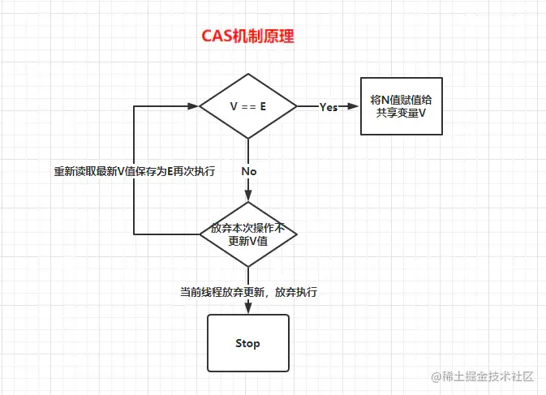
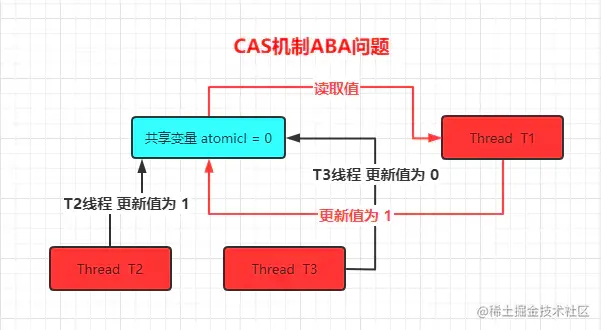
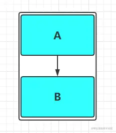
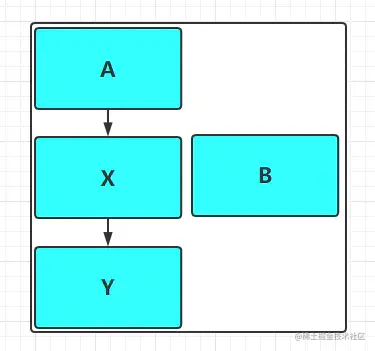
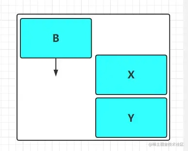

## 一、无锁的落地执行者 - CAS机制

我们口中一直所提到的无锁策略听起来很完美，但是当真正的需要使用时又该如果落地实现呢？而CAS机制则是我们无锁策略的落地实现者，CAS全称Compare And Swap（比较并交换），而Java中的CAS实现最终也是依赖于CPU的原子性指令实现（我们稍后会分析），在CAS机制中其核心思想如下：

> CAS(V,E,N)

- V：需要操作的共享变量
- E：预期值
- N：新值

如果V值等于E值，则将N值赋值给V。反则如果V值不等于E值，则此时说明在当前线程写回之前有其他线程对V做了更改，那么当前线程什么都不做。简单的来说就是当一个线程对V需要做更改时，先在操作之前先保存当前时刻共享变量的值，当线程操作完成后需要写回新值时先重新去获取一下最新的变量值与操作开始之前的保存的预期值比对，如果相同说明没有其他线程改过，那么当前线程就执行写入操作。但如果期望值与当前线程操作之前保存的不符，则说明该值已被其他线程修改，此时不执行更新操作，但可以选择重新读取该变量再尝试再次修改该变量，也可以放弃操作，示意图如下：
 
 由于CAS操作属于乐观派，每次线程操作时都认为自己可以成功执行，当多个线程同时使用CAS操作一个变量时，只有一个会成功执行并成功更新，其余均会失败，但失败的线程并不会被挂起，仅是被告知失败，并且允许再次尝试，当然也允许失败的线程放弃操作。基于这样的原理，CAS机制即使没有锁，同样也能够得知其他线程对共享资源进行了操作并执行相应的处理措施。同时CAS由于无锁操作中并没有锁的存在，因此不可能出现死锁的情况，所以也能得出一个结论：**“CAS天生免疫死锁”**，因为CAS本身没有加锁。

### 1.1. 操作系统对于CAS机制的支持

那么有小伙伴看到这里会疑问，难道多个线程在同时做CAS操作时不会出现安全问题造成不一致呢？因为CAS操作通过我们上面的阐述得知并不是一步到位的，而是也分为多个步骤来执行，有没有可能在判断V和E相同后，正要赋值时，切换了线程，更改了值？答案非常确定：NO，Why？刚刚在前面我提到过Java中的CAS机制的最终实现是依赖于CPU原子性指令实现，CAS是一种操作系统原语范畴的指令，是由若干条指令组成的，用于完成某个功能的一个过程，并且原语的执行必须是连续的，在执行过程中不允许被中断，也就是说CAS对于CPU来说是一条的原子指令，不会造成所谓的数据不一致问题。

## 二、Java中的魔法指针类 - Unsafe

Unsafe类位于sun.misc包中，中文翻译过来就是不安全的意思，当我们第一次看到这个类时，我们可能会感到惊讶，为什么在JDK中会有一个类的名称被命名为“不安全”，但是你详细去研究不难发现这个类的神奇之处，提供的功能十分强大，但是确实存在些许不安全。Unsafe类存在于sun.misc包中，其内部方法操作可以像C的指针一样直接操作内存，当我们能够通过这个类做到和C的指针一样直接操作内存时也就凸显出此类的不安全性，意味着：

- 不受JVM管理，也就代表着无法被GC，需要我们手动释放内存，当你使用这个类做了一些操作稍有不慎就会出现内存泄漏
- Unsafe类中的不少方法中必须提供原始地址(内存地址)和被替换对象的地址，偏移量要自己计算，一旦出现问题就是JVM崩溃级别的错误，会导致整个Java程序崩溃，表现为应用进程直接crash掉

但是我们通过Unsafe类直接操作内存，也意味着其速度会比普通Java程序更快，在高并发的条件之下能够很好地提高效率，因此，从上面几个角度来看，虽然在一定程度上提升了效率但是也带来了指针的不安全性，Unsafe名副其实。所以我们在编写程序时如果没有什么特殊要求不应该考虑使用它，并且Java官方也不推荐使用(Unsafe也不对外提供构造函数)，而且Oracle官方当初也打算在Java9中去掉Unsafe类。但是由于Java并发包中大量使用了该类，所以Oracle最终在Java并没有移除掉Unsafe类，只是做了相对于的优化与维护，而且除开并发包之外，类似于Netty等框架也在底层中频繁的使用了该类，所以应该庆幸的是保留了该类，不然会少去一批优秀的开源框架。不过还有值得注意的一点是Unsafe类中的所有方法都是native修饰的，也就是说Unsafe类中的方法都直接调用操作系统底层资源执行相应任务，关于Unsafe类的主要功能点如下：

- 类(Class)相关：提供Class和它的静态域操纵方法
- 信息(Info)相关：返回某些低级别的内存信息
- 数组(Arrays)相关：提供数组操纵方法
- 对象(Objects)相关：提供Object和它的域操纵方法
- 内存(Memory)相关：提供直接内存访问方法（绕过JVM堆直接操纵本地内存）
- 同步(Synchronization)相关：提供低级别同步原语、线程挂起/放下等操纵方法

### 2.1. 内存管理：Unsafe类提供的直接操纵内存相关的方法

```java
java复制代码//分配内存指定大小的内存
public native long allocateMemory(long bytes);
//根据给定的内存地址address设置重新分配指定大小的内存
public native long reallocateMemory(long address, long bytes);
//用于释放allocateMemory和reallocateMemory申请的内存
public native void freeMemory(long address);
//将指定对象的给定offset偏移量内存块中的所有字节设置为固定值
public native void setMemory(Object o, long offset, long bytes, byte value);
//设置给定内存地址的值
public native void putAddress(long address, long x);
//获取指定内存地址的值
public native long getAddress(long address);

//设置给定内存地址的long值
public native void putLong(long address, long x);
//获取指定内存地址的long值
public native long getLong(long address);
//设置或获取指定内存的byte值
public native byte  getByte(long address);
public native void  putByte(long address, byte x);
//其他基本数据类型(long,char,float,double,short等)的操作与putByte及getByte相同
.......... 省略代码
//操作系统的内存页大小
public native int pageSize();
```

### 2.2. 对象实例创建：Unsafe类提供创建对象实例新的途径

在之前我们创建类对象实例时无非通过两种形式：new以及反射机制创建，但是无论是new还是反射的形式创建都会调用对象的构造方法来完成对象的初始化，而Unsafe类提供创建对象实例新的途径如下：

```java
java复制代码//传入一个对象的class并创建该实例对象，但不会调用构造方法
public native Object allocateInstance(Class cls) throws InstantiationException;
```

### 2.3. 类、实例对象以及变量操作：Unsafe类提供类、实例对象以及变量操纵方法

```java
java复制代码//获取字段f在实例对象中的偏移量
public native long objectFieldOffset(Field f);
//静态属性的偏移量，用于在对应的Class对象中读写静态属性
public native long staticFieldOffset(Field f);
//返回值就是f.getDeclaringClass()
public native Object staticFieldBase(Field f);


//获得给定对象偏移量上的int值，所谓的偏移量可以简单理解为指针指向该变量的内存地址，
//通过偏移量便可得到该对象的变量，进行各种操作
public native int getInt(Object o, long offset);
//设置给定对象上偏移量的int值
public native void putInt(Object o, long offset, int x);

//获得给定对象偏移量上的引用类型的值
public native Object getObject(Object o, long offset);
//设置给定对象偏移量上的引用类型的值
public native void putObject(Object o, long offset, Object x);
//其他基本数据类型(long,char,byte,float,double)的操作与getInthe及putInt相同

//设置给定对象的int值，使用volatile语义，即设置后立马更新到内存对其他线程可见
public native void  putIntVolatile(Object o, long offset, int x);
//获得给定对象的指定偏移量offset的int值，使用volatile语义，总能获取到最新的int值。
public native int getIntVolatile(Object o, long offset);

//其他基本数据类型(long,char,byte,float,double)的操作与putIntVolatile
//及getIntVolatile相同，引用类型putObjectVolatile也一样。
..........省略代码

//与putIntVolatile一样，但要求被操作字段必须有volatile修饰
public native void putOrderedInt(Object o,long offset,int x);
```

**下面通过一个小Demo来加深大家对与Unsafe类的熟悉程度：**
 Unsafe类是没有对外提供构造函数的，虽然Unsafe类对外提供getUnsafe()方法，但该方法只提供给Bootstrap类加载器使用，普通用户调用将抛出异常，所以我们在下面的Demo中使用反射技术获取了Unsafe实例对象并进行相关操作。

```java
java复制代码public static Unsafe getUnsafe() {
  Class cc = sun.reflect.Reflection.getCallerClass(2);
  if (cc.getClassLoader() != null)
      throw new SecurityException("Unsafe");
  return theUnsafe;
}
java复制代码public class UnSafeDemo {
    public  static  void main(String[] args) throws NoSuchFieldException, IllegalAccessException, InstantiationException {
        // 通过反射得到theUnsafe对应的Field对象
        Field field = Unsafe.class.getDeclaredField("theUnsafe");
        // 设置该Field为可访问
        field.setAccessible(true);
        // 通过Field得到该Field对应的具体对象，传入null是因为该Field为static的
        Unsafe unsafe = (Unsafe) field.get(null);
        System.out.println(unsafe);

        //通过allocateInstance直接创建对象
        Demo demo = (Demo) unsafe.allocateInstance(Demo.class);

        Class demoClass = demo.getClass();
        Field str = demoClass.getDeclaredField("str");
        Field i = demoClass.getDeclaredField("i");
        Field staticStr = demoClass.getDeclaredField("staticStr");

        //获取实例变量str和i在对象内存中的偏移量并设置值
        unsafe.putInt(demo,unsafe.objectFieldOffset(i),1);
        unsafe.putObject(demo,unsafe.objectFieldOffset(str),"Hello Word!");

        // 返回 User.class
        Object staticField = unsafe.staticFieldBase(staticStr);
        System.out.println("staticField:" + staticStr);

        //获取静态变量staticStr的偏移量staticOffset
        long staticOffset = unsafe.staticFieldOffset(userClass.getDeclaredField("staticStr"));
        //获取静态变量的值
        System.out.println("设置前的Static字段值:"+unsafe.getObject(staticField,staticOffset));
        //设置值
        unsafe.putObject(staticField,staticOffset,"Hello Java!");
        //再次获取静态变量的值
        System.out.println("设置后的Static字段值:"+unsafe.getObject(staticField,staticOffset));
        //调用toString方法
        System.out.println("输出结果:"+demo.toString());

        long data = 1000;
        byte size = 1; //单位字节

        //调用allocateMemory分配内存,并获取内存地址memoryAddress
        long memoryAddress = unsafe.allocateMemory(size);
        //直接往内存写入数据
        unsafe.putAddress(memoryAddress, data);
        //获取指定内存地址的数据
        long addrData = unsafe.getAddress(memoryAddress);
        System.out.println("addrData:"+addrData);

        /**
         * 输出结果:
         sun.misc.Unsafe@0f18aef2
         staticField:class com.demo.Demo
         设置前的Static字段值:Demo_Static
         设置后的Static字段值:Hello Java!
         输出USER:Demo{str='Hello Word!', i='1', staticStr='Hello Java!'}
         addrData:1000
         */

    }
}

class Demo{
    public Demo(){
        System.out.println("我是Demo类的构造函数，我被人调用创建对象实例啦....");
    }
    private String str;
    private int i;
    private static String staticStr = "Demo_Static";

    @Override
    public String toString() {
        return "Demo{" +
            "str = '" + str + '\'' +
            ", i = '" + i +'\'' +
            ", staticStr = " + staticStr +'\'' +
        '}';
    }
}
```

### 2.4、数组操作：Unsafe类提供直接获取数组元素内存位置的途径

```java
java复制代码//获取数组第一个元素的偏移地址
public native int arrayBaseOffset(Class arrayClass);
//数组中一个元素占据的内存空间,arrayBaseOffset与arrayIndexScale配合使用，可定位数组中每个元素在内存中的位置
public native int arrayIndexScale(Class arrayClass);
```

### 2.4、CAS相关操作：Unsafe类提供Java中的CAS操作支持

```java
java复制代码//第一个参数o为给定对象，offset为对象内存的偏移量，通过这个偏移量迅速定位字段并设置或获取该字段的值，
//expected表示期望值，x表示要设置的值，下面3个方法都通过CAS原子指令执行操作。
public final native boolean compareAndSwapObject(Object o, long offset,Object expected, Object x);
public final native boolean compareAndSwapInt(Object o, long offset,int expected,int x);
public final native boolean compareAndSwapLong(Object o, long offset,long expected,long x);
```

### 2.5、JDK8之后新增的基于原有CAS方法的方法

```java
java复制代码 //1.8新增，给定对象o，根据获取内存偏移量指向的字段，将其增加delta，
 //这是一个CAS操作过程，直到设置成功方能退出循环，返回旧值
 public final int getAndAddInt(Object o, long offset, int delta) {
     int v;
     do {
         //获取内存中最新值
         v = getIntVolatile(o, offset);
       //通过CAS操作
     } while (!compareAndSwapInt(o, offset, v, v + delta));
     return v;
 }

//1.8新增，方法作用同上，只不过这里操作的long类型数据
 public final long getAndAddLong(Object o, long offset, long delta) {
     long v;
     do {
         v = getLongVolatile(o, offset);
     } while (!compareAndSwapLong(o, offset, v, v + delta));
     return v;
 }

 //1.8新增，给定对象o，根据获取内存偏移量对于字段，将其 设置为新值newValue，
 //这是一个CAS操作过程，直到设置成功方能退出循环，返回旧值
 public final int getAndSetInt(Object o, long offset, int newValue) {
     int v;
     do {
         v = getIntVolatile(o, offset);
     } while (!compareAndSwapInt(o, offset, v, newValue));
     return v;
 }

// 1.8新增，同上，操作的是long类型
 public final long getAndSetLong(Object o, long offset, long newValue) {
     long v;
     do {
         v = getLongVolatile(o, offset);
     } while (!compareAndSwapLong(o, offset, v, newValue));
     return v;
 }

 //1.8新增，同上，操作的是引用类型数据
 public final Object getAndSetObject(Object o, long offset, Object newValue) {
     Object v;
     do {
         v = getObjectVolatile(o, offset);
     } while (!compareAndSwapObject(o, offset, v, newValue));
     return v;
 }
```

如上方法如果有伙伴看过JDK8的Atomic包的源码应该也能从中见到它们的身影。

### 2.6、线程操作：Unsafe类提供线程挂起与恢复操作支持

将一个线程进行挂起是通过park方法实现的，调用park后，线程将一直阻塞直到超时或者中断等条件出现。unpark可以终止一个挂起的线程，使其恢复正常。Java对线程的挂起操作被封装在LockSupport类中，LockSupport类中有各种版本pack方法，其底层实现最终还是使用Unsafe.park()方法和Unsafe.unpark()方法来实现。

```java
java复制代码//线程调用该方法，线程将一直阻塞直到超时，或者是中断条件出现。  
public native void park(boolean isAbsolute, long time);  

//终止挂起的线程，恢复正常.java.util.concurrent包中挂起操作都是在LockSupport类实现的，其底层正是使用这两个方法，  
public native void unpark(Object thread); 
```

### 2.7、内存屏障：在之前文章中提到过的[JMM、指令重排序](https://link.juejin.cn?target=https%3A%2F%2Fwww.jianshu.com%2Fp%2Fee8303ed0e6c)等操作的内存屏障定义支持

```java
java复制代码//在该方法之前的所有读操作，一定在load屏障之前执行完成
public native void loadFence();
//在该方法之前的所有写操作，一定在store屏障之前执行完成
public native void storeFence();
//在该方法之前的所有读写操作，一定在full屏障之前执行完成，这个内存屏障相当于上面两个的合体功能
public native void fullFence();
```

### 2.8、其他操作：更多操作请参考[JDK8官方API文档](https://link.juejin.cn?target=https%3A%2F%2Fwww.oracle.com%2Fjava%2Ftechnologies%2Fjavase-jdk8-doc-downloads.html)

```java
java复制代码//获取持有锁，已不建议使用
@Deprecated
public native void monitorEnter(Object var1);
//释放锁，已不建议使用
@Deprecated
public native void monitorExit(Object var1);
//尝试获取锁，已不建议使用
@Deprecated
public native boolean tryMonitorEnter(Object var1);

//获取本机内存的页数，这个值永远都是2的幂次方  
public native int pageSize();  

//告诉虚拟机定义了一个没有安全检查的类，默认情况下这个类加载器和保护域来着调用者类  
public native Class defineClass(String name, byte[] b, int off, int len, ClassLoader loader, ProtectionDomain protectionDomain);  

//加载一个匿名类
public native Class defineAnonymousClass(Class hostClass, byte[] data, Object[] cpPatches);
//判断是否需要加载一个类
public native boolean shouldBeInitialized(Class<?> c);
//确保类一定被加载 
public native  void ensureClassInitialized(Class<?> c);
```

## 三、J.U.C包下的原子操作包Atomic

通过前面部分的分析我们应该基本理解CAS无锁思想以及对魔法类Unsafe有较全面的认知，而这些也是我们分析atomic包的基本条件，那么我们接下来再一步步分析CAS在Java中的应用。JDK5之后推出的JUC并发包中提供了java.util.concurrent.atomic原子包，在该包下提供了大量基于CAS实现的原子操作类，如以后不想对程序代码加锁但仍然想避免线程安全问题，那么便可以使用该包下提供的类，原子包提供的操作类主要可分为如下四种类型：

- 基本类型原子操作类
- 引用类型原子操作类
- 数组类型原子操作类
- 属性更新原子操作类

### 3.1、基本类型原子操作类

Atomic包中提供的对于基本类型的原子操作类分别为AtomicInteger、AtomicBoolean、AtomicLong三个，它们的底层实现方式及使用方式是一致的，所以我们只分析其中一个AtomicInteger用作举例，AtomicInteger主要是针对int类型的数据执行原子操作，它提供了原子自增方法、原子自减方法以及原子赋值方法等API：

```java
java复制代码public class AtomicInteger extends Number implements java.io.Serializable {
    private static final long serialVersionUID = 6214790243416807050L;

    // 获取指针类Unsafe类实例
    private static final Unsafe unsafe = Unsafe.getUnsafe();

    //变量value在AtomicInteger实例对象内的内存偏移量
    private static final long valueOffset;

    static {
        try {
           //通过unsafe类的objectFieldOffset()方法，获取value变量在对象内存中的偏移
           //通过该偏移量valueOffset，unsafe类的内部方法可以获取到变量value对其进行取值或赋值操作
            valueOffset = unsafe.objectFieldOffset
                (AtomicInteger.class.getDeclaredField("value"));
        } catch (Exception ex) { throw new Error(ex); }
    }
   //当前AtomicInteger封装的int变量值 value
    private volatile int value;

    public AtomicInteger(int initialValue) {
        value = initialValue;
    }
    public AtomicInteger() {
    }
   //获取当前最新值，
    public final int get() {
        return value;
    }
    //设置当前值，具备volatile效果，方法用final修饰是为了更进一步的保证线程安全
    public final void set(int newValue) {
        value = newValue;
    }
    //最终会设置成newValue，使用该方法后可能导致其他线程在之后的一小段时间内可以获取到旧值，有点类似于延迟加载
    public final void lazySet(int newValue) {
        unsafe.putOrderedInt(this, valueOffset, newValue);
    }
   //设置新值并获取旧值，底层调用的是CAS操作即unsafe.compareAndSwapInt()方法
    public final int getAndSet(int newValue) {
        return unsafe.getAndSetInt(this, valueOffset, newValue);
    }
   //如果当前值为expect，则设置为update(当前值指的是value变量)
    public final boolean compareAndSet(int expect, int update) {
        return unsafe.compareAndSwapInt(this, valueOffset, expect, update);
    }
    //当前值自增加1，返回旧值，底层CAS操作
    public final int getAndIncrement() {
        return unsafe.getAndAddInt(this, valueOffset, 1);
    }
    //当前值自减扣1，返回旧值，底层CAS操作
    public final int getAndDecrement() {
        return unsafe.getAndAddInt(this, valueOffset, -1);
    }
   //当前值增加delta，返回旧值，底层CAS操作
    public final int getAndAdd(int delta) {
        return unsafe.getAndAddInt(this, valueOffset, delta);
    }
    //当前值自增加1并返回自增后的新值，底层CAS操作
    public final int incrementAndGet() {
        return unsafe.getAndAddInt(this, valueOffset, 1) + 1;
    }
    //当前值自减扣1并返回自减之后的新值，底层CAS操作
    public final int decrementAndGet() {
        return unsafe.getAndAddInt(this, valueOffset, -1) - 1;
    }
   //当前值增加delta，返回新值，底层CAS操作
    public final int addAndGet(int delta) {
        return unsafe.getAndAddInt(this, valueOffset, delta) + delta;
    }
   //省略一些不常用的方法....
}
```

从上面的源码中我们可以得知，AtomicInteger原子类的所有方法中并没有使用到任何互斥锁机制来实现同步，而是通过我们前面介绍的Unsafe类提供的CAS操作来保障的线程安全，在我们前面关于[Synchronized原理分析](https://juejin.cn/post/6977744582725681182)的文章中讲到过i++其实存在线程安全问题，那么我们在来观察AtomicInteger原子类中的自增实现incrementAndGet：

```java
java复制代码public final int incrementAndGet() {
 return unsafe.getAndAddInt(this, valueOffset, 1) + 1;
}
```

从如上源码我们可以看到最终的实现是调用了unsafe.getAndAddInt()方法来完成的，这个方法在我们前面的分析中得知是JDK8之后基于原有cas操作新增的方法，而我们进一步跟进：

```java
java复制代码public final int getAndAddInt(Object o, long offset, int delta) {
    int v;
    do {
        v = getIntVolatile(o, offset);
    } while (!compareAndSwapInt(o, offset, v, v + delta));
    return v;
}
```

可看出getAndAddInt通过一个do while死循环不断的重试更新要设置的值，直到成功为止，调用的是Unsafe类中的compareAndSwapInt方法，是一个CAS操作方法。注意：Java8之前的源码实现中是for循环，而且是直接在AtomicInteger类中实现的自增逻辑，在Java8中被换成了while以及被挪动到是Unsafe类中实现。
 下面来通过一个简单的小demo掌握一下基本类型的原子操作类用法：

```java
java复制代码public class AtomicIntegerDemo {
    // 创建共享变量 atomicI
    static AtomicInteger atomicI = new AtomicInteger();

    public static class AddThread implements Runnable{
        public void run(){
           for(int i = 0; i < 10000; i++)
               atomicI.incrementAndGet();
        }

    }
    public static void main(String[] args) throws InterruptedException {
        Thread[] threads = new Thread[10];
        //开启5条线程同时执行atomicI的自增操作
        for(int i = 1; i <= 5; i++){
            threads[i]=new Thread(new AddThread());
        }
        //启动线程
        for(int i = 1; i <= 5; i++){threads[i].start();}

        for(int i = 1; i <= 5; i++){threads[i].join();}

        System.out.println(atomicI);
    }
}
//输出结果:50000
```

在上述demo中使用AtomicInteger代替原本的int，这样便能做到不加锁也能保证线程安全，而AtomicBoolean以及AtomicLong将不再分析，使用以及原理都是一样的。

### 3.2、引用类型原子操作类

引用类型的原子操作类主要分析AtomicReference类，其他的原理及使用都是一致的，后续内容不再重复阐述这段话，先来看一个demo：

```java
java复制代码public class AtomicReferenceDemo {
    public static AtomicReference<Student> atomicStudentRef = new AtomicReference<Student>();

    public static void main(String[] args) {
        Student s1 = new Student(1, "竹子");
        atomicStudentRef.set(s1);
        Student s2 = new Student(2, "熊猫");
        atomicStudentRef.compareAndSet(s1, s2);
        System.out.println(atomicStudentRef.get().toString());  
        //执行结果:Student{id=2, name="熊猫"}
    }

    static class Student {
        private int id;
        public String name;

        public Student(int id, String name) {
            this.id = id;
            this.name = name;
        }

        public String getName() {
            return name;
        }

        @Override
        public String toString() {
            return "Student{" +"id=" + id +", name=" + name +"}";
        }
    }
}
```

在此之前我们分析了原子计数器AtomicInteger类的底层实现是通过Unsafe类中CAS操作来实现的，那么我们现在的AtomicReference底层又是怎么实现的呢？

```java
java复制代码public class AtomicReference<V> implements java.io.Serializable {
    // 得到unsafe对象实例
    private static final Unsafe unsafe = Unsafe.getUnsafe();
    // 定义值偏移量
    private static final long valueOffset;

    static {
        try {
            /* 静态代码块在类加载时为偏移量赋值，通过unsafe类提供的得到类属性的
             地址API得到当前类定义的属性value的地址 */
            valueOffset = unsafe.objectFieldOffset
                (AtomicReference.class.getDeclaredField("value"));
        } catch (Exception ex) { throw new Error(ex); }
    }
    //内部变量value，Unsafe类通过valueOffset内存偏移量即可获取该变量
    private volatile V value;

/* 原子替换方法，间接调用Unsafe类的compareAndSwapObject(),
它是一个实现了CAS操作的本地（native）方法 */
public final boolean compareAndSet(V expect, V update) {
        return unsafe.compareAndSwapObject(this, valueOffset, expect, update);
}

//设置并获取旧值
public final V getAndSet(V newValue) {
        return (V)unsafe.getAndSetObject(this, valueOffset, newValue);
    }
    //省略代码......
}

//Unsafe类中的getAndSetObject方法，实际调用还是CAS操作
public final Object getAndSetObject(Object o, long offset, Object newValue) {
      Object v;
      do {
          v = getObjectVolatile(o, offset);
      } while (!compareAndSwapObject(o, offset, v, newValue));
      return v;
  }
```

从上述源码中我们可以得知，AtomicReference与我们前面分析的AtomicInteger实现的原理大致相同，最终都是通过Unsafe类中提供的CAS操作来实现的，关于AtomicReference的其他方法实现原理也大致相同，只不过需要注意的是Java8为AtomicReference新增了几个API：

- getAndUpdate(UnaryOperator)
- updateAndGet(UnaryOperator)
- getAndAccumulate(V,AnaryOperator)
- accumulateAndGet(V,AnaryOperator)

上述的方法几乎存在于所有的原子类中，而这些方法可以基于Lambda表达式对传递进来的期望值或要更新的值进行其他操作后再进行CAS操作，说简单一些就是对期望值或要更新的值进行额外修改后再执行CAS更新。

### 3.3、数组类型原子操作类

我们之前在刚开始接触Java学习的数组，在我们操作其中元素时都会存在线程安全问题，而我们数组类型原子操作类的含义其实非常简单，指的就是利用原子的形式更新数组中的元素从而避免出现线程安全问题。而JUC包中的数组类型原子操作类具体分为以下三个类：

- AtomicIntegerArray：原子更新整数数组里的元素
- AtomicLongArray：原子更新长整数数组里的元素
- AtomicReferenceArray：原子更新引用类型数组里的元素

同样的我们分析也只分析单个类，其他两个大致相同，此处已AtomicIntegerArray举例分析，先上一个Demo案例：

```java
java复制代码public class AtomicIntegerArrayDemo {
    static AtomicIntegerArray atomicArr = new AtomicIntegerArray(5);

    public static class incrementTask implements Runnable{
        public void run(){
           // 执行数组中元素自增操作,参数为index,即数组下标
           for(int i = 0; i < 10000; i++) atomicArr.getAndIncrement(i % atomicArr.length());
        }
    }
    public static void main(String[] args) throws InterruptedException {
        Thread[] threads = new Thread[5];
        for(int i = 0; i < 5;i++)
            threads[i] = new Thread(new incrementTask());
        for(int i = 0; i < 5;i++) threads[i].start();
        for(int i = 0; i < 5;i++) threads[i].join();
        System.out.println(atomicArr);
        /* 执行结果:
        [10000, 10000, 10000, 10000, 10000]
        */
    }
}
```

如上Demo中我们启动了五条线程对数组中的元素进行自增操作，执行的结果符合我们的预期。那么我们接下来再一步步的去分析AtomicIntegerArray内部的实现逻辑，源码如下：

```java
java复制代码public class AtomicIntegerArray implements java.io.Serializable {
    //获取Unsafe实例对象
    private static final Unsafe unsafe = Unsafe.getUnsafe();
    //从前面我们分析Unsafe类得知arrayBaseOffset()作用：获取数组的第一个元素内存起始地址
    private static final int base = unsafe.arrayBaseOffset(int[].class);

    private static final int shift;
    //内部数组
    private final int[] array;

    static {
        //获取数组中一个元素占据的内存空间
        int scale = unsafe.arrayIndexScale(int[].class);
        //判断是否为2的次幂，一般为2的次幂否则抛异常
        if ((scale & (scale - 1)) != 0)
            throw new Error("data type scale not a power of two");
        //
        shift = 31 - Integer.numberOfLeadingZeros(scale);
    }

    private long checkedByteOffset(int i) {
        if (i < 0 || i >= array.length)
            throw new IndexOutOfBoundsException("index " + i);

        return byteOffset(i);
    }
    //计算数组中每个元素的的内存地址
    private static long byteOffset(int i) {
        return ((long) i << shift) + base;
    }
    //省略代码......
}
```

在我们前面的Unsafe分析中得知arrayBaseOffset可以获取一个数组中的第一个元素内存起始位置，而我们还有另一个API：arrayIndexScale则可以得知数组中指定下标元素的内存占用空间大小，而目前的是AtomicIntegerArray是int，在我们学习Java基础的时候得知int的大小在内存中是占用4Byte（字节），所以scale的值为4。那么现在如果根据这两个信息计算数组中每个元素的内存起始地址呢？我们稍作推导即可得出如下结论：

> 数组每个元素起始内存位置 = 数组第一个元素起始位置 + 数组元素下标 * 数组中每个元素占用的内存空间大小

而上述源码中的byteOffset(i)方法的则是如上阐述公式的体现。有人可能会看到这里有些疑惑，该方法的实现似乎与我刚刚描述的结论有出入。别急，我们先来看看shift这个值是怎么得来的：

> shift = 31 - Integer.numberOfLeadingZeros(scale);
>  Integer.numberOfLeadingZeros(scale)：计算出scale的前导零个数(转换为二进制后前面连续的0数量称为前零导数)，scale=4，转成二进制为00000000 00000000 00000000 00000100，所以前零导数为29，所以shift值则为2。

那么我们最开始的问题：数组中每个元素的起始内存位置怎么计算呢？我们利用我们的刚刚得到的shift值套入byteOffset(i)方法计算数组中每个元素的起始内存位置(数组下标不越界情况下)：

> byteOffset方法体：(i << shift) + base（i为index即数组元素下标，base为数组第一个元素起始内存位置）
>  第一个元素：memoryAddress = 0 << 2 + base 即 memoryAddress = base + 0 * 4
>  第二个元素：memoryAddress = 1 << 2 + base 即 memoryAddress = base + 1 * 4
>  第三个元素：memoryAddress = 2 << 2 + base 即 memoryAddress = base + 2 * 4
>  第四个元素：memoryAddress = 3 << 2 + base 即 memoryAddress = base + 3 * 4
>  其他元素位置以此类推.......

如上阐述则是AtomicIntegerArray.byteOffset方法原理。所以byteOffset(int)方法可以根据数组下标计算出每个元素的内存地址。而AtomicIntegerArray中的其他方法都是间接调用Unsafe类的CAS原子操作方法实现，如下简单看其中几个常用方法：

```java
java复制代码//执行自增操作，返回旧值，入参i是index即数组元素下标
public final int getAndIncrement(int i) {
      return getAndAdd(i, 1);
}
//指定下标元素执行自增操作，并返回新值
public final int incrementAndGet(int i) {
    return getAndAdd(i, 1) + 1;
}
//指定下标元素执行自减操作，并返回新值
public final int decrementAndGet(int i) {
    return getAndAdd(i, -1) - 1;
}
//间接调用unsafe.getAndAddInt()方法
public final int getAndAdd(int i, int delta) {
    return unsafe.getAndAddInt(array, checkedByteOffset(i), delta);
}
//Unsafe类中的getAndAddInt方法，执行CAS操作
public final int getAndAddInt(Object o, long offset, int delta) {
    int v;
    do {
        v = getIntVolatile(o, offset);
    } while (!compareAndSwapInt(o, offset, v, v + delta));
    return v;
}
```

AtomicReferenceArray与AtomicLongArray原理则不再阐述。

### 3.4、属性更新原子操作类

如果我们只需要一个类的某个字段（类属性）也变为原子操作即让某个普通变量也变为原子操作，可以使用属性更新原子操作类，如在某些时候项目需求发生变化，使得某个类中之前不需要涉及多线程操作的某个属性需要执行多线程操作，由于在编码时该属性被多处使用，改动起来代码侵入性比较高并且比较复杂，而且之前的code中使用该属性的地方无需考虑线程安全，只要求新场景需要保证时，可以借助原子更新器处理这种场景，J.U.C.Atomic并发原子包提供了如下三个类：

- AtomicIntegerFieldUpdater：更新整型的属性的原子操作类
- AtomicLongFieldUpdater：更新长整型属性的原子操作类
- AtomicReferenceFieldUpdater：更新引用类型中属性的原子操作类

不过值得令人注意的是：使用原子更新类的条件是比较苛刻的，如下：

- 操作的字段不能被static修饰
- 操作的字段不能被final修饰，因为常量无法修改
- 操作的字段必须被volatile修饰保证可见性，也就是需要保证数据的读取是线程可见的
- 属性必须对当前的Updater所在的区域是可见的，如果不是当前类内部进行原子更新器操作不能使用private，protected修饰符。子类操作父类时修饰符必须是protected权限及以上，如果在同一个package下则必须是default权限及以上，也就是说无论何时都应该保证操作类与被操作类间的可见性。

来个简单的小Demo感受一下：

```java
java复制代码public class AtomicIntegerFieldUpdaterDemo{

    // 定义更新整型的属性的原子操作类，目标属性：Course.courseScore
    static AtomicIntegerFieldUpdater<Course> courseAIFU =
        AtomicIntegerFieldUpdater.newUpdater(Course.class, "courseScore");
    // 定义更新引用类型中属性的原子操作类，目标属性：Student.studentName
    static AtomicReferenceFieldUpdater<Student,String> studentARFU = 
        AtomicReferenceFieldUpdater.newUpdater(Student.class,String.class,"studentName");
    // 定义原子计数器效验数据准确性
    public static AtomicInteger courseScoreCount = new AtomicInteger(0);
    
    public static void main(String[] args) throws Exception{
        final Course course = new Course();
        Thread[] threads = new Thread[1000];
        for(int i = 0;i < 1000;i++){
            threads[i] = new Thread(()->{
                if(Math.random()>0.6){
                    courseAIFU.incrementAndGet(course);
                    courseScoreCount.incrementAndGet();
                }
            });
            threads[i].start();
        }
        for(int i = 0;i < 1000;i++) threads[i].join();
        System.out.println("Course.courseScore：" + course.courseScore);
        System.out.println("数据效验结果：" + courseScoreCount.get());
        
        // 更新引用类型中属性的原子操作类的demo
        Student student = new Student(1,"竹子");
        studentARFU.compareAndSet(student,student.studentName,"熊猫");
        System.out.println(student.toString());
    }

    public static class Course{
        int courseId;
        String courseName;
        volatile int courseScore;
    }
    public static class Student{
        int studentId;
        volatile String studentName;
        
        public Student(int studentId,String studentName){
            this.studentId = studentId;
            this.studentName = studentName;
        }
         @Override
        public String toString() {
            return "Student[studentId="+studentId+"studentName="+studentName+"]";
        }
    }
}
/** 运行结果：
 * Course.courseScore：415
 * 数据效验结果：415
 * Student[studentId=1studentName=熊猫]
**/
```

我们从上面的代码中，存在两个内部静态类：Course以及Student，我们使用AtomicIntegerFieldUpdater作用在Course.courseScore属性上，使用AtomicReferenceFieldUpdater作用在Student.studentName上。在上面的代码中，我们开启一千条线程进行逻辑操作，使用AtomicInteger定义计数器courseScoreCount进行数据效验，其目的在于效验AtomicIntegerFieldUpdater是否能保证线程安全问题。当我们开启的线程随机出的数字大于0.6时代表成绩合格，此时将这次的成绩录入进Course.courseScore中，然后再对courseScoreCount进行自增方便后续进行数据效验。最终结果输出Course.courseScore与courseScoreCount结果一致，也就代表着AtomicIntegerFieldUpdater能够正确的更新Course.courseScore值能够保证线程安全问题。而对于AtomicReferenceFieldUpdater我们在上面的代码中简单的编写了demo演示了其使用方式，我们在使用AtomicReferenceFieldUpdater的时候值得注意的一点就是需要传入两个泛型参数，一个是修改的类的class对象，一个是修改的Field的class对象。至于另外的AtomicLongFieldUpdater则不再演示，使用方式与AtomicIntegerFieldUpdater大致相同。至此，我们再研究一下AtomicIntegerFieldUpdater的实现原理，先上代码：

```java
java复制代码public abstract class AtomicIntegerFieldUpdater<T> {
    public static <U> AtomicIntegerFieldUpdater<U> newUpdater(Class<U> tclass,
                                                              String fieldName){
        return new AtomicIntegerFieldUpdaterImpl<U>
            (tclass, fieldName, Reflection.getCallerClass());
    }
 }
```

从源码中不难发现，其实AtomicIntegerFieldUpdater的定义是一个抽象类，最终实现类为AtomicIntegerFieldUpdaterImpl，进一步跟进AtomicIntegerFieldUpdaterImpl：

```java
java复制代码 private static class AtomicIntegerFieldUpdaterImpl<T>
            extends AtomicIntegerFieldUpdater<T> {
    // 获取unsafe实例
    private static final Unsafe unsafe = Unsafe.getUnsafe(); 
    // 定义内存偏移量
    private final long offset;
    private final Class<T> tclass;
    private final Class<?> cclass;

    // 构造方法
    AtomicIntegerFieldUpdaterImpl(final Class<T> tclass,
                                  final String fieldName,
                                  final Class<?> caller) {
        final Field field;// 要修改的字段
        final int modifiers;// 字段修饰符
        try {
            field = AccessController.doPrivileged(
                new PrivilegedExceptionAction<Field>() {
                    public Field run() throws NoSuchFieldException {
                        // 通过反射获取字段对象
                        return tclass.getDeclaredField(fieldName);
                    }
                });
                // 获取字段修饰符
            modifiers = field.getModifiers();
            //对字段的访问权限进行检查,不在访问范围内抛异常
            sun.reflect.misc.ReflectUtil.ensureMemberAccess(
                caller, tclass, null, modifiers);
            // 得到对应类对象的类加载器
            ClassLoader cl = tclass.getClassLoader();
            ClassLoader ccl = caller.getClassLoader();
            if ((ccl != null) && (ccl != cl) &&
                ((cl == null) || !isAncestor(cl, ccl))) {
          sun.reflect.misc.ReflectUtil.checkPackageAccess(tclass);
            }
        } catch (PrivilegedActionException pae) {
            throw new RuntimeException(pae.getException());
        } catch (Exception ex) {
            throw new RuntimeException(ex);
        }

        Class<?> fieldt = field.getType();
        // 判断是否为int类型
        if (fieldt != int.class)
            throw new IllegalArgumentException("Must be integer type");
        // 判断是否被volatile修饰
        if (!Modifier.isVolatile(modifiers))
            throw new IllegalArgumentException("Must be volatile type");

        this.cclass = (Modifier.isProtected(modifiers) &&
                       caller != tclass) ? caller : null;
        this.tclass = tclass;
        // 获取该字段的在对象内存的偏移量，通过内存偏移量可以获取或者修改该字段的值
        offset = unsafe.objectFieldOffset(field);
    }
}
```

从AtomicIntegerFieldUpdaterImpl源码中不难看出其实字段更新器都是通过反射机制+Unsafe类实现的，看看AtomicIntegerFieldUpdaterImpl中自增方法incrementAndGet实现：

```java
java复制代码public int incrementAndGet(T obj) {
    int prev, next;
    do {
        prev = get(obj);
        next = prev + 1;
        // 调用下面的compareAndSet方法完成cas操作
    } while (!compareAndSet(obj, prev, next));
    return next;
}

// 最终调用的还是Unsafe类中compareAndSwapInt()方法完成
public boolean compareAndSet(T obj, int expect, int update) {
        if (obj == null || obj.getClass() != tclass || cclass != null) fullCheck(obj);
        return unsafe.compareAndSwapInt(obj, offset, expect, update);
}
```

我们到这可以发现，其实关于J.U.C中的Atomic原子包中原子类的最终实现都是通过我们前面分析的Unsafe类来完成的，包括我们之后会谈到的很多并发知识，如AQS等都会牵扯到CAS机制。

## 四、CAS无锁存在的问题

### 4.1、CAS的ABA问题

当第一个线程执行CAS(V,E,N)操作，在获取到当前变量V，准备修改为新值N前，另外两个线程已连续修改了两次变量V的值，使得该值又恢复为第一个线程看到的原有值，这样的话，我们就无法正确判断这个变量是否已被修改过，简单举例：线程T1,T2,T3，共享变量atomicI=0，当第一个线程T1准备将atomicI更改为1时，此时T1线程看到的值是0，并将atomicI=0读取回工作内存，然而在T1线程进行操作的过程中，T2线程将值更新为了1，然后T3线程又将atomicI更改成了0，此时T1再回来进行更新的时候是无法得知这个值已经被其他线程更改过的，在做V==E判断时发现atomicI还是原先的值，就会对atomicI进行更改操作，但是此时的现场与T1线程第一次看到的值时的现场不同了。如下图：
 

如上这个例子就是CAS机制存在的问题，一般情况下发生的几率很小，而且就算发生了一般业务也不会造成什么问题，比如上面这个例子，就算出现了ABA问题也不会造成影响，因为不会影响数据的最终一致性，T1线程的预期值本身就为1，就算出现了ABA问题，T1线程更新后的值还是为1。但是在某些情况下还是需要避免此类问题的，比如一个单向链表实现的堆栈stack如下：
 
 如上图所示，此时栈顶元素为A，此时线程T1已经知道A.next为元素B，希望通过CAS机制将栈顶元素替换为B，执行如下：

> stackHead.compareAndSet(A,B);

在T1线程执行这行代码时线程T2介入，线程T2将A、B出栈，然后再将元素Y、X、A入栈，此时元素Y、X、A处于栈内，元素B处于孤立状态，示意图如下：
 
 正好此时线程T1执行CAS写回操作，检测发现栈顶仍为A，所以CAS成功，栈顶变为B，但实际上B.next为null，所以此时的情况变为：
 
 其中堆栈中只有B元素，Y、X元素不再存在于堆栈中，但是确实T2线程是执行了Y、X入栈操作的，但是却平白无故的将X、Y丢掉了。

**总而言之，只要在场景中存在需要基于动态变化而要做出的操作，ABA问题的出现就需要解决，但是如果你的应用只停留在数据表面得到的结果而做的判断，那么ABA问题你就可以不用去关注。**

### 4.2、CAS的ABA问题的解决方案

那么当我们出现这类问题并且需要我们去关注时又该如何解决呢？在我们通过其他形式去实现乐观锁时通常会通过version版本号来进行标记从而避免并发带来的问题，而在Java中解决CAS的ABA问题主要有两种方案：

- AtomicStampedReference：时间戳控制，能够完全解决
- AtomicMarkableReference：维护boolean值控制，不能完全杜绝

#### 4.2.1、AtomicStampedReference

AtomicStampedReference是一个带有时间戳的对象引用，内部通过包装Pair对象键值对的形式来存储数据与时间戳，在每次更新时，先对数据本身和时间戳进行比对，只有当两者都符合预期值时才调用Unsafe的compareAndSwapObject方法进行写入。当然，AtomicStampedReference不仅会设置新值而且还会记录更改的时间戳。这也就解决了之前CAS机制带来的ABA问题。简单案例如下：

```java
java复制代码public class ABAIssue {
    // 定义原子计数器，初始值 = 100
    private static AtomicInteger atomicI = new AtomicInteger(100);
    // 定义AtomicStampedReference：初始化时需要传入一个初始值和初始时间
    private static AtomicStampedReference<Integer> asRef = new AtomicStampedReference<Integer>(100, 0);

    /**
     * 未使用AtomicStampedReference线程组：TA TB
     */
    private static Thread TA = new Thread(() -> {
        System.err.println("未使用AtomicStampedReference线程组：[TA TB] >>>>");
        // 更新值为101
        boolean flag = atomicI.compareAndSet(100, 101);
        System.out.println("线程TA：100 -> 101.... flag:" + flag + ",atomicINewValue：" + atomicI.get());
        // 更新值为100
        flag = atomicI.compareAndSet(101, 100);
        System.out.println("线程TA：101 -> 100.... flag:" + flag + ",atomicINewValue：" + atomicI.get());
    });
    private static Thread TB = new Thread(() -> {
        try {
            TimeUnit.SECONDS.sleep(1);
        } catch (InterruptedException e) {
            e.printStackTrace();
        }
        boolean flag = atomicI.compareAndSet(100, 888);
        System.out.println("线程TB：100 -> 888.... flag:" + flag + ",atomicINewValue：" + atomicI.get() + "\n\n");
    });

    /**
     *  使用AtomicStampedReference线程组：T1 T2
     */
    private static Thread T1 = new Thread(() -> {
        System.err.println("使用AtomicStampedReference线程组：[T1 T2] >>>>");
        // 更新值为101
        boolean flag = asRef.compareAndSet(100, 101, asRef.getStamp(), asRef.getStamp() + 1);
        System.out.println("线程T1：100 -> 101.... flag:" + flag + ".... asRefNewValue:" + asRef.getReference() + ".... 当前Time：" + asRef.getStamp());
        // 更新值为100
        flag = asRef.compareAndSet(101, 100, asRef.getStamp(), asRef.getStamp() + 1);
        System.out.println("线程T1：101 -> 100.... flag:" + flag + ".... asRefNewValue:" + asRef.getReference() + ".... 当前Time：" + asRef.getStamp());
    });
    private static Thread T2 = new Thread(() -> {
        int time = asRef.getStamp();
        System.out.println("线程休眠前Time值：" + time);
        try {
            TimeUnit.SECONDS.sleep(1);
        } catch (InterruptedException e) {
            e.printStackTrace();
        }
        boolean flag = asRef.compareAndSet(100, 888, time, time + 1);

        System.out.println("线程T2：100 -> 888.... flag:" + flag + ".... asRefNewValue:" + asRef.getReference() + ".... 当前Time：" + asRef.getStamp());
    });

    public static void main(String[] args) throws InterruptedException {
        TA.start();
        TB.start();
        TA.join();
        TB.join();

        T1.start();
        T2.start();
    }
}

/**
 * 未使用AtomicStampedReference线程组：[TA TB] >>>>
 * 线程TA：100 -> 101.... flag:true,atomicINewValue：101
 * 线程TA：101 -> 100.... flag:true,atomicINewValue：100
 * 线程TB：100 -> 888.... flag:true,atomicINewValue：888
 *
 *
 * 使用AtomicStampedReference线程组：[T1 T2] >>>>
 * 线程休眠前Time值：0
 * 线程T1：100 -> 101.... flag:true.... asRefNewValue:101.... 当前Time：1
 * 线程T1：101 -> 100.... flag:true.... asRefNewValue:100.... 当前Time：2
 * 线程T2：100 -> 888.... flag:false.... asRefNewValue:100.... 当前Time：2
 */
```

我们观察如上Demo中AtomicInteger与AtomicStampedReference的测试结果可以得知，AtomicStampedReference确实能够解决我们在之前阐述的ABA问题，那么AtomicStampedReference究竟是如何ABA问题的呢？我们接下来再看看它的内部实现：

```java
java复制代码public class AtomicStampedReference<V> {
    // 通过Pair内部类存储数据和时间戳
    private static class Pair<T> {
        final T reference;
        final int stamp;
        private Pair(T reference, int stamp) {
            this.reference = reference;
            this.stamp = stamp;
        }
        static <T> Pair<T> of(T reference, int stamp) {
            return new Pair<T>(reference, stamp);
        }
    }
    // 存储数值和时间的内部类
    private volatile Pair<V> pair;

    // 构造方法：初始化时需传入初始值和时间初始值
    public AtomicStampedReference(V initialRef, int initialStamp) {
        pair = Pair.of(initialRef, initialStamp);
    }
}
```

compareAndSet方法源码实现：

```java
java复制代码public boolean compareAndSet(V expectedReference,
                         V newReference,
                         int expectedStamp,
                         int newStamp) {
    Pair<V> current = pair;
    return
        expectedReference == current.reference &&
        expectedStamp == current.stamp &&
        ((newReference == current.reference &&
          newStamp == current.stamp) ||
         casPair(current, Pair.of(newReference, newStamp)));
}

// 最终实现调用Unfase类中的compareAndSwapObject()方法
private boolean casPair(Pair<V> cmp, Pair<V> val) {
    return UNSAFE.compareAndSwapObject(this, pairOffset, cmp, val);
}
```

在compareAndSet方法源码实现中我们不难发现，它其中同时对当前数据和当前时间进行比较，只有两者都相等是才会执行casPair()方法，而casPair()方法也是一个原子性方法，最终实现调用的还是Unsafe类中的compareAndSwapObject()方法。

#### 4.2.2、AtomicMarkableReference

AtomicMarkableReference与我们之前所探讨的AtomicStampedReference并不相同，AtomicMarkableReference只能在一定程度上减少ABA问题的出现，它并不能完全的杜绝ABA问题。因为AtomicMarkableReference内部维护的是boolean类型的标识，也就代表着它并不像之前的AtomicStampedReference内部的维护的时间戳一样值会不断的递增，而AtomicMarkableReference内部因为维护的是boolean，也就代表着只会在true与false两种状态之间来回切换，所以还是存在ABA问题出现的概念。先来个demo感受一下：

```java
java复制代码public class ABAIssue {
    static AtomicMarkableReference<Integer> amRef = new AtomicMarkableReference<Integer>(100, false);

    private static Thread t1 = new Thread(() -> {
        boolean mark = amRef.isMarked();
        System.out.println("线程T1：修改前标志 Mrak:" + mark + "....");
        // 将值更新为200
        System.out.println("线程T1：100 --> 200.... 修改后返回值 Result:" + amRef.compareAndSet(amRef.getReference(), 200, mark, !mark));
    });

    private static Thread t2 = new Thread(() -> {
        boolean mark = amRef.isMarked();
        System.out.println("线程T2：修改前标志 Mrak:" + mark + "....");
        // 将值更新回100
        System.out.println("线程T2：200 --> 100.... 修改后返回值 Result:" + amRef.compareAndSet(amRef.getReference(), 100, mark, !mark));
    });

    private static Thread t3 = new Thread(() -> {
        boolean mark = amRef.isMarked();
        System.out.println("线程T3：休眠前标志 Mrak:" + mark + "....");
        try {
            TimeUnit.SECONDS.sleep(1);
        } catch (InterruptedException e) {
            e.printStackTrace();
        }
        boolean flag = amRef.compareAndSet(100, 500, mark, !mark);
        System.out.println("线程T3： 100 --> 500.... flag:" + flag + ",newValue:" + amRef.getReference());
    });

    public static void main(String[] args) throws InterruptedException {
        t1.start();
        t1.join();
        t2.start();
        t2.join();
        t3.start();

        /**
         * 输出结果如下:
         *    线程T1：修改前标志 Mrak:false....
         *    线程T1：100 --> 200.... 修改后返回值 Result:true
         *    线程T2：修改前标志 Mrak:true....
         *    线程T2：200 --> 100.... 修改后返回值 Result:true
         *    线程T3：休眠前标志 Mrak:false....
         *    线程T3： 100 --> 500.... flag:true,newValue:500  
         */
         
         /* t3线程执行完成后结果还是成功更新为500，代表t1、t2
          线程所做的修改操作对于t3线程来说还是不可见的 */
    }
}
```

从如上demo中我们可以发现，其实使用AtomicMarkableReference后任然出现了ABA问题，并没有真正的去避免了ABA问题的发生，那么关于AtomicMarkableReference的原理我们也不再阐述（大致和前面分析的AtomicStampedReference类似，有兴趣的小伙伴可以自行研究~）。

> 我们从前面对于ABA问题的讨论得知，AtomicMarkableReference能够在一定程度上减少ABA问题出现的几率，但是无法做到完全的杜绝，而如果我们需要彻底避免ABA问题的出现还是需要使用AtomicStampedReference。