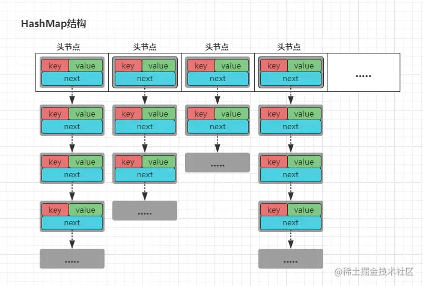
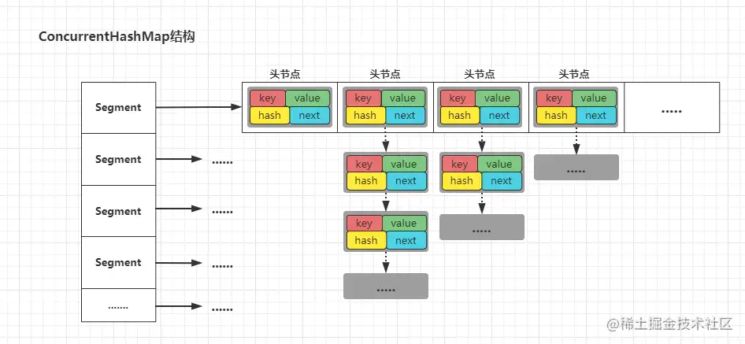

## 引言

相信大家在学习JavaSE时都曾接触过容器这一内容，一般Java中的容器可分为四类：Map、List、Queue以及Set容器，而在使用过程中，对于`ArrayList、HashMap`等这类容器都是经常使用的，但问题在于这些容器在并发环境下都会存在线程安全问题。所以当我们在多线程环境下使用容器时，一般会使用`Vector、HashTable`来代替之前的`ArrayList、HashMap`，或者通过如下几个Collections提供的方法来将容器转换线程安全的：

```java
java复制代码// 将一个List转换为线程安全的List
Collections.synchronizedList(new ArrayList<E>());
// 将一个Set转换为线程安全的Set
Collections.synchronizedSet(new HashSet<E>());
// 将一个map转换为线程安全的map
Collections.synchronizedMap(new HashMap<K,V>());
```

但是不管是如上的哪种方式，其底层都是通过对所有方法添加`synchronized`关键字修饰保证的线程安全。但问题就在于：虽然解决了线程安全问题，但因为都是通过`synchronized`的对象锁保证的，所以当多条线程在同时操作容器时则需要阻塞排队，性能堪忧！
 举个例子直观感受一下：

```java
java复制代码Map map = new HashMap<String,Object>();  
Map syncMap = Collections.synchronizedMap(map);  
T1线程：syncMap.put("竹子","熊猫");  
T2线程：syncMap.get("xxx");  
```

ok~，在这个案例中，假设T1,T2两条线程是在并发执行的，那么T1,T2线程在这种情况下是不能同时执行的，因为T2线程需要等到T1线程put完成释放锁资源后，才能获取锁资源进行get操作。为什么？如下：

```java
java复制代码// Collections类 → synchronizedMap方法
public static <K,V> Map<K,V> synchronizedMap(Map<K,V> m) {
    // 将传入的不安全map封装成了SynchronizedMap对象
    return new SynchronizedMap<>(m);
}

// Collections类 → SynchronizedMap内部类
private static class SynchronizedMap<K,V>
        implements Map<K,V>, Serializable {
    
    private final Map<K,V> m; // 传入的线程不安全容器
    final Object      mutex; // 对象锁
    
    // SynchronizedMap构造方法
    SynchronizedMap(Map<K,V> m) {
        this.m = Objects.requireNonNull(m);
        mutex = this; // 对象锁为this（当前实例对象锁）
    }
    
    // 只是在外面使用synchronized包裹后再次调用了原有的get方法
    public V get(Object key) {
        synchronized (mutex) {return m.get(key);}
    }
    // 只是在外面使用synchronized包裹后再次调用了原有的put方法
    public V put(K key, V value) {
        synchronized (mutex) {return m.put(key, value);}
    }
    // ..........
}        
```

显而易见。从如上源码中观察可以得知，当线程想操作容器时，必须先获取当前容器对象的实例锁。ok~，那么关于`Vector、HashTable`就不再展开赘述了，原理大致相同，因为这两个类中的所有方法都是使用`synchronized`关键字修饰。

> 如果对于synchronized不太了解的小伙伴可以参考之前的文章：《[Synchronized关键字实现原理剖析](https://juejin.cn/post/6977744582725681182)》

而在JDK1.5之后，JUC并发包中，则推出了三个系列的并发容器：阻塞队列容器、写时复制容器以及分段容器。接下来我们逐步从三类容器的简单使用到实现原理依次分析。

## 一、阻塞队列容器

阻塞队列与普通队列最大的不同点在于：支持队列内元素的阻塞添加与阻塞弹出，也就是代表着当在往队列中添加元素时，如果队列已经满了，那么当前添加元素的线程则会阻塞，直至队列弹出一个元素后才会唤醒，并将元素添加至队列中，阻塞弹出同理，如若队列为空，那么会阻塞至队列中有元素为止。在JUC中主要提供了两类阻塞队列：单向阻塞队列以及双向阻塞队列，在JUC包分别对应着`BlockingQueue、BlockingDeque`两个接口，而在Java中的队列总览如下：

- 1、BlockingQueue单向FIFO先进先出阻塞队列：
  - ①ArrayBlockingQueue：由数组结构支持的有界队列
  - ②LinkedBlockingQueue：由链表结构支持的可选有界队列
  - ③PriorityBlockingQueue：由最小二叉堆(优先级堆)结构支持的无界优先级队列
  - ④DelayQueue：由最小二叉堆(优先级堆)结构支持且基于时间的调度队列
  - ⑤SynchronousQueue：实现简单聚集(rendezvous)机制的同步阻塞交换队列(只存一个元素)
  - ⑥LinkedTransferQueue：由链表结构支持的无界队列(1-②、1-⑤与3-①优点组成的超集)
  - ⑦DelayWorkQueue：由最小二叉堆(优先级堆)结构支持的定时线程池定制版无界优先级队列
- 2、BlockingDeque双向阻塞队列：
  - ①LinkedBlockingDeque：由链表结构支持的可选双向有界队列
- 3、其他队列（非阻塞队列）：
  - ①ConcurrentLinkedQueue：由链表结构支持的并发无界队列
  - ②PriorityQueue：由最小二叉堆(优先级堆)结构支持无界队列
  - ③ConcurrentLinkedDeque：由链表结构支持的并发双向无界队列
  - ④ArrayDeque：由数组结构支持的双向有界队列

如上便是Java中提供的队列容器，简单解释一下名词：有界、无界、单向、双向：

- 有界：代表队列可以设置固定长度，队列中元素数量达到队列最大长度时则不能入列
- 无界：代表队列不需要设长度，在内存允许的情况下可以一直添加元素直至溢出。默认是Integer.MAX_VALUE长度，只是对于使用者而言，相当于无限大
- 单向：遵循先进先出FIFO原则的队列
- 双向：两端都可以插入/弹出元素的队列，可以使用双向队列实现栈结构

如上的不同类型队列区别主要体现在存储结构以及对元素操作上不同，但是对于阻塞操作的原理都是类似的。而Java中的阻塞队列都实现自`BlockingQueue`接口，也包括`BlockingDeque`接口也继承自`BlockingQueue`接口，所以下面我们简单看看`BlockingQueue`接口的定义：

```java
java复制代码public interface BlockingQueue<E> extends Queue<E> {
	// 如果队列未满则将元素e插入队列尾部，插入成功返回true，
	// 如果队列已满，则抛IllegalStateException异常
	boolean add(E e); 
	
	// 如果队列未满则将元素e插入队列尾部，插入成功返回true
	boolean offer(E e);
	
	// 如果队列未满则将元素e插入队列尾部，插入成功返回true，
	// 如果该队列已满，则在指定的等待时间之内阻塞至可用空间出现
	// 如果超出指定时间还未将元素插入队列则返回（可响应线程中断）
	boolean offer(E e, long timeout, TimeUnit unit) throws InterruptedException; 
	
	// 将元素插入队列的尾部，如果该队列已满，则一直阻塞等待
	void put(E e) throws InterruptedException; 
	
	// 获取并移除队列的头部元素，如果没有元素则阻塞等待， 
	// 直到有线程添加元素后再唤醒等待线程执行该操作 
	E take() throws InterruptedException; 
	
	// 获取并移除队列的头部元素，在指定的等待时间之内阻塞等待获取元素，
	// 如果超出指定时间还未获取到元素则返回（可响应线程中断）
	E poll(long timeout, TimeUnit unit) throws InterruptedException; 
	
	// 从队列中移除某个指定元素，移除成功返回true，没有该元素则返回false
	boolean remove(Object o); 
	
	// 获取队列剩余的可用空位
	// 假设队列长度为10，已有3个元素，调用该方法则返回7
	int remainingCapacity();
	
	// 检查队列中是否存在指定元素，存在返回true，反之false
	public boolean contains(Object o);
	
	// 一次性从队列中获取所有可用元素
	int drainTo(Collection<? super E> c);
	
	// 一次性从队列中获取指定个数的可用元素
    int drainTo(Collection<? super E> c, int maxElements);
}
```

总的来说，阻塞队列中的方法可分为三类：增删查，在使用阻塞队列时一般都是通过这三类方法操作队列容器，当然put/take类型的操作在有些地方也被称为：生产/消费、新增/弹出、添加/获取等，但是表达的意思都是一致的。接下来看个阻塞队列的简单使用案例：

```java
java复制代码public class BlockingQueueDemo {
    // 创建一个阻塞队列容器
    private static ArrayBlockingQueue<String> arrayBlockingQueue
            = new ArrayBlockingQueue<String>(5);
//    LinkedBlockingQueue linkedBlockingQueue = new LinkedBlockingQueue();
//    PriorityBlockingQueue priorityBlockingQueue = new PriorityBlockingQueue();
//    DelayQueue delayQueue = new DelayQueue();
//    SynchronousQueue synchronousQueue = new SynchronousQueue();
//    LinkedTransferQueue linkedTransferQueue = new LinkedTransferQueue();
//    LinkedBlockingDeque linkedBlockingDeque = new LinkedBlockingDeque();

    public static void main(String[] args) {
        //创建生产者与消费者任务
        Producer producerTask = new Producer(arrayBlockingQueue);
        Consumer consumerTask = new Consumer(arrayBlockingQueue);
        
        // 生产者线程组
        Thread T1 = new Thread(producerTask, "T1");
        Thread T2 = new Thread(producerTask, "T2");

        // 消费者线程组
        Thread Ta = new Thread(consumerTask, "Ta");
        Thread Tb = new Thread(consumerTask, "Tb");

        T1.start();
        T2.start();
        Ta.start();
        Tb.start();
    }
    
    // 生产者
    static class Producer implements Runnable {
        private BlockingQueue<String> blockingQueue;

        private Producer(BlockingQueue<String> b) {
            this.blockingQueue = b;
        }

        @Override
        public void run() {
            for (; ; )
                producer();
        }
        
        private void producer() {
            String task = "竹子-" + UUID.randomUUID().toString();
            try {
                blockingQueue.put(task);
                System.out.println(Thread.currentThread().getName()
                        + "生产任务：" + task);
                Thread.sleep(100);
            } catch (InterruptedException e) {
                e.printStackTrace();
            }
        }
    }
    
    //消费者
    static class Consumer implements Runnable {
        private BlockingQueue<String> blockingQueue;

        private Consumer(BlockingQueue<String> b) {
            this.blockingQueue = b;
        }

        @Override
        public void run() {
            for (; ; )
                consumer();
        }

        private void consumer() {
            try {
                Thread.sleep(200);
                String task = blockingQueue.take();
                System.out.println(Thread.currentThread().getName()
                        + "消费任务：" + task);
            } catch (InterruptedException e) {
                e.printStackTrace();
            }
        }
    }
/* *
 * 执行结果：
 *    T1生产任务：竹子-f1ae18fc-de1c-49f2-b9c0-3b3c45ae2931
 *    Tb消费任务：竹子-46b45b67-4a1b-481a-80eb-3627d0c56a15
 *    T2生产任务：竹子-46b45b67-4a1b-481a-80eb-3627d0c56a15
 *    Ta消费任务：竹子-f1ae18fc-de1c-49f2-b9c0-3b3c45ae2931
 *    .........
 * */
}
```

上述代码即是一个生产者-消费者案例，使用阻塞队列来实现该案例会比之前的`wait/notify`、`condition`简单许多，通过`put()`方法将任务加入队列完成生产任务，通过`take()`方法从队列中获取任务完成消费任务，而当队列中元素已满时生产者阻塞停止生产，而当队列为空时，消费的线程则会阻塞等待，直至新的任务到来。

上述案例中，使用了`ArrayBlockingQueue`这个阻塞队列完成了生产者-消费者案例，而关于其他的阻塞队列则不再演示，使用方式都近乎相似。ok~，简单了解了阻塞队列的使用之后，接着继续来看看它的实现。

### 1.1、ArrayBlockingQueue原理分析

先来看看`ArrayBlockingQueue`内部的成员：

```java
java复制代码public class ArrayBlockingQueue<E> extends AbstractQueue<E>
        implements BlockingQueue<E>, java.io.Serializable {
    // ArrayBlockingQueue构造器：指定队列长度
    public ArrayBlockingQueue(int capacity) {
        this(capacity, false);
    }
    // 构造器：指定队列长度与公平模式
    public ArrayBlockingQueue(int capacity, boolean fair) {
        if (capacity <= 0)
            throw new IllegalArgumentException();
        this.items = new Object[capacity];
        lock = new ReentrantLock(fair);
        notEmpty = lock.newCondition();
        notFull =  lock.newCondition();
    }
    
    // 内部存储元素的数组结构
    final Object[] items;

    // 记录获取元素的下标（take、poll、peek、remove方法都会用到）
    int takeIndex;

    // 记录添加元素的下标（put、offer、add方法都会用到）
    int putIndex;

    // 当前队列中元素的数量
    int count;

    // 控制并发的ReentrantLock锁对象
    final ReentrantLock lock;

    // 用于控制获取元素线程的condition对象
    private final Condition notEmpty;

    // 用于控制添加元素线程的condition对象
    private final Condition notFull;

    // 迭代器对象
    transient Itrs itrs = null;
}
```

`ArrayBlockingQueue`内部使用一个数组成员`items`存储所有的队列元素，分别使用三个数值：`takeIndex`、`putIndex`以及`count`记录添加与获取元素的数组位置与队列中的元素个数，同时内部使用`ReentrantLock`解决线程安全问题，用两个`Condition`对象：`notEmpty`、`notFull`控制“写”线程与“读”线程的阻塞。同时还有一点需要额外注意：`ArrayBlockingQueue`的阻塞操作是基于`ReentrantLock与Condition`实现的，所以在创建`ArrayBlockingQueue`队列对象时也可以指定为公平/非公平模式，所以公平模式则是指：先阻塞的线程一定先操作队列。ok~，接着先看看`put()`方法的实现：

```java
java复制代码// ArrayBlockingQueue类 → put()方法
public void put(E e) throws InterruptedException {
    // 检查元素是否为空，为空则抛出空指针异常
    checkNotNull(e);
    // 获取ReentrantLock成员锁对象
    final ReentrantLock lock = this.lock;
    // 可响应中断式获取锁
    lock.lockInterruptibly();
    try {
        // 如果队列元素已满
        while (count == items.length)
            // 阻塞当前添加元素的线程
            notFull.await();
        // 如果队列元素未满则执行添加操作
        enqueue(e);
    } finally {
        // 释放锁
        lock.unlock();
    }
}
```

`ArrayBlockingQueue.put()`方法实现比较简单，总体执行流程如下：

- ①判断元素是否为空，为空抛出空指针异常
- ②获取锁资源（保证多线程情况下容器操作的安全问题）
- ③判断队列是否已满，如果满了则阻塞当前执行线程
- ④如果未满则调用`enqueue(e);`方法进行添加操作

接着我们继续看看`ArrayBlockingQueue.enqueue()`方法：

```java
java复制代码// ArrayBlockingQueue类 → enqueue()方法
private void enqueue(E x) {
    // 获取存储元素的items数组成员
    final Object[] items = this.items;
    // 将元素放在数组的putIndex下标位置
    items[putIndex] = x;
    // 对putIndex+1，+1后如果=数组长度了则重置为0
    if (++putIndex == items.length)
        putIndex = 0;
    // 记录队列元素的数值count+1
    count++;
    // 唤醒等待获取队列元素的线程
    notEmpty.signal();
}
```

总的来说逻辑并不算复杂，在`ArrayBlockingQueue.enqueue()`方法中，首先获取了存储队列元素的数组成员`items`，然后通过成员`putIndex`记录的队列插入下标位置，将入参中的元素放在了该位置上，紧接着再对`putIndex、count`成员进行了更新，同时唤醒了阻塞等待获取元素的线程。不过值得注意的一点是：当记录队列插入下标的成员`putIndex`自增后等于数组长度时，会重置`putIndex`为0，道理也非常简单，因为如果不置为0，下次插入元素时就会下标越界了。

ok~，接着再来看看`take()`方法的实现：

```java
java复制代码// ArrayBlockingQueue类 → take()方法
public E take() throws InterruptedException {
    // 获取成员ReentrantLock锁对象
    final ReentrantLock lock = this.lock;
    // 可响应中断式获取锁
    lock.lockInterruptibly();
    try {
        // 如果队列为空
        while (count == 0)
            // 通过condition对象阻塞当前获取元素的线程
            notEmpty.await();
        // 如果队列不为空则获取元素
        return dequeue();
    } finally {
        // 释放锁
        lock.unlock();
    }
}
```

`ArrayBlockingQueue.take()`获取队列元素的方法与前面的`ArrayBlockingQueue.put()` 插入队列元素的方法相比，写法大体来说是一致的，只不过前面的`put()`判断的是队列是否已满，已满则阻塞当前线程，而现在的`take()`方法则是判断的队列是否为空，为空则阻塞当前获取元素的线程。接下来再看看`ArrayBlockingQueue.dequeue()`方法：

```java
java复制代码// ArrayBlockingQueue类 → dequeue()方法
private E dequeue() {
    // 获取存储队列元素的成员数组items
    final Object[] items = this.items;
    @SuppressWarnings("unchecked")
    // 获取数组中下标为taseIndex位置上的元素
    E x = (E) items[takeIndex];
    // 获取后清除该位置的元素
    items[takeIndex] = null;
    // 对takeIndex进行+1
    if (++takeIndex == items.length)
        // 如果takeIndex=数组长度时则将takeIndex置为0
        takeIndex = 0;
    // 记录队列元素数量的数值count-1
    count--;
    // 同时更新迭代器中的元素
    if (itrs != null)
        itrs.elementDequeued();
    // 当取出一个元素后唤醒添加操作的线程
    notFull.signal();
    // 返回
    return x;
}
```

`ArrayBlockingQueue.dequeue()`方法逻辑也比较简单，如下：

- ①获取存储队列元素的数组成员
- ②根据takeIndex记录的队列下标获取该位置上的元素
- ③清空数组下标为takeIndex上的元素数据
- ④更新成员takeIndex以及count的数值
- ⑤同步更新迭代器中的元素数据
- ⑥返回获取到的队列元素对象

至此整个ArrayBlockingQueue阻塞队列的添加/获取元素的原理分析完毕，因为ArrayBlockingQueue底层采用数组作为存储结构的原理，所以源码分析起来实则并不难。重点值得我们注意的是：ArrayBlockingQueue中的阻塞是基于ReentrantLock与Condition实现的，使用ReentrantLock保证线程安全，使用Condition来完成添加/获取元素的阻塞操作。ok~，接着再来分析一下另外一个阻塞队列：LinkedBlockingQueue的实现原理。

> 对于Condition原理不太清楚的小伙伴可以参考之前的文章：《[(五)深入剖析并发之AQS独占锁&重入锁ReetrantLock及Condition实现原理](https://juejin.cn/post/6977746796093112333)》

### 1.2、LinkedBlockingQueue原理分析

关于阻塞队列的阻塞实现原理实则比较简单，明白了ReentrantLock的多条件等待Condition原理即可理解队列的阻塞原理的实现过程。而关于Java中其他类型的阻塞队列，阻塞的实现几乎大同小异，区别就在于底层的存储结构不同以及操作方法有细微的差别。接下来再分析一个阻塞队列：LinkedBlockingQueue的实现原理。LinkedBlockingQueue是一个比较有意思的队列容器，因为其中采用了读写分离的思想提升了容器整体的吞吐量。先来简单看看其内部成员：

```java
java复制代码public class LinkedBlockingQueue<E> extends AbstractQueue<E>
        implements BlockingQueue<E>, java.io.Serializable {
    // 构造器：可指定队列长度
    public LinkedBlockingQueue(int capacity) {
       // 如果指定的队列长度为0或小于0则抛出异常
       if (capacity <= 0) throw new IllegalArgumentException();
       // 将传入的指定长度赋值给capacity成员
       this.capacity = capacity;
       // 初始化空的节点作为队列头节点
       last = head = new Node<E>(null);
   }
   // 构造器：不指定长度默认则为Integer.MAX_VALUE
    public LinkedBlockingQueue() {
        this(Integer.MAX_VALUE);
    }
    
    // LinkedBlockingQueue类 → Node内部类
    static class Node<E> {
        // 当前节点存储的元素本身
        E item;
        // 当前节点的后继节点
        Node<E> next;
        // 构造器
        Node(E x) { item = x; }
    }
    
    // 队列的长度（可以指定长度，默认为Integer.MAX_VALUE）
    private final int capacity;
    
    // 原子计数器：记录队列中元素的个数
    private final AtomicInteger count = new AtomicInteger();
    
    // 队列(内部链表)的头节点
    transient Node<E> head;
    
    // 队列(内部链表)的尾节点
    private transient Node<E> last;
    
    // 读锁：线程从队列中获取元素时，使用这把锁
    private final ReentrantLock takeLock = new ReentrantLock();
    
    // 获取元素时，队列为空，线程加入该condition队列等待
    private final Condition notEmpty = takeLock.newCondition();
    
    // 写锁：线程向队列中添加元素时，使用这把锁
    private final ReentrantLock putLock = new ReentrantLock();
    
    // 添加元素时，队列已满，线程加入该condition队列等待
    private final Condition notFull = putLock.newCondition();
}
```

如上，`LinkedBlockingQueue`因为是基于链表结构实现的队列容器，所以通过`Node`内部类构建了一个单向链表，同时使用`AtomicInteger`原子类记录队列中元素数量，`head、last`分别指向队列的头部以及尾部，同时使用`takeLock、putLock`两个`ReentrantLock`控制队列容器的读写并发访问。

OK~，接下来看看`put()`方法：

```java
java复制代码// LinkedBlockingQueue类 → put()方法
public void put(E e) throws InterruptedException {
    // 如果元素为空则抛出空指针异常
    if (e == null) throw new NullPointerException();
    int c = -1;
    // 将要添加的元素封装成node节点
    Node<E> node = new Node<E>(e);
    // 拿到写锁
    final ReentrantLock putLock = this.putLock;
    // 获取当前队列的元素数量
    final AtomicInteger count = this.count;
    // 可响应中断式加锁
    putLock.lockInterruptibly();
    try {
        // 如果队列已满
        while (count.get() == capacity) {
            // 挂起当前线程
            notFull.await();
        }
        // 如果队列未满，将封装的node节点加入队列
        enqueue(node);
        // 更新count计数器并获取更新前的count值
        c = count.getAndIncrement();
        // 如果队列还未满
        if (c + 1 < capacity)
            // 唤醒下一个添加线程，执行元素添加操作
            notFull.signal();
    } finally {
        // 释放锁
        putLock.unlock();
    }
    // 如果更新前队列为空，现在添加了一个元素
    // 代表着目前队列中肯定有数据了
    // 那么则唤醒等待获取元素的线程
    if (c == 0)
        // 如果存在元素则唤醒take线程
        signalNotEmpty();
}

// LinkedBlockingQueue类 → enqueue()方法
private void enqueue(Node<E> node) {
    // 将新来的节点添加到链表的尾部
    last = last.next = node;
}
```

如上源码所示，不难发现`LinkedBlockingQueue、ArrayBlockingQueue`两个队列添加元素的原理大致相同，不同点在于：`LinkedBlockingQueue`在添加元素完成后会唤醒等待队列中的其他线程执行添加操作，但之前的`ArrayBlockingQueue`却不会。为什么呢？

> 因为LinkedBlockingQueue添加和获取元素使用的是两把不同的锁，而之前的ArrayBlockingQueue添加和获取元素是公用同一把锁，所以在ArrayBlockingQueue中同时只允许添加/获取中一个操作执行。所以ArrayBlockingQueue在添加完成后会唤醒take线程，获取完成后会唤醒put线程。在LinkedBlockingQueue中则不同，使用的是两把完全不同的锁，也就是说LinkedBlockingQueue的读/写完全是分离的，各自使用自己的锁进行并发控制，添加元素与获取元素的线程并不会产生互斥，所以这也是为什么一条线程添加元素后会继续唤醒等待列队中的其他线程的原因。同时这种做法也可以在很大程度上提升容器的吞吐量。

ok~，那么关于`put()`方法的整体工作流程大家可以参加源码中的注释，我们接下来再看看`take()`方法的实现：

```java
java复制代码// LinkedBlockingQueue类 → take()方法
public E take() throws InterruptedException {
    E x;
    int c = -1;
    // 获取队列中元素数量以及读锁
    final AtomicInteger count = this.count;
    final ReentrantLock takeLock = this.takeLock;
    // 可响应中断式加锁
    takeLock.lockInterruptibly();
    try {
        // 如果队列为空则挂起当前线程
        while (count.get() == 0) {
            notEmpty.await();
        }
        // 如果队列不为空则获取元素
        x = dequeue();
        // 更新count成员并获取更新前的count值
        c = count.getAndDecrement();
        // 如果队列中还有元素
        if (c > 1)
            // 唤醒等待队列的其他线程，继续执行获取操作
            notEmpty.signal();
    } finally {
        // 释放锁
        takeLock.unlock();
    }
    // 如果之前队列是满的，那么现在弹出了一个元素
    // 则代表着当前队列出现了空位，那么唤醒添加线程
    if (c == capacity)
        signalNotFull();
    return x;
}
// LinkedBlockingQueue类 → dequeue()方法
private E dequeue() {
    // 获取队列头节点
    // 因为头节点是空节点
    // 所以队列中的第一个带数据的节点为：
    //      头结点的后继节点
    Node<E> h = head;
    // 获取head节点的后继节点
    Node<E> first = h.next;
    h.next = h; // 方便GC，置空引用信息
    // 将头节点的后继节点变为头节点
    head = first; 
    // 获取后继节点上存储的元素数据
    E x = first.item;
    // 置空头节点的后继节点数据，将后继节点变为头节点
    first.item = null;
    // 返回获取到的数据
    return x;
}
```

简单阐述一下`LinkedBlockingQueue.take()`方法的实现过程：

- ①获取take锁并判断队列是否为空，为空则挂起当前线程
- ②如果不为空则移除并获取队列头部节点中存储的元素信息
- ③更新count并获取更新之前的count值，判断队列是否还有元素，有则唤醒其他线程继续执行
- ④判断之前的队列是否是满的，如果是满的现在弹出了一个元素，代表队列有空位，那么唤醒添加线程

至此，LinkedBlockingQueue的put/take原理也分析完毕，与ArrayBlockingQueue最大的区别在于：LinkedBlockingQueue底层使用单向链表结构以及双锁实现，我为了简单则将其称呼为“读锁”、“写锁”，但是大家不要被误导，该“读锁”并非真正意义上的读，因为如果只是读操作的话是不需要加锁的，而队列的take方法在读取了元素之后还需移除该元素，所以里面也涉及到了写的操作，自然也需要加锁保证线程安全。准确来说，我所谓的“读/写锁”实际上是指“take/put”锁。

OK~，关于其他的阻塞队列则不再继续分析，因为内部阻塞的原理实现都大致相同，区别则在于内部的数据存储结构不同，大家有兴趣可以自己阅读其源码实现，队列的源码在理解数据结构的前提下其实并不算复杂。

## 二、写时复制容器

在本文开始时的引言中，曾提到：对于常用的一些容器在多线程环境下都会存在线程安全问题。所以当需要保证线程安全时，一般会使用Vector、HashTable或Collections.synchronizedXXX等来代替。此类方式的确可以保证线程安全，但是在文章一开始我们也早已分析了这些方式存在的缺陷：性能有限，并发吞吐量上不去。而为了解决这个问题，在JUC包提供了一类新的容器：**写时复制容器**，其内部采用读写分离的思想提升容器的并发吞吐量。

**写时复制容器(Copy-On-Write)：** 写时复制容器是计算机程序设计领域惯用的一种优化思想，在很多系统设计中，比如Linux中的Fork父子进程数据同步等机制都采用了这种思想，子进程在创建时并不会拷贝父进程的数据，对于需要用到的数据仅仅只是存在一个引用指向父进程中存储的数据地址，每次读取时都是通过引用地址从父进程中读取数据，而当子进程中要修改数据时才发生真正的拷贝动作，将父进程中的数据拷贝一份，修改完成后再将指向父进程数据的指针改成指向拷贝数据。当然，写时复制实则也是懒加载、惰性加载思想的产物。在JUC包中，写时复制容器主要提供了两种：`CopyOnWriteArrayList`与`CopyOnWriteArraySet`，在使用这两个容器时，读操作不会加锁，写操作时则会先获取锁，然后再复制一份原有数据进行修改，修改完成后再修改原有引用指向。

ok~，关于`CopyOnWriteArrayList`与`CopyOnWriteArraySet`的使用我们则不再阐述，因为这两个容器是对应着`ArrayList`与`HashSet`的，使用方法与之相同。接下来从源码角度分析写时复制容器的具体实现过程。

### 2.1、CopyOnWriteArrayList原理分析

CopyOnWriteArrayList内部是基于数组结构存储的，类结构如下：

```java
java复制代码public class CopyOnWriteArrayList<E>
    implements List<E>, RandomAccess, Cloneable, java.io.Serializable {
    private static final long serialVersionUID = 8673264195747942595L;

    // ReentrantLock独占锁：用于保证线程安全
    final transient ReentrantLock lock = new ReentrantLock();

    // volatile修饰的数组：用于存储数据，volatile保证读取可见性
    private transient volatile Object[] array;
    
    // array的封装方法
    final void setArray(Object[] a) {
        array = a;
    }
    
    // 构造器1：初始化长度为0的数组
    public CopyOnWriteArrayList() {
        setArray(new Object[0]);
    }
    //构造器2：入参为一个Collection集合对象
    public CopyOnWriteArrayList(Collection<? extends E> c) {
        Object[] elements;
        // 如果传入的Collection对象就是COWL对象则直接拷贝数据
        if (c.getClass() == CopyOnWriteArrayList.class)
            elements = ((CopyOnWriteArrayList<?>)c).getArray();
        // 如果不是
        else {
            // 将Collection集合对象转换为Object数组
            elements = c.toArray();
            // 如果调用toArray()后没返回数组
            if (elements.getClass() != Object[].class)
                // 再次自己copy集合的数据转化为数组
                elements = Arrays.copyOf(elements, elements.length, Object[].class);
        }
        // 赋值给array成员
        setArray(elements);
    }
    // 构造器3：入参为一个数组对象
    public CopyOnWriteArrayList(E[] toCopyIn) {
        setArray(Arrays.copyOf(toCopyIn, toCopyIn.length, Object[].class));
    }
    
    // COWIterator内部类：迭代器。该迭代器不是fail-fast的
    static final class COWIterator<E> implements ListIterator<E> {
        private final Object[] snapshot;
        // 省略其他代码.......
    }
    // COWSubList内部类：子列表。与ArrayList的子列表同样的作用
    private static class COWSubList<E> extends AbstractList<E>
        implements RandomAccess{}
    // COWSubListIterator内部类：子列表的迭代器。
    private static class COWSubListIterator<E> implements ListIterator<E> {}
}
```

ok，简单的看看CopyOnWriteArrayList内部的成员，使用ReentrantLock独占锁保证容器整体写操作的安全问题，其内部使用一个volatile关键字修饰的Object类型数组存储数据。同时CopyOnWriteArrayList存在三个内部类，分别为自身的迭代器、子列表以及子列表的迭代器类。值得注意的是：

> CopyOnWriteArrayList的迭代器并不是fail-fast的，即代表着当有一条线程在通过迭代器遍历一个CopyOnWriteArrayList对象时，另外一条线程对该容器进行了写操作，不会对使用迭代器遍历容器的线程产生影响。而我们经常使用的ArrayList容器，迭代器则是fail-fast的，当一条线程使用迭代器遍历数据，另外一条执行修改操作时，迭代器线程会抛ConcurrentModifyException的异常。

接着再分析分析CopyOnWriteArrayList中的常用方法，先看看`get(i)`方法：

```java
java复制代码// CopyOnWriteArrayList类 → get()方法
public E get(int index) {
    return get(getArray(), index);
}

// CopyOnWriteArrayList类 → get()重载方法
private E get(Object[] a, int index) {
    return (E) a[index];
}
```

关于get()方法的实现一目了然，没啥好讲的，无非就是将数组指定下标的元素数据返回了而已。接着继续看看修改(写)操作的方法：

```java
java复制代码// CopyOnWriteArrayList类 → set()方法
public E set(int index, E element) {
    // 获取锁对象并加锁
    final ReentrantLock lock = this.lock;
    lock.lock();
    try {
        // 获取内部存储数据的数组成员：array
        Object[] elements = getArray();
        // 获取数组中指定下标原有的数据
        E oldValue = get(elements, index);
        // 如果指定下标位置原本存储的数据与新的数据不同
        if (oldValue != element) {
            // 获取数组的长度
            int len = elements.length;
            // 拷贝一个新的数组对象
            Object[] newElements = Arrays.copyOf(elements, len);
            // 将指定下标位置的元素修改为指定的数据
            newElements[index] = element;
            // 将成员array的引用从原本的数组改为新的数组
            setArray(newElements);
        } else {
            // 如果指定下标位置原本存储的数据与新的数据相同
            // 不做任何更改
            setArray(elements);
        }
        // 返回原本下标位置的值
        return oldValue;
    } finally {
        // 释放锁/解锁
        lock.unlock();
    }
}
// CopyOnWriteArrayList类 → add()方法
public void add(int index, E element) {
    // 获取锁/加锁
    final ReentrantLock lock = this.lock;
    lock.lock();
    try {
        // 获取内部存储数据的数组成员：array
        Object[] elements = getArray();
        int len = elements.length;
        // 如果指定下标位置超出数组长度或小于0则抛出异常
        if (index > len || index < 0)
            throw new IndexOutOfBoundsException("Index: "+index+
                                                ", Size: "+len);
        // 创建一个新的数组对象
        Object[] newElements;
        // 计算插入的下标位置是在数组中间还在数组最后
        int numMoved = len - index;
        // 如果在数组最后，那么拷贝原本的数组并长度+1，留个空位
        if (numMoved == 0)
            newElements = Arrays.copyOf(elements, len + 1);
        // 如果要在数组中间插入数据
        else {
            // 先创建一个长度为len+1的新数组
            newElements = new Object[len + 1];
            // 然后将拷贝老数组中的所有数据拷贝过来
            // 但是将下标为index的位置空出来
            System.arraycopy(elements, 0, newElements, 0, index);
            System.arraycopy(elements, index, newElements, index + 1,
                             numMoved);
        }
        // 将要添加的数据设置到数组的index下标位置
        newElements[index] = element;
        // 将成员array的引用从原本的数组改为新的数组
        setArray(newElements);
    } finally {
        // 释放锁/解锁
        lock.unlock();
    }
}
// CopyOnWriteArrayList类 → remove()方法
public E remove(int index) {
    // 获取锁/加锁
    final ReentrantLock lock = this.lock;
    lock.lock();
    try {
        // 拷贝原本的数组
        Object[] elements = getArray();
        // 获取数组长度与数组中要移除的值
        int len = elements.length;
        E oldValue = get(elements, index);
        // 计算要移除的位置是在数组的最后还是在数组的中间
        int numMoved = len - index - 1;
        // 如果在数组最后
        if (numMoved == 0)
            // 拷贝数组时，将最后一个元素不拷贝即可
            // 拷贝完成后重新更改引用指向
            setArray(Arrays.copyOf(elements, len - 1));
        // 如果要移除的位置是在数组中间
        else {
            // 创建一个长度为原本长度-1的新数组
            Object[] newElements = new Object[len - 1];
            // 在拷贝数据时，将指定位置的元素不拷贝即可
            System.arraycopy(elements, 0, newElements, 0, index);
            System.arraycopy(elements, index + 1, newElements, index,
                             numMoved);
            // 更改成员array的引用指向
            setArray(newElements);
        }
        // 返回被移除的值
        return oldValue;
    } finally {
        // 释放锁/解锁
        lock.unlock();
    }
}
```

如上列出了CopyOnWriteArrayList常用的三个写方法：`set()、add()、remove()`，下面分别谈谈它们的执行流程：

- set()方法是直接替换的方法，比如指定的下标位置已经有数据的情况下会覆盖之前的数据，该方法需要传递两个参数，第一个参数为下标位置，第二个参数为要设置的数据本身，下面是set方法的执行流程：
  - ①加锁后获取原本的数组，同时获取指定下标原有的值
  - ②判断原有值与新值是否相同，相同则不做任何修改
  - ③老值与新值不同时，先拷贝原有数组内的元素数据，然后将指定下标位置的数据修改为新值，最后将array成员的引用指向新数组并释放锁
  - ④返回指定下标被替换掉的老值
- add()方法与set()方法参数是相同的，但区别在于：add方法不会替换指定下标位置之前的老值，而是将新值插入到数组中，执行流程如下：
  - ①加锁后获取数组数据、数组长度
  - ②判断要插入数据的下标位置是否超出数组长度+1或小于0，如果是则抛出异常
  - ③判断要插入数据的下标位置在数组中间还是在数组最后
  - ④如果是在最后位置插入，那么先创建一个长度+1的新数组，同时拷贝原有数组的所有数据，将要插入的数据添加到数组的最后位置，最后将array成员的引用指向新数组并释放锁
  - ⑤如果要插入的下标位置在数组中间，也会先创建一个长度+1的新数组，同时拷贝原有数组的所有数据，但是在拷贝时会将指定下标位置空出来，然后将要插入的数据添加到该位置，最后将array成员的引用指向新数组并释放锁
- remove()方法是移除容器中数据的方法，该方法需要传入要移除的下标位置，执行流程如下：
  - ①加锁后获取原本的数组数据及其长度，同时获取指定下标原有的值
  - ②判断要删除数据的下标位置在数组中间还是在数组最后
  - ③如果是在数组最后一个位置，则在拷贝数组数据时，不拷贝最后一个元素，完成后将array成员的引用指向新数组并释放锁
  - ④如果要删除的下标在数组中间位置，那么则先创建一个长度-1的新数组，同时在拷贝数据时，不拷贝指定下标位置的元素数据即可，完成后将array成员的引用指向新数组并释放锁

OK~，至此三个常用的修改方法原理分析完成，过程并不复杂，但是比较有意思的是：

> 在CopyOnWriteArrayList中的移除方法，如remove等方法，其实并不会去删除指定下标的元素数据，或者说CopyOnWriteArrayList中的移除方法根本不会存在删除的操作，而仅仅只是在为新数组拷贝数据时，刻意“漏”掉指定下标的数据不拷贝即可。

同时因为写操作都是使用的同一个锁对象来进行的并发控制，所以也可以避免线程安全问题的出现。

### 2.2、CopyOnWriteArraySet原理分析

关于CopyOnWriteArraySet这个容器我们便不再分析其内部实现了，至于为什么？我们看看其内部成员就明白了。如下：

```java
java复制代码public class CopyOnWriteArraySet<E> extends AbstractSet<E>
        implements java.io.Serializable {
    // 内部存储数据的结构
    private final CopyOnWriteArrayList<E> al;
    // 构造器
    public CopyOnWriteArraySet() {
        al = new CopyOnWriteArrayList<E>();
    }
}    
```

显而易见，CopyOnWriteArraySet实际上是基于CopyOnWriteArrayList实现的，所以当我们明白了CopyOnWriteArrayList的原理实现后，自然也理解了CopyOnWriteArraySet这个容器。

### 2.3、CopyOnWrite写时复制容器总结

关于写时复制的容器，优势比较明显，其内部充分运用了读写分离的思想提升了容器的整体并发吞吐量，以及避免了并发修改抛出的ConcurrentModificationException异常。但是也存在两个致命的缺陷：

- ①内存占用问题。因为CopyOnWrite容器每次在发生修改时都会复制一个新的数组，所以当数组数据过大时对内存消耗比较高。
- ②数据不一致性问题。CopyOnWrite容器保证的是最终一致性，一条线程在执行修改操作，另一条线程在执行读取操作，读取的线程并不能看到最新的数据，就算修改操作执行了`setArray()`方法将指向改成了新数组，原本读取的线程也不能看到最新的数据。因为读取线程在执行读操作时并不是直接访问成员array完成的，而是通过`getArray()`方法的形式获取到的数组数据，在`getArray()`方法执行完成之后，读取数据的线程拿到的引用已经是旧数组的地址了，之后就算修改成员array的指向也不会影响get的访问。

还有一点值得注意：CopyOnWrite写时复制容器提升的只是读操作的吞吐量，而整个容器的写操作还是基于同一把独占锁保证的线程安全，所以如果需要频繁执行写操作的场景，并不适合用CopyOnWrite容器，同时还会因为复制带来的内存、时间开销导致性能下降。

## 三、锁分段容器

锁分段容器的概念比较好理解，指的是将一个容器分为不同区域操作，对不同区域操作时都是使用各自的锁资源进行获取/释放锁保障线程安全。在引言中曾提及到，HashMap是线程不安全的，如果要在多线程情况下使用，就要使用HashTable这类的容器操作，但是这类容器因为是一把锁控制并发，所以效率比较低下。而在并发包中，则推出了一款新的容器：ConcurrentHashMap，其中就采用锁分段技术提升了容器的整体并发吞吐性。不过在分析ConcurrentHashMap实现之前，我们先简单的聊聊HashMap的原理。整体的阐述思路将分为三步：

- ①HashMap实现原理浅析
- ②JDK1.7中的ConcurrentHashMap原理浅谈
- ③JDK1.8中的ConcurrentHashMap原理实现过程

### 3.1、HashMap实现原理浅析

HashMap是基于哈希表结构实现的一个容器，底层是基于数组+单向链表结构实现的，数组长度默认为16，每个数组下标的位置用于存储每个链表的头节点。而链表的每个节点在JDK1.7中是Entity对象，Entity对象则由key、value以及next向下指针三个元素组成。结构大致如下：
 

如上图，在HashMap中，结构采用的是数组+单向链表的形式存储数据(数组的每个位置也被称作为“桶”)，使用数组结构存储每个链表的头节点，如果某个数据经过计算后得到下标位置上已经有了数据，那么则追加在链表的尾部。

##### HashMap的put()原理实现：

- ①首先将`key-value`封装成节点对象

- ②调用`hashcode()`方法计算出`key`的哈希值

- ③通过哈希算法将哈希值转换为具体的下标值

- ④根据计算出的下标位置将

  ```
  key-value
  ```

  数据进行存储。但在存储前会先判断该下标是否有数据：

  - 如果没有：将该数据存储在数组的该下标位置，作为链表头节点
  - 如果有：会用key值与链表每个节点的key值比较，如果相同则覆盖，如果全部不同则将数据使用头插法添加到链表的头部(jdk1.8之后是尾插法，追加到链表尾部)

##### HashMap的get()原理实现：

- ①调用`hashcode()`方法计算出`key`的哈希值并计算出具体的下标值
- ②通过下标值快速定位到数组的某个位置，首先会判断该位置上是否有数据：
  - 如果没有：代表该位置还不存在链表，直接返回null
  - 如果有：会用key值与链表每个节点的key值进行比较，相同则获取该节点的数据返回，如果遍历完整个链表后，不存在key值相同的节点，同样会返回null

> 注意：HashMap重写了equals()方法，因为equals()默认是比较内存地址，而重写后，在HashMap中是比较key值。

##### HashMap的resize()扩容原理实现：

- 前置条件：默认容量=16，负载因子=0.75，阈值=容量*负载因子
- 扩容条件：当数组容器中的元素数量达到阈值时，会发生扩容动作
- 扩容实现过程：
  - ①当容量达到阈值时，创建一个2倍长度的新数组，调用`transfer()`方法迁移数据
  - ②遍历原本老数组的所有元素(头节点)，根据每个头节点循环每个链表，使用头插法将数据转移到新的数组中

> 注意：1.7中因为使用的是头插法，所以在多线程环境下容易导致死循环、数据丢失的问题。

##### JDK1.7前后HashMap的区别：

| 对比项   | JDK1.7前           | JDK1.8后             |
| -------- | ------------------ | -------------------- |
| 节点类型 | Entry              | Node/TreeNode        |
| 存储结构 | 数组+单向链表      | 数组+单向链表/红黑树 |
| 插入方式 | 头插法             | 尾插法               |
| 扩容时机 | 先扩容再插入       | 先插入再扩容         |
| 哈希算法 | 4次位运算+五次异或 | 1次位运算+1次异或    |
| 插入方式 | 数组+单向链表      | 数组+单向链表/红黑树 |

> JDK1.8中，当链表长度大于8时，链表结构会转换为红黑树结构。但前提是：当数组长度小于64时，如果有链表的长度大于8了，那么代表着当前数组中的数据哈希冲突比较严重，在这种情况下是不会直接发生红黑树转换的，而是会先对于数组进行扩容，扩容之后对数据重新进行哈希计算，重新散列分布。所以其实真正的链表转红黑树的条件是：**当数组长度已经超过64并且链表中的元素数量超过默认设定（8个）时，才会将链表转化为红黑树结构**。

### 3.2、JDK1.7前的ConcurrentHashMap原理浅谈

在前面讲过：在多线程环境下使用HashMap是线程不安全的，而使用线程安全的HashTable效率又非常低下，所以便诞生了ConcurrentHashMap，ConcurrentHashMap中采用了锁分段的技术实现了更细粒度的并发控制，从而提升了容器吞吐。下面我们也可以先看看它的存储结构。

在JDK1.7中，ConcurrentHashMap使用Segment数组+HashEntry数组+单向链表的方式实现。而Segment继承了ReentrantLock，所以Segment对象也可以作为ConcurrentHashMap中的锁资源使用。结构如下：
  如上，ConcurrentHashMap的每个Segment(段)相当于一个HashTable容器。而Segment数组长度默认为16，但在创建时可以指定段数，必须为2的次幂，如果不为2的次幂则会自优化。在写入数据时都会分段上锁，每个段之间互不影响。而当有线程读取数据时则不会加锁，但是在一个数据在读的时候发生了修改则会重新加锁读取一次。不过值得注意的是：

> 在ConcurrentHashMap的每个段(Segment对象)中都存在一个计数器：volatile修饰的count变量，count表示每个段中的所有HashEntry数组中所有链表的数据总和数量。除此之外，在每个段中还有一个modCount计数器，记录着当前这个段的写入操作次数，主要用于跨段操作时判断段中是否发生了更改操作。

##### JDK1.7前的ConcurrentHashMap.put()原理实现：

- ①根据数据的key值计算hash值，通过哈希值定位到具体的Segment(段)位置，查看段是否为空：
  - 为空：对段进行初始化
  - 不为空：定位到具体的段位置
- ②获取段的锁资源，然后再根据哈希值计算出段中HashEntry数组存储数据的具体下标(桶)
- ③根据计算出的数组下标，将数据封装成节点后存储在该位置。但在存储前会先判断该下标是否有数据：
  - 没有：将数据存储在数组的该下标位置成为链表头节点
  - 有：先判断当前数据的key值与链表的每个节点的key值是否相同：
    - 相同：替换之前的数据
    - 不同：使用头插法将节点插入到链表头部(1.7后是尾插法)
- ④更新count值并释放锁

> 在前面曾提到ConcurrentHashMap的Segment数组长度默认是16(可自定义长度)，而且Segment继承了ReentrantLock充当锁的角色，那么这样则可以推导出ConcurrentHashMap默认是16个段(可自定义更大长度)，代表着在最理想的状态下，同时允许16个线程对容器执行写操作。但是为什么说是最理想状态呢？因为有可能会出现哈希冲突，导致两个线程要写入的数据定位到了同一个段，所以往往在实际应用中是很难将该容器的最大吞吐发挥到极致的。
>  **PS：ConcurrentHashMap中不允许key=null，也不允许value=null。**

##### JDK1.7前的ConcurrentHashMap.get()原理实现：

- ①根据数据的key值计算hash值，通过哈希值定位到具体的Segment(段)位置
- ②再次根据哈希值在段中定位具体的数组位置，获取数组位置上存储的头节点
- ③根据头节点遍历整个链表，用传入的key值和每个节点的key值进行判断是否相同：
  - 相同：返回该节点中存储的value值
  - 全部不同：返回null
- ④如果key值相同，但读到的value依旧为null时会加锁重读一次

> 为什么key值相同value为null时需要加锁重读一次？因为ConcurrentHashMap中不允许value=null，所以当存在key，但value为null时可能是出现了指令重排导致数据暂时为null，所以需要加锁重读一次。

##### JDK1.7前的ConcurrentHashMap.size()原理实现：

在ConcurrentHashMap中的size()需要涉及到整个容器，需要统计所有段中的元素数量。那又该如何实现呢？

- ①先记录所有段的modCount值且统计总和
- ②统计所有段中记录元素个数的count成员总和
- ③统计完成后再将之前记录的modCount与现在每个段中的modCount进行判断是否相同：
  - 相同：代表统计前后没有发生写操作，直接返回求和所有段count的总数
  - 不同：代表统计前后发生了写操作，重新再执行①②③步骤重新统计一次（最多执行三次）
- ④如果统计三次后，每次统计总和前后都发生了写入操作，则对容器所有段上锁进行统计并返回

ok~，至此JDK1.7前的ConcurrentHashMap原理分析结束，接下来再来看看1.7后的实现。

### 3.3、JDK1.8中的ConcurrentHashMap源码分析

ConcurrentHashMap在JDK1.8中，弃用了之前Segment数组+HashEntry数组+单向链表这种臃肿的方式实现，而是采用了更轻量级的Node数组+链表+红黑树+CAS+Synchronized关键字实现。下面我们先来看看ConcurrentHashMap的成员，如下：

```java
java复制代码// Node节点数组,该数组中每个位置要存储的元素为每个链表的头节点
transient volatile Node<K,V>[] table;
// 在扩容时过渡用的table表，扩容时节点会暂时转迁到这个数组
private transient volatile Node<K,V>[] nextTable;
// 计数器值=baseCount+每个CounterCell[i].value。所以baseCount只是计数器的一部分
private transient volatile long baseCount;
// 这个值在不同情况时存放值都不同，主要有如下几种情况：
//      1. 数组没新建时，暂时存储数组容量大小的数值
//      2. 数组正在新建时，该成员为-1
//      3. 数组正常情况时，存放阈值
//      4. 数组扩容时，高16bit存放旧容量唯一对应的一个标签值，低16bit存放进行扩容的线程数量
private transient volatile int sizeCtl;
//扩容时使用，正常情况时=0，扩容刚开始时为容量，代表下一次领取的扩容任务的索引上界
private transient volatile int transferIndex;
//CounterCell相配套一个独占锁
private transient volatile int cellsBusy;
//counterCells也是计数器的一部分
private transient volatile CounterCell[] counterCells;

// 三种特殊的节点哈希值，一个节点正常的哈希值都为>=0的正数
// 此节点是扩容期间的转发节点，这个节点持有新table的引用
static final int MOVED     = -1;
// 代表此节点是红黑树的节点
static final int TREEBIN   = -2;
// 代表此节点是一个占位节点，不包含任何实际数据
static final int RESERVED  = -3; 
```

ok~，如上便是一些ConcurrentHashMap的成员，接下来再看看其节点类型，ConcurrentHashMap的节点稍微有些复杂，如下：

- Node：如果数组某个下标位置(桶)的结构为单向链表，那所有数据会被封装成Node节点加入链表中。Node类的value与next指针都为volatile修饰的，保证了写操作的可见性
- TreeNode：如果数组某个下标位置(桶)的结构为红黑树结构，那么其桶内存储的节点则为TreeNode类型
- TreeBin：TreeNode的封装体，用作放在数组下标上作为根节点使用，但TreeBin并不是真正的根节点，根节点为其内部封装的root成员。这样包装的好处在于：因为红黑树随着平衡旋转操作，根节点随时可能发生变化，所以如果直接使用TreeNode作为根节点，数组上的成员会经常变化，而用TreeBin进行封装，可以让数组成员不会发生变化
- ForwardingNode：扩容期间的转发节点，这个节点持有新table的引用
- ReservationNode：占位节点，不包含任何实际数据

> PS：1.8的ConcurrentHashMap和1.8的HashMap链表转红黑树的时机是相同的，都为：当数组容量>=64且单个链表长度>=8，这个下标位置(桶)才会从链表结构转换为红黑树结构

#### 3.3.1、JDK1.8中的ConcurrentHashMap.put()源码分析

put()方法为整个ConcurrentHashMap的核心，同时它涉及的方面也有很多：容器初始化、插入操作、扩容、计数统计等，接下来从源码的角度入手分析其实现原理：

```java
java复制代码// ConcurrentHashMap类 → put()方法
public V put(K key, V value) {
    // 调用其内部的putVal()方法
    return putVal(key, value, false);
}

// ConcurrentHashMap类 → putVal()方法
final V putVal(K key, V value, boolean onlyIfAbsent) {
    // 检查key,value是否为空
    if (key == null || value == null) throw new NullPointerException();
    // 根据key的原始哈希值计算新的哈希值
    int hash = spread(key.hashCode());
    // 代表一个位置下(桶)的节点数量
    int binCount = 0;
    // 开始遍历整个table数组(Node数组)
    for (Node<K,V>[] tab = table;;) {
        Node<K,V> f; int n, i, fh;
        // 如果数组还未初始化
        if (tab == null || (n = tab.length) == 0)
            // 对数组进行初始化操作
            tab = initTable();
        // 如果通过哈希值计算出的下标位置为null
        else if ((f = tabAt(tab, i = (n - 1) & hash)) == null) {
            // 使用CAS机制将现有数据封装成Node节点插入该位置成为头节点
            if (casTabAt(tab, i, null,
                         new Node<K,V>(hash, key, value, null)))
                // 插入到空桶(空箱)时不需要上锁，也无法上锁(稍后分析)
                break;                   
        }
        // 如果计算出的下标位置不为空，但节点的哈希值为MOVED
        // 代表当前位置的桶正在执行扩容操作
        else if ((fh = f.hash) == MOVED)
            // 当前线程执行帮忙扩容操作
            tab = helpTransfer(tab, f);
        // 如果计算出的下标位置不为空，且哈希值不为MOVED
        else {
            V oldVal = null;
            // 以数组下标位置的元素(头节点)作为锁资源上锁
            synchronized (f) {
                // 加锁成功后要再次检查f是否为头节点
                if (tabAt(tab, i) == f) {
                    // 如果哈希值>=0代表是正常节点
                    if (fh >= 0) {
                        // 把binCount=1
                        binCount = 1;
                        // 根据头节点遍历整个链表，每遍历一次对binCount+1
                        for (Node<K,V> e = f;; ++binCount) {
                            K ek;
                            // 如果节点的key与传入的key相同
                            if (e.hash == hash &&
                                ((ek = e.key) == key ||
                                 (ek != null && key.equals(ek)))) {
                                // 用新值替换旧值
                                oldVal = e.val;
                                if (!onlyIfAbsent)
                                    e.val = value;
                                // 停止遍历操作
                                break;
                            }
                            // 如果在整个链表中没有找到key值相同的节点
                            Node<K,V> pred = e;
                            // 找到链表尾部
                            if ((e = e.next) == null) {
                                // 将传入的数据封装成Node节点插入到链表尾部
                                pred.next = new Node<K,V>(hash, key,
                                                          value, null);
                                // 插入完成后停止链表遍历操作
                                break;
                            }
                        }
                    }
                    // 如果头节点是一个TreeBin类型
                    // 代表当前位置的结构已经变为了红黑树结构
                    else if (f instanceof TreeBin) {
                        Node<K,V> p;
                        // 把binCount=2，红黑树结构时binCount固定为2
                        binCount = 2;
                        // 将传入的k,v,hash值作为参数，调用putTreeVal方法
                        // putTreeVal方法可能返回两种结果：
                        //   ①在整棵树中没有找到key相同的节点，新建Node插入返回null
                        //   ②找到key相同的节点并返回原本的value值
                        // 如果找到了key值相同的节点
                        if ((p = ((TreeBin<K,V>)f).putTreeVal(hash, key,
                                                       value)) != null) {
                            // 用新值替换旧值
                            oldVal = p.val;
                            if (!onlyIfAbsent)
                                p.val = value;
                        }
                    }
                }
            }
            // 如果binCount!=0，代表着当前线程肯定执行了写入操作
            if (binCount != 0) {
                // 如果链表节点数量达到了8
                if (binCount >= TREEIFY_THRESHOLD)
                    // 执行扩容操作或链表转红黑树的操作
                    treeifyBin(tab, i);
                // 如果这次put操作仅是新值换旧值，那么返回旧值
                if (oldVal != null)
                    return oldVal;
                break;
            }
        }
    }
    // 如果本次put是插入操作，那么size增加1
    addCount(1L, binCount);
    // 并且返回null
    return null;
}
```

ok，如上便是ConcurrentHashMap.put方法的源码实现，执行流程如下：

- ①判断传入的`key,value`值是否为空，为空抛出空指针异常

- ②根据key的`hashCode`值计算出新的哈希值

- ③如果整个数组为空，那么代表容器还未初始化，执行初始化操作

- ④通过计算出的哈希值定位到数组具体的下标位置，同时判断该位置是否为空

  - 为空：代表该桶还没有头节点，那么使用CAS机制将当前数据封装成节点添加到该位置
  - 不为空：判断当前位置(桶)的头节点哈希值是否为MOVED
    - 是：代表当前位置(桶)处于扩容阶段，当前线程帮忙扩容
    - 不是：代表当前位置(桶)处于正常阶段，准备执行put操作

- ⑤以头节点作为锁资源进行加锁操作，加锁成功后再次判断头节点是否被移除，没有则执行put操作

- ⑥判断头节点的哈希值是否>=0，如果成立则代表当前节点是普通的链表头节点，将binCount=1

- ⑦根据头节点指针开始遍历整个链表，判断传入的key值是否与链表中节点的key值相同：

  - 相同：代表是同一个key值，用新值替换旧值，返回旧值
  - 不同：将数据封装成节点对象，使用尾插法插入到链表尾部，返回null
  - 注意：在遍历链表时，每遍历一个节点，binCount都会+1

- ⑧如果头节点的类型为TreeBin类型，代表当前位置(桶)的结构已经变为了红黑树，将binCount=2

- ⑨调用

  ```
  putTreeVal()
  ```

  方法查找整棵树，查看是否有key值相同的节点：

  - 有：返回旧值，在外部执行新值换旧值的操作，返回旧值
  - 没有：将数据封装成树节点插入到红黑树中，返回null

- ⑩判断binCount是否>=8，如果是则代表当前链表过长，调用treeifBin方法扩容或树化

- ⑪判断本次put操作是否为新值换旧值：

  - 是：返回旧值
  - 不是：代表是插入操作，那么对size+1，然后返回null

> 注意点：
>  ①为什么当计算出的下标位置(桶)元素为空时，不加锁反而使用CAS机制添加元素？
>  因为1.8之后的ConcurrentHashMap是基于synchronized关键字实现锁机制的，而synchronized是基于对象上锁的，如果下标位置元素为空则代表没有头节点，那么无法基于头节点进行上锁，所以只能通过CAS机制进行添加，将第一个数据添加到下标位置变为头节点。
>  ②binCount这个值，在链表结构的情况下，遍历链表时，每遍历一个节点则binCount自增1，而在红黑树结构时，binCount保持为2，这是为什么？
>  因为binCount最终的作用是：判断当前位置是否发生扩容或者树化的，而只有链表结构的情况下需要扩容或树化。
>  ③调用treeifBin()方法后，不会直接发生树化，而是会先判断当前ConcurrentHashMap的数组长度是否已经>=64，如果小于这个长度，发生的则是扩容操作而并不是链表转红黑树操作。

至此，整个ConcurrentHashMap.put方法执行结束。

#### 3.3.2、JDK1.8中的ConcurrentHashMap.get()源码分析

废话不多说，先上源码，如下：

```java
java复制代码public V get(Object key) {
    // 定义相关局部变量
    Node<K,V>[] tab; Node<K,V> e, p; int n, eh; K ek;
    // 通过key的hashcode计算新的哈希值
    int h = spread(key.hashCode());
    // 如果数组不为空，并且数组已经初始化，并且计算出的具体下标位置不为空
    if ((tab = table) != null && (n = tab.length) > 0 &&
        (e = tabAt(tab, (n - 1) & h)) != null) {
        // 判断头节点的key是否与传入的key相同
        if ((eh = e.hash) == h) {
            // 相同则直接返回头节点中存储的value值
            if ((ek = e.key) == key || (ek != null && key.equals(ek)))
                return e.val;
        }
        // 如果头节点的哈希值小于0，代表当前位置（桶）处于特殊状态，有如下三种：
        //  ①为ForwardingNode节点：当前在扩容中，需转发到nextTable上查找
        //  ②为TreeBin节点：代表当前位置是红黑树结构，需要二叉查找
        //  ③为ReservationNode节点：代表当前槽位之前是null，是占位节点，所以直接返回null
        else if (eh < 0)
            return (p = e.find(h, key)) != null ? p.val : null;
        // 如果头节点为正常节点，那么根据next指针遍历整个链表
        while ((e = e.next) != null) {
            // 比较每个节点中的key值是否相同，相同则返回节点中的value值
            if (e.hash == h &&
                ((ek = e.key) == key || (ek != null && key.equals(ek))))
                return e.val;
        }
    }
    // 在链表中没有找到key值相同的节点则返回null
    return null;
}
```

ConcurrentHashMap.get方法的源码执行流程如下：

- ①通过传入的key值计算出新的哈希值
- ②判断map内部的数组是否为空，是否已经初始化，key所在的位置(桶)是否为空
- ③判断计算后的桶位置，头节点是否为要查找的数据，如果是则直接返回头节点的value
- ④判断头节点的哈希值是否小于0，如果小于0代表当前位置(桶)处于特殊状态，有三种情况：
  - 为ForwardingNode节点：当前在扩容中，需转发到nextTable上查找
  - 为TreeBin节点：代表当前位置是红黑树结构，需要二叉查找
  - 为ReservationNode节点：代表当前槽位之前是null，是占位节点，所以直接返回null
- ⑤如果头节点为普通的链表节点，那么根据头节点遍历整个链表，判断每个节点中的key是否相同：
  - 相同：返回对应节点中的value值
  - 遍历完整个链表还找到key值相同的节点，代表没有这个数据，返回null

ok~，到这里get方法的执行过程也分析结束。

#### 3.3.3、JDK1.8中的ConcurrentHashMap总结

对比之前来说，1.8中弃用了之前Segment数组+HashEntry数组+单向链表这种臃肿的结构来实现ConcurrentHashMap，在1.8中，存储结构方面采用了数组+链表+红黑树的方式实现，同时锁机制方面，在之前是依赖于Segment对象上锁，而在1.8中，使用synchronized关键字基于数组每个位置上的元素上锁，理论上ConcurrentHashMap中数组长度为多大，那么就会有多少把锁对象。而当某个key经过hash计算后，定位到的数组下标位置为空时，无法基于头节点上锁，那么则通过CAS无锁机制进行添加。但是ConcurrentHashMap因为还是采用分段的形式实现的高吞吐，所以当要涉及到跨段操作时，比如size()方法时，数据也会存在一定的偏差。

ConcurrentHashMap是一个无序的容器，那么当想要实现有序的存储时，会不会有ConcurrentTreeMap这么一个容器呢？答案是没有的，如果需要实现排序，则得使用ConcurrentSkipListMap，ConcurrentSkipListMap是基于跳跃表实现的一个容器，大家有兴趣也可以研究研究它的实现原理。除此之外还有一些其他的并发容器，比如：ConcurrentSkipListSet、ConcurrentLinkedQueue、ConcurrentLinkedDeque等(不是分段容器，只是并发容器)。