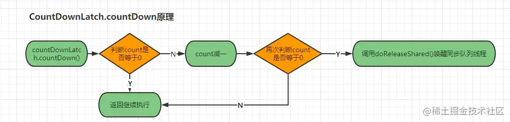

## 一、快速认识Semaphore信号量及实战

Semaphore信号量是java.util.concurrent(JUC)包下的一个并发工具类，可以用来控制同一时刻访问临界资源(共享资源)的线程数，以确保访问临界资源的线程能够正确、合理的使用公共资源。而其内部则于ReetrantLock一样，都是通过直接或间接的调用AQS框架的方法实现。在Semaphore中存在一个“许可”的概念：

> 在初始化Semaphore信号量需要为这个许可传入一个数值，该数值表示表示同一时刻可以访问临界资源的最大线程数，也被称为许可集。一条线程想要访问临界资源则需要先执行`acquire()`获取一个许可，如果线程在获取时许可集已经被分配完了，那么该线程则会进入阻塞等待状态，直至有其他持有许可的线程释放后才有可能获取到许可。当线程访问完成临界资源后则需要执行`release()`方法释放已获取的许可。

其实通过如上这段描述，我们不难发现，Semaphore信号量里面的“许可”概念与前面我们文章中，分析的互斥锁中的“同步状态标识”有着异曲同工之妙，其实也就是我们所谈的“锁资源”。下面我们可以简单看看Semaphore类中所提供的方法：

```java
java复制代码// 调用该方法后线程会从许可集中尝试获取一个许可
public void acquire()

// 线程调用该方法时会释放已获取的许可
public void release()

// Semaphore构造方法：permits→许可集数量
Semaphore(int permits) 

// Semaphore构造方法：permits→许可集数量，fair→公平与非公平
Semaphore(int permits, boolean fair) 

// 从信号量中获取许可，该方法不响应中断
void acquireUninterruptibly() 

// 返回当前信号量中未被获取的许可数
int availablePermits() 

// 获取并返回当前信号量中立即未被获取的所有许可
int drainPermits() 

// 返回等待获取许可的所有线程Collection集合
protected  Collection<Thread> getQueuedThreads();

// 返回等待获取许可的线程估计数量
int getQueueLength() 

// 查询是否有线程正在等待获取当前信号量中的许可
boolean hasQueuedThreads() 

// 返回当前信号量的公平类型，如为公平锁返回true，非公平锁为false
boolean isFair() 

// 获取当前信号量中一个许可，当没有许可可用时直接返回false不阻塞线程
boolean tryAcquire() 

// 在给定时间内获取当前信号量中一个许可，超时还未获取成功则返回false
boolean tryAcquire(long timeout, TimeUnit unit) 
```

如上便是Semaphore信号量提供的一些主要方法，下面我们可以上个简单小案例演示，需求如下：

> 现在项目中有个需求，每晚需要长时间处理大量的Excel表数据与数据库中数据对账请求，由于文件读取属于IO密集型任务，我们可以使用多线程的方式优化，加速处理速度。但是在该项目中因为还有其他业务要处理，为了保证整体性能，所以对于该业务的实现最多只能使用三个数据库连接对象。因为如果当前业务线程同一时刻获取的数据库连接数量过多，会导致其他业务线程需要操作数据库时获取不到连接对象阻塞(因为数据库连接对象与线程对象一样数据珍惜资源/资源有限)，从而引发整体程序堆积大量客户端请求导致系统整体瘫痪。这时我们就需要控制同一时刻最多只有三条线程拿到数据库连接进行操作，此时就可以使用Semaphore做流量控制。

```java
java复制代码public class SemaphoreDemo {
    public static void main(String[] args) {
        // 自定义线程池(后续文章会详细分析到)
        // 环境：四核四线程CPU 任务阻塞系数0.9
        ThreadPoolExecutor threadPool = new ThreadPoolExecutor(
                4*2, 40,
                30, TimeUnit.SECONDS,
                new LinkedBlockingQueue<Runnable>(1024*10),
                Executors.defaultThreadFactory(),
                new ThreadPoolExecutor.AbortPolicy());
        // 设置信号量同一时刻最大线程数为3
        final Semaphore semaphore = new Semaphore(3);
        // 模拟100个对账请求
        for (int index = 0; index < 100; index++) {
            final int serial = index;
            threadPool.execute(()->{
                try {
                    // 使用acquire()获取许可
                    semaphore.acquire();
                    System.out.println(Thread.currentThread().getName() +
                            "线程成功获取许可！请求序号: " + serial);
                    // 模拟数据库IO
                    Thread.sleep(1000);
                } catch (InterruptedException e) {
                    e.printStackTrace();
                }  finally {
                    // 临界资源访问结束后释放许可
                    semaphore.release();
                }
            });
        }
        // 关闭线程池资源
        threadPool.shutdown();
    }
}
```

上述代码中，在创建Semaphore信号量对象时为该对象初始化了三个许可，也就意味着在同一时刻允许三条线程同时访问临界资源。线程在访问临界资源之前，需要使用`acquire()`先成功获取一个许可，才能访问临界资源。如果一条线程获取许可，该信号量对象的许可集已经被分配完时，新来的线程需进入等待状态。之前获取许可成功的线程在操作完成之后需执行`release()`方法释放已获取的许可。我们执行如上案例则可看到执行结果几乎每隔一千毫秒会出现三条线程同时访问，如下：

```java
java复制代码/*
第一秒：程序运行初
  pool-1-thread-1线程成功获取许可！请求序号: 0
  pool-1-thread-2线程成功获取许可！请求序号: 1
  pool-1-thread-3线程成功获取许可！请求序号: 2
第二秒：程序运行1000ms后
  pool-1-thread-4线程成功获取许可！请求序号: 3
  pool-1-thread-5线程成功获取许可！请求序号: 4
  pool-1-thread-6线程成功获取许可！请求序号: 5
第三秒：程序运行2000ms后
  pool-1-thread-7线程成功获取许可！请求序号: 6
  pool-1-thread-8线程成功获取许可！请求序号: 7
  pool-1-thread-2线程成功获取许可！请求序号: 8
第四秒：程序运行3000ms后
  ........
*/
```

如上便是一个简单使用Demo，总体看来关于Semaphore信号量的用法还是比较简单的。不过我们也在前面提到过这么一句话：

> Semaphore信号量里的“许可”概念与前面我们文章中分析的互斥锁的“同步状态标识”有着异曲同工之妙。

那我们能否使用Semaphore信号量实现一把独占锁呢？答案也是肯定的，可以。我们只需要在创建信号量对象时，只给许可集分配一个数量即可，如下：

> final Semaphore semaphore = new Semaphore(1);

## 二、Semaphore信号量中AQS的共享模式实现

Semaphore信号量其实与我们上篇文章所分析的ReetrantLock类结构大致相同，其内部存在继承自AbstractQueuedSynchronizer内部Sync类以及它的两个子类：FairSync公平锁类和NofairSync非公平锁类，从这我们也可以看出，Semaphore的内部实现其实与ReetrantLock一样都是基于AQS组件实现的。在上一篇文章中我们也曾提到，AQS设计的初衷并不打算直接作为调用类对外暴露服务，而只是作为并发包基础组件，为其他并发工具类提供基础设施，如维护同步队列、控制/修改同步状态等。具体的获取锁和释放锁的逻辑则交给子类自己去实现，从而也能最大程度的保留框架的灵活性。因此无论是Semaphore还是ReetrantLock都需要独自实现`tryAcquireShared(int arg)`获取锁方法以及`tryReleaseShared(int arg)`释放锁方法。AQS总体类图关系如下：
 )
 如上图，Semaphore与ReetrantLock的结构大致相同，而实现思路也大致相同，获取锁(许可)的方法tryAcquireShared(arg)分别由两个子类FairSync和NofairSync实现，因为公平锁和非公平锁的加锁方式毕竟存在些许不同，而释放锁tryReleaseShared(arg)的逻辑则交由Sync实现，因为释放操作都是相同的，因此放在父类Sync中实现自然是最好的方式。下面我们就从Semaphore源码的角度分析AQS共享模式的具体实现原理，我们先从非公平锁的获取锁实现开始。

### 2.1、AQS共享模式之Semaphore的NofairSync非公平锁实现

我们在创建Semaphore对象时，也和ReetrantLock一样手动选择公平锁和非公平锁：

```java
java复制代码public Semaphore(int permits) {
    sync = new NonfairSync(permits);
}
public Semaphore(int permits, boolean fair) {
    sync = fair ? new FairSync(permits) : new NonfairSync(permits);
}
```

通过Semaphore的构造函数我们不难发现，如果在我们创建时不选择声明公平类型，Semaphore默认创建的是非公平锁类型，NonfairSync构造如下：

```java
java复制代码static final class NonfairSync extends Sync {
    // 构造函数：将给定的许可数permits传给父类同步状态标识state
    NonfairSync(int permits) {
          super(permits);
    }
   // 释放锁的方法实现则是直接调用父类Sync的释放锁方法
   protected int tryAcquireShared(int acquires) {
       return nonfairTryAcquireShared(acquires);
   }
}
```

从如上源码中，我们可以得知Semaphore中的非公平锁NonfairSync类的构造函数是基于调用父类Sync构造函数完成的，而在创建Semaphore对象时传入的许可数permits最终则会传递给AQS同步器的同步状态标识state，如下：

```java
java复制代码// 父类 - Sync类构造函数
Sync(int permits) {
    setState(permits); // 调用AQS内部的set方法
}

// AQS（AbstractQueuedSynchronizer）同步器
public abstract class AbstractQueuedSynchronizer
    extends AbstractOwnableSynchronizer {
    // 同步状态标识
    private volatile int state;
    
    protected final int getState() {
        return state;
    }
    protected final void setState(int newState) {
        state = newState;
    }
    // 对state变量进行CAS操作
    protected final boolean compareAndSetState(int expect, int update) {
        return unsafe.compareAndSwapInt(this, stateOffset, expect, update);
    }
}
```

从上述分析中可知，Semaphore对象创建时传入的许可数permits，实则其实最终是在对AQS内部的state进行初始化。初始化完成后，state代表着当前信号量对象的可用许可数。

#### 2.1.1、信号量中非公平锁NonfairSync获取许可/锁实现

我们在使用Semaphore时获取锁是调用`Semaphore.acquire()`方法，，调用该方法的线程会开始获取锁/许可，尝试对`permits/state`进行CAS减一，CAS成功则代表获取成功。下面我们来分析一下Semaphore获取许可的方法`acquire()`的具体实现，源码如下：

```java
java复制代码// Semaphore类 → acquire()方法
public void acquire() throws InterruptedException {
      // Sync类继承AQS，此处直接调用AQS内部的acquireSharedInterruptibly()方法
      sync.acquireSharedInterruptibly(1);
  }

// AbstractQueuedSynchronizer类 → acquireSharedInterruptibly()方法
public final void acquireSharedInterruptibly(int arg)
        throws InterruptedException {
    // 判断是否出现线程中断信号（标志）
    if (Thread.interrupted())
        throw new InterruptedException();
    // 如果tryAcquireShared(arg)执行结果不小于0，则线程获取同步状态成功
    if (tryAcquireShared(arg) < 0)
        // 未获取成功加入同步队列阻塞等待
        doAcquireSharedInterruptibly(arg);
}
```

信号量获取许可的方法acquire()最终是通过Sync对象调用AQS内部的`acquireSharedInterruptibly()`方法完成的，而`acquireSharedInterruptibly()`在获取同步状态标识的过程中是可以响应线程中断操作的，如果该操作没有没中断，则首先调用`tryAcquireShared(arg)`尝试获取一个许可数，获取成功则返回执行业务，方法结束。如果获取失败，则调用`doAcquireSharedInterruptibly(arg)`将当前线程加入同步队列阻塞等待。不过值得我们注意的是：`tryAcquireShared(arg)`方法是AQS提供的模板方法，并没有提供具体实现，而是把具体实现的逻辑交由子类完成，我们先看看信号量中非公平锁NonfairSync类的实现：

```java
java复制代码    // Semaphore类 → NofairSync内部类 → tryAcquireShared()方法
protected int tryAcquireShared(int acquires) {
    // 调用了父类Sync中的实现方法
    return nonfairTryAcquireShared(acquires);
}

// Syn类 → nonfairTryAcquireShared()方法
abstract static class Sync extends AbstractQueuedSynchronizer {
    final int nonfairTryAcquireShared(int acquires) {
         // 开启自旋死循环
         for (;;) {
             int available = getState();
             int remaining = available - acquires;
             // 判断信号量中可用许可数是否已<0或者CAS执行是否成功
             if (remaining < 0 ||
                 compareAndSetState(available, remaining))
                 return remaining;
         }
     }
}
```

`nonfairTryAcquireShared(acquires)`方法首先获取到state值后，减去一得到`remaining`值，如果不小于0则代表着当前信号量中还存在可用许可，当前线程开始尝试cas更新state值，cas成功则代表获取同步状态成功，返回`remaining`值。反之，如果`remaining`值小于0则代表着信号量中的许可数已被其他线程获取，目前不存在可用许可数，直接返回小于0的`remaining`值，`nonfairTryAcquireShared(acquires)`方法执行结束，回到AQS的`acquireSharedInterruptibly()`方法。当返回的`remaining`值小于0时，`if(tryAcquireShared(arg)<0)`条件成立，进入if执行`doAcquireSharedInterruptibly(arg)`方法将当前线程加入同步队列阻塞，等待其他线程释放同步状态。线程入列方法如下：

```java
java复制代码// AbstractQueuedSynchronizer类 → doAcquireSharedInterruptibly()方法
private void doAcquireSharedInterruptibly(int arg)
        throws InterruptedException {
    // 创建节点状态为Node.SHARED共享模式的节点并将其加入同步队列
    final Node node = addWaiter(Node.SHARED);
    boolean failed = true;
    try {
     // 开启自旋操作
     for (;;) {
         final Node p = node.predecessor();
         // 判断前驱节点是否为head
         if (p == head) {
             // 尝试获取同步状态state
             int r = tryAcquireShared(arg);
             // 如果r不小于0说明获取同步状态成功
             if (r >= 0) {
                 // 将当前线程结点设置为头节点并唤醒后继节点线程             
                 setHeadAndPropagate(node, r);
                 p.next = null; // 置空方便GC
                 failed = false;
                 return;
             }
         }
       // 调整同步队列中node节点的状态并判断是否应该被挂起 
       // 并判断是否存在中断信号，如果需要中断直接抛出异常结束执行
         if (shouldParkAfterFailedAcquire(p, node) &&
             parkAndCheckInterrupt())
             throw new InterruptedException();
     }
    } finally {
     if (failed)
         // 结束该节点线程的请求
         cancelAcquire(node);
    }
}

// AbstractQueuedSynchronizer类 → setHeadAndPropagate()方法
private void setHeadAndPropagate(Node node, int propagate) {
    Node h = head; // 获取同步队列中原本的head头节点
    setHead(node); // 将传入的node节点设置为头节点
    /*
     * propagate=剩余可用许可数，h=旧的head节点
     * h==null,(h=head)==null：
     *      非空判断的标准写法，避免原本head以及新的头节点node为空
     * 如果当前信号量对象中剩余可用许可数大于0或者
     * 原本头节点h或者新的头节点node不是结束状态则唤醒后继节点线程
     * 
     * 写两个if的原因在于避免造成不必要的唤醒，因为很有可能唤醒了后续
     * 节点的线程之后，还没有线程释放许可/锁，从而导致再次陷入阻塞
     */
    if (propagate > 0 || h == null || h.waitStatus < 0 ||
        (h = head) == null || h.waitStatus < 0) {
        Node s = node.next;
        // 避免传入的node为同步队列的唯一节点，
        // 因为队列中如果只存在node一个节点，那么后驱节点s必然为空
        if (s == null || s.isShared())
            doReleaseShared(); // 唤醒后继节点
    }
}
```

在`doAcquireSharedInterruptibly(arg)`方法中总共做了三件事：

- 一、创建一个状态为Node.SHARED共享模式的节点，并通过addWaiter()加入队列
- 二、加入成功后开启自旋，判断前驱节点是否为head，是则尝试获取同步状态标识，获取成功后，将自己设置为head节点，如果可用许可数大于0则唤醒后继节点的线程
- 三、如果前驱节点不为head的节点以及前驱节点为head节点但获取同步状态失败的节点，则调用`shouldParkAfterFailedAcquire(p,node)`判断前驱节点的状态是否为SIGNAL状态(一般`shouldParkAfterFailedAcquire(p,node)`中的for循环至少需要执行两次以上才会返回ture，第一次把前驱节点设置为SIGNAL状态，第二次检测到SIGNAL状态)，如果是则调用`parkAndCheckInterrupt()`挂起当前线程并返回线程中断状态

如上便是`doAcquireSharedInterruptibly(arg)`方法的大概工作，接下来我们可以看看`shouldParkAfterFailedAcquire()`以及`parkAndCheckInterrupt()`方法：

```java
java复制代码// AbstractQueuedSynchronizer类 → shouldParkAfterFailedAcquire()方法
private static boolean shouldParkAfterFailedAcquire(Node pred, Node node) {
    // 获取当前节点的等待状态
    int ws = pred.waitStatus;
    // 如果为等待唤醒（SIGNAL）状态则返回true
    if (ws == Node.SIGNAL)
        return true;
    // 如果当前节点等待状态大于0则说明是结束状态，
    // 遍历前驱节点直到找到没有结束状态的节点
    if (ws > 0) {
        do {
            node.prev = pred = pred.prev;
        } while (pred.waitStatus > 0);
        pred.next = node;
    } else {
        // 如果当前节点等待状态小于0又不是SIGNAL状态，
        // 则将其设置为SIGNAL状态，代表该节点的线程正在等待唤醒
        // 也就是代表节点是刚从Condition的条件等待队列转移到同步队列，
        // 节点状态为CONDITION状态（Semaphore中不存在condition的概念，
        // 所以同步队列不会出现这个状态的节点，此处代码不会执行）
        compareAndSetWaitStatus(pred, ws, Node.SIGNAL);
    }
    return false;
}

// AbstractQueuedSynchronizer类 → parkAndCheckInterrupt()方法
private final boolean parkAndCheckInterrupt() {
    // 将当前线程挂起
    LockSupport.park(this);
    // 获取线程中断状态,interrupted()是判断当前中断状态，
    // 而并不是中断线程，线程需要中断返回true，反之false
    return Thread.interrupted();
}

LockSupport → park()方法
public static void park(Object blocker) {
    Thread t = Thread.currentThread();
    // 设置当前线程的监视器blocker
    setBlocker(t, blocker);
    // 调用了native方法到JVM级别的阻塞机制阻塞当前线程
    UNSAFE.park(false, 0L);
    // 阻塞结束后把blocker置空
    setBlocker(t, null);
}
```

`shouldParkAfterFailedAcquire()`方法的作用是判断节点的前驱节点是否为等待唤醒状态(SIGNAL状态)，如果是则返回true。如果前驱节点的waitStatus大于0(只有CANCELLED结束状态=1>0)，既代表该前驱节点已没有用了，应该从同步队列移除，执行do/while循环遍历所有前前驱节点，直到寻找到非CANCELLED结束状态的节点。如果节点状态为SIGNAL等待唤醒状态则直接调用`parkAndCheckInterrupt()`挂起当前线程。至此整个`Semaphore.acquire()`获取许可的方法流程结束。如下图：
 
 如上图，在AQS同步器中存在一个变量state，Semaphore信号量对象在初始化时传递的permits许可数会间接的赋值给AQS中的state同步标识，而`permits/state`则代表着同一时刻可同时访问临界/共享资源的最大线程数。当一条线程调用`Semaphore.acquire()`获取许可时，会首先判断state是否大于0，如果大于则代表还有可用许可数，state减1，线程获取成功并返回执行。直到state为零时，代表着当前信号量已经不存在可用许可数了，后续请求的线程则需要封装成Node节点并将其加入同步队列开启自旋操作直至有线程释放许可(state加一)。

至此，AQS共享模式中非公平锁的获取锁原理分析完毕。但是我们如上分析的是可响应线程中断请求的获取许可方式，而Semaphore中也实现了一套不可中断式的获取方法，如下：

```java
java复制代码// Semaphore类 → acquireUninterruptibly()方法
public void acquireUninterruptibly() {
    sync.acquireShared(1);
}

// AbstractQueuedSynchronizer类 → acquireShared()方法
public final void acquireShared(int arg) {
    if (tryAcquireShared(arg) < 0)
        doAcquireShared(arg);
}

// AbstractQueuedSynchronizer类 → doAcquireShared()方法
private void doAcquireShared(int arg) {
    final Node node = addWaiter(Node.SHARED);
    boolean failed = true;
    try {
        boolean interrupted = false;
        for (;;) {
            final Node p = node.predecessor();
            if (p == head) {
                int r = tryAcquireShared(arg);
                if (r >= 0) {
                    setHeadAndPropagate(node, r);
                    p.next = null; // help GC
                    if (interrupted)
                        selfInterrupt();
                    failed = false;
                    return;
                }
            }
            if (shouldParkAfterFailedAcquire(p, node) &&
                parkAndCheckInterrupt())
                // 在前面的可中断式获取锁方法中此处是直接抛出异常强制中断线程的
                // 而在不可中断式的获取方法中，这里是没有抛出异常中断线程的
                interrupted = true;
        }
    } finally {
        if (failed)
            cancelAcquire(node);
    }
}
```

观察如上源码不难发现，可响应线程中断的方法与不可响应线程中断的方法区别在于：

> 可响应线程中断的方法在每次操作之前会先检测线程中断信号，如果线程需要中断操作，则直接抛出异常强制中断线程的执行。反之，不可响应线程中断的方法不会检测线程中断信号，而且不会抛出异常强制中断。

#### 2.1.2、信号量中非公平锁NonfairSync释放许可/锁实现

使用Semaphore时释放锁则调用的是`Semaphore.release()`方法，调用该方法之后线程持有的许可会被释放，同时`permits/state`加一，接下来Semaphore获取许可的方法`release()`的具体实现，源码如下：

```java
java复制代码// Semaphore类 → release()方法
public void release() {
    sync.releaseShared(1);
}

// AbstractQueuedSynchronizer类 → releaseShared(arg)方法
public final boolean releaseShared(int arg) {
    // 调用子类Semaphore中tryReleaseShared()方法实现
    if (tryReleaseShared(arg)) {
        doReleaseShared();
        return true;
    }
    return false;
}
```

与之前获取许可的方法一样，Semaphore释放许可的方法`release()`也是通过间接调用AQS内部的`releaseShared(arg)`完成。因为AQS的`releaseShared(arg)`是魔法方法，所以最终的逻辑实现由Semaphore的子类Sync完成，如下：

```java
java复制代码// Semaphore类 → Sync子类 → tryReleaseShared()方法
protected final boolean tryReleaseShared(int releases) {
    for (;;) {
        // 获取AQS中当前同步状态state值
        int current = getState();
        // 对当前的state值进行增加操作
        int next = current + releases;
        // 不可能出现，除非传入的releases为负数
        if (next < current) 
            throw new Error("Maximum permit count exceeded");
        // CAS更新state值为增加之后的next值
        if (compareAndSetState(current, next))
            return true;
    }
}
```

释放锁/许可的方法逻辑相对来说比较简单，对AQS中的state加一释放获取的同步状态。不过值得注意的是：在我们上篇文章分享的AQS独占模式实现中，释放锁的逻辑中是没有保证线程安全的，因为独占模式的释放锁逻辑永远只会存在一条线程同时操作。而在共享模式中，可能会存在多条线程同时释放许可/锁资源，所以在此处使用了CAS+自旋的方式保证线程安全问题。

如果此处`tryReleaseShared(releases)`CAS更新成功，那么则会进入`if(tryReleaseShared(arg))`中执行`doReleaseShared();`唤醒后继节点线程。

```java
java复制代码// AbstractQueuedSynchronizer类 → doReleaseShared()方法
private void doReleaseShared() {
    /*
     * 为了防止释放过程中有其他线程进入队列，这里必须开启自旋
     * 如果头节点设置失败则重新检测继续循环
     */
    for (;;) {
        // 获取队列head头节点
        Node h = head; 
        // 如果头节点不为空并且队列中还存在其他节点
        if (h != null && h != tail) { 
            // 获取头节点的节点状态
            int ws = h.waitStatus; 
            // 如果节点状态为SIGNAL等待唤醒状态则代表
            if (ws == Node.SIGNAL) { 
                // 尝试cas修改节点状态值为0
                // 失败则继续下次循环
                // 成功则唤醒头节点的后继节点
                if (!compareAndSetWaitStatus(h, Node.SIGNAL, 0))
                    continue;         
                unparkSuccessor(h);  // 唤醒后继节点线程
            }
            // 节点状态为0时尝试将节点状态修改为PROPAGATE传播状态
            // 失败则跳出循环继续下次循环
            else if (ws == 0 &&
                     !compareAndSetWaitStatus(h, 0, Node.PROPAGATE))
                continue;               
        }
        // 如果当前队列头节点发生变化继续循环，反之则终止自旋
        if (h == head)
            break;
    }
}
// AbstractQueuedSynchronizer类 → unparkSuccessor()方法
// 参数：传入需要唤醒后继节点的节点
private void unparkSuccessor(Node node) {
    // 获取node节点的线程状态
    int ws = node.waitStatus;
    if (ws < 0)
        // 设置head节点为0
        compareAndSetWaitStatus(node, ws, 0);
    // 获取后继节点
    Node s = node.next;
    // 如果后继节点为空或线程状态已经结束
    if (s == null || s.waitStatus > 0) {
        s = null;
        // 遍历整个队列拿到可唤醒的节点
        for (Node t = tail; t != null && t != node; t = t.prev)
            if (t.waitStatus <= 0)
                s = t;
    }
    if (s != null)
        // 唤醒后继节点线程
        LockSupport.unpark(s.thread);
}
```

在`doReleaseShared()`方法直接在执行中获取head节点，通过调用`unparkSuccessor()`方法唤醒head后继节点中的线程。而因为该方法体的逻辑是一个`for(;;){}`死循环，退出的条件为：只当队头不发生改变时才退出，如果发生改变了则代表着一定有其他线程在当前线程释放锁/许可的过程中获取到了锁，所以当前循环会继续，在第二次循环过程中，在满足条件`h.waitStauts==0`的情况下，这里会把head节点的waitStauts设置为`Node.PROPAGATE`传播状态是为了保证唤醒传递。因为AQS共享模式下是会出现多个线程同时对同步状态标识state进行操作，如线程T1在执行`release()→doReleaseShared()`释放许可操作，刚唤醒后继线程准备替换为head头节点(准备替换但是还没替换)，此时另外一条线程T2正好在同一时刻执行`acquire()→doAcquireShared()→setHeadAndPropagate()`获取锁操作，假设T2线程获取的是最后一个可用许可，在执行到`setHeadAndPropagate()`方法（这个方法中存在一个超长判断），传入的`propagate=0`：

```java
java复制代码// AbstractQueuedSynchronizer类 → setHeadAndPropagate()方法
private void setHeadAndPropagate(Node node, int propagate) {
    Node h = head; // 获取同步队列中原本的head头节点
    setHead(node); // 将传入的node节点设置为头节点
    /*
     * propagate=剩余可用许可数，h=旧的head节点
     * h==null,(h=head)==null：
     *      非空判断的标准写法，避免原本head以及新的头节点node为空
     * 如果当前信号量对象中剩余可用许可数大于0或者
     * 原本头节点h或者新的头节点node不是结束状态则唤醒后继节点线程
     * 
     * 写两个if的原因在于避免造成不必要的唤醒，因为很有可能唤醒了后续
     * 节点的线程之后，还没有线程释放许可/锁，从而导致再次陷入阻塞
     */
    if (propagate > 0 || h == null || h.waitStatus < 0 ||
        (h = head) == null || h.waitStatus < 0) {
        Node s = node.next;
        // 避免传入的node为同步队列的唯一节点，
        // 因为队列中如果只存在node一个节点，那么后驱节点s必然为空
        if (s == null || s.isShared())
            doReleaseShared(); // 唤醒后继节点
    }
}

// 超长判断：该判断的作用在于面对各种特殊情况能够时保证及时获取锁
if (propagate > 0 || h == null || h.waitStatus < 0 ||
    (h = head) == null || h.waitStatus < 0) {
    Node s = node.next;
    // 避免传入的node为同步队列的唯一节点，
    // 因为队列中如果只存在node一个节点，那么后驱节点s必然为空
    if (s == null || s.isShared())
        doReleaseShared(); // 唤醒后继节点
}
```

根据这个超长判断的逻辑，因为传入的`propagate=0`代表着当前已经没有可用许可数了，不满足超长判断中的第一个条件`propagate>0`，所以T2线程获取锁之后理论上是不需要再唤醒其他线程获取锁/许可，但是因为T1线程已经访问完成临界资源了正在释放持有的许可，那么就会造成一种情况：队列中head节点的后继节点如果此时尝试获取锁/许可，那么有很大几率获取到T1线程释放的许可。所以在释放锁时，将head节点的waitStauts设置为`Node.PROPAGATE`传播状态值为-3，满足这个超长判断中的第三个条件`h.waitStatus < 0`，所以此时T2也会唤醒head后继节点中等待获取锁/许可资源的线程。这样去实现的好处在于：能够充分照顾到head的后继节点同时也能保证唤醒的传递。

> 至于这里为什么获取到锁/许可的线程需要继续唤醒后继节点线程？因为这里是共享锁，而不是独占锁。一个线程刚获得了共享锁/许可，那么很有可能还有剩余的共享锁可供排队在后面的线程获得，所以需要唤醒后面的线程。

至此，释放许可逻辑结束，对比获取许可的逻辑相对来说要简单许多，只需要更新state值后调用doReleaseShared()方法唤醒后继节点线程即可。但是在理解doReleaseShared()方法时需要额外注意：调用doReleaseShared()方法的线程会存在两种：

- 一是释放共享锁/许可数的线程。调用release()方法释放许可时必然调用它唤醒后继线程
- 二是刚获取到共享锁/许可数的线程。一定情况下，在满足“超长判断”的任意条件时也会调用它唤醒后继线程

### 2.2、AQS共享模式之Semaphore的FairSync公平锁实现

AQS共享模式中的公平锁实现除开在获取锁的逻辑上与非公平锁的有些许不同外，其他的实现大致相同。

#### 2.2.1、信号量中公平锁FairSync获取许可/锁实现

公平锁的概念是指先请求锁的线程一定比后请求锁的线程要先执行，先获取到锁资源，从时间上需要保证执行的先后顺序。

> 公平锁获取许可执行逻辑：Semaphore.acquire()获取许可方法 → AQS.acquireSharedInterruptibly()方法 → AQS.tryAcquireShared()获取共享锁模板方法 → FairSync.tryAcquireShared()方法

```java
java复制代码// Semaphore类 → 构造方法
public Semaphore(int permits, boolean fair) {
    sync = fair ? new FairSync(permits) : new NonfairSync(permits);
}
// Semaphore类 → acquire()获取锁方法
public void acquire() throws InterruptedException {
    sync.acquireSharedInterruptibly(1);
}

// AbstractQueuedSynchronizer类 → acquireSharedInterruptibly()方法
public final void acquireSharedInterruptibly(int arg)
            throws InterruptedException {
    if (Thread.interrupted())
        throw new InterruptedException();
    // 调用AQS定义的获取共享锁的模板方法
    if (tryAcquireShared(arg) < 0)
        doAcquireSharedInterruptibly(arg);
}
// AbstractQueuedSynchronizer类 → tryAcquireShared()模板方法
protected int tryAcquireShared(int arg) {
    throw new UnsupportedOperationException();
}

// Semaphore类 → FairSync公平锁类
static final class FairSync extends Sync {
    FairSync(int permits) {
        super(permits);
    }
    
    // Semaphore类 → FairSync内部类 → tryAcquireShared()子类实现
    protected int tryAcquireShared(int acquires) {
        for (;;) {
            // 不同点：先判断队列中是否存在节点后再执行获取锁操作
            if (hasQueuedPredecessors())
                return -1;
            int available = getState();
            int remaining = available - acquires;
            if (remaining < 0 ||
                compareAndSetState(available, remaining))
                return remaining;
        }
    }
}
```

从获取锁/许可的代码中可以非常明显的看出，公平锁的实现相对来说，与非公平锁的唯一不同点在于：公平锁的模式下获取锁，会先调用`hasQueuedPredecessors()`方法判断同步队列中是否存在节点，如果存在则直接返回-1回到`acquireSharedInterruptibly()`方法`if(tryAcquireShared(arg)<0)`判断，调用`doAcquireSharedInterruptibly(arg)`方法将当前线程封装成`Node.SHARED`共享节点加入同步队列等待。反之，如果队列中不存在节点则尝试直接获取锁/许可。

#### 2.2.2、信号量中公平锁FairSync释放许可/锁实现

公平锁释放许可的逻辑与非公平锁的实现是一致的，因为都是Sync类的子类，而释放锁的逻辑都是对state减一更新后，唤醒后继节点的线程。所以关于释放锁的具体实现则是交由Sync类实现，这里不再重复赘述。

## 三、ReetrantLock与Semaphore的区别

| 对比项       | ReetrantLock      | Semaphore          |
| ------------ | ----------------- | ------------------ |
| 实现模式     | 独占模式          | 共享模式           |
| 获取锁方法   | tryAcquire()      | tryAcquireShared() |
| 释放锁方法   | tryRelease()      | tryReleaseShared() |
| 是否支持重入 | 支持              | 不支持             |
| 线程中断     | 支持              | 支持               |
| Condition    | 支持              | 不支持             |
| 队列数量     | 一个同步+多个等待 | 单个同步           |
| 节点类型     | Node.EXCLUSIVE    | Node.SHARED        |

## 四、共享模式的其他实现者

除开Semaphore信号量的实现是基于AQS的共享模式之外，在JUC并发包中CountDownLatch、ReetrantReadWriteLock读写锁的Read读锁等都是基于AQS的共享模式实现的，下面我们也可以简单的看看关于CountDownLatch的用法。

### 4.1、CountDownLatch应用场景实战

在CountDownLatch初始化时和Semaphore一样，我们需要传入一个数字count作为最大线程数

> CountDownLatch countDownLatch = new CountDownLatch(3);

这个参数同样会间接的赋值给AQS内部的state同步状态标识。一般我们会调用它的两个方法：`await()与countDown()`：

- await()：调用await()方法的线程会被封装成共享节点加入同步队列阻塞等待，直至state=0时才会唤醒同步队列中所有的线程
- countDown()：调用countDown()方法的线程会对state减一

而关于CountDownLatch有两种用法：

- 一、多等一：初始化count=1，多条线程await()阻塞，一条线程调用countDown()唤醒所有阻塞线程
- 二、一等多：初始化count=x，多线程countDown()对count进行减一，一条线程await()阻塞，当count=0时阻塞的线程开始执行

如上两种用法在我们的项目中也可以有很多的应用场景，多等一的用法我们可以用来在一定程度上模拟并发测试接口并发安全问题、死锁问题等，如：

```java
java复制代码final CountDownLatch countDownLatch = new CountDownLatch(1);
for (int i = 1; i <= 3; i++) {
    new Thread(() -> {
        try {
            System.out.println("线程：" + Thread.currentThread().getName()
            + "....阻塞等待！");
            countDownLatch.await();
            // 可以在此处调用需要并发测试的方法或接口
            System.out.println("线程：" + Thread.currentThread().getName()
            + "....开始执行！");
        } catch (InterruptedException e) {
            e.printStackTrace();
        }
    }, "T" + i).start();
}
Thread.sleep(1000);
countDownLatch.countDown();

/*
   程序开始运行：
    线程：T2....阻塞等待！
    线程：T1....阻塞等待！
    线程：T3....阻塞等待！
   程序运行一秒后（三条线程几乎同时执行）：
    线程：T2....开始执行！
    线程：T1....开始执行！
    线程：T3....开始执行！
*/
```

如上案例中，创建了一个CountDownLatch对象，初始化时传递count=1，循环创建三条线程`T1,T2,T3`阻塞等待，主线程在一秒后调用countDown()唤醒了同步队列中的三条线程继续执行，原理如下：
 

我们在实际开发过程中，往往很多并发任务都存在前后依赖关系，如详情页需要调用多个接口完成数据聚合、并行执行获取到数据后需要进行结果合并、多个操作完成后需要进行数据检查等等，而这些场景下我们可以使用一等多的用法：

```java
java复制代码final CountDownLatch countDownLatch = new CountDownLatch(3);
Map data = new HashMap();
for (int i = 1; i <= 3; i++) {
    final int page = i;
    new Thread(() -> {
        System.out.println("线程：" + Thread.currentThread().getName() +
                "....读取分段数据："+(page-1)*200+"-"+page*200+"行");
        // 数据加入结果集：data.put();
        countDownLatch.countDown();
    }, "T" + i).start();
}
countDownLatch.await();
System.out.println("线程：" + Thread.currentThread().getName() 
        + "....对数据集：data进行处理");
        
/*
运行结果：
    线程：T1....读取分段数据：0-200行
    线程：T2....读取分段数据：200-400行
    线程：T3....读取分段数据：400-600行

    线程main....对数据集：data进行处理
*/
```

如上一等多的案例中，for循环开启三个线程`T1,T2,T3`并行执行同时读取数据增快处理效率，读取完成之后将数据加入data结果集中汇总，主线程等待三条线程读取完成后对数据集data进行处理，如下：
 

### 4.2、CountDownLatch实现原理

前面我们曾提到过，CountDownLatch也是基于AQS共享模式实现的，与Semaphore一样，会将传入的count间接的赋值给AQS内部的state同步状态标识。

```java
java复制代码private final Sync sync;

// CountDownLatch构造方法
public CountDownLatch(int count) {
    if (count < 0) throw new IllegalArgumentException("count < 0");
    // 对其内部Sync对象进行初始化
    this.sync = new Sync(count);
}

// CountDownLatch类 → Sync内部类
private static final class Sync extends AbstractQueuedSynchronizer {
    // Sync构造函数：对AQS内部的state进行赋值
    Sync(int count) {setState(count);}
    
    // 调用await()方法最终会调用到这里
    protected int tryAcquireShared(int acquires) {
        return (getState() == 0) ? 1 : -1;
    }
}

// CountDownLatch类 → await()方法
public void await() throws InterruptedException {
    sync.acquireSharedInterruptibly(1);
}
```

在CountDownLatch中，存在一个Sync内部类，当我们创建一个CountDownLatch对象时，实则其内部的构造函数是在对其sync对象进行初始化，与我们前面所说的一样

> CountDownLatch countDownLatch = new CountDownLatch(count);

初始化时传递的count数字最终会通过调用`setState(state)`方法赋值给AQS内部的同步状态标识state变量，而当线程调用`await()`方法时，会调用AQS的`acquireSharedInterruptibly()`方法：

```java
java复制代码// AbstractQueuedSynchronizer类 → acquireSharedInterruptibly()方法
public final void acquireSharedInterruptibly(int arg)
            throws InterruptedException {
    if (Thread.interrupted())
        throw new InterruptedException();
    // 最终调用到CountDownLatch内部Sync类的tryAcquireShared()方法
    if (tryAcquireShared(arg) < 0)
        doAcquireSharedInterruptibly(arg);
}

// CountDownLatch类 → Sync内部类 → tryAcquireShared()方法
protected int tryAcquireShared(int acquires) {
    return (getState() == 0) ? 1 : -1;
}
```

因为AQS中`tryAcquireShared(arg)`方法仅是模板方法的原因，所以线程在执行`acquireSharedInterruptibly()`方法时最终会调用到CountDownLatch内部Sync类的`tryAcquireShared()`方法。当count/state为0时返回true，反之，count不为0时返回false，最终回到`if(tryAcquireShared(arg)<0)`执行时，如果count不为0则执行`doAcquireSharedInterruptibly(arg)`方法将当前线程信息封装成`Node.SHARED`共享节点加入同步队列阻塞等待。原理如下：
 
 如上便是`CountDownLatch.await()`的实现原理，大体来说还是比较简单。下面我们接着分析一下`CountDownLatch.countDown()`方法的实现。

```java
java复制代码// CountDownLatch类 → countDown()方法
public void countDown() {
    sync.releaseShared(1);
}

// AbstractQueuedSynchronizer类 → releaseShared()方法
public final boolean releaseShared(int arg) {
    if (tryReleaseShared(arg)) {
        doReleaseShared();
        return true;
    }
    return false;
}

// AbstractQueuedSynchronizer类 → 模板方法：tryReleaseShared()
protected boolean tryReleaseShared(int arg) {
    throw new UnsupportedOperationException();
}

// CountDownLatch类 → Sync内部类 → tryReleaseShared()方法
// 调用countDown()方法最终会调用到这里
protected boolean tryReleaseShared(int releases) {
    // Decrement count; signal when transition to zero
    for (;;) {
        int c = getState();
        if (c == 0)
            return false;
        int nextc = c-1;
        if (compareAndSetState(c, nextc))
            return nextc == 0;
    }
}
```

调用`CountDownLatch.countDown()`方法后会调用AQS的`tryReleaseShared()`模板方法，最终调用`CountDownLatch`中`Sync内部类`的`tryReleaseShared()`方法。在该方法中首先会先对于`state/count`进行一次为0判断，如果不为0则对count/state减一，然后再次对更新之后的`state/count`进行为0判断，如果减一后state等于0返回true，回到`releaseShared()`的`if(tryReleaseShared(arg))`执行`doReleaseShared()`唤醒同步队列中的阻塞线程。反之，如果减一后不为0，当前线程则直接返回，方法结束。如下：
 

### 4.3、CountDownLatch与CyclicBarrier的区别

在JUC包中还存在另一个和CountDownLatch作用相同的工具类：CyclicBarrier。与CountDownLatch不同的是：CyclicBarrier是基于AQS的独占模式实现的，其内部通过ReetrantLock与Condition实现线程阻塞与唤醒。对比如下：

| 对比项   | CountDownLatch | CyclicBarrier |
| -------- | -------------- | ------------- |
| 实现模式 | 共享模式       | 独占模式      |
| 计数方式 | 减法           | 减法          |
| 复用支持 | 不可复用       | 计数可置0     |
| 重置支持 | 不可重置       | 可重置        |
| 设计重点 | 一等多         | 多等多        |

## 五、总结

通过Semaphore与CountDownLatch原理进行分析后，不难得知，在初始化时传递的许可数/计数器最终都会间接的传递给AQS的同步状态标识state。当一条线程尝试获取共享锁时，会对state减一，当state为0时代表没有可用共享锁了，其他后续请求的线程会被封装成共享节点加入同步队列等待，直至其他持有共享锁的线程释放(state加一)。不过与独占模式不同的是：共享模式中，除开释放锁时会唤醒后继节点的线程外，获取共享锁成功的线程也会在满足一定条件下唤醒后继节点。至于共享模式中的公平锁与非公平锁则与之前的独占模式的公平锁与非公平锁相同，公平锁情况下，先判断队列是否存在Node再获取锁，从而保证每条线程获取共享锁时都是先到先得的顺序执行的。而非公平锁情况下，通过线程竞争的方式获取，不管队列中是否已经存在Node节点，请求的线程都会先执行一遍获取锁的逻辑，只要执行成功就能获取到共享锁，获得线程执行权。