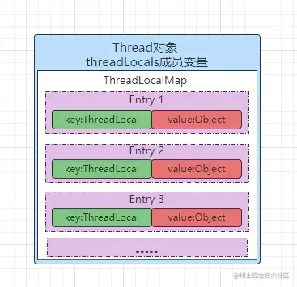
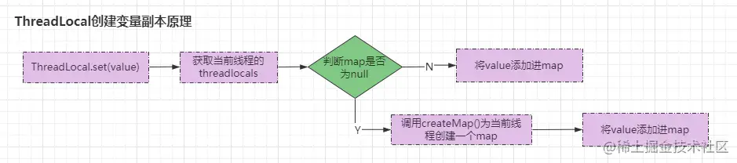
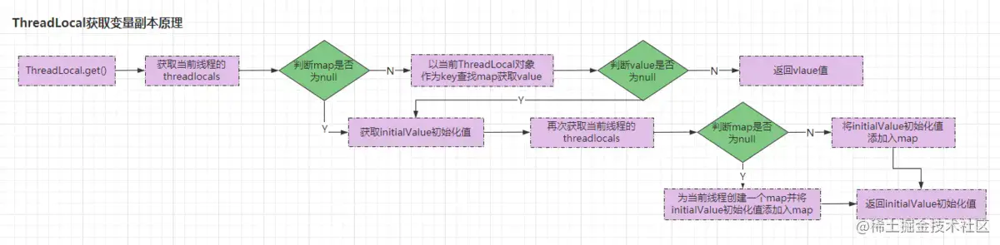
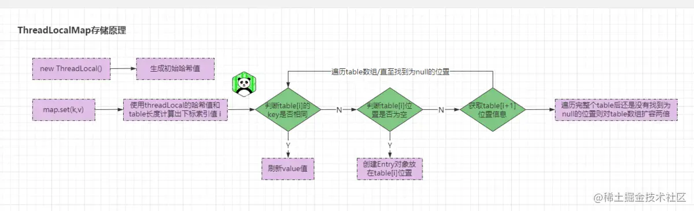

## 一、ThreadLocal概念及使用浅析

ThreadLocal线程本地副本，在很多地方也被称为线程本地变量、线程局部存储等叫法，但总归来说都是形容ThreadLocal这一个东西。在执行时，ThreadLocal会为变量在每一条线程创建一个副本，这个副本只有每条线程自己可以访问。下面我们可以先看看ThreadLocal类以及它提供的一些方法：

```java
java复制代码// 省略方法体(后面源码再详细分析)
public class ThreadLocal<T> {
    // 构造函数
    public ThreadLocal() {}
    
    // 初始化方法：在创建ThreadLocal对象时可以使用该方法进行初始化设值
    protected T initialValue()
    
    // 获取ThreadLocal在当前线程中保存的变量副本
    public T get() 
    
    // 设置当前线程中变量的副本
    public void set(T value)
    
    // 移除当前线程中变量的副本
    public void remove()
    
    // 内部子类：扩展了ThreadLocal的初始化值的方法，支持Lambda表达式赋值
    static final class SuppliedThreadLocal<T> extends ThreadLocal<T>
    
    // 内部类：定制的hashMap，仅用于维护当前线程的本地变量值。
    // 仅ThreadLocal类对其有操作权限，是Thread的私有属性。
    // 为避免占用空间较大或生命周期较长的数据常驻于内存引发一系列问题，
    // hashtable的key是弱引用WeakReferences。
    // 当堆空间不足时，会清理未被引用的entry。
    static class ThreadLocalMap
    
    // 省略其他代码.......
}
```

如上便是ThreadLocal提供的一些主要方法，在创建ThreadLocal对象时可以`initialValue()`对变量副本进行初始化，也可以使用`set()`方法更改值或者设置线程变量副本，使用`get()`方法获取变量副本，而`remove()`则可以移除当前线程中变量的副本。我们先来看一个例子：

```java
java复制代码public class DBUtils {
    private static Connection connection = null;

    public static Connection getConnection() throws SQLException {
        if (connection == null)
            connection = DriverManager.getConnection(
                    "jdbc:mysql:127.0.0.1:3306/test?user=root＆password=root");
        return connection;
    }

    public static void closeConnection() throws SQLException {
        if (connection != null)
            connection.close();
    }
}
```

假设有上面这么一个数据库连接工具类`DBUtils`，如上代码在单线程的环境下运行是没有问题的，但是如果把这个工具类丢在多线程的情况下则会出现问题。很显然，在获取连接`getConnection()`方法中，同一时刻如果有多条线程同时执行`if (connection == null)`判断则很有可能会导致创建多个连接对象。而因为`connection`是共享资源，所以在操作时也应该保证线程安全问题，不然在多线程情况下可能会造成：一条线程还在执行SQL，另外一条线程则调用`closeConnection()`方法关闭了连接对象。

> 所以如上这个例子我们该怎么解决遇到的问题？简单~

```java
java复制代码public class DBUtils {
    private static volatile Connection connection = null;

    public synchronized static Connection getConnection() throws SQLException {
        if (connection == null)
            connection = DriverManager.getConnection(
                    "jdbc:mysql:127.0.0.1:3306/test?user=root＆password=root");
        return connection;
    }

    public synchronized static void closeConnection() throws SQLException {
        if (connection != null)
            connection.close();
    }
}
```

我们在共享变量`connection`加上`volatile`关键字修饰以及在操作临界资源的方法上添加`synchronized`关键字修饰，这样就能保证线程安全。或者我们也可以这样：

```java
java复制代码public class DBUtils {
    private static volatile Connection connection = null;
    private static ReentrantLock lock = new ReentrantLock();

    public static Connection getConnection() throws SQLException {
        lock.lock(); //获取锁
        if (connection == null)
            connection = DriverManager.getConnection(
                    "jdbc:mysql:127.0.0.1:3306/test?user=root＆password=root");
        lock.unlock(); // 释放锁
        return connection;
    }

    public static void closeConnection() throws SQLException {
        lock.lock(); //获取锁
        if (connection != null)
            connection.close();
        lock.unlock(); // 释放锁
    }
}
```

但是上面的两种方式确实可以保证线程安全，但是带来的弊端也很明显：

> 当一条线程在执行SQL时，其他线程只能等待当前线程先处理完成之后才可以获取连接，这样会大大的影响程序的效率。

我们可以思考一下，此处到底是否需要将`connection`对象变成共享资源？结果显而易见，其实是不需要的，因为每条线程可以持有一个`connection`对象进行DB操作，每条线程之间对`connection`对象的操作是不存在任何依赖关系的。那我们能不能这样？

```java
java复制代码public class DBUtils {
    public static Connection getConnection() throws SQLException {
        return DriverManager.getConnection(
                    "jdbc:mysql:127.0.0.1:3306/test?user=root＆password=root");;
    }

    public static void closeConnection(Connection connection) throws SQLException {
        if (connection != null)
            connection.close();
    }
}
```

理论上是可行的，因为由于每次线程操作DB时创建的都是不同的连接对象，自然也就不存在线程安全问题。但是由于线程每次访问DB都需要创建一个新的连接对象，用完之后再次关闭，在执行过程中会频繁的获取/关闭数据库连接，这样不但影响系统整体效率，还会导致给DB服务器造成巨大的压力，严重的情况下甚至会直接导致系统崩溃。

> 那么在这种情况下时，我们就可以使用ThreadLocal来解决此类问题，如下：

```java
java复制代码public class DBUtils {
    private static ThreadLocal<Connection> connectionHolder =
    new ThreadLocal<Connection>(){
        @SneakyThrows
        public Connection initialValue(){
            return DriverManager.getConnection(
                    "jdbc:mysql:127.0.0.1:3306/test?user=root＆password=root");
        }
    };

    public static Connection getConnection() throws SQLException {
        return connectionHolder.get();
    }
}
```

在如上例子中，我们可以使用ThreadLocal为每个线程创建一个`Connection`变量副本，从而达到我们最开始所说的：ThreadLocal通过破坏共享资源条件解决线程安全问题，每条执行的线程操作的都是自己本地的副本变量，自然也就不构成“三要素”。

### ThreadLocal使用场景

- ①上下文(context)传递。一个对象需要在多个方法中层次传递使用，比如用户身份、任务信息、调用链ID、关联ID(如日志的uniqueID，方便串起多个日志)等，如果此时使用责任链模式给每个方法添加一个context参数会比较麻烦，而此时就可以使用ThreadLocal设置参数，需要使用时get一下即可。
- ②线程间的数据隔离。如spring事务管理机制实现则使用到ThreadLocal来保证单个线程中的数据库操作使用的是同一个数据库连接。同时，采用这种方式可以使业务层使用事务时不需要感知并管理Connection连接对象，通过传播级别，能够巧妙地管理多个事务配置之间的切换，挂起和恢复。
- ③ThreadLocal一般情况下，我们在项目开发过程中很少使用，而它更多应用则是在框架源码中应用，如Spring框架的事务隔离机制中的`TransactionSynchronizationManager`类，也包括Netty框架中的二次封装类`FastThreadLocal`等。
- ④上个ThreadLocal的应用案例：

```java
java复制代码// 日期工具类
private static ThreadLocal<DateFormat> threadLocal = 
        ThreadLocal.withInitial(()-> 
            new SimpleDateFormat("yyyy-MM-dd HH:mm:ss"));

public static Date parse(String dateStr) {
    Date date = null;
    try {
        date = threadLocal.get().parse(dateStr);
    } catch (ParseException e) {
        e.printStackTrace();
    }
    return date;
}
```

## 二、ThreadLocal原理分析

在前面我们对ThreadLocal进行了简单的讲解，而ThreadLocal作为一个存储类型的类，重点就是读写`get()`与`set()`。现在我们则可以深入源码去一探ThreadLocal的神秘面纱。

### 2.1、ThreadLocal创建变量副本原理分析

先从`ThreadLocal.set()`方法开始：

```java
java复制代码// ThreadLocal类 → set()方法
public void set(T value) {
    // 获取当前执行线程
    Thread t = Thread.currentThread();
    // 获取当前线程的threadlocals成员变量
    ThreadLocalMap map = getMap(t);
    // 如果map不为空，则将value添加进map
    if (map != null)
        map.set(this, value);
    // 如果map为空则先为当前线程创建一个map再将value加入map
    else
        createMap(t, value);
}
```

`ThreadLocal.set()`方法中总归来说分为三步：

- 调用`getMap()`获取当前线程的ThreadLocalMap
- 如果map不为空则将传入的`value`值添加进map
- 如果map为空则先为当前线程创建一个map再将`value`加入map

首先来看看`getMap(Thread)`方法：

```java
java复制代码// ThreadLocal类 → getMap()方法
ThreadLocalMap getMap(Thread t) {
    return t.threadLocals;
}
```

是不是有些意外？在`getMap(Thread)`方法中是调用当前线程对象的成员变量`threadLocals`并返回的：

> Thread类：ThreadLocal.ThreadLocalMap threadLocals = null;

可以看到，`Thread`类的成员变量`threadLocals`实则就是`ThreadLocalMap`，而`ThreadLocalMap`则是一个给`ThreadLocal`定制版的`HashMap`，也是`ThreadLocal`的内部类，如下：

```java
java复制代码// ThreadLocal类
public class ThreadLocal<T> {
    // ThreadLocal内部类：ThreadLocalMap
    static class ThreadLocalMap {
        // ThreadLocalMap内部类：Entry
        static class Entry extends WeakReference<ThreadLocal<?>> {
            Object value;
            Entry(ThreadLocal<?> k, Object v) {
                super(k);
                value = v;
            }
        }
    }
}
```

在`ThreadLocalMap`类中还存在一个内部类`Entry`，继承自`WeakReference`弱引用类型，结构如下：
 
 再来看看`createMap()`方法：

```java
java复制代码// ThreadLocal类 → createMap()方法
void createMap(Thread t, T firstValue) {
    t.threadLocals = new ThreadLocalMap(this, firstValue);
}
```

至此，我们应该已经明白了ThreadLocal是如何为每个线程创建变量副本的：

> 在每条线程Thread内部有一个ThreadLocal.ThreadLocalMap类型的成员变量threadLocals，这个threadLocals就是每条线程用来存储变量副本的，key值为当前ThreadLocal对象，value为变量副本（即T类型的变量）。每个Thread线程对象最开始的threadLocals都为空，当线程调用ThreadLocal.set()或ThreadLocal.get()方法时(get方法待会而会分析到)，都会调用createMap()方法对threadLocals进行初始化。然后在当前线程里面，如果要使用副本变量，就可以通过get方法在threadLocals里面查找。

原理如下： 

### 2.2、ThreadLocal获取变量副本原理分析

在上述过程中，我们已经分析了`ThreadLocal`创建变量副本原理，接下来我们再看看`ThreadLocal.get()`方法：

```java
java复制代码// ThreadLocal类 → get()方法
public T get() {
    // 获取当前执行线程
    Thread t = Thread.currentThread();
    // 获取当前线程的ThreadLocalMap
    ThreadLocalMap map = getMap(t);
    if (map != null) {
        // 如果map不为空，将当前ThreadLocal对象作为key获取对应值
        ThreadLocalMap.Entry e = map.getEntry(this);
        // 如果获取的值不为空则返回获取到的value
        if (e != null) {
            @SuppressWarnings("unchecked")
            T result = (T)e.value;
            return result;
        }
    }
    // 如果map为空则调用setInitialValue方法
    return setInitialValue();
}
```

在`ThreadLocal.get()`方法中，总归来说分为三步：

- 获取到当前执行线程，通过`getMap(Thread)`方法获取`ThreadLocalMap`类型的map
- 将当前`ThreadLocal`对象this作为key尝试获取map中的`<key,value>`键值对，获取成功返回value
- 如果第一步获取的map为空则调用`setInitialValue()`方法返回value

调用`get()`方法之后首先会获取当前线程的`threadLocals`成员变量(即`ThreadLocalMap`)，如map不为空则以为`this`作为key获取`ThreadLocal`中存储的变量副本，如果为空则调用`setInitialValue()`方法：

```java
java复制代码// ThreadLocal类 → setInitialValue()方法
private T setInitialValue() {
    // 获取ThreadLocal初始化值
    T value = initialValue();
    Thread t = Thread.currentThread();
    // 获取当前线程的map
    ThreadLocalMap map = getMap(t);
    // 如果map不为空则将初始化值添加进map容器
    if (map != null)
        map.set(this, value);
    // 如果map为空则创建一个ThreadLocalMap容器
    else
        createMap(t, value);
    return value;
}

// ThreadLocal类 → initialValue()()方法
protected T initialValue() {
    return null;
}
```

`setInitialValue()`与前面分析的`ThreadLocal.set(value)`方法有些类似，在`setInitialValue()`方法中首先会调用`initialValue()`方法获取初始化值，而`initialValue()`方法默认是返回空的，但是`initialValue()`方法可以在创建`ThreadLocal`对象时进行重写，如下：

```java
java复制代码private static ThreadLocal<Object> threadlocal =
new ThreadLocal<Object>(){
    @SneakyThrows
    public Object initialValue(){
        return new Object();
    }
};
```

获取到初始化的值之后，再次获取当前线程的`threadLocals`，如果不为空则以this为key，初始值为value添加进map。如果当前线程的`threadLocals`为空，则先调用`createMap(t, value);`为当前线程创建一个`ThreadLocalMap`并将this和初始值以k-v形式加入map中，然后并将value返回，如果没有创建`ThreadLocal`对象时吗没有初始化值则返回null，至此整个`ThreadLocal.get()`方法结束。如下：
 

## 三、InheritableThreadLocal详解

通过上述的分析，不难得知ThreadLocal设计的目的就是为每条线程都开辟一块自己的局部变量存储区域(并不是为了解决线程安全问题设计的，不过使用ThreadLocal可以避免一定的线程安全问题产生)，所以如果你想要将ThreadLocal中的数据共享给子线程时，实现起来将额外的困难。而InheritableThreadLocal则应运而生，InheritableThreadLocal可以实现多个线程访问ThreadLocal的值，ok~。上个例子：

```java
java复制代码private static InheritableThreadLocal<String> itl = 
new InheritableThreadLocal<String>();
public static void main(String[] args) throws InterruptedException {
    System.out.println(Thread.currentThread().getName()
    + "......线程执行......");
    itl.set("竹子....");
    System.out.println("父线程：main线程赋值：竹子....");
    new Thread(()->{
        System.out.println(Thread.currentThread().getName()
        + "......线程执行......");
        System.out.println("子线程：T1线程读值："+itl.get());
    },"T1").start();
    System.out.println("执行结束.....");
}
```

如上代码所示，创建一个`InheritableThreadLocal`类型变量`itl`，在父线程`main`中进行赋值操作，然后开启一条子线程`T1`进行读值操作，执行结果如下：

```java
java复制代码/*
 执行结果：
    main......线程执行......
    父线程：main线程赋值：竹子....
    执行结束.....
    T1......线程执行......
    子线程：T1线程读值：竹子....
*/
```

从结果中不难看出，子线程`T1`读取的值竟然是`main`父线程设置的值，这是为什么呢？下面我们看看`InheritableThreadLocal`的源码：

```java
java复制代码public class InheritableThreadLocal<T> extends ThreadLocal<T> {
    // 在父线程向子线程复制InheritableThreadLocal变量时使用
    protected T childValue(T parentValue) {
        return parentValue;
    }
    // 返回线程的inheritableThreadLocals成员变量
    ThreadLocalMap getMap(Thread t) {
       return t.inheritableThreadLocals;
    }
    // 为线程的成员变量inheritableThreadLocals进行初始化
    void createMap(Thread t, T firstValue) {
        t.inheritableThreadLocals = new ThreadLocalMap(this, firstValue);
    }
}
```

在`InheritableThreadLocal`中重写了父类`ThreadLocal`的`getMap()`以及`createMap()`方法，在我们前面分析`ThreadLocal`时，曾提到过线程类`Thread`中存在一个成员变量`threadlocals`，而实则`Thread`中除开`threadlocals`成员之外，还存在另外一个成员变量`inheritableThreadLocals`，如下：

```java
java复制代码ThreadLocal.ThreadLocalMap threadLocals = null;
ThreadLocal.ThreadLocalMap inheritableThreadLocals = null;
```

所以当操作`InheritableThreadLocal`变量时只影响线程的`inheritableThreadLocals`成员，而并不影响`threadlocals``成员。

### 3.1、InheritableThreadLocal父子线程传值原理

搞清楚`InheritableThreadLocal`构成之后，我们接着来分析一下父子线程传值究竟是如何实现的。我们一般在创建子线程时，都是直接选择`new Thread()`创建：

```java
java
复制代码Thread t1 = new Thread();
```

接着会调用`Thread`类的构造函数创建线程对象：

```java
java复制代码// Thread类 → 构造函数
public Thread() {
    init(null, null, "Thread-" + nextThreadNum(), 0);
}

// Thread类 → init()方法重载
private void init(ThreadGroup g, Runnable target, String name,
                long stackSize) {
    // 调用全参的init方法完成线程初始化
    init(g, target, name, stackSize, null, true);
}

// Thread类 → init()方法
private void init(ThreadGroup g, Runnable target, String name,
                  long stackSize, AccessControlContext acc,
                  boolean inheritThreadLocals) {
    if (name == null) {
        throw new NullPointerException("name cannot be null");
    }
    this.name = name;
    // 获取当前执行线程作为父线程
    Thread parent = currentThread();
    SecurityManager security = System.getSecurityManager();
    if (g == null) {
        // 确认创建出的线程是否为子线程
        // 如果SecurityManager不为空则获取SecurityManager的线程分组
        if (security != null) {
            g = security.getThreadGroup();
        }

        // 如果SecurityManager中没有为创建出的线程设置线程分组，
        // 则使用当前执行的线程parent的父线程组
        if (g == null) {
            g = parent.getThreadGroup();
        }
    }

    // 无论是否显式传入threadgroup，都要检查访问
    g.checkAccess();

    // 如果SecurityManager不为空则检查权限是否
    // 为SUBCLASS_IMPLEMENTATION_PERMISSION
    if (security != null) {
        if (isCCLOverridden(getClass())) {
            security.checkPermission(SUBCLASS_IMPLEMENTATION_PERMISSION);
        }
    }
    g.addUnstarted();
    // 将当前执行线程设置为创建出的线程的父线程
    this.group = g;
    this.daemon = parent.isDaemon();
    this.priority = parent.getPriority();
    // 获取线程上下文类加载器
    if (security == null || isCCLOverridden(parent.getClass()))
        this.contextClassLoader = parent.getContextClassLoader();
    else
        this.contextClassLoader = parent.contextClassLoader;
    // 为当前创建出的线程设置线程上下文类加载器
    this.inheritedAccessControlContext =
            acc != null ? acc : AccessController.getContext();
    this.target = target;
    setPriority(priority);
    // 重点！！！后面详细分析
    if (inheritThreadLocals && parent.inheritableThreadLocals != null)
        this.inheritableThreadLocals =
            ThreadLocal.createInheritedMap(parent.inheritableThreadLocals);
    // 为创建出的线程分配默认线程栈大小
    this.stackSize = stackSize;
    // 设置线程ID
    tid = nextThreadID();
}
```

如上便是线程创建时的初始化过程，在`init()`方法中有这么一段代码：

```java
java复制代码if (inheritThreadLocals && parent.inheritableThreadLocals != null)
        this.inheritableThreadLocals =
            ThreadLocal.createInheritedMap(parent.inheritableThreadLocals);
```

当采用默认方式创建子线程时，一条线程执行new指令创建Thread对象的方式被称为默认方式，而这种方式会将当前执行创建逻辑的线程设置为创建出来的线程的父线程。如果父线程的`inheritableThreadLocals`成员变量不为空，那么则会执行`this.inheritableThreadLocals=ThreadLocal.createInheritedMap(parent.inheritableThreadLocals);`，将父线程`inheritableThreadLocals`传递至子线程。接着可以再看看`ThreadLocal.createInheritedMap()`方法：

```java
java复制代码// ThreadLocal类 -> createInheritedMap()方法
static ThreadLocalMap createInheritedMap(ThreadLocalMap parentMap) {
    return new ThreadLocalMap(parentMap);
}

//  ThreadLocalMap类 -> 私有构造函数
// 构建一个包含所有parentMap中Inheritable ThreadLocals的ThreadLocalMap
// 该函数只被createInheritedMap()调用.
private ThreadLocalMap(ThreadLocalMap parentMap) {
    // 获取父线程的所有Entry
    Entry[] parentTable = parentMap.table;
    // 获取父线程的Entry数量
    int len = parentTable.length;
    setThreshold(len);
    // ThreadLocalMap使用Entry[] table存储ThreadLocal
    table = new Entry[len];

    // 挨个复制父线程中map的Entry
    for (int j = 0; j < len; j++) {
        Entry e = parentTable[j];
        if (e != null) {
            @SuppressWarnings("unchecked")
            ThreadLocal<Object> key = (ThreadLocal<Object>) e.get();
            if (key != null) {
                // 为什么这里不是直接赋值而是使用childValue方法？
                // 因为childValue内部是直接将e.value返回的，
                // 这样实现的目的可能是为了保证代码最大程度上的拓展性
                // 因为可以重写childValue()覆盖
                Object value = key.childValue(e.value);
                Entry c = new Entry(key, value);
                int h = key.threadLocalHashCode & (len - 1);
                while (table[h] != null)
                    h = nextIndex(h, len);
                table[h] = c;
                size++;
            }
        }
    }
}
```

当调用`ThreadLocal.createInheritedMap()`方法后会将父线程中`inheritableThreadLocals`成员的所有`Entry`全部复制一遍给子线程的`inheritableThreadLocals`成员，至此，整个创建过程完成。从这个流程中我们可以得知：父子线程传值的实现是通过创建线程时复制`inheritableThreadLocals`的所有`Entry`实现的。

## 四、ThreadLocalMap原理剖析

`ThreadLocal`的原理是涉及三个核心类：`ThreadLocal`、`Thread`以及`ThreadLocalMap`类。在`Thread`类中存在两个成员变量：`threadLocals`与`inheritableThreadLocals`，这两个成员变量的类型都为`ThreadLocalMap`，经过一系列分析后我们可以得知，这两个成员变量是存储线程变量副本的最终容器，而前面也曾提到过：`ThreadLocalMap`是`ThreadLocal`中定制版的`HashMap`，但是它并没有实现`Map`接口，而是自己内部通过数组类型存储`Entry`实现。而`Entry`只是简单的继承了`WeakReference`软引用，并没有没有实现类似`HashMap`中`Node.next`的后继节点指向，所以`ThreadLocalMap`并不是链表形式的实现。哪没有了链表结构之后，`ThreadLocalMap`是如何解决哈希冲突的呢？下面可以从源码角度分析得知：

```java
java复制代码// ThreadLocalMap类 → Entry静态内部类
static class Entry extends WeakReference<ThreadLocal<?>> {
    // value：存储的变量副本
    Object value;
    Entry(ThreadLocal<?> k, Object v) {
           super(k);
            value = v;
    }
}

// ThreadLocalMap类 → 构造方法
ThreadLocalMap(ThreadLocal<?> firstKey, Object firstValue) {
    // 成员变量table(数组结构)，INITIAL_CAPACITY值为16的常量
    table = new Entry[INITIAL_CAPACITY];
    // 位运算，类似于取模算法，计算出需要存放的位置
    int i = firstKey.threadLocalHashCode & (INITIAL_CAPACITY - 1);
    table[i] = new Entry(firstKey, firstValue);
    size = 1;
    setThreshold(INITIAL_CAPACITY);
}
```

从如上代码不难得知，在调用`createMap()`方法创建`ThreadLocalMap`示例时，在`ThreadLocalMap`的构造方法中，会为成员变量`table`初始化一个长度为16的`Entry`数组，通过`hashCode`与`length`位运算确定出一个下标索引值`i`，这个`i`就是被存储在`table`数组中的下标位置。那么现在可以来个简单的例子理解一下：

```java
java复制代码ThreadLocal<Zero> tl0 = new ThreadLocal<Zero>();
ThreadLocal<One> tl1 = new ThreadLocal<One>();
ThreadLocal<Two> tl2 = new ThreadLocal<Two>();

new Thread(()->{
    tl0.set(new Zero());
    tl1.set(new One());
    tl2.set(new Two());
},"T1").start();

new Thread(()->{
    tl0.set(new Zero());
    tl1.set(new One());
    tl2.set(new Two());
},"T2").start();
```

在案例中，创建了三个`ThreadLocal`对象：`tl0、tl1、tl2`以及两个线程对象：`T1、T2`，经过前面分析我们知道，在每个`Thread`对象中都维护着一个`ThreadLocalMap`类型的成员变量`threadlocals`存储每条线程的副本变量。所以，`T1、T2`内部分别都维护着一个`ThreadLocalMap`，当`T1、T2`操作`tl0、tl1、tl2`时，`Zero、One、Two`都会以`key-value`的形式存储在数组的不同位置，这个数组就是前面提到的`ThreadLocalMap`类中的成员`Entry[] table`。哪又是怎么确定`tl0-Zero、tl1-One、tl2-Two`这三组`K-V`在`table`中的存储位置呢？如下：

```java
java复制代码  //ThreadLocalMap类 → set()方法
  private void set(ThreadLocal<?> key, Object value) {
    // 获取table及其长度
    Entry[] tab = table;
    int len = tab.length;
    // 使用key的哈希值和数组长度计算获取索引值
    int i = key.threadLocalHashCode & (len-1);

    // 遍历table如果已经存在则更新值，不存在则创建
    for (Entry e = tab[i];
         e != null;
         e = tab[i = nextIndex(i, len)]) {
        ThreadLocal<?> k = e.get();
        // 如果key相同，则使用新value替换老value
        if (k == key) {
            e.value = value;
            return;
        }
        // 如果table[i]为空则创建新的Entry存储
        if (k == null) {
            replaceStaleEntry(key, value, i);
            return;
        }
    }
    
    // table[i]不为null且key不相同的情况下，
    // 如果遍历完数组也没有找到为null的位置，
    // 则代表数组需要扩容，则将数组扩容两倍
    tab[i] = new Entry(key, value);
    int sz = ++size;
    // 如果清理过期的数据之后，数组内的可用数据还占
    // 3/4的情况下，直接扩容两倍
    if (!cleanSomeSlots(i, sz) && sz >= threshold)
        rehash();
}
```

我们可以从源码中不难发现，在`set()`方法开始后，会首先获取`table`的长度和`ThreadLocal`对象的哈希值用于计算出一个下标索引值`i`：`int i = key.threadLocalHashCode & (len-1);`。

```java
java复制代码// ThreadLocal中threadLocalHashCode相关代码
private final int threadLocalHashCode = nextHashCode();

private static AtomicInteger nextHashCode =
    new AtomicInteger();

// 0x61c88647为斐波那契散列乘数，哈希得到的结果会比较分散
private static final int HASH_INCREMENT = 0x61c88647;

private static int nextHashCode() {
    // 原子计数器自增
    return nextHashCode.getAndAdd(HASH_INCREMENT);
}
```

因为`ThreadLocal`中哈希码相关的成员都是静态`static`关键字修饰的原因，每次创建`ThreadLocal`对象时，都会在对象初始化的时候调用一次自增方法为`ThreadLocal`对象生成一个哈希值：

> private final int threadLocalHashCode = nextHashCode();

而`HASH_INCREMENT=0x61c88647`是因为`0x61c88647`为斐波那契散列乘数，通过它散列(hash)出来的结果分布会比较均匀，可以很大程度上避免hash冲突。
 经过如上分析我们能够得到一个结论：每条线程的`threadlocals`都会在内部维护独立`table`数组，而每个`ThreadLocal`对象在不同的线程`table`中位置都是相同的。对于同一条线程而言，不同的`ThreadLocal`变量副本都会被封装成一个个的`Entry`对象存储在自己内部的`table`中。

ok~，接着往下说，经过`int i = key.threadLocalHashCode & (len-1);`计算出索引下标值之后，会开始遍历`table`，然后会开始判断，如果`table[i]`位置不为空，但是原本的key值和现在新的key值是相同的情况下，则使用现在的新值替换掉之前的老值，刷新value值并返回：

```java
java复制代码if (k == key) {
    e.value = value;
    return;
}
```

如果`table[i]`位置为空，则创建一个的`Entry`对象封装`K-V`值并将该对象放在`table[i]`位置：

```java
java复制代码if (k == null) {
    replaceStaleEntry(key, value, i);
    return;
}
```

如果`table[i]`位置不为空并且`Key`不相同时，哪就调用`nextIndex(i,len)`获取下一个位置信息并判断下一个位置是否为空，直到找到为空的位置为止：

```java
java
复制代码e = tab[i = nextIndex(i, len)] // 在for循环的末尾循环体
```

在`table[i]`位置不为空并且`Key`不相同的情况下，如果遍历完整个`table`数组也没有找到为空的下标位置时，代表数组已经存满了需要扩容，则调用`rehash()`对数组扩容两倍：

```java
java复制代码// 满足条件table数组扩容两倍
if (!cleanSomeSlots(i, sz) && sz >= threshold)
    rehash();
```

至此整个ThreadLocalMap存储过程结束，如下：
 

接下来再看看`ThreadLocalMap`的get原理：

```java
java复制代码// ThreadLocal类 -> ThreadLocalMap内部类 -> getEntry()方法
private Entry getEntry(ThreadLocal<?> key) {
    // 通过`ThreadLocal`对象的哈希值跟`table`数组长度
    // 进行计算获取下标索引值`i`
    int i = key.threadLocalHashCode & (table.length - 1);
    // 获取table[i]位置的元素，如果不为空并且key相同则返回
    Entry e = table[i];
    if (e != null && e.get() == key)
        return e;
    // 如果key不相同则遍历整个table[i]之后的元素获取对应key的值
    else
        return getEntryAfterMiss(key, i, e);
}

// ThreadLocal类 -> ThreadLocalMap内部类 -> getEntryAfterMiss()方法
private Entry getEntryAfterMiss(ThreadLocal<?> key, int i, Entry e) {
    Entry[] tab = table;
    int len = tab.length;
    // 遍历整个table[i]之后的元素
    while (e != null) {
        ThreadLocal<?> k = e.get();
        // 如果key相同则返回对应的元素
        if (k == key)
            return e;
        if (k == null)
            expungeStaleEntry(i);
        else
            i = nextIndex(i, len);
        e = tab[i];
    }
    return null;
}
```

与前面分析的set同理，在get时，也会根据`ThreadLocal`对象的哈希值跟`table`数组长度进行计算获取下标索引值`i`，然后判断该位置`Entry`对象的key值与`get(key)`的key是否相同，如果相同则直接获取该位置的值并返回。如果不相同则遍历整个数组中`table[i]`之后的所有元素，循环判断下一个位置的key是否与传入进来的key一致，如果一致则获取返回。

## 五、ThreadLocal注意事项

#### 5.1、ThreadLocal线程安全问题

ThreadLocal虽然能够在一定程度上解决线程安全问题，但ThreadLocal设计的初衷是为每条线程开辟一块自己的存储空间。所以如果`ThreadLocal.set()`的对象如果是共享的，多线程情况下也会造成线程安全问题的出现。

#### 5.2、ThreadLocal副本变量的产生

ThreadLocal的变量并不是每条线程拷贝克隆一个对象，而是每个线程新建一个。

#### 5.3、ThreadLocal在线程池情况下可能会产生脏数据

因为线程池会复用线程，而线程上一个执行的任务对ThreadLocal进行`set()`操作后，在线程`run()`结束后没有调用`remove()`移除变量副本，下个`Runnable`任务如果直接对ThreadLocal进行`get()`操作则可能读到脏数据。

#### 5.4、ThreadLocal可能会造成内存泄露

ThreadLocalMap中存储变量副本时，Entry对象使用ThreadLocal的弱引用作为key，如果一个ThreadLocal对象没有外部强引用来指向它，在堆内存不足时GC机制会回收掉这些弱引用类型的key，则会造成`ThreadLocalMap<null,Object>`的情况，同时线程也迟迟不结束(比如线程池中的常驻线程)，那么这些`key=null`的value值则会一直存在一条强引用链：`Thread.threadlocals(Reference)成员变量 -> ThreadLocalMap对象 -> Entry对象 -> Object value对象`导致GC无法回收造成内存泄露，这个Object就是泄露的对象。至于为什么要将key设置成弱引用类型的原因：

> 因为key如果不设计成弱引用类型的情况下，会造成entry中value出现内存泄漏的场景

#### 解决方案

关于5.3和5.4的两个问题，我们可以在使用完ThreadLocal手动调用`ThreadLocal.remove()`方法清空ThreadLocal变量副本即可解决。