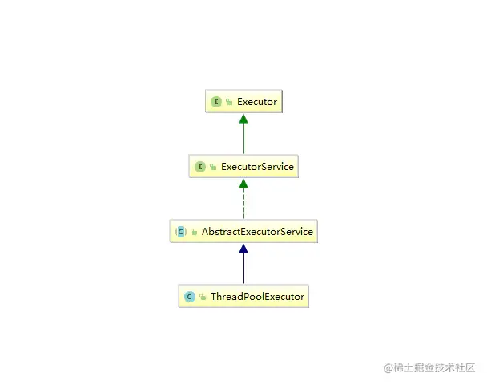
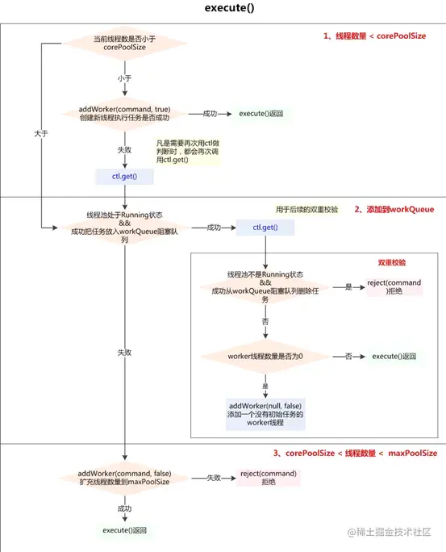
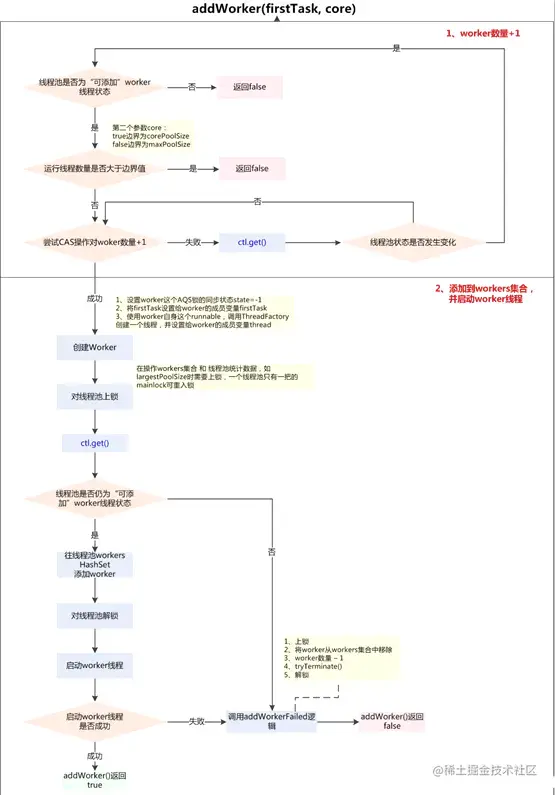
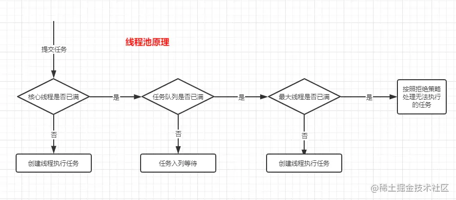
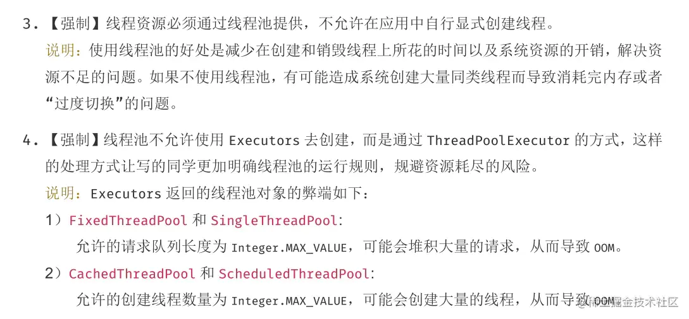

## 一、引言

- **一般在开发过程中，一个功能是运行时长太久了，一般是通过什么方式去优化的？**
   异步/多线程，对于一个业务方法而言，如果其中的调用链太长势必会引起程序运行时间延长，导致整个系统吞吐来量下降，而我们使用多线程方式来对该方法的调用链进行优化，对于一些耦合度不是特别高的调用关系可以直接通过多线程来走异步的方式进行处理，大大的缩短了程序的运行时长，但是如果我们的多线程创建方式是通过 `new Thread();`这种方式去进行显式创建的话它真的可以吗？答案是不可以，Why？答案如下：
- **如果在生产环境使用`new Thread();`这种方式去进行显式创建线程会带来什么后果？**
  - **1. OOM：** 如果当前方法突遇高并发情况，假设此时来了1000个请求，而按传统的网络模型是BIO，此时服务器会开1000个线程来处理这1000个请求（不考虑WEB容器的最大线程数配置），当1000个请求执行时又会发现此方法中存在`new Thread();`创建线程，此时每个执行请求的线程又会创建一个线程，此时就会出现1000*2=2000个线程的情况出现，而在一个程序中创建线程是需要向JVM申请内存分配的，但是此时大量线程在同一瞬间向JVM申请分配内存，此时会很容易造成内存溢出（OOM）的情况发生。
  - **2. 资源开销与耗时：** Java对象的生命周期大致包括三个阶段：对象的创建，对象的使用，对象的清除。因此，对象的生命周期长度可用如下的表达式表示：Object = O1 + O2 +O3。其中O1表示对象的创建时间，O2表示对象的使用时间，而O3则表示其清除（垃圾回收）时间。由此，我们可以看出，只有O2是真正有效的时间，而O1、O3则是对象本身的开销。当我们去创建一个线程时也是一样，因为线程在Java中其实也是一个Thread类的实例，所以对于线程而言，其实它的创建（申请内存分配、JVM向OS提交线程映射进程申请、OS真实线程映射）和销毁对资源是开销非常大的并且非常耗时的。
  - **3. 不可管理性：** 对于`new Thread();`的显示创建出来的线程是无法管理的，一旦CPU调度成功，此线程的可管理性几乎为零。
- **那么我们使用线程池能给我们带来什么好处？**
  - 1. 降低资源消耗：通过重用已经创建的线程来降低线程创建和销毁的消耗。
  - 1. 提高响应速度：任务到达时不需要等待线程创建就可以立即执行。
  - 1. 提高线程的可管理性：线程池可以统一管理、分配、调优和监控。

而在Java中为我们提供四种原生线程池，它们都是基于ThreadPoolExecutor类实现的，所以ThreadPoolExecutor类这也是我们待会儿分析线程池原理时的重点~

## 二、JDK提供的原生线程池

在Java中，JDK通过Executors类为我们提供了四种封装好的线程池类型（ForkJoinPool不在本章探讨范围之内），源码如下：

```java
java复制代码//创建一个定长的线程池
public static ExecutorService newFixedThreadPool(int nThreads) {
        return new ThreadPoolExecutor(nThreads, nThreads,0L, TimeUnit.MILLISECONDS, new LinkedBlockingQueue<Runnable>());
    }
//创建一个单线程的线程池
public static ExecutorService newSingleThreadExecutor() {
        return new FinalizableDelegatedExecutorService(new ThreadPoolExecutor(1, 1,0L, TimeUnit.MILLISECONDS,new LinkedBlockingQueue<Runnable>()));
    }
//创建一个可缓存支持灵活回收的线程池
public static ExecutorService newCachedThreadPool() {
        return new ThreadPoolExecutor(0, Integer.MAX_VALUE,60L, TimeUnit.SECONDS, new SynchronousQueue<Runnable>());
    }
//创建一个支持周期执行任务的线程池
public static ScheduledExecutorService newScheduledThreadPool(int corePoolSize) {
        return new ScheduledThreadPoolExecutor(corePoolSize);
    }
```

在上面的源码中，其实我们通过观察发现JDK为我们提供的四种线程池内部都是通过封装ThreadPoolExecutor类的构造函数来进行线程池的初始化的，所以我们先来理清楚线程池“家族”体系。
 

从上图中我们可以得知，线程池的最上层接口是Executor，而这个接口定义了一个核心方法execute(Runnable command)，当我们使用它时，需要传递一个Runnable类型的异步任务作为参数。我们看一下Executor接口的定义：

~~~java
java复制代码public interface Executor {
    // 提交任务到线程池并执行的方法
    void execute(Runnable command);
}

而Executor接口是一个函数式接口，其中只定义了一个方法，但是我们在使用线程池的时候为什么能够调用的方法却会有那么多呢？因为还有一个ExecutorService接口，它继承了Executor接口作为Executor接口的子接口，为Executor接口提供了很多拓展方法。我们接着看ExecutorService接口的实现：   
```java
public interface ExecutorService extends Executor {
    // 等待线程池执行完成已接收的任何后关闭线程池,将线程池置为SHUNTDOWM状态
    void shutdown();
    // 尝试主动终止线程池中的所有正在执行的任务并返回未执行的任务列表，
    // 将线程池置为STOP状态
    List<Runnable> shutdownNow();
    // 判断线程池是否已关闭：线程池调用过shutdown或者shutdownNow后返回true
    boolean isShutdown();
    // 判断线程池中的子线程是否已全部终止
    // 当调用shutdown后全部任务执行完成返回true或调用shutdownNow成功后返回true
    boolean isTerminated();
    // 配合shutdown使用，在调用shutdown后调用该方法，让线程池在指定时间内关闭，
    // 不管任务是否执行完成，在指定时间内还在执行任务则抛出异常中断线程
    // 注意：有时能够关闭线程池单并不能完全保证线程池中子线程停止执行
    // 比如子线程中用到 BufferedReader,那么需要配合shutdownNow主动中断所有子线程
    boolean awaitTermination(long timeout, TimeUnit unit)
        throws InterruptedException;
    // 向线程池提交一个Callable类型的异步任务，当线程池执行后返回执行结果
    <T> Future<T> submit(Callable<T> task);
    // 向线程池提交一个Runnable类型的异步任务，线程池执行完成后将返回指定类型的执行结果
    <T> Future<T> submit(Runnable task, T result);
    // 向线程池提交一个Runnable类型的异步任务，线程池执行完成后执行的结果
    Future<?> submit(Runnable task);
    // 传入一个Collection类型的异步任务集合，批量执行并返回执行结果
    <T> List<Future<T>> invokeAll(Collection<? extends Callable<T>> tasks)
        throws InterruptedException;
    // 传入一个Collection类型的异步任务集合，在指定的时间内批量执行并返回执行
    // 结果，如果超时则抛出异常中断线程
    <T> List<Future<T>> invokeAll(Collection<? extends Callable<T>> tasks,
                                  long timeout, TimeUnit unit)
        throws InterruptedException;
    // 传入一个Collection类型的异步任务集合，返回第一个执行完成的结果并终止其他线程
    <T> T invokeAny(Collection<? extends Callable<T>> tasks)
        throws InterruptedException, ExecutionException;
    // 传入一个Collection类型的异步任务集合，在指定的时间内返回第一个执行完成的结果
    // 并终止其他线程，如果超时则抛出异常中断线程
    <T> T invokeAny(Collection<? extends Callable<T>> tasks,
                    long timeout, TimeUnit unit)
        throws InterruptedException, ExecutionException, TimeoutException;
}
~~~

通过上面的代码我们会发现ExecutorService的确继承了Executor接口，作为Executor拓展接口提供了很多其他的方法以便于开发人员使用线程池，而Executor和ExecutorService接口中的方法实现全部都是由ThreadPoolExecutor类来完成的，而ThreadPoolExecutor继承了AbstractExecutorService，我们来看一下AbstractExecutorService的实现：

```java
java复制代码public abstract class AbstractExecutorService implements ExecutorService {
    // 将异步任务包装为Future，传递Runnable类型异步任务，声明返回类型，返回一个RunnableFuture
    protected <T> RunnableFuture<T> newTaskFor(Runnable runnable, T value) { };
    // 将异步任务包装为Future，传递Callable类型异步任务，返回一个RunnableFuture
    protected <T> RunnableFuture<T> newTaskFor(Callable<T> callable) { };
    public Future<?> submit(Runnable task) {};
    public <T> Future<T> submit(Runnable task, T result) { };
    public <T> Future<T> submit(Callable<T> task) { };
    // 在指定的时间内执行传入的异步任务集合，返回最后一个任务执行
    //执行集合tasks结果是最后一个执行结束的任务结果
    //可以设置超时 timed为true并且nanos是未来的一个时间
    //任何一个任务完成都将会返回结果
    private <T> T doInvokeAny(Collection<? extends Callable<T>> tasks,
                              boolean timed, long nanos)
            throws InterruptedException, ExecutionException, TimeoutException {
        //传入的任务集合不能为null
        if (tasks == null)
            throw new NullPointerException();
        //传入的任务数不能是0
        int ntasks = tasks.size();
        if (ntasks == 0)
            throw new IllegalArgumentException();
        //满足上面的校验后将任务分装到一个ArrayList中
        ArrayList<Future<T>> futures = new ArrayList<Future<T>>(ntasks);
        //并且创建一个执行器传入this
        //这里简单讲述他的执行原理，传入this会使用传入的this(类型为Executor)作为执行器用于执行任务，当submit提交任务的时候回将任务
        //封装为一个内部的Future并且重写他的done而此方法就是在future完成的时候调用的，而他的写法则是将当前完成的future添加到esc
        //维护的结果队列中
        ExecutorCompletionService<T> ecs =
                new ExecutorCompletionService<T>(this);

        try {
            //创建一个执行异常，以便后面抛出
            ExecutionException ee = null;
            //如果开启了超时则计算死线时间如果时间是0则代表没有开启执行超时
            final long deadline = timed ? System.nanoTime() + nanos : 0L;
            //获取任务的迭代器
            Iterator<? extends Callable<T>> it = tasks.iterator();
            //先获取迭代器中的第一个任务提交给前面创建的ecs执行器
            futures.add(ecs.submit(it.next()));
            //前面记录的任务数减一
            --ntasks;
            //当前激活数为1
            int active = 1;
            //进入死循环
            for (;;) {
                //获取刚才提价的任务是否完成如果完成则f不是null否则为null
                Future<T> f = ecs.poll();
                //如果为null则代表任务还在继续
                if (f == null) {
                    //如果当前任务大于0 说明除了刚才的任务还有别的任务存在
                    if (ntasks > 0) {
                        //则任务数减一
                        --ntasks;
                        //并且再次提交新的任务
                        futures.add(ecs.submit(it.next()));
                        //当前的存活的执行任务加一
                        ++active;
                    }
                    //如果当前存活任务数是0则代表没有任务在执行了从而跳出循环
                    else if (active == 0)
                        break;
                        //如果当前任务执行设置了超时时间
                    else if (timed) {
                        //则设置指定的超时时间获取
                        f = ecs.poll(nanos, TimeUnit.NANOSECONDS);
                        //等待执行超时还没有获取到则抛出超时异常
                        if (f == null)
                            throw new TimeoutException();
                        //否则使用当前时间计算剩下的超时时间用于下一个循环使用
                        nanos = deadline - System.nanoTime();
                    }
                    //如果没有设置超时则直接获取任务
                    else
                        f = ecs.take();
                }
                //如果获取到了任务结果f!=null
                if (f != null) {
                    //激活数减一
                    --active;
                    try {
                        //返回获取到的结果
                        return f.get();
                        //如果获取结果出错则包装异常
                    } catch (ExecutionException eex) {
                        ee = eex;
                    } catch (RuntimeException rex) {
                        ee = new ExecutionException(rex);
                    }
                }
            }
            //如果异常不是null则抛出如果是则创建一个
            if (ee == null)
                ee = new ExecutionException();
            throw ee;

        } finally {
            //其他任务则设置取消
            for (int i = 0, size = futures.size(); i < size; i++)
                futures.get(i).cancel(true);
        }
    }
    public <T> T invokeAny(Collection<? extends Callable<T>> tasks)
        throws InterruptedException, ExecutionException {
    };
    public <T> T invokeAny(Collection<? extends Callable<T>> tasks,
                           long timeout, TimeUnit unit)
        throws InterruptedException, ExecutionException, TimeoutException {
    };
    public <T> List<Future<T>> invokeAll(Collection<? extends Callable<T>> tasks)
        throws InterruptedException {
    };
    public <T> List<Future<T>> invokeAll(Collection<? extends Callable<T>> tasks,long timeout, 
    TimeUnit unit) throws InterruptedException {
    };
}
```

> (Executor接口有一个子接口ExecutorService，而AbstracExecutorService类又实现了ExecutorService接口，而ThreadPoolExcutor正是AbstrcExecutorService的子类)

到这里，大家应该明白了ThreadPoolExecutor、AbstractExecutorService、ExecutorService和Executor几个之间的关系了。

Executor是一个顶层接口，在它里面只声明了一个方法execute(Runnable)，返回值为void，参数为Runnable类型，从字面意思可以理解，就是用来执行传进去的任务的；
 然后ExecutorService接口继承了Executor接口，并声明了一些方法：submit、invokeAll、invokeAny以及shutDown等；
 抽象类AbstractExecutorService实现了ExecutorService接口，基本实现了ExecutorService中声明的所有方法；
 然后ThreadPoolExecutor继承了类AbstractExecutorService。

在ThreadPoolExecutor类中有几个非常重要的方法：
 `execute()`
 `submit()`
 `shutdown()`
 `shutdownNow()`
 execute()方法实际上是Executor中声明的方法，在ThreadPoolExecutor进行了具体的实现，这个方法是ThreadPoolExecutor的核心方法，通过这个方法可以向线程池提交一个任务，交由线程池去执行。

submit()方法是在ExecutorService中声明的方法，在AbstractExecutorService就已经有了具体的实现，在ThreadPoolExecutor中并没有对其进行重写，这个方法也是用来向线程池提交任务的，但是它和execute()方法不同，它能够返回任务执行的结果，去看submit()方法的实现，会发现它实际上还是调用的execute()方法，只不过它利用了Future来获取任务执行结果（Future相关内容将在以后章节讲述）。

shutdown()和shutdownNow()是用来关闭线程池的。

还有很多其他的方法：
 比如：getQueue() 、getPoolSize() 、getActiveCount()、getCompletedTaskCount()等获取与线程池相关属性的方法，有兴趣的朋友可以自行查阅API。

而Executor接口最终被ThreadPoolExecutor类实现。而且ThreadPoolExecutor是线程池体系的核心类，此类的构造方法如下：

```java
java复制代码public ThreadPoolExecutor(int corePoolSize,int maximumPoolSize,long keepAliveTime,TimeUnit unit,BlockingQueue<Runnable> workQueue);
 
public ThreadPoolExecutor(int corePoolSize,int maximumPoolSize,long keepAliveTime,TimeUnit unit,BlockingQueue<Runnable> workQueue,ThreadFactory threadFactory);
 
public ThreadPoolExecutor(int corePoolSize,int maximumPoolSize,long keepAliveTime,TimeUnit unit,BlockingQueue<Runnable> workQueue,RejectedExecutionHandler handler);
 
public ThreadPoolExecutor(int corePoolSize,int maximumPoolSize,long keepAliveTime,TimeUnit unit,BlockingQueue<Runnable> workQueue,ThreadFactory threadFactory,RejectedExecutionHandler handler);
```

ThreadPoolExecutor类总共为我们提供了四个构造方法，前面三个构造方法都是调用最后一个全参的构造函数来完成工作的，最后一个全参的构造方法需要我们传递7个参数，这七个参数的具体含义如下：

- 构造函数参数列表：

  - **corePoolSize：** 核心线程池的大小，如果核心线程池有空闲位置，这时新的任务就会被核心线程池新建一个线程执行，执行完毕后不会销毁线程，线程会进入缓存队列等待再次被运行。

  - **maximunPoolSize：** 线程池能创建最大的线程数量。如果核心线程池和缓存队列都已经满了，新的任务进来就会创建新的线程来执行。但是数量不能超过maximunPoolSize，否侧会采取拒绝接受任务策略，我们下面会具体分析。

  - **keepAliveTime：** 非核心线程能够空闲的最长时间，超过时间，线程终止。这个参数默认只有在线程数量超过核心线程池大小时才会起作用。只要线程数量不超过核心线程大小，就不会起作用（当然如果设置了allowCoreThreadTimeOut(true)线程池中的核心线程也受该参数的影响）。

  - unit：

     时间单位，和keepAliveTime配合使用，可选择项如下：

    - TimeUnit.DAYS：天
    - TimeUnit.HOURS：小时
    - TimeUnit.MINUTES：分钟
    - TimeUnit.SECONDS：秒
    - TimeUnit.MILLISECONDS：毫秒
    - TimeUnit.MICROSECONDS：微妙
    - TimeUnit.NANOSECONDS：纳秒

  - workQueue：

     任务队列，用来存放等待被执行的任务，一般为阻塞队列（BlockingQueue）三种常用为：（可自定义阻塞队列）。

    - ArrayBlockingQueue：基于数组的先进先出队列，此队列创建时必须指定大小；
    - LinkedBlockingQueue：基于链表的先进先出队列，如果创建时没有指定此队列大小，则默认为Integer.MAX_VALUE；
    - SynchronousQueue：这个队列比较特殊，它不会保存提交的任务，而是将直接新建一个线程来执行新来的任务。

  - **threadFactory：** 线程工厂，用来创建线程，一般有三种选择策略（可自定义）。

  - handler：

     任务拒绝策略，线程数量大于最大线程数就会采用拒绝处理策略。ThreadPoolExecutor中为我们提供了四种默认策略可选择（可自定义）：

    - ThreadPoolExecutor.AbortPolicy:丢弃任务并抛出RejectedExecutionException异常。
    - ThreadPoolExecutor.DiscardPolicy：也是丢弃任务，但是不抛出异常。
    - ThreadPoolExecutor.DiscardOldestPolicy：丢弃队列最前面的任务，然后重新尝试执行任务（重复此过程）
    - ThreadPoolExecutor.CallerRunsPolicy：由调用线程处理该任务

而当我们需要使用线程池时，我们可以通过调用Executors中为我们封装好的方法创建线程池，也可以通过自己对于ThreadPoolExecutor的构造方法进行封装自定义线程池(后面会详细谈到)，示例如下：

```java
java复制代码public class ThreadPoolDemo {

    public static void main(String[] args) {

        /*
         *  创建可缓存的线程池
         *  优点：当线程池中线程执行完任务后会将线程缓存起来，默认60s后空闲线程会自动回收
         *  缺点：任然存在由于并发过高导致瞬间创建大量线程产生的OOM
         */
        ExecutorService cachedThreadPool = Executors.newCachedThreadPool();
        cachedThreadPool.execute(() -> {
            System.out.println("我是递交到cachedThreadPool的异步任务....竹子....");
        });

        /*
         *  创建定长的线程池
         *  优点：可以避免由于并发过高导致瞬间创建大量线程产生的OOM
         *  缺点：
         *      1. 线程创建后永不释放线程资源
         *      2. 任务队列最大长度为Integer.MAX_VALUE，并发时会创建大量的任务导致OOM
         */
        ExecutorService fixedThreadPool = Executors.newFixedThreadPool(5);
        Future<?> futureResult = fixedThreadPool.submit(() -> {
            System.out.println("我是递交到fixedThreadPool的异步任务....竹子...");
            return "竹子";
        });
        try {
            // 得到执行后返回结果
            String str = (String) futureResult.get();
            System.out.println("我是递交到fixedThreadPool的异步任务执行完成后的返回结果：" + str);
        } catch (InterruptedException e) {
            e.printStackTrace();
        } catch (ExecutionException e) {
            e.printStackTrace();
        }

        /*
         *  创建定长可支持周期调度的线程池
         *  优点：可以支持按时调度执行任务
         *  缺点：
         *      1. 线程创建后永不释放线程资源
         *      2. 任务队列最大长度为Integer.MAX_VALUE，并发时会创建大量的任务导致OOM
         */
        ScheduledExecutorService scheduledThreadPool = Executors.newScheduledThreadPool(5);
        scheduledThreadPool.schedule(()->{
            System.out.println("我是递交到scheduledThreadPool十秒钟之后执行的异步任务....熊猫...");
        },10,TimeUnit.SECONDS);

        /*
         *  创建单线程的线程池
         *  优点：可以支持线程池任务的执行按照递交的顺序先进先出(FIFO)
         *  缺点：单线程效率比不上前面的三种线程池（前面的线程池都存在多线程并行执行任务）
         */
        ExecutorService singleThreadExecutor = Executors.newSingleThreadExecutor();
        List<Callable<String>> callables = new ArrayList<>();
        callables.add(()->{
            System.out.println("我是递交到singleThreadExecutor的异步任务...熊猫1号...");
            return "熊猫一号";
        });
        callables.add(()->{
            System.out.println("我是递交到singleThreadExecutor的异步任务...熊猫2号...");
            return "熊猫二号";
        });
        callables.add(()->{
            System.out.println("我是递交到singleThreadExecutor的异步任务...熊猫3号...");
            return "熊猫三号";
        });
        try {
            // 接收批量执行后的结果
            List<Future<String>> futures = singleThreadExecutor.invokeAll(callables);
        } catch (InterruptedException e) {
            e.printStackTrace();
        }

        cachedThreadPool.shutdown();
        fixedThreadPool.shutdown();
        scheduledThreadPool.shutdown();
        singleThreadExecutor.shutdown();

        /* 执行结果：
         *  我是递交到cachedThreadPool的异步任务....竹子....
         *
         *  我是递交到fixedThreadPool的异步任务....竹子...
         *  我是递交到fixedThreadPool的异步任务执行完成后的返回结果：竹子
         *
         *  我是递交到singleThreadExecutor的异步任务...熊猫1号...
         *  我是递交到singleThreadExecutor的异步任务...熊猫2号...
         *  我是递交到singleThreadExecutor的异步任务...熊猫3号...
         *
         *  我是递交到scheduledThreadPool十秒钟之后执行的异步任务....熊猫...
         */
    }
}
```

在上面的案例中我们使用到了execute()、schedule()、submit()、invokeAll()等方法向线程池中递交任务，但是当我们跟进源码分析会发现，线程池递交任务的核心就是Executor接口定义的核心方法execute(Runnabel command)，所以我们如果要分析线程池原理的重点就在此方法。

## 三、深入源码剖析线程池工作原理

在上一节我们从宏观上介绍了ThreadPoolExecutor，下面我们来深入解析一下线程池的具体实现原理，将从下面几个方面讲解：

- **1. 线程池状态控制参数ctl**
   要了解线程池，我们首先要了解的线程池里面的状态控制的参数 ctl，这个线程池的状态控制参数是一个原子操作的 AtomicInteger，这个ctl包含两个参数 ：
  - `runState：当前线程池的状态`
  - `workerCount：激活（工作）的线程数`
- 它的低29位用于存放当前的线程数, 因此一个线程池在理论上最大的线程数是 536870911; 高 3 位是用于表示当前线程池的状态, 其中高三位的值和状态对应如下：
  - `111: RUNNING：线程池初始化（创建出来之后）处于此状态，能够接收新任务，以及对已添加的任务进行处理。`
  - `000: SHUTDOWN：当调用shutdown()方法时改为此状态，在此状态时，不接收新任务，但能处理已添加的任务。`
  - `001: STOP：调用shutdownNow()方法时处于此状态，在此状态时，不接收新任务，不处理已添加的任务，并且会尝试中断正在处理的任务。`
  - `010: TIDYING：当线程池在SHUTDOWN状态下，阻塞队列为空并且线程池中执行的任务也为空时，就会由 SHUTDOWN -> TIDYING。|| 当所有的任务已终止，ctl记录的”任务数量”为0，线程池会变为TIDYING状态。当线程池变为TIDYING状态时，会执行钩子函数terminated()。terminated()在ThreadPoolExecutor类中是空的，若用户想在线程池变为TIDYING时，进行相应的处理；可以通过重载terminated()函数来实现。`
  - `011: TERMINATED：线程池处在TIDYING状态时，执行完terminated()之后，就会由 TIDYING -> TERMINATED。线程池彻底终止，就变成TERMINATED状态。`
- 为了能够使用 ctl 线程池提供了三个方法：

```java
java复制代码    // 获取线程池的状态
    private static int runStateOf(int c)     { return c & ~CAPACITY; }    
    // 获取线程池的工作线程数
    private static int workerCountOf(int c)  { return c & CAPACITY; }    
    // 根据工作线程数和线程池状态获取 ctl
    private static int ctlOf(int rs, int wc) { return rs | wc; }
```

- **2. 任务的执行**
   如果想使用线程池就必须通过 execute 这个方法来向线程池提交任务，而这个方法也是线程池的核心，所以我们来看代码：

### execute：

```java
java复制代码public void execute(Runnable command) {        
    //如果传递的任务为空则抛出空指针异常
    if (command == null)           
        throw new NullPointerException();        
    int c = ctl.get();        
    //如果工作线程数小于核心线程数，
    if (workerCountOf(c) < corePoolSize) {            
        //执行addWork，提交为核心线程,提交成功return。提交失败重新获取ctl
        if (addWorker(command, true))                
        return;
        c = ctl.get();
    }        
    //如果工作线程数大于核心线程数，则检查线程池状态是否是正在运行，且将新线程向阻塞队列提交。
    if (isRunning(c) && workQueue.offer(command)) {            
        //recheck 需要再次检查,主要目的是判断加入到阻塞队里中的线程是否可以被执行
        int recheck = ctl.get();               
        //如果线程池状态不为running，将任务从阻塞队列里面移除，启用拒绝策略
        if (! isRunning(recheck) && remove(command))
            reject(command);            
        // 如果线程池的工作线程为零，则调用addWoker提交任务
        else if (workerCountOf(recheck) == 0)
            addWorker(null, false);
    }        
    //添加非核心线程失败，拒绝
    else if (!addWorker(command, false))            
        reject(command);
}
```



### addWoker：

```java
java复制代码private boolean addWorker(Runnable firstTask, boolean core) {
    retry:        
    for (;;) {            
        int c = ctl.get();            
        //获取线程池状态
        int rs = runStateOf(c);            
        // Check if queue empty only if necessary.
        // 判断是否可以添加任务。
        if (rs >= SHUTDOWN &&
            ! (rs == SHUTDOWN &&
               firstTask == null &&
               ! workQueue.isEmpty()))                
            return false;            
        for (;;) {               
             //获取工作线程数量
            int wc = workerCountOf(c);                
            //是否大于线程池上限，是否大于核心线程数，或者最大线程数
            if (wc >= CAPACITY ||
                wc >= (core ? corePoolSize : maximumPoolSize))                    
                return false;                
            //CAS 增加工作线程数
            if (compareAndIncrementWorkerCount(c))                    
                break retry;
            c = ctl.get();  // Re-read ctl
            //如果线程池状态改变，回到开始重新来
            if (runStateOf(c) != rs)                    
                continue retry;                
           // else CAS failed due to workerCount change; retry inner loop
        }
    }        
                
    boolean workerStarted = false;        
    boolean workerAdded = false;
    Worker w = null;        
    //上面的逻辑是考虑是否能够添加线程，如果可以就cas的增加工作线程数量
    //下面正式启动线程
    try {            
        //新建worker
        w = new Worker(firstTask);            
        //获取当前线程
        final Thread t = w.thread;            
        if (t != null) {                
            //获取可重入锁
            final ReentrantLock mainLock = this.mainLock;                
            //锁住
            mainLock.lock();                
            try {                    
                // Recheck while holding lock.
                // Back out on ThreadFactory failure or if
                // shut down before lock acquired.
                int rs = runStateOf(ctl.get()); 
                // rs < SHUTDOWN ==> 线程处于RUNNING状态
                // 或者线程处于SHUTDOWN状态，且firstTask == null（可能是workQueue中仍有未执行完成的任务，创建没有初始任务的worker线程执行）
                if (rs < SHUTDOWN ||
                    (rs == SHUTDOWN && firstTask == null)) {                        
                    // 当前线程已经启动，抛出异常
                    if (t.isAlive()) // precheck that t is startable
                        throw new IllegalThreadStateException();                        
                    //workers 是一个 HashSet 必须在 lock的情况下操作。
                    workers.add(w);                        
                    int s = workers.size();                        
                    //设置 largeestPoolSize 标记workAdded
                    if (s > largestPoolSize)
                        largestPoolSize = s;
                    workerAdded = true;
                }
            } finally {
                mainLock.unlock();
            }                
            //如果添加成功，启动线程
            if (workerAdded) {
                t.start();
                workerStarted = true;
            }
        }
    } finally {            
        //启动线程失败，回滚。
        if (! workerStarted)
            addWorkerFailed(w);
    }        
    return workerStarted;
}
```



先看看 `addWork() `的两个参数，第一个是需要提交的线程` Runnable firstTask`，第二个参数是 `boolean` 类型，表示是否为核心线程。 `execute()` 中有三处调用了 `addWork() `我们逐一分析。

- 第一次，条件`if (workerCountOf(c) < corePoolSize)`这个很好理解，工作线程数少于核心线程数，提交任务。所以` addWorker(command, true)`。
- 第二次，如果 `workerCountOf(recheck) == 0 `如果worker的数量为0，那就 `addWorker(null,false)`。为什么这里是 null ？之前已经把`command`提交到阻塞队列了`workQueue.offer(command)`。所以提交一个空线程，直接从阻塞队列里面取就可以了。
- 第三次，如果线程池没有`RUNNING`或者`offer`阻塞队列失败，`addWorker(command,false)`，很好理解，对应的就是，阻塞队列满了，将任务提交到，非核心线程池。与最大线程池比较。 至此，重新归纳`execute()`的逻辑应该是： 如果当前运行的线程，少于`corePoolSize`，则创建一个新的线程来执行任务。 如果运行的线程等于或多于` corePoolSize`，将任务加入 `BlockingQueue`。 如果加入 `BlockingQueue `成功，需要二次检查线程池的状态如果线程池没有处于 `Running`，则从 `BlockingQueue` 移除任务，启动拒绝策略。 如果线程池处于 `Running`状态，则检查工作线程`（worker）`是否为0。如果为0，则创建新的线程来处理任务。如果启动线程数大于`maximumPoolSize`，任务将被拒绝策略拒绝。 如果加入 `BlockingQueue `。失败,则创建新的线程来处理任务。 如果启动线程数大于`maximumPoolSize`，任务将被拒绝策略拒绝。



**3. 线程池中的线程初始化**
 默认情况下，创建线程池之后，线程池中是没有线程的，需要提交任务之后才会创建线程。
 在实际中如果需要线程池创建之后立即创建线程，可以通过以下两个方法办到：

```scss
scss复制代码prestartCoreThread()：初始化一个核心线程；
prestartAllCoreThreads()：初始化所有核心线程;
```

下面是这2个方法的实现：

```java
java复制代码public boolean prestartCoreThread() {
    return addIfUnderCorePoolSize(null); //注意传进去的参数是null
}
public int prestartAllCoreThreads() {
    int n = 0;
    while (addIfUnderCorePoolSize(null))//注意传进去的参数是null
        ++n;
    return n;
}
```

注意上面传进去的参数是null，根据第2小节的分析可知如果传进去的参数为null，则最后执行线程会阻塞在getTask方法中的`r = workQueue.take();`即等待任务队列中有任务。

**4. 任务缓存队列及排队策略**
 见线程池参数，在选择线程池任务队列时的阻塞时队列就决定了这个线程池的任务缓存及排队策略。

**5. 任务拒绝策略**
 当线程池的任务缓存队列已满并且线程池中的线程数目达到`maximumPoolSize`，如果还有任务到来就会采取任务拒绝策略，具体拒绝策略参考线程池参数列表。

**6. 线程池的关闭**
 ThreadPoolExecutor提供了两个方法，用于线程池的关闭，分别是shutdown()和shutdownNow()，其中：

```java
java复制代码shutdown()：不会立即终止线程池，而是要等所有任务缓存队列中的任务都执行完后才终止，但再也不会接受新的任务;
shutdownNow()：立即终止线程池，并尝试打断正在执行的任务，并且清空任务缓存队列，返回尚未执行的任务;
```

**7. 线程池容量的动态调整**
 ThreadPoolExecutor提供了动态调整线程池容量大小的方法：`setCorePoolSize()`和`setMaximumPoolSize()`，
 `setCorePoolSize：设置核心池大小`
 `setMaximumPoolSize：设置线程池最大能创建的线程数目大小`
 当上述参数从小变大时，ThreadPoolExecutor进行线程赋值，还可能立即创建新的线程来执行任务。

## 四、深入源码分析线程池线程复用原理

通过前面分析线程池的工作原理我们可以得知一个结论：在线程池内部关于线程的调度执行都是被封装成一个Worker对象来操作的。而当我们使用Worker.thread.start()启动线程时，JVM会调用Worker中重写的run()方法执行，而Worker.run()方法源码如下：

```java
java复制代码/** Delegates main run loop to outer runWorker  */
// 将线程运行主逻辑交给外部 Worker.runWorker()
public void run() {runWorker(this);}
```

我们进一步跟进Worker.runWorker()源码：

```java
java复制代码// 线程执行逻辑：执行循环并反复从队列获取任务并执行
final void runWorker(Worker w) {
    // 获取当前执行线程
    Thread wt = Thread.currentThread();
    // 获取当前传递进线程池的方法
    Runnable task = w.firstTask;
    // 将Worker.firstTask 置为空
    w.firstTask = null;
    // 允许发生线程中断
    w.unlock(); // allow interrupts
    // 突然执行完成标志：是否因为异常跳出循环
    boolean completedAbruptly = true;
    try {
        // 1. 如果线程池外部传递了任务则直接执行外部传递的任务
        // 2. 如果没有获取到外部传递进来的任务则调用getTask()去队列中获取任务并执行
        // 2.1. 如果在任务队列中获取到了任务则直接执行已经获取的任务
        // 2.2. 如果任务队列为空，没有任务则反复执行空循环阻塞当前线程死亡
        while (task != null || (task = getTask()) != null) {
            // 禁止线程中断(防止线程在执行过程中中断导致不可恢复的错误)
            w.lock();
            // 二次确认线程池以及当前工作线程状态：
            // 如果线程池停止，确保当前线程被中断
            // If pool is stopping, ensure thread is interrupted;
            // 如果线程池为停止，请确保当前线程未被中断
            // if not, ensure thread is not interrupted.  This
            // 如果是第二种情况则需要重新检测并且清除中断
            // requires a recheck in second case to deal with
            // shutdownNow race while clearing interrupt
            if ((runStateAtLeast(ctl.get(), STOP) ||
                 (Thread.interrupted() &&
                  runStateAtLeast(ctl.get(), STOP))) &&
                !wt.isInterrupted())
                wt.interrupt();
            try {
                // 钩子方法
                beforeExecute(wt, task);
                Throwable thrown = null;
                try {
                    // 调用任务的run方法，而不是start()方法，因为Worker本身就是一个线程类
                    task.run();
                } catch (RuntimeException x) {
                    thrown = x; throw x;
                } catch (Error x) {
                    thrown = x; throw x;
                } catch (Throwable x) {
                    thrown = x; throw new Error(x);
                } finally {
                    // 钩子方法
                    afterExecute(task, thrown);
                }
            } finally {
                // 执行完成后将获取的任务置空
                task = null;
                // 执行完成后自增当前工作线程执行的任务数量
                w.completedTasks++; 
                // 释放Worker中自实现的锁
                w.unlock();
            }
        }
        // 如果线程能够执行到最后一行代表线程执行过程中没有由于发生异常导致跳出循环，将 突然结束 标志改为false
        completedAbruptly = false;
    } finally {
        // 执行回收工作线程的逻辑
        processWorkerExit(w, completedAbruptly);
    }
}
```

如上就是关于线程池复用的原理，简单来说就是通过一个死循环让当前线程一直处于运行状态，阻止OS将当前工作线程回收，从而做到线程的复用。而关于死循环的条件则比较简单，判断task是否为空，在调用方法执行的时候会先获取外部传递的任务，如果没有获取到外部传递的任务则调用getTask()方法获取任务队列中的任务并执行：

```java
java复制代码// 如果返回null，在runWorker方法中会执行processWorkerExit，即关闭该线程。
private Runnable getTask() {
    // 表示上次从队列获取任务是否超时
    boolean timedOut = false; // Did the last poll() time out?
    // 死循环标志位
    retry:
    for (;;) {
        int c = ctl.get(); // 获取ctl
        int rs = runStateOf(c); // 解析ctl获取当前线程池运行状态

        // Check if queue empty only if necessary.
        // 如果rs >= STOP，或者 rs=SHUTDOWN且队列为空，此时不再接收新任务，将WorkerCount递减并返回null。
        if (rs >= SHUTDOWN && (rs >= STOP || workQueue.isEmpty())) {
            decrementWorkerCount();    // 自旋CAS递减workerCount直到成功
            return null;
        }

        // timed用于判断是否需要重试控制
        boolean timed;      // Are workers subject to culling?

        for (;;) {
            // allowCoreThreadTimeOut默认是false，核心线程不进行超时控制，
            // 当线程数量大于corePoolSize时需要进行超时控制
            int wc = workerCountOf(c);
            timed = allowCoreThreadTimeOut || wc > corePoolSize;

            // 如果wc <= maximumPoolSize ，且上次从队列获取任务超时或本次需要进行超时控制，
            // 则跳出内层循环。
            // timedOut=true表示上次从队列获取元素超时，说明队列在上次获取的keepAliveTime时间内是空的。
            // timed=true说明线程数量大于corePoolSize。
            // 所以timedOut=true和timed=true同时满足则说明当前线程已经空闲了keepAliveTime时间，
            // 并且线程池的数量大于corePoolSize。这时就需要关闭多余的空闲线程
            //（即compareAndDecrementWorkerCount并返回null）。
            if (wc <= maximumPoolSize && ! (timedOut && timed))
                break;
            // 如果线程数量大于maximumPoolSize，或者上次从队列获取任务超时且本次需要进行
            // 超时控制。需要递减WorkerCount，如果递减成功则返回null
            if (compareAndDecrementWorkerCount(c))
                return null;
            //检查线程池运行状态是否改变。如果改变，那么继续外层循环，如果未改变，那么继续内层循环。
            c = ctl.get();  // Re-read ctl
            if (runStateOf(c) != rs)
                continue retry;
            // else CAS failed due to workerCount change; retry inner loop
        }

        try {
            Runnable r = timed ?
                workQueue.poll(keepAliveTime, TimeUnit.NANOSECONDS) :
                //超时方式获取，注意keepAliveTime为超出corePoolSize大小的线程的空闲存活时间
                workQueue.take();    //阻塞方式获取，如果队列为空阻塞当前线程
            if (r != null)
                return r;
            timedOut = true;    //如果超时，继续循环。
        } catch (InterruptedException retry) {
            //如果发生中断，则将timedOut置为false，继续循环
            timedOut = false;
        }
    }
}
```

在getTask()方法中的逻辑也比较简单，前期效验线程池状态，一切正常时开始任务的获取逻辑，但是值得注意的是这里使用的是阻塞时获取方式，也就代表如果任务队列中没有任务，当前线程会阻塞等待，直到任务队列中有新的任务时才会获取并返回执行，不过如果线程池设置了存活时间，那么当前线程会阻塞到存活时间的阈值，如果超出存活时间会返回null。而如果返回null，则在runWorker方法中会执行processWorkerExit，即关闭该工作线程，从而实现了线程池的另一个功能： **线程池内线程空闲时间超过给定的存活时间时自动回收该线程资源**。

下面我们再来看看processWorkerExit方法的实现：

```java
java复制代码private void processWorkerExit(Worker w, boolean completedAbruptly) {
    // 如果completedAbruptly=false，说明是由getTask返回null导致的，WorkerCount递减的操作已经执行
    // 如果completedAbruptly=true，说明是由执行任务的过程中发生异常导致，需要进行WorkerCount递减的操作
    if (completedAbruptly) // If abrupt, then workerCount wasn't adjusted
        decrementWorkerCount();

    final ReentrantLock mainLock = this.mainLock;
    mainLock.lock();
    try {
        completedTaskCount += w.completedTasks;
        // 从workers中删除当前worker，对workers更新需要加mainLock锁
        workers.remove(w);    
    } finally {
        mainLock.unlock();
    }
    // 根据线程池状态判断是否结束线程池
    tryTerminate();

    // 如果是异常结束（completedAbruptly=true），需要重新调用addWorker()增加一个线程，保持线程数量
    // 如果是由getTask()返回null导致的线程结束，需要进行以下判断：
    //    1）如果allowCoreThreadTimeOut=true且队列不为空，那么需要至少保证有一个线程
    //    2）如果allowCoreThreadTimeOut=false,那么需要保证线程数大于等于corePoolSize
    int c = ctl.get();
    if (runStateLessThan(c, STOP)) {
        if (!completedAbruptly) {
            int min = allowCoreThreadTimeOut ? 0 : corePoolSize;
            if (min == 0 && ! workQueue.isEmpty())
                min = 1;
            if (workerCountOf(c) >= min)
                return; // replacement not needed
        }
        addWorker(null, false);
    }
}
```

关于线程池中工作线程的销毁则是由processWorkerExit()方法来完成的，在这个方法中首先会判断当前线程是因为执行出现异常还是超出存活时间导致需要发生回收的。如果是因为超出存活时间，先判断线程池状态之后再从工作集中移除当前线程即可。如果是由于异常导致的则需要先对线程池的工作线程数进行自减，然后再移除工作集中的工作线程，最后再调用addWorker()添加一个工作线程保证线程池内工作线程的数量。在上面的源码中我们也会看到tryTerminate()这个方法，那么我们也简单分析一下它的源码：

```java
java复制代码//根据线程池状态判断是否结束线程池
final void tryTerminate() {
    for (;;) {
        int c = ctl.get(); // 获取ctl
        // 如果线程池运行状态是RUNNING，或者大于等于TIDYING，或者运行状态为
        // SHUTDOWN且队列为空，则直接return返回
        if (isRunning(c) ||
            runStateAtLeast(c, TIDYING) ||
            (runStateOf(c) == SHUTDOWN && ! workQueue.isEmpty()))
            return;
        // 如果工作线程数不为0，则中断一个空闲线程并return
        if (workerCountOf(c) != 0) { // Eligible to terminate
            interruptIdleWorkers(ONLY_ONE);
            return;
        }

        final ReentrantLock mainLock = this.mainLock;
        mainLock.lock();
        try {
            // 尝试将线程池状态设置为TIDYING状态
            if (ctl.compareAndSet(c, ctlOf(TIDYING, 0))) {
                try {
                    //如果CAS成功,执行terminated()钩子方法
                    terminated();
                } finally {
                    ctl.set(ctlOf(TERMINATED, 0));
                    termination.signalAll();
                }
                return;
            }
        } finally {
            mainLock.unlock();
        }
        // else retry on failed CAS
    }
}
```

如果线程池状态不处于STOP或者TERMINATED状态则直接返回，反之执行terminated()钩子函数。

到此关于线程池的复用原理就告一段落了，关于线程池的复用原理只需要理解死循环+getTask即可大致明白线程池复用的思维。

## 五、自定义线程池实战

再前面我们曾提到，JDK为我们提供的已经封装好的线程池实现在高并发情况下都会存在OOM的风险，而通过前面分析我们也可以得知，JDK提供的线程池也是通过封装ThreadPoolExecutor的构造，所以我们在生产环境时更应该自定义线程池来规避这些风险以及更好的操作线程池。注：在《阿里巴巴java开发规范手册》中明确规定如下： 

所以在一般生产环境使用创建线程都是通过自定义线程池来使用线程资源，代码如下：

```java
java复制代码public static void main(String[] args){
     // 线程工厂可通过 implements ThreadFactory接口自定义
     // 任务拒绝策略可通过  implements RejectedExecutionHandler接口自定义
     ThreadPoolExecutor threadPoolExecutor = new ThreadPoolExecutor(2, 3, 0,
                    TimeUnit.SECONDS, new LinkedBlockingQueue<Runnable>(3),
                    Executors.defaultThreadFactory(), new ThreadPoolExecutor.AbortPolicy());

    for (int i = 0; i < 10;i++){
         final int num = i;
         threadPoolExecutor.execute(()->{
              System.out.println("线程：" + Thread.currentThread().getName() + "正在执行:" + num + "个任务");
        });
        System.out.println("线程池中线程数目：" + threadPoolExecutor.getPoolSize() + "，队列中等待执行的任务数目：" + threadPoolExecutor.getQueue().size() + "，已执行玩别的任务数目："+threadPoolExecutor.getCompletedTaskCount());
    }
}
```

## 五、线程池参数合理配置

本节来讨论一个比较重要的话题：如何合理配置线程池大小，参考如下：

- (1) 

  CPU密集型：

  - 定义：CPU密集型任务是指该任务需要进行大量的运算，需要消耗CPU的大量算力，需要CPU的频繁计算，很少情况出现阻塞，所以CPU在处理该类型任务时会处于高速运 转
  - 分析：
    - CPU密集型任务只有在真正的多核CPU机器上才能得到真正的增速(多核多线程同时处理)
    - CPU密集型任务则尽量少配置线程的数量，因为CPU在运行此类任务时几乎很少出现阻塞，所以最终如果配置的线程数太多，频繁切换线程调度反而会使得效率 下降
  - 配置公式：
    - 1.CPU核数 * 1
    - 2.CPU核数 * 1 + 1

- IO密集型：

  - 定义：IO密集型是指该类型任务在执行时会产生大量的IO(包含磁盘IO和网络IO)，即在IO读取数据时，CPU需要等待数据的读取，CPU会处于“空闲”状态
  - 分析：
    - 无论是在单核还是多核的CPU下，线程运行IO密集型任务都会导致浪费大量的计算资源，因为CPU在处理这类任务时，绝大时候是处于等待数据读取
    - IO密集型任务中我们可以采用多线程方式加速程序的运行，即使是单核的CPU上，我们也可以配置多个线程，因为在CPU等待数据读取的过程中，可以先切换到另外一个线程处理计算逻辑，等这边数据加载好了之后再切换回来，这种方式则可 以很好的将IO读取造成的CPU空闲时间利用起来
  - 配置公式：
    - 1.CPU核数 * 2
    - 2.CPU核数 / 1 - 阻塞系数（cpu密集型任务阻塞系数为0,IO密集型一般在0.8-0.9之间）
    - 阻塞系数计算公式：执行该任务所需的时间与(阻塞时间+计算时间)的比值，即w/(w+c)

