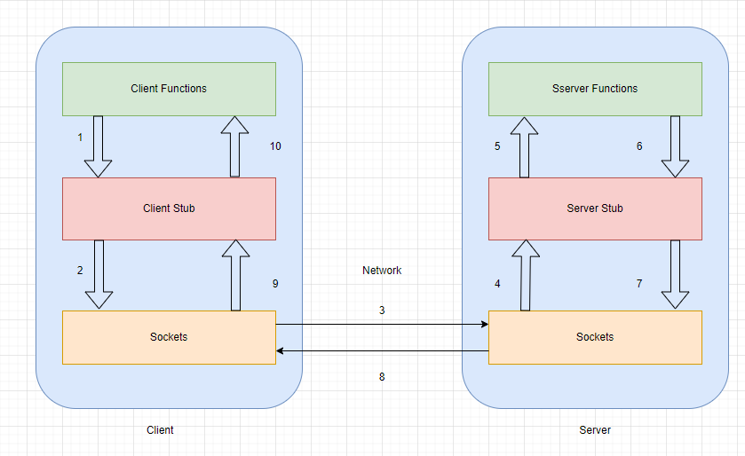
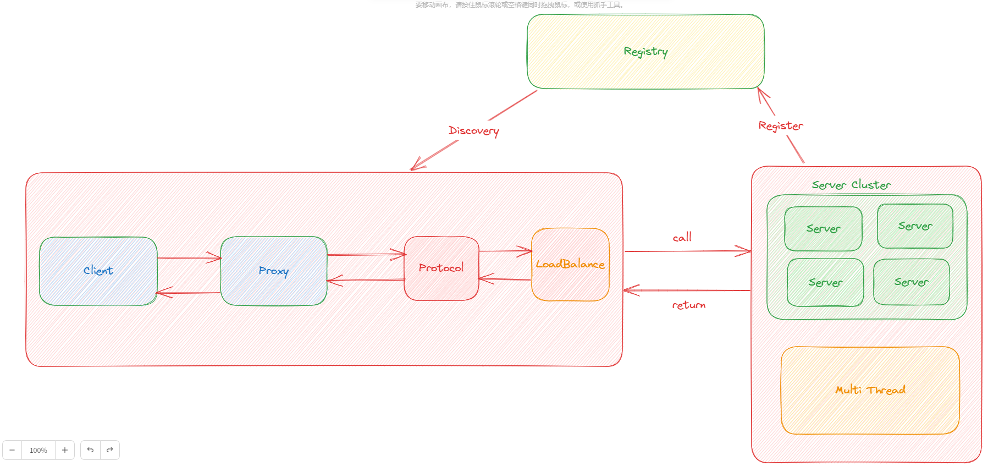
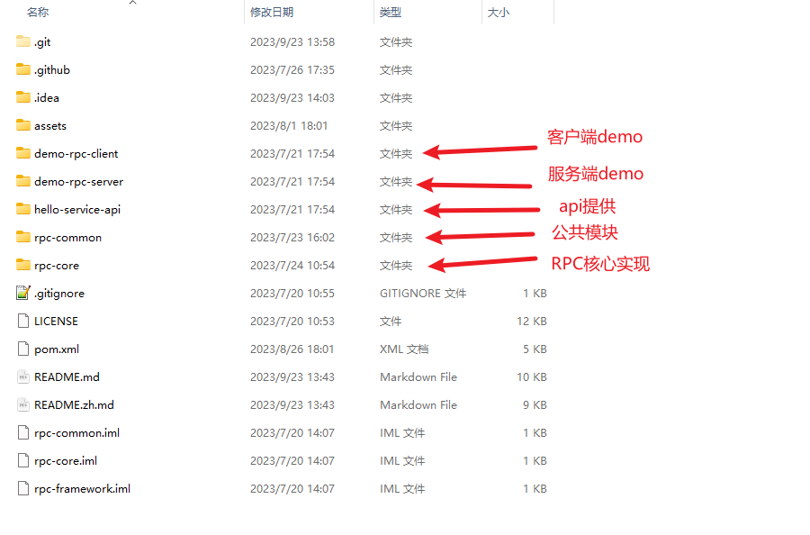

该项目是我简历上的第一个项目，手写一个简易的RPC框架，先说一下为啥要写这个项目，因为目前微服盛行，服务之间的通信肯定需要中间件支持，因此就有了RPC，我也是为了更熟悉这个思想，因此手写一个简易的（其实主要是简历没有项目不好看啊）。

OK，本章节就来讲讲RPC的一些基础概念吧！

# 什么是RPC？

RPC（Remote Procedure Call）-远程过程调用，它是一种通过网络从远程计算机程序上请求服务，而不需要了解底层网络技术的协议。比如两个不同的服务A、B部署在两台的机器上，那么服务A如果想要调用服务B中的某个方法该怎么办呢？使用HTTP请求当然也是可以的，但是可能会慢一点而且一些优化做的不太好。RPC的出现就是为了解决这个问题。

最终解决的问题：**让分布式或者微服务系统中不同服务之间的调用像本地调用一样简单。**

# RPC简要原理

1. 服务消费方（Client）调用以本地调用方式调用服务；

2. `Client Stub`接收到调用后负责将方法、参数等组装成能够进行网络传输的消息体； 
3. `Client Stub`找到服务地址，并将消息编码后发送到服务端； 
4. `Server Stub`收到消息后进行解码； 
5. `Server Stub`根据解码结果调用本地的服务； 
6. 本地服务执行并将结果返回给`Server Stub`； 
7. `Server Stub`将返回结果打包成消息并发送至消费方； 
8. `Server Stub`找到服务地址，并将消息编码后发送到客户端； 
9. `Client Stub`接收到消息，并进行解码； 
10. 服务消费方得到最终结果。

#  业界常用的RPC框架

- **Dubbo**：`Dubbo` 是阿里巴巴公司开源的一个高性能优秀的服务框架，使得应用可通过高性能的 `RPC` 实现服务的输出和输入功能，可以和 `Spring`框架无缝集成。目前 `Dubbo` 已经成为 `Spring Cloud Alibaba` 中的官方组件。
- **gRPC** ：`gRPC`是可以在任何环境中运行的现源高性能`RPC`框架。它可以通过可插拔的支持来有效地连接数据中心内和跨数据中心的服务，以实现负载平衡，跟踪，运行状况检查和身份验证。它也适用于分布式计算的最后一英里，以将设备，移动应用程序和浏览器连接到后端服务。 
- **Hessian**： `Hessian`是一个轻量级的 `remoting-on-http` 工具，使用简单的方法提供了 `RMI`的功能。 相比 `WebService`，`Hessian` 更简单、快捷。采用的是二进制 `RPC`协议，因为采用的是二进制协议，所以它很适合于发送二进制数据。
- **Thrift**：`Thrift`是`Facebook`于2007年开发的跨语言的`RPC`服框架，提供多语言的编译功能，并提供多种服务器工作模式；用户通过`Thrift`的`IDL（接口定义语言）`来描述接口函数及数据类型，然后通过Thrift的编译环境生成各种语言类型的接口文件，用户可以根据自己的需要采用不同的语言开发客户端代码和服务器端代码。

# 为什么用RPC，不用HTTP？

首先需要指正，这两个并不是是并行概念。RPC是一种**设计**，就是为了**解决不用服务之间的调用问题**，完整的RPC实现一般会包含有**传输协议**和序列化协议这两个。

而HTTP是一种传输协议，RPC框架完全可以使用HTTP作为传输协议，也可以直接使用TCP，使用不同的协议一般也是适应不同的场景。

使用TCP和使用HTTP各有千秋吧！我就以以下几个方面大概说明：

**传输效率**：

- TCP，通常自定义上层协议，可以让请求报文体积更小；
- HTTP：如果是基于HTTP/1.1的协议，请求中会包含很多无用的协议。

**性能消耗**：主要在于序列化和反序列化的耗时

- TCP：可以基于各种序列化框架进行，效率较高；
- HTTP：大部分是通过JSON实现的，字节大小和序列化耗时都需要消耗更多的性能。

**跨平台**：

- TCP：通常要求客户端和服务端在统一平台；
- HTTP：可以在各种异构系统上运行。

**总结**：RPC的TCP方式主要用于公司内部的服务调用，性能消耗低，传输效率高。HTTP主要用于对外的异构环境，浏览器接口调用，APP接口调用，第三方接口调用等。

# RPC框架的各个模块

接下来我大概说一下本框架的模块吧：

客户端与服务端进行通信

- 代理层，主要作用是让远程调用像本地调用一样方便，由代理层去进行通信，主要用`JDK`的动态代理实现；
- 注册中心层，当服务端节点增多时，单纯的使用`ip + port`调用服务就显得很冗余，这时候注册中心就是很好的解决方案，使用`Zookeeper`或者是`Nacos`实现；
- 协议层，服务间通信网络传输非常重要，通信方式使用`Netty`的`NIO`通信，协议使用自定义协议，序列化使用`Hessian`、`Kryo`、`Protostuff`；
- 负载均衡层，节点变多后，需要一种策略来帮助我们知道调用哪一个节点，本项目目前支持的算法策略有`随机`、`轮询`、`LFU`、`LRU`、`一致性哈希`，默认是`一致性哈希`；
- 服务端，自定义协议，基于`Netty`的`NIO`与客户端进行通信，采用多线程异步的方式去处理IO事件，能更高效，采用的方式是通过线程池的方式。

# 代码架构

# 技术栈简单说明

主要技术：`Netty`，`Spring`

`JDK代理技术`

`Nacos`、`Zookeeper`

`Hessian`、`Kryo`、`ProtoStuff`简单使用

负载均衡的部分算法，如随机、轮询、`LRU`、`LFU`、一致性哈希等

线程池...

以及常见设计模式，单例、工厂方法等

# 结语

OK啦，本章内容大致就到这里，简单介绍了以下本框架的基本概念，下一章开始就要开始写代码啦！加油！