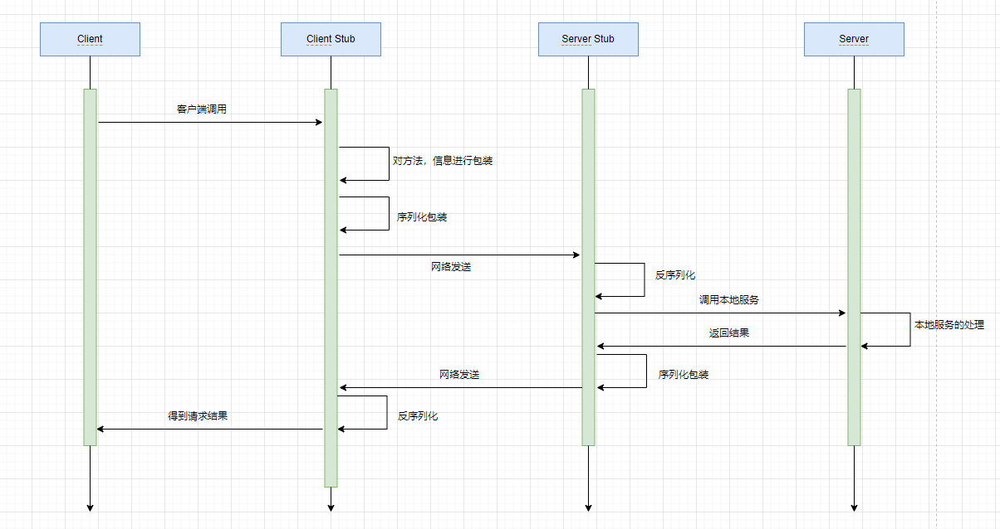

# 手写RPC（2）

今天开始就要开始我们的写代码啦，首先我们从要发送的数据开始。

🚀首先放上我的GitHub的完整项目地址：[https://github.com/Poison02/rpc-framework](https://github.com/Poison02/rpc-framework)

# 自定义协议内容

本项目是基于TCP进行端到端的通信的，我们都知道TCP在传输的时候因为数据包的大小会有粘包以及拆包的问题，通俗点就是我有两段数据，另一端收到的数据包可能不完整也可能多了。但是TCP使用各种方法如滑动窗口、拥塞控制等算法减少这种情景的出现。那我们为什么还要自定义协议呢，我认为规定好了数据包的长度以及接收的长度的话应该是不会有太大概率出现这个问题的，再者就是自定义协议能更清楚地知道我们到底发送了什么数据以及到底接受了什么数据！

为此我选择自定义协议内容的方式，不过在这之前我们得先知道**调用一个方法**最重要的是哪些东西？

- 接口名或类名（带包名的完整写法）
- 方法名
- 方法参数
- 方法参数的类型
- 返回值

在这里返回值暂时先不看，我们着重看前面四个，调用方法只有明确了这几个才能是一个完整的调用，就如果我们本地写代码，调用方法是这样的：`func(12, "12")`，因此我这里定义一个类专门记录调用方法的封装，记作 `RpcRequest`

```java
@AllArgsConstructor
@NoArgsConstructor
@Data
@Builder
@ToString
public class RpcRequest implements Serializable {

    private static final long serialVersionUID = 1905122041950251207L;

    private String requestId;

    private String interfaceName;

    private String methodName;

    private Object[] parameters;

    private Class<?>[] paramTypes;

    private String version;

    private String group;

    public String getRpcServiceName() {
        return this.getInterfaceName() + this.getGroup() + this.getVersion();
    }

}
```

这里简单解释一下这些字段：

- `serialVersionUID`，序列化ID
- `requestId`，请求ID，记录下本次请求的ID
- `interfaceName`，接口名
- `methodName`，方法名
- `parameters`，参数列表
- `paramTypes`，参数类型
- `version`，版本号，服务提供方的版本
- `group`，组，服务提供方的组

这里我再封装了一层，也就是端对端发送消息时，还未到达编解码层之前的数据封装，也就是说到达编解码之前就已经能知道这是什么消息类型或者说要用什么序列化方式了，记作 `RpcMessage`

```java
@AllArgsConstructor
@NoArgsConstructor
@Data
@Builder
@ToString
public class RpcMessage {

    private byte messageType;

    private byte codec;

    private byte compress;

    private int requestId;

    private Object data;

}
```

- `messageType`，消息类型，可能是调用的消息，也可能是心跳消息
- `codec`，序列化类型
- `compress`，压缩类型
- `requestId`，请求ID，记录每次调用
- `data`，本次消息数据，也就是存储上面说的 `RpcRequest`

OK，接下来进入正题，也就是我们的自定义协议内容到底是怎么样的呢？

```
采用自定义协议，协议如下：

0     1     2     3     4        5     6     7     8         9          10      11     12  13  14   15 16    -- 字节长度
+-----+-----+-----+-----+--------+----+----+----+------+-----------+-------+----- --+-----+-----+-------+
|   magic   code        |version | full length         |messageType| codec |compress|    requestId      |    -- 请求头
+-----------------------+--------+---------------------+-----------+-------+--------+-------------------+
|                                                                                                       |
|                                         body                                                          |    -- 请求体
|                                                                                                       |
|                                        ... ...                                                        |
+-------------------------------------------------------------------------------------------------------+

- magic code: 魔法数，通常使用4个字节表示，用来判断是否是有效数据包
- version: 版本号，使用1个字节表示，可以支持协议的升级
- full length: 请求体的长度，使用4个字节表示，表示请求体中消息的长度
- massageType: 消息类型，使用1个字节表示，表示是哪种类型的消息，如请求、响应、心跳等
- codec: 编码类型，使用1个字节表示，序列化算法类型，如Kryo、Hessian、Protostuff等
- compress: 压缩类型，使用1个字节表示，压缩算法类型，如GZIP、LZ4等
- requestId: 请求ID，使用4个字节表示，全双工通信的标志，唯一ID不能重复，提供异步能力
```

# 代理层的设计

我们先来回顾并详细看一下RPC的调用流程



这里的Stub角色要处理的工作就是我们现在要说的代理类的工作啦，我们只需要将所有工作都交给代理类去做，这样子就类似无感的本地调用啦！也不会污染原类，完美啊！

那么我们应该怎么做呢？

有两种方式，一种是**静态代理**，另一种是**动态代理**，这里我就不详细说了，一般来讲，动态代理是更好的实现，所以我用动态代理去做！

一般来讲我们都是面向接口编程，故我选择通过实现接口的方式，也就是采用`JDK`动态代理的方式而不用`CGLIB`。

JDK动态代理我们只需要实现 `InvocationHandler` 这个接口然后实现它的 `invoke()` 方法即可，具体是通过 `Proxy.newProxyInstance()`去做的。

对于动态代理这一块我就不过多描述了，可以看看这篇文章：👉[https://juejin.cn/post/6844903744954433544?searchId=2023092419330348EAB36CE81C83319CF4](https://juejin.cn/post/6844903744954433544?searchId=2023092419330348EAB36CE81C83319CF4)

我这里就大致说一下在本项目中怎么做动态代理的吧，看代码：

```java
@Slf4j
public class RpcClientProxy implements InvocationHandler {

    private static final String INTERFACE_NAME = "interfaceName";

    private final RpcRequestTransport rpcRequestTransport;

    private final RpcServiceConfig rpcServiceConfig;

    public RpcClientProxy(RpcRequestTransport rpcRequestTransport, RpcServiceConfig rpcServiceConfig) {
        this.rpcRequestTransport = rpcRequestTransport;
        this.rpcServiceConfig = rpcServiceConfig;
    }

    public RpcClientProxy(RpcRequestTransport rpcRequestTransport) {
        this.rpcRequestTransport = rpcRequestTransport;
        this.rpcServiceConfig = new RpcServiceConfig();
    }

    /**
     * 获得代理对象
     */
    @SuppressWarnings("unchecked")
    public <T> T getProxy(Class<T> clazz) {
        return (T) Proxy.newProxyInstance(clazz.getClassLoader(), new Class<?>[]{clazz}, this);
    }

    /**
     * 当你使用代理对象调用方法时，实际上会调用这个方法。
     * 代理对象就是你通过getProxy方法得到的对象。
     */
    @SneakyThrows
    @SuppressWarnings("unchecked")
    @Override
    public Object invoke(Object proxy, Method method, Object[] args) throws Throwable {
        log.info("invoked method: [{}]", method.getName());
        // 构建请求对象
        RpcRequest rpcRequest = RpcRequest.builder().methodName(method.getName())
                .parameters(args)
                .interfaceName(method.getDeclaringClass().getName())
                .paramTypes(method.getParameterTypes())
                .requestId(UUID.randomUUID().toString())
                .group(rpcServiceConfig.getGroup())
                .version(rpcServiceConfig.getVersion())
                .build();
        // 响应对象
        RpcResponse<Object> rpcResponse = null;
        if (rpcRequestTransport instanceof NettyClient) {
            // 通过CompletableFuture异步构建响应对象
            CompletableFuture<RpcResponse<Object>> completableFuture =
                    (CompletableFuture<RpcResponse<Object>>) rpcRequestTransport.sendRpcRequest(rpcRequest);
            rpcResponse = completableFuture.get();
        }
        this.check(rpcResponse, rpcRequest);

        return rpcResponse.getData();
    }

    private void check(RpcResponse<Object> rpcResponse, RpcRequest rpcRequest) {
        if (rpcResponse == null) {
            throw new RpcException(RpcErrorMessageEnum.SERVICE_INVOCATION_FAILURE, INTERFACE_NAME + ":" + rpcRequest.getInterfaceName());
        }

        if (!rpcRequest.getRequestId().equals(rpcResponse.getRequestId())) {
            throw new RpcException(RpcErrorMessageEnum.REQUEST_NOT_MATCH_RESPONSE, INTERFACE_NAME + ":" + rpcRequest.getInterfaceName());
        }

        if (rpcResponse.getCode() == null || !rpcResponse.getCode().equals(RpcResponseCodeEnum.SUCCESS.getCode())) {
            throw new RpcException(RpcErrorMessageEnum.SERVICE_INVOCATION_FAILURE, INTERFACE_NAME + ":" + rpcRequest.getInterfaceName());
        }
    }
}
```

上面不用在意那些属性，只需要看到我这里是实现了 `invocationHandler` ，然后实现了 `invoke()` 方法，就能无感代理对象了。

在使用的时候就只需要这样：

```java
RpcClientProxy rpcClientProxy = new RpcClientProxy(rpcClient, rpcServiceConfig);
Object clientProxy = rpcClientProxy.getProxy(declaredField.getType());
```

OK，今天的代理层设计就到这里，明天准备进入序列化篇章啦！